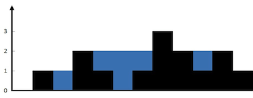

# Algorithm

## 接雨水

给定 n 个非负整数表示每个宽度为 1 的柱子的高度图，计算按此排列的柱子，下雨之后能接多少雨水。



- 输入：height = [0,1,0,2,1,0,1,3,2,1,2,1]
- 输出：6
- 解释：上面是由数组 [0,1,0,2,1,0,1,3,2,1,2,1] 表示的高度图，在这种情况下，可以接 6 个单位的雨水（蓝色部分表示雨水）。

### 思路

首先获取最高柱子的位置，记为中间位置（mid），然后分别定义两个指针从左（left）右（right）两侧向中间位置（mid）移动，并记录移动过程中的历史最大高度（wall），
如果当前高度小于历史最大高度（cur < wall），则记录下该位置水的数量（wall - cur）。

### 代码

```go
func trap(heights []int) int {
	water := 0
	left, right, mid := 1, len(heights)-2, highest(heights)
	wall := 0
	for left < mid {
		cur, prev := heights[left], heights[left-1]
		if cur < prev || cur < wall {
			if wall < prev {
				wall = prev
			}
			water += wall - cur
		}
		left++
	}
	wall = 0
	for right > mid {
		cur, next := heights[right], heights[right+1]
		if cur < next || cur < wall {
			if wall < next {
				wall = next
			}
			water += wall - cur
		}
		right--
	}
	return water
}

func highest(heights []int) int {
	pos, max := 0, 0
	for i, v := range heights {
		if v > max {
			pos, max = i, v
		}
	}
	return pos
}
```

## TODO

- 二叉排序树
- 拓扑图
- 动态规划
- 深度优先搜索
- 归并排序
- 快速排序
- 二叉堆
- TopK
- 无锁链表