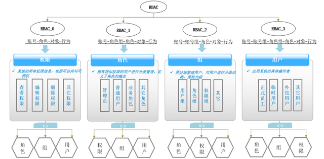
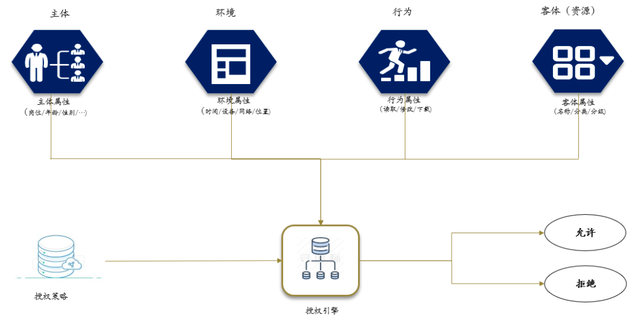

# Business

## 秒杀

秒杀特点是短时间内，大量用户涌入，集中读和写有限的库存。

层层拦截，将请求尽量拦截在系统上游，避免将锁冲落到数据库上。

### 第一层：客户端优化

产品层面，用户点击“查询”或者“购票”后，按钮置灰，禁止用户重复提交请求； JS层面，限制用户在x秒之内只能提交一次请求，比如微信摇一摇抢红包。 基本可以拦截80%的请求。

### 第二层：网关层拦截（Nginx、Spring Cloud Gateway）

怎么防止程序员写for循环调用，有去重依据么? IP? cookie-id? …想复杂了，这类业务都需要登录，用uid即可。在站点层面，对uid进行请求计数和去重，甚至不需要统一存储计数，直接站点层内存存储（这样计数会不准，但最简单，比如guava本地缓存）。一个uid，5秒只准透过1个请求，这样又能拦住99%的for循环请求。

对于5s内的无效请求，统一返回错误提示或错误页面。 这个方式拦住了写for循环发HTTP请求的程序员，有些高端程序员（黑客）控制了10w个肉鸡，手里有10w个uid，同时发请求（先不考虑实名制的问题，小米抢手机不需要实名制），这下怎么办，站点层按照uid限流拦不住了。

参考：令牌桶（Spring Cloud Gateway）、时间窗口（Sentinel）

### 第三层：服务层拦截

方案一：写请求放到队列中，每次只透有限的写请求到数据层，如果成功了再放下一批，直到库存不够，队列里的写请求全部返回“已售完”。

方案二：或采用漏斗机制，只放一倍的流量进来，多余的返回“已售完”，把写压力转换成读压力。 读请求，用cache，redis单机可以抗10W QPS,用异步线程定时更新缓存里的库存值。

还有提示“模糊化”，比如火车余票查询，票剩了58张，还是26张，你真的关注么，其实我们只关心有票和无票。

### 第四层：数据库层

浏览器拦截了80%，站点层拦截了99.9%并做了页面缓存，服务层又做了写请求队列与数据缓存，每次透到数据库层的请求都是可控的。 db基本就没什么压力了，通过自身锁机制来控制，避免出现超卖。

## 订单

SPU

SKU

生成订单号后，将订单号放入缓存，直接返回给客户端，客户端轮询订单状态，服务端异步处理创建订单，扣减库存等操作。

## 支付

生成交易流水记录后，直接返回给客户端，客户端轮询，异步拉起收银台

## 灰度

网关

服务路由

MQ 路由

线程池问题

## 海量数据

分而治之

## 即时通信

即时通讯（IM）通常需要满足：

1. 消息可靠送达（不能丢消息）；
2. 顺序性（消息顺序要保持一致）；
3. 连接可维护（支持在线状态、心跳、重连等）；
4. 可扩展性（支持多个客户端和服务端通信）。

### 目标

- 服务端可动态扩容
- 多设备同时登录接收消息（PC、Mobile、Pad、Web）
- 多设备消息投递可靠
- 多设备踢下线
- 支持消息送达、消息已读、消息撤回
- 支持服务端拉取消息

### 角色

- 注册中心
- API
- Broker
- Server

### 拓扑方案

IM系统，目前有100个服务集群，还会继续动态增加集群节点。
现在需要一种方案，使得所有服务之间可以相互通信，但是100个服务之间直接交流需要4950个TCP连接，这对系统来说是很大负担。
希望通过一种网络拓扑设计方案减少TCP连接数，并且同时能够确保消息发送高效，简单的说，就是希望在大量服务之间TCP连接数和消息转发次数做个权衡。
推荐所有可行方案。

| 类型                           | 代表方案                              | 优点             | 缺点          | 适用场景         |
|------------------------------|-----------------------------------|----------------|-------------|--------------|
| **1. 中心化 Broker 模型**         | RabbitMQ、Kafka、NATS、Redis Pub/Sub | 简单，连接数线性（O(n)） | Broker 成为瓶颈 | 一般消息总线、企业IM  |
| **2. 层次化中继拓扑**               | Hub/Leaf 模式，或区域代理                 | 可扩展，减少跨区流量     | 设计复杂        | 大规模集群分区部署    |
| **3. Gossip 协议**             | SWIM、Serf、Consul                  | 分布式、无中心        | 延迟高，重复消息多   | 状态同步、心跳传播    |
| **4. Overlay 网络（虚拟P2P层）**    | libp2p、ZeroMQ、Weave Mesh          | 分布式且自动路由       | 复杂度高        | 高动态节点集群      |
| **5. 层次化Topic分发（Pub/Sub层次）** | MQTT、NATS JetStream               | 高效的主题隔离        | 需Topic设计合理  | IM房间、群组消息    |
| **6. 自建Router中间层（多级Relay）**  | 树形、环形、K-ary树等                     | 控制转发跳数         | 需维护拓扑       | 定制IM或内部RPC系统 |

#### 方案A：消息中间层（强烈推荐）

使用类似 NATS / Kafka / RabbitMQ / Redis Stream 这样的消息中间件。

- 每个服务只需与Broker建立1个TCP连接。
- Broker负责转发、路由、持久化。
- 连接复杂度从 O(n²) 降到 O(n)。
- 消息延迟通常在 1~3ms 以内（内网部署时）。

改进策略：

- 如果Broker集群成为瓶颈，可以采用 多Broker分片 或 区域Broker + 跨区桥接。
- NATS JetStream 或 Kafka 都支持 分区与副本机制 来扩展吞吐。

适合：IM系统、在线通信、通知系统等。

#### 方案B：层次化 Router 拓扑

将节点划分为若干“路由层”和“终端层”：

- 例如：100个节点 → 10个Router节点，每个Router负责10个下属节点。
- Router之间全互联（10个Router → 45条连接）。
- 普通节点只与本地Router保持1条连接。

特征：

- 总连接数：Router互联 + n ≈ 45 + 100 = 145 条连接。
- 消息转发最多两跳（终端→Router→目标Router→终端）。

优点：

- 延迟可控，结构简单。
- Router可自动选举或按区域划分。
- 类似XMPP中的“组件路由”模式。

适合：你们自己实现IM或RPC系统，不想引入第三方中间件。

```
     +-----------+                   +------------+
     | Router #1 |----Router Mesh----| Router #10 |
     +-----------+                   +------------+
        /    |    \
      N1    N2    N3     ... 每个Router下管理10个服务节点
```

#### 方案C：Gossip协议 + 按需路由

使用Gossip/成员发现协议（如 SWIM、Serf、Consul）建立轻量邻居网络。

- 每个节点只与 k 个邻居通信（k << n）。
- 通过多跳传播消息，最终所有节点都可收到。

优点：

- 无中心、动态扩展性强。
- 抗节点故障、自动重构。
- 网络连接复杂度为 O(n)。

缺点：

- 消息延迟较高（多跳传递）。
- 存在重复消息和冗余带宽。

适合：节点数特别大（>1000）、消息小且高冗余容忍的系统（如状态同步、心跳广播）。

### 数据库选型

小型系统：有什么数据用什么数据库（MongoDB）
中大型系统：NoSQL/Cassandra
超大型系统：不知道

### 按体量设计

小型系统：2-4个节点，主要用于高可用，完全可以采用「完全互联拓扑（Full Mesh）」方式，让 Chat Server 之间直接建立 TCP 长链接进行通信。
中型系统：16-32个节点，消息中间层
大型系统：100多个节点，层次化 Router 拓扑
超大型系统：1000多个节点

## 权限系统

### Role-Based Access Control

RBAC通常应用于组织、部门、群组、角色、岗位等不同授权方式，通常包括RBAC0、RBAC1、RBAC2和RBAC3四种模型。

- RBAC0：权限最基础也是最核心的模型, 它包括用户 / 角色 / 权限, 其中用户和角色是多对多的关系, 角色和权限也是多对多的关系。
- RBAC1: 此模型引入了角色继承 (Hierarchical Role) 概念，即角色具有上下级的关系，角色间的继承关系可分为一般继承关系和受限继承关系。
- RBAC2: 基于核心模型的基础上，进行了角色的约束控制，RBAC2 模型中添加了责任分离关系。其规定了权限被赋予角色时，或角色被赋予用户时，以及当用户在某一时刻激活一个角色时所应遵循的强制性规则。责任分离包括静态责任分离和动态责任分离。
- RBAC3: 即最全面的权限管理, 它是基于 RBAC0，将 RBAC1 和 RBAC2 进行了整合。



在大型的企业应用中，通常是根据不同的工作岗位来设置，例如Manager、Employee等。每个角色被赋予一组权限，可以针对不同的资源进行某些操作。用户通常不会被直接赋予权限，而是通过分配不同的角色从而获得相应的权限。

#### 组件

- 权限Permission=资源Resource+操作Action
    - 功能权限
        - 页面权限/菜单权限
        - 按钮权限
        - 元素权限
    - 数据权限
        - 查看权限
        - 字段权限
- 授权Authorization
- 角色Role
- 权限包（拓展）Package
- 职位（拓展）Job

分配机制：

- 一个员工对应一个职位
- 一个职位对应多个角色
- 一个角色对应多个授权

例如：

- 员工：小明
    - 职位：高级财务专员
        - 角色：开票专员
            - 权限
                - 资源：发票
                - 操作：新建
        - 角色：全面预算填报员
            - 权限
                - 资源：预算填报
                - 操作：新建

多租户下如何分配角色和权限：

1. 首先会在租户管理系统，预制大部分业务场景所需要的系统级角色
2. 开通租户时，会将权限包分配给该租户
3. 租户引用系统角色，会随着系统的角色更新而更新
4. 租户管理员编辑角色，则在租户下复制一份角色，并记录系统角色ID用于回滚，此后该角色由租户管理员维护。
5. 预制角色权限不会超出权限包范围，需要取交集

### Attribute-Based Access Control

ABAC基于策略进行访问控制，即对RBAC的环境策略和行为策略进行进一步权限控制，每一条策略可以使用任何属性来定义。

通常来说，有三种类型的属性：Subject的属性、Resource的属性和系统属性。例如每个员工有一个属性“类型”，而每一个业务系统也有一个属性“部门”，
那么就可以定义一个策略，只有某个正式员工与业务系统允许访问的部门符合，那么这个员工就可以查看业务系统的具体某个业务单元。



### RBAC 与 ABAC 的区别

RBAC一般用于粗粒度的权限控制，而ABAC则用于细粒度的权限控制。例如只要是企业正式员工都可以访问培训学习系统，那么使用RBAC足以。
如果再加一条限制，任何正式员工只要在过去半年内未完成培训课程目标，那么不能学习新课程，那么就要用ABAC来控制。
通常来说，应该尽量优先使用RBAC，然后再考虑使用ABAC，但通常会将两者结合起来使用。在实际的应用中，很自然的就可以将实际的各种角色（例如员工、外包用户等）映射成RBAC中的Role，所以RBAC让人比较容易接受。
而另一方面，RBAC灵活性上的欠缺，所以需要借助于ABAC来处理各种特殊权限控制的需要。

RBAC价值主要体现在减少授权管理的复杂性、降低管理开销、灵活的支持企业的安全策略和对企业的变化有很大的伸缩性；ABAC因其灵活的授权方式，通常面向跨组织边界进行复杂的细粒度权限管理和管控。

## 分布式ID

### UUID

- 优点：使用简单，不依赖其他库，本地生成没有网络消耗，几乎不会发生碰撞
- 缺点：字符串太长，不易于存储，基于MAC地址生成UUID的算法可能会造成MAC地址泄露，对数据库索引不利

### Snowflake

- 优点：使用简单，不依赖其他库，趋势递增，性能好，几乎不会发生碰撞
- 缺点：强依赖机器时钟，如果机器上时钟回拨，会导致发号重复或者服务会处于不可用状态。如果恰巧回退前生成过一些ID，而时间回退后，生成的ID就有可能重复

### Bson ObjectId

- 优点：使用简单，不依赖其他库，性能好，几乎不会发生碰撞
- 缺点：字符串太长，不易于存储，对数据库索引不利

### 基于 Redis

- 优点：有序递增，性能好
- 缺点：引入复杂度，数据持久化丢失问题

### 基于数据库批量获取ID

- 优点：有序递增
- 缺点：性能一般（可以通过批量获取一段ID，但是会导致非严格有序）

## 短链

1. 申请一个短域名
2. 通过 MurmurHash 将 URL 转化为哈希值，然后将其作为 Key，URL 为 Value 保存到 Redis 中
3. Nginx/OpenResty 通过 lua 脚本从 Redis 中获取对应的 URL，然后 301/302 重定向。
    - 301: Permanently moved 永久性转移
    - 302: Temporarily moved 暂时性转移

Guava:

```java
Hashing.murmur3_32_fixed().

hashUnencodedChars(url)
```

## 任务调度

HTTP通信、TCP通信

### 服务端集群

- 维护任务相关信息
- 动态启用任务
- 通过分布式锁控制并发
- 注册中心或配置服务
- 任务中断
- 任务依赖
- 任务互斥
- 服务优雅下线

### 客户端集群

- 分片处理
- 保存日志（重试）
- 封装
- 文档
- 降低开发者心智负担

## 分布式事务

- 分布式事务解决方案 Seata
- 补偿机制

## 微服务治理

- 服务注册发现
- 服务负载均衡
- 服务熔断
- 服务降级
- 服务限流
- 服务依赖关系
- 服务通信（Rest、RPC、MQ）
- 服务文档
- 服务安全
- 服务上线，下线的流程
- 服务编排
- 配置管理
- 自动化测试
- 兼容性
- 资源调度
- 容量规划

## 推文点赞

将推文存到 MySQL/Postgres 等行事务数据库，将点赞存到 ClickHouse 等列数据库。

1. 用户点击点赞按钮直接在客户端将点赞设置为激活状态，然后发送请求，异步响应如果出错则将点赞取消并提示消息
2. 处理请求，写 ClickHouse 和 Redis 累计点赞总数
3. Redis 无论命没命中都直接`INCR`，如果不存在会自动从 1 开始，命令简单快速
4. 用户查看某个推文时，点赞数为数据库中的点赞数加上 Redis 中的点赞数
5. 定时每小时扫描各个 Shards 全部 Key，将 Redis 中的点赞数加到数据库，然后删除 Key
6. 不活跃的推文自然就从 Redis 中移除，活跃的推文会通过下次点赞再次在 Redis 中累计
7. 用户第二次进入到页面，通过用户ID和推文ID查询 ClickHouse 的数据判断是否已经点赞

要点：

- 接口请求不使用 MQ，而是让客户端实现伪异步，主要考虑数据库崩溃场景：避免 MQ 堆积大量消息；用户点赞后重新进入页面发现未点赞会尝试多次点击，导致出现一位用户出现多次点赞
- 通常点赞数不会要求特别精确，如果需要精确，必须通过 ClickHouse 统计，但是相应的会导致性能下降。
- 不要缓存每个用户的每个推文的点赞，避免缓存爆炸式增长，只对正在活跃的推文点赞进行累计。
- 用户点赞，则新增一条`| 用户ID | 推文ID | +1 |`的数据；用户取消点赞，则新增一条`| 用户ID | 推文ID | -1 |`的数据，类似冲销，而不是去更新原来的数据，因为ClickHouse这类数据库编辑和删除操作性能低下。
- 若因为网络抖动或各种原因，用户点了2次取消点赞，会导致点赞数出现负，此时最好使用`max(0, likes)`防止出现负点赞数。

待优化：

- 非热门推文零星点赞如何减少 Redis Key
- 如何快速扫描 Redis Key 把点赞写入数据库

## 你们IM单实例可以处理多少TCP连接

epoll 本身几乎不限制连接数，只要：

- 内核版本 ≥ 2.6；
- 使用边缘触发（ET）模式；
- 避免阻塞 I/O。

它的瓶颈主要是：

- 用户态代码的处理效率；
- 系统调用频率；
- 内存和网络栈。

在高性能服务器（如 Nginx、Redis、Netty）中，
8核8G 的机器 稳定处理 10~20 万并发连接 是常见的上限。

如何优化：

- CPU 数量 > CPU 频率
- 禁止在 EventLoop 线程中处理任何业务，例如：数据库查询、Redis操作、读写文件、网络调用
- 尽量使用零拷贝技术，例如：sendfile、transferTo
- 理解 Netty 特性和基本原理，总结最佳实践，实现最优代码，例如：Netty 4 的 Channel 处理是线程安全的，则无需通过锁进行额外处理。
