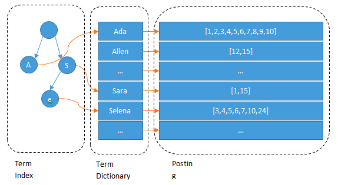
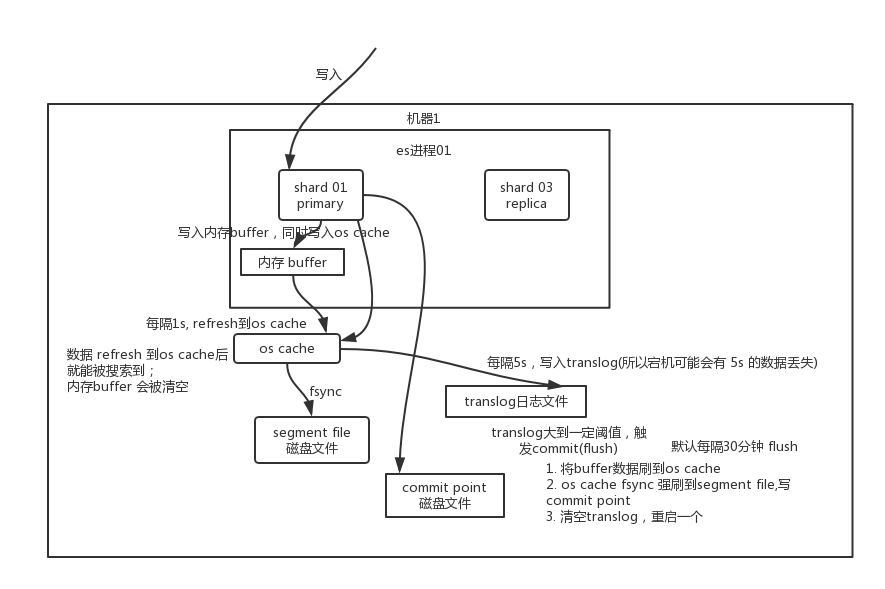
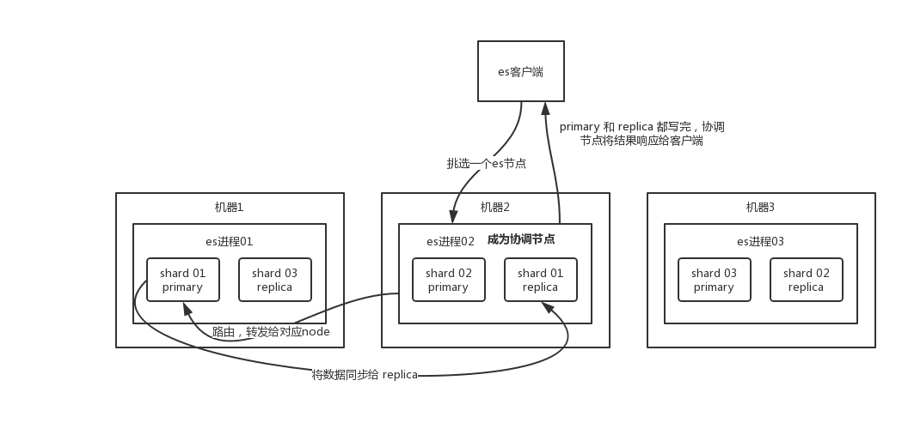

# Elasticsearch

Elasticsearch 是一个基于 Lucene 搜索引擎为核心构建的搜索服务器，它提供了一个分布式多用户能力的全文搜索引擎。
Elasticsearch 是用 Java 开发的，并作为Apache 许可条款下的开放源码发布，提供了 RESTful API 和各种语言的 SDK。
Elasticsearch 入门非常容易，它发布的时候设置了很多合理的默认值使初学者避开了那些复杂的搜素理论，能够立刻工作，即使对搜索没什么了解的人，也能使用它实现很多功能。

如果直接基于 Lucene 开发，非常复杂，即便写一些简单的功能，也要写大量的 Java 代码，需要深入理解原理。用 Elasticsearch 则会很简单，类似的 Solr 也是基于 Lucene 实现的。

Elasticsearch 不仅仅是 Lucene 和全文搜索，我们还能这样去描述它：

- 分布式的实时文件存储，每个字段都被索引并可被搜索
- 分布式的实时分析搜索引擎
- 可以扩展到上百台服务器，处理 PB 级结构化或非结构化数据

## 核心概念

### 接近实时 Near Realtime

Elasticsearch 是一个接近实时的搜索平台。这意味着，从索引一个文档直到这个文档能够被搜索到有一个轻微的延迟（通常是1秒）。

### 集群 Cluster

一个集群由一个或多个节点组织在一起，它们共同持有整个的数据，并一起提供索引和搜索功能。
一个集群由一个唯一的名字标识，默认名字是`elasticsearch`。一个节点只能通过指定某个集群的名字，来加入这个集群。
在产品环境中显式地设定这个名字是一个好习惯，但是使用默认值来进行开发/测试也是不错的。

### 节点 Node

一个节点是集群中的一个服务器，作为集群的一部分，用于存储数据，参与集群的索引和搜索功能。在一个集群里，可以拥有任意多个节点。
一个节点可以通过配置集群名称的方式来加入一个指定的集群。默认情况下，每个节点都会被安排加入到一个名为`elasticsearch`的集群中，
这意味着，如果启动了若干个节点，并假定它们能够相互发现彼此，它们将会自动地形成并加入到一个叫做`elasticsearch`的集群中。
而且，如果当前网络中没有运行任何节点，这时启动一个节点，会默认创建并加入一个名为`elasticsearch`的集群。

### 索引 Index

一个索引就是一个拥有几分相似特征的文档的集合。在一个集群中，可以定义任意多的索引。例如，可以有一个用户数据的索引，另一个产品目录的索引，还有一个订单数据的索引。
一个索引由一个名字来标识（必须全部是小写字母的），当对某个索引中的文档进行索引、搜索、更新和删除的时候，都要使用到这个名字。

### 类型 Type

在一个索引中，可以定义一种或多种类型。一个类型是索引的一个逻辑上的分类/分区，其语义完全由业务来定。通常，会为具有一组共同字段的文档定义一个类型。
例如，商品可以分为日用商品、电器商品、生鲜商品等，且每个商品对应的文档的字段可以不一样。

类型在 ElasticSearch 7 版本中已经被弃用，将在 ElasticSearch 8 版本中被彻底移除。

[Removal of mapping types](https://github.com/elastic/elasticsearch/blob/6.5/docs/reference/mapping/removal_of_types.asciidoc)

> Indices created in Elasticsearch 6.0.0 or later may only contain a single mapping type.  
> Indices created in 5.x with multiple mapping types will continue to function as before in Elasticsearch 6.x.  
> Types will be deprecated in APIs in Elasticsearch 7.0.0, and completely removed in 8.0.0.

为什么要删除映射类型：

> 最初，我们谈到索引`index`类似于数据库中的数据库`database`，类型`type`相当于表`table`。  
> 这是一个糟糕的类比，导致了错误的假设。在数据库中，表是相互独立的。一个表中的列与另一个表中的同名列无关。对于映射类型中的字段，情况并非如此。  
> 在 Elasticsearch 索引中，不同映射类型中具有相同名称的字段在内部由相同的 Lucene 字段支持。并且相同名称的字段在多种类型中必须具有相同的映射（定义）。  
> 例如，当您希望 delete 成为同一索引中一种类型的日期字段和另一种类型的布尔字段时，这可能会导致挫败感。  
> 最重要的是，在同一索引中存储具有很少或没有共同字段的不同实体会导致数据稀疏并干扰 Lucene 有效压缩文档的能力。  
> 由于这些原因，我们决定从 Elasticsearch 中删除映射类型的概念。

### 文档 Document

一个文档是一个可被索引的基础信息单元，文档以 JSON 数据格式来表示，而 JSON 是一个到处存在的互联网数据交互格式。在一个索引里，可以存储任意多的文档。

### 分片 Shard

一个索引可以存储超出单个结点硬件限制的大量数据。例如，一个具有 10 亿文档的索引占据 1TB 的磁盘空间，而任一节点都没有这样大的磁盘空间，或者单个节点处理搜索请求，响应太慢。
为了解决这个问题，Elasticsearch 提供了将索引划分成多份的能力，这就叫做分片。

分片可以分为主分片（Primary Shard）和复制分片（Replica Shard）。

### 复制 Replica

在一个网络的环境里，失败随时都可能发生，某个分片/节点发生崩溃故障，这种情况下，通过故障转移机制可以保证数据不丢失和系统稳定。
为此目的，Elasticsearch 允许创建分片的一份或多份拷贝，这些拷贝叫做复制分片。复制分片不仅负责容错，而且还承担读请求负载。

## 倒排索引 Inverted Index

在搜索引擎中，每个文档都有一个对应 DocID ，文档内容被表示为一系列关键词的集合。例如，某个文档经过分词，提取了 n 个关键词，每个关键词都会记录它在文档中出现的次数和出现位置。
倒排索引就是关键词到 DocID 的映射，每个关键词都对应着一系列的文件，这些文件中都出现了该关键词。通过倒排索引，可以根据关键词快速定位到包含这个单词的文档。

倒排索引主要由几个部分组成：

- 单词（Term）：一段文本经过分析器分析后提取到的单词。
- 单词索引（Term Index）：为了更快的找到某个单词而建立的索引。
- 单词词典（Term Dictionary）：搜索引擎的通常索引单位是单词，单词词典是由文档集合中出现过的所有单词构成的字符串集合，单词词典内每条索引项记载单词本身的一些信息以及指向倒排列表的指针。
- 倒排列表（Posting List）：倒排列表记载了出现过某个单词的所有文档的文档列表及单词在该文档中出现的位置信息，每条记录称为一个倒排项（Posting）。根据倒排列表，即可获知哪些文档包含某个单词。
- 倒排文件（Inverted File）：所有单词的倒排列表往往顺序地存储在磁盘的某个文件里，这个文件即被称之为倒排文件，倒排文件是存储倒排索引的物理文件。



假设存在以下文档：

1. 乔布斯去了中国。
2. 苹果今年仍能占据大多数触摸屏产能。
3. 苹果公司首席执行官史蒂夫·乔布斯宣布，iPad2将于3月11日在美国上市。
4. 乔布斯推动了世界，iPhone、iPad、iPad2，一款一款接连不断。
5. 乔布斯吃了一个苹果。

通过这 5 个文档建立简单的倒排索引：

| 单词ID（WordID） | 单词（Word） | 倒排列表（DocID） |
|:-------------|:---------|:------------|
| 1            | 乔布斯      | 1，3，4，5     |
| 2            | 苹果       | 2，3，5       |
| 3            | iPad2    | 3，4         |
| 4            | 宣布       | 3           |
| …            | …        | …           |

倒排索引会过滤一些没有必要建立索引的单词，比如，“的”、“而”、“则”等停顿词，可以认为是没有意义的词。

实际上倒排索引包含信息更多，例如：

- TF（Term Frequency）：单词在文档中出现的次数。
- Pos（Position）：单词在文档中出现的位置。

## Doc Values

当你对一个字段进行排序时，Elasticsearch 需要访问每个匹配到的文档得到相关的值。倒排索引的检索性能是非常快的，但是在字段值排序时却不是理想的结构。

- 在搜索的时候，我们能通过搜索关键词快速得到结果集。
- 当排序的时候，我们需要倒排索引里面某个字段值的集合。换句话说，我们需要正排索引。

正排索引结构在其他系统中经常被称作列存储。实际上，它将所有单字段的值存储在单数据列中，这使得对其进行操作是十分高效的，例如排序。

在 Elasticsearch 中，Doc Values 就是一种列式存储结构，默认情况下每个字段的 Doc Values 都是激活的，Doc Values 是在索引时创建的，
当字段索引时，Elasticsearch 为了能够快速检索，会把字段的值加入倒排索引中，同时它也会存储该字段的 Doc Values。它常被应用到以下场景：

- 对一个字段进行排序
- 对一个字段进行聚合
- 某些过滤，比如地理位置过滤
- 某些与字段相关的脚本计算

因为文档值被序列化到磁盘，我们可以依靠操作系统的帮助来快速访问。当工作集（working set）远小于节点的可用内存，系统会自动将所有的文档值保存在内存中，使得其读写十分高速；
当其远大于可用内存，操作系统会自动把 Doc Values 加载到系统的页缓存中，避免 JVM 堆内存溢出异常。

## 分布式架构

### 写数据底层原理



数据先写入 memory buffer，然后定时（默认每隔 1 秒）将 memory buffer 中的数据写入一个新的 segment 文件中，并进入 filesystem cache，同时清空 memory buffer，这个过程就叫做 refresh。

由于 memory buffer 每 refresh 一次，就会产生一个 segment 文件，长此以往，会导致 segment 文件越来越多，因此需要定期执行合并操作。
合并操作每次会将多个 segment 文件合并成一个，然后将新的 segment 文件写入磁盘。合并之后创建一个新的 commit point（提交点），标识所有新的 segment 文件，然后打开 segment 文件供搜索使用，同时删除旧的 segment 文件。

数据存在 memory buffer 时是搜索不到的，只有数据被 refresh 到 filesystem cache 之后才能被搜索到，而 refresh 是每秒一次，所以称 Elasticsearch 是接近实时的，可以通过手动调用 API 触发一次 refresh 操作，让数据马上可以被搜索到。

由于 memory buffer 和 filesystem cache 都是基于内存，假设服务器宕机，那么数据就会丢失，所以 Elasticsearch 通过 translog 日志文件来保证数据的可靠性，
在数据写入 memory buffer 的同时，将数据写入 translog 日志文件中，在机器宕机重启时，会自动读取 translog 日志文件中的数据，恢复到 memory buffer 和 filesystem cache 中去。

需要注意的是，translog 也是先写入 filesystem cache，然后默认每隔 5 秒刷一次到磁盘中，所以默认情况下，可能有 5 秒的数据会仅仅停留在 memory buffer 或者 translog 文件的 filesystem cache 中，而不在磁盘上，
如果此时机器宕机，会丢失 5 秒钟的数据。也可以将 translog 设置成每次写操作必须是直接 fsync 到磁盘，但是性能会差很多。

不断重复上述的步骤会导致 translog 越来越大，当 translog 文件默认每 30 分钟或者文件大小超过阈值 512M 时，就会触发 commit 操作，即 flush 操作。

- 将 memory buffer 中的数据 refresh 到 filesystem cache 中去，同时清空 memory buffer。
- 创建一个新的 commit point（提交点），同时强行将 filesystem cache 中目前所有的数据都 fsync 到磁盘文件中。
- 删除旧的 translog 日志文件并创建一个新的 translog 日志文件，此时 commit 操作完成。

### 写数据过程



1. 客户端选择一个节点发送请求，该节点即为协调节点。
2. 协调节点对文档进行路由，将请求转发给对应主分片的节点。
3. 主分片的节点处理请求，并将数据同步到所有复制分片。
4. 主分片和所有复制分片都执行成功之后，协调节点返回响应结果给客户端。

### 读数据过程

1. 客户端选择一个节点发送请求，该节点即为协调节点。
2. 协调节点通过 DocID 进行哈希路由，将请求转发到对应的节点，这里会使用负载均衡策略，在主分片和复制分片中选择一个进行读操作。
3. 接收请求的节点返回文档给协调节点。
4. 协调节点返回文档给客户端。

### 搜索数据过程

1. 客户端选择一个节点发送请求，该节点即为协调节点。
2. 协调节点将搜索请求转发到所有的分片上（主分片和复制分片均可）。
3. 每个分片将自己的搜索出来的 DocId 和排序值返回给协调节点，由协调节点进行数据的合并、排序、分页等操作，生成最终结果。
4. 协调节点根据 DocId 去各个节点上拉取实际的文档数据，最终返回给客户端。

### 删除/更新数据底层原理

由于 Elasticsearch 中的文档是不可变的，所以，实际上删除和更新都是写操作，磁盘上的每个 segment 文件都有一个相应的`.del`文件，利用`.del`文件标记文档是否被删除，

- 删除操作：文档并没有被真正的被删除，而是在`.del`文件中被标记为`deleted`状态。该文档依然能匹配查询，但是会在结果中被过滤掉。
- 更新操作：将旧的文档标识为`deleted`状态，然后创建一个新的文档。

每次合并 segment 文件的时候，不会将标识为`deleted`的文档写入到新的 segment 中，即物理删除。

## 生产问题

### 在高并发下如何保证读写一致性

#### 更新操作

通过版本号使用乐观并发控制，以确保新版本不会被旧版本覆盖

每个文档都有一个`_version`版本号，这个版本号在文档被改变时加 1。Elasticsearch 通过`_version`保证所有修改都被正确排序。当一个旧版本出现在新版本之后，它会被简单的忽略。

利用`_version`的这一优点确保数据不会因为修改冲突而丢失。例如，指定文档的`_version`进行更新，如果版本号不匹配，则请求就失败了。

#### 写操作

`consistency`一致性级别支持：`quorum`、`one`、`all`，默认为`quorum`，即只有当大多数分片可用时才允许写操作。
但即使大多数可用，也可能存在因为网络等原因导致写入副本失败，这样该副本被认为故障，分片将会在一个不同的节点上重建。

- `one`：只要有一个主分片是活跃可用的时候，就可以执行写操作。
- `all`：所有的主分片和复制分片都是活跃的时候，才可以执行写操作。
- `quorum`：大部分的分片都是活跃的时候，才可以执行写操作。

#### 读操作

可以设置`replication`为`sync`(默认)，这使得操作在主分片和复制分片都完成后才会返回。
如果设置`replication`为`async`时，可以通过设置搜索请求参数`_preference`为`primary`来查询主分片，确保文档是最新版本。

### 如何避免脑裂

- 当集群中 master 候选节点数量不小于 3 个时，可以通过设置`discovery.zen.minimum_master_nodes`最少投票通过数量，设置超过所有候选节点一半以上来解决脑裂问题.
- 当集群中 master 候选节点只有 2 个时，最好把其中一个`node.master`改成`false`，使其无法称为`master`，也就避免了脑裂。

在 Elasticsearch 7.0 中，`discovery.zen.minimum_master_nodes`已经被移除，选举相关功能由 Elasticsearch 自身管理，快快了选举的速度，也就避免了脑裂的问题。

### 提升建立索引阶段性能的方法

1. 使用 SSD 存储介质。
2. 使用批量请求并调整其大小，每次批量数据 5–15 MB 是个不错的起始点。
3. 如果你在做大批量导入，考虑通过设置`index.number_of_replicas: 0`关闭副本。
4. 如果你的搜索结果不需要近实时的准确度，考虑通过设置`index.refresh_interval: 30s`把每个索引的 refresh 间隔改为 30 秒。
5. 合并 segment 文件操作，Elasticsearch 默认值是 20 MB/s。但如果用的是 SSD，可以考虑提高到 100–200 MB/s。如果你在做批量导入，完全不在意搜索，可以彻底关掉合并限流。
6. 通过设置`index.translog.flush_threshold_size`扩大 translog 文件大小的阈值，从默认的 512 MB 到更大一些的值，比如 1 GB。

### 数据量很大的情况下如何提高查询效率

#### filesystem cache

Elasticsearch 依赖于底层的 filesystem cache，如果给 filesystem cache 更多的内存，尽量多让内存可以容纳索引数据文件，搜索的时候大部分都通过内存，性能会非常高。

#### 数据预热

~~感觉没啥用~~

#### 冷热分离

将访问频率较高的数据和访问频率较低的数据水平拆分，分别放到 2 个索引中，热点数据往往数量不会很多，可以尽可能这些数据留在 filesystem cache 中，通过内存可以大幅度提高性能。
将冷热数据的分片部署到不同的服务器上，保证热点数据不会被冷数据占用 filesystem cache 空间，避免出现频繁加载磁盘的情况。

#### 文档优化

Elasticsearch 擅长搜索，而不擅长计算，所以应该保证在 Elasticsearch 中的数据是完整的，即拿即用。例如，将 MySQL 中多张表数据，通过业务代码聚合后，再同步至 Elasticsearch 中，这样搜索出来的结果可以直接使用。
但是这样存在一个问题，如果聚合的逻辑发生变化，那么 Elasticsearch 中旧数据可能均需要更新。

#### 禁用深度分页

深度分页是指在搜索时，指定了一个较大的页码数，例如，搜索第 1000 页的 10 条数据，每个分片会返回前 10000 条数据给协调节点，如果有 5 个分片，协调节点则需要需要处理共 50000 条数据，在内存中对数据进行合并排序，最后返回第 1000 页的 10 条数据给客户端。
这个过程会造成性能问题，耗费大量内存和占用大量 CPU 资源。所以，应该禁用深度分页。

实际上，Elasticsearch 默认不支持超过 10000 数据的查询操作，即默认只能查询前 10000 条数据，虽然可以通过`index.max_result_window`配置进行修改限制。

#### 使用滚动搜索

通过观察热门的社交、购物、即时聊天等软件，我们可以发现，滚动搜索是普遍被采用的方案，用户只能通过上划屏幕或者点击下一页进行加载更多数据，而不允许通过指定某一页来搜索。

##### scroll

Elasticsearch 提供了 scroll 接口可以实现滚动搜索的功能。其原理是，首次搜索时，会生成一个带存活时间的数据快照，因为是快照，所以期间数据发生变化，不会对搜索结果造成影响。

假设存在一个名为`data`的索引，搜索时指定快照存活时间为`5m`，请求示例如下:

```cURL
curl -X GET "http://localhost:9200/data/_search?scroll=5m" \
    -H "Content-Type: application/json" \
    -d "{
          \"size\": 10,
          \"query\": {
            \"match_all\": {}
          }
        }"
```

如果请求成功，返回的格式如下所示：

```json
{
    "_scroll_id":"FGluY2x1ZGVfY29udGV4dF91dWlkDXF1ZXJ5QW5kRmV0Y2gBFnJKSDR2SjN3Um5LdjMtSmQyWUNnVHcAAAAAAAAAOxZqNnlHRVJld1FJU2d5eDdRRE9EZURR",
    "took":10,
    "timed_out":false,
    "_shards":{
        "total":1,
        "successful":1,
        "skipped":0,
        "failed":0
    },
    "hits":{
        "total":{
            "value":100,
            "relation":"eq"
        },
        "max_score":1,
        "hits":[ /*忽略*/ ]
    }
}
```

接下来的每一次搜索请求，不需要再指定`index`和`type`，只需要传`scroll_id`参数即可。同时也可以指定`scroll`参数，保证用户持续不断翻页时，不会因为快照过期而失败，请求示例如下:

```cURL
curl -X GET "http://localhost:9200/_search/scroll?scroll=5m&scroll_id=FGluY2x1ZGVfY29udGV4dF91dWlkDXF1ZXJ5QW5kRmV0Y2gBFnJKSDR2SjN3Um5LdjMtSmQyWUNnVHcAAAAAAAAAOxZqNnlHRVJld1FJU2d5eDdRRE9EZURR" \
    -H "Content-Type: application/json" \
```

显然，使用 scroll 并不是完美解决了所有问题，它不仅需要占用服务器资源保存数据快照，而且只支持搜索下一页，不支持搜索上一页。

##### search_after

除了 scroll 接口，我们还可以使用 Elasticsearch 提供 search_after 功能实现翻页，其思想是使用前一页的结果来帮助检索下一页的数据，显然，这种方式也不允许用户随意翻页。

假设存在一个名为`data`的索引，搜索时指定`sort`排序字段为`code`升序排序，请求示例如下:

```cURL
curl -X GET "http://localhost:9200/data/_search" \
    -H "Content-Type: application/json" \
    -d "{
          \"size\": 10,
          \"from\": 0,
          \"sort\": [
            {
              \"code\": {
                \"order\": \"asc\"
              }
            }
          ]
        }"
```

如果请求成功，保留请求中返回的最后一条数据排序字段的值，假设最后一条数据的`code`值为`100`，则第二次请求示例如下:

```cURL
curl -X GET "http://localhost:9200/data/_search" \
    -H "Content-Type: application/json" \
    -d "{
          \"size\": 10,
          \"from\": 0,
          \"sort\": [
            {
              \"code\": {
                \"order\": \"asc\"
              }
            }
          ],
          \"search_after\": [
            \"100\"
          ]
        }"
```