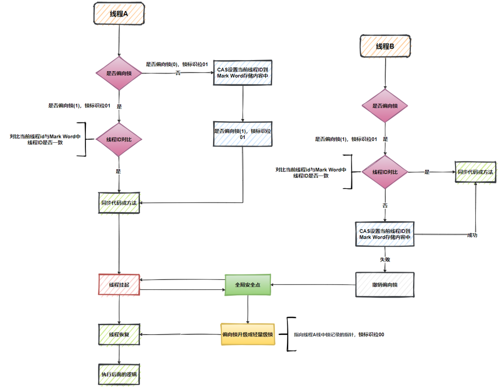
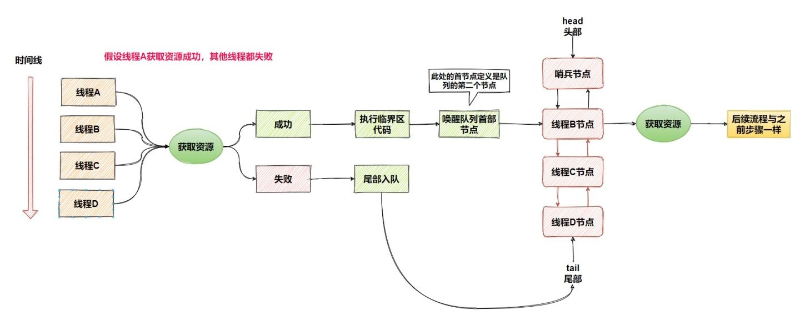
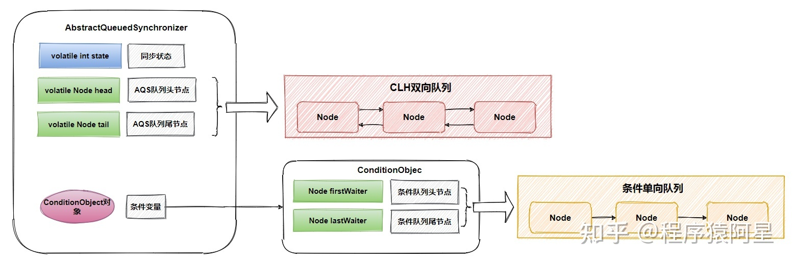
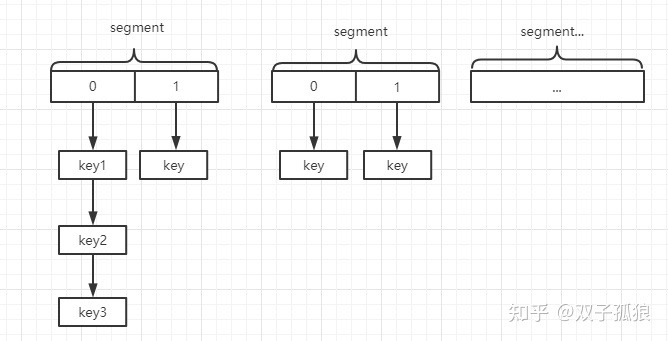
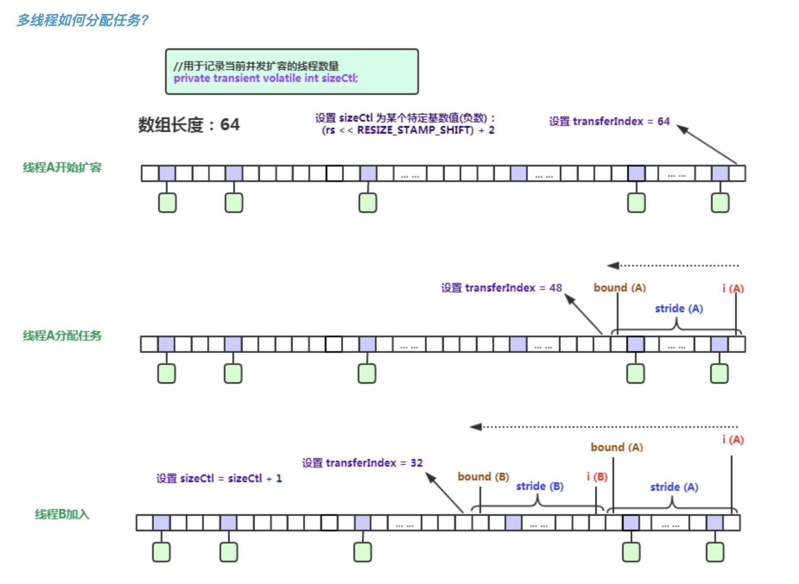
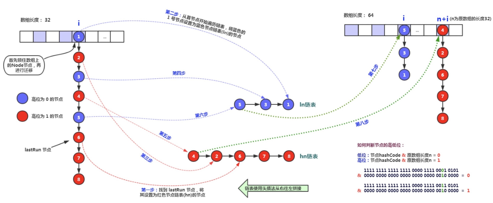
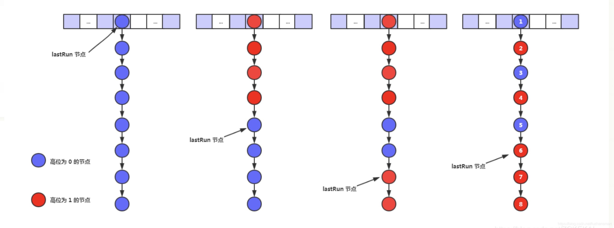
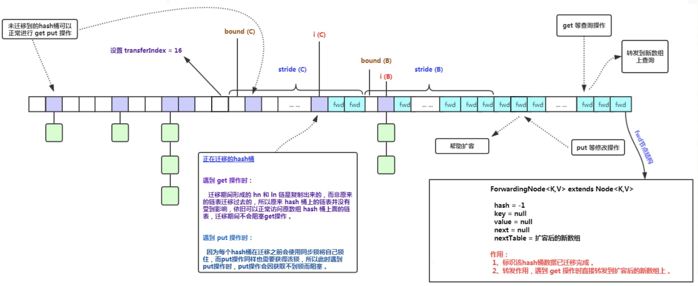

# Java

## Strings 字符串

- `String`是`final`修饰的类，不可变，不可继承。
- `StringBuilder`可变，线程不安全，速度快。
- `StringBuffer`可变，线程安全，速度慢。
- 判断字符串值是否相等用`equals()`，判断对象地址是否相等用`==`。
- `Java 7`版本`switch`支持字符串。
- `Java 7`版本`intern()`方法，如果常量池中已存在，则返回常量池中的字符串，否则常量池引用指向当前字符串在堆中的地址。
  而`Java 6`版本`intern()`方法，如果常量池中已存在，则返回常量池中的字符串，否则复制一份字符串到常量池中，并返回复制的字符串。
- `trim()`方法移除字符串首尾的空白字符（空格、tab键、换行符），`Java 11`版本新增`strip()`方法支持移除`Unicode`空白字符。
- 可以自定义`java.lang.String`类并编译成功，但不会被加载使用。
- `Java 9`版本使用`byte[]`替换`char[]`来储存字符串，并新增`coder`字段区分编码类型（`LATIN1`、`UTF16`），目的是为了节约空间。

## Collections 集合

### ArrayList

- 基于数组实现
- 有序，允许重复
- 通过索引定位效率高
- 头部新增/删除操作性能低（需要移动元素）
- 中部新增/删除操作性能低（需要移动元素）
- 尾部新增/删除操作性能高
- 初始容量为`10`，按`1.5`倍扩容
- 内存连续，空间利用率高
- 线程不安全
- 允许`null`值

### LinkedList

- 基于链表实现
- 有序，允许重复
- 通过索引定位效率低
- 头部新增/删除操作性能高
- 中部新增/删除操作性能低（要遍历至指定位置）
- 尾部新增/删除操作性能高
- 不需要扩容
- 内存不连续，空间利用率低
- 线程不安全
- 允许`null`值

### HashSet

- 基于`HashMap`实现
- 无序，不允许重复
- 元素对象需要实现`hashCode()`方法和`equals()`方法
- 允许`null`值

### TreeSet

- 基于`TreeMap`/`SortedMap`实现
- 有序，不允许重复（非插入顺序，而是根据指定的`Comparator`比较器）
- 元素对象需要实现`Comparable`接口的`compareTo()`方法和`equals()`方法
- 不允许`null`值

### HashMap

- 无序，不允许`key`重复
- `key`对象需要实现`hashCode()`方法和`equals()`方法
- 允许`key`和`value`为`null`值
- `Java 8`版本后引入了红黑树，优化了扩容方法
- 哈希表`table`会在第一次使用时初始化，并根据需要进行扩容，且长度始终是`2`的幂
- 哈希表`table`的链表长度超过`8`时，会将链表转换成红黑树
- 扩容阈值`threshold`，当元素数量大于阈值时会触发扩容，值为`capacity * loadFactor`
- 负载因子`loadFactor`，它与`threshold`结合起作用，默认值是`0.75`

#### `put(K key, V value)`方法

```java
public V put(K key, V value) {
    return putVal(hash(key), key, value, false, true);
}

final V putVal(int hash, K key, V value, boolean onlyIfAbsent,
               boolean evict) {
    Node<K,V>[] tab; Node<K,V> p; int n, i;
    // 1.如果table，则调用resize初始化
    if ((tab = table) == null || (n = tab.length) == 0)
        n = (tab = resize()).length;
    // 2.通过hash计算索引，并判断node是否存在，如果不存在则创建新node并添加元素，否则执行第3步
    if ((p = tab[i = (n - 1) & hash]) == null)
        tab[i] = newNode(hash, key, value, null);
    else {
        Node<K,V> e; K k;
        // 3.如果node存在，且node的hash和key与待保存元素的hash和key相等，则覆盖value
        if (p.hash == hash &&
            ((k = p.key) == key || (key != null && key.equals(k))))
            e = p;
        // 4.如果node类型为TreeNode，则向红黑树中插入元素
        else if (p instanceof TreeNode)
            e = ((TreeNode<K,V>)p).putTreeVal(this, tab, hash, key, value);
        // 5.遍历链表
        else {
            for (int binCount = 0; ; ++binCount) {
                // 5.1.遍历至node的next为null时，向后追加元素，并结束遍历
                if ((e = p.next) == null) {
                    p.next = newNode(hash, key, value, null);
                    // 5.2.如果链表长度超过可树化的阈值时，将链表转化为红黑树
                    if (binCount >= TREEIFY_THRESHOLD - 1) // -1 for 1st
                        treeifyBin(tab, hash);
                    break;
                }
                // 5.3.遍历至当前node的hash和key与待保存元素的hash和key相等时，覆盖value，并结束遍历
                if (e.hash == hash &&
                    ((k = e.key) == key || (key != null && key.equals(k))))
                    break;
                p = e;
            }
        }
        if (e != null) { // existing mapping for key
            V oldValue = e.value;
            if (!onlyIfAbsent || oldValue == null)
                e.value = value;
            afterNodeAccess(e);
            return oldValue;
        }
    }
    ++modCount;
    // 6.当前元素数量超过扩容阈时调用resize方法进行扩容
    if (++size > threshold)
        resize();
    afterNodeInsertion(evict);
    return null;
}
```


#### `hash(Object key)`方法

在`Java 8`中优化了`hash()`算法，通过将`key`的`hashCode`值的高`16`位与低`16`位使用`^`运算符操作获得的值，
不仅能保证`hash`方法的高效，还使`hashCode`的高低位都参与计算，实现减少冲突的目的。

```java
static final int hash(Object key) {
    int h;
    return (key == null) ? 0 : (h = key.hashCode()) ^ (h >>> 16);
}
```


#### `resize()`方法


只需要`hash`值的新高位是`0`还是`1`即可确定新索引，即`0`表示索引不变，`1`表示新索引为原索引加原容量。

这种扩容的实现方式非常巧妙，不但优化了`Java 7`及之前的版本中重新计算`hash`的性能损耗的问题，而且由于扩容后`hash`的新高位的值（`0`或`1`
）可以认为是随机的，因此把扩容前冲突的节点均匀地分散到新的`bucket`。

有一点注意的是，在`Java 7`及之前的版本中，链表冲突采用的是**头插法**，即新增的冲突元素会被插到链表的头部。
所以在旧链表迁移新链表时，链表元素会倒置，在多个线程同时进行`put(K, V)`操作，并且同时进行扩容时，可能会出现链表环导致死循环的问题。
`Java 8`版本采用的是**尾插法**，所以不会倒置，但这并不意味着在并发场景下不会出现死循环，可能造成死循环的操作例如：并发场景下将链表转换为树、对树进行并发操作。

_在并发场景中，应该使用线程安全的`ConcurrentHashMap`_

### LinkedHashMap

- 有序，不允许重复
- `key`对象需要实现`hashCode()`方法和`equals()`方法
- 允许`key`和`value`为`null`值

`LinkedHashMap`是`HashMap`的一个子类，由于其内部维护了一个双向链表，因此可以按插入顺序遍历元素。
此外，`LinkedHashMap`可以很好的支持`LRU (Least Recently Used)`算法，调用构造方法时将`accessOrder`设置为`true`，即可按照访问次序排序。

### TreeMap

- 有序，不允许重复（非插入顺序，而是根据指定的`Comparator`比较器）
- 元素对象需要实现`Comparable`接口的`compareTo()`方法和`equals()`方法
- 不允许`key`为`null`值，允许`value`为`null`值

`TreeMap`实现了`SortedMap`接口。由于其是基于红黑树实现的，因此`key`必须实现`Comparable`接口或在调用构造方法时指定`Comparator`，
否则会在运行时抛出`java.lang.ClassCastException`异常。

#### Red–black tree 红黑树

红黑树是每个节点都带有颜色属性的二叉查找树，颜色为红色或黑色。在二叉查找树强制一般要求以外，对于任何有效的红黑树我们增加了如下的额外要求：

- 根是黑色。
- 节点是红色或黑色。
- 所有叶子都是黑色（叶子是NIL节点）。
- 每个红色节点必须有两个黑色的子节点。（或者说从每个叶子到根的所有路径上不能有两个连续的红色节点；或者说不存在两个相邻的红色节点，相邻指两个节点是父子关系；或者说红色节点的父节点和子节点均是黑色的。）
- 从任一节点到其每个叶子的所有简单路径都包含相同数目的黑色节点。


#### 对比 AVL tree (Adelson-Velsky and Landis Tree)

`Red–black tree`和`AVL tree`都是平衡二叉查找树，区别如下：

- 插入：`Red–black tree`和`AVL tree`都是最多两次树旋转来实现复衡，旋转的时间复杂度均是`O(1)`。
- 删除：`Red–black tree`最多只需要旋转3次实现复衡，时间复杂度是`O(1)`。`AVL tree`需要维护从根节点到被删除节点路径上所有节点的平衡，旋转的时间复杂度是`O(logN)`。
- 搜索：`Red–black tree`不是"完全平衡"的平衡二叉查找树，而`AVL tree`是高度平衡的，因此`AVL tree`的搜索效率更高。

总结：`Red–black tree`相对于`AVL tree`来说，牺牲了部分平衡性以换取插入/删除操作时少量的旋转操作，整体来说性能要优于`AVL tree`。

#### 对比 B-tree / B+tree

`B-tree`和`B+tree`都是平衡多路查找树，与平衡二叉查找树不同，`B-tree`和`B+tree`适用于读写相对大的数据块的存储系统，例如磁盘。

`B-tree`和`B+tree`高度都不高，尤其是`B+tree`非叶子结点不存储数据，所以看上去会更加“矮胖”。
如果用`B-tree`和`B+tree`在数据量不多的场景下，数据都会“挤在”一个结点中，遍历效率就退化成了链表。

总结：`Red–black tree`多用于内存中排序，`B-tree`和`B+tree`主要用于数据存储在磁盘上的场景。

### HashTable

- 无序，不允许`key`重复
- `key`对象需要实现`hashCode()`方法和`equals()`方法
- 不允许`key`和`value`为`null`值

`HashTable`是遗留类，与`HashMap`类似，不同的是它承自`Dictionary`类，由于其均方法使用`synchronized`修饰，因此是线程安全的，但并发性远不如`ConcurrentHashMap`，不建议使用。

### Collections.synchronizedMap()

`Collections.synchronizedMap()`方法需要传入一个`Map`对象，并返回一个`SynchronizedMap`对象，其原理为包装原`Map`对象，并通过`mutex`互斥锁对所有方法进行加锁，所以其性能不佳，应该优先考虑使用`ConcurrentHashMap`。

```java
public static <K,V> Map<K,V> synchronizedMap(Map<K,V> m) {
    return new SynchronizedMap<>(m);
}

private static class SynchronizedMap<K,V>
    implements Map<K,V>, Serializable {
    private static final long serialVersionUID = 1978198479659022715L;

    private final Map<K,V> m;     // Backing Map
    final Object      mutex;        // Object on which to synchronize

    SynchronizedMap(Map<K,V> m) {
        this.m = Objects.requireNonNull(m);
        mutex = this;
    }

    SynchronizedMap(Map<K,V> m, Object mutex) {
        this.m = m;
        this.mutex = mutex;
    }
    
    public int size() {
        synchronized (mutex) {return m.size();}
    }
    public boolean isEmpty() {
        synchronized (mutex) {return m.isEmpty();}
    }
    public boolean containsKey(Object key) {
        synchronized (mutex) {return m.containsKey(key);}
    }
    public boolean containsValue(Object value) {
        synchronized (mutex) {return m.containsValue(value);}
    }
    public V get(Object key) {
        synchronized (mutex) {return m.get(key);}
    }

    public V put(K key, V value) {
        synchronized (mutex) {return m.put(key, value);}
    }
    public V remove(Object key) {
        synchronized (mutex) {return m.remove(key);}
    }
    public void putAll(Map<? extends K, ? extends V> map) {
        synchronized (mutex) {m.putAll(map);}
    }
    public void clear() {
        synchronized (mutex) {m.clear();}
    }
}
```

## Locks 锁

Java中有两种加锁的方式：一种是用`synchronized`关键字，另一种是用`Lock`接口的实现类。

|        | synchronized | Lock                                                            |
|:-------|:-------------|:----------------------------------------------------------------|
| 作用域    | 方法和代码块       | 代码块                                                             |
| 实现方式   | 对象头          | AbstractQueuedSynchronizer                                      |
| 是否可重入  | 可重入          | 根据实现类，例如`ReentrantLock`和`ReentrantReadWriteLock`可重入             |
| 是否是公平锁 | 非公平锁         | 根据实现类，例如`ReentrantLock`和`ReentrantReadWriteLock`可通过构造方法指定公平或非公平 |
| 是否可释放锁 | 不可释放         | 可释放，有`void unlock();`方法                                         |

### synchronized 使用方法

- 修饰在非静态方法上时，锁当前对象。
- 修饰在静态方法上时，锁当前类。
- 作用在代码块并指定对象时，锁指定对象。
- 作用在代码块并指定类时，锁指定类。

### synchronized 锁膨胀

过程：无锁 -> 偏向锁 -> 轻量级锁 -> 重量级锁

- 偏向锁状态可以被重置为无锁状态
- 偏向锁升级为轻量级锁不能再降级为偏向锁
- 轻量级锁升级为重量级锁不能再降级为轻量级锁（为了避免无效自旋防止CPU空转）

#### Mark Word


#### 1. 无锁

当对象的Monitor对象没有被线程所持有，代表的是对象处于无锁状态。

#### 2. 偏向锁

偏向锁是`Java 6`后面引起的一项锁优化技术，在无锁竞争的情况下，一个线程通过一次`CAS`操作来尝试将对象头中的`Thread ID`
设置为自己的线程号，偏向锁的标识是否设置成1，锁标志位是否为01，如果设置成功，则获得锁。

具体过程如下：
当`线程A`访问代码块并获取锁对象时，会在`Java`对象头和栈帧中记录偏向的锁的`Thread ID`，
由于偏向锁不会主动释放锁，因此之后`线程A`再次获取锁的时候，只需要比较`线程A`的`Thread ID`和Java对象头中的`Thread ID`是否一致，如果一致则还是该线程获取锁对象。

若之后有一个新的`线程B`想要获取锁，而锁的对象头中的`Thread ID`还是原来`线程A`的，则需要判断`线程A`是否存活

- 如果`线程A`是非存活状态：锁对象将被重置为无锁状态，新的线程可以将其设置为偏向锁。
- 如果`线程A`是存活状态，找到`线程A`的栈帧信息，
    - 如果`线程A`需要继续持有这个锁对象，说明存在锁的竞争，当到达`safepoint`（指在这个时间点上没有字节码正在执行）时获得偏向锁的`线程B`
      被挂起，偏向锁升级为轻量级锁，然后被阻塞在安全点的`线程A`继续往下执行同步代码。
    - 如果`线程A`不再使用该锁对象，那么将锁对象状态设为无锁状态，重新偏向新的`线程B`。

偏向锁能够减少无竞争锁定时的开销。
偏向锁的目的是假定`monitor`一直由某个特定线程持有，直到另一个线程尝试获取它，这样就可以避免获取`monitor`时执行`CAS`的原子操作。
`monitor`首次锁定时偏向该线程，这样就可以避免同一对象的后续同步操作步骤需要原子指令。



从历史上看，偏向锁使得 JVM 的性能得到了显著改善。

然而`Java 15`版本废弃了偏向锁：[JEP 374: Disable and Deprecate Biased Locking](https://openjdk.java.net/jeps/374)

> 过去看到的性能提升在今天远不那么明显。
> 许多受益于偏向锁定的应用程序是使用早期 Java 集合 API 的旧的遗留应用程序，这些 API 在每次访问时都会同步（例如：Hashtable 和 Vector）。
> 较新的应用程序通常使用 Java 1.2 中针对单线程场景引入的非同步集合（例如：HashMap 和 ArrayList），或者使用 Java 5 中针对多线程场景引入的性能更高的并发数据结构。
> 这意味着如果更新代码以使用这些较新的类，由于不必要的同步而受益于偏向锁定的应用程序可能会看到性能改进。此外，围绕线程池队列和工作线程构建的应用程序通常在禁用偏向锁定的情况下性能更好。
>
> 偏向锁定在同步子系统中引入了许多复杂的代码，并且还侵入了其他 HotSpot 组件。这种复杂性是理解代码各个部分的障碍，也是在同步子系统内进行重大设计更改的障碍。为此，我们希望禁用、弃用并最终移除对偏向锁定的支持。
>
> 在 JDK 15 之前，偏向锁定始终处于启用状态且可用。`-XX:+UseBiasedLocking`使用此 JEP，除非在命令行中设置，否则在启动 HotSpot 时将不再启用偏向锁定。

#### 3. 轻量级锁

轻量级锁的加锁过程

1. 当代码进入同步代码块的时候，如果同步对象锁状态是无锁状态（锁标志位是01，是否为偏向锁是0），虚拟机首先在当前的栈帧中建立一个名为锁记录（Lock Record)的空间，用于存储锁对象的Mark Word的拷贝，官方称之为 Displaced Mark Word。这时候线程堆栈与对象头的状态如图一所示。
2. 拷贝对象头中的Mark Word复制到锁记录中。
3. 拷贝成功后，虚拟机将使用CAS操作尝试将对象的Mark Word更新为指向Lock Record的指针，并将Lock record里的owner指针指向object mark word。如果更新成功，则执行步骤4，否则执行步骤5。
4. 如果这个更新动作成功了，那么这个线程就拥有了该对象的锁，并且对象Mark Word的锁标志位设置为“00”，即表示此对象处于轻量级锁定状态，这时候线程堆栈与对象头的状态如图二所示。
5. 如果这个更新操作失败了，虚拟机首先会检查对象的Mark Word是否指向当前线程的栈帧，如果是就说明当前线程已经拥有了这个对象的锁，那就可以直接进入同步块继续执行。否则说明多个线程竞争锁，轻量级锁就要膨胀为重量级锁，锁标志的状态值变为“10”，Mark Word中存储的就是指向重量级锁（互斥量）的指针，后面等待锁的线程也要进入阻塞状态。而当前线程便尝试使用自旋来获取锁，自旋就是为了不让线程阻塞，而采用循环去获取锁的过程。

轻量级锁的解锁过程：

1. 通过CAS操作尝试把线程中复制的Displaced Mark Word对象替换当前的Mark Word。
2. 如果替换成功，整个同步过程就完成了。
3. 如果替换失败，说明有其他线程尝试过获取该锁（此时锁已膨胀，Mark Word存的是指向重量级锁的指针），那就要在释放锁的同时，唤醒被挂起的线程。

轻量级锁对少量线程竞争同一个资源并且他们的操作时间比较短的场景性能较好，没有竞争到锁的线程会轮询固定的次数来获取轻量级锁，不会阻塞线程。
因为阻塞线程需要`CPU`从用户态转到内核态，其代价较大。


#### 4. 重量级锁

当一个轻量级锁自旋超过一定次数（默认10次），或被两个及以上的线程竞争的时候，轻量级锁就会膨胀为重量级锁。


### synchronized 锁粗化

将多个连续的加锁、解锁操作连接在一起，扩展成一个范围更大的锁，避免频繁的加锁解锁操作。

例如在循环中使用`synchronized`：

```java
for (int i = 0; i < 1000; i++) {
    synchronized (this) {
        i++;
    }
}
```

优化后将锁的粒度粗化（近似代码）：

```java
synchronized (this) {
    for (int i = 0; i < 1000; i++) {
        i++;
    }
}
```

### synchronized 锁消除

虚拟机在`JIT`编译时，通过对运行上下文的扫描，经过逃逸分析，去除不可能存在共享资源竞争的锁，通过这种方式消除没有必要的锁，可以节省毫无意义的时间消耗。

例如被加锁的对象只有当前代码中使用：

```java
synchronized (new Object()) {
    run();
}
```

优化后将锁消除：

```java
run();
```

### CAS (Compare-and-Swap)

`CAS`是一种轻量的乐观锁机制，因为没有加锁操作，所以它允许多个线程同时读取，但是只有一个线程可以修改数据。
`Java`中`Unsafe`的`compareAndSwap*`方法是通过`Java Native Interface`调用`CPU`指令实现的，从硬件层面保证了操作的原子性。

注意：`CAS`不等于自旋锁，一般`CAS`和`while`同时使用实现自旋锁。而自旋锁也不一定使用`CAS`机制。

### 悲观锁与乐观锁

悲观锁与乐观锁并不是特指某个锁，而是在并发情况下的两种不同策略。

- 悲观锁 (Pessimistic Lock): 读取或修改数据时会获取锁，若锁被别的线程持就等待或返回失败。
- 乐观锁 (Optimistic Lock): 乐观锁不是锁，而是在修改数据时，判断数据是否被修改过，若被修改过就进行重试或返回失败。

悲观锁阻塞事务，乐观锁回滚重试，它们适用于不同的场景。
乐观锁适用于写比较少的情况下，即冲突真的很少发生的时候，这样可以省去锁的开销，加大了系统的整个吞吐量。
若经常产生冲突，不断的进行重试造成性能浪费，这种情况下用悲观锁就比较合适。

### 双重检查锁 Double-Check Locking

双重校验锁经常用于创建单例场景：

```java
public class Singleton {
    private static volatile Singleton instance;

    private Singleton() {
    }

    public static Singleton getInstance() {
        if (instance == null) {
            if (instance == null) {
                synchronized (Singleton.class) {
                    instance = new Singleton();
                }
            }
        }
        return instance;
    }
}
```

单例变量必须使用`volatile`修饰，保证可见性，防止指令重排序，避免其他线程拿到没完成初始化的对象。

另外，在 Java 中使用单例最好使用静态内部类：

```java
public class Singleton {
    private static class Inner {
        private static final Singleton instance = new Singleton();
    }

    public static Singleton getInstance() {
        return Inner.instance;
    }
}
```

当一个类被加载时，其内部类不会被同时加载，当且仅当其某个静态成员（静态域、构造器、静态方法等）被调用时发生。
也就是说只有在调用`Singleton.getInstance()`的时候`Singleton.Inner.class`才会被加载。

虚拟机会保证一个类的初始化方法在多线程环境中被正确的加锁同步，如果多个线程同时去初始化同一个类，那么只会有一个线程去执行这个类的初始化方法，其他线程都需要阻塞等待，直到活动线程执行初始化方法完毕。
如果在一个类的初始化方法中有耗时很长的操作，就有可能造成多个线程阻塞（在实际应用中这种阻塞往往是很隐蔽的），这就是他线程安全的原因。

需要注意的是，其他线程虽然会被阻塞，但如果执行初始化方法的那条线程退出初始化方法后，其他线程唤醒之后不会再次进入初始化方法，因为同一个类加载器下，一个类只会被初始化一次。

## J.U.C

### AbstractQueuedSynchronizer

`AbstractQueuedSynchronizer`（简称`AQS`）定义了一套多线程访问共享资源的同步模板，是实现同步器的基础组件，例如`ReentrantLock`、`Semaphore`、`CountDownLatch`等均是基于`AQS`实现的。



#### 主要属性

- `volatile int state`同步状态
- `volatile Node head`和`volatile Node tail`组成`CLH`队列
- `class ConditionObject`条件变量，包含`Node`组成的条件单向队列



#### 主要方法

- `int getState()`返回同步状态
- `void setState(int newState)`设置同步状态
- `boolean compareAndSetState(int expect, int update)`通过`CAS`设置同步状态
- `boolean isHeldExclusively()`当前线程是否持有资源（需要子类实现）
- `void acquire(int arg)`独占式获取资源模板
- `boolean release(int arg)`独占式释放资源模板
- `boolean tryAcquire(int arg)`独占式获取资源（需要子类实现）
- `boolean tryRelease(int arg)`独占式释放资源（需要子类实现）
- `void acquireShared(int arg)`共享式获取资源模板
- `boolean releaseShared(int arg)`共享式释放资源模板
- `int tryAcquireShared(int arg)`共享式获取资源，返回值大于等于0则表示获取成功（需要子类实现）
- `boolean tryReleaseShared(int arg)`共享式释放资源（需要子类实现）

_获取独占、共享资源操作还提供超时与响应中断的扩展函数。_

#### state 同步状态

对于`AQS`来说，线程同步的关键是对`state`的操作，可以说获取、释放资源是否成功都是由state决定的，例如：

- `ReentrantLock`的`state`值为`0`表示无锁，大于`0`表示有锁，每次重入时`state`会加`1`。
- `ReentrantReadWriteLock`的`state`高`16`位代表读锁状态，低`16`位代表写锁状态。
- `Semaphore`的`state`用来表示可用信号的个数。
- `CountDownLatch`的`state`用来表示计数器的值。

#### Node 节点

`Node`是`AQS`的内部类，每个等待资源的线程都会封装成`Node`节点组成`CLH`队列并阻塞线程,
头部节点（哨兵节点）线程释放资源时会把唤醒下一个节点的线程去获取资源。

#### CLH 队列

`AQS`通过`CLH`（Craig, Landin, and Hagersten）队列管理竞争资源的线程，`CLH`是一个`FIFO`的双端双向队列，
当一个线程竞争资源失败，就会将等待资源的线程封装成一个`Node`节点，通过`CAS`操作插入`CLH`队列尾部。

#### ConditionObject 条件变量

`Object`的`wait()`和`notify()`方法是配合`synchronized`锁实现线程间同步协作的功能，`ConditionObject`条件变量也提供这样的功能，通过`await()`和`signal()`方法实现。
不同于的是，一个`AQS`可以对应多个条件变量，而`synchronized`锁只能一个。

### ReentrantLock

`ReentrantLock`基于`AQS`实现的可重入锁，支持公平锁和非公平锁，默认使用非公平锁。
当多个线程尝试获取同一个锁，其中一个线程获取到锁后，其他线程会被挂起排队等待锁释放，当获该线程（即哨兵节点）释放锁后，会唤醒线程队列中的下一个节点的线程（即哨兵节点的下一个节点）。

#### 非公平锁

从`ReentrantLock`的`NonfairSync`源码中我们可以看出非公平锁`2`次分别尝试调用`compareAndSetState`获取锁而未考虑线程队列，如果`2`次尝试均未获得锁，则加入线程队列中。

```java
static final class NonfairSync extends Sync {
    private static final long serialVersionUID = 7316153563782823691L;

    final void lock() {
        // 1. 直接尝试获取锁
        if (compareAndSetState(0, 1))
            setExclusiveOwnerThread(Thread.currentThread());
        else
            acquire(1);
    }

    protected final boolean tryAcquire(int acquires) {
        return nonfairTryAcquire(acquires);
    }
}

abstract static class Sync extends AbstractQueuedSynchronizer {
    private static final long serialVersionUID = -5179523762034025860L;

    abstract void lock();

    final boolean nonfairTryAcquire(int acquires) {
        final Thread current = Thread.currentThread();
        int c = getState();
        if (c == 0) {
            // 2. 如果当无锁，尝试获取锁
            if (compareAndSetState(0, acquires)) {
                setExclusiveOwnerThread(current);
                return true;
            }
        }
        else if (current == getExclusiveOwnerThread()) {
            int nextc = c + acquires;
            if (nextc < 0) // overflow
                throw new Error("Maximum lock count exceeded");
            setState(nextc);
            return true;
        }
        return false;
    }
}
```

#### 公平锁

从`ReentrantLock`的`FairSync`源码中我们可以看出公平锁在获取锁前，调用了`hasQueuedPredecessors()`判断线程需不需要排队，若需要排队或未获得锁，则加入线程队列中。

```java
static final class FairSync extends Sync {
    private static final long serialVersionUID = -3000897897090466540L;

    final void lock() {
        acquire(1);
    }

    protected final boolean tryAcquire(int acquires) {
        final Thread current = Thread.currentThread();
        int c = getState();
        if (c == 0) {
            // 判断线程是否需要排队
            if (!hasQueuedPredecessors() &&
                compareAndSetState(0, acquires)) {
                setExclusiveOwnerThread(current);
                return true;
            }
        }
        else if (current == getExclusiveOwnerThread()) {
            int nextc = c + acquires;
            if (nextc < 0)
                throw new Error("Maximum lock count exceeded");
            setState(nextc);
            return true;
        }
        return false;
    }
}
```

### ReentrantReadWriteLock

_TODO_

### Semaphore

`Semaphore`是基于`AQS`实现的信号量，可用来控制同时访问特定资源的线程数量，以此来达到协调线程工作，支持公平锁和非公平锁，默认使用非公平锁。

其内部维护了一个虚拟的资源池，如果许可数量为`0`则阻塞线程，直到许可数量大于`0`时会唤醒线程队列的头部节点（即哨兵节点的下一个节点）。

### CountDownLatch

`CountDownLatch`是基于`AQS`实现的同步计数器，实例化时需要传入一个不小于`0`的整数值。

调用`await()`阻塞当前线程，将当前线程加入阻塞队列，或者调用`await(long timeout, TimeUnit unit)`在指定时间内阻塞当前线程，超时后唤醒当前线程。
调用`countDown()`对计数器进行减`1`操作，当计数器递减至`0`时，唤醒阻塞队列里的所有线程。

### Atomic*

支持原子操作的类

- AtomicBoolean
- AtomicInteger
- AtomicIntegerArray
- AtomicLong
- AtomicLongArray
- AtomicReference
- AtomicReferenceArray
- DoubleAdder
- LongAdder

### ConcurrentHashMap

`Java 7`及之前的版本`ConcurrentHashMap`是基于`Segment`数组加`HashEntry`链表实现的，所以操作元素还是需要遍历链表，导致效率不是很高。。

`Java 8`版本弃用了`Segment`分段锁，而是采用了`CAS`和`synchronized`结合的方式保证并发安全性。
跟`HashMap`相似，把`HashEntry`改为了`Node`但作用不变，并且也引入了红黑树。

#### ConcurrentHashMap in Java 7

在`Java 7`及之前的版本中，采用了分段锁方案，`Segment`继承于`ReentrantLock`，当一个线程访问一个`Segment`时，不会影响到其他的`Segment`，
换而言之，如果有一个`ConcurrentHashMap`的`segments`大小为`16`时，可以允许`16`个线程同时操作`16`个`Segment`，既线程安全，又不会发生竞争。



##### `put(K key, V value)`方法

计算`key`的`hashCode`在`segments`中定位`key`所在的`Segment`。

```java
public V put(K key, V value) {
    Segment<K,V> s;
    if (value == null)
        throw new NullPointerException();
    int hash = hash(key);
    int j = (hash >>> segmentShift) & segmentMask;
    if ((s = (Segment<K,V>)UNSAFE.getObject          // nonvolatile; recheck
         (segments, (j << SSHIFT) + SBASE)) == null) //  in ensureSegment
        s = ensureSegment(j);
    return s.put(key, hash, value, false);
}
```

调用`tryLock()`尝试获取锁，如果获取失败说明有其他线程存在竞争，随后调用`scanAndLockForPut(K key, int hash, V value)`自旋获取锁，
如果重试的次数达到了`MAX_SCAN_RETRIES`则调用`lock()`用阻塞方式获取锁，防止`CPU`空转。
获取到锁之后，通过`key`的`hashCode`在`table`中定位到`HashEntry`，
若`value`不存在就新增`HashEntry`；若存在替换原`HashEntry`的`value`。

```java
static final class Segment<K,V> extends ReentrantLock implements Serializable {
    static final int MAX_SCAN_RETRIES =
            Runtime.getRuntime().availableProcessors() > 1 ? 64 : 1;
    transient volatile HashEntry<K,V>[] table;
    
    final V put(K key, int hash, V value, boolean onlyIfAbsent) {
        HashEntry<K,V> node = tryLock() ? null :
            scanAndLockForPut(key, hash, value);
        V oldValue;
        try {
            HashEntry<K,V>[] tab = table;
            int index = (tab.length - 1) & hash;
            HashEntry<K,V> first = entryAt(tab, index);
            for (HashEntry<K,V> e = first;;) {
                if (e != null) {
                    K k;
                    if ((k = e.key) == key ||
                        (e.hash == hash && key.equals(k))) {
                        oldValue = e.value;
                        if (!onlyIfAbsent) {
                            e.value = value;
                            ++modCount;
                        }
                        break;
                    }
                    e = e.next;
                }
                else {
                    if (node != null)
                        node.setNext(first);
                    else
                        node = new HashEntry<K,V>(hash, key, value, first);
                    int c = count + 1;
                    if (c > threshold && tab.length < MAXIMUM_CAPACITY)
                        rehash(node);
                    else
                        setEntryAt(tab, index, node);
                    ++modCount;
                    count = c;
                    oldValue = null;
                    break;
                }
            }
        } finally {
            unlock();
        }
        return oldValue;
    }
}
```

##### `get(Object key)`方法

首先计算`key`的`hashCode`在`segments`中定位`key`所在的`Segment`，再在`table`中定位到`HashEntry`。
由于`HashEntry`中的`value`属性是用`volatile`关键词修饰的，保证了内存可见性，所以每次获取时都是最新值。

_整个过程都不需要加锁。_

```java
public V get(Object key) {
    Segment<K,V> s; // manually integrate access methods to reduce overhead
    HashEntry<K,V>[] tab;
    int h = hash(key);
    long u = (((h >>> segmentShift) & segmentMask) << SSHIFT) + SBASE;
    if ((s = (Segment<K,V>)UNSAFE.getObjectVolatile(segments, u)) != null &&
        (tab = s.table) != null) {
        for (HashEntry<K,V> e = (HashEntry<K,V>) UNSAFE.getObjectVolatile
                 (tab, ((long)(((tab.length - 1) & h)) << TSHIFT) + TBASE);
             e != null; e = e.next) {
            K k;
            if ((k = e.key) == key || (e.hash == h && key.equals(k)))
                return e.value;
        }
    }
    return null;
}
```

#### ConcurrentHashMap in Java 8

##### `sizeCtl`属性

`sizeCtl`主要用于控制`table`初始化和扩容，在`ConcurrentHashMap`不同阶段，其值所代表的意义也不同：

- 未初始化：`sizeCtl = 0`表⽰没有指定初始容量；`sizeCtl > 0`表⽰指定的初始容量（`2`的幂）
- 初始化中：`sizeCtl = -1`表⽰正在初始化
- 正在扩容：`sizeCtl < -1`表⽰有`|sizeCtl| - 1`个线程正在执⾏扩容，例如：`-2`表示有`1`个线程正在执⾏扩容（忽略高16位标识符）
- 正常状态：`sizeCtl = 0.75N`表示扩容阈值

##### `initTable()`方法

众所周知，`HashMap`实例化时，不会直接初始化`table`，而是调用在`put`、`compute`、`merge`等衍生方法时才会初始化，同理`ConcurrentHashMap`，所以要保证初始化操作线程安全。
直接调用`initTable()`的方法如下：

- `final V putVal(K key, V value, boolean onlyIfAbsent)`
- `public V computeIfAbsent(K key, Function<? super K, ? extends V> mappingFunction)`
- `public V computeIfPresent(K key, BiFunction<? super K, ? super V, ? extends V> remappingFunction)`
- `public V compute(K key, BiFunction<? super K, ? super V, ? extends V> remappingFunction)`
- `public V merge(K key, V value, BiFunction<? super V, ? super V, ? extends V> remappingFunction)`

```java
// 使用 volatile 关键字修饰 table（需要注意，数组中元素并不具备可见性）
transient volatile Node<K,V>[] table;

private final Node<K,V>[] initTable() {
    Node<K,V>[] tab; int sc;
    // 如果 table 还未初始化完成，则尝试进行初始化
    // 如果 table 正在被其他线程初始化，则自旋等待
    while ((tab = table) == null || tab.length == 0) {
        // sizeCtl < 0 表示存在一个线程正在进行初始化（sizeCtl = -1 表示初始化中，sizeCtl < -1 表示扩容中，这里不太可能是扩容中）
        if ((sc = sizeCtl) < 0)
            // 线程让步
            Thread.yield(); // lost initialization race; just spin
        // 通过 CAS 操作修改 sizeCtl 的值为 -1，修改成功表示当前线程可以进行初始化
        else if (U.compareAndSwapInt(this, SIZECTL, sc, -1)) {
            try {
                if ((tab = table) == null || tab.length == 0) {
                    // 使用指定初始容量或默认初始容量（16）
                    int n = (sc > 0) ? sc : DEFAULT_CAPACITY; 
                    @SuppressWarnings("unchecked")
                    Node<K,V>[] nt = (Node<K,V>[])new Node<?,?>[n];
                    table = tab = nt;
                    // 计算扩容阈值，即当前容量 3/4
                    sc = n - (n >>> 2);
                }
            } finally {
                // 将扩容阈值赋给 sizeCtl
                sizeCtl = sc; 
            }
            break;
        }
    }
    return tab;
}
```

从源码中可以看出多个线程进入`initTable`方法时，只会有一个线程实例化`table`数组，其他线程会通过自旋方式等待。

##### `put(K key, V value)`方法

```java
public V put(K key, V value) {
    return putVal(key, value, false);
}

final V putVal(K key, V value, boolean onlyIfAbsent) {
    if (key == null || value == null) throw new NullPointerException();
    // 计算hashCode
    int hash = spread(key.hashCode());
    // 用于addCount方法检查扩容
    // 如果是链表，则代表长度，长度超过TREEIFY_THRESHOLD(8)会转化为红黑树
    // 如果是红黑树，则固定为2
    int binCount = 0;
    // 自旋直到元素被写入成功
    for (Node<K,V>[] tab = table;;) {
        Node<K,V> f; int n, i, fh;
        if (tab == null || (n = tab.length) == 0)
            // 如果table为空则进行初始化
            tab = initTable();
        else if ((f = tabAt(tab, i = (n - 1) & hash)) == null) {
            // key对应的元素在table上为null时，尝试通过CAS方式写入数据，写入成功后中断自旋
            if (casTabAt(tab, i, null, new Node<K,V>(hash, key, value, null)))
                break; // no lock when adding to empty bin
        }
        else if ((fh = f.hash) == MOVED)
            // key对应的元素在table上不为null时，且其hash值为MOVED(-1)，说明table正在扩容，调用helpTransfer方法协助扩容
            // ForwardingNode对象的hashCode固定为MOVED(-1)
            tab = helpTransfer(tab, f);
        else {
            // 以上条件都不满足时，通过synchronized锁写入数据
            V oldVal = null;
            synchronized (f) {
                // ...
            }
            // 判断是否需要转化为红黑树
            if (binCount != 0) {
                if (binCount >= TREEIFY_THRESHOLD)
                    treeifyBin(tab, i);
                if (oldVal != null)
                    return oldVal;
                break;
            }
        }
    }
    // 新增完成后计数加1，并且检查是否需要扩容
    addCount(1L, binCount);
    return null;
}
```

添加元素时，如果发现当前正在扩容，会调用`helpTransfer`方法协助扩容。

```java
static final class ForwardingNode<K,V> extends Node<K,V> {
    ForwardingNode(Node<K,V>[] tab) {
        super(MOVED, null, null, null); // hash, key, val, next
        this.nextTable = tab;
    }
}

static final int resizeStamp(int n) {
    // 返回16位标识符，首位为1
    return Integer.numberOfLeadingZeros(n) | (1 << (RESIZE_STAMP_BITS - 1));
}

final Node<K,V>[] helpTransfer(Node<K,V>[] tab, Node<K,V> f) {
    Node<K,V>[] nextTab; int sc;
    if (tab != null && (f instanceof ForwardingNode) &&
        (nextTab = ((ForwardingNode<K,V>)f).nextTable) != null) {
        // 根据当前table的length得到一个标识符，例如长度为16时，标识符二进制为：1000000000011011
        int rs = resizeStamp(tab.length);
        // 如果nextTable和table均未被替换，且sizeCtl < 0，说明扩容仍在继续
        while (nextTab == nextTable && table == tab && (sc = sizeCtl) < 0) {
            if ((sc >>> RESIZE_STAMP_SHIFT) != rs  // 如果sizeCtl无符号右移16位不等于rs，说明标识符发生了变化
                || sc == rs + 1                    // 如果sizeCtl等于rs + 1，说明扩容已经结束
                || sc == rs + MAX_RESIZERS         // 如果sizeCtl等于rs + 65535，说明达到最大帮助线程的数量
                || transferIndex <= 0)             // 如果transferIndex小于等于0，说明数据迁移容的任务已经分配完或扩容已经结束
                break;                             // 结束循环
            // 如果满足条件，则通过CAS操作对sizeCtl加1，表示增加一个线程协助扩容    
            if (U.compareAndSwapInt(this, SIZECTL, sc, sc + 1)) {
                // 当前线程尝试扩容和迁移数据
                transfer(tab, nextTab);
                break;
            }
        }
        return nextTab;
    }
    return table;
}
```

在`HashMap`中，调用`put`方法之后会通过`++size`的方式来存储当前集合中元素的个数，但是在并发场景下，该操作不是原子性的，所以是线程不安全的。
于是我们很容易想到通过`CAS`操作修改`size`值，但是如果同时存在很多线程需要修改`size`值，会导致大部分线程不断地自旋，从而影响`put`方法整体的性能，
所以作者采用了一个分治的方案来实现计数。

`ConcurrentHashMap`中分别定义了`long baseCount`和`CounterCell[] counterCells`属性，通过这两个属性来计数`size`值。
在`counterCells`未初始化的情况下（即没发生过竞争），先通过`CAS`操作对`baseCount`进行加`1`，如果操作成功，则计数操作完成；如果操作失败说明存在竞争，则初始化`counterCells`，并使用`counterCells`进行计数。
随机获取一个`counterCells`数组的下标进行操作，这样就可以尽可能的降低了锁的粒度，而且`counterCells`也能扩容，扩容的大小为原来的`2`倍。

调用`size`方法时，遍历`counterCells`数组累加所有值，最后加上`baseCount`的值。

```java
private transient volatile long baseCount;
private transient volatile CounterCell[] counterCells;

static final class CounterCell {
    volatile long value;
    CounterCell(long x) { value = x; }
}

public int size() {
    long n = sumCount();
    return ((n < 0L) ? 0 :
            (n > (long)Integer.MAX_VALUE) ? Integer.MAX_VALUE :
            (int)n);
}

final long sumCount() {
    CounterCell[] as = counterCells; CounterCell a;
    long sum = baseCount;
    if (as != null) {
        for (int i = 0; i < as.length; ++i) {
            if ((a = as[i]) != null)
                sum += a.value;
        }
    }
    return sum;
}

private final void addCount(long x, int check) {
    CounterCell[] as; long b, s;
    // 满足以下任意条件时进入分支
    // 1. 如果counterCells不为null
    // 2. 如果counterCells为null，且CAS操作修改baseCount失败
    if ((as = counterCells) != null ||
        !U.compareAndSwapLong(this, BASECOUNT, b = baseCount, s = b + x)) {
        CounterCell a; long v; int m;
        boolean uncontended = true;
        // 满足以下任意条件时执行fullAddCount方法对counterCells初始化和赋值
        // 1. 如果counterCells为null
        // 2. 如果取到随机位置的对象为null
        // 3. 如果通过CAS修改随机位置的值失败
        if (as == null || (m = as.length - 1) < 0 ||
            (a = as[ThreadLocalRandom.getProbe() & m]) == null ||
            !(uncontended =
              U.compareAndSwapLong(a, CELLVALUE, v = a.value, v + x))) {
            fullAddCount(x, uncontended);
            return;
        }
        if (check <= 1)
            return;
        s = sumCount();
    }
    // 传入的check值大于等于0时，判断是否需要扩容
    if (check >= 0) {
        Node<K,V>[] tab, nt; int n, sc;
        // 如果当前size >= sizeCtl时（即已经达到了扩容阈值）
        while (s >= (long)(sc = sizeCtl) && (tab = table) != null &&
               (n = tab.length) < MAXIMUM_CAPACITY) {
            // 根据当前table的length得到一个标识符，例如长度为16时，标识符二进制为：1000000000011011
            int rs = resizeStamp(n);
            // 判断是否正在扩容，sizeCtl < 0表示正在扩容
            if (sc < 0) {
                if ((sc >>> RESIZE_STAMP_SHIFT) != rs // 如果sizeCtl无符号右移16位不等于rs，说明标识符发生了变化
                    || sc == rs + 1                   // 如果sizeCtl等于rs + 1，说明扩容已经结束
                    || sc == rs + MAX_RESIZERS        // 如果sizeCtl等于rs + 65535，说明达到最大帮助线程的数量
                    || (nt = nextTable) == null       // 如果nextTable为空说明扩容已经结束，nextTable是扩容后的新数组，只有在扩容时才会存在
                    || transferIndex <= 0)            // 如果transferIndex小于等于0，说明数据迁移容的任务已经分配完或扩容已经结束
                    break;                            // 结束循环
                // 如果满足条件，则通过CAS操作对sizeCtl加1，表示增加一个线程协助扩容
                if (U.compareAndSwapInt(this, SIZECTL, sc, sc + 1))
                    // 当前线程尝试扩容和迁移数据
                    transfer(tab, nt);
            }
            // 不存在其他线程正在扩容，标识符左移16位并加2，此时值为负数，高16位为标识符，低16位为2，可视作-2，表示有1个线程正在扩容和迁移数据
            // 例如table长度为16时，标识符二进制为：1000000000011011，设置sizeCtl为：1000000000011011_0000000000000010
            else if (U.compareAndSwapInt(this, SIZECTL, sc, (rs << RESIZE_STAMP_SHIFT) + 2)) 
                // 当前线程尝试扩容和迁移数据
                transfer(tab, null);
            s = sumCount();
        }
    }
}
```

补充，满足以下条件时，会对`counterCells`进行扩容：

- `counterCells`不为空，即已完成初始化
- `hashCode`对应的`counterCells`下标元素不为`null`
- 通过`CAS`操作修改`counterCells`指定下标位置中对象的值失败，说明存在线程竞争
- `counterCells`数组长度小于可用CPU数量
- 没有其他线程创建了新的`counterCells`

##### `transfer(Node<K,V>[] tab, Node<K,V>[] nextTab)`方法 并发扩容和迁移

`ConcurrentHashMap`采用的是分段扩容法，即每个线程每次负责迁移一部分数据，每次迁移数据数量`stride`默认最小是`16`，其计算公式为`当前数组长度 / 8 / 可用CPU数量`，
例如当前数组长度为`1024`，CPU数量为`4`，则每个线程每次负责`1024/8/4=32`个单位。

每个线程通过`CAS`操作尝试修改`transferIndex`，操作成功则各自负责所对应区间的迁移任务。

```java
static final int NCPU = Runtime.getRuntime().availableProcessors();
private static final int MIN_TRANSFER_STRIDE = 16;
private transient volatile int transferIndex;

private final void transfer(Node<K,V>[] tab, Node<K,V>[] nextTab) {
    int n = tab.length, stride;
    // 如果 length / 8 / NCPU 小于16，则区间为默认值16个单位，主要针对原数组长度较小或可用CPU数量较少时的场景优化
    // 通过公式计算的目的是为了让每个CPU处理的长度保持一致
    if ((stride = (NCPU > 1) ? (n >>> 3) / NCPU : n) < MIN_TRANSFER_STRIDE)
        stride = MIN_TRANSFER_STRIDE; // subdivide range
    // nextTab是扩容后的新数组，为null表示还未被初始化
    if (nextTab == null) {            // initiating
        try {
            // 实例化一个新数组，大小为原来的2倍
            @SuppressWarnings("unchecked")
            Node<K,V>[] nt = (Node<K,V>[])new Node<?,?>[n << 1];
            nextTab = nt;
        } catch (Throwable ex) {      // try to cope with OOME
            // 扩容失败则将sizeCtl设置为最大值，表示之后不再触发扩容
            sizeCtl = Integer.MAX_VALUE;
            return;
        }
        // 赋值新数组，等待迁移数据
        nextTable = nextTab;
        // 迁移索引，需要将原数组[0,n)的数据迁移至新数组[0,2n)
        transferIndex = n;
    }
    // 新数组长度
    int nextn = nextTab.length;
    // 创建一个ForwardingNode表示正在迁移的节点，其hashCode值为MOVED（-1）
    ForwardingNode<K,V> fwd = new ForwardingNode<K,V>(nextTab);
    // 推进状态，如果为true则表示需要继续修改transferIndex迁移数据
    boolean advance = true;
    // 完成状态，如果为true则表示已经完成扩容，中断循环并返回
    boolean finishing = false; // to ensure sweep before committing nextTab
    // 循环处理，i表示当前bucket的下标，bound表示当前线程下标的边界（最小下标）
    for (int i = 0, bound = 0;;) {
        Node<K,V> f; int fh;
        // 如果当前线程可以继续推进，每个线程进入循环都会获取自己负责的区间
        while (advance) {
            int nextIndex, nextBound;
            // i递减，如果大于等于bound（区间未处理完）或者已完成，修改推进状态为false
            if (--i >= bound || finishing)
                advance = false;
            // 如果小于等于0，表示没有区间需要处理，i设置为-1，推进状态设置为false，结束当前线程扩容操作
            else if ((nextIndex = transferIndex) <= 0) {
                i = -1;
                advance = false;
            }
            // 通过CAS修改transferIndex，为当前线程分配需要迁移的区间，区间为：[nextBound, nextIndex)
            // 剩余的区间留给后面的线程使用
            else if (U.compareAndSwapInt
                     (this, TRANSFERINDEX, nextIndex,
                      nextBound = (nextIndex > stride ?
                                   nextIndex - stride : 0))) {
                bound = nextBound;
                i = nextIndex - 1;
                advance = false;
            }
        }
        // i < 0 表示原数组已经迁移完毕
        if (i < 0 || i >= n || i + n >= nextn) {
            int sc;
            // 扩容已完成（由最后一个结束扩容的线程执行）
            if (finishing) {
                nextTable = null; // 释放nextTable
                table = nextTab;  // 替换为扩容后的table
                sizeCtl = (n << 1) - (n >>> 1); // 更新扩容阈值
                return;
            }
            // 当前线程结束了协助扩容操作，sizeCtl的低16位减1
            if (U.compareAndSwapInt(this, SIZECTL, sc = sizeCtl, sc - 1)) {
                // 如果sizeCtl-2不等于标识符左移16位，说明还有线程在扩容，当前线程结束扩容操作
                if ((sc - 2) != resizeStamp(n) << RESIZE_STAMP_SHIFT)
                    return;
                // 如果sizeCtl-2等于标识符左移16位，说明没有线程在扩容，扩容结束
                finishing = advance = true;
                i = n; // recheck before commit
            }
        }
        // 如果原数组中第i个元素为null，则尝试使用fwd占位
        else if ((f = tabAt(tab, i)) == null)
            // 通过CAS操作进行占位成功，继续推进下一个元素
            advance = casTabAt(tab, i, null, fwd);
        // 如果原数组中第i个元素不为null，且hashCode为MOVED(-1)
        else if ((fh = f.hash) == MOVED)
            // 说明已经被处理过了，继续推进下一个元素
            advance = true; // already processed
        // 如果原数组中第i个元素不为null，且有具体的值（既不是占位符，也没有被处理过）
        else {
            // 使用synchronized锁，防止putVal操作对链表修改
            synchronized (f) {
                if (tabAt(tab, i) == f) {
                    Node<K,V> ln, hn;
                    if (fh >= 0) {
                        int runBit = fh & n;
                        Node<K,V> lastRun = f;
                        for (Node<K,V> p = f.next; p != null; p = p.next) {
                            int b = p.hash & n;
                            if (b != runBit) {
                                runBit = b;
                                lastRun = p;
                            }
                        }
                        if (runBit == 0) {
                            ln = lastRun;
                            hn = null;
                        }
                        else {
                            hn = lastRun;
                            ln = null;
                        }
                        for (Node<K,V> p = f; p != lastRun; p = p.next) {
                            int ph = p.hash; K pk = p.key; V pv = p.val;
                            if ((ph & n) == 0)
                                ln = new Node<K,V>(ph, pk, pv, ln);
                            else
                                hn = new Node<K,V>(ph, pk, pv, hn);
                        }
                        setTabAt(nextTab, i, ln);
                        setTabAt(nextTab, i + n, hn);
                        setTabAt(tab, i, fwd);
                        advance = true;
                    }
                    else if (f instanceof TreeBin) {
                        TreeBin<K,V> t = (TreeBin<K,V>)f;
                        TreeNode<K,V> lo = null, loTail = null;
                        TreeNode<K,V> hi = null, hiTail = null;
                        int lc = 0, hc = 0;
                        for (Node<K,V> e = t.first; e != null; e = e.next) {
                            int h = e.hash;
                            TreeNode<K,V> p = new TreeNode<K,V>
                                (h, e.key, e.val, null, null);
                            if ((h & n) == 0) {
                                if ((p.prev = loTail) == null)
                                    lo = p;
                                else
                                    loTail.next = p;
                                loTail = p;
                                ++lc;
                            }
                            else {
                                if ((p.prev = hiTail) == null)
                                    hi = p;
                                else
                                    hiTail.next = p;
                                hiTail = p;
                                ++hc;
                            }
                        }
                        ln = (lc <= UNTREEIFY_THRESHOLD) ? untreeify(lo) :
                            (hc != 0) ? new TreeBin<K,V>(lo) : t;
                        hn = (hc <= UNTREEIFY_THRESHOLD) ? untreeify(hi) :
                            (lc != 0) ? new TreeBin<K,V>(hi) : t;
                        setTabAt(nextTab, i, ln);
                        setTabAt(nextTab, i + n, hn);
                        setTabAt(tab, i, fwd);
                        advance = true;
                    }
                }
            }
        }
    }
}
```







##### `get(Object key)`方法

```java
public V get(Object key) {
    Node<K,V>[] tab; Node<K,V> e, p; int n, eh; K ek;
    int h = spread(key.hashCode());
    // 如果table不为空，且hashCode对应位置的节点存在时
    if ((tab = table) != null && (n = tab.length) > 0 &&
        (e = tabAt(tab, (n - 1) & h)) != null) { 
        // 如果首节点hashCode和equals方法均相等，则直接返回该节点的value
        if ((eh = e.hash) == h) {
            if ((ek = e.key) == key || (ek != null && key.equals(ek)))
                return e.val;
        }
        // hashCode = -1，说明该节点是ForwardingNode，调用ForwardingNode的find方法，在nextTable中查找元素
        // hashCode = -2，说明该节点是TreeBin，调用TreeBin的find方法遍历红黑树，由于红黑树有可能正在旋转变色，所以find里会有读写锁
        else if (eh < 0)
            return (p = e.find(h, key)) != null ? p.val : null;
        // hashCode >= 0，说明该节点是链表，遍历链表查找元素
        while ((e = e.next) != null) {
            if (e.hash == h &&
                ((ek = e.key) == key || (ek != null && key.equals(ek))))
                return e.val;
        }
    }
    return null;
}
```

##### 扩容时`get`和`put`操作

若`ConcurrentHashMap`正在扩容中，调用`get`和`put`方法会有以下几种场景：

|                | `get`                                                           | `put`                                               |
|:---------------|:----------------------------------------------------------------|:----------------------------------------------------|
| `bucket`未被迁移   | 不会阻塞：在原来的`table`中进行`get`操作                                      | 不会阻塞：在原来的`table`中进行`put`操作                          |
| `bucket`正在迁移   | 不会阻塞：迁移时会创建两个新的链表`ln`和`hn`，不会影响原来的`table`，在原来的`table`中进行`get`操作 | 可能阻塞：迁移时对链表的头部节点加了`synchronized`锁，而`putVal`时也需要获取该锁 |
| `bucket`已经迁移完成 | 不会阻塞：`get`操作会去调用`ForwardingNode`的`find`方法，在`nextTable`中查找元素     | 会被阻塞：`put`操作会调用`helpTransfer`协助扩容，需要等扩容结束后才能继续操作    |

#### 为什么不允许`null`值

关于为什么`ConcurrentHashMap`不允许`key`和`value`为`null`值，作者`Doug Lea`对这个问题有过回答。
原因是在并发编程中`null`值会有歧义，若调用`get(Object key)`返回的结果是`null`，此时无法确认这个`key`对应的`value`本身就是`null`，还是该`key`根本就不存在。
在非并发编程中，可以进一步通过调用`containsKey(Object key)`来进行判断，但是并发编程中无法保证两个方法之间没有其他线程来修改该`key`，所以应该禁止使用`null`值。

> The main reason that nulls aren't allowed in ConcurrentMaps (ConcurrentHashMaps, ConcurrentSkipListMaps) is that ambiguities that may be just barely tolerable in non-concurrent maps can't be accommodated. The main one is that if map.get(key) returns null, you can't detect whether the key explicitly maps to null vs the key isn't mapped. In a non-concurrent map, you can check this via map.contains(key), but in a concurrent one, the map might have changed between calls.

### CopyOnWriteArrayList

### CopyOnWriteArraySet

## Threads 线程

### Thread

### Runnable

### Callable

### 线程池

### TreadLocal

### sleep wait

## ClassLoader

## JVM

### 逃逸分析

## GC

### CMS

### G1

### ZGC

## 动态代理

JDK动态代理只能对实现了接口的类生成代理；

Jdk动态代理是利用了反射机制，在调用具体方法前或后，调用InvokeHandle来处理。

CGLIB

由于CGLIB是基于继承的方式实现类的动态代理，因此无法实现对final类和方法的代理。

## Java 版本变化

### Java 1.0 Oak 1996-01-23

- 诞生

### Java 1.1 Sparkler 1997-02-19

- 新增JDBC
- 支持反射
- 支持内部类
- 支持远程方法调用

### Java 1.2 Playground 1998-12-08

- 新增集合框架
- 支持JIT
- 对字符串常量做内存映射

### Java 1.3 Kestrel 2000-05-08

- Hotspot 作为默认虚拟机
- 新增代理类

### Java 1.4 Merlin 2004-02-06

- 支持XML的基本处理
- 支持断言
- 支持正则表达式
- 支持链式异常处理
- 支持IPV6
- 新增 Logging API
- 新增 Preferences API
- 新增 Image I/O API
- 新增 NIO API
- 增强 JDBC 3.0 API

### Java 5 Tiger 2004-09-30

- 支持泛型
- 新增枚举
- 自动装箱拆箱
- 支持可变参数
- 新增 annotation 和 instrument
- 支持 foreach 循环
- 支持静态导入
- 并发数据结构 (JUC)
- 新增 Arrays 和 StringBuilder

### Java 6 Mustang 2006-12-11

- 优化 String.intern()
- 优化 synchronized 引入了偏向锁和轻量级锁

### Java 7 Dolphin 2011-07-28

- switch 支持 String 类型
- 数字字面量的改进支持下划线
- 增强异常处理 try-with-resources
- 增强泛型推断
- JSR 203 More New I/O APIs for the JavaTMPlatform ("NIO.2")
- JSR 292 提供了 invokedynamic 字节码的 API 支持。
- 新增 Fork/Join framework

### Java 8 Spider 2014-03-18

- 支持 Lambda 表达式
- 支持方法引用
- 增强 annotation 新增 @Repeatable
- 新增 Optional 类
- 新增 Stream 类
- 新增 Base64 类
- JSR 310 Date/Time API 新增 java.time 包
- JavaScript引擎Nashorn
- 优化 HashMap 的 hash 方法并引入红黑树
- JEP 122 JVM使用 Metaspace 代替 PermGen 空间。

### Java 9 2017-09-22

- 模块系统：模块是一个包的容器，Java 9 最大的变化之一是引入了模块系统（Jigsaw 项目）。
- REPL (JShell)：交互式编程环境。
- HTTP 2 客户端：HTTP/2标准是HTTP协议的最新版本，新的 HTTPClient API 支持 WebSocket 和 HTTP2 流以及服务器推送特性。
- 改进的 Javadoc：Javadoc 现在支持在 API 文档中的进行搜索。另外，Javadoc 的输出现在符合兼容 HTML5 标准。
- 多版本兼容 JAR 包：多版本兼容 JAR 功能能让你创建仅在特定版本的 Java 环境中运行库程序时选择使用的 class 版本。
- 集合工厂方法：List，Set 和 Map 接口中，新的静态工厂方法可以创建这些集合的不可变实例。
- 私有接口方法：在接口中使用private私有方法。我们可以使用 private 访问修饰符在接口中编写私有方法。
- 进程 API: 改进的 API 来控制和管理操作系统进程。引进 java.lang.ProcessHandle 及其嵌套接口 Info 来让开发者逃离时常因为要获取一个本地进程的 PID 而不得不使用本地代码的窘境。
- 改进的 Stream API：改进的 Stream API 添加了一些便利的方法，使流处理更容易，并使用收集器编写复杂的查询。
- 改进 try-with-resources：如果你已经有一个资源是 final 或等效于 final 变量,您可以在 try-with-resources 语句中使用该变量，而无需在 try-with-resources 语句中声明一个新变量。
- 改进的弃用注解 @Deprecated：注解 @Deprecated 可以标记 Java API 状态，可以表示被标记的 API 将会被移除，或者已经破坏。
- 改进钻石操作符(Diamond Operator) ：匿名类可以使用钻石操作符(Diamond Operator)。
- 改进 Optional 类：java.util.Optional 添加了很多新的有用方法，Optional 可以直接转为 stream。
- 多分辨率图像 API：定义多分辨率图像API，开发者可以很容易的操作和展示不同分辨率的图像了。
- 改进的 CompletableFuture API ： CompletableFuture 类的异步机制可以在 ProcessHandle.onExit 方法退出时执行操作。
- 轻量级的 JSON API：内置了一个轻量级的JSON API
- 响应式流（Reactive Streams) API: Java 9中引入了新的响应式流 API 来支持 Java 9 中的响应式编程。
- 将G1设为默认的垃圾回收器实现

### Java 10 2018-03-21

- 局部变量的类型推断 var 关键字
- GC改进和内存管理 并行全垃圾回收器 G1
- 垃圾回收器接口
- 线程-局部变量管控
- 合并 JDK 多个代码仓库到一个单独的储存库中
- 新增API：ByteArrayOutputStream
- 新增API：List、Map、Set
- 新增API：java.util.Properties
- 新增API：Collectors收集器

### Java 11 2018-09-25

- 增强局部变量的类型推断
- 增强字符串
- 增强集合
- 增强Stream
- 增强Optional
- 增强InputStream
- 新增HTTP Client API

### Java 12 2019-03-19

- 增强字符串
- 支持Unicode 11
- JEP 354 Switch 表达式 (Preview)

### Java 13 2019-09-17

- JEP 350 Dynamic CDS Archives
- JEP 351 ZGC Uncommit Unused Memory
- JEP 353 重新实现 Socket API
- JEP 354 Switch 表达式 (Preview)
- JEP 355 文本块 (Preview)

### Java 14

### Java 15

### Java 16

### Java 17