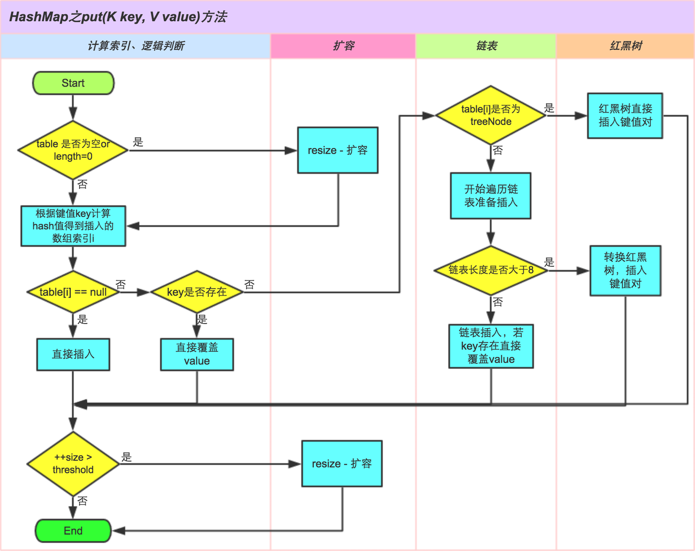

# Java

## Strings 字符串

- `String`是`final`修饰的类，不可变，不可继承。
- `StringBuilder`可变，线程不安全，速度快。
- `StringBuffer`可变，线程安全，速度慢。
- 判断字符串值是否相等用`equals()`，判断对象地址是否相等用`==`。
- `Java 7`版本`switch`支持字符串。
- `Java 7`版本`intern()`方法，如果常量池中已存在，则返回常量池中的字符串，否则常量池引用指向当前字符串在堆中的地址。
  而`Java 6`版本`intern()`方法，如果常量池中已存在，则返回常量池中的字符串，否则复制一份字符串到常量池中，并返回复制的字符串。
- `trim()`方法移除字符串首尾的空白字符（空格、tab键、换行符），`Java 11`版本新增`strip()`方法支持移除`Unicode`空白字符。
- 可以自定义`java.lang.String`类并编译成功，但不会被加载使用。
- `Java 9`版本使用`byte[]`替换`char[]`来储存字符串，并新增`coder`字段区分编码类型（`LATIN1`、`UTF16`），目的是为了节约空间。

## Collections 集合

### ArrayList

- 基于数组实现
- 有序，允许重复
- 通过索引定位效率高
- 头部新增/删除操作性能低（需要移动元素）
- 中部新增/删除操作性能低（需要移动元素）
- 尾部新增/删除操作性能高
- 初始容量为`10`，按`1.5`倍扩容
- 内存连续，空间利用率高
- 线程不安全
- 允许`null`值

### LinkedList

- 基于链表实现
- 有序，允许重复
- 通过索引定位效率低
- 头部新增/删除操作性能高
- 中部新增/删除操作性能低（要遍历至指定位置）
- 尾部新增/删除操作性能高
- 不需要扩容
- 内存不连续，空间利用率低
- 线程不安全
- 允许`null`值

### HashSet

- 基于`HashMap`实现
- 无序，不允许重复
- 元素对象需要实现`hashCode()`方法和`equals()`方法
- 允许`null`值

### TreeSet

- 基于`TreeMap`/`SortedMap`实现
- 有序，不允许重复（非插入顺序，而是根据指定的`Comparator`比较器）
- 元素对象需要实现`Comparable`接口的`compareTo()`方法和`equals()`方法
- 不允许`null`值

### HashMap

- 无序，不允许`Key`重复
- `Key`对象需要实现`hashCode()`方法和`equals()`方法
- 允许`null`值
- `Java 8`版本后引入了红黑树，优化了扩容方法
- 哈希表`table`会在第一次使用时初始化，并根据需要进行扩容，且长度始终是`2`的幂
- 哈希表`table`的链表长度超过`8`时，会将链表转换成红黑树
- 扩容阈值`threshold`，当元素数量大于阈值时会触发扩容，值为`capacity * loadFactor`
- 负载因子`loadFactor`，它与`threshold`结合起作用，默认值是`0.75`

#### `put`方法

```java
public V put(K key, V value) {
    return putVal(hash(key), key, value, false, true);
}

final V putVal(int hash, K key, V value, boolean onlyIfAbsent,
               boolean evict) {
    Node<K,V>[] tab; Node<K,V> p; int n, i;
    // 1.若table，则调用resize初始化
    if ((tab = table) == null || (n = tab.length) == 0)
        n = (tab = resize()).length;
    // 2.通过hash计算索引，并判断node是否存在，若不存在则创建新node并添加元素，否则执行第3步
    if ((p = tab[i = (n - 1) & hash]) == null)
        tab[i] = newNode(hash, key, value, null);
    else {
        Node<K,V> e; K k;
        // 3.若node存在，且node的hash和key与待保存元素的hash和key相等，则覆盖value
        if (p.hash == hash &&
            ((k = p.key) == key || (key != null && key.equals(k))))
            e = p;
        // 4.若node类型为TreeNode，则向红黑树中插入元素
        else if (p instanceof TreeNode)
            e = ((TreeNode<K,V>)p).putTreeVal(this, tab, hash, key, value);
        // 5.遍历链表
        else {
            for (int binCount = 0; ; ++binCount) {
            	// 5.1.遍历至node的next为null时，向后追加元素，并结束遍历
                if ((e = p.next) == null) {
                    p.next = newNode(hash, key, value, null);
                    // 5.2.若链表长度超过可树化的阈值时，将链表转化为红黑树
                    if (binCount >= TREEIFY_THRESHOLD - 1) // -1 for 1st
                        treeifyBin(tab, hash);
                    break;
                }
                // 5.3.遍历至当前node的hash和key与待保存元素的hash和key相等时，覆盖value，并结束遍历
                if (e.hash == hash &&
                    ((k = e.key) == key || (key != null && key.equals(k))))
                    break;
                p = e;
            }
        }
        if (e != null) { // existing mapping for key
            V oldValue = e.value;
            if (!onlyIfAbsent || oldValue == null)
                e.value = value;
            afterNodeAccess(e);
            return oldValue;
        }
    }
    ++modCount;
    // 6.当前元素数量超过扩容阈时调用resize方法进行扩容
    if (++size > threshold)
        resize();
    afterNodeInsertion(evict);
    return null;
}
```

大致逻辑如下：

1. 若`table`为空，则调用`resize()`初始化。
2. 通过`hash()`计算索引，并判断`node`是否存在，若不存在则创建新`node`并添加元素，否则执行第3步。
3. 若`node`存在，且`node`的`hash`和`key`与待保存元素的`hash`和`key`相等，则覆盖`value`。
4. 若`node`类型为`TreeNode`，则向红黑树中插入元素。
5. 遍历链表，若存在`node`的`hash`和`key`与待保存元素的`hash`和`key`相等时，覆盖`value`；若遍历至`node`的`next`为`null`时，向后追加元素，若链表长度超过可树化的阈值时，将链表转化为红黑树。
6. 当前元素数量超过扩容阈时调用`resize`方法进行扩容。



#### hash 方法

在`Java 8`中优化了`hash()`算法，通过将`key`的`hashCode`值的高`16`位与低`16`位使用`^`运算符操作获得的值，
不仅能保证`hash`方法的高效，还使`hashCode`的高低位都参与计算，实现减少冲突的目的。

```java
static final int hash(Object key) {
    int h;
    return (key == null) ? 0 : (h = key.hashCode()) ^ (h >>> 16);
}
```


#### resize 方法

假设存在一个`HashMap`，容量为`16`，已储存了`2`个`key`分别为`"1111111"`和`"1111809"`的元素：

|      | key       | `hashCode()`                              | `hash()`                                  |
|------|-----------|-------------------------------------------|-------------------------------------------|
| key1 | "1111111" | 0b0111_0110_0111_1000_0101_0001_1101_0001 | 0b0111_0110_0111_1000_0010_0111_1010_1001 |
| key2 | "1111809" | 0b0111_0110_0111_1000_0110_1100_0000_0001 | 0b0111_0110_0111_1000_0001_1010_0111_1001 |

```
计算key1的索引
size - 1   : 0000 0000 0000 0000 0000 0000 0000 1111
hash(key1) : 0111 0110 0111 1000 0010 0111 1010 1001
             0000 0000 0000 0000 0000 0000 0000 1001
            
计算key2的索引
size - 1   : 0000 0000 0000 0000 0000 0000 0000 1111
hash(key2) : 0111 0110 0111 1000 0001 1010 0111 1001
             0000 0000 0000 0000 0000 0000 0000 1001
```

可得`key1`和`key2`的索引均为`9`，从`16`扩容至`32`后。

```
计算key1的索引
size - 1   : 0000 0000 0000 0000 0000 0000 0001 1111
hash(key1) : 0111 0110 0111 1000 0010 0111 1010 1001
             0000 0000 0000 0000 0000 0000 0000 1001

计算key2的索引
size - 1   : 0000 0000 0000 0000 0000 0000 0001 1111
hash(key2) : 0111 0110 0111 1000 0001 1010 0111 1001
             0000 0000 0000 0000 0000 0000 0001 1001
```

可得`key1`的索引还是为`9`，而`key2`的索引变为了`9 + 16 = 25`，往高位移动了`16`位。

于是只需要判断`hash`高位的值是`0`还是`1`即可确定新索引，即`0`表示索引不变，`1`表示新索引为原索引加原容量。

这种扩容的实现方式非常巧妙，不但优化了`Java 7`及之前的版本中重新计算`hash`的性能损耗的问题，而且由于扩容后`hash`的新高位的值（`0`或`1`
）可以认为是随机的，因此把扩容前冲突的节点均匀地分散到新的`bucket`。

有一点注意的是，在`Java 7`及之前的版本中，新增的冲突元素会被插到链表的头部，所以在旧链表迁移新链表时，链表元素会倒置，但是`Java 8`版本的不会倒置。

在多线程使用场景中，应该避免使用`HashMap`，而是使用线程安全的`ConcurrentHashMap`。

由于`Java 7`及之前的版本中链表冲突采用的是**头插法**，在多个线程同时进行`put(K, V)`操作，并且同时进行扩容时，可能会出现链表环导致死循环的问题。虽然`Java 8`
版本采用的是**尾插法**，但这并不意味着在并发场景下不会出现死循环，可能造成死循环的操作例如：并发场景下将链表转换为树、对树进行并发操作。

### TreeMap

## Locks 锁

### synchronized

### Lock

### ReadWriteLock

## J.U.C

### AbstractQueuedSynchronizer

### CountDownLatch

### ReentrantLock

### ReentrantReadWriteLock

### Atomic*

### ConcurrentHashMap

### CopyOnWriteArrayList

### CopyOnWriteArraySet

## Threads 线程

## ClassLoader

## JVM

## 补充

### 动态代理

JDK动态代理只能对实现了接口的类生成代理；

Jdk动态代理是利用了反射机制，在调用具体方法前或后，调用InvokeHandle来处理。

CGLIB

由于CGLIB是基于继承的方式实现类的动态代理，因此无法实现对final类和方法的代理。

