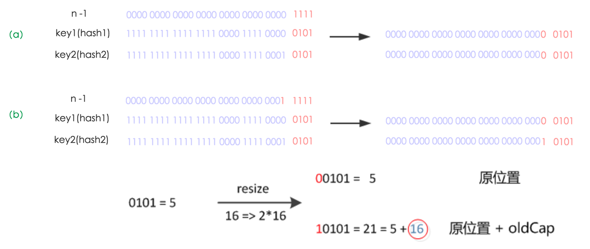

# Java

## Strings 字符串

- `String`是`final`修饰的类，不可变，不可继承。
- `StringBuilder`可变，线程不安全，速度快。
- `StringBuffer`可变，线程安全，速度慢。
- 判断字符串值是否相等用`equals()`，判断对象地址是否相等用`==`。
- `Java 7`版本`switch`支持字符串。
- `Java 7`版本`intern()`方法，如果常量池中已存在，则返回常量池中的字符串，否则常量池引用指向当前字符串在堆中的地址。
  而`Java 6`版本`intern()`方法，如果常量池中已存在，则返回常量池中的字符串，否则复制一份字符串到常量池中，并返回复制的字符串。
- `trim()`方法移除字符串首尾的空白字符（空格、tab键、换行符），`Java 11`版本新增`strip()`方法支持移除`Unicode`空白字符。
- 可以自定义`java.lang.String`类并编译成功，但不会被加载使用。
- `Java 9`版本使用`byte[]`替换`char[]`来储存字符串，并新增`coder`字段区分编码类型（`LATIN1`、`UTF16`），目的是为了节约空间。

## Collections 集合

### ArrayList

- 基于数组实现
- 有序，允许重复
- 通过索引定位效率高
- 头部新增/删除操作性能低（需要移动元素）
- 中部新增/删除操作性能低（需要移动元素）
- 尾部新增/删除操作性能高
- 初始容量为`10`，按`1.5`倍扩容
- 内存连续，空间利用率高
- 线程不安全
- 允许`null`值

### LinkedList

- 基于链表实现
- 有序，允许重复
- 通过索引定位效率低
- 头部新增/删除操作性能高
- 中部新增/删除操作性能低（要遍历至指定位置）
- 尾部新增/删除操作性能高
- 不需要扩容
- 内存不连续，空间利用率低
- 线程不安全
- 允许`null`值

### HashSet

- 基于`HashMap`实现
- 无序，不允许重复
- 元素对象需要实现`hashCode()`方法和`equals()`方法
- 允许`null`值

### TreeSet

- 基于`TreeMap`/`SortedMap`实现
- 有序，不允许重复（非插入顺序，而是根据指定的`Comparator`比较器）
- 元素对象需要实现`Comparable`接口的`compareTo()`方法和`equals()`方法
- 不允许`null`值

### HashMap

- 无序，不允许`Key`重复
- `Key`对象需要实现`hashCode()`方法和`equals()`方法
- 允许`null`值
- `Java 8`版本后引入了红黑树，优化了扩容方法
- 哈希表`table`会在第一次使用时初始化，并根据需要进行扩容，且长度始终是`2`的幂
- 哈希表`table`的链表长度超过`8`时，会将链表转换成红黑树
- 扩容阈值`threshold`，当元素数量大于阈值时会触发扩容，值为`capacity * loadFactor`
- 负载因子`loadFactor`，它与`threshold`结合起作用，默认值是`0.75`

#### `put()`方法

```java
public V put(K key, V value) {
    return putVal(hash(key), key, value, false, true);
}

final V putVal(int hash, K key, V value, boolean onlyIfAbsent,
               boolean evict) {
    Node<K,V>[] tab; Node<K,V> p; int n, i;
    // 1.若table，则调用resize初始化
    if ((tab = table) == null || (n = tab.length) == 0)
        n = (tab = resize()).length;
    // 2.通过hash计算索引，并判断node是否存在，若不存在则创建新node并添加元素，否则执行第3步
    if ((p = tab[i = (n - 1) & hash]) == null)
        tab[i] = newNode(hash, key, value, null);
    else {
        Node<K,V> e; K k;
        // 3.若node存在，且node的hash和key与待保存元素的hash和key相等，则覆盖value
        if (p.hash == hash &&
            ((k = p.key) == key || (key != null && key.equals(k))))
            e = p;
        // 4.若node类型为TreeNode，则向红黑树中插入元素
        else if (p instanceof TreeNode)
            e = ((TreeNode<K,V>)p).putTreeVal(this, tab, hash, key, value);
        // 5.遍历链表
        else {
            for (int binCount = 0; ; ++binCount) {
                // 5.1.遍历至node的next为null时，向后追加元素，并结束遍历
                if ((e = p.next) == null) {
                    p.next = newNode(hash, key, value, null);
                    // 5.2.若链表长度超过可树化的阈值时，将链表转化为红黑树
                    if (binCount >= TREEIFY_THRESHOLD - 1) // -1 for 1st
                        treeifyBin(tab, hash);
                    break;
                }
                // 5.3.遍历至当前node的hash和key与待保存元素的hash和key相等时，覆盖value，并结束遍历
                if (e.hash == hash &&
                    ((k = e.key) == key || (key != null && key.equals(k))))
                    break;
                p = e;
            }
        }
        if (e != null) { // existing mapping for key
            V oldValue = e.value;
            if (!onlyIfAbsent || oldValue == null)
                e.value = value;
            afterNodeAccess(e);
            return oldValue;
        }
    }
    ++modCount;
    // 6.当前元素数量超过扩容阈时调用resize方法进行扩容
    if (++size > threshold)
        resize();
    afterNodeInsertion(evict);
    return null;
}
```


#### `hash()`方法

在`Java 8`中优化了`hash()`算法，通过将`key`的`hashCode`值的高`16`位与低`16`位使用`^`运算符操作获得的值，
不仅能保证`hash`方法的高效，还使`hashCode`的高低位都参与计算，实现减少冲突的目的。

```java
static final int hash(Object key) {
    int h;
    return (key == null) ? 0 : (h = key.hashCode()) ^ (h >>> 16);
}
```


#### `resize()`方法



只需要`hash`值的新高位是`0`还是`1`即可确定新索引，即`0`表示索引不变，`1`表示新索引为原索引加原容量。

这种扩容的实现方式非常巧妙，不但优化了`Java 7`及之前的版本中重新计算`hash`的性能损耗的问题，而且由于扩容后`hash`的新高位的值（`0`或`1`
）可以认为是随机的，因此把扩容前冲突的节点均匀地分散到新的`bucket`。

有一点注意的是，在`Java 7`及之前的版本中，链表冲突采用的是**头插法**，即新增的冲突元素会被插到链表的头部。
所以在旧链表迁移新链表时，链表元素会倒置，在多个线程同时进行`put(K, V)`操作，并且同时进行扩容时，可能会出现链表环导致死循环的问题。
`Java 8`版本采用的是**尾插法**，所以不会倒置，但这并不意味着在并发场景下不会出现死循环，可能造成死循环的操作例如：并发场景下将链表转换为树、对树进行并发操作。

_在并发场景中，应该使用线程安全的`ConcurrentHashMap`_

### LinkedHashMap

`LinkedHashMap`是`HashMap`的一个子类，由于其内部维护了一个双向链表，因此可以按插入顺序遍历元素。
此外，`LinkedHashMap`可以很好的支持`LRU (Least Recently Used)`算法，调用构造方法时将`accessOrder`设置为`true`，即可按照访问次序排序。

### TreeMap

`TreeMap`实现了`SortedMap`接口。由于其是基于红黑树实现的，因此`key`必须实现`Comparable`接口或在调用构造方法时指定`Comparator`，
否则会在运行时抛出`java.lang.ClassCastException`异常。

#### Red–black tree 红黑树

红黑树是每个节点都带有颜色属性的二叉查找树，颜色为红色或黑色。在二叉查找树强制一般要求以外，对于任何有效的红黑树我们增加了如下的额外要求：

- 根是黑色。
- 节点是红色或黑色。
- 所有叶子都是黑色（叶子是NIL节点）。
- 每个红色节点必须有两个黑色的子节点。（或者说从每个叶子到根的所有路径上不能有两个连续的红色节点；或者说不存在两个相邻的红色节点，相邻指两个节点是父子关系；或者说红色节点的父节点和子节点均是黑色的。）
- 从任一节点到其每个叶子的所有简单路径都包含相同数目的黑色节点。


#### 对比 AVL tree (Adelson-Velsky and Landis Tree)

`Red–black tree`和`AVL tree`都是平衡二叉查找树，区别如下：

- 插入：`Red–black tree`和`AVL tree`都是最多两次树旋转来实现复衡，旋转的时间复杂度均是`O(1)`。
- 删除：`Red–black tree`最多只需要旋转3次实现复衡，时间复杂度是`O(1)`。`AVL tree`需要维护从根节点到被删除节点路径上所有节点的平衡，旋转的时间复杂度是`O(logN)`。
- 搜索：`Red–black tree`不是"完全平衡"的平衡二叉查找树，而`AVL tree`是高度平衡的，因此`AVL tree`的搜索效率更高。

总结：`Red–black tree`相对于`AVL tree`来说，牺牲了部分平衡性以换取插入/删除操作时少量的旋转操作，整体来说性能要优于`AVL tree`。

#### 对比 B-tree / B+tree

`B-tree`和`B+tree`都是平衡多路查找树，与平衡二叉查找树不同，`B-tree`和`B+tree`适用于读写相对大的数据块的存储系统，例如磁盘。

`B-tree`和`B+tree`高度都不高，尤其是`B+tree`非叶子结点不存储数据，所以看上去会更加“矮胖”。
如果用`B-tree`和`B+tree`在数据量不多的场景下，数据都会“挤在”一个结点中，遍历效率就退化成了链表。

总结：`Red–black tree`多用于内存中排序，`B-tree`和`B+tree`主要用于数据存储在磁盘上的场景。

### ~~HashTable~~

`HashTable`是遗留类，与`HashMap`类似，不同的是它承自`Dictionary`类，由于其均方法使用`synchronized`修饰，因此是线程安全的，但并发性远不如`ConcurrentHashMap`
，不建议使用。

## Locks 锁

Java中有两种加锁的方式：一种是用`synchronized`关键字，另一种是用`Lock`接口的实现类。

|        | synchronized | Lock                                                            |
|:-------|:-------------|:----------------------------------------------------------------|
| 作用域    | 方法和代码块       | 代码块                                                             |
| 实现方式   | 对象头          | AbstractQueuedSynchronizer                                      |
| 是否可重入  | 可重入          | 根据实现类，例如`ReentrantLock`和`ReentrantReadWriteLock`可重入             |
| 是否是公平锁 | 非公平锁         | 根据实现类，例如`ReentrantLock`和`ReentrantReadWriteLock`可通过构造方法指定公平或非公平 |
| 是否可释放锁 | 不可释放         | 可释放，有`void unlock();`方法                                         |

`synchronized`修饰在方法上或作用在代码块且未指定对象时，锁当前对象。

### synchronized 锁膨胀

过程：`无锁 -> 偏向锁 -> 轻量级锁 -> 重量级锁`

#### Mark Word


#### 1. 无锁

当对象的Monitor对象没有被线程所持有，代表的是对象处于无锁状态。

#### 2. 偏向锁

偏向锁是`Java 6`后面引起的一项锁优化技术，在无锁竞争的情况下，一个线程通过一次`CAS`操作来尝试将对象头中的`Thread ID`
设置为自己的线程号，偏向锁的标识是否设置成1，锁标志位是否为01，如果设置成功，则获得锁。

具体过程如下：
当`线程A`访问代码块并获取锁对象时，会在`Java`对象头和栈帧中记录偏向的锁的`Thread ID`，
由于偏向锁不会主动释放锁，因此之后`线程A`再次获取锁的时候，只需要比较`线程A`的`Thread ID`和Java对象头中的`Thread ID`是否一致，如果一致则还是该线程获取锁对象。

若之后有一个新的`线程B`想要获取锁，而锁的对象头中的`Thread ID`还是原来`线程A`的，则需要判断`线程A`是否存活货

- 如果`线程A`是非存活状态：锁对象将被重置为无锁状态，新的线程可以将其设置为偏向锁。
- 如果`线程A`是存活状态，找到`线程A`的栈帧信息，
    - 如果`线程A`需要继续持有这个锁对象，说明存在锁的竞争，当到达`safepoint`（指在这个时间点上没有字节码正在执行）时获得偏向锁的`线程B`
      被挂起，偏向锁升级为轻量级锁，然后被阻塞在安全点的`线程A`继续往下执行同步代码。
    - 如果`线程A`不再使用该锁对象，那么将锁对象状态设为无锁状态，重新偏向新的`线程B`。

偏向锁能够减少无竞争锁定时的开销。
偏向锁的目的是假定`monitor`一直由某个特定线程持有，直到另一个线程尝试获取它，这样就可以避免获取`monitor`时执行`CAS`的原子操作。
`monitor`首次锁定时偏向该线程，这样就可以避免同一对象的后续同步操作步骤需要原子指令。

从历史上看，偏向锁使得 JVM 的性能得到了显著改善。

然而`Java 15`版本废弃了偏向锁：[JEP 374: Disable and Deprecate Biased Locking](https://openjdk.java.net/jeps/374)

> 过去看到的性能提升在今天远不那么明显。
> 许多受益于偏向锁定的应用程序是使用早期 Java 集合 API 的旧的遗留应用程序，这些 API 在每次访问时都会同步（例如：Hashtable 和 Vector）。
> 较新的应用程序通常使用 Java 1.2 中针对单线程场景引入的非同步集合（例如：HashMap 和 ArrayList），或者使用 Java 5 中针对多线程场景引入的性能更高的并发数据结构。
> 这意味着如果更新代码以使用这些较新的类，由于不必要的同步而受益于偏向锁定的应用程序可能会看到性能改进。此外，围绕线程池队列和工作线程构建的应用程序通常在禁用偏向锁定的情况下性能更好。
>
> 偏向锁定在同步子系统中引入了许多复杂的代码，并且还侵入了其他 HotSpot 组件。这种复杂性是理解代码各个部分的障碍，也是在同步子系统内进行重大设计更改的障碍。为此，我们希望禁用、弃用并最终移除对偏向锁定的支持。
>
> 在 JDK 15 之前，偏向锁定始终处于启用状态且可用。`-XX:+UseBiasedLocking`使用此 JEP，除非在命令行中设置，否则在启动 HotSpot 时将不再启用偏向锁定。

#### 3. 轻量级锁

轻量级锁的加锁过程

1. 当代码进入同步代码块的时候，如果同步对象锁状态是无锁状态（锁标志位是01，是否为偏向锁是0），虚拟机首先在当前的栈帧中建立一个名为锁记录（Lock Record)的空间，用于存储锁对象的Mark Word的拷贝，官方称之为 Displaced Mark Word。这时候线程堆栈与对象头的状态如图一所示。
2. 拷贝对象头中的Mark Word复制到锁记录中。
3. 拷贝成功后，虚拟机将使用CAS操作尝试将对象的Mark Word更新为指向Lock Record的指针，并将Lock record里的owner指针指向object mark word。如果更新成功，则执行步骤4，否则执行步骤5。
4. 如果这个更新动作成功了，那么这个线程就拥有了该对象的锁，并且对象Mark Word的锁标志位设置为“00”，即表示此对象处于轻量级锁定状态，这时候线程堆栈与对象头的状态如图二所示。
5. 如果这个更新操作失败了，虚拟机首先会检查对象的Mark Word是否指向当前线程的栈帧，如果是就说明当前线程已经拥有了这个对象的锁，那就可以直接进入同步块继续执行。否则说明多个线程竞争锁，轻量级锁就要膨胀为重量级锁，锁标志的状态值变为“10”，Mark Word中存储的就是指向重量级锁（互斥量）的指针，后面等待锁的线程也要进入阻塞状态。而当前线程便尝试使用自旋来获取锁，自旋就是为了不让线程阻塞，而采用循环去获取锁的过程。

轻量级锁的解锁过程：

1. 通过CAS操作尝试把线程中复制的Displaced Mark Word对象替换当前的Mark Word。
2. 如果替换成功，整个同步过程就完成了。
3. 如果替换失败，说明有其他线程尝试过获取该锁（此时锁已膨胀，Mark Word存的是指向重量级锁的指针），那就要在释放锁的同时，唤醒被挂起的线程。

一个线程获取轻量级锁时会先把锁对象的对象头`MarkWord`复制到该线程的栈帧中，创建的用于存储锁记录的空间（DisplacedMarkWord），然后使用CAS把对象头中的内容替换为线程1存储的锁记录（DisplacedMarkWord）的地址；

如果在线程1复制对象头的同时（在线程1CAS之前），线程2也准备获取锁，复制了对象头到线程2的锁记录空间中，但是在线程2CAS的时候，发现线程1已经把对象头换了，线程2的CAS失败，那么线程2就尝试使用自旋锁来等待线程1释放锁。

但是如果自旋的时间太长也不行，因为自旋是要消耗CPU的，因此自旋的次数是有限制的，比如10次或者100次，如果自旋次数到了线程1还没有释放锁，或者线程1还在执行，线程2还在自旋等待，这时又有一个线程3过来竞争这个锁对象，那么这个时候轻量级锁就会膨胀为重量级锁。重量级锁把除了拥有锁的线程都阻塞，防止CPU空转。

#### 4. 重量级锁

当一个轻量级锁自旋超过一定次数（默认10次），或被两个及以上的线程竞争的时候，轻量级锁就会膨胀为重量级锁。

注意：为了避免无用的自旋，轻量级锁一旦膨胀为重量级锁就不会再降级为轻量级锁了，偏向锁升级为轻量级锁也不能再降级为偏向锁，但是偏向锁状态可以被重置为无锁状态。

### CAS (Compare-and-Swap)

`CAS`是一种轻量的乐观锁机制，因为没有加锁操作，所以它允许多个线程同时读取，但是只有一个线程可以修改数据。
`Java`中`Unsafe`的`compareAndSwap*`方法是通过`Java Native Interface`调用`CPU`指令实现的，从硬件层面保证了操作的原子性。

注意：`CAS`不等于自旋锁，一般`CAS`和`while`同时使用实现自旋锁。而自旋锁也不一定使用`CAS`机制。

### 悲观锁与乐观锁

悲观锁与乐观锁并不是特指某个锁，而是在并发情况下的两种不同策略。

- 悲观锁 (Pessimistic Lock): 读取或修改数据时会获取锁，若锁被别的线程持就等待或返回失败。
- 乐观锁 (Optimistic Lock): 乐观锁不是锁，而是在修改数据时，判断数据是否被修改过，若被修改过就进行重试或返回失败。

悲观锁阻塞事务，乐观锁回滚重试，它们适用于不同的场景。
乐观锁适用于写比较少的情况下，即冲突真的很少发生的时候，这样可以省去锁的开销，加大了系统的整个吞吐量。
若经常产生冲突，不断的进行重试造成性能浪费，这种情况下用悲观锁就比较合适。

## J.U.C

### AbstractQueuedSynchronizer

### CountDownLatch

### ReentrantLock

### ReentrantReadWriteLock

### Atomic*

### ConcurrentHashMap

### CopyOnWriteArrayList

### CopyOnWriteArraySet

## Threads 线程

## ClassLoader

## JVM

## 补充

### 动态代理

JDK动态代理只能对实现了接口的类生成代理；

Jdk动态代理是利用了反射机制，在调用具体方法前或后，调用InvokeHandle来处理。

CGLIB

由于CGLIB是基于继承的方式实现类的动态代理，因此无法实现对final类和方法的代理。

