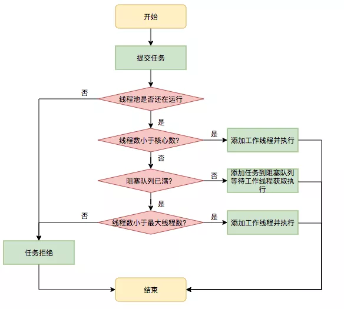
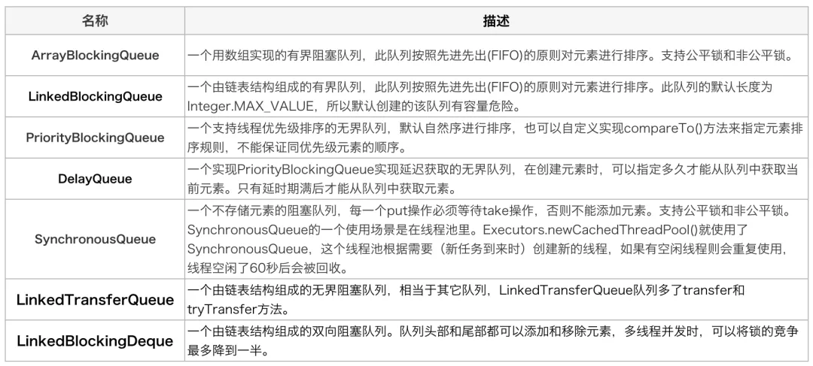

# Thread 线程

## Thread 和 Runnable

`Thread`是类，`Runnable`是接口，实现`Runnable`接口的类可以不用是`Thread`的子类，通过实例化`Runnable`实例并将自身作为目标传入`Thread`即可运行。

大多数情况下，如果只想重写`run()`方法，而不重写`Thread`的方法，就应该使用`Runnable`接口，除非开发者想要修改或增强`Thread`的基本行为。

## Runnable 和 Callable

`Callable`接口是 Java 5 新增的接口，与`Runnable`接口非常相似，不同的是`Runnable`接口需要实现`void run()`方法，而`Callable`需要实现`V call()`方法，并且支持返回值。

```java
@FunctionalInterface
public interface Runnable {
    /**
     * When an object implementing interface <code>Runnable</code> is used
     * to create a thread, starting the thread causes the object's
     * <code>run</code> method to be called in that separately executing
     * thread.
     * <p>
     * The general contract of the method <code>run</code> is that it may
     * take any action whatsoever.
     *
     * @see     java.lang.Thread#run()
     */
    public abstract void run();
}
```

```java
@FunctionalInterface
public interface Callable<V> {
    /**
     * Computes a result, or throws an exception if unable to do so.
     *
     * @return computed result
     * @throws Exception if unable to compute a result
     */
    V call() throws Exception;
}
```

## 线程池

通常我们使用`Executors`工厂模式创建各种线程池，虽然返回的都是`ExecutorService`，但其背后实现逻辑大相径庭。

- Executors.newFixedThreadPool()
- Executors.newSingleThreadExecutor()
- Executors.newSingleThreadScheduledExecutor()
- Executors.newWorkStealingPool()

### ThreadPoolExecutor

`ThreadPoolExecutor`主要有以下几个属性：

- corePoolSize：核心线程数，线程池需要保持的线程数量，不管它们创建以后是不是空闲的，除非设置了 allowCoreThreadTimeOut
- maximumPoolSize：最大线程数，线程池中最多允许创建线程数量
- keepAliveTime：存活时间，超过核心线程数的线程，超过存货时间后还没有接受到新的任务，则销毁线程
- unit：时间单位，keepAliveTime 的时间单位
- workQueue：存放待执行任务的队列，当提交的任务数超过核心线程数大小后，再提交的任务就存放在这里。它仅仅用来存放被 execute 方法提交的 Runnable 任务。所以这里就不要翻译为工作队列了好吗？不要给自己挖坑。

```java
public ThreadPoolExecutor(int corePoolSize,
                          int maximumPoolSize,
                          long keepAliveTime,
                          TimeUnit unit,
                          BlockingQueue<Runnable> workQueue) {
    this(corePoolSize, maximumPoolSize, keepAliveTime, unit, workQueue,
         Executors.defaultThreadFactory(), defaultHandler);
}
```

因为创建线程的开销比较大，所以只有满足以下所有条件时，才会创建额外的线程：

1. 正在运行的线程数量超过核心线程数
2. 阻塞队列已满
3. 正在运行的线程数量小于最大线程数



常用线程安全的队列：



### ScheduledThreadPoolExecutor

### ForkJoinPool

## TreadLocal

## sleep wait
