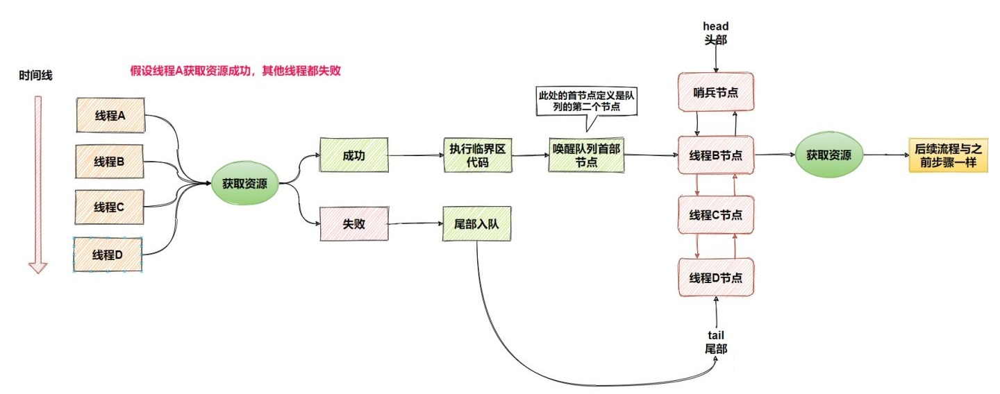
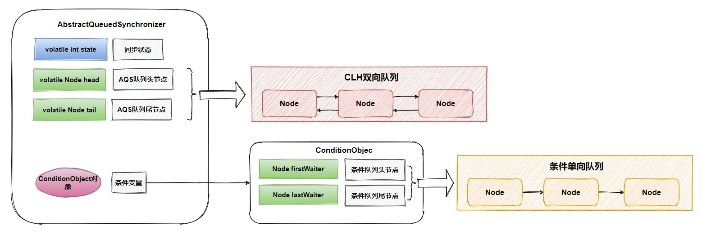
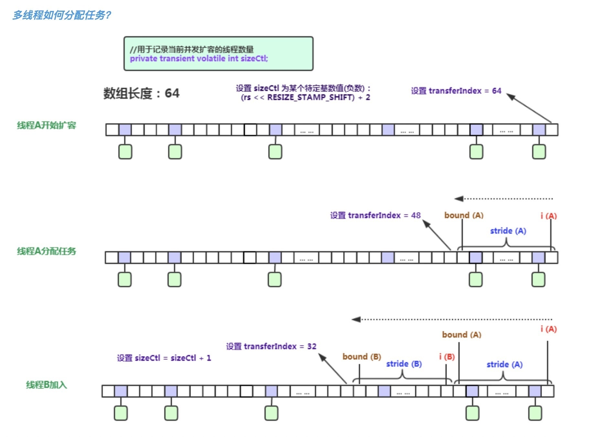
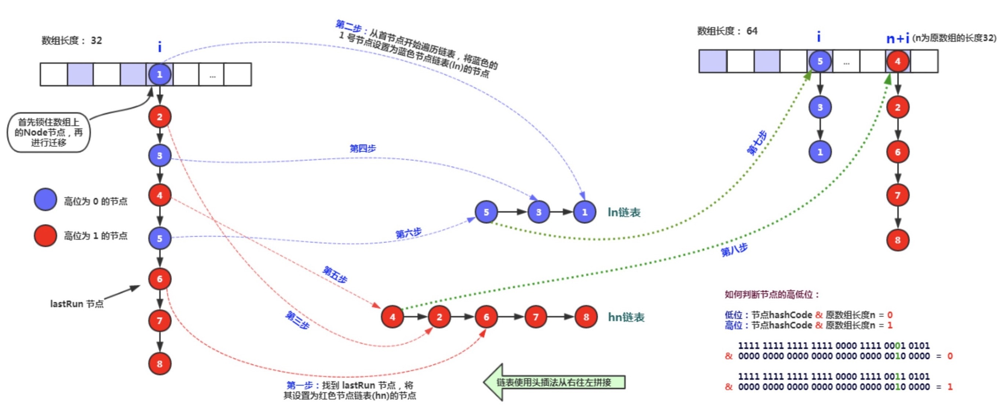
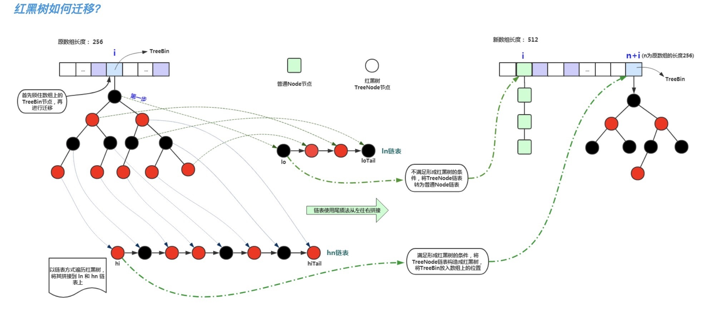
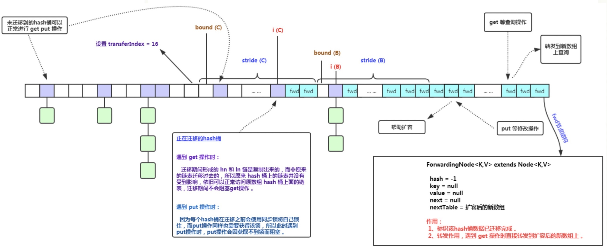

# J.U.C

## AbstractQueuedSynchronizer

`AbstractQueuedSynchronizer`（简称`AQS`）定义了一套多线程访问共享资源的同步模板，是实现同步器的基础组件，例如`ReentrantLock`、`Semaphore`、`CountDownLatch`等均是基于`AQS`实现的。



### 主要属性

- `volatile int state`同步状态
- `volatile Node head`和`volatile Node tail`组成`CLH`队列
- `class ConditionObject`条件变量，包含`Node`组成的条件单向队列



### 主要方法

- `int getState()`返回同步状态
- `void setState(int newState)`设置同步状态
- `boolean compareAndSetState(int expect, int update)`通过`CAS`操作设置同步状态
- `boolean isHeldExclusively()`当前线程是否持有资源（需要子类实现）
- `void acquire(int arg)`独占式获取资源模板
- `boolean release(int arg)`独占式释放资源模板
- `boolean tryAcquire(int arg)`独占式获取资源（需要子类实现）
- `boolean tryRelease(int arg)`独占式释放资源（需要子类实现）
- `void acquireShared(int arg)`共享式获取资源模板
- `boolean releaseShared(int arg)`共享式释放资源模板
- `int tryAcquireShared(int arg)`共享式获取资源，返回值大于等于0则表示获取成功（需要子类实现）
- `boolean tryReleaseShared(int arg)`共享式释放资源（需要子类实现）

_获取独占、共享资源操作还提供超时与响应中断的扩展函数。_

### state 同步状态

对于`AQS`来说，线程同步的关键是对`state`的操作，可以说获取、释放资源是否成功都是由state决定的，例如：

- `ReentrantLock`的`state`值为`0`表示无锁，大于`0`表示有锁，每次重入时`state`会加`1`。
- `ReentrantReadWriteLock`的`state`高`16`位代表读锁状态，低`16`位代表写锁状态。
- `Semaphore`的`state`用来表示可用信号的个数。
- `CountDownLatch`的`state`用来表示计数器的值。

### Node 节点

`Node`是`AQS`的内部类，每个等待资源的线程都会封装成`Node`节点组成`CLH`队列并阻塞线程,
头部节点（哨兵节点）线程释放资源时会把唤醒下一个节点的线程去获取资源。

### CLH 队列

`AQS`通过`CLH`（Craig, Landin, and Hagersten）队列管理竞争资源的线程，`CLH`是一个`FIFO`的双端双向队列，
当一个线程竞争资源失败，就会将等待资源的线程封装成一个`Node`节点，通过`CAS`操作插入`CLH`队列尾部。

### ConditionObject 条件变量

`Object`的`wait()`和`notify()`方法是配合`synchronized`锁实现线程间同步协作的功能，`ConditionObject`条件变量也提供这样的功能，通过`await()`和`signal()`方法实现。
不同于的是，一个`AQS`可以对应多个条件变量，而`synchronized`锁只能一个。

## ReentrantLock

`ReentrantLock`基于`AQS`实现的可重入锁，支持公平锁和非公平锁，默认使用非公平锁。
当多个线程尝试获取同一个锁，其中一个线程获取到锁后，其他线程会被挂起排队等待锁释放，当获该线程（即哨兵节点）释放锁后，会唤醒线程队列中的下一个节点的线程（即哨兵节点的下一个节点）。

### 非公平锁

从`ReentrantLock`的`NonfairSync`源码中我们可以看出非公平锁`2`次分别尝试调用`compareAndSetState`获取锁而未考虑线程队列，如果`2`次尝试均未获得锁，则加入线程队列中。

```java
static final class NonfairSync extends Sync {
    private static final long serialVersionUID = 7316153563782823691L;

    final void lock() {
        // 1. 直接尝试获取锁
        if (compareAndSetState(0, 1))
            setExclusiveOwnerThread(Thread.currentThread());
        else
            acquire(1);
    }

    protected final boolean tryAcquire(int acquires) {
        return nonfairTryAcquire(acquires);
    }
}

abstract static class Sync extends AbstractQueuedSynchronizer {
    private static final long serialVersionUID = -5179523762034025860L;

    abstract void lock();

    final boolean nonfairTryAcquire(int acquires) {
        final Thread current = Thread.currentThread();
        int c = getState();
        if (c == 0) {
            // 2. 如果当无锁，尝试获取锁
            if (compareAndSetState(0, acquires)) {
                setExclusiveOwnerThread(current);
                return true;
            }
        }
        else if (current == getExclusiveOwnerThread()) {
            int nextc = c + acquires;
            if (nextc < 0) // overflow
                throw new Error("Maximum lock count exceeded");
            setState(nextc);
            return true;
        }
        return false;
    }
}
```

### 公平锁

从`ReentrantLock`的`FairSync`源码中我们可以看出公平锁在获取锁前，调用了`hasQueuedPredecessors()`判断线程需不需要排队，若需要排队或未获得锁，则加入线程队列中。

```java
static final class FairSync extends Sync {
    private static final long serialVersionUID = -3000897897090466540L;

    final void lock() {
        acquire(1);
    }

    protected final boolean tryAcquire(int acquires) {
        final Thread current = Thread.currentThread();
        int c = getState();
        if (c == 0) {
            // 判断线程是否需要排队
            if (!hasQueuedPredecessors() &&
                compareAndSetState(0, acquires)) {
                setExclusiveOwnerThread(current);
                return true;
            }
        }
        else if (current == getExclusiveOwnerThread()) {
            int nextc = c + acquires;
            if (nextc < 0)
                throw new Error("Maximum lock count exceeded");
            setState(nextc);
            return true;
        }
        return false;
    }
}
```

## ReentrantReadWriteLock

_TODO_

## Semaphore

`Semaphore`是基于`AQS`实现的信号量，可用来控制同时访问特定资源的线程数量，以此来达到协调线程工作，支持公平锁和非公平锁，默认使用非公平锁。

其内部维护了一个虚拟的资源池，如果许可数量为`0`则阻塞线程，直到许可数量大于`0`时会唤醒线程队列的头部节点（即哨兵节点的下一个节点）。

## CountDownLatch

`CountDownLatch`是基于`AQS`实现的同步计数器，实例化时需要传入一个不小于`0`的整数值。

调用`await()`阻塞当前线程，将当前线程加入阻塞队列，或者调用`await(long timeout, TimeUnit unit)`在指定时间内阻塞当前线程，超时后唤醒当前线程。
调用`countDown()`对计数器进行减`1`操作，当计数器递减至`0`时，唤醒阻塞队列里的所有线程。

## Atomic*

支持原子操作的类

- AtomicBoolean
- AtomicInteger
- AtomicIntegerArray
- AtomicLong
- AtomicLongArray
- AtomicReference
- AtomicReferenceArray
- DoubleAdder
- LongAdder

## ConcurrentHashMap

Java 7 及之前的版本`ConcurrentHashMap`是基于`Segment`数组加`HashEntry`链表实现的，
而 Java 8 版本弃用了`Segment`分段锁，是采用了`CAS`和`synchronized`结合的方式保证并发安全性。
跟`HashMap`相似，把`HashEntry`改为了`Node`但作用不变，并且也引入了红黑树。

### ConcurrentHashMap in Java 7

在 Java 7及之前的版本中，采用了分段锁方案，其内部维护了一个`Segment`数组，`Segment`类继承于`ReentrantLock`类，当一个线程访问一个`Segment`对象时，不会影响到其他的`Segment`，
换而言之，如果有一个`ConcurrentHashMap`的`segments`大小为`16`时，可以允许`16`个线程同时操作`16`个`Segment`，既线程安全，又不会发生竞争。

```java
final Segment<K,V>[] segments;

static final class Segment<K,V> extends ReentrantLock implements Serializable {
    transient volatile HashEntry<K,V>[] table;
}

static final class HashEntry<K,V> {
    final int hash;
    final K key;
    volatile V value;
    volatile HashEntry<K,V> next;
}
```

#### `put(K key, V value)`方法

计算`key`的`hashCode`在`segments`中定位`key`所对应的`Segment`对象，具体的`put()`方法在`Segment`类中实现。

```java
public V put(K key, V value) {
    Segment<K,V> s;
    if (value == null)
        throw new NullPointerException();
    int hash = hash(key);
    int j = (hash >>> segmentShift) & segmentMask;
    if ((s = (Segment<K,V>)UNSAFE.getObject          // nonvolatile; recheck
         (segments, (j << SSHIFT) + SBASE)) == null) //  in ensureSegment
        s = ensureSegment(j);
    return s.put(key, hash, value, false);
}
```

首先，调用`tryLock()`尝试获取锁，如果获取失败说明有其他线程存在竞争，随后调用`scanAndLockForPut(K key, int hash, V value)`自旋获取锁，
如果重试的次数达到了`MAX_SCAN_RETRIES`则调用`lock()`用阻塞方式获取锁，防止 CPU 空转。
获取到锁之后，通过`key`的`hashCode`在`table`中定位到`HashEntry`，
若`value`不存在就新增`HashEntry`；若存在替换原`HashEntry`的`value`。

```java
static final class Segment<K,V> extends ReentrantLock implements Serializable {
    static final int MAX_SCAN_RETRIES =
            Runtime.getRuntime().availableProcessors() > 1 ? 64 : 1;
    transient volatile HashEntry<K,V>[] table;
    
    final V put(K key, int hash, V value, boolean onlyIfAbsent) {
        HashEntry<K,V> node = tryLock() ? null :
            scanAndLockForPut(key, hash, value);
        V oldValue;
        try {
            HashEntry<K,V>[] tab = table;
            int index = (tab.length - 1) & hash;
            HashEntry<K,V> first = entryAt(tab, index);
            for (HashEntry<K,V> e = first;;) {
                if (e != null) {
                    K k;
                    if ((k = e.key) == key ||
                        (e.hash == hash && key.equals(k))) {
                        oldValue = e.value;
                        if (!onlyIfAbsent) {
                            e.value = value;
                            ++modCount;
                        }
                        break;
                    }
                    e = e.next;
                }
                else {
                    if (node != null)
                        node.setNext(first);
                    else
                        node = new HashEntry<K,V>(hash, key, value, first);
                    int c = count + 1;
                    if (c > threshold && tab.length < MAXIMUM_CAPACITY)
                        rehash(node);
                    else
                        setEntryAt(tab, index, node);
                    ++modCount;
                    count = c;
                    oldValue = null;
                    break;
                }
            }
        } finally {
            unlock();
        }
        return oldValue;
    }
}
```

#### `get(Object key)`方法

首先计算`key`的`hashCode`在`segments`中定位`key`所在的`Segment`，再在`table`中定位到`HashEntry`。
由于`HashEntry`中的`value`属性是用`volatile`关键词修饰的，保证了内存可见性，所以每次获取时都是最新值。

_整个过程都不需要加锁。_

```java
public V get(Object key) {
    Segment<K,V> s; // manually integrate access methods to reduce overhead
    HashEntry<K,V>[] tab;
    int h = hash(key);
    long u = (((h >>> segmentShift) & segmentMask) << SSHIFT) + SBASE;
    if ((s = (Segment<K,V>)UNSAFE.getObjectVolatile(segments, u)) != null &&
        (tab = s.table) != null) {
        for (HashEntry<K,V> e = (HashEntry<K,V>) UNSAFE.getObjectVolatile
                 (tab, ((long)(((tab.length - 1) & h)) << TSHIFT) + TBASE);
             e != null; e = e.next) {
            K k;
            if ((k = e.key) == key || (e.hash == h && key.equals(k)))
                return e.value;
        }
    }
    return null;
}
```

### ConcurrentHashMap in Java 8

#### `sizeCtl`属性

`sizeCtl`主要用于控制`table`初始化和扩容，在`ConcurrentHashMap`不同阶段，其值所代表的意义也不同：

- 未初始化：`sizeCtl = 0`表⽰没有指定初始容量；`sizeCtl > 0`表⽰指定的初始容量（`2`的幂）
- 初始化中：`sizeCtl = -1`表⽰正在初始化
- 正在扩容：`sizeCtl < -1`表⽰有`|sizeCtl| - 1`个线程正在执⾏扩容，例如：`-2`表示有`1`个线程正在执⾏扩容（忽略高16位标识符）
- 正常状态：`sizeCtl = 0.75N`表示扩容阈值

#### `initTable()`方法

众所周知，`HashMap`实例化时，不会直接初始化`table`，而是调用在`put`、`compute`、`merge`等衍生方法时才会初始化，同理`ConcurrentHashMap`，所以要保证初始化操作线程安全。
直接调用`initTable()`的方法如下：

- final V putVal(K key, V value, boolean onlyIfAbsent)
- public V computeIfAbsent(K key, Function<? super K, ? extends V> mappingFunction)
- public V computeIfPresent(K key, BiFunction<? super K, ? super V, ? extends V> remappingFunction)
- public V compute(K key, BiFunction<? super K, ? super V, ? extends V> remappingFunction)
- public V merge(K key, V value, BiFunction<? super V, ? super V, ? extends V> remappingFunction)

```java
// 使用 volatile 关键字修饰 table（需要注意，数组中元素并不具备可见性）
transient volatile Node<K,V>[] table;

// 多个线程进入 initTable 方法时，只会有一个线程实例化 table 数组，其他线程会通过自旋方式等待
private final Node<K,V>[] initTable() {
    Node<K,V>[] tab; int sc;
    // 如果 table 还未初始化完成，则尝试进行初始化
    // 如果 table 正在被其他线程初始化，则自旋等待
    while ((tab = table) == null || tab.length == 0) {
        // sizeCtl < 0 表示存在一个线程正在进行初始化（sizeCtl = -1 表示初始化中，sizeCtl < -1 表示扩容中，这里不太可能是扩容中）
        if ((sc = sizeCtl) < 0)
            // 线程让步
            Thread.yield(); // lost initialization race; just spin
        // 通过 CAS 操作修改 sizeCtl 的值为 -1，修改成功表示当前线程可以进行初始化
        else if (U.compareAndSwapInt(this, SIZECTL, sc, -1)) {
            try {
                if ((tab = table) == null || tab.length == 0) {
                    // 使用指定初始容量或默认初始容量（16）
                    int n = (sc > 0) ? sc : DEFAULT_CAPACITY; 
                    @SuppressWarnings("unchecked")
                    Node<K,V>[] nt = (Node<K,V>[])new Node<?,?>[n];
                    table = tab = nt;
                    // 计算扩容阈值，即当前容量 3/4
                    sc = n - (n >>> 2);
                }
            } finally {
                // 将扩容阈值赋给 sizeCtl
                sizeCtl = sc; 
            }
            break;
        }
    }
    return tab;
}
```

#### `put(K key, V value)`方法

```java
public V put(K key, V value) {
    return putVal(key, value, false);
}

final V putVal(K key, V value, boolean onlyIfAbsent) {
    // key 和 value 均不能为 null
    if (key == null || value == null) throw new NullPointerException();
    // 计算 hashCode
    int hash = spread(key.hashCode());
    // 如果是链表，则代表长度，长度超过 TREEIFY_THRESHOLD（8）会转化为红黑树
    // 如果是红黑树，则固定为2，目的是为了 addCount 方法检测是否需要扩容
    int binCount = 0;
    // 自旋直到元素被成功写入
    for (Node<K,V>[] tab = table;;) {
        Node<K,V> f; int n, i, fh;
        // 如果 table 为空则进行初始化
        if (tab == null || (n = tab.length) == 0)
            tab = initTable();
        // 通过 hashCode 计算 table 下标，如果节点不存在，尝试通过 CAS 操作写入数据，写入成功则结束循环
        else if ((f = tabAt(tab, i = (n - 1) & hash)) == null) {
            if (casTabAt(tab, i, null, new Node<K,V>(hash, key, value, null)))
                break; // no lock when adding to empty bin
        }
        // 通过 hashCode 计算 table 下标，如果节点存在且 hash 值为 MOVED（-1），说明当前节点正在扩容，调用 helpTransfer 方法尝试协助扩容
        // 节点 hash 值为 MOVED（-1），则说明该节点对象的类一定为 ForwardingNode，也说明该节点所在区间正在扩容
        else if ((fh = f.hash) == MOVED)
            tab = helpTransfer(tab, f);
        // 以上条件都不满足时，通过 synchronized 锁写入数据
        else {
            V oldVal = null;
            synchronized (f) {
                // 如果是链表则追加节点，或替换已存在节点的 value 值
                // 如果是红黑树则调用 TreeBin 的方法
            }
            if (binCount != 0) {
                // 链表长度超过 TREEIFY_THRESHOLD（8）则转化为红黑树
                if (binCount >= TREEIFY_THRESHOLD)
                    treeifyBin(tab, i);
                // oldVal 不为 null 说明是替换了 value 值，则不需要对 size 加 1，也不需要检测扩容
                if (oldVal != null)
                    return oldVal;
                break;
            }
        }
    }
    // 新增节点后，对 size 加 1，并且检查扩容
    addCount(1L, binCount);
    return null;
}
```

实际上`ConcurrentHashMap`并不像`HashMap`定义了`size`属性，在新增元素后通过`++size`的方式维护元素的数量。
尽管可以通过`CAS`操作修改`size`的值保证线程安全，但是如果同时存在很多线程需要修改`size`的值，会导致大部分线程不断地自旋，从而影响`put`方法整体的性能，

作者采用了一个分治的方案来实现并发计数，在`ConcurrentHashMap`中分别定义了`long baseCount`和`CounterCell[] counterCells`两个属性，通过这两个属性维护元素的数量。

新增计数从未发生过竞争时，`counterCells`不会被初始化，`ConcurrentHashMap`总是会先尝试通过`CAS`操作对`baseCount`进行加`1`，如果操作成功，则计数操作完成。
如果操作失败说明存在竞争，此时才会初始化`counterCells`，并使用`counterCells`进行计数（此后再也不会修改`baseCount`），随机获取一个`counterCells`数组的下标进行操作。

使用`baseCount`和`counterCells`结合的方式，不仅对低并发场景有较好的性能支持，而且在高并发场景可以尽可能的降低锁的粒度。

调用`size()`方法时，遍历`counterCells`数组累加所有值，最后加上`baseCount`的值。

_补充：`counterCells`也能扩容，扩容的大小为原来的`2`倍。_

```java
private transient volatile long baseCount;
private transient volatile CounterCell[] counterCells;

static final class CounterCell {
    volatile long value;
    CounterCell(long x) { value = x; }
}

// 计算元素数量，并边界校验
public int size() {
    long n = sumCount();
    return ((n < 0L) ? 0 :
            (n > (long)Integer.MAX_VALUE) ? Integer.MAX_VALUE :
            (int)n);
}

final long sumCount() {
    // 元素总数量 = baseCount + counterCells
    CounterCell[] as = counterCells; CounterCell a;
    long sum = baseCount;
    if (as != null) {
        for (int i = 0; i < as.length; ++i) {
            if ((a = as[i]) != null)
                sum += a.value;
        }
    }
    return sum;
}

private final void addCount(long x, int check) {
    CounterCell[] as; long b, s;
    // 满足以下任意条件时，对 counterCells 进行初始化或更新操作
    // 1. 如果 counterCells 不为null
    // 2. 如果 counterCells 为 null 且 CAS 操作修改 baseCount 失败
    if ((as = counterCells) != null ||
        !U.compareAndSwapLong(this, BASECOUNT, b = baseCount, s = b + x)) {
        CounterCell a; long v; int m;
        boolean uncontended = true;
        // 满足以下任意条件时执行 fullAddCount 方法对 counterCells 初始化或更新操作
        // 1. 如果 counterCells 还是为 null
        // 2. 如果随机位置的对象为 null
        // 3. 如果通过 CAS 修改随机位置的 value 失败
        if (as == null || (m = as.length - 1) < 0 ||
            (a = as[ThreadLocalRandom.getProbe() & m]) == null ||
            !(uncontended =
              U.compareAndSwapLong(a, CELLVALUE, v = a.value, v + x))) {
            fullAddCount(x, uncontended);
            return;
        }
        if (check <= 1)
            return;
        s = sumCount();
    }
    // 传入的 check 值大于等于 0 时，判断是否需要扩容
    if (check >= 0) {
        Node<K,V>[] tab, nt; int n, sc;
        // 如果当前 size >= sizeCtl 时，说明已经达到了扩容阈值
        while (s >= (long)(sc = sizeCtl) && (tab = table) != null &&
               (n = tab.length) < MAXIMUM_CAPACITY) {
            // 根据当前 table 的长度获取标识符
            int rs = resizeStamp(n);
            // 如果 sizeCtl < 0，说明扩容正在进行
            // 此时 sizeCtl 值是由 rs 和正在扩容线程数量组成的一个负数
            // 例如：当前 table 长度为 16，标识符二进制为 1000000000011011，正在扩容的线程池数量为 1，则 sizeCtl 为 1000000000011011_0000000000000010
            if (sc < 0) {
                // 满足以下任意条件时，不需要协助扩容，结束循环
                if ((sc >>> RESIZE_STAMP_SHIFT) != rs // 如果 sizeCtl 高 16 位不等于 rs 说明标识符发生了变化
                    || sc == rs + 1                   // 如果 sizeCtl 等于 rs + 1 说明扩容已经结束
                    || sc == rs + MAX_RESIZERS        // 如果 sizeCtl 等于 rs + 65535 说明达到最大帮助线程的数量
                    || (nt = nextTable) == null       // 如果 nextTable 为空说明扩容已经结束，nextTable是扩容后的新数组，只有在扩容时才会存在
                    || transferIndex <= 0)            // 如果 transferIndex <= 0 说明数据迁移容的任务已经分配完或扩容已经结束
                    break;
                // 如果满足协助扩容的前提条件，则通过 CAS 操作对 sizeCtl 加 1，表示增加一个线程协助扩容
                if (U.compareAndSwapInt(this, SIZECTL, sc, sc + 1))
                    // 当前线程尝试扩容
                    transfer(tab, nt);
            }
            // 不存在其他线程正在扩容，标识符左移16位并加2，此时值为负数，高16位为标识符，低16位为2，可视作-2，表示有1个线程正在扩容和迁移数据
            // 例如table长度为16时，标识符二进制为：1000000000011011，设置sizeCtl为：1000000000011011_0000000000000010
            else if (U.compareAndSwapInt(this, SIZECTL, sc, (rs << RESIZE_STAMP_SHIFT) + 2)) 
                // 当前线程尝试扩容
                transfer(tab, null);
            s = sumCount();
        }
    }
}
```

#### `helpTransfer(Node<K,V>[] tab, Node<K,V> f)`方法 协助扩容

新增元素时，如果发现当前正在扩容，会调用`helpTransfer`方法尝试协助扩容。

```java
static final class ForwardingNode<K,V> extends Node<K,V> {
    ForwardingNode(Node<K,V>[] tab) {
        // int hash, K key, V val, Node<K,V> next
        super(MOVED, null, null, null);
        this.nextTable = tab;
    }
}

static final int resizeStamp(int n) {
    // 返回16位标识符，首位为1，所以
    // 例如：当前 table 长度为 16，标识符二进制为 1000000000011011
    return Integer.numberOfLeadingZeros(n) | (1 << (RESIZE_STAMP_BITS - 1));
}

final Node<K,V>[] helpTransfer(Node<K,V>[] tab, Node<K,V> f) {
    Node<K,V>[] nextTab; int sc;
    if (tab != null && (f instanceof ForwardingNode) &&
        (nextTab = ((ForwardingNode<K,V>)f).nextTable) != null) {
        // 根据当前 table 的长度获取标识符
        int rs = resizeStamp(tab.length);
        // 如果 nextTable 和 table 均未被替换，且 sizeCtl < 0，说明扩容正在进行
        // 此时 sizeCtl 值是由 rs 和正在扩容线程数量组成的一个负数
        // 例如：当前 table 长度为 16，标识符二进制为 1000000000011011，正在扩容的线程池数量为 1，则 sizeCtl 为 1000000000011011_0000000000000010
        while (nextTab == nextTable && table == tab && (sc = sizeCtl) < 0) {
            // 满足以下任意条件时，不需要协助扩容，结束循环
            if ((sc >>> RESIZE_STAMP_SHIFT) != rs // 如果 sizeCtl 高 16 位不等于 rs 说明标识符发生了变化
                || sc == rs + 1                   // 如果 sizeCtl 等于 rs + 1 说明扩容已经结束
                || sc == rs + MAX_RESIZERS        // 如果 sizeCtl 等于 rs + 65535 说明达到最大帮助线程的数量
                || transferIndex <= 0)            // 如果 transferIndex <= 0 说明数据迁移容的任务已经分配完或扩容已经结束
                break;
            // 如果满足协助扩容的前提条件，则通过 CAS 操作对 sizeCtl 加 1，表示增加一个线程协助扩容
            if (U.compareAndSwapInt(this, SIZECTL, sc, sc + 1)) {
                // 当前线程尝试扩容
                transfer(tab, nextTab);
                break;
            }
        }
        return nextTab;
    }
    return table;
}
```

#### `transfer(Node<K,V>[] tab, Node<K,V>[] nextTab)`方法 并发扩容

`ConcurrentHashMap`采用的是分段扩容法，每个线程每次负责迁移一部分数据，每次迁移数据数量`stride`默认最小是`16`，其计算公式为`当前数组长度 / 8 / 可用CPU数量`，
例如当前`table`长度为`1024`，CPU 数量为`4`，则每个线程每次负责`1024/8/4=32`个单位。

`transferIndex`属性表示`table`上待迁移的位置，由右往左推进，例如：当前`transferIndex`值为`32`，`stride`值为`16`，则下一个线程负责区间为`[16,32)`，下下一个线程负责`[0,15)`。

每个线程通过`CAS`操作尝试修改`transferIndex`，操作成功则各自负责所对应区间的迁移任务。

```java
// 可用 CPU 数量
static final int NCPU = Runtime.getRuntime().availableProcessors();
// 最小迁移步长
private static final int MIN_TRANSFER_STRIDE = 16;
// 迁移位置
private transient volatile int transferIndex;

private final void transfer(Node<K,V>[] tab, Node<K,V>[] nextTab) {
    int n = tab.length, stride;
    // 如果 length / 8 / NCPU 小于 16，则步长为默认值 16 个单位，主要针对原数组长度较小或可用CPU数量较少时的场景优化
    if ((stride = (NCPU > 1) ? (n >>> 3) / NCPU : n) < MIN_TRANSFER_STRIDE)
        stride = MIN_TRANSFER_STRIDE; // subdivide range
    // nextTab 是扩容后的新数组，为 null 表示还未被初始化
    if (nextTab == null) {            // initiating
        try {
            // 实例化一个新数组，大小为原来的 2 倍
            @SuppressWarnings("unchecked")
            Node<K,V>[] nt = (Node<K,V>[])new Node<?,?>[n << 1];
            nextTab = nt;
        } catch (Throwable ex) {      // try to cope with OOME
            // 扩容失败则将 sizeCtl 设置为最大值，表示之后不再触发扩容
            sizeCtl = Integer.MAX_VALUE;
            return;
        }
        // 赋值新数组，等待迁移数据
        nextTable = nextTab;
        // 迁移索引，需要将原数组[0,n)的数据迁移至新数组[0,2n)
        transferIndex = n;
    }
    // 新数组长度
    int nextn = nextTab.length;
    // 创建一个 ForwardingNode 表示正在迁移的节点，其 hash 值为 MOVED（-1）
    ForwardingNode<K,V> fwd = new ForwardingNode<K,V>(nextTab);
    // 推进状态，如果为 true 则表示需要继续修改 transferIndex 迁移数据
    boolean advance = true;
    // 完成状态，如果为 true 则表示已经完成扩容，中断循环并返回
    boolean finishing = false; // to ensure sweep before committing nextTab
    // 循环处理，i 表示当前 bucket 的下标，bound 表示当前线程负责区间的边界
    for (int i = 0, bound = 0;;) {
        Node<K,V> f; int fh;
        // 如果当前线程可以继续推进，每个线程进入循环都会获取自己负责的区间
        while (advance) {
            int nextIndex, nextBound;
            // i 递减，如果大于等于 bound （区间未处理完）或者已完成，修改推进状态为 false
            if (--i >= bound || finishing)
                advance = false;
            // 如果 transferIndex 小于等于 0，表示没有区间需要处理，i 设置为 -1，推进状态设置为 false，结束当前线程扩容操作
            else if ((nextIndex = transferIndex) <= 0) {
                i = -1;
                advance = false;
            }
            // 通过 CAS 操作修改 transferIndex，为当前线程分配需要迁移的区间，区间为：[nextBound, nextIndex)
            else if (U.compareAndSwapInt
                     (this, TRANSFERINDEX, nextIndex,
                      nextBound = (nextIndex > stride ?
                                   nextIndex - stride : 0))) {
                bound = nextBound;
                i = nextIndex - 1;
                advance = false;
            }
        }
        // i < 0 表示原数组已经迁移完毕
        if (i < 0 || i >= n || i + n >= nextn) {
            int sc;
            // 扩容已完成（由最后一个结束扩容的线程执行）
            if (finishing) {
                nextTable = null; // 释放nextTable
                table = nextTab;  // 替换为扩容后的table
                sizeCtl = (n << 1) - (n >>> 1); // 更新扩容阈值
                return;
            }
            // 当前线程结束了协助扩容操作，sizeCtl（低16位）减 1
            if (U.compareAndSwapInt(this, SIZECTL, sc = sizeCtl, sc - 1)) {
                // 如果sizeCtl-2不等于标识符左移16位，说明还有线程在扩容，当前线程结束扩容操作
                if ((sc - 2) != resizeStamp(n) << RESIZE_STAMP_SHIFT)
                    return;
                // 如果 sizeCtl - 2 的低16位等于 0，说明没有线程在扩容，扩容结束
                finishing = advance = true;
                i = n; // recheck before commit
            }
        }
        // 如果原数组中第i个元素为null，则尝试使用fwd占位
        else if ((f = tabAt(tab, i)) == null)
            // 通过CAS操作进行占位成功，继续推进下一个元素
            advance = casTabAt(tab, i, null, fwd);
        // 如果原数组中第i个元素不为null，且hashCode为MOVED(-1)
        else if ((fh = f.hash) == MOVED)
            // 说明已经被处理过了，继续推进下一个元素
            advance = true; // already processed
        // 如果原数组中第i个元素不为null，且有具体的值（既不是占位符，也没有被处理过）
        else {
            // 使用synchronized锁，防止putVal操作对链表修改
            synchronized (f) {
                if (tabAt(tab, i) == f) {
                    Node<K,V> ln, hn;
                    if (fh >= 0) {
                        int runBit = fh & n;
                        Node<K,V> lastRun = f;
                        for (Node<K,V> p = f.next; p != null; p = p.next) {
                            int b = p.hash & n;
                            if (b != runBit) {
                                runBit = b;
                                lastRun = p;
                            }
                        }
                        if (runBit == 0) {
                            ln = lastRun;
                            hn = null;
                        }
                        else {
                            hn = lastRun;
                            ln = null;
                        }
                        for (Node<K,V> p = f; p != lastRun; p = p.next) {
                            int ph = p.hash; K pk = p.key; V pv = p.val;
                            if ((ph & n) == 0)
                                ln = new Node<K,V>(ph, pk, pv, ln);
                            else
                                hn = new Node<K,V>(ph, pk, pv, hn);
                        }
                        setTabAt(nextTab, i, ln);
                        setTabAt(nextTab, i + n, hn);
                        setTabAt(tab, i, fwd);
                        advance = true;
                    }
                    else if (f instanceof TreeBin) {
                        TreeBin<K,V> t = (TreeBin<K,V>)f;
                        TreeNode<K,V> lo = null, loTail = null;
                        TreeNode<K,V> hi = null, hiTail = null;
                        int lc = 0, hc = 0;
                        for (Node<K,V> e = t.first; e != null; e = e.next) {
                            int h = e.hash;
                            TreeNode<K,V> p = new TreeNode<K,V>
                                (h, e.key, e.val, null, null);
                            if ((h & n) == 0) {
                                if ((p.prev = loTail) == null)
                                    lo = p;
                                else
                                    loTail.next = p;
                                loTail = p;
                                ++lc;
                            }
                            else {
                                if ((p.prev = hiTail) == null)
                                    hi = p;
                                else
                                    hiTail.next = p;
                                hiTail = p;
                                ++hc;
                            }
                        }
                        ln = (lc <= UNTREEIFY_THRESHOLD) ? untreeify(lo) :
                            (hc != 0) ? new TreeBin<K,V>(lo) : t;
                        hn = (hc <= UNTREEIFY_THRESHOLD) ? untreeify(hi) :
                            (lc != 0) ? new TreeBin<K,V>(hi) : t;
                        setTabAt(nextTab, i, ln);
                        setTabAt(nextTab, i + n, hn);
                        setTabAt(tab, i, fwd);
                        advance = true;
                    }
                }
            }
        }
    }
}
```







#### `get(Object key)`方法

```java
public V get(Object key) {
    Node<K,V>[] tab; Node<K,V> e, p; int n, eh; K ek;
    int h = spread(key.hashCode());
    // 如果table不为空，且hashCode对应位置的节点存在时
    if ((tab = table) != null && (n = tab.length) > 0 &&
        (e = tabAt(tab, (n - 1) & h)) != null) { 
        // 如果首节点hashCode和equals方法均相等，则直接返回该节点的value
        if ((eh = e.hash) == h) {
            if ((ek = e.key) == key || (ek != null && key.equals(ek)))
                return e.val;
        }
        // hashCode = -1，说明该节点是ForwardingNode，调用ForwardingNode的find方法，在nextTable中查找元素
        // hashCode = -2，说明该节点是TreeBin，调用TreeBin的find方法遍历红黑树，由于红黑树有可能正在旋转变色，所以find里会有读写锁
        else if (eh < 0)
            return (p = e.find(h, key)) != null ? p.val : null;
        // hashCode >= 0，说明该节点是链表，遍历链表查找元素
        while ((e = e.next) != null) {
            if (e.hash == h &&
                ((ek = e.key) == key || (ek != null && key.equals(ek))))
                return e.val;
        }
    }
    return null;
}
```

#### 扩容时`get`和`put`操作

若`ConcurrentHashMap`正在扩容中，调用`get`和`put`方法会有以下几种场景：

|                | get                                                             | put                                                 |
|:---------------|:----------------------------------------------------------------|:----------------------------------------------------|
| `bucket`未被迁移   | 不会阻塞：在原来的`table`中进行`get`操作                                      | 不会阻塞：在原来的`table`中进行`put`操作                          |
| `bucket`正在迁移   | 不会阻塞：迁移时会创建两个新的链表`ln`和`hn`，不会影响原来的`table`，在原来的`table`中进行`get`操作 | 可能阻塞：迁移时对链表的头部节点加了`synchronized`锁，而`putVal`时也需要获取该锁 |
| `bucket`已经迁移完成 | 不会阻塞：`get`操作会去调用`ForwardingNode`的`find`方法，在`nextTable`中查找元素     | 会被阻塞：`put`操作会调用`helpTransfer`协助扩容，需要等扩容结束后才能继续操作    |

### 为什么不允许`null`值

关于为什么`ConcurrentHashMap`不允许`key`和`value`为`null`值，作者`Doug Lea`对这个问题有过回答。
原因是在并发编程中`null`值会有歧义，若调用`get(Object key)`返回的结果是`null`，此时无法确认这个`key`对应的`value`本身就是`null`，还是该`key`根本就不存在。
在非并发编程中，可以进一步通过调用`containsKey(Object key)`来进行判断，但是并发编程中无法保证两个方法之间没有其他线程来修改该`key`，所以应该禁止使用`null`值。

> The main reason that nulls aren't allowed in ConcurrentMaps (ConcurrentHashMaps, ConcurrentSkipListMaps) is that ambiguities that may be just barely tolerable in non-concurrent maps can't be accommodated. The main one is that if map.get(key) returns null, you can't detect whether the key explicitly maps to null vs the key isn't mapped. In a non-concurrent map, you can check this via map.contains(key), but in a concurrent one, the map might have changed between calls.

## CopyOnWriteArrayList

`CopyOnWriteArrayList`基本的结构，`lock`属性是一个可重入锁，`array`属性存放元素，并且访问都通过`getArray()`和`setArray()`方法。

```java
public class CopyOnWriteArrayList<E>
    implements List<E>, RandomAccess, Cloneable, java.io.Serializable {
    private static final long serialVersionUID = 8673264195747942595L;

    /** The lock protecting all mutators */
    final transient ReentrantLock lock = new ReentrantLock();

    /** The array, accessed only via getArray/setArray. */
    private transient volatile Object[] array;

    /**
     * Gets the array.  Non-private so as to also be accessible
     * from CopyOnWriteArraySet class.
     */
    final Object[] getArray() {
        return array;
    }

    /**
     * Sets the array.
     */
    final void setArray(Object[] a) {
        array = a;
    }
}
```

### `add(E e)`方法

新增元素时先调用`lock.lock()`获取锁，成功获取锁后，复制一个新数组，将新增元素写到新数组上，然后调用`setArray()`方法覆盖`array`，最后调用`lock.unlock()`解锁。

```java
public boolean add(E e) {
    final ReentrantLock lock = this.lock;
    lock.lock();
    try {
        Object[] elements = getArray();
        int len = elements.length;
        Object[] newElements = Arrays.copyOf(elements, len + 1);
        newElements[len] = e;
        setArray(newElements);
        return true;
    } finally {
        lock.unlock();
    }
}
```

### `get(int index)`方法

直接从原数组中获取元素。

```java
private E get(Object[] a, int index) {
    return (E) a[index];
}

public E get(int index) {
    return get(getArray(), index);
}
```

### 总结

从源码中我们可以得出`CopyOnWriteArrayList`写数据的时候会加锁，并且会复制一份数组；读数据的时候不会加锁，不会复制数组。
于是`CopyOnWriteArrayList`的缺点就非常明显了，如果经常写数据就会复制很多数组，对`GC`造成压力。

## CopyOnWriteArraySet

同上