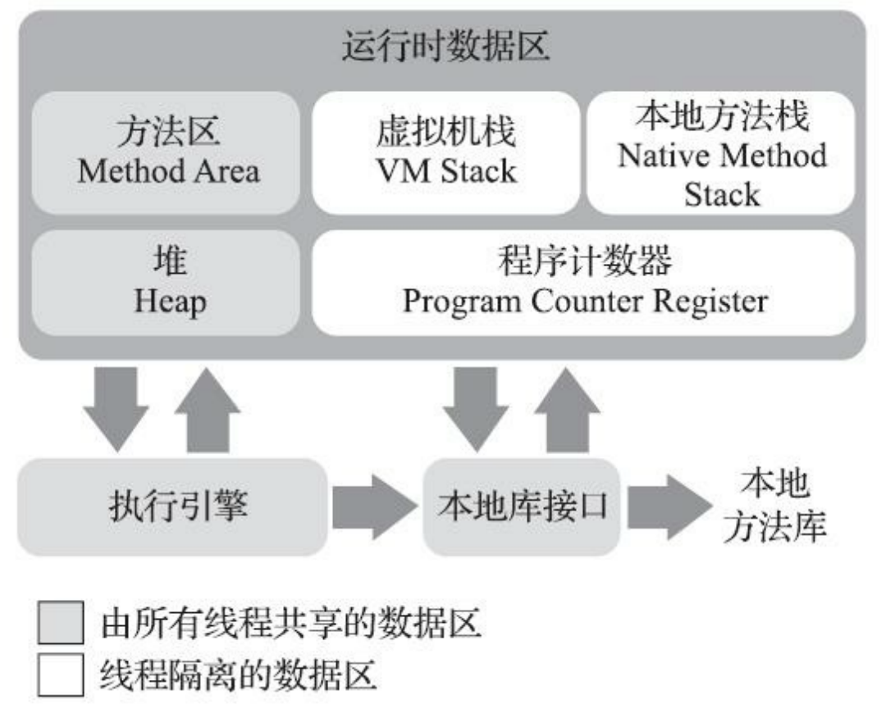
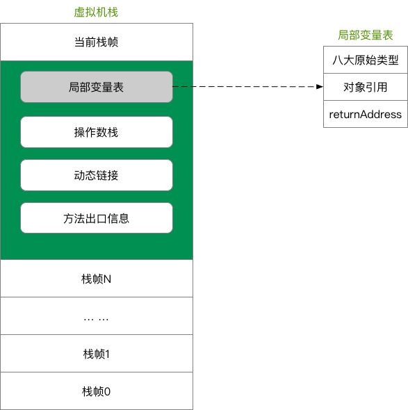

# JVM

## 内存模型

Java虚拟机在执行Java程序的过程中会把它所管理的内存划分为若干个不同的数据区域。
这些区域有各自的用途，以及创建和销毁的时间，有的区域随着虚拟机进程的启动而一直存在，有些区域则是依赖用户线程的启动和结束而建立和销毁。
根据《Java虚拟机规范》的规定，Java虚拟机所管理的内存将会包括以下几个运行时数据区域。



### 程序计数器 Program Counter Register

程序计数器是一块较小的内存空间，它可以看作是当前线程所执行的字节码的行号指示器。
在 Java 虚拟机的概念模型里，字节码解释器工作时就是通过改变这个计数器的值来选取下一条需要执行的字节码指令，它是程序控制流的指示器，分支、循环、跳转、异常处理、线程恢复等基础功能都需要依赖这个计数器来完成。

由于 Java 虚拟机的多线程是通过线程轮流切换、分配处理器执行时间的方式来实现的，在任何一个确定的时刻，一个处理器（对于多核处理器来说是一个内核）都只会执行一条线程中的指令。
因此，为了线程切换后能恢复到正确的执行位置，每条线程都需要有一个独立的程序计数器，各条线程之间计数器互不影响，独立存储，我们称这类内存区域为“线程私有”的内存。

如果线程正在执行的是一个 Java 方法，这个计数器记录的是正在执行的虚拟机字节码指令的地址；
如果正在执行的是本地（Native）方法，这个计数器值则应为空（Undefined）。
此内存区域是唯一一个在《Java虚拟机规范》中没有规定任何`OutOfMemoryError`情况的区域。

### 虚拟机栈 Virtual Machine Stack

与程序计数器一样，虚拟机栈也是线程私有的，它的生命周期与线程相同。
虚拟机栈描述的是 Java 方法执行的线程内存模型：每个方法被执行的时候，Java 虚拟机都会同步创建一个栈帧（Stack Frame）用于存储局部变量表、操作数栈、动态连接、方法出口等信息。
每一个方法被调用直至执行完毕的过程，就对应着一个栈帧在虚拟机栈中从入栈到出栈的过程。



局部变量表存放了编译期可知的各种 Java 虚拟机基本数据类型、`reference`类型和`returnAddress`类型。

- 基本类型：`boolean`、`byte`、`char`、`short`、`int`、`float`、`long`、`double`
- `reference`类型：对象引用，它并不等同于对象本身，可能是一个指向对象起始地址的引用指针，也可能是指向一个代表对象的句柄或者其他与此对象相关的位置
- `returnAddress`类型：指向了一条字节码指令的地址

这些数据类型在局部变量表中的存储空间以局部变量槽（Slot）来表示，其中64位长度的`long`和`double`类型的数据会占用两个变量槽，其余的数据类型只占用一个。
局部变量表所需的内存空间在编译期间完成分配，当进入一个方法时，这个方法需要在栈帧中分配多大的局部变量空间是完全确定的，在方法运行期间不会改变局部变量表的大小。
局部变量表中的槽位是可以重复的，如果一个局部变量过了其作用域，那么其作用域之后申明的新的局部变量就有可能会复用过期局部变量的槽位，从而达到节省资源的目的。

_请注意，这里说的“大小”是指变量槽的数量，虚拟机真正使用多大的内存空间（譬如按照1个变量槽占用32个比特、64个比特，或者更多）来实现一个变量槽，这是完全由具体的虚拟机实现自行决定的事情。_

在《Java虚拟机规范》中，对这个内存区域规定了两类异常状况：
如果线程请求的栈深度大于虚拟机所允许的深度，将抛出`StackOverflowError`异常；
如果 Java 虚拟机栈容量可以动态扩展，当栈扩展时无法申请到足够的内存会抛出`OutOfMemoryError`异常。

经常有人把 Java 内存区域笼统地划分为堆内存（Heap）和栈内存（Stack），这种划分方式直接继承自传统的 C 、 C++ 程序的内存布局结构，在 Java 语言里就显得有些粗糙了，实际的内存区域划分要比这更复杂。
不过这种划分方式的流行也间接说明了程序员最关注的、与对象内存分配关系最密切的区域是“堆”和“栈”两块。
其中，“堆”在稍后笔者会专门讲述，而“栈”通常就是指这里讲的虚拟机栈，或者更多的情况下只是指虚拟机栈中局部变量表部分。

### 本地方法栈 Native Method Stacks

本地方法栈与虚拟机栈所发挥的作用是非常相似的，其区别只是虚拟机栈为虚拟机执行 Java 方法（也就是字节码）服务，而本地方法栈则是为虚拟机使用到的本地（Native）方法服务。

《Java虚拟机规范》对本地方法栈中方法使用的语言、使用方式与数据结构并没有任何强制规定，因此具体的虚拟机可以根据需要自由实现它，甚至有的 Java 虚拟机（譬如HotSpot虚拟机）直接就把本地方法栈和虚拟机栈合二为一。
与虚拟机栈一样，本地方法栈也会在栈深度溢出或者栈扩展失败时分别抛出`StackOverflowError`和`OutOfMemoryError`异常。

### 堆 Heap

对于 Java 应用程序来说，堆是虚拟机所管理的内存中最大的一块。堆是被所有线程共享的一块内存区域，在虚拟机启动时创建。
此内存区域的唯一目的就是存放对象实例，Java 世界里“几乎”所有的对象实例都在这里分配内存。
在《Java虚拟机规范》中对堆的描述是：“所有的对象实例以及数组都应当在堆上分配”，而这里笔者写的“几乎”是指从实现角度来看，
随着 Java 语言的发展，现在已经能看到些许迹象表明日后可能出现值类型的支持，即使只考虑现在，由于即时编译技术的进步，
尤其是逃逸分析技术的日渐强大，栈上分配、标量替换等优化手段已经导致一些微妙的变化悄然发生，所以说 Java 对象实例都分配在堆上也渐渐变得不是那么绝对了。

堆是垃圾收集器管理的内存区域，因此一些资料中它也被称作“GC堆”（Garbage Collected Heap）。
从回收内存的角度看，由于现代垃圾收集器大部分都是基于分代收集理论设计的，所以堆中经常会出现“新生代”、“老年代”、“永久代”、“Eden空间”、“From Survivor空间”、“To Survivor空间”等名词，
这些区域划分仅仅是一部分垃圾收集器的共同特性或者说设计风格而已，而非某个 Java 虚拟机具体实现的固有内存布局，更不是《Java虚拟机规范》里对堆的进一步细致划分。
在十年之前（以G1收集器的出现为分界），作为业界绝对主流的 HotSpot 虚拟机，它内部的垃圾收集器全部都基于“经典分代”来设计，需要新生代、老年代收集器搭配才能工作，在这种背景下，上述说法还算是不会产生太大歧义。
但是到了今天，垃圾收集器技术与十年前已不可同日而语，HotSpot 里面也出现了不采用分代设计的新垃圾收集器，再按照上面的提法就有很多需要商榷的地方了。

如果从分配内存的角度看，所有线程共享的堆中可以划分出多个线程私有的分配缓冲区（Thread Local Allocation Buffer，TLAB），以提升对象分配时的效率。
不过无论从什么角度，无论如何划分，都不会改变堆中存储内容的共性，无论是哪个区域，存储的都只能是对象的实例，将堆细分的目的只是为了更好地回收内存，或者更快地分配内存。

根据《Java虚拟机规范》的规定，堆可以处于物理上不连续的内存空间中，但在逻辑上它应该被视为连续的，这点就像我们用磁盘空间去存储文件一样，并不要求每个文件都连续存放。
但对于大对象（典型的如数组对象），多数虚拟机实现出于实现简单、存储高效的考虑，很可能会要求连续的内存空间。

堆既可以被实现成固定大小的，也可以是可扩展的，不过当前主流的Java虚拟机都是按照可扩展来实现的（通过参数`-Xmx`和`-Xms`设定）。
如果在堆中没有内存完成实例分配，并且堆也无法再扩展时，Java 虚拟机将会抛出`OutOfMemoryError`异常。

### 方法区 Method Area

方法区与堆一样，是各个线程共享的内存区域，它用于存储已被虚拟机加载的类型信息、常量、静态变量、即时编译器编译后的代码缓存等数据。
虽然《Java虚拟机规范》中把方法区描述为堆的一个逻辑部分，但是它却有一个别名叫作“非堆”（Non-Heap），目的是与堆区分开来。

《Java虚拟机规范》对方法区的约束是非常宽松的，除了和堆一样不需要连续的内存和可以选择固定大小或者可扩展外，甚至还可以选择不实现垃圾收集。
相对而言，垃圾收集行为在这个区域的确是比较少出现的，但并非数据进入了方法区就如永久代的名字一样“永久”存在了。
这区域的内存回收目标主要是针对常量池的回收和对类型的卸载，一般来说这个区域的回收效果比较难令人满意，尤其是类型的卸载，条件相当苛刻，但是这部分区域的回收有时又确实是必要的。
以前 Sun 公司的 Bug 列表中，曾出现过的若干个严重的 Bug 就是由于低版本的 HotSpot 虚拟机对此区域未完全回收而导致内存泄漏。

根据《Java虚拟机规范》的规定，如果方法区无法满足新的内存分配需求时，将抛出`OutOfMemoryError`异常。

_方法区为Java虚拟机规范的逻辑概念，永久代、元空间等是 HotSpot 具体的实现细节，不是同一个维度的东西。_

#### 永久代 Permanent Generation

说到方法区，不得不提一下“永久代”这个概念，尤其是在 Java 8 以前，许多 Java 程序员都习惯在 HotSpot 虚拟机上开发、部署程序，很多人都更愿意把方法区称呼为“永久代”，或将两者混为一谈。
本质上这两者并不是等价的，因为仅仅是当时的 HotSpot 虚拟机设计团队选择把收集器的分代设计扩展至方法区，或者说使用永久代来实现方法区而已，这样使得 HotSpot 的垃圾收集器能够像管理堆一样管理这部分内存，省去专门为方法区编写内存管理代码的工作。
但是对于其他虚拟机实现，譬如BEA JRockit、IBM J9等来说，是不存在永久代的概念的。原则上如何实现方法区属于虚拟机实现细节，不受《Java虚拟机规范》管束，并不要求统一。
但现在回头来看，当年使用永久代来实现方法区的决定并不是一个好主意，这种设计导致了Java应用更容易遇到内存溢出的问题（永久代有-XX：MaxPermSize的上限，即使不设置也有默认大小），
而且有极少数方法会因永久代的原因而导致不同虚拟机下有不同的表现，例如：`String`类的`intern()`方法。

考虑到 HotSpot 未来的发展，在 Java 6 的时候，HotSpot 开发团队就有放弃永久代，逐步改为采用本地内存（Native Memory）来实现方法区的计划了，到了 Java 7，已经把原本放在永久代的字符串常量池、静态变量等移出，
而到了 Java 8，终于完全废弃了永久代的概念，改用在本地内存中实现的元空间（Metaspace）来代替，把 Java 7 中永久代还剩余的内容（主要是类型信息）全部移到元空间中。

#### 运行时常量池 Runtime Constant Pool

运行时常量池是方法区的一部分。Class 文件中除了有类的版本、字段、方法、接口等描述信息外，还有一项信息是常量池表（Constant Pool Table），用于存放编译期生成的各种字面量与符号引用，这部分内容将在类加载后存放到方法区的运行时常量池中。

Java 虚拟机对于 Class 文件每一部分（自然也包括常量池）的格式都有严格规定，如每一个字节用于存储哪种数据都必须符合规范上的要求才会被虚拟机认可、加载和执行，
但对于运行时常量池，《Java虚拟机规范》并没有做任何细节的要求，不同提供商实现的虚拟机可以按照自己的需要来实现这个内存区域，
不过一般来说，除了保存Class文件中描述的符号引用外，还会把由符号引用翻译出来的直接引用也存储在运行时常量池中。

运行时常量池相对于 Class 文件常量池的另外一个重要特征是具备动态性，Java 语言并不要求常量一定只有编译期才能产生，
也就是说，并非预置入 Class 文件中常量池的内容才能进入方法区运行时常量池，运行期间也可以将新的常量放入池中，这种特性被开发人员利用得比较多的便是`String`类的`intern()`方法。

既然运行时常量池是方法区的一部分，自然受到方法区内存的限制，当常量池无法再申请到内存时会抛出`OutOfMemoryError`异常。

### 直接内存 Direct Memory

直接内存并不是虚拟机运行时数据区的一部分，也不是《Java虚拟机规范》中定义的内存区域。但是这部分内存也被频繁地使用，而且也可能导致`OutOfMemoryError`异常出现。

在 Java 1.4 中新加入了NIO（New Input/Output）类，引入了一种基于通道（Channel）与缓冲区（Buffer）的I/O方式，
它可以使用Native函数库直接分配堆外内存，然后通过一个存储在堆里面的`DirectByteBuffer`对象作为这块内存的引用进行操作。这样能在一些场景中显著提高性能，因为避免了在堆和 Native 堆中来回复制数据。

显然，本机直接内存的分配不会受到堆大小的限制，但是，既然是内存，则肯定还是会受到本机总内存（包括物理内存、SWAP分区或者分页文件）大小以及处理器寻址空间的限制，
一般服务器管理员配置虚拟机参数时，会根据实际内存去设置`-Xmx`等参数信息，但经常忽略掉直接内存，使得各个内存区域总和大于物理内存限制（包括物理的和操作系统级的限制），从而导致动态扩展时出现`OutOfMemoryError`异常

## 对象创建过程

Java 是一门面向对象的编程语言，Java 程序运行过程中无时无刻都有对象被创建出来。
在语言层面上，创建对象通常（例外：复制、反序列化）仅仅是一个`new`关键字而已，而在虚拟机中，对象的创建又是怎样一个过程呢？

当 Java 虚拟机遇到一条字节码`new`指令时，首先将去检查这个指令的参数是否能在常量池中定位到一个类的符号引用，并且检查这个符号引用代表的类是否已被加载、解析和初始化过，如果没有，那必须先执行相应的类加载过程。

在类加载检查通过后，接下来虚拟机将为新生对象分配内存。
对象所需内存的大小在类加载完成后便可完全确定，为对象分配空间的任务实际上便等同于把一块确定大小的内存块从堆中划分出来。
假设堆中内存是绝对规整的，所有被使用过的内存都被放在一边，空闲的内存被放在另一边，中间放着一个指针作为分界点的指示器，那所分配内存就仅仅是把那个指针向空闲空间方向挪动一段与对象大小相等的距离，这种分配方式称为“指针碰撞”（Bump ThePointer）。
但如果堆中的内存并不是规整的，已被使用的内存和空闲的内存相互交错在一起，那就没有办法简单地进行指针碰撞了，虚拟机就必须维护一个列表，记录上哪些内存块是可用的，
在分配的时候从列表中找到一块足够大的空间划分给对象实例，并更新列表上的记录，这种分配方式称为“空闲列表”（Free List）。
选择哪种分配方式由堆是否规整决定，而堆是否规整又由所采用的垃圾收集器是否带有空间压缩整理（Compact）的能力决定。
因此，当使用Serial、ParNew等带压缩整理过程的收集器时，系统采用的分配算法是指针碰撞，既简单又高效；而当使用CMS这种基于清除（Sweep）算法的收集器时，理论上就只能采用较为复杂的空闲列表来分配内存。

除如何划分可用空间之外，还有另外一个需要考虑的问题：对象创建在虚拟机中是非常频繁的行为，即使仅仅修改一个指针所指向的位置，在并发情况下也并不是线程安全的，可能出现正在给对象A分配内存，指针还没来得及修改，对象B又同时使用了原来的指针来分配内存的情况。
解决这个问题有两种可选方案：一种是对分配内存空间的动作进行同步处理——实际上虚拟机是采用 CAS 配上失败重试的方式保证更新操作的原子性；
另外一种是把内存分配的动作按照线程划分在不同的空间之中进行，即每个线程在堆中预先分配一小块内存，称为本地线程分配缓冲（Thread Local Allocation Buffer，TLAB），哪个线程要分配内存，就在哪个线程的本地缓冲区中分配，只有本地缓冲区用完了，分配新的缓存区时才需要同步锁定。
虚拟机是否使用 TLAB，可以通过`-XX:+/-UseTLAB`参数来设定。

内存分配完成之后，虚拟机必须将分配到的内存空间（但不包括对象头）都初始化为零值，如果使用了 TLAB 的话，这一项工作也可以提前至 TLAB 分配时顺便进行。
这步操作保证了对象的实例字段在 Java 代码中可以不赋初始值就直接使用，使程序能访问到这些字段的数据类型所对应的零值。

接下来，Java 虚拟机还要对对象进行必要的设置，例如这个对象是哪个类的实例、如何才能找到类的元数据信息、对象的哈希码（实际上对象的哈希码会延后到真正调用Object::hashCode()方法时才计算）、对象的GC分代年龄等信息。
这些信息存放在对象的对象头（Object Header）之中，根据虚拟机当前运行状态的不同，如是否启用偏向锁等，对象头会有不同的设置方式。

在上面工作都完成之后，从虚拟机的视角来看，一个新的对象已经产生了。
但是从Java程序的视角看来，对象创建才刚刚开始——构造函数，即 Class 文件中的`<init>()`方法还没有执行，所有的字段都为默认的零值，对象需要的其他资源和状态信息也还没有按照预定的意图构造好。
一般来说（由字节码流中`new`指令后面是否跟随`invokespecial`指令所决定，Java 编译器会在遇到`new`关键字的地方同时生成这两条字节码指令，但如果直接通过其他方式产生的则不一定如此），
`new`指令之后会接着执行`<init>()`方法，按照程序员的意愿对对象进行初始化，这样一个真正可用的对象才算完全被构造出来。

## GC

### CMS

### G1

### ZGC

## 类加载器

众所周知，运行 Java 程序需要先把`.java`文件编译成`.class`文件，然后通过 JVM 加载字节码文件到内存运行，而`Classloader`所做的事情就是将`.class`文件加载到 JVM 中。

### BootstrapClassLoader

引导类加载器，又称启动类加载器，是最顶层的类加载器，主要用来加载核心类，如：`rt.jar`、`resources.jar`、`charsets.jar`等。执行`java`的命令中使用`-Xbootclasspath`指定需要附加加载类的路径。

需要注意的是，它不是`java.lang.ClassLoader`的子类，而是由 JVM 自身实现的该类`C++`实现，Java 程序无法访问该加载器。

### ExtClassloader

扩展类加载器，主要负责加载扩展类库，默认加载`%JAVA_HOME%/jre/lib/ext/`目下的所有jar包和类，或者由`java.ext.dirs`系统属性指定的jar包，
放入这个目录下的jar包对所有`AppClassloader`都是可见的，因为`ExtClassloader`是`AppClassloader`的父加载器。

### AppClassloader

系统类加载器，又称应用程序类加载器，它负责在 JVM 启动时加载`classpath`，或者`java.class.path`系统属性，或者操作系统`CLASSPATH`属性所指定的jar包和类路径。

调用`ClassLoader.getSystemClassLoader()`可以获取该类加载器，这里的`SystemClassLoader`即`AppClassloader`。
如果没有特别指定，则用户自定义的任何类加载器都将`AppClassloader`作为父加载器，这点通过`ClassLoader`类的无参构造函数可以知道如下：

```java
/**
 * Creates a new class loader using the <tt>ClassLoader</tt> returned by
 * the method {@link #getSystemClassLoader()
 * <tt>getSystemClassLoader()</tt>} as the parent class loader.
 *
 * <p> If there is a security manager, its {@link
 * SecurityManager#checkCreateClassLoader()
 * <tt>checkCreateClassLoader</tt>} method is invoked.  This may result in
 * a security exception.  </p>
 *
 * @throws  SecurityException
 *          If a security manager exists and its
 *          <tt>checkCreateClassLoader</tt> method doesn't allow creation
 *          of a new class loader.
 */
protected ClassLoader() {
    this(checkCreateClassLoader(), getSystemClassLoader());
}
```

用户自定义的无参加载器的父类加载器默认是`AppClassloader`，而`AppClassloader`的父加载器是`ExtClassloader`，通过下面代码可以验证：

```java
// Launcher$ExtClassLoader
ClassLoader.getSystemClassLoader().getParent();
```

一般我们都认为`ExtClassloader`的父类加载器是`BootstrapClassLoader`，但是其实他们之间根本是没有父子关系的，只是在`ExtClassloader`找不到要加载类时候会去委托`BootstrapClassLoader`去加载。

_注意，这里说的父子关系并不是继承关系，而是通过定义`private final ClassLoader parent`属性关联。_

### ContextClassLoader

线程上下文类加载器存在的目的主要是为了解决双亲委派机制下无法解决的问题。

如果你了解过 Tomcat 或写过集团中间件，那么你应该对线程上下文类加载器很熟悉，可以很多地方看到下面的结构的用法：

```java
ClassLoader classLoader = Thread.currentThread().getContextClassLoader();
try {
    Thread.currentThread().setContextClassLoader(targetTccl);
    // do something 
} finally {
    Thread.currentThread().setContextClassLoader(classLoader);
}
```

我们知道Java默认的类加载机制是委托机制，但是有时这种加载顺序不能正常工作，通常发生在有些 JVM 核心代码必须动态加载由应用程序开发人员提供的资源时。

Java 提供了很多服务提供者接口（Service Provider Interface，SPI），允许第三方厂商为这些接口提供实现。
常见的 SPI 有 JDBC、JCE、JNDI、JAXP 和 JBI 等，这些 SPI 的实现代码很可能是作为 Java 应用所依赖的 jar 包被包含进来。
问题在于 SPI 接口是 Java 核心库的一部分，是由引导类加载器来加载的，而 SPI 实现类一般是由系统类加载器来加载的。引导类加载器是无法找到 SPI 的实现类的，因为它只加载 Java 的核心库。

线程上下文类加载器正好解决了这个问题。如果不做任何的设置，Java 应用的线程的上下文类加载器默认就是系统上下文类加载器。在 SPI 接口的代码中使用线程上下文类加载器，就可以成功的加载到 SPI 实现的类。

### UserClassLoader

用户自定义加载类继承`ClassLoader`重写`findClass`方法即可，无法被父类加载器加载的类最终会通过`findClass`方法被加载。如果想打破双亲委派模型则需要重写`loadClass`方法。

### 双亲委派

双亲委派机制，也就是子类加载器在加载一个类时候会让父类来加载，那么问题来了，为什么使用这种方式呢？因为这样可以避免重复加载，当父类加载器已经加载了该类的时候，就没有必要用子类加载器再加载一次。
考虑到安全因素，我们试想一下，如果不使用这种模式，那我们就可以随时使用自定义的`String`来动态替代核心`API`中定义的类型，这样会存在非常大的安全隐患，而双亲委派的机制就可以避免这种情况，因为`String`已经在启动时就被`BootstrapClassLoader`加载，
所以用户自定义的`ClassLoader`永远也无法加载一个自己写的`String`。

```java
protected Class<?> loadClass(String name, boolean resolve) throws ClassNotFoundException {
    synchronized (getClassLoadingLock(name)) {
        // 判断类是否已被加载，如果已加载则直接返回
        Class<?> c = findLoadedClass(name);
        if (c == null) {
            long t0 = System.nanoTime();
            try {
                if (parent != null) {
                    // 委托父加载器进行加载类
                    c = parent.loadClass(name, false);
                } else {
                    // 委托引导类加载器进行加载类
                    c = findBootstrapClassOrNull(name);
                }
            } catch (ClassNotFoundException e) {
                // ClassNotFoundException thrown if class not found
                // from the non-null parent class loader
            }

            if (c == null) {
                // 如果依然没找到则调用 findClass 方法加载类
                // 自定义 ClassLoader 类需要重写 findClass 方法，否则会抛出 ClassNotFoundException 异常把加载任务下沉到子加载器去执行
                long t1 = System.nanoTime();
                c = findClass(name);

                // this is the defining class loader; record the stats
                PerfCounter.getParentDelegationTime().addTime(t1 - t0);
                PerfCounter.getFindClassTime().addElapsedTimeFrom(t1);
                PerfCounter.getFindClasses().increment();
            }
        }
        if (resolve) {
            resolveClass(c);
        }
        return c;
    }
}

protected Class<?> findClass(String name) throws ClassNotFoundException {
    // 抛出 ClassNotFoundException 异常
    throw new ClassNotFoundException(name);
}
```

_双亲委派是翻译问题，不是指有两个加载器。_

### Java 9 改动

我们下面的代码输出类加载器的层次结构。

```java
ClassLoader classLoader = Test.class.getClassLoader();
while (classLoader != null) {
    System.out.println(classLoader);
    classLoader = classLoader.getParent();
}
```

当在 Java 8 环境中运行上述代码时，输出的结果如下，其中`AppClassLoader`和`ExtClassLoader`分别对应于系统类加载器和扩展类加载器，引导类加载器由`null`表示，在输出中不会显示。

```text
sun.misc.Launcher$AppClassLoader@18b4aac2
sun.misc.Launcher$ExtClassLoader@2c7b84de
```

虽然 Java 9 仍然保留了三层类加载器结构，不过为了支持模块系统，对它们做了一些调整。扩展机制被移除，扩展类加载器由于向后兼容性的原因被保留，不过被重命名为平台类加载器`PlatformClassLoader`。
可以通过`ClassLoader`的新方法`getPlatformClassLoader()`来获取。

平台类加载器`PlatformClassLoader`和系统类加载器`AppClassLoader`不再继承`URLClassLoader`类。
这会影响一个常见的用来在运行时向系统类加载器的查找路径中添加条目的`hack`。在下面的代码中，通过反射调用`addURL(URL url)`方法。该方式在 Java 9 环境中无法工作。

在 Java 9 中，类加载器有了名称。该名称在构造方法中指定，可以通过`getName()`方法来获取。平台类加载器的名称是`platform`，应用类加载器的名称是`app`。类加载器的名称在调试与类加载器相关的问题时会非常有用。

```java
public void addPath(String s) throws Exception {
    File file = new File(s);
    ClassLoader classLoader = ClassLoader.getSystemClassLoader();
    Method method = URLClassLoader.class.getDeclaredMethod("addURL", URL.class);
    method.setAccessible(true);
    method.invoke(classLoader, file.toURI().toURL());
}
```

## 逃逸分析

典型的对象逃逸：对象被复制给成员变量或者静态变量，可能被外部使用，此时变量就发生了逃逸。

```java
public class Foo {
    private Bar bar;
    
    public void init(){
        this.bar = new Bar();
    }
}
```

对象通过`return`语句返回，此时的程序并不能确定这个对象后续会不会被使用，外部的线程可以访问到这个变量，此时对象也发生了逃逸。

```java
public Object create() {
    Object obj = new Object();
    // do something
    return obj;
}
```

通过逃逸分析，HotSpot VM 能够分析变量作用域从而实现某些特殊的优化。

在 HotSpot VM 的源码中，可以看到逃逸分析系统是如何对对象的使用进行分类的：

```c
typedef enum {
  NoEscape = 1,    // An object does not escape method or thread and it is
                   // not passed to call. It could be replaced with scalar.

  ArgEscape = 2,   // An object does not escape method or thread but it is
                   // passed as argument to call or referenced by argument
                   // and it does not escape during call.
                   
  GlobalEscape = 3 // An object escapes the method or thread.
}
```

### 栈上分配

我们通过JVM内存分配可以知道JAVA中的对象都是在堆上进行分配，当对象没有被引用的时候，需要依靠GC进行回收内存，如果对象数量较多的时候，会给GC带来较大压力，也间接影响了应用的性能。
为了减少临时对象在堆内分配的数量，JVM通过逃逸分析确定该对象不会被外部访问。那就通过标量替换将该对象分解在栈上分配内存，这样该对象所占用的内存空间就可以随栈帧出栈而销毁，就减轻了垃圾回收的压力。

```java
public class Rect {
    private int w;
    private int h;

    public Rect(int w, int h) {
        this.w = w;
        this.h = h;
    }

    public int area() {
        return w * h;
    }

    public boolean isSameArea(Rect other) {
        return this.area() == other.area();
    }
}

public static void main(String[] args) {
    Random rand = new Random();
    int sameArea = 0;
    for (int i = 0; i < 100000000; i++) {
        Rect r1 = new Rect(rand.nextInt(5), rand.nextInt(5));
        Rect r2 = new Rect(rand.nextInt(5), rand.nextInt(5));
        if (r1.isSameArea(r2)) {
            sameArea++;
        }
    }
    System.out.println("Same area: " + sameArea);
}
```

上述代码创建了一亿对随机大小的矩形，并去计算有多少对是大小一样的。每次迭代都会创建一对新的矩形，你可能会认为一共创建2亿个`Rect`对象。

经过逃逸分析后发现这些对象不会发生逃逸，则这些不会在堆上分配空间，而是在栈上分配内存，对象所占用内存空间随栈帧出栈而释放，因此它们也不需要通过垃圾回收器来回收。

### 标量替换

- 标量：指不可分解的量，如：基本数据类型和`reference`类型
- 聚合量：指可继续分解的量，如：Java 对象

经过逃逸分析后发现一个对象不会被外部访问，并且该对象可以被分散，那么程序真正执行时将可能不会创建对象，而是在方法内部创建多个局部变量。

```java
public class Rect {
    private int w;
    private int h;

    public Rect(int w, int h) {
        this.w = w;
        this.h = h;
    }
}

/** 标量替换前 */
public static void main(String[] args) {
    Rect rect = new Rect(1, 1);
    System.out.println("width: " + rect.w + ", height: " + rect.h);
}

/** 标量替换后 */
public static void main2(String[] args) {
    int w = 1;
    int h = 1;
    System.out.println("width: " + w + ", height: " + h);
}
```

### 同步锁消除

经过逃逸分析发现一个对象被加了锁，但是只会被一个线程被访问到，会移除不可能存在共享资源竞争的锁，通过这种方式消除没有必要的锁，可以节省毫无意义的时间消耗。

被加锁的对象只有当前方法中使用：

```java
synchronized (new Object()) {
    run();
}
```
