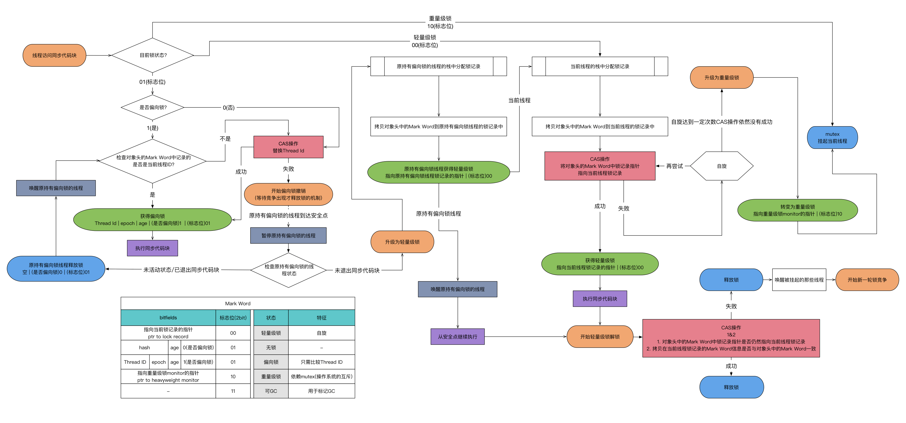

# synchronized

Java 中有两种加锁的方式：一种是用`synchronized`关键字，另一种是用`Lock`接口的实现类。

|        | synchronized | Lock                                                            |
|:-------|:-------------|:----------------------------------------------------------------|
| 作用域    | 方法和代码块       | 代码块                                                             |
| 实现方式   | 对象头          | AbstractQueuedSynchronizer                                      |
| 是否可重入  | 可重入          | 根据实现类，例如`ReentrantLock`和`ReentrantReadWriteLock`可重入             |
| 是否是公平锁 | 非公平锁         | 根据实现类，例如`ReentrantLock`和`ReentrantReadWriteLock`可通过构造方法指定公平或非公平 |
| 是否可释放锁 | 不可释放         | 可释放，有`void unlock();`方法                                         |

## synchronized 使用方法

修饰在非静态方法上时，锁当前对象。

```java
public synchronized void foo() {
    // ...
}
```

修饰在静态方法上时，锁当前类。

```java
public static synchronized void fo2() {
    // ...
}
```

作用在代码块并指定类时，锁指定类。

```java
public synchronized void foo() {
    synchronized (Bar.class) {
        // ...
    }
}
```

作用在代码块并指定对象时，锁指定对象。

```java
public synchronized void foo() {
    synchronized (bar) {
        // ...
    }
}
```

## synchronized 锁膨胀

过程：无锁 -> 偏向锁 -> 轻量级锁 -> 重量级锁



- 偏向锁状态可以被重置为无锁状态
- ~~偏向锁升级为轻量级锁不能再降级为偏向锁~~
- ~~轻量级锁升级为重量级锁不能再降级为轻量级锁~~

### Mark Word


### Monitor

Monitor 被翻译为监视器或管程，每个 Java 对象都可以关联一个 Monitor 对象，如果使用`synchronized`给对象上锁（重量级）之后，该对象头的 Mark Word 中就被设置指向 Monitor 对象的指针。Monitor 的结构如下：


1. 默认情况下，Monitor 的 Owner 为 null
2. 当 Thread-2 进入同步代码时，就会将 Monitor 的 Owner 设置为 Thread-2
3. 在 Thread-2 同步的过程中，如果 Thread-3、Thread-4、Thread-5 也进入同步代码时，就会被放入 EntryList 中，进入阻塞状态
4. 在 Thread-2 退出同步代码时，然后唤醒 EntryList 中等待的线程来竞争锁，竞争的时是非公平的
5. 图中 WaitSet 中的存放的 Thread-0 和 Thread-1 是在同步代码中，调用了`Object.wait()`的线程
    - `Object.wait()`会使线程等待，WaitSet 存放等待的线程
    - `Object.notify()`会唤醒一个 WaitSet 中的线程
    - `Object.notifyAll()`会唤醒 WaitSet 中的所有线程

这些方法用于线程之间进行协作，属于`Object`对象的方法，因此调用这些方法时，必须获得此对象的锁。

### 1. 无锁

当对象的Monitor对象没有被线程所持有，代表的是对象处于无锁状态。

### 2. 偏向锁

偏向锁是`Java 6`后面引入的一项锁优化技术，在无锁竞争的情况下，一个线程通过一次`CAS`操作来尝试将对象头中的`Thread ID`设置为当前线程，并设置偏向锁的标识为`1`，如果设置成功，则成功获得锁。

具体过程如下：

当`线程A`访问代码块并获取锁对象时，会在`Java`对象头和栈帧中记录偏向的锁的`Thread ID`，
由于偏向锁不会主动释放锁，因此之后`线程A`再次获取锁的时候，只需要比较`线程A`的`Thread ID`和对象头中的`Thread ID`是否一致即可，如果一致，则说明还是该线程获取锁。

若之后有一个新的`线程B`想要获取锁，而锁的对象头中的`Thread ID`还是原来`线程A`的，则需要判断`线程A`是否存活

- 如果`线程A`是非存活状态：锁对象将被重置为无锁状态，新的`线程B`可以获取该偏向锁。
- 如果`线程A`是存活状态，找到`线程A`的栈帧信息，
    - 如果`线程A`需要继续持有这个锁对象，说明存在锁的竞争，当到达`safepoint`（指在这个时间点上没有字节码正在执行）时获得偏向锁的`线程B`被挂起，偏向锁升级为轻量级锁，然后被阻塞在安全点的`线程A`继续往下执行同步代码。
    - 如果`线程A`不再使用该锁对象，那么将锁对象状态设为无锁状态，重新偏向新的`线程B`。

偏向锁能够减少无竞争锁定时的开销，其目的是假定该锁一直由某个特定线程持有，直到另一个线程尝试获取它，这样就可以避免同一对象的后续同步操作执行`CAS`操作。


从历史上看，偏向锁使得 JVM 的性能得到了显著改善。

然而`Java 15`版本废弃了偏向锁：[JEP 374: Disable and Deprecate Biased Locking](https://openjdk.java.net/jeps/374)

> 过去看到的性能提升在今天远不那么明显。  
> 许多受益于偏向锁的应用程序是使用早期 Java 集合 API 的旧的遗留应用程序，这些 API 在每次访问时都会同步（例如：Hashtable 和 Vector）。  
> 较新的应用程序通常使用 Java 1.2 中针对单线程场景引入的非同步集合（例如：HashMap 和 ArrayList），或者使用 Java 5 中针对多线程场景引入的性能更高的并发数据结构。  
> 这意味着如果更新代码以使用这些较新的类，由于不必要的同步而受益于偏向锁的应用程序可能会看到性能改进。此外，围绕线程池队列和工作线程构建的应用程序通常在禁用偏向锁的情况下性能更好。
>
> 偏向锁在同步子系统中引入了许多复杂的代码，并且还侵入了其他 HotSpot 组件。这种复杂性是理解代码各个部分的障碍，也是在同步子系统内进行重大设计更改的障碍。为此，我们希望禁用、弃用并最终移除对偏向锁的支持。
>
> 在 JDK 15 之前，偏向锁始终处于启用状态且可用。除非在命令行中设置`-XX:+UseBiasedLocking`，否则在启动 HotSpot 时将不再启用偏向锁。

### 3. 轻量级锁

轻量级锁的加锁过程

1. 当代码进入同步代码块的时候，如果同步对象锁状态是无锁状态（锁标志位是01，是否为偏向锁是0），虚拟机首先在当前的栈帧中建立一个名为锁记录（Lock Record)的空间，用于存储锁对象的Mark Word的拷贝，官方称之为 Displaced Mark Word。这时候线程堆栈与对象头的状态如图一所示。
2. 拷贝对象头中的Mark Word复制到锁记录中。
3. 拷贝成功后，虚拟机将使用CAS操作尝试将对象的Mark Word更新为指向Lock Record的指针，并将Lock record里的owner指针指向object mark word。如果更新成功，则执行步骤4，否则执行步骤5。
4. 如果这个更新动作成功了，那么这个线程就拥有了该对象的锁，并且对象Mark Word的锁标志位设置为“00”，即表示此对象处于轻量级锁定状态，这时候线程堆栈与对象头的状态如图二所示。
5. 如果这个更新操作失败了，虚拟机首先会检查对象的Mark Word是否指向当前线程的栈帧，如果是就说明当前线程已经拥有了这个对象的锁，那就可以直接进入同步块继续执行。否则说明多个线程竞争锁，轻量级锁就要膨胀为重量级锁，锁标志的状态值变为“10”，Mark Word中存储的就是指向重量级锁（互斥量）的指针，后面等待锁的线程也要进入阻塞状态。而当前线程便尝试使用自旋来获取锁，自旋就是为了不让线程阻塞，而采用循环去获取锁的过程。

轻量级锁的解锁过程：

1. 通过CAS操作尝试把线程中复制的Displaced Mark Word对象替换当前的Mark Word。
2. 如果替换成功，整个同步过程就完成了。
3. 如果替换失败，说明有其他线程尝试过获取该锁（此时锁已膨胀，Mark Word存的是指向重量级锁的指针），那就要在释放锁的同时，唤醒被挂起的线程。

轻量级锁对少量线程竞争同一个资源并且他们的操作时间比较短的场景性能较好，没有竞争到锁的线程会轮询固定的次数来获取轻量级锁，不会阻塞线程。
因为阻塞线程需要`CPU`从用户态转到内核态，其代价较大。


### 4. 重量级锁

当一个轻量级锁自旋超过一定次数（默认10次），或被两个及以上的线程竞争的时候，轻量级锁就会膨胀为重量级锁。


## synchronized 锁粗化

将多个连续的加锁、解锁操作连接在一起，扩展成一个范围更大的锁，避免频繁的加锁解锁操作。

例如在循环中使用`synchronized`：

```java
for (int i = 0; i < 1000; i++) {
    synchronized (this) {
        i++;
    }
}
```

优化后将锁的粒度粗化（近似代码）：

```java
synchronized (this) {
    for (int i = 0; i < 1000; i++) {
        i++;
    }
}
```

## synchronized 锁消除

虚拟机在`JIT`编译时，通过对运行上下文的扫描，经过逃逸分析发现一个对象被加了锁，但是只会被一个线程被访问到，会移除不可能存在共享资源竞争的锁，
通过这种方式消除没有必要的锁，可以节省毫无意义的时间消耗。

被加锁的对象只有当前方法中使用：

```java
synchronized (new Object()) {
    run();
}
```

## 悲观锁与乐观锁

悲观锁与乐观锁并不是特指某个锁，而是在并发情况下的两种不同策略。

- 悲观锁 (Pessimistic Lock): 读取或修改数据时会获取锁，若锁被别的线程持就等待或返回失败。
- 乐观锁 (Optimistic Lock): 乐观锁不是锁，而是在修改数据时，判断数据是否被修改过，若被修改过就进行重试或返回失败。

悲观锁阻塞事务，乐观锁回滚重试，它们适用于不同的场景。
乐观锁适用于写比较少的情况下，即冲突真的很少发生的时候，这样可以省去锁的开销，加大了系统的整个吞吐量。
若经常产生冲突，不断的进行重试造成性能浪费，这种情况下用悲观锁就比较合适。
