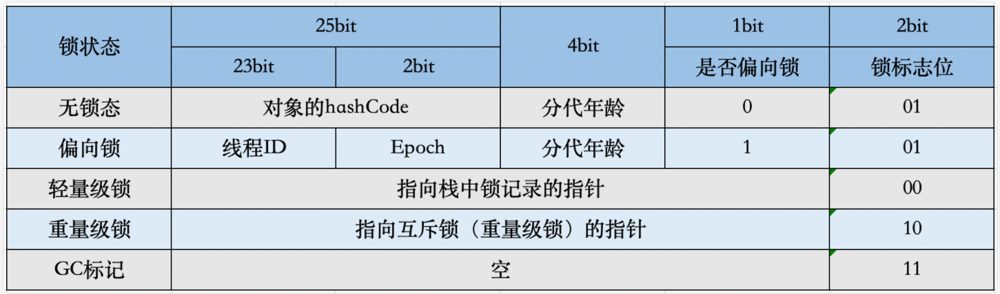
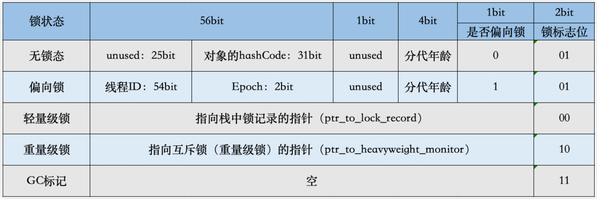
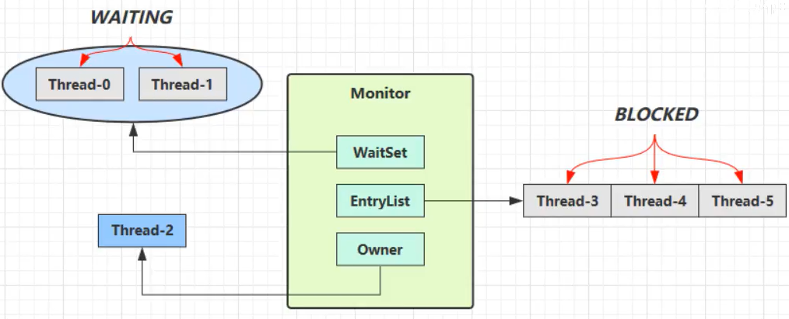
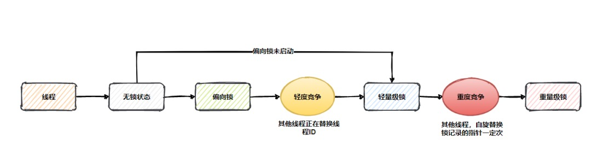

# synchronized

Java 中有两种加锁的方式：一种是用`synchronized`关键字，另一种是用`Lock`接口的实现类。

|          | synchronized  | ReentrantLock/ReentrantReadWriteLock |
|:---------|:--------------|:-------------------------------------|
| 作用域      | 方法和代码块        | 代码块                                  |
| 实现方式     | 偏向锁、轻量级锁、重量级锁 | AbstractQueuedSynchronizer           |
| 是否可重入    | 可重入           | 可重入                                  |
| 是否是公平锁   | 非公平锁          | 可通过构造方法指定公平或非公平                      |
| 是否可主动释放锁 | 不可主动释放        | 可主动释放，调用`unlock()`方法                 |

## synchronized 使用方式

### 作用对象

作用在代码块并指定对象时，锁指定对象。

```java
public synchronized void foo() {
    synchronized (bar) {
        // ...
    }
}
```

### 作用方法

修饰在非静态方法上时，锁当前对象。

```java
public synchronized void foo() {
    // ...
}
```

### 作用静态方法

修饰在静态方法上时，锁当前类。

```java
public static synchronized void foo() {
    // ...
}
```

### 作用类

作用在代码块并指定类时，锁指定类。

```java
public synchronized void foo() {
    synchronized (Bar.class) {
        // ...
    }
}
```

## synchronized 使用方式的区别

通过`javap -v SynchronizedStyle.java`命令反编译以下类：

```
public class SynchronizedStyle {
    private final Object lock = new Object();

    public void syncObject() {
        synchronized (lock) {
            System.out.println("syncObject");
        }
    }

    public synchronized void syncMethod() {
        System.out.println("syncMethod");
    }


    public static synchronized void syncStaticMethod() {
        System.out.println("syncObject");
    }

    public void syncClass() {
        synchronized (SynchronizedStyle.class) {
            System.out.println("syncBlock");
        }
    }
}
```

```text
Classfile /synchronized-markword/target/classes/io/leego/test/SynchronizedStyle.class
  Last modified 2022年7月29日; size 1007 bytes
  SHA-256 checksum e7727ab627c0fb18699ce95d4405689f7ceaebf84bb71ecd24bc940b1bc794c3
  Compiled from "SynchronizedStyle.java"
public class io.leego.test.SynchronizedStyle
  minor version: 0
  major version: 52
  flags: (0x0021) ACC_PUBLIC, ACC_SUPER
  this_class: #8                          // io/leego/test/SynchronizedStyle
  super_class: #2                         // java/lang/Object
  interfaces: 0, fields: 1, methods: 5, attributes: 1
Constant pool:
   #1 = Methodref          #2.#3          // java/lang/Object."<init>":()V
   #2 = Class              #4             // java/lang/Object
   #3 = NameAndType        #5:#6          // "<init>":()V
   #4 = Utf8               java/lang/Object
   #5 = Utf8               <init>
   #6 = Utf8               ()V
   #7 = Fieldref           #8.#9          // io/leego/test/SynchronizedStyle.lock:Ljava/lang/Object;
   #8 = Class              #10            // io/leego/test/SynchronizedStyle
   #9 = NameAndType        #11:#12        // lock:Ljava/lang/Object;
  #10 = Utf8               io/leego/test/SynchronizedStyle
  #11 = Utf8               lock
  #12 = Utf8               Ljava/lang/Object;
  #13 = Fieldref           #14.#15        // java/lang/System.out:Ljava/io/PrintStream;
  #14 = Class              #16            // java/lang/System
  #15 = NameAndType        #17:#18        // out:Ljava/io/PrintStream;
  #16 = Utf8               java/lang/System
  #17 = Utf8               out
  #18 = Utf8               Ljava/io/PrintStream;
  #19 = String             #20            // syncObject
  #20 = Utf8               syncObject
  #21 = Methodref          #22.#23        // java/io/PrintStream.println:(Ljava/lang/String;)V
  #22 = Class              #24            // java/io/PrintStream
  #23 = NameAndType        #25:#26        // println:(Ljava/lang/String;)V
  #24 = Utf8               java/io/PrintStream
  #25 = Utf8               println
  #26 = Utf8               (Ljava/lang/String;)V
  #27 = String             #28            // syncMethod
  #28 = Utf8               syncMethod
  #29 = String             #30            // syncBlock
  #30 = Utf8               syncBlock
  #31 = Utf8               Code
  #32 = Utf8               LineNumberTable
  #33 = Utf8               LocalVariableTable
  #34 = Utf8               this
  #35 = Utf8               Lio/leego/test/SynchronizedStyle;
  #36 = Utf8               StackMapTable
  #37 = Class              #38            // java/lang/Throwable
  #38 = Utf8               java/lang/Throwable
  #39 = Utf8               syncStaticMethod
  #40 = Utf8               syncClass
  #41 = Utf8               SourceFile
  #42 = Utf8               SynchronizedStyle.java
{
  public io.leego.test.SynchronizedStyle();
    descriptor: ()V
    flags: (0x0001) ACC_PUBLIC
    Code:
      stack=3, locals=1, args_size=1
         0: aload_0
         1: invokespecial #1                  // Method java/lang/Object."<init>":()V
         4: aload_0
         5: new           #2                  // class java/lang/Object
         8: dup
         9: invokespecial #1                  // Method java/lang/Object."<init>":()V
        12: putfield      #7                  // Field lock:Ljava/lang/Object;
        15: return
      LineNumberTable:
        line 6: 0
        line 7: 4
      LocalVariableTable:
        Start  Length  Slot  Name   Signature
            0      16     0  this   Lio/leego/test/SynchronizedStyle;

  public void syncObject();
    descriptor: ()V
    flags: (0x0001) ACC_PUBLIC
    Code:
      stack=2, locals=3, args_size=1
         0: aload_0
         1: getfield      #7                  // Field lock:Ljava/lang/Object;
         4: dup
         5: astore_1
         6: monitorenter
         7: getstatic     #13                 // Field java/lang/System.out:Ljava/io/PrintStream;
        10: ldc           #19                 // String syncObject
        12: invokevirtual #21                 // Method java/io/PrintStream.println:(Ljava/lang/String;)V
        15: aload_1
        16: monitorexit
        17: goto          25
        20: astore_2
        21: aload_1
        22: monitorexit
        23: aload_2
        24: athrow
        25: return
      Exception table:
         from    to  target type
             7    17    20   any
            20    23    20   any
      LineNumberTable:
        line 10: 0
        line 11: 7
        line 12: 15
        line 13: 25
      LocalVariableTable:
        Start  Length  Slot  Name   Signature
            0      26     0  this   Lio/leego/test/SynchronizedStyle;
      StackMapTable: number_of_entries = 2
        frame_type = 255 /* full_frame */
          offset_delta = 20
          locals = [ class io/leego/test/SynchronizedStyle, class java/lang/Object ]
          stack = [ class java/lang/Throwable ]
        frame_type = 250 /* chop */
          offset_delta = 4

  public synchronized void syncMethod();
    descriptor: ()V
    flags: (0x0021) ACC_PUBLIC, ACC_SYNCHRONIZED
    Code:
      stack=2, locals=1, args_size=1
         0: getstatic     #13                 // Field java/lang/System.out:Ljava/io/PrintStream;
         3: ldc           #27                 // String syncMethod
         5: invokevirtual #21                 // Method java/io/PrintStream.println:(Ljava/lang/String;)V
         8: return
      LineNumberTable:
        line 16: 0
        line 17: 8
      LocalVariableTable:
        Start  Length  Slot  Name   Signature
            0       9     0  this   Lio/leego/test/SynchronizedStyle;

  public static synchronized void syncStaticMethod();
    descriptor: ()V
    flags: (0x0029) ACC_PUBLIC, ACC_STATIC, ACC_SYNCHRONIZED
    Code:
      stack=2, locals=0, args_size=0
         0: getstatic     #13                 // Field java/lang/System.out:Ljava/io/PrintStream;
         3: ldc           #19                 // String syncObject
         5: invokevirtual #21                 // Method java/io/PrintStream.println:(Ljava/lang/String;)V
         8: return
      LineNumberTable:
        line 21: 0
        line 22: 8

  public void syncClass();
    descriptor: ()V
    flags: (0x0001) ACC_PUBLIC
    Code:
      stack=2, locals=3, args_size=1
         0: ldc           #8                  // class io/leego/test/SynchronizedStyle
         2: dup
         3: astore_1
         4: monitorenter
         5: getstatic     #13                 // Field java/lang/System.out:Ljava/io/PrintStream;
         8: ldc           #29                 // String syncBlock
        10: invokevirtual #21                 // Method java/io/PrintStream.println:(Ljava/lang/String;)V
        13: aload_1
        14: monitorexit
        15: goto          23
        18: astore_2
        19: aload_1
        20: monitorexit
        21: aload_2
        22: athrow
        23: return
      Exception table:
         from    to  target type
             5    15    18   any
            18    21    18   any
      LineNumberTable:
        line 25: 0
        line 26: 5
        line 27: 13
        line 28: 23
      LocalVariableTable:
        Start  Length  Slot  Name   Signature
            0      24     0  this   Lio/leego/test/SynchronizedStyle;
      StackMapTable: number_of_entries = 2
        frame_type = 255 /* full_frame */
          offset_delta = 18
          locals = [ class io/leego/test/SynchronizedStyle, class java/lang/Object ]
          stack = [ class java/lang/Throwable ]
        frame_type = 250 /* chop */
          offset_delta = 4
}
SourceFile: "SynchronizedStyle.java"
```

从反编译结果可以得：

- 同步代码块：`javac`编译时，会生成`monitorenter`和`monitorexit`指令，分别对应进入同步代码块和退出同步代码块。存在两个`monitorexit`指令的原因是，保证抛出异常的情况下也可以释放锁，为同步代码块包装了隐式的`try-finally`，在`finally`中调用了`monitorexit`指令。
- 同步方法：`javac`编译时，会通过`ACC_SYNCHRONIZED`关键字修饰，JVM 执行方法时，发现存在`ACC_SYNCHRONIZED`关键字，则会先尝试获取锁。

在 JVM 底层中，这两种`synchronized`方式的实现基本相同。

## synchronized 锁类型

在 Java 6 版本之前，Java 仅支持[重量级锁](#重量级锁-Heavyweight-Locking)，在 Java 6 版本中引入了[偏向锁](#偏向锁-Biased-Locking)和[轻量级锁](#轻量级锁-Lightweight-Locking)。

引入的目的是为了在无锁竞争或少竞争的情况下，避免使用重量级锁。因为重量级锁依赖于系统级别的同步函数，在 Linux 中使用`mutex`互斥锁，底层实现依赖于`futex`，这些同步函数都涉及到用户态和内核态的切换、进程的上下文切换，会带来一定的性能开销。

## Mark Word

在 Java 中任意对象都可以当作锁，因此需要维护一个对象和锁的映射关系，比如，当前哪个线程持有锁，哪些线程在等待。
Java 选择将这个映射关系存储在对象头中，其中还包括了 HashCode、GC 相关的信息，该区域被称为 Mark Word。

对象头中除了 Mark Word，还有储存了指向该对象所属类对象的指针。对于数组，还会储存记录数组长度的信息。

为了能在有限的空间里存储下更多的数据，其存储格式不固定。

32 位虚拟机中对象头的 Mark Word 结构：



64 位虚拟机中对象头的 Mark Word 结构：



- 偏向锁：Mark Word 储存了偏向的线程ID，偏向锁标识为`1`，锁标识为`01`。
- 轻量级锁：Mark Word 储存了指向线程栈帧中 Lock Record 的指针，偏向锁标识为`0`，锁标识为`00`。
- 重量级锁：Mark Word 储存了指向堆中的 Monitor 对象的指针，偏向锁标识为`0`，锁标识为`10`。

不同 Java 版本中，使用`synchronized`对应 Mark Word 的变化可以看[这篇文档](https://github.com/yihleego/synchronized-markword)。

## 管程 Monitor

Monitor 被翻译为监视器或管程，每个 Java 对象都可以关联一个 Monitor 对象，使用 synchronized 获取对象的重量级锁之后，该对象头的 Mark Word 中就被设置指向 Monitor 对象的指针。Monitor 的结构如下：



1. 默认情况下，Monitor 的 Owner 为 null，表示无锁状态
2. 当 Thread-2 进入同步代码块时，就会将 Monitor 的 Owner 设置为 Thread-2
3. 在 Thread-2 同步的过程中，如果 Thread-3、Thread-4、Thread-5 也进入同步代码块时，就会被放入 EntryList 中，进入阻塞状态
4. 在 Thread-2 退出同步代码块时，然后唤醒 EntryList 中等待的线程来竞争锁，竞争的时是非公平的
5. 图中 WaitSet 中的存放的 Thread-0 和 Thread-1 是在同步代码块中调用了`Object.wait()`的线程
    - `Object.wait()`会使线程等待，WaitSet 存放等待的线程
    - `Object.notify()`会唤醒一个 WaitSet 中的线程
    - `Object.notifyAll()`会唤醒 WaitSet 中的所有线程

这些方法用于线程之间进行协作，属于`Object`对象的方法，因此调用这些方法必须在同步代码块内。

## 安全点 SafePoint

SafePoint 在 HotSpot VM 中是一个核心的技术点，所谓安全点指的是代码执行过程中被选择出来的一些位置，当需要执行一些要 STW（Stop The World） 的操作的时候，这些位置⽤于线程进⼊这些位置并等待系统执⾏完成 STW 操作。
所以，安全点不能太少也不能太多，安全点过少会导致那些需要执⾏ STW 操作的程序需要等待太久，安全点太多⼜会导致程序执⾏时需要频繁检查安全点，导致系统负载升⾼。

在 HotSpot VM 中，需要 STW 的操作典型的是 GC，GC 时需要所有线程同时进入安全点，并阻塞等待 GC 处理完，然后再让所有线程继续执行。

除了 GC 还有一些场景会让所有线程进入 SafePoint，即发生 STW：

1. 定时进入 SafePoint
2. 使用 jstack、jmap、jstat 等命令
3. 偏向锁撤销（不一定会引发整体的 STW）
4. Java Instrument 导致的 Agent 加载以及类的重定义
5. 当发生 JIT 编译优化或者去优化，需要 OSR 或者 Bailout 或者清理代码缓存的时候
6. 如果开启了 JFR 的 OldObject 采集，这个是定时采集一些存活时间比较久的对象

## 偏向锁 Biased Locking

偏向锁能够减少无竞争锁定时的开销，其目的是假定该锁一直由某个特定线程持有，直到另一个线程尝试获取它，这样就可以避免同一对象的后续同步操作执行 CAS 操作，减少了获取锁和释放锁的次数。

通常，在应用程序启动后，偏向锁默认不会立即生效，而是存在几秒延迟，可以通过命令`-XX:BiasedLockingStartupDelay=0`关闭延迟。

在 Java 15 之前，偏向锁始终处于启用状态且可用，可以通过`-XX:-UseBiasedLocking`禁用偏向锁。
在 Java 15 及之后，启动 HotSpot 时将不再启用偏向锁，除非在命令行中设置`-XX:+UseBiasedLocking`启用偏向锁。

Java 15 版本弃用了偏向锁：[JEP 374: Disable and Deprecate Biased Locking](https://openjdk.java.net/jeps/374)

> 从历史上看，偏向锁使得 JVM 的性能得到了显著改善。但是过去看到的性能提升在今天远不那么明显。  
> 许多受益于偏向锁的应用程序是使用早期 Java 集合 API 的旧的遗留应用程序，这些 API 在每次访问时都会同步（例如：Hashtable 和 Vector）。  
> 较新的应用程序通常使用 Java 1.2 中针对单线程场景引入的非同步集合（例如：HashMap 和 ArrayList），或者使用 Java 5 中针对多线程场景引入的性能更高的并发数据结构。  
> 这意味着如果更新代码以使用这些较新的类，由于不必要的同步而受益于偏向锁的应用程序可能会看到性能改进。此外，围绕线程池队列和工作线程构建的应用程序通常在禁用偏向锁的情况下性能更好。
>
> 偏向锁在同步子系统中引入了许多复杂的代码，并且还侵入了其他 HotSpot 组件。这种复杂性是理解代码各个部分的障碍，也是在同步子系统内进行重大设计更改的障碍。为此，我们希望禁用、弃用并最终移除对偏向锁的支持。

### 偏向锁相关流程

#### 匿名偏向

匿名偏向（anonymously biased）表示锁对象未偏向任何线程，也就是说该对象可以偏向任意一个线程，具体表现为 Mark Word 中 Thread ID 值为 0。
应用程序时，如果启用了偏向锁，并且某个 class 没有关闭偏向锁模式，那么该 class 实例化出来的对象则是匿名偏向状态。

#### 加锁过程

- 首次获取锁：处于匿名偏向状态的对象获取锁时，会尝试使用 CAS 操作将 Mark Word 中的 Thread ID 修改为当前线程，偏向当前线程。如果修改成功，则表示成功获得了偏向锁。如果修改失败，则表示存在竞争，需要撤销偏向锁，然后升级偏向锁。
- 锁重入：偏向的线程就是当前线程时，在通过一些额外的检查后（后续会介绍），继续执行同步块代码。偏向锁重入只需要简单判断即可，同步性能开销基本可以忽略。
- 发生竞争：偏向的线程不是当前线程时，则进入到撤销偏向锁的逻辑。待所有线程达到 SafePoint 时，判断偏向的线程是否还存活，如果线程存活且还在同步代码块中，则升级为轻量级锁，原偏向的线程会继续拥有锁。
  如果偏向的线程已经死活或者不在同步代码块中，则将对象头的 Mark Word 改为无锁状态，之后再升级为轻量级锁。

> 为什么发生竞争时，将对象头的 Mark Word 改为无锁状态，之后再升级为轻量级锁，而不是再次获取偏向锁呢？
>
> 这种场景下，表示锁已经被多个线程使用，与偏向锁设计初衷不符，偏向锁适用场景为单线程，如果多线程场景下，频繁进行偏向锁撤销，那么偏向锁的性能优势就不存在了。
>
> 但是，在[批量重偏向](#批量重偏向与批量撤销介绍)的情况下，是会出现偏向另一个线程的情况。

#### 解锁过程

偏向锁退出同步代码块时，找到线程的栈中的最近一个关联的 Lock Record，其 obj 字段就表示锁的对象，将其设置为 NULL 就完成了释放锁的操作。

#### 批量重偏向与批量撤销介绍

从偏向锁的加锁解锁过程中可以看出，当只有一个线程反复进入同步块时，同步的性能开销基本可以忽略。
但是如果存在其他线程尝试获得锁时，就需要等待线程到达 SafePoint 时，才能将偏向锁撤销为无锁状态，然后升级为轻量级锁或重量级锁。
偏向锁撤销是有一定性能开销的，如果应用场景本身存在多线程竞争的，那么使用偏向锁不仅不能提高性能，而且会导致性能下降。
因此，HotSpot 中增加了批量重偏向与批量撤销机制，批量重偏向与批量撤销主要作用的目标是类及其对象。

- 批量重偏向（Bulk Rebias）
    - 适用场景：一个线程创建了大量对象，并且进行了初始同步操作，然后在另一个线程中将这些对象作为锁进行之后的操作
    - 解决方案：使这些对象偏向新的线程
- 批量撤销（Bulk Revoke）
    - 适用场景：存在明显多线程竞争的场景
    - 解决方案：关闭该类的偏向锁

每个 class 都维护一个偏向锁撤销计数器，每一次该 class 的对象偏向撤销时，该计数器就会加 1，当值达到重偏向阈值（默认20）时，就会进行批量重偏向。

每个 class 都维护一个 epoch 值，用于表示是第几代偏向锁。当该 class 的对象获取偏向锁时，会将该 epoch 值复制到锁对象的 Mark Word 中。
每次批量重偏向时，该 class 的 epoch 值加 1，表示偏向锁进入下一代，之前的锁对象的 epoch 则过期，新获取偏向锁的对象则会复制新的 epoch 值。
为了保证当前持有偏向锁的线程不会丢锁，还需要遍历所有线程的栈，找出该 class 已加锁的对象，将它们的 Mark Word 中的 epoch 值加 1（该操作需要所有线程处于安全点状态）。

如果锁对象的 epoch 已经过期，再次获取锁时，不会直接进行偏向锁撤销，而是先通过 CAS 操作将其 Mark Word 的 Thread Id 更新当前线程。如果更新成功则表示偏向了新的线程，如果失败则需要进行偏向锁撤销和锁升级。

当达到重偏向阈值（默认20）后，假设该 class 计数器继续增长，当其达到批量撤销阈值（默认40）时，就认为该 class 的使用场景存在多线程竞争，标记该 class 为不可偏向，此后，对于该 class 直接执行轻量级锁的逻辑。

### 源码分析

#### 获取偏向锁流程

[/src/share/vm/runtime/basicLock.hpp#BasicObjectLock](https://github.com/openjdk/jdk8u/blob/2dadc2bf312d5f947e0735d5ec13c285824db31d/hotspot/src/share/vm/runtime/basicLock.hpp#L32)

```cpp
class BasicLock VALUE_OBJ_CLASS_SPEC {
 private:
  volatile markOop _displaced_header; // 即 Displaced Mark Word，轻量级锁加锁时备份 Mark Word，解锁时还原
};

class BasicObjectLock VALUE_OBJ_CLASS_SPEC {
 private:
  BasicLock _lock; // 锁本身 the lock, must be double word aligned 
  oop       _obj;  // 持有锁的对象 object holds the lock;
};
```

[/src/share/vm/interpreter/bytecodeInterpreter.cpp#CASE_monitorenter](https://github.com/openjdk/jdk8u/blob/2dadc2bf312d5f947e0735d5ec13c285824db31d/hotspot/src/share/vm/interpreter/bytecodeInterpreter.cpp#L1816)

```cpp
CASE(_monitorenter) : {
    // lockee 是锁对象
    oop lockee = STACK_OBJECT(-1);
    // derefing's lockee ought to provoke implicit null check
    CHECK_NULL(lockee);
    // find a free monitor or one already allocated for this object
    // if we find a matching object then we need a new monitor
    // since this is recursive enter
    // 第 1 步：找到一个空闲且最高的 Lock Record（最高指的是 Lock Record 的内存地址，目的是为了配合重入解锁和升级轻量级锁）
    BasicObjectLock *limit = istate->monitor_base();
    BasicObjectLock *most_recent = (BasicObjectLock *) istate->stack_base();
    BasicObjectLock *entry = NULL;
    // 从低往高遍历
    while (most_recent != limit) {
        // 如果 obj 为 NULL 说明该 Lock Record 是空闲的，需要找到空闲且最高的 Lock Record，所以这里不中断循环
        if (most_recent->obj() == NULL) entry = most_recent;
        // 如果 obj 为 lockee 说明之前获取过锁，且当前是锁重入，此时 entry 已经是空闲且最高的 Lock Record 了（或者没有空闲的），继续遍历已经没有意义了，直接中断循环
        else if (most_recent->obj() == lockee) break;
        // 为了找到内存地址最高的空闲 Lock Record，所以需要一直判断到最后
        most_recent++;
    }
    // 如果 entry 不为 NULL 说明该 Lock Record 可用（正常情况下都会有）
    if (entry != NULL) {
        // 第 2 步：将 Lock Record 的 obj 指针指向 lockee
        entry->set_obj(lockee);
        int success = false;
        uintptr_t epoch_mask_in_place = (uintptr_t) markOopDesc::epoch_mask_in_place;

        // mark 是对象头的 Mark Word
        markOop mark = lockee->mark();
        intptr_t hash = (intptr_t) markOopDesc::no_hash;
        // implies UseBiasedLocking
        // 第 3 步：通过 Mark Word 判断是否为偏向模式，即 Mark Word 最后三位是否为 101
        if (mark->has_bias_pattern()) {
            uintptr_t thread_ident;
            uintptr_t anticipated_bias_locking_value;
            // 获取当前线程ID
            thread_ident = (uintptr_t) istate->thread();
            // 计算预期的偏向锁值
            // a. lockee->klass()->prototype_header() | thread_ident：表示 线程ID + epoch + 分代年龄 + 偏向锁标识 + 锁标识，可以理解为组装了一个预期的 Mark Word
            // b. ${a} ^ (uintptr_t) mark：将上面计算得到的结果与锁对象的 Mark Word 进行异或操作，相等的位全部被置为 0，只剩下不相等的位，不相等的位置代表不同的含义
            // c. ${b} & ~((uintptr_t) markOopDesc::age_mask_in_place)：作用为忽略分代年龄
            anticipated_bias_locking_value =
                    (((uintptr_t) lockee->klass()->prototype_header() | thread_ident) ^ (uintptr_t) mark) &
                    ~((uintptr_t) markOopDesc::age_mask_in_place);
            // 第 4 步：如果计算的结果为 0，表示偏向的线程是当前线程，且 class 的 epoch 等于 Mark Word 的 epoch，这种情况下无需处理，这是使用偏向锁期望的情况
            if (anticipated_bias_locking_value == 0) {
                // already biased towards this thread, nothing to do
                if (PrintBiasedLockingStatistics) {
                    (*BiasedLocking::biased_lock_entry_count_addr())++;
                }
                success = true;
            }
            // 第 5 步：如果 class 的 prototype_header 最后三位不为 101，说明 class 关闭了偏向模式，则尝试撤销偏向锁（批量撤销导致）
            else if ((anticipated_bias_locking_value & markOopDesc::biased_lock_mask_in_place) != 0) {
                // try revoke bias
                markOop header = lockee->klass()->prototype_header();
                if (hash != markOopDesc::no_hash) {
                    header = header->copy_set_hash(hash);
                }
                // 通过 CAS 操作将锁对象的 Mark Word 替换为 class 的 prototype_header，尝试撤销偏向锁
                // Atomic::cmpxchg_ptr 需要三个参数：
                // 1：新值，此处为 class 的 prototype_header，不指向任何线程
                // 2：需要修改的指针，此处为锁对象的 Mark Word 的指针
                // 3：预期原值，此处为锁对象的 Mark Word 的值
                // 返回等于 mark，则说明修改成功
                if (Atomic::cmpxchg_ptr(header, lockee->mark_addr(), mark) == mark) {
                    if (PrintBiasedLockingStatistics)
                        (*BiasedLocking::revoked_lock_entry_count_addr())++;
                }
                // 此时 success 为 false，后续会执行轻量级锁逻辑
            }
            // 第 6 步：如果 epoch 不相等，说明偏向锁已过期，则尝试重偏向（批量重偏向导致）
            else if ((anticipated_bias_locking_value & epoch_mask_in_place) != 0) {
                // try rebias
                // 构造一个偏向当前线程的 Mark Word
                markOop new_header = (markOop) ((intptr_t) lockee->klass()->prototype_header() | thread_ident);
                if (hash != markOopDesc::no_hash) {
                    new_header = new_header->copy_set_hash(hash);
                }
                // 通过 CAS 操作替换 Mark Word，尝试偏向当前线程
                if (Atomic::cmpxchg_ptr((void *) new_header, lockee->mark_addr(), mark) == mark) {
                    if (PrintBiasedLockingStatistics)
                        (*BiasedLocking::rebiased_lock_entry_count_addr())++;
                } else {
                    // 如果替换失败，说明存在多线程竞争，调用 InterpreterRuntime::monitorenter 进行偏向锁撤销和锁升级
                    CALL_VM(InterpreterRuntime::monitorenter(THREAD, entry), handle_exception);
                }
                success = true;
            } else {
                // try to bias towards thread in case object is anonymously biased
                // 进入该判断分支，则说明当前要么偏向别的线程，要么是匿名偏向

                // 第 7 步：如果当前是匿名偏向（没有偏向任何线程），则尝试偏向当前线程，否则进行锁升级
                // 构建一个匿名偏向的 Mark Word（从下面代码中可以知道，不包含线程ID）
                markOop header = (markOop) ((uintptr_t) mark & ((uintptr_t) markOopDesc::biased_lock_mask_in_place | (uintptr_t) markOopDesc::age_mask_in_place | epoch_mask_in_place));
                if (hash != markOopDesc::no_hash) {
                    header = header->copy_set_hash(hash);
                }
                // 构造一个偏向当前线程的 Mark Word
                markOop new_header = (markOop) ((uintptr_t) header | thread_ident);
                // debugging hint
                DEBUG_ONLY(entry->lock()->set_displaced_header((markOop) (uintptr_t) 0xdeaddead);)
                // 通过 CAS 操作替换 Mark Word，显然，如果当前锁不是匿名偏向，则替换操作一定会失败
                if (Atomic::cmpxchg_ptr((void *) new_header, lockee->mark_addr(), header) == header) {
                    if (PrintBiasedLockingStatistics)
                        (*BiasedLocking::anonymously_biased_lock_entry_count_addr())++;
                } else {
                    // 如果替换失败，说明存在多线程竞争，调用 InterpreterRuntime::monitorenter 进行偏向锁撤销和锁升级
                    CALL_VM(InterpreterRuntime::monitorenter(THREAD, entry), handle_exception);
                }
                success = true;
            }
        }

        // traditional lightweight locking
        // 如果偏向的线程不是当前线程，或没有开启偏向模式等原因，都会进入轻量级锁的逻辑
        if (!success) {
            // 第 8 步: 构造一个无锁状态的 Displaced Mark Word，并且使得 Lock Record 的 lock 指向它
            // 设置为无锁状态的原因是：轻量级锁解锁时，会通过 CAS 操作将 Displaced Mark Word 替换对象头的 Mark Word，所以替换后自然就是无锁状态
            markOop displaced = lockee->mark()->set_unlocked();
            entry->lock()->set_displaced_header(displaced);
            // 如果运行参数指定了 -XX:+UseHeavyMonitors 表示只使用重量级锁，禁用偏向锁和轻量级锁，此时 call_vm = true
            bool call_vm = UseHeavyMonitors;
            // 通过 CAS 操作将对象头的 Mark Word 替换为指向 Lock Record 的指针（注意这里是 != 判断，也就是替换失败才会进入下面的分支）
            if (call_vm || Atomic::cmpxchg_ptr(entry, lockee->mark_addr(), displaced) != displaced) {
                // Is it simple recursive case?
                // 如果替换失败，则继续判断是否为轻量级锁重入
                if (!call_vm && THREAD->is_lock_owned((address) displaced->clear_lock_bits())) {
                    // 如果是轻量级锁重入，则将 Displaced Mark Word 设置为 NULL
                    entry->lock()->set_displaced_header(NULL);
                } else {
                    CALL_VM(InterpreterRuntime::monitorenter(THREAD, entry), handle_exception);
                }
            }
        }
        UPDATE_PC_AND_TOS_AND_CONTINUE(1, -1);
    } else {
        // 如果找不到空闲的 Lock Record，则重新执行
        istate->set_msg(more_monitors);
        UPDATE_PC_AND_RETURN(0);// Re-execute
    }
}
```

#### 撤销偏向锁流程

在[获取偏向锁流程](#获取偏向锁流程)中多次提到获取偏向锁失败会进入到`InterpreterRuntime::monitorenter`方法进行偏向锁撤销和锁升级，偏向锁撤销是指在获取偏向锁的过程因为不满足条件导致要将锁对象改为非偏向锁状态。

[/src/share/vm/interpreter/interpreterRuntime.cpp#InterpreterRuntime::monitorenter](https://github.com/openjdk/jdk8u/blob/2dadc2bf312d5f947e0735d5ec13c285824db31d/hotspot/src/share/vm/interpreter/interpreterRuntime.cpp#L620)

```cpp
IRT_ENTRY_NO_ASYNC(void, InterpreterRuntime::monitorenter(JavaThread *thread, BasicObjectLock *elem))
#ifdef ASSERT
thread->last_frame().interpreter_frame_verify_monitor(elem);
#endif
if (PrintBiasedLockingStatistics) {
    Atomic::inc(BiasedLocking::slow_path_entry_count_addr());
}
Handle h_obj(thread, elem->obj());
assert(Universe::heap()->is_in_reserved_or_null(h_obj()), "must be NULL or an object");
// 如果启用了偏向锁，则进入 ObjectSynchronizer::fast_enter 方法
if (UseBiasedLocking) {
    // Retry fast entry if bias is revoked to avoid unnecessary inflation
    ObjectSynchronizer::fast_enter(h_obj, elem->lock(), true, CHECK);
} else {
    ObjectSynchronizer::slow_enter(h_obj, elem->lock(), CHECK);
}
assert(Universe::heap()->is_in_reserved_or_null(elem->obj()), "must be NULL or an object");
#ifdef ASSERT
thread->last_frame().interpreter_frame_verify_monitor(elem);
#endif
IRT_END
```

[/src/share/vm/runtime/synchronizer.cpp#ObjectSynchronizer::fast_enter](https://github.com/openjdk/jdk8u/blob/2dadc2bf312d5f947e0735d5ec13c285824db31d/hotspot/src/share/vm/runtime/synchronizer.cpp#L169)

```cpp
void ObjectSynchronizer::fast_enter(Handle obj, BasicLock *lock, bool attempt_rebias, TRAPS) {
    if (UseBiasedLocking) {
        if (!SafepointSynchronize::is_at_safepoint()) {
            // Java 线程会进入这个分支，调用 BiasedLocking::revoke_and_rebias 方法撤销和重偏向，是需要关注的关键方法
            // 第 1 个参数：Handle 包含了当前线程和锁对象
            // 第 2 个参数：attempt_rebias 代表是否允许重偏向，这里固定为 true
            BiasedLocking::Condition cond = BiasedLocking::revoke_and_rebias(obj, attempt_rebias, THREAD);
            if (cond == BiasedLocking::BIAS_REVOKED_AND_REBIASED) {
                return;
            }
        } else {
            // VM 线程会进入这个分支，调用 BiasedLocking::revoke_at_safepoint 方法
            assert(!attempt_rebias, "can not rebias toward VM thread");
            BiasedLocking::revoke_at_safepoint(obj);
        }
        assert(!obj->mark()->has_bias_pattern(), "biases should be revoked by now");
    }
    // 如果没有启用偏向锁，则进入 slow_enter 方法。但是，当前流程一定是启动偏向锁的，暂时忽略
    slow_enter(obj, lock, THREAD);
}
```

[/src/share/vm/runtime/synchronizer.cpp#BiasedLocking::revoke_and_rebias](https://github.com/openjdk/jdk8u/blob/2dadc2bf312d5f947e0735d5ec13c285824db31d/hotspot/src/share/vm/runtime/biasedLocking.cpp#L554)

```cpp
BiasedLocking::Condition BiasedLocking::revoke_and_rebias(Handle obj, bool attempt_rebias, TRAPS) {
    assert(!SafepointSynchronize::is_at_safepoint(), "must not be called while at safepoint");

    // We can revoke the biases of anonymously-biased objects
    // efficiently enough that we should not cause these revocations to
    // update the heuristics because doing so may cause unwanted bulk
    // revocations (which are expensive) to occur.
    markOop mark = obj->mark();
    // 如果是匿名偏向，而且 attempt_rebias 为 false 才会进入这个分支
    // 例如，调用对象的 hashCode() 方法会出现这种情况，需要撤销偏向锁
    if (mark->is_biased_anonymously() && !attempt_rebias) {
        // We are probably trying to revoke the bias of this object due to
        // an identity hash code computation. Try to revoke the bias
        // without a safepoint. This is possible if we can successfully
        // compare-and-exchange an unbiased header into the mark word of
        // the object, meaning that no other thread has raced to acquire
        // the bias of the object.
        markOop biased_value = mark;
        markOop unbiased_prototype = markOopDesc::prototype()->set_age(mark->age());
        markOop res_mark = (markOop) Atomic::cmpxchg_ptr(unbiased_prototype, obj->mark_addr(), mark);
        if (res_mark == biased_value) {
            return BIAS_REVOKED;
        }
        // 如果开启了偏向模式会进入这个分支
    } else if (mark->has_bias_pattern()) {
        Klass *k = obj->klass();
        markOop prototype_header = k->prototype_header();
        // 如果对应 class 关闭了偏向模式会进入这个分支（当前流程不会进入这个分支）
        if (!prototype_header->has_bias_pattern()) {
            // This object has a stale bias from before the bulk revocation
            // for this data type occurred. It's pointless to update the
            // heuristics at this point so simply update the header with a
            // CAS. If we fail this race, the object's bias has been revoked
            // by another thread so we simply return and let the caller deal
            // with it.
            markOop biased_value = mark;
            markOop res_mark = (markOop) Atomic::cmpxchg_ptr(prototype_header, obj->mark_addr(), mark);
            assert(!(*(obj->mark_addr()))->has_bias_pattern(), "even if we raced, should still be revoked");
            return BIAS_REVOKED;
        // 如果 epoch 已过期会进入这个分支（当前流程不会进入这个分支）
        } else if (prototype_header->bias_epoch() != mark->bias_epoch()) {
            // The epoch of this biasing has expired indicating that the
            // object is effectively unbiased. Depending on whether we need
            // to rebias or revoke the bias of this object we can do it
            // efficiently enough with a CAS that we shouldn't update the
            // heuristics. This is normally done in the assembly code but we
            // can reach this point due to various points in the runtime
            // needing to revoke biases.
            if (attempt_rebias) {
                assert(THREAD->is_Java_thread(), "");
                markOop biased_value = mark;
                markOop rebiased_prototype = markOopDesc::encode((JavaThread *) THREAD, mark->age(), prototype_header->bias_epoch());
                markOop res_mark = (markOop) Atomic::cmpxchg_ptr(rebiased_prototype, obj->mark_addr(), mark);
                if (res_mark == biased_value) {
                    return BIAS_REVOKED_AND_REBIASED;
                }
            } else {
                markOop biased_value = mark;
                markOop unbiased_prototype = markOopDesc::prototype()->set_age(mark->age());
                markOop res_mark = (markOop) Atomic::cmpxchg_ptr(unbiased_prototype, obj->mark_addr(), mark);
                if (res_mark == biased_value) {
                    return BIAS_REVOKED;
                }
            }
        }
    }
    
    // 用于更新 class 中的撤销计数器，判断是否需要批量重偏向或批量撤销
    // 本流程只涉及单个撤销，只需要关心 HR_SINGLE_REVOKE 的流程
    HeuristicsResult heuristics = update_heuristics(obj(), attempt_rebias);
    if (heuristics == HR_NOT_BIASED) {
        return NOT_BIASED;
    } else if (heuristics == HR_SINGLE_REVOKE) {
        // 正常情况会进入这个分支，撤销单个偏向锁
        Klass *k = obj->klass();
        markOop prototype_header = k->prototype_header();
        // 判断要撤销的偏向锁是否等于当前线程
        if (mark->biased_locker() == THREAD &&
            prototype_header->bias_epoch() == mark->bias_epoch()) {
            // A thread is trying to revoke the bias of an object biased
            // toward it, again likely due to an identity hash code
            // computation. We can again avoid a safepoint in this case
            // since we are only going to walk our own stack. There are no
            // races with revocations occurring in other threads because we
            // reach no safepoints in the revocation path.
            // Also check the epoch because even if threads match, another thread
            // can come in with a CAS to steal the bias of an object that has a
            // stale epoch.
            ResourceMark rm;
            if (TraceBiasedLocking) {
                tty->print_cr("Revoking bias by walking my own stack:");
            }
            // 进入这个分支，说明需要撤销的是偏向当前线程的锁，直接调用 revoke_bias 方法撤销偏向锁，不需要等到 SafePoint
            EventBiasedLockSelfRevocation event;
            BiasedLocking::Condition cond = revoke_bias(obj(), false, false, (JavaThread *) THREAD, NULL);
            ((JavaThread *) THREAD)->set_cached_monitor_info(NULL);
            assert(cond == BIAS_REVOKED, "why not?");
            if (event.should_commit()) {
                event.set_lockClass(k);
                event.commit();
            }
            return cond;
        } else {
            // 将撤销封装为任务，提交给 VM 线程执行，VM 线程达到 SafePoint 后会调用 revoke_bias 方法
            EventBiasedLockRevocation event;
            VM_RevokeBias revoke(&obj, (JavaThread *) THREAD);
            VMThread::execute(&revoke);
            if (event.should_commit() && (revoke.status_code() != NOT_BIASED)) {
                event.set_lockClass(k);
                // Subtract 1 to match the id of events committed inside the safepoint
                event.set_safepointId(SafepointSynchronize::safepoint_counter() - 1);
                event.set_previousOwner(revoke.biased_locker());
                event.commit();
            }
            return revoke.status_code();
        }
    }

    assert((heuristics == HR_BULK_REVOKE) || (heuristics == HR_BULK_REBIAS), "?");
    // 批量重偏向与批量撤销的逻辑
    EventBiasedLockClassRevocation event;
    VM_BulkRevokeBias bulk_revoke(&obj, (JavaThread *) THREAD,
                                  (heuristics == HR_BULK_REBIAS),
                                  attempt_rebias);
    VMThread::execute(&bulk_revoke);
    if (event.should_commit()) {
        event.set_revokedClass(obj->klass());
        event.set_disableBiasing((heuristics != HR_BULK_REBIAS));
        // Subtract 1 to match the id of events committed inside the safepoint
        event.set_safepointId(SafepointSynchronize::safepoint_counter() - 1);
        event.commit();
    }
    return bulk_revoke.status_code();
}
```

[/src/share/vm/runtime/synchronizer.cpp#revoke_bias](https://github.com/openjdk/jdk8u/blob/2dadc2bf312d5f947e0735d5ec13c285824db31d/hotspot/src/share/vm/runtime/biasedLocking.cpp#L147)

`revoke_bias` 方法参数：

- `obj`：锁对象
- `allow_rebias`：表示是否允许重偏向，只有执行批量重偏向时，才会传`true`
- `is_bulk`：表示是否为批量模式，只有执行批量重偏向或执行批量撤销时，才会传`true`，不影响流程，可以忽略
- `*requesting_thread`：当前线程指针
- `**biased_locker`：忽略

```cpp
// After the call, *biased_locker will be set to obj->mark()->biased_locker() if biased_locker != NULL,
// AND it is a living thread. Otherwise it will not be updated, (i.e. the caller is responsible for initialization).
static BiasedLocking::Condition revoke_bias(oop obj, bool allow_rebias, bool is_bulk, JavaThread *requesting_thread, JavaThread **biased_locker) {
    markOop mark = obj->mark();
    if (!mark->has_bias_pattern()) {
        if (TraceBiasedLocking) {
            ResourceMark rm;
            tty->print_cr("  (Skipping revocation of object of type %s because it's no longer biased)",
                          obj->klass()->external_name());
        }
        return BiasedLocking::NOT_BIASED;
    }

    uint age = mark->age();
    // 构建一个匿名偏向的 Mark Word（101），表示可以重偏向一个新的线程
    markOop biased_prototype = markOopDesc::biased_locking_prototype()->set_age(age);
    // 构建一个无锁的 Mark Word（001），表示只能后续需要升级轻量级锁
    markOop unbiased_prototype = markOopDesc::prototype()->set_age(age);

    if (TraceBiasedLocking && (Verbose || !is_bulk)) {
        ResourceMark rm;
        tty->print_cr("Revoking bias of object " INTPTR_FORMAT " , mark " INTPTR_FORMAT " , type %s , prototype header " INTPTR_FORMAT " , allow rebias %d , requesting thread " INTPTR_FORMAT,
                      p2i((void *) obj), (intptr_t) mark, obj->klass()->external_name(), (intptr_t) obj->klass()->prototype_header(), (allow_rebias ? 1 : 0), (intptr_t) requesting_thread);
    }

    JavaThread *biased_thread = mark->biased_locker();
    // 如果是匿名偏向，会进入这个分支，例如，调用对象的 hashCode() 方法
    if (biased_thread == NULL) {
        // Object is anonymously biased. We can get here if, for
        // example, we revoke the bias due to an identity hash code
        // being computed for an object.
        // 如果不允许重偏向，则将 Mark Word 设置为无锁模式
        if (!allow_rebias) {
            obj->set_mark(unbiased_prototype);
        }
        if (TraceBiasedLocking && (Verbose || !is_bulk)) {
            tty->print_cr("  Revoked bias of anonymously-biased object");
        }
        return BiasedLocking::BIAS_REVOKED;
    }

    // Handle case where the thread toward which the object was biased has exited
    // 判断偏向的线程是否存活
    bool thread_is_alive = false;
    if (requesting_thread == biased_thread) {
        // 如果是当前线程，则说一定是存活的
        thread_is_alive = true;
    } else {
        // 遍历所有 Java 线程
        for (JavaThread *cur_thread = Threads::first(); cur_thread != NULL; cur_thread = cur_thread->next()) {
            // 如果找到了，则说明偏向的线程还存活
            if (cur_thread == biased_thread) {
                thread_is_alive = true;
                break;
            }
        }
    }
    // 如果偏向的线程已经死亡，则进入这个分支，直接撤销偏向锁
    if (!thread_is_alive) {
        if (allow_rebias) {
            // 允许重偏向，则设置 Mark Word 为匿名偏向
            obj->set_mark(biased_prototype);
        } else {
            // 不允许重偏向，则设置 Mark Word 为无锁状态
            obj->set_mark(unbiased_prototype);
        }
        if (TraceBiasedLocking && (Verbose || !is_bulk)) {
            tty->print_cr("  Revoked bias of object biased toward dead thread");
        }
        return BiasedLocking::BIAS_REVOKED;
    }

    // Thread owning bias is alive.
    // Check to see whether it currently owns the lock and, if so,
    // write down the needed displaced headers to the thread's stack.
    // Otherwise, restore the object's header either to the unlocked
    // or unbiased state.
    // 如果代码执行到这里，则说明偏向的线程还存活，遍历线程栈中所有的 Lock Record，根据情况进行重偏向或升级为轻量级锁
    GrowableArray<MonitorInfo *> *cached_monitor_info = get_or_compute_monitor_info(biased_thread);
    BasicLock *highest_lock = NULL;
    for (int i = 0; i < cached_monitor_info->length(); i++) {
        MonitorInfo *mon_info = cached_monitor_info->at(i);
        // 判断是否存在 Lock Record 关联锁对象，回顾偏向锁的加锁解锁流程：
        // - 进入同步代码块时（monitorenter），会在栈中按从高往低的顺序，找到第一个空闲的 Lock Record，将其 obj 字段指向锁对象
        // - 离开同步代码块时（monitorexit），会按从低往高的顺序，找到第一个关联的 Lock Record，将其 obj 字段置空
        // 所以可以通过遍历线程栈中的 Lock Record 判断偏向锁的线程是否还在执行同步代码块中的代码
        if (mon_info->owner() == obj) {
            if (TraceBiasedLocking && Verbose) {
                tty->print_cr("   mon_info->owner (" PTR_FORMAT ") == obj (" PTR_FORMAT ")",
                              p2i((void *) mon_info->owner()),
                              p2i((void *) obj));
            }
            // Assume recursive case and fix up highest lock later
            // 进入这个分支，说明需要升级为轻量级锁，为了处理锁重入的场景，将 Lock Record 的 Displaced Mark Word 先置为 NULL
            // 遍历结束后，highest_lock 就是最高位的 Lock Record，换句话说就是第一次获取锁时关联的那个 Lock Record，升级轻量级锁会下面的代码中进行
            markOop mark = markOopDesc::encode((BasicLock *) NULL);
            highest_lock = mon_info->lock();
            highest_lock->set_displaced_header(mark);
        } else {
            if (TraceBiasedLocking && Verbose) {
                tty->print_cr("   mon_info->owner (" PTR_FORMAT ") != obj (" PTR_FORMAT ")",
                              p2i((void *) mon_info->owner()),
                              p2i((void *) obj));
            }
        }
    }
    // 如果 highest_lock 不为空，直接升级为轻量级锁
    if (highest_lock != NULL) {
        // Fix up highest lock to contain displaced header and point
        // object at it
        // 设置最高位的 Lock Record 的 Displaced Mark Word 为无锁状态
        highest_lock->set_displaced_header(unbiased_prototype);
        // Reset object header to point to displaced mark.
        // Must release storing the lock address for platforms without TSO
        // ordering (e.g. ppc).
        // 设置 obj 的 Mark Word 为指向该 Lock Record 的指针
        obj->release_set_mark(markOopDesc::encode(highest_lock));
        assert(!obj->mark()->has_bias_pattern(), "illegal mark state: stack lock used bias bit");
        if (TraceBiasedLocking && (Verbose || !is_bulk)) {
            tty->print_cr("  Revoked bias of currently-locked object");
        }
        // 升级轻量级锁总结：
        // 1. 将偏向线程所有相关 Lock Record 的 Displaced Mark Word 置为 NULL，表示把原偏向线程的所有 Lock Record 都已经变成轻量级锁的状态
        // 2. 将最高位的 Lock Record 的 Displaced Mark Word 设置为无锁状态，上述代码中 highest_lock 就是最高位的 Lock Record，最高位即是第一次获得锁时的 Lock Record，因为偏向锁可以重入
        // 3. 在对象头的 Mark Word 中储存最高位的 Lock Record 的指针，由于此处在 SafePoint（STW），所以不需要用 CAS 操作
        // 4. 至此，升级轻量级锁完成
    } else {
        // 进入这个分支，说明偏向的线程已经不在同步块中了
        if (TraceBiasedLocking && (Verbose || !is_bulk)) {
            tty->print_cr("  Revoked bias of currently-unlocked object");
        }
        if (allow_rebias) {
            // 允许重偏向，则设置 Mark Word 为匿名偏向
            obj->set_mark(biased_prototype);
        } else {
            // Store the unlocked value into the object's header.
            // 不允许重偏向，则设置 Mark Word 为无锁状态
            obj->set_mark(unbiased_prototype);
        }
    }

#if INCLUDE_JFR
    // If requested, return information on which thread held the bias
    if (biased_locker != NULL) {
        *biased_locker = biased_thread;
    }
#endif// INCLUDE_JFR

    return BiasedLocking::BIAS_REVOKED;
}
```

#### 释放偏向锁流程

[/src/share/vm/interpreter/bytecodeInterpreter.cpp#CASE_monitorexit](https://github.com/openjdk/jdk8u/blob/2dadc2bf312d5f947e0735d5ec13c285824db31d/hotspot/src/share/vm/interpreter/bytecodeInterpreter.cpp#L1923)

```cpp
CASE(_monitorexit) : {
    // lockee 是锁对象
    oop lockee = STACK_OBJECT(-1);
    CHECK_NULL(lockee);
    // derefing's lockee ought to provoke implicit null check
    // find our monitor slot
    BasicObjectLock *limit = istate->monitor_base();
    BasicObjectLock *most_recent = (BasicObjectLock *) istate->stack_base();
    // 从低往高遍历栈的Lock Record
    while (most_recent != limit) {
        // 判断 Lock Record 关联的 obj 是否为 lockee
        if ((most_recent)->obj() == lockee) {
            BasicLock *lock = most_recent->lock();
            markOop header = lock->displaced_header();
            // 将 Lock Record 的 obj 设置为 NULL，表示释放锁
            most_recent->set_obj(NULL);
            // 如果不是偏向模式，则需要继续轻量级锁或重量级锁的释放流程
            if (!lockee->mark()->has_bias_pattern()) {
                bool call_vm = UseHeavyMonitors;
                // If it isn't recursive we either must swap old header or call the runtime
                // 如果 header != NULL 说明不是重入
                if (header != NULL || call_vm) {
                    // 通过 CAS 操作将 Displaced Mark Word 替换对象头的 Mark Word（轻量级锁）
                    if (call_vm || Atomic::cmpxchg_ptr(header, lockee->mark_addr(), lock) != lock) {
                        // 如果替换失败或者是重量级锁，则会进入这个分支

                        // restore object for the slow case
                        // 将 obj 还原，然后调用 monitorexit 方法，详情请见轻量级锁与重量级锁的说明
                        most_recent->set_obj(lockee);
                        CALL_VM(InterpreterRuntime::monitorexit(THREAD, most_recent), handle_exception);
                    }
                }
            }
            // 处理完毕
            UPDATE_PC_AND_TOS_AND_CONTINUE(1, -1);
        }
        // 如果不是关联的 obj，继续判断下一个 Lock Record
        most_recent++;
    }
    // Need to throw illegal monitor state exception
    CALL_VM(InterpreterRuntime::throw_illegal_monitor_state_exception(THREAD), handle_exception);
    ShouldNotReachHere();
}
```

#### 批量重偏向与批量撤销流程

在[撤销偏向锁流程](#撤销偏向锁流程)中介绍了撤销单个偏向锁的流程，这里介绍批量重偏向与批量撤销的流程。

[/src/share/vm/runtime/synchronizer.cpp#BiasedLocking::revoke_and_rebias](https://github.com/openjdk/jdk8u/blob/2dadc2bf312d5f947e0735d5ec13c285824db31d/hotspot/src/share/vm/runtime/biasedLocking.cpp#L554)

```cpp
BiasedLocking::Condition BiasedLocking::revoke_and_rebias(Handle obj, bool attempt_rebias, TRAPS) {
    // 忽略无关代码
    
    // 本流程中，该方法会返回 HR_BULK_REVOKE 或 HR_BULK_REBIAS，即进入批量重偏向与批量撤销的流程
    HeuristicsResult heuristics = update_heuristics(obj(), attempt_rebias);
    if (heuristics == HR_NOT_BIASED) {
        return NOT_BIASED;
    } else if (heuristics == HR_SINGLE_REVOKE) {
        // 撤销单个偏向锁，忽略
    }

    // 处理批量重偏向与批量撤销的逻辑
    assert((heuristics == HR_BULK_REVOKE) || (heuristics == HR_BULK_REBIAS), "?");
    EventBiasedLockClassRevocation event;
    // 包装成 VM_BulkRevokeBias 任务，等待线程达到 SafePoint 后执行任务
    VM_BulkRevokeBias bulk_revoke(&obj, (JavaThread *) THREAD,
                                  (heuristics == HR_BULK_REBIAS),
                                  attempt_rebias);
    VMThread::execute(&bulk_revoke);
    if (event.should_commit()) {
        event.set_revokedClass(obj->klass());
        event.set_disableBiasing((heuristics != HR_BULK_REBIAS));
        // Subtract 1 to match the id of events committed inside the safepoint
        event.set_safepointId(SafepointSynchronize::safepoint_counter() - 1);
        event.commit();
    }
    return bulk_revoke.status_code();
}
```

```cpp
static HeuristicsResult update_heuristics(oop o, bool allow_rebias) {
    markOop mark = o->mark();
    if (!mark->has_bias_pattern()) {
        return HR_NOT_BIASED;
    }

    // Heuristics to attempt to throttle the number of revocations.
    // Stages:
    // 1. Revoke the biases of all objects in the heap of this type,
    //    but allow rebiasing of those objects if unlocked.
    // 2. Revoke the biases of all objects in the heap of this type
    //    and don't allow rebiasing of these objects. Disable
    //    allocation of objects of that type with the bias bit set.
    // 对象的类
    Klass *k = o->klass();
    // 当前系统时间
    jlong cur_time = os::javaTimeMillis();
    // 该类的上一次批量撤销时间
    jlong last_bulk_revocation_time = k->last_biased_lock_bulk_revocation_time();
    // 该类的撤销次数
    int revocation_count = k->biased_lock_revocation_count();
    // BiasedLockingBulkRebiasThreshold 重偏向阈值，默认值 20
    // BiasedLockingBulkRevokeThreshold 撤销阈值，默认值 40
    // BiasedLockingDecayTime 衰减时间，如果距离上一次批量撤销时间大于该值，则重置撤销次数，默认值 25000 毫秒
    if ((revocation_count >= BiasedLockingBulkRebiasThreshold) &&
        (revocation_count < BiasedLockingBulkRevokeThreshold) &&
        (last_bulk_revocation_time != 0) &&
        (cur_time - last_bulk_revocation_time >= BiasedLockingDecayTime)) {
        // This is the first revocation we've seen in a while of an
        // object of this type since the last time we performed a bulk
        // rebiasing operation. The application is allocating objects in
        // bulk which are biased toward a thread and then handing them
        // off to another thread. We can cope with this allocation
        // pattern via the bulk rebiasing mechanism so we reset the
        // klass's revocation count rather than allow it to increase
        // monotonically. If we see the need to perform another bulk
        // rebias operation later, we will, and if subsequently we see
        // many more revocation operations in a short period of time we
        // will completely disable biasing for this type.
        // 距离上一次批量撤销操作超过一定的时间后，重置该类的撤销计数，而不是让其单调增加
        k->set_biased_lock_revocation_count(0);
        revocation_count = 0;
    }

    // Make revocation count saturate just beyond BiasedLockingBulkRevokeThreshold
    // 如果撤销次数没有超过撤销阈值（40），则继续增加撤销次数
    if (revocation_count <= BiasedLockingBulkRevokeThreshold) {
        revocation_count = k->atomic_incr_biased_lock_revocation_count();
    }
    // 如果撤销次数达到撤销阈值（40），执行批量撤销
    if (revocation_count == BiasedLockingBulkRevokeThreshold) {
        return HR_BULK_REVOKE;
    }
    // 如果撤销次数达到重偏向阈值（20），执行批量重偏向
    if (revocation_count == BiasedLockingBulkRebiasThreshold) {
        return HR_BULK_REBIAS;
    }
    // 执行单个撤销
    return HR_SINGLE_REVOKE;
}
```

```cpp
class VM_BulkRevokeBias : public VM_RevokeBias {
private:
    bool _bulk_rebias;
    bool _attempt_rebias_of_object;

public:
    VM_BulkRevokeBias(Handle *obj, JavaThread *requesting_thread, bool bulk_rebias, bool attempt_rebias_of_object)
        : VM_RevokeBias(obj, requesting_thread), _bulk_rebias(bulk_rebias), _attempt_rebias_of_object(attempt_rebias_of_object) {}

    virtual VMOp_Type type() const { return VMOp_BulkRevokeBias; }
    virtual bool doit_prologue() { return true; }

    virtual void doit() {
        // 等待线程达到 SafePoint 后会调用 bulk_revoke_or_rebias_at_safepoint 方法
        // bulk_rebias 为 true 代表执行批量重偏向逻辑，为 false 表示执行批量撤销逻辑
        // attempt_rebias_of_object 代表是否允许重偏向，这里固定为 true
        _status_code = bulk_revoke_or_rebias_at_safepoint((*_obj)(), _bulk_rebias, _attempt_rebias_of_object, _requesting_thread);
        clean_up_cached_monitor_info();
    }
};
```

```cpp
static BiasedLocking::Condition bulk_revoke_or_rebias_at_safepoint(oop o, bool bulk_rebias, bool attempt_rebias_of_object, JavaThread *requesting_thread) {
    assert(SafepointSynchronize::is_at_safepoint(), "must be done at safepoint");

    if (TraceBiasedLocking) {
        tty->print_cr("* Beginning bulk revocation (kind == %s) because of object " INTPTR_FORMAT " , mark " INTPTR_FORMAT " , type %s",
                      (bulk_rebias ? "rebias" : "revoke"),
                      p2i((void *) o), (intptr_t) o->mark(), o->klass()->external_name());
    }
    // 记录本次批量撤销时间
    jlong cur_time = os::javaTimeMillis();
    o->klass()->set_last_biased_lock_bulk_revocation_time(cur_time);


    Klass *k_o = o->klass();
    Klass *klass = k_o;

    if (bulk_rebias) {
        // 执行批量重偏向逻辑

        // Use the epoch in the klass of the object to implicitly revoke
        // all biases of objects of this data type and force them to be
        // reacquired. However, we also need to walk the stacks of all
        // threads and update the headers of lightweight locked objects
        // with biases to have the current epoch.

        // If the prototype header doesn't have the bias pattern, don't
        // try to update the epoch -- assume another VM operation came in
        // and reset the header to the unbiased state, which will
        // implicitly cause all existing biases to be revoked
        if (klass->prototype_header()->has_bias_pattern()) {
            int prev_epoch = klass->prototype_header()->bias_epoch();
            // 更新该类的 epoch
            klass->set_prototype_header(klass->prototype_header()->incr_bias_epoch());
            int cur_epoch = klass->prototype_header()->bias_epoch();

            // Now walk all threads' stacks and adjust epochs of any biased
            // and locked objects of this data type we encounter
            // 遍历所有线程的栈，找出该类正处于锁定状态的对象，更新 epoch 值
            for (JavaThread *thr = Threads::first(); thr != NULL; thr = thr->next()) {
                GrowableArray<MonitorInfo *> *cached_monitor_info = get_or_compute_monitor_info(thr);
                for (int i = 0; i < cached_monitor_info->length(); i++) {
                    MonitorInfo *mon_info = cached_monitor_info->at(i);
                    oop owner = mon_info->owner();
                    markOop mark = owner->mark();
                    if ((owner->klass() == k_o) && mark->has_bias_pattern()) {
                        // We might have encountered this object already in the case of recursive locking
                        assert(mark->bias_epoch() == prev_epoch || mark->bias_epoch() == cur_epoch, "error in bias epoch adjustment");
                        owner->set_mark(mark->set_bias_epoch(cur_epoch));
                    }
                }
            }
        }

        // At this point we're done. All we have to do is potentially
        // adjust the header of the given object to revoke its bias.
        // 对当前锁对象进行重偏向，第二个参数为 allow_rebias，表示是否允许重偏向，此时值应该是 true
        revoke_bias(o, attempt_rebias_of_object && klass->prototype_header()->has_bias_pattern(), true, requesting_thread, NULL);
    } else {
        // 执行批量撤销逻辑

        if (TraceBiasedLocking) {
            ResourceMark rm;
            tty->print_cr("* Disabling biased locking for type %s", klass->external_name());
        }

        // Disable biased locking for this data type. Not only will this
        // cause future instances to not be biased, but existing biased
        // instances will notice that this implicitly caused their biases
        // to be revoked.
        // 关闭该类的偏向锁
        klass->set_prototype_header(markOopDesc::prototype());

        // Now walk all threads' stacks and forcibly revoke the biases of
        // any locked and biased objects of this data type we encounter.
        // 遍历所有线程的栈，找出该类正处于锁定状态的对象，撤销偏向锁
        for (JavaThread *thr = Threads::first(); thr != NULL; thr = thr->next()) {
            GrowableArray<MonitorInfo *> *cached_monitor_info = get_or_compute_monitor_info(thr);
            for (int i = 0; i < cached_monitor_info->length(); i++) {
                MonitorInfo *mon_info = cached_monitor_info->at(i);
                oop owner = mon_info->owner();
                markOop mark = owner->mark();
                if ((owner->klass() == k_o) && mark->has_bias_pattern()) {
                    revoke_bias(owner, false, true, requesting_thread, NULL);
                }
            }
        }

        // Must force the bias of the passed object to be forcibly revoked
        // as well to ensure guarantees to callers
        // 对当前锁对象也进行撤销偏向锁，第二个参数为 allow_rebias，表示是否允许重偏向，此处固定传 false
        revoke_bias(o, false, true, requesting_thread, NULL);
    }

    if (TraceBiasedLocking) {
        tty->print_cr("* Ending bulk revocation");
    }

    BiasedLocking::Condition status_code = BiasedLocking::BIAS_REVOKED;

    if (attempt_rebias_of_object &&
        o->mark()->has_bias_pattern() &&
        klass->prototype_header()->has_bias_pattern()) {
        // 构造一个偏向当前线程的 Mark Word，然后替换锁对象的 Mark Word，
        markOop new_mark = markOopDesc::encode(requesting_thread, o->mark()->age(),
                                               klass->prototype_header()->bias_epoch());
        o->set_mark(new_mark);
        status_code = BiasedLocking::BIAS_REVOKED_AND_REBIASED;
        if (TraceBiasedLocking) {
            tty->print_cr("  Rebiased object toward thread " INTPTR_FORMAT, (intptr_t) requesting_thread);
        }
    }

    assert(!o->mark()->has_bias_pattern() ||
                   (attempt_rebias_of_object && (o->mark()->biased_locker() == requesting_thread)),
           "bug in bulk bias revocation");

    return status_code;
}
```

### IdentityHashCode

IdentityHashCode 是指未被重写的`java.lang.Object.hashCode()`或者`java.lang.System.identityHashCode(Object)`方法所返回的值，非用户自定义的`hashCode()`方法。

假如一个对象已经计算过 IdentityHashCode，那么它就无法使用偏向锁了。从 Mark Word 结构可以发现，无锁状态时，有足够空间可以储存 31 位的 HashCode，而偏向锁状态下没有。如果对该对象进行加锁，会直接升级为轻量级锁。

如果一个对象当前正处于偏向锁状态中，并且需要计算 IdentityHashCode 时，则它的偏向锁会被撤销，并且锁会膨胀为重量级锁。重量锁的实现中，ObjectMonitor 类里有字段可以记录非加锁状态下的 Mark Word。

## 轻量级锁 Lightweight Locking

轻量级锁对少量线程竞争同一个资源并且他们的操作时间比较短的场景性能较好，没有竞争到锁的线程会自旋固定的次数来获取轻量级锁，不会阻塞线程。因为阻塞线程需要 CPU 从用户态转到内核态，其代价较大。

轻量级锁的获取过程：

1. 判断对象头的 Mark Word 锁标识是否为`01`无锁状态，如果当前没有锁，虚拟机首先在当前线程的栈帧中分配一个 Lock Record，用于存储锁对象的 Mark Word 的备份，官方称之为 Displaced Mark Word。
2. 复制对象头的 Mark Word 到 Lock Record 中。
3. 尝试`CAS`操作将 Mark Word 更新为指向 Lock Record 的指针，根据结果判断是否需要升级锁：
    - 如果更新操作成功，表示线程可以获取轻量级锁，将 Mark Word 锁标识设置为`00`。
    - 如果更新操作失败，表示锁已经被其他线程持有，当前线程通过自旋尝试获取锁，自旋一定次数后，将锁膨胀为重量级锁，将 Mark Word 锁标识设置为`10`，然后线程进入阻塞。
4. 如果对象头的 Mark Word 锁标识已经是`00`轻量级锁，再判断对象头的 Mark Word 是否指向当前线程的栈帧的 Lock Record，如果是，则表示当前线程已经持有了该锁，即锁的可重入。

轻量级锁的释放过程：

1. 通过`CAS`操作尝试将当前线程的 Displaced Mark Word 替换对象头的 Mark Word。
    - 如果替换成功，表示整个同步过程已经完成，且释放了锁。
    - 如果替换失败，表示存在其他线程尝试过获取该锁，此时锁为重量级锁，对象头的 Mark Word 指向重量级锁 Monitor 的指针，需要唤醒被挂起的线程。


## 重量级锁 Heavyweight Locking

当一个轻量级锁自旋超过一定次数（默认 10 次），或被三个及以上的线程竞争的时候，轻量级锁就会膨胀为重量级锁。



## synchronized 锁粗化

将多个连续的加锁、解锁操作连接在一起，扩展成一个范围更大的锁，避免频繁的加锁解锁操作。

例如在循环中使用`synchronized`：

```java
for (int i = 0; i < 1000; i++) {
    synchronized (this) {
        i++;
    }
}
```

优化后将锁的粒度粗化（近似代码）：

```java
synchronized (this) {
    for (int i = 0; i < 1000; i++) {
        i++;
    }
}
```

## synchronized 锁消除

虚拟机在 JIT 编译时，通过对运行上下文的扫描，经过逃逸分析发现一个对象被加了锁，但是只会被一个线程被访问到，会移除不可能存在共享资源竞争的锁，
通过这种方式消除没有必要的锁，可以节省毫无意义的时间消耗。

被加锁的对象只有当前方法中使用：

```java
synchronized (new Object()) {
    run();
}
```

## 悲观锁与乐观锁

悲观锁与乐观锁并不是特指某个锁，而是在并发情况下的两种不同策略。

- 悲观锁 (Pessimistic Lock): 读取或修改数据时会获取锁，若锁被别的线程持就等待或返回失败。
- 乐观锁 (Optimistic Lock): 乐观锁不是锁，而是在修改数据时，判断数据是否被修改过，若被修改过就进行重试或返回失败。

悲观锁阻塞事务，乐观锁回滚重试，它们适用于不同的场景。
乐观锁适用于写比较少的情况下，即冲突真的很少发生的时候，这样可以省去锁的开销，加大了系统的整个吞吐量。
若经常产生冲突，不断的进行重试造成性能浪费，这种情况下用悲观锁就比较合适。
