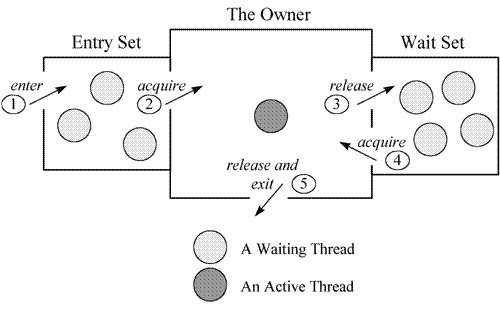

# synchronized

Java 中有两种加锁的方式：一种是用`synchronized`关键字，另一种是用`Lock`接口的实现类。

|          | synchronized  | ReentrantLock/ReentrantReadWriteLock |
|:---------|:--------------|:-------------------------------------|
| 作用域      | 方法和代码块        | 代码块                                  |
| 实现方式     | 偏向锁、轻量级锁、重量级锁 | AbstractQueuedSynchronizer           |
| 是否可重入    | 可重入           | 可重入                                  |
| 是否是公平锁   | 非公平锁          | 可通过构造方法指定公平或非公平                      |
| 是否可主动释放锁 | 不可主动释放        | 可主动释放，调用`unlock()`方法                 |

## 使用方式

锁对象

```java
public void lockObject() {
    synchronized (lock) {
        // ...
    }
}
```

锁方法，即锁该方法的对象

```java
public synchronized void lockMethod() {
    // ...
}
```

锁类

```java
public void lockClass() {
    synchronized (Lock.class) {
        // ...
    }
}
```

锁静态方法，即锁该静态方法的类

```java
public static synchronized void lockStaticMethod() {
    // ...
}
```

### 不同方式的区别

通过`javap -v`命令反编译示例代码：

```java
public class SynchronizedTest {
    private final Object lock = new Object();

    public void lockObject() {
        synchronized (lock) {
            System.out.println("lockObject");
        }
    }

    public synchronized void lockMethod() {
        System.out.println("lockMethod");
    }

    public void lockClass() {
        synchronized (SynchronizedTest.class) {
            System.out.println("lockClass");
        }
    }

    public static synchronized void lockStaticMethod() {
        System.out.println("lockStaticMethod");
    }
}
```

```java
public class io.leego.test.SynchronizedTest
  minor version: 0
  major version: 52
  flags: (0x0021) ACC_PUBLIC, ACC_SUPER
  this_class: #8                          // io/leego/test/SynchronizedTest
  super_class: #2                         // java/lang/Object
  interfaces: 0, fields: 1, methods: 5, attributes: 1
Constant pool:
   #1 = Methodref          #2.#3          // java/lang/Object."<init>":()V
   #2 = Class              #4             // java/lang/Object
   #3 = NameAndType        #5:#6          // "<init>":()V
   #4 = Utf8               java/lang/Object
   #5 = Utf8               <init>
   #6 = Utf8               ()V
   #7 = Fieldref           #8.#9          // io/leego/test/SynchronizedTest.lock:Ljava/lang/Object;
   #8 = Class              #10            // io/leego/test/SynchronizedTest
   #9 = NameAndType        #11:#12        // lock:Ljava/lang/Object;
  #10 = Utf8               io/leego/test/SynchronizedTest
  #11 = Utf8               lock
  #12 = Utf8               Ljava/lang/Object;
  #13 = Fieldref           #14.#15        // java/lang/System.out:Ljava/io/PrintStream;
  #14 = Class              #16            // java/lang/System
  #15 = NameAndType        #17:#18        // out:Ljava/io/PrintStream;
  #16 = Utf8               java/lang/System
  #17 = Utf8               out
  #18 = Utf8               Ljava/io/PrintStream;
  #19 = String             #20            // lockObject
  #20 = Utf8               lockObject
  #21 = Methodref          #22.#23        // java/io/PrintStream.println:(Ljava/lang/String;)V
  #22 = Class              #24            // java/io/PrintStream
  #23 = NameAndType        #25:#26        // println:(Ljava/lang/String;)V
  #24 = Utf8               java/io/PrintStream
  #25 = Utf8               println
  #26 = Utf8               (Ljava/lang/String;)V
  #27 = String             #28            // lockMethod
  #28 = Utf8               lockMethod
  #29 = String             #30            // lockClass
  #30 = Utf8               lockClass
  #31 = String             #32            // lockStaticMethod
  #32 = Utf8               lockStaticMethod
  #33 = Utf8               Code
  #34 = Utf8               LineNumberTable
  #35 = Utf8               LocalVariableTable
  #36 = Utf8               this
  #37 = Utf8               Lio/leego/test/SynchronizedTest;
  #38 = Utf8               StackMapTable
  #39 = Class              #40            // java/lang/Throwable
  #40 = Utf8               java/lang/Throwable
  #41 = Utf8               SourceFile
  #42 = Utf8               SynchronizedTest.java
{
  public io.leego.test.SynchronizedTest();
    descriptor: ()V
    flags: (0x0001) ACC_PUBLIC
    Code:
      stack=3, locals=1, args_size=1
         0: aload_0
         1: invokespecial #1                  // Method java/lang/Object."<init>":()V
         4: aload_0
         5: new           #2                  // class java/lang/Object
         8: dup
         9: invokespecial #1                  // Method java/lang/Object."<init>":()V
        12: putfield      #7                  // Field lock:Ljava/lang/Object;
        15: return
      LineNumberTable:
        line 6: 0
        line 7: 4
      LocalVariableTable:
        Start  Length  Slot  Name   Signature
            0      16     0  this   Lio/leego/test/SynchronizedTest;

  public void lockObject();
    descriptor: ()V
    flags: (0x0001) ACC_PUBLIC
    Code:
      stack=2, locals=3, args_size=1
         0: aload_0
         1: getfield      #7                  // Field lock:Ljava/lang/Object;
         4: dup
         5: astore_1
         6: monitorenter
         7: getstatic     #13                 // Field java/lang/System.out:Ljava/io/PrintStream;
        10: ldc           #19                 // String lockObject
        12: invokevirtual #21                 // Method java/io/PrintStream.println:(Ljava/lang/String;)V
        15: aload_1
        16: monitorexit
        17: goto          25
        20: astore_2
        21: aload_1
        22: monitorexit
        23: aload_2
        24: athrow
        25: return
      Exception table:
         from    to  target type
             7    17    20   any
            20    23    20   any
      LineNumberTable:
        line 10: 0
        line 11: 7
        line 12: 15
        line 13: 25
      LocalVariableTable:
        Start  Length  Slot  Name   Signature
            0      26     0  this   Lio/leego/test/SynchronizedTest;
      StackMapTable: number_of_entries = 2
        frame_type = 255 /* full_frame */
          offset_delta = 20
          locals = [ class io/leego/test/SynchronizedTest, class java/lang/Object ]
          stack = [ class java/lang/Throwable ]
        frame_type = 250 /* chop */
          offset_delta = 4

  public synchronized void lockMethod();
    descriptor: ()V
    flags: (0x0021) ACC_PUBLIC, ACC_SYNCHRONIZED
    Code:
      stack=2, locals=1, args_size=1
         0: getstatic     #13                 // Field java/lang/System.out:Ljava/io/PrintStream;
         3: ldc           #27                 // String lockMethod
         5: invokevirtual #21                 // Method java/io/PrintStream.println:(Ljava/lang/String;)V
         8: return
      LineNumberTable:
        line 16: 0
        line 17: 8
      LocalVariableTable:
        Start  Length  Slot  Name   Signature
            0       9     0  this   Lio/leego/test/SynchronizedTest;

  public void lockClass();
    descriptor: ()V
    flags: (0x0001) ACC_PUBLIC
    Code:
      stack=2, locals=3, args_size=1
         0: ldc           #8                  // class io/leego/test/SynchronizedTest
         2: dup
         3: astore_1
         4: monitorenter
         5: getstatic     #13                 // Field java/lang/System.out:Ljava/io/PrintStream;
         8: ldc           #29                 // String lockClass
        10: invokevirtual #21                 // Method java/io/PrintStream.println:(Ljava/lang/String;)V
        13: aload_1
        14: monitorexit
        15: goto          23
        18: astore_2
        19: aload_1
        20: monitorexit
        21: aload_2
        22: athrow
        23: return
      Exception table:
         from    to  target type
             5    15    18   any
            18    21    18   any
      LineNumberTable:
        line 20: 0
        line 21: 5
        line 22: 13
        line 23: 23
      LocalVariableTable:
        Start  Length  Slot  Name   Signature
            0      24     0  this   Lio/leego/test/SynchronizedTest;
      StackMapTable: number_of_entries = 2
        frame_type = 255 /* full_frame */
          offset_delta = 18
          locals = [ class io/leego/test/SynchronizedTest, class java/lang/Object ]
          stack = [ class java/lang/Throwable ]
        frame_type = 250 /* chop */
          offset_delta = 4

  public static synchronized void lockStaticMethod();
    descriptor: ()V
    flags: (0x0029) ACC_PUBLIC, ACC_STATIC, ACC_SYNCHRONIZED
    Code:
      stack=2, locals=0, args_size=0
         0: getstatic     #13                 // Field java/lang/System.out:Ljava/io/PrintStream;
         3: ldc           #31                 // String lockStaticMethod
         5: invokevirtual #21                 // Method java/io/PrintStream.println:(Ljava/lang/String;)V
         8: return
      LineNumberTable:
        line 26: 0
        line 27: 8
}
```

从反编译结果可以得：

- 同步代码块：编译`lockObject()`和`lockClass()`方法时，会生成`monitorenter`和`monitorexit`指令，分别对应进入同步代码块和退出同步代码块。
  存在两个`monitorexit`指令的原因是：对同步代码块隐式包装了`try-catch`，为了保证抛出异常的情况下也可以释放锁。
- 同步方法：编译`lockMethod()`和`lockStaticMethod()`方法时，会通过`ACC_SYNCHRONIZED`关键字修饰，JVM 执行到该方法时，会先尝试获取锁。

在 JVM 底层中，这几种`synchronized`方式的实现基本相同。

## 锁升级前置介绍

在 Java 6 版本之前，仅支持[重量级锁](#重量级锁-Heavyweight-Locking)，在 Java 6 版本中引入了[偏向锁](#偏向锁-Biased-Locking)和[轻量级锁](#轻量级锁-Lightweight-Locking)。

引入的目的是为了在无锁竞争或少竞争的情况下，避免使用重量级锁。因为重量级锁依赖于系统级别的同步函数，在 Linux 中使用`mutex`互斥锁，底层实现依赖于`futex`，这些同步函数都涉及到用户态和内核态的切换、进程的上下文切换，会带来一定的性能开销。

### Object Header

在 Java 中任意对象都可以当作锁，因此需要维护一个对象和锁状态的映射关系，比如，当前哪个线程持有锁，哪些线程在等待。
这个映射关系被存储在对象头中，该区域被称为 Mark Word。对象头中除了 Mark Word，还有 Klass Word，用于储存指向该对象所属类的指针。
如果对象是一个数组，那么对象头需要额外的空间来存储数组的长度，这个数据的长度也随着虚拟机架构的不同而调整。

32 位虚拟机中的对象头结构：

```
|----------------------------------------------------------------------------------------|--------------------|
|                                    Object Header (64 bits)                             |        State       |
|-------------------------------------------------------|--------------------------------|--------------------|
|                  Mark Word (32 bits)                  |      Klass Word (32 bits)      |                    |
|-------------------------------------------------------|--------------------------------|--------------------|
| identity_hashcode:25 | age:4 | biased_lock:1 | lock:2 |      OOP to metadata object    |       Normal       |
|-------------------------------------------------------|--------------------------------|--------------------|
|  thread:23 | epoch:2 | age:4 | biased_lock:1 | lock:2 |      OOP to metadata object    |       Biased       |
|-------------------------------------------------------|--------------------------------|--------------------|
|               ptr_to_lock_record:30          | lock:2 |      OOP to metadata object    | Lightweight Locked |
|-------------------------------------------------------|--------------------------------|--------------------|
|               ptr_to_heavyweight_monitor:30  | lock:2 |      OOP to metadata object    | Heavyweight Locked |
|-------------------------------------------------------|--------------------------------|--------------------|
|                                              | lock:2 |      OOP to metadata object    |    Marked for GC   |
|-------------------------------------------------------|--------------------------------|--------------------|
```

64 位虚拟机中的对象头结构：

```
|------------------------------------------------------------------------------------------------------------|--------------------|
|                                            Object Header (128 bits)                                        |        State       |
|------------------------------------------------------------------------------|-----------------------------|--------------------|
|                                  Mark Word (64 bits)                         |    Klass Word (64 bits)     |                    |
|------------------------------------------------------------------------------|-----------------------------|--------------------|
| unused:25 | identity_hashcode:31 | unused:1 | age:4 | biased_lock:1 | lock:2 |    OOP to metadata object   |       Normal       |
|------------------------------------------------------------------------------|-----------------------------|--------------------|
| thread:54 |       epoch:2        | unused:1 | age:4 | biased_lock:1 | lock:2 |    OOP to metadata object   |       Biased       |
|------------------------------------------------------------------------------|-----------------------------|--------------------|
|                        ptr_to_lock_record:62                        | lock:2 |    OOP to metadata object   | Lightweight Locked |
|------------------------------------------------------------------------------|-----------------------------|--------------------|
|                        ptr_to_heavyweight_monitor:62                | lock:2 |    OOP to metadata object   | Heavyweight Locked |
|------------------------------------------------------------------------------|-----------------------------|--------------------|
|                                                                     | lock:2 |    OOP to metadata object   |    Marked for GC   |
|------------------------------------------------------------------------------|-----------------------------|--------------------|
```

64 位虚拟机中启用指针压缩的对象头结构：

```
|--------------------------------------------------------------------------------------------------------------|--------------------|
|                                            Object Header (96 bits)                                           |        State       |
|--------------------------------------------------------------------------------|-----------------------------|--------------------|
|                                  Mark Word (64 bits)                           |    Klass Word (32 bits)     |                    |
|--------------------------------------------------------------------------------|-----------------------------|--------------------|
| unused:25 | identity_hashcode:31 | cms_free:1 | age:4 | biased_lock:1 | lock:2 |    OOP to metadata object   |       Normal       |
|--------------------------------------------------------------------------------|-----------------------------|--------------------|
| thread:54 |       epoch:2        | cms_free:1 | age:4 | biased_lock:1 | lock:2 |    OOP to metadata object   |       Biased       |
|--------------------------------------------------------------------------------|-----------------------------|--------------------|
|                         ptr_to_lock_record                            | lock:2 |    OOP to metadata object   | Lightweight Locked |
|--------------------------------------------------------------------------------|-----------------------------|--------------------|
|                     ptr_to_heavyweight_monitor                        | lock:2 |    OOP to metadata object   | Heavyweight Locked |
|--------------------------------------------------------------------------------|-----------------------------|--------------------|
|                                                                       | lock:2 |    OOP to metadata object   |    Marked for GC   |
|--------------------------------------------------------------------------------|-----------------------------|--------------------|
```

32 位虚拟机中的数组对象头结构：

```
|---------------------------------------------------------------------|
|                     Object Header (96 bits)                         |
|---------------------|----------------------|------------------------|
| Mark Word (32 bits) | Klass Word (32 bits) | Array Length (32 bits) |
|---------------------|----------------------|------------------------|
```

64 位虚拟机中的数组对象头结构：

```
|---------------------------------------------------------------------|
|                     Object Header (128 bits)                        |
|---------------------|----------------------|------------------------|
| Mark Word (64 bits) | Klass Word (32 bits) | Array Length (32 bits) |
|---------------------|----------------------|------------------------|
```

可以通过`-XX:+UseCompressedOops`参数启用压缩指针，从 OpenJDK 6u25 开始默认启用。
可以通过`-XX:+UseCompressedOops`参数禁用压缩指针。

### SafePoint

SafePoint 在 HotSpot 中是一个核心的技术点，所谓安全点指的是代码执行过程中被选择出来的一些位置，当需要执行一些要 STW（Stop The World） 的操作的时候，这些位置⽤于线程进⼊这些位置并等待系统执⾏完成 STW 操作。
所以，安全点不能太少也不能太多，安全点过少会导致那些需要执⾏ STW 操作的程序需要等待太久，安全点太多⼜会导致程序执⾏时需要频繁检查安全点，导致系统负载升⾼。

在 HotSpot 中，需要 STW 的操作典型的是 GC，GC 时需要所有线程同时进入安全点，并阻塞等待 GC 处理完，然后再让所有线程继续执行。

除了 GC 还有一些场景会让所有线程进入 SafePoint，即发生 STW：

1. 定时进入 SafePoint
2. 使用 jstack、jmap、jstat 等命令
3. 偏向锁撤销（不一定会引发整体的 STW）
4. Java Instrument 导致的 Agent 加载以及类的重定义
5. 当发生 JIT 编译优化或者去优化，需要 OSR 或者 Bailout 或者清理代码缓存的时候
6. 如果开启了 JFR 的 OldObject 采集，这个是定时采集一些存活时间比较久的对象

### Monitor

Monitor 是一个同步工具，它的特点是，同一个时刻只允许一个`进程/线程`进入 Monitor 中定义的临界区，这使得 Monitor 能够达到互斥的效果。
但仅仅有互斥的作用是不够的，无法进入临界区的`进程/线程`应该被阻塞，并且在必要的时候会被唤醒。
当然，Monitor 也提供这样的管理`进程/线程`状态的机制，它在内部实现这些机制，并且对外屏蔽掉这些机制，使得使用 Monitor 的人看到的是一个简洁易用的接口。
在编程中使用`semaphore`信号量和`mutex`互斥量容易出错，通常需要开发者自己操作变量以及对`进程/线程`进行阻塞和唤醒，所以 Monitor 被称为“更高级的原语”。

Monitor 是操作系统提出来的一种高级原语，但其具体的实现模式，不同的编程语言都有可能不一样。下文会介绍 Monitor 在 Java 中的实现方式。

_Monitor 不管是翻译为“管程”还是“监视器”，都是比较晦涩的，通过翻译后的中文，并无法对 Monitor 达到一个直观的描述。_

#### 临界区

在 Java 中，被`synchronized`关键字修饰的方法、代码块，就是临界区，如下所示：

```java
private final Object lock = new Object();

public void lockObject() {
    synchronized (lock) {
        // ...
    }
}

public synchronized void lockMethod() {
    // ...
}
```

#### Monitor Object

显然，使用`synchronized`关键字的时候，往往需要指定一个对象与之关联，这个对象就被称为 Monitor Object，在 Java 中任何一个 Java 对象都可以作为 Monitor Object。
因为`java.lang.Object`类定义了`wait()`，`notify()`，`notifyAll()`方法，
这些方法的具体实现，依赖于一个叫 ObjectMonitor 模式的实现，这是 JVM 内部基于 C++ 实现的一套机制，基本原理如下所示：



当一个线程需要获取锁时，会被放入 Entry Set 中进行等待，如果该线程获取到了锁，成为当前锁的 Owner。
如果根据程序逻辑，一个已经获得了锁的线程缺少某些外部条件，而无法继续进行下去，那么该线程可以通过调用`wait()`方法将锁释放，进入 WaitSet 中阻塞进行等待，
此时，其它线程就有机会获得锁，去完成其它的事情，从而使得之前不成立的外部条件成立，然后调用`notify()`或`notifyAll()`方法使被阻塞的线程可以重新进入 EntrySet 去竞争锁。
这个外部条件在 Monitor 机制中称为条件变量。

> Java 提供的 Monitor 机制，是`java.lang.Object`，`synchronized`关键字，条件变量等元素合作组成的。
> JVM 底层的 ObjectMonitor 是用来辅助实现 Monitor 机制的一种常用模式。所以，把 ObjectMonitor 直接当成了 Monitor 机制是一种错误的说法。

## 偏向锁 Biased Locking

偏向锁能够减少无竞争锁定时的开销，其目的是假定该锁一直由某个特定线程持有，直到另一个线程尝试获取它，这样就可以避免同一对象的后续同步操作执行 CAS 操作，减少了获取锁和释放锁的次数。

通常，在应用程序启动后，偏向锁默认不会立即生效，而是存在几秒延迟，可以通过命令`-XX:BiasedLockingStartupDelay=0`关闭延迟。

在 Java 15 之前，偏向锁始终处于启用状态且可用，可以通过`-XX:-UseBiasedLocking`禁用偏向锁。
在 Java 15 及之后，启动 HotSpot 时将不再启用偏向锁，除非在命令行中设置`-XX:+UseBiasedLocking`启用偏向锁。

Java 15 版本弃用了偏向锁：[JEP 374: Disable and Deprecate Biased Locking](https://openjdk.java.net/jeps/374)

> 从历史上看，偏向锁使得 JVM 的性能得到了显著改善。但是过去看到的性能提升在今天远不那么明显。  
> 许多受益于偏向锁的应用程序是使用早期 Java 集合 API 的旧的遗留应用程序，这些 API 在每次访问时都会同步（例如：Hashtable 和 Vector）。  
> 较新的应用程序通常使用 Java 1.2 中针对单线程场景引入的非同步集合（例如：HashMap 和 ArrayList），或者使用 Java 5 中针对多线程场景引入的性能更高的并发数据结构。  
> 这意味着如果更新代码以使用这些较新的类，由于不必要的同步而受益于偏向锁的应用程序可能会看到性能改进。此外，围绕线程池队列和工作线程构建的应用程序通常在禁用偏向锁的情况下性能更好。
>
> 偏向锁在同步子系统中引入了许多复杂的代码，并且还侵入了其他 HotSpot 组件。这种复杂性是理解代码各个部分的障碍，也是在同步子系统内进行重大设计更改的障碍。为此，我们希望禁用、弃用并最终移除对偏向锁的支持。

### 偏向锁流程简介

#### 匿名偏向

匿名偏向（anonymously biased）表示锁对象未偏向任何线程，也就是说该对象可以偏向任意一个线程，具体表现为 Mark Word 中 Thread ID 值为 0。
应用程序时，如果启用了偏向锁，并且某个 class 没有关闭偏向锁模式，那么该 class 实例化出来的对象则是匿名偏向状态。

#### 加锁流程

- 首次获取锁：处于匿名偏向状态的对象获取锁时，会通过 CAS 操作将 Mark Word 中的 Thread ID 修改为当前线程，偏向当前线程。如果修改成功，则表示成功获得了偏向锁。如果修改失败，则表示存在竞争，需要撤销偏向锁，然后升级偏向锁。
- 锁重入：偏向的线程就是当前线程时，在通过一些额外的检查后（后续会介绍），继续执行同步块代码。偏向锁重入只需要简单判断即可，同步性能开销基本可以忽略。
- 发生竞争：偏向的线程不是当前线程时，则进入到撤销偏向锁的逻辑。待所有线程达到 SafePoint 时，判断偏向的线程是否还存活，如果线程存活且还在同步代码块中，则升级为轻量级锁，原偏向的线程会继续拥有锁。
  如果偏向的线程已经死活或者不在同步代码块中，则将对象头的 Mark Word 改为无锁状态，之后再升级为轻量级锁。

> 为什么发生竞争时，将对象头的 Mark Word 改为无锁状态，之后再升级为轻量级锁，而不是再次获取偏向锁呢？
>
> 这种场景下，表示锁已经被多个线程使用，与偏向锁设计初衷不符，偏向锁适用场景为单线程，如果多线程场景下，频繁进行偏向锁撤销，那么偏向锁的性能优势就不存在了。
> 但是，在[批量重偏向](#批量重偏向与批量撤销)的情况下，是会出现偏向另一个线程的情况。

#### 解锁流程

偏向锁退出同步代码块时，找到线程的栈中的最近一个关联的 Lock Record，其 obj 字段就表示锁的对象，将其设置为 NULL 就完成了释放锁的操作。

#### 批量重偏向与批量撤销

从偏向锁的加锁解锁过程中可以看出，当只有一个线程反复进入同步块时，同步的性能开销基本可以忽略。
但是如果存在其他线程尝试获得锁时，就需要等待线程到达 SafePoint 时，才能将偏向锁撤销为无锁状态，然后升级为轻量级锁或重量级锁。
偏向锁撤销是有一定性能开销的，如果应用场景本身存在多线程竞争的，那么使用偏向锁不仅不能提高性能，而且会导致性能下降。
因此，HotSpot 中增加了批量重偏向与批量撤销机制，批量重偏向与批量撤销主要作用的目标是类及其对象。

- 批量重偏向（Bulk Rebias）
    - 适用场景：一个线程创建了大量对象，并且进行了初始同步操作，然后在另一个线程中将这些对象作为锁进行之后的操作
    - 解决方案：使这些对象偏向新的线程
- 批量撤销（Bulk Revoke）
    - 适用场景：存在明显多线程竞争的场景
    - 解决方案：关闭 class 的偏向锁，也就是关闭了该 class 对应的所有对象的偏向锁

每个 class 都维护一个偏向锁撤销计数器，每一次该 class 的对象偏向撤销时，该计数器就会加 1，当值达到重偏向阈值（默认20）时，就会进行批量重偏向。

每个 class 都维护一个 epoch 值，用于表示是第几代偏向锁。当该 class 的对象获取偏向锁时，会将该 epoch 值复制到锁对象的 Mark Word 中。
每次批量重偏向时，该 class 的 epoch 值加 1，表示偏向锁进入下一代，之前的锁对象的 epoch 则过期，新获取偏向锁的对象则会复制新的 epoch 值。
为了保证当前持有偏向锁的线程不会丢锁，还需要遍历所有线程的栈，找出该 class 已加锁的对象，将它们的 Mark Word 中的 epoch 值加 1（该操作需要所有线程处于安全点状态）。

如果锁对象的 epoch 已经过期，再次获取锁时，不会直接进行偏向锁撤销，而是先通过 CAS 操作将 Mark Word 的 Thread Id 修改为当前线程。如果修改成功，则表示偏向了新的线程；如果修改失败，则需要进行偏向锁撤销和锁升级。

当达到重偏向阈值（默认20）后，假设该 class 计数器继续增长，当其达到批量撤销阈值（默认40）时，就认为该 class 的使用场景存在多线程竞争，标记该 class 为不可偏向，此后，对于该 class 直接执行轻量级锁的逻辑。

### 源码分析

#### 获取偏向锁流程

Lock Record 的具体代码实现是由`BasicObjectLock`和`BasicLock`组成。

[/src/share/vm/runtime/basicLock.hpp#BasicObjectLock](https://github.com/openjdk/jdk8u/blob/2dadc2bf312d5f947e0735d5ec13c285824db31d/hotspot/src/share/vm/runtime/basicLock.hpp#L32)

```cpp
class BasicLock VALUE_OBJ_CLASS_SPEC {
 private:
  volatile markOop _displaced_header; // 即 Displaced Mark Word，轻量级锁加锁时备份 Mark Word，解锁时还原
};

class BasicObjectLock VALUE_OBJ_CLASS_SPEC {
 private:
  BasicLock _lock; // 锁对象 the lock, must be double word aligned 
  oop       _obj;  // 持有锁的对象 object holds the lock;
};
```

当字节码解释器执行`monitorenter`字节码锁住一个对象时，就会先在获取锁的线程的栈上显式或隐式分配一个 Lock Record，然后进入如下代码：

[/src/share/vm/interpreter/bytecodeInterpreter.cpp#CASE_monitorenter](https://github.com/openjdk/jdk8u/blob/2dadc2bf312d5f947e0735d5ec13c285824db31d/hotspot/src/share/vm/interpreter/bytecodeInterpreter.cpp#L1816)

```cpp
CASE(_monitorenter) : {
    // lockee 是锁对象
    oop lockee = STACK_OBJECT(-1);
    // derefing's lockee ought to provoke implicit null check
    CHECK_NULL(lockee);
    // find a free monitor or one already allocated for this object
    // if we find a matching object then we need a new monitor
    // since this is recursive enter
    // 找到一个空闲且最高的 Lock Record（最高指的是 Lock Record 的内存地址，目的是为了配合重入解锁和升级轻量级锁）
    BasicObjectLock *limit = istate->monitor_base();
    BasicObjectLock *most_recent = (BasicObjectLock *) istate->stack_base();
    BasicObjectLock *entry = NULL;
    // 从低往高遍历
    while (most_recent != limit) {
        // 如果 obj 为 NULL 说明该 Lock Record 是空闲的，需要找到空闲且最高的 Lock Record，所以这里不中断循环
        if (most_recent->obj() == NULL) entry = most_recent;
        // 如果 obj 为 lockee 说明之前获取过锁，且当前是锁重入，此时 entry 已经是空闲且最高的 Lock Record 了（或者没有空闲的），继续遍历已经没有意义了，直接中断循环
        else if (most_recent->obj() == lockee) break;
        // 为了找到内存地址最高的空闲 Lock Record，所以需要一直判断到最后
        most_recent++;
    }
    // 如果 entry 不为 NULL 说明该 Lock Record 可用（正常情况下都会有）
    if (entry != NULL) {
        // 将 Lock Record 的 obj 指针指向 lockee
        entry->set_obj(lockee);
        int success = false;
        uintptr_t epoch_mask_in_place = (uintptr_t) markOopDesc::epoch_mask_in_place;

        // mark 是对象头的 Mark Word
        markOop mark = lockee->mark();
        intptr_t hash = (intptr_t) markOopDesc::no_hash;
        // implies UseBiasedLocking
        // 判断是否为偏向模式，即 Mark Word 最后三位是否为 101
        if (mark->has_bias_pattern()) {
            uintptr_t thread_ident;
            uintptr_t anticipated_bias_locking_value;
            // 获取当前线程ID
            thread_ident = (uintptr_t) istate->thread();
            // 计算预期的偏向锁值
            // a. lockee->klass()->prototype_header() | thread_ident：表示 线程ID + epoch + 分代年龄 + 偏向锁标识 + 锁标识，可以理解为组装了一个预期的 Mark Word
            // b. ${a} ^ (uintptr_t) mark：将上面计算得到的结果与锁对象的 Mark Word 进行异或操作，相等的位全部被置为 0，只剩下不相等的位，不相等的位置代表不同的含义
            // c. ${b} & ~((uintptr_t) markOopDesc::age_mask_in_place)：作用为忽略分代年龄
            anticipated_bias_locking_value =
                    (((uintptr_t) lockee->klass()->prototype_header() | thread_ident) ^ (uintptr_t) mark) &
                    ~((uintptr_t) markOopDesc::age_mask_in_place);
            // 如果计算的结果为 0，表示偏向的线程是当前线程，且 class 的 epoch 等于 Mark Word 的 epoch，这种情况下无需处理，这是使用偏向锁期望的情况
            if (anticipated_bias_locking_value == 0) {
                // already biased towards this thread, nothing to do
                if (PrintBiasedLockingStatistics) {
                    (*BiasedLocking::biased_lock_entry_count_addr())++;
                }
                success = true;
            }
            // 如果 class 的 prototype_header 最后三位不为 101，说明 class 关闭了偏向模式，则尝试撤销偏向锁（批量撤销导致）
            else if ((anticipated_bias_locking_value & markOopDesc::biased_lock_mask_in_place) != 0) {
                // try revoke bias
                markOop header = lockee->klass()->prototype_header();
                if (hash != markOopDesc::no_hash) {
                    header = header->copy_set_hash(hash);
                }
                // 通过 CAS 操作将锁对象的 Mark Word 替换为 class 的 prototype_header，尝试撤销偏向锁
                // Atomic::cmpxchg_ptr 需要三个参数：
                // 1：新值，此处为 class 的 prototype_header，不指向任何线程
                // 2：需要修改的指针，此处为锁对象的 Mark Word 的指针
                // 3：预期原值，此处为锁对象的 Mark Word 的值
                // 返回等于 mark，则说明修改成功
                if (Atomic::cmpxchg_ptr(header, lockee->mark_addr(), mark) == mark) {
                    if (PrintBiasedLockingStatistics)
                        (*BiasedLocking::revoked_lock_entry_count_addr())++;
                }
                // 此时 success 为 false，后续会执行轻量级锁逻辑
            }
            // 如果 epoch 不相等，说明偏向锁已过期，则尝试重偏向（批量重偏向导致）
            else if ((anticipated_bias_locking_value & epoch_mask_in_place) != 0) {
                // try rebias
                // 构造一个偏向当前线程的 Mark Word
                markOop new_header = (markOop) ((intptr_t) lockee->klass()->prototype_header() | thread_ident);
                if (hash != markOopDesc::no_hash) {
                    new_header = new_header->copy_set_hash(hash);
                }
                // 通过 CAS 操作替换 Mark Word，尝试偏向当前线程
                if (Atomic::cmpxchg_ptr((void *) new_header, lockee->mark_addr(), mark) == mark) {
                    if (PrintBiasedLockingStatistics)
                        (*BiasedLocking::rebiased_lock_entry_count_addr())++;
                } else {
                    // 如果替换失败，说明存在多线程竞争，调用 InterpreterRuntime::monitorenter 进行偏向锁撤销和锁升级
                    CALL_VM(InterpreterRuntime::monitorenter(THREAD, entry), handle_exception);
                }
                success = true;
            } else {
                // try to bias towards thread in case object is anonymously biased
                // 进入该判断分支，则说明当前要么偏向别的线程，要么是匿名偏向

                // 如果当前是匿名偏向（没有偏向任何线程），则尝试偏向当前线程，否则进行锁升级
                // 构造一个匿名偏向的 Mark Word（从下面代码中可以知道，不包含线程ID）
                markOop header = (markOop) ((uintptr_t) mark & ((uintptr_t) markOopDesc::biased_lock_mask_in_place | (uintptr_t) markOopDesc::age_mask_in_place | epoch_mask_in_place));
                if (hash != markOopDesc::no_hash) {
                    header = header->copy_set_hash(hash);
                }
                // 构造一个偏向当前线程的 Mark Word
                markOop new_header = (markOop) ((uintptr_t) header | thread_ident);
                // debugging hint
                DEBUG_ONLY(entry->lock()->set_displaced_header((markOop) (uintptr_t) 0xdeaddead);)
                // 通过 CAS 操作替换 Mark Word，显然，如果当前锁不是匿名偏向，则替换操作一定会失败
                if (Atomic::cmpxchg_ptr((void *) new_header, lockee->mark_addr(), header) == header) {
                    if (PrintBiasedLockingStatistics)
                        (*BiasedLocking::anonymously_biased_lock_entry_count_addr())++;
                } else {
                    // 如果替换失败，说明存在多线程竞争，调用 InterpreterRuntime::monitorenter 进行偏向锁撤销和锁升级
                    CALL_VM(InterpreterRuntime::monitorenter(THREAD, entry), handle_exception);
                }
                success = true;
            }
        }
        
        // 如果偏向的线程不是当前线程，或关闭偏向模式等原因，都会进入轻量级锁的逻辑

        // traditional lightweight locking
        if (!success) {
            // 构造一个无锁状态的 Displaced Mark Word，并且使得 Lock Record 的 lock 指向它
            // 设置为无锁状态的原因是：轻量级锁解锁时，会通过 CAS 操作将 Displaced Mark Word 替换对象头的 Mark Word，所以替换后自然就是无锁状态
            markOop displaced = lockee->mark()->set_unlocked();
            entry->lock()->set_displaced_header(displaced);
            // 如果运行参数指定了 -XX:+UseHeavyMonitors 表示只使用重量级锁，禁用偏向锁和轻量级锁，此时 call_vm = true
            bool call_vm = UseHeavyMonitors;
            // 通过 CAS 操作将对象头的 Mark Word 替换为指向 Lock Record 的指针（注意这里是 != 判断，也就是替换失败才会进入下面的分支）
            if (call_vm || Atomic::cmpxchg_ptr(entry, lockee->mark_addr(), displaced) != displaced) {
                // Is it simple recursive case?
                // 如果替换失败，则继续判断是否为轻量级锁重入
                if (!call_vm && THREAD->is_lock_owned((address) displaced->clear_lock_bits())) {
                    // 如果是轻量级锁重入，则将 Displaced Mark Word 设置为 NULL，目的是为了标记这是一次重入，具体会在偏向锁流程中详细介绍
                    entry->lock()->set_displaced_header(NULL);
                } else {
                    CALL_VM(InterpreterRuntime::monitorenter(THREAD, entry), handle_exception);
                }
            }
        }
        UPDATE_PC_AND_TOS_AND_CONTINUE(1, -1);
    } else {
        // 如果找不到空闲的 Lock Record，则重新执行
        istate->set_msg(more_monitors);
        UPDATE_PC_AND_RETURN(0);// Re-execute
    }
}
```

#### 撤销偏向锁流程

在[获取偏向锁流程](#获取偏向锁流程)中多次提到获取偏向锁失败会进入到`InterpreterRuntime::monitorenter`方法进行偏向锁撤销和锁升级，偏向锁撤销是指在获取偏向锁的过程因为不满足条件导致要将锁对象改为非偏向锁状态。

[/src/share/vm/interpreter/interpreterRuntime.cpp#InterpreterRuntime::monitorenter](https://github.com/openjdk/jdk8u/blob/2dadc2bf312d5f947e0735d5ec13c285824db31d/hotspot/src/share/vm/interpreter/interpreterRuntime.cpp#L620)

```cpp
IRT_ENTRY_NO_ASYNC(void, InterpreterRuntime::monitorenter(JavaThread *thread, BasicObjectLock *elem))
#ifdef ASSERT
thread->last_frame().interpreter_frame_verify_monitor(elem);
#endif
if (PrintBiasedLockingStatistics) {
    Atomic::inc(BiasedLocking::slow_path_entry_count_addr());
}
Handle h_obj(thread, elem->obj());
assert(Universe::heap()->is_in_reserved_or_null(h_obj()), "must be NULL or an object");
// 如果启用了偏向锁，则进入 ObjectSynchronizer::fast_enter 方法
if (UseBiasedLocking) {
    // Retry fast entry if bias is revoked to avoid unnecessary inflation
    ObjectSynchronizer::fast_enter(h_obj, elem->lock(), true, CHECK);
} else {
    ObjectSynchronizer::slow_enter(h_obj, elem->lock(), CHECK);
}
assert(Universe::heap()->is_in_reserved_or_null(elem->obj()), "must be NULL or an object");
#ifdef ASSERT
thread->last_frame().interpreter_frame_verify_monitor(elem);
#endif
IRT_END
```

[/src/share/vm/runtime/synchronizer.cpp#ObjectSynchronizer::fast_enter](https://github.com/openjdk/jdk8u/blob/2dadc2bf312d5f947e0735d5ec13c285824db31d/hotspot/src/share/vm/runtime/synchronizer.cpp#L169)

```cpp
void ObjectSynchronizer::fast_enter(Handle obj, BasicLock *lock, bool attempt_rebias, TRAPS) {
    if (UseBiasedLocking) {
        if (!SafepointSynchronize::is_at_safepoint()) {
            // Java 线程会进入这个分支，调用 BiasedLocking::revoke_and_rebias 方法撤销和重偏向，是需要关注的关键方法
            // 第 1 个参数：Handle 包含了当前线程和锁对象
            // 第 2 个参数：attempt_rebias 代表是否允许重偏向，这里固定为 true
            BiasedLocking::Condition cond = BiasedLocking::revoke_and_rebias(obj, attempt_rebias, THREAD);
            // 如果返回结果不是 BIAS_REVOKED_AND_REBIASED，需要继续执行 slow_enter 方法
            if (cond == BiasedLocking::BIAS_REVOKED_AND_REBIASED) {
                return;
            }
        } else {
            // VM 线程会进入这个分支，调用 BiasedLocking::revoke_at_safepoint 方法
            assert(!attempt_rebias, "can not rebias toward VM thread");
            BiasedLocking::revoke_at_safepoint(obj);
        }
        assert(!obj->mark()->has_bias_pattern(), "biases should be revoked by now");
    }
    // 如果没有启用偏向锁，或偏向锁没被重偏向，或当前不是偏向锁，都会调用 slow_enter 方法，进入轻量级锁流程
    slow_enter(obj, lock, THREAD);
}
```

[/src/share/vm/runtime/synchronizer.cpp#BiasedLocking::revoke_and_rebias](https://github.com/openjdk/jdk8u/blob/2dadc2bf312d5f947e0735d5ec13c285824db31d/hotspot/src/share/vm/runtime/biasedLocking.cpp#L554)

```cpp
BiasedLocking::Condition BiasedLocking::revoke_and_rebias(Handle obj, bool attempt_rebias, TRAPS) {
    assert(!SafepointSynchronize::is_at_safepoint(), "must not be called while at safepoint");

    // We can revoke the biases of anonymously-biased objects
    // efficiently enough that we should not cause these revocations to
    // update the heuristics because doing so may cause unwanted bulk
    // revocations (which are expensive) to occur.
    markOop mark = obj->mark();
    // 如果是匿名偏向，而且 attempt_rebias 为 false 才会进入这个分支
    // 例如，调用对象的 hashCode() 方法会出现这种情况，需要撤销偏向锁
    if (mark->is_biased_anonymously() && !attempt_rebias) {
        // We are probably trying to revoke the bias of this object due to
        // an identity hash code computation. Try to revoke the bias
        // without a safepoint. This is possible if we can successfully
        // compare-and-exchange an unbiased header into the mark word of
        // the object, meaning that no other thread has raced to acquire
        // the bias of the object.
        markOop biased_value = mark;
        // 构造一个无锁的 Mark Word（001），表示之后只能需要升级轻量级锁
        markOop unbiased_prototype = markOopDesc::prototype()->set_age(mark->age());
        markOop res_mark = (markOop) Atomic::cmpxchg_ptr(unbiased_prototype, obj->mark_addr(), mark);
        if (res_mark == biased_value) {
            return BIAS_REVOKED;
        }
    // 如果开启了偏向模式会进入这个分支
    } else if (mark->has_bias_pattern()) {
        Klass *k = obj->klass();
        markOop prototype_header = k->prototype_header();
        // 如果对应 class 关闭了偏向模式会进入这个分支（当前流程不会进入这个分支）
        if (!prototype_header->has_bias_pattern()) {
            // This object has a stale bias from before the bulk revocation
            // for this data type occurred. It's pointless to update the
            // heuristics at this point so simply update the header with a
            // CAS. If we fail this race, the object's bias has been revoked
            // by another thread so we simply return and let the caller deal
            // with it.
            markOop biased_value = mark;
            // 撤销偏向锁操作，通过 class 的 prototype_header 替换锁对象的 Mark Word，之后升级轻量级锁
            markOop res_mark = (markOop) Atomic::cmpxchg_ptr(prototype_header, obj->mark_addr(), mark);
            assert(!(*(obj->mark_addr()))->has_bias_pattern(), "even if we raced, should still be revoked");
            return BIAS_REVOKED;
        // 如果 epoch 已过期会进入这个分支（当前流程不会进入这个分支）
        } else if (prototype_header->bias_epoch() != mark->bias_epoch()) {
            // The epoch of this biasing has expired indicating that the
            // object is effectively unbiased. Depending on whether we need
            // to rebias or revoke the bias of this object we can do it
            // efficiently enough with a CAS that we shouldn't update the
            // heuristics. This is normally done in the assembly code but we
            // can reach this point due to various points in the runtime
            // needing to revoke biases.
            if (attempt_rebias) {
                // 如果允许重偏向，会进入这个分支
                assert(THREAD->is_Java_thread(), "");
                markOop biased_value = mark;
                // 重偏向操作，构造一个偏向当前线程的 Mark Word
                markOop rebiased_prototype = markOopDesc::encode((JavaThread *) THREAD, mark->age(), prototype_header->bias_epoch());
                markOop res_mark = (markOop) Atomic::cmpxchg_ptr(rebiased_prototype, obj->mark_addr(), mark);
                if (res_mark == biased_value) {
                    return BIAS_REVOKED_AND_REBIASED;
                }
            } else {
                // 如果不允许重偏向，会进入这个分支
                markOop biased_value = mark;
                // 撤销偏向锁操作，构造一个无锁的 Mark Word（001），之后升级轻量级锁
                markOop unbiased_prototype = markOopDesc::prototype()->set_age(mark->age());
                markOop res_mark = (markOop) Atomic::cmpxchg_ptr(unbiased_prototype, obj->mark_addr(), mark);
                if (res_mark == biased_value) {
                    return BIAS_REVOKED;
                }
            }
        }
    }
    
    // 更新 class 中的撤销计数器，判断是否需要批量重偏向或批量撤销
    HeuristicsResult heuristics = update_heuristics(obj(), attempt_rebias);
    if (heuristics == HR_NOT_BIASED) {
        return NOT_BIASED;
    } else if (heuristics == HR_SINGLE_REVOKE) {
        // 正常情况会进入这个分支，撤销单个偏向锁
        Klass *k = obj->klass();
        markOop prototype_header = k->prototype_header();
        // 判断要撤销的偏向锁是否等于当前线程
        if (mark->biased_locker() == THREAD &&
            prototype_header->bias_epoch() == mark->bias_epoch()) {
            // A thread is trying to revoke the bias of an object biased
            // toward it, again likely due to an identity hash code
            // computation. We can again avoid a safepoint in this case
            // since we are only going to walk our own stack. There are no
            // races with revocations occurring in other threads because we
            // reach no safepoints in the revocation path.
            // Also check the epoch because even if threads match, another thread
            // can come in with a CAS to steal the bias of an object that has a
            // stale epoch.
            ResourceMark rm;
            if (TraceBiasedLocking) {
                tty->print_cr("Revoking bias by walking my own stack:");
            }
            // 进入这个分支，说明需要撤销的是偏向当前线程的锁，直接调用 revoke_bias 方法撤销偏向锁，不需要等到 SafePoint
            EventBiasedLockSelfRevocation event;
            BiasedLocking::Condition cond = revoke_bias(obj(), false, false, (JavaThread *) THREAD, NULL);
            ((JavaThread *) THREAD)->set_cached_monitor_info(NULL);
            assert(cond == BIAS_REVOKED, "why not?");
            if (event.should_commit()) {
                event.set_lockClass(k);
                event.commit();
            }
            return cond;
        } else {
            // 将撤销封装为任务，提交给 VM 线程执行，VM 线程达到 SafePoint 后会调用 revoke_bias 方法
            EventBiasedLockRevocation event;
            VM_RevokeBias revoke(&obj, (JavaThread *) THREAD);
            VMThread::execute(&revoke);
            if (event.should_commit() && (revoke.status_code() != NOT_BIASED)) {
                event.set_lockClass(k);
                // Subtract 1 to match the id of events committed inside the safepoint
                event.set_safepointId(SafepointSynchronize::safepoint_counter() - 1);
                event.set_previousOwner(revoke.biased_locker());
                event.commit();
            }
            return revoke.status_code();
        }
    }

    assert((heuristics == HR_BULK_REVOKE) || (heuristics == HR_BULK_REBIAS), "?");
    // 批量重偏向与批量撤销的逻辑
    EventBiasedLockClassRevocation event;
    VM_BulkRevokeBias bulk_revoke(&obj, (JavaThread *) THREAD,
                                  (heuristics == HR_BULK_REBIAS),
                                  attempt_rebias);
    VMThread::execute(&bulk_revoke);
    if (event.should_commit()) {
        event.set_revokedClass(obj->klass());
        event.set_disableBiasing((heuristics != HR_BULK_REBIAS));
        // Subtract 1 to match the id of events committed inside the safepoint
        event.set_safepointId(SafepointSynchronize::safepoint_counter() - 1);
        event.commit();
    }
    return bulk_revoke.status_code();
}
```

[/src/share/vm/runtime/synchronizer.cpp#revoke_bias](https://github.com/openjdk/jdk8u/blob/2dadc2bf312d5f947e0735d5ec13c285824db31d/hotspot/src/share/vm/runtime/biasedLocking.cpp#L147)

`revoke_bias`方法参数：

- `obj`：锁对象
- `allow_rebias`：表示是否允许重偏向，只有执行批量重偏向时，才会传`true`
- `is_bulk`：表示是否为批量模式，只有执行批量重偏向或执行批量撤销时，才会传`true`，不影响流程，可以忽略
- `*requesting_thread`：当前线程指针
- `**biased_locker`：忽略

```cpp
// After the call, *biased_locker will be set to obj->mark()->biased_locker() if biased_locker != NULL,
// AND it is a living thread. Otherwise it will not be updated, (i.e. the caller is responsible for initialization).
static BiasedLocking::Condition revoke_bias(oop obj, bool allow_rebias, bool is_bulk, JavaThread *requesting_thread, JavaThread **biased_locker) {
    markOop mark = obj->mark();
    if (!mark->has_bias_pattern()) {
        if (TraceBiasedLocking) {
            ResourceMark rm;
            tty->print_cr("  (Skipping revocation of object of type %s because it's no longer biased)",
                          obj->klass()->external_name());
        }
        return BiasedLocking::NOT_BIASED;
    }

    uint age = mark->age();
    // 构造一个匿名偏向的 Mark Word（101），表示可以重偏向一个新的线程
    markOop biased_prototype = markOopDesc::biased_locking_prototype()->set_age(age);
    // 构造一个无锁的 Mark Word（001），表示之后只能升级轻量级锁
    markOop unbiased_prototype = markOopDesc::prototype()->set_age(age);

    if (TraceBiasedLocking && (Verbose || !is_bulk)) {
        ResourceMark rm;
        tty->print_cr("Revoking bias of object " INTPTR_FORMAT " , mark " INTPTR_FORMAT " , type %s , prototype header " INTPTR_FORMAT " , allow rebias %d , requesting thread " INTPTR_FORMAT,
                      p2i((void *) obj), (intptr_t) mark, obj->klass()->external_name(), (intptr_t) obj->klass()->prototype_header(), (allow_rebias ? 1 : 0), (intptr_t) requesting_thread);
    }

    JavaThread *biased_thread = mark->biased_locker();
    // 如果是匿名偏向，会进入这个分支，例如，调用对象的 hashCode() 方法
    if (biased_thread == NULL) {
        // Object is anonymously biased. We can get here if, for
        // example, we revoke the bias due to an identity hash code
        // being computed for an object.
        // 如果不允许重偏向，则将 Mark Word 设置为无锁模式
        if (!allow_rebias) {
            obj->set_mark(unbiased_prototype);
        }
        if (TraceBiasedLocking && (Verbose || !is_bulk)) {
            tty->print_cr("  Revoked bias of anonymously-biased object");
        }
        return BiasedLocking::BIAS_REVOKED;
    }

    // Handle case where the thread toward which the object was biased has exited
    // 判断偏向的线程是否存活
    bool thread_is_alive = false;
    if (requesting_thread == biased_thread) {
        // 如果是当前线程，则说一定是存活的
        thread_is_alive = true;
    } else {
        // 遍历所有 Java 线程
        for (JavaThread *cur_thread = Threads::first(); cur_thread != NULL; cur_thread = cur_thread->next()) {
            // 如果找到了，则说明偏向的线程还存活
            if (cur_thread == biased_thread) {
                thread_is_alive = true;
                break;
            }
        }
    }
    // 如果偏向的线程已经死亡，则进入这个分支，直接撤销偏向锁
    if (!thread_is_alive) {
        if (allow_rebias) {
            // 允许重偏向，则设置 Mark Word 为匿名偏向
            obj->set_mark(biased_prototype);
        } else {
            // 不允许重偏向，则设置 Mark Word 为无锁状态
            obj->set_mark(unbiased_prototype);
        }
        if (TraceBiasedLocking && (Verbose || !is_bulk)) {
            tty->print_cr("  Revoked bias of object biased toward dead thread");
        }
        return BiasedLocking::BIAS_REVOKED;
    }

    // Thread owning bias is alive.
    // Check to see whether it currently owns the lock and, if so,
    // write down the needed displaced headers to the thread's stack.
    // Otherwise, restore the object's header either to the unlocked
    // or unbiased state.
    // 如果代码执行到这里，则说明偏向的线程还存活，遍历线程栈中所有的 Lock Record，根据情况进行重偏向或升级为轻量级锁
    GrowableArray<MonitorInfo *> *cached_monitor_info = get_or_compute_monitor_info(biased_thread);
    BasicLock *highest_lock = NULL;
    for (int i = 0; i < cached_monitor_info->length(); i++) {
        MonitorInfo *mon_info = cached_monitor_info->at(i);
        // 判断是否存在 Lock Record 关联锁对象，回顾偏向锁的加锁解锁流程：
        // - 进入同步代码块时（monitorenter），会在栈中按从高往低的顺序，找到第一个空闲的 Lock Record，将其 obj 字段指向锁对象
        // - 离开同步代码块时（monitorexit），会按从低往高的顺序，找到第一个关联的 Lock Record，将其 obj 字段置空
        // 所以可以通过遍历线程栈中的 Lock Record 判断偏向锁的线程是否还在执行同步代码块中的代码
        if (mon_info->owner() == obj) {
            if (TraceBiasedLocking && Verbose) {
                tty->print_cr("   mon_info->owner (" PTR_FORMAT ") == obj (" PTR_FORMAT ")",
                              p2i((void *) mon_info->owner()),
                              p2i((void *) obj));
            }
            // Assume recursive case and fix up highest lock later
            // 进入这个分支，说明需要升级为轻量级锁，为了处理锁重入的场景，将 Lock Record 的 Displaced Mark Word 先置为 NULL
            // 遍历结束后，highest_lock 就是最高位的 Lock Record，换句话说就是第一次获取锁时关联的那个 Lock Record，升级轻量级锁会下面的代码中进行
            markOop mark = markOopDesc::encode((BasicLock *) NULL);
            highest_lock = mon_info->lock();
            highest_lock->set_displaced_header(mark);
        } else {
            if (TraceBiasedLocking && Verbose) {
                tty->print_cr("   mon_info->owner (" PTR_FORMAT ") != obj (" PTR_FORMAT ")",
                              p2i((void *) mon_info->owner()),
                              p2i((void *) obj));
            }
        }
    }
    // 如果 highest_lock 不为空，直接升级为轻量级锁
    if (highest_lock != NULL) {
        // Fix up highest lock to contain displaced header and point
        // object at it
        // 设置最高位的 Lock Record 的 Displaced Mark Word 为无锁状态
        highest_lock->set_displaced_header(unbiased_prototype);
        // Reset object header to point to displaced mark.
        // Must release storing the lock address for platforms without TSO
        // ordering (e.g. ppc).
        // 设置 obj 的 Mark Word 为指向该 Lock Record 的指针
        obj->release_set_mark(markOopDesc::encode(highest_lock));
        assert(!obj->mark()->has_bias_pattern(), "illegal mark state: stack lock used bias bit");
        if (TraceBiasedLocking && (Verbose || !is_bulk)) {
            tty->print_cr("  Revoked bias of currently-locked object");
        }
        // 升级轻量级锁总结：
        // 1. 将偏向线程所有相关 Lock Record 的 Displaced Mark Word 置为 NULL，表示把原偏向线程的所有 Lock Record 都已经变成轻量级锁的状态
        // 2. 将最高位的 Lock Record 的 Displaced Mark Word 设置为无锁状态，上述代码中 highest_lock 就是最高位的 Lock Record，最高位即是第一次获得锁时的 Lock Record，因为偏向锁可以重入
        // 3. 在对象头的 Mark Word 中储存最高位的 Lock Record 的指针，由于此处在 SafePoint（STW），所以不需要用 CAS 操作
        // 4. 至此，升级轻量级锁完成
    } else {
        // 进入这个分支，说明偏向的线程已经不在同步块中了
        if (TraceBiasedLocking && (Verbose || !is_bulk)) {
            tty->print_cr("  Revoked bias of currently-unlocked object");
        }
        if (allow_rebias) {
            // 允许重偏向，则设置 Mark Word 为匿名偏向
            obj->set_mark(biased_prototype);
        } else {
            // Store the unlocked value into the object's header.
            // 不允许重偏向，则设置 Mark Word 为无锁状态
            obj->set_mark(unbiased_prototype);
        }
    }

#if INCLUDE_JFR
    // If requested, return information on which thread held the bias
    if (biased_locker != NULL) {
        *biased_locker = biased_thread;
    }
#endif// INCLUDE_JFR

    return BiasedLocking::BIAS_REVOKED;
}
```

#### 释放偏向锁流程

[/src/share/vm/interpreter/bytecodeInterpreter.cpp#CASE_monitorexit](https://github.com/openjdk/jdk8u/blob/2dadc2bf312d5f947e0735d5ec13c285824db31d/hotspot/src/share/vm/interpreter/bytecodeInterpreter.cpp#L1923)

```cpp
CASE(_monitorexit) : {
    // lockee 是锁对象
    oop lockee = STACK_OBJECT(-1);
    CHECK_NULL(lockee);
    // derefing's lockee ought to provoke implicit null check
    // find our monitor slot
    BasicObjectLock *limit = istate->monitor_base();
    BasicObjectLock *most_recent = (BasicObjectLock *) istate->stack_base();
    // 遍历栈的 Lock Record
    while (most_recent != limit) {
        // 判断 Lock Record 关联的 obj 是否为 lockee
        if ((most_recent)->obj() == lockee) {
            BasicLock *lock = most_recent->lock();
            markOop header = lock->displaced_header();
            // 将 Lock Record 的 obj 设置为 NULL，表示释放锁
            most_recent->set_obj(NULL);
            // 如果不是偏向模式，则需要继续轻量级锁或重量级锁的释放流程
            if (!lockee->mark()->has_bias_pattern()) {
                bool call_vm = UseHeavyMonitors;
                // If it isn't recursive we either must swap old header or call the runtime
                // 如果 header != NULL 说明不是锁重入，需要进行解锁
                if (header != NULL || call_vm) {
                    // 通过 CAS 操作将 Displaced Mark Word 替换对象头的 Mark Word（轻量级锁）
                    if (call_vm || Atomic::cmpxchg_ptr(header, lockee->mark_addr(), lock) != lock) {
                        // 如果替换失败或者是重量级锁，则会进入这个分支

                        // restore object for the slow case
                        // 将 obj 还原，然后调用 monitorexit 方法，详情请见轻量级锁与重量级锁的说明
                        most_recent->set_obj(lockee);
                        CALL_VM(InterpreterRuntime::monitorexit(THREAD, most_recent), handle_exception);
                    }
                }
            }
            // 处理完毕
            UPDATE_PC_AND_TOS_AND_CONTINUE(1, -1);
        }
        // 如果不是关联的 obj，继续判断下一个 Lock Record
        most_recent++;
    }
    // Need to throw illegal monitor state exception
    CALL_VM(InterpreterRuntime::throw_illegal_monitor_state_exception(THREAD), handle_exception);
    ShouldNotReachHere();
}
```

#### 批量重偏向与批量撤销流程

在[撤销偏向锁流程](#撤销偏向锁流程)中介绍了撤销单个偏向锁的流程，这里介绍批量重偏向与批量撤销的流程。

[/src/share/vm/runtime/synchronizer.cpp#BiasedLocking::revoke_and_rebias](https://github.com/openjdk/jdk8u/blob/2dadc2bf312d5f947e0735d5ec13c285824db31d/hotspot/src/share/vm/runtime/biasedLocking.cpp#L554)

```cpp
BiasedLocking::Condition BiasedLocking::revoke_and_rebias(Handle obj, bool attempt_rebias, TRAPS) {
    // 忽略无关代码
    
    // 本流程中，该方法会返回 HR_BULK_REVOKE 或 HR_BULK_REBIAS，即进入批量重偏向与批量撤销的流程
    HeuristicsResult heuristics = update_heuristics(obj(), attempt_rebias);
    if (heuristics == HR_NOT_BIASED) {
        return NOT_BIASED;
    } else if (heuristics == HR_SINGLE_REVOKE) {
        // 撤销单个偏向锁，忽略
    }

    // 处理批量重偏向与批量撤销的逻辑
    assert((heuristics == HR_BULK_REVOKE) || (heuristics == HR_BULK_REBIAS), "?");
    EventBiasedLockClassRevocation event;
    // 包装成 VM_BulkRevokeBias 任务，等待线程达到 SafePoint 后执行任务
    VM_BulkRevokeBias bulk_revoke(&obj, (JavaThread *) THREAD,
                                  (heuristics == HR_BULK_REBIAS),
                                  attempt_rebias);
    VMThread::execute(&bulk_revoke);
    if (event.should_commit()) {
        event.set_revokedClass(obj->klass());
        event.set_disableBiasing((heuristics != HR_BULK_REBIAS));
        // Subtract 1 to match the id of events committed inside the safepoint
        event.set_safepointId(SafepointSynchronize::safepoint_counter() - 1);
        event.commit();
    }
    return bulk_revoke.status_code();
}
```

```cpp
static HeuristicsResult update_heuristics(oop o, bool allow_rebias) {
    markOop mark = o->mark();
    if (!mark->has_bias_pattern()) {
        return HR_NOT_BIASED;
    }

    // Heuristics to attempt to throttle the number of revocations.
    // Stages:
    // 1. Revoke the biases of all objects in the heap of this type,
    //    but allow rebiasing of those objects if unlocked.
    // 2. Revoke the biases of all objects in the heap of this type
    //    and don't allow rebiasing of these objects. Disable
    //    allocation of objects of that type with the bias bit set.
    // 对象的类
    Klass *k = o->klass();
    // 当前系统时间
    jlong cur_time = os::javaTimeMillis();
    // 当前 class 的上一次批量撤销时间
    jlong last_bulk_revocation_time = k->last_biased_lock_bulk_revocation_time();
    // 当前 class 的撤销次数
    int revocation_count = k->biased_lock_revocation_count();
    // BiasedLockingBulkRebiasThreshold 重偏向阈值，默认值 20
    // BiasedLockingBulkRevokeThreshold 撤销阈值，默认值 40
    // BiasedLockingDecayTime 衰减时间，如果距离上一次批量撤销时间大于该值，则重置撤销次数，默认值 25000 毫秒
    if ((revocation_count >= BiasedLockingBulkRebiasThreshold) &&
        (revocation_count < BiasedLockingBulkRevokeThreshold) &&
        (last_bulk_revocation_time != 0) &&
        (cur_time - last_bulk_revocation_time >= BiasedLockingDecayTime)) {
        // This is the first revocation we've seen in a while of an
        // object of this type since the last time we performed a bulk
        // rebiasing operation. The application is allocating objects in
        // bulk which are biased toward a thread and then handing them
        // off to another thread. We can cope with this allocation
        // pattern via the bulk rebiasing mechanism so we reset the
        // klass's revocation count rather than allow it to increase
        // monotonically. If we see the need to perform another bulk
        // rebias operation later, we will, and if subsequently we see
        // many more revocation operations in a short period of time we
        // will completely disable biasing for this type.
        // 距离上一次批量撤销操作超过一定的时间后，重置当前 class 的撤销计数，而不是让其单调增加
        k->set_biased_lock_revocation_count(0);
        revocation_count = 0;
    }

    // Make revocation count saturate just beyond BiasedLockingBulkRevokeThreshold
    // 如果撤销次数没有超过撤销阈值（40），则继续增加撤销次数
    if (revocation_count <= BiasedLockingBulkRevokeThreshold) {
        revocation_count = k->atomic_incr_biased_lock_revocation_count();
    }
    // 如果撤销次数达到撤销阈值（40），执行批量撤销
    if (revocation_count == BiasedLockingBulkRevokeThreshold) {
        return HR_BULK_REVOKE;
    }
    // 如果撤销次数达到重偏向阈值（20），执行批量重偏向
    if (revocation_count == BiasedLockingBulkRebiasThreshold) {
        return HR_BULK_REBIAS;
    }
    // 执行单个撤销
    return HR_SINGLE_REVOKE;
}
```

```cpp
class VM_BulkRevokeBias : public VM_RevokeBias {
private:
    bool _bulk_rebias;
    bool _attempt_rebias_of_object;

public:
    VM_BulkRevokeBias(Handle *obj, JavaThread *requesting_thread, bool bulk_rebias, bool attempt_rebias_of_object)
        : VM_RevokeBias(obj, requesting_thread), _bulk_rebias(bulk_rebias), _attempt_rebias_of_object(attempt_rebias_of_object) {}

    virtual VMOp_Type type() const { return VMOp_BulkRevokeBias; }
    virtual bool doit_prologue() { return true; }

    virtual void doit() {
        // 等待线程达到 SafePoint 后会调用 bulk_revoke_or_rebias_at_safepoint 方法
        // bulk_rebias 为 true 代表执行批量重偏向逻辑，为 false 表示执行批量撤销逻辑
        // attempt_rebias_of_object 代表是否允许重偏向，这里固定为 true
        _status_code = bulk_revoke_or_rebias_at_safepoint((*_obj)(), _bulk_rebias, _attempt_rebias_of_object, _requesting_thread);
        clean_up_cached_monitor_info();
    }
};
```

```cpp
static BiasedLocking::Condition bulk_revoke_or_rebias_at_safepoint(oop o, bool bulk_rebias, bool attempt_rebias_of_object, JavaThread *requesting_thread) {
    assert(SafepointSynchronize::is_at_safepoint(), "must be done at safepoint");

    if (TraceBiasedLocking) {
        tty->print_cr("* Beginning bulk revocation (kind == %s) because of object " INTPTR_FORMAT " , mark " INTPTR_FORMAT " , type %s",
                      (bulk_rebias ? "rebias" : "revoke"),
                      p2i((void *) o), (intptr_t) o->mark(), o->klass()->external_name());
    }
    // 记录本次批量撤销时间
    jlong cur_time = os::javaTimeMillis();
    o->klass()->set_last_biased_lock_bulk_revocation_time(cur_time);


    Klass *k_o = o->klass();
    Klass *klass = k_o;

    if (bulk_rebias) {
        // 执行批量重偏向逻辑

        // Use the epoch in the klass of the object to implicitly revoke
        // all biases of objects of this data type and force them to be
        // reacquired. However, we also need to walk the stacks of all
        // threads and update the headers of lightweight locked objects
        // with biases to have the current epoch.

        // If the prototype header doesn't have the bias pattern, don't
        // try to update the epoch -- assume another VM operation came in
        // and reset the header to the unbiased state, which will
        // implicitly cause all existing biases to be revoked
        if (klass->prototype_header()->has_bias_pattern()) {
            int prev_epoch = klass->prototype_header()->bias_epoch();
            // 更新当前 class 的 epoch
            klass->set_prototype_header(klass->prototype_header()->incr_bias_epoch());
            int cur_epoch = klass->prototype_header()->bias_epoch();

            // Now walk all threads' stacks and adjust epochs of any biased
            // and locked objects of this data type we encounter
            // 遍历所有线程的栈，找出当前 class 对应的正处于锁定状态的对象，更新 epoch 值
            for (JavaThread *thr = Threads::first(); thr != NULL; thr = thr->next()) {
                GrowableArray<MonitorInfo *> *cached_monitor_info = get_or_compute_monitor_info(thr);
                for (int i = 0; i < cached_monitor_info->length(); i++) {
                    MonitorInfo *mon_info = cached_monitor_info->at(i);
                    oop owner = mon_info->owner();
                    markOop mark = owner->mark();
                    if ((owner->klass() == k_o) && mark->has_bias_pattern()) {
                        // We might have encountered this object already in the case of recursive locking
                        assert(mark->bias_epoch() == prev_epoch || mark->bias_epoch() == cur_epoch, "error in bias epoch adjustment");
                        owner->set_mark(mark->set_bias_epoch(cur_epoch));
                    }
                }
            }
        }

        // At this point we're done. All we have to do is potentially
        // adjust the header of the given object to revoke its bias.
        // 对当前锁对象进行重偏向，第二个参数为 allow_rebias，表示是否允许重偏向，此时值应该是 true
        revoke_bias(o, attempt_rebias_of_object && klass->prototype_header()->has_bias_pattern(), true, requesting_thread, NULL);
    } else {
        // 执行批量撤销逻辑

        if (TraceBiasedLocking) {
            ResourceMark rm;
            tty->print_cr("* Disabling biased locking for type %s", klass->external_name());
        }

        // Disable biased locking for this data type. Not only will this
        // cause future instances to not be biased, but existing biased
        // instances will notice that this implicitly caused their biases
        // to be revoked.
        // 关闭当前 class 的偏向锁
        klass->set_prototype_header(markOopDesc::prototype());

        // Now walk all threads' stacks and forcibly revoke the biases of
        // any locked and biased objects of this data type we encounter.
        // 遍历所有线程的栈，找出当前 class 对应的正处于锁定状态的对象，撤销偏向锁
        for (JavaThread *thr = Threads::first(); thr != NULL; thr = thr->next()) {
            GrowableArray<MonitorInfo *> *cached_monitor_info = get_or_compute_monitor_info(thr);
            for (int i = 0; i < cached_monitor_info->length(); i++) {
                MonitorInfo *mon_info = cached_monitor_info->at(i);
                oop owner = mon_info->owner();
                markOop mark = owner->mark();
                if ((owner->klass() == k_o) && mark->has_bias_pattern()) {
                    revoke_bias(owner, false, true, requesting_thread, NULL);
                }
            }
        }

        // Must force the bias of the passed object to be forcibly revoked
        // as well to ensure guarantees to callers
        // 对当前锁对象也进行撤销偏向锁，第二个参数为 allow_rebias，表示是否允许重偏向，此处固定传 false
        revoke_bias(o, false, true, requesting_thread, NULL);
    }

    if (TraceBiasedLocking) {
        tty->print_cr("* Ending bulk revocation");
    }

    BiasedLocking::Condition status_code = BiasedLocking::BIAS_REVOKED;

    if (attempt_rebias_of_object &&
        o->mark()->has_bias_pattern() &&
        klass->prototype_header()->has_bias_pattern()) {
        // 构造一个偏向当前线程的 Mark Word，然后替换锁对象的 Mark Word，
        markOop new_mark = markOopDesc::encode(requesting_thread, o->mark()->age(),
                                               klass->prototype_header()->bias_epoch());
        o->set_mark(new_mark);
        status_code = BiasedLocking::BIAS_REVOKED_AND_REBIASED;
        if (TraceBiasedLocking) {
            tty->print_cr("  Rebiased object toward thread " INTPTR_FORMAT, (intptr_t) requesting_thread);
        }
    }

    assert(!o->mark()->has_bias_pattern() ||
                   (attempt_rebias_of_object && (o->mark()->biased_locker() == requesting_thread)),
           "bug in bulk bias revocation");

    return status_code;
}
```

### IdentityHashCode

IdentityHashCode 是指未被重写的`java.lang.Object.hashCode()`或者`java.lang.System.identityHashCode(Object)`方法所返回的值，非用户自定义的`hashCode()`方法。

假如一个对象已经计算过 IdentityHashCode，那么它就无法使用偏向锁了。从 Mark Word 结构可以发现，无锁状态时，有足够空间可以储存 31 位的 HashCode，而偏向锁状态下没有。如果对该对象进行加锁，会直接升级为轻量级锁。

如果一个对象当前正处于偏向锁状态中，并且需要计算 IdentityHashCode 时，则它的偏向锁会被撤销，并且锁会膨胀为重量级锁。重量锁的实现中，ObjectMonitor 类里有字段可以记录非加锁状态下的 Mark Word。

## 轻量级锁 Lightweight Locking

轻量级锁适用于多个线程交替访问同一个资源的场景。

_轻量级锁发生竞争时，直接膨胀为重量级锁，而不是通过自旋一定次数后再膨胀为重量级，这一点可以从源码中证实。_

_重量级锁发生竞争时，才会通过自旋尝试重新获取锁，这样做的目的是为了尽量避免阻塞线程，因为阻塞线程需要 CPU 从用户态转到内核态，需要性能开销。_

### 轻量级锁流程简介

#### 加锁流程

- 首次获取锁：处于无锁状态的对象获取锁时，将 Mark Word 储存在 Lock Record 的 Displaced Mark Word 中，然后通过 CAS 操作将 Lock Record 的地址储存到 Mark Word 中。如果修改成功，则表示成功获得了轻量级锁。如果修改失败，则可能是锁重入或存在竞争。
- 锁重入：如果当前线程已经持该轻量级锁，则说明当前是锁重入。将 Lock Record 的 Displaced Mark Word 设置为 NULL，用于重入计数。
- 发生竞争：如果该轻量级锁被其他线程持有，则膨胀为轻量级锁。

#### 解锁流程

轻量级锁退出同步代码块时，找到线程的栈中的最近一个关联的 Lock Record，其 obj 字段就表示锁的对象，将其设置为 NULL，再判断是否为重入：

- 如果 Displaced Mark Word 为 NULL，说明当前是锁重入，不需要额外操作
- 如果 Displaced Mark Word 不为 NULL，说明当前需要进行解锁，通过 CAS 操作恢复 Mark Word 。如果修改成功，则完成了释放锁的操作；如果修改失败，说明已经被其他线程膨胀为重量级锁了。

### 源码分析

#### 获取轻量级锁流程

与[获取偏向锁流程](#获取偏向锁流程)的入口相同，多余的代码不再赘述。

[/src/share/vm/interpreter/bytecodeInterpreter.cpp#CASE_monitorenter](https://github.com/openjdk/jdk8u/blob/2dadc2bf312d5f947e0735d5ec13c285824db31d/hotspot/src/share/vm/interpreter/bytecodeInterpreter.cpp#L1816)

```cpp
CASE(_monitorenter) : {
    // 此处忽略寻找 Lock Record 的过程，详情可以查看获取偏向锁流程

    if (entry != NULL) {
        // 此处忽略偏向锁相关代码，详情可以查看获取偏向锁流程
        
        // traditional lightweight locking
        if (!success) {
            // 构造一个无锁状态的 Mark Word，设置为无锁状态的原因是：轻量级锁解锁时，会通过 CAS 操作将 Displaced Mark Word 替换对象头的 Mark Word，所以替换后自然就是无锁状态
            markOop displaced = lockee->mark()->set_unlocked();
            // 将它存到 Lock Record 的 Displaced Mark Word 中
            entry->lock()->set_displaced_header(displaced);
            // 如果运行参数指定了 -XX:+UseHeavyMonitors 表示只使用重量级锁，禁用偏向锁和轻量级锁，此时 call_vm = true
            bool call_vm = UseHeavyMonitors;
            // 通过 CAS 操作将对象头的 Mark Word 替换为指向 Lock Record 的指针，如果修改成功，说明获取轻量级锁成功
            if (call_vm || Atomic::cmpxchg_ptr(entry, lockee->mark_addr(), displaced) != displaced) {
                // Is it simple recursive case?
                // 如果修改失败，则继续判断是否为轻量级锁重入
                if (!call_vm && THREAD->is_lock_owned((address) displaced->clear_lock_bits())) {
                    // 如果是轻量级锁重入，将 Displaced Mark Word 设置为 NULL，目的是为了标记这是一次重入
                    entry->lock()->set_displaced_header(NULL);
                } else {
                    // 如果不是轻量级锁重入，调用 InterpreterRuntime::monitorenter 进入完整的轻量级锁流程（或膨胀为重量级锁）
                    CALL_VM(InterpreterRuntime::monitorenter(THREAD, entry), handle_exception);
                }
            }
        }
        UPDATE_PC_AND_TOS_AND_CONTINUE(1, -1);
    } else {
        // 如果找不到空闲的 Lock Record，则重新执行
        istate->set_msg(more_monitors);
        UPDATE_PC_AND_RETURN(0);// Re-execute
    }
}
```

如果启用了偏向锁，则进入`fast_enter`方法，否则直接进入`slow_enter`方法。
实际上，无论是否启用了偏向锁，在本流程中，最终都会调用`slow_enter`方法。

[/src/share/vm/interpreter/interpreterRuntime.cpp#InterpreterRuntime::monitorenter](https://github.com/openjdk/jdk8u/blob/2dadc2bf312d5f947e0735d5ec13c285824db31d/hotspot/src/share/vm/interpreter/interpreterRuntime.cpp#L620)

```cpp
IRT_ENTRY_NO_ASYNC(void, InterpreterRuntime::monitorenter(JavaThread *thread, BasicObjectLock *elem))
#ifdef ASSERT
thread->last_frame().interpreter_frame_verify_monitor(elem);
#endif
if (PrintBiasedLockingStatistics) {
    Atomic::inc(BiasedLocking::slow_path_entry_count_addr());
}
Handle h_obj(thread, elem->obj());
assert(Universe::heap()->is_in_reserved_or_null(h_obj()), "must be NULL or an object");
// 如果启用了偏向锁，则进入 ObjectSynchronizer::fast_enter 方法
if (UseBiasedLocking) {
    // Retry fast entry if bias is revoked to avoid unnecessary inflation
    ObjectSynchronizer::fast_enter(h_obj, elem->lock(), true, CHECK);
} else {
    ObjectSynchronizer::slow_enter(h_obj, elem->lock(), CHECK);
}
assert(Universe::heap()->is_in_reserved_or_null(elem->obj()), "must be NULL or an object");
#ifdef ASSERT
thread->last_frame().interpreter_frame_verify_monitor(elem);
#endif
IRT_END
```

如果启用了偏向锁，进入`fast_enter`方法后，最终还是会进入`slow_enter`方法。
因为在本流程中，`revoke_and_rebias`方法返回的结果不可能等于`BiasedLocking::BIAS_REVOKED_AND_REBIASED`，具体源码请看[撤销偏向锁流程](#撤销偏向锁流程)，此处不再赘述。

[/src/share/vm/runtime/synchronizer.cpp#ObjectSynchronizer::fast_enter](https://github.com/openjdk/jdk8u/blob/2dadc2bf312d5f947e0735d5ec13c285824db31d/hotspot/src/share/vm/runtime/synchronizer.cpp#L169)

```cpp
void ObjectSynchronizer::fast_enter(Handle obj, BasicLock *lock, bool attempt_rebias, TRAPS) {
    if (UseBiasedLocking) {
        if (!SafepointSynchronize::is_at_safepoint()) {
            // 在轻量级锁流程中，这里不会返回 BIAS_REVOKED_AND_REBIASED，所以最终还是会调用 slow_enter 方法
            BiasedLocking::Condition cond = BiasedLocking::revoke_and_rebias(obj, attempt_rebias, THREAD);
            if (cond == BiasedLocking::BIAS_REVOKED_AND_REBIASED) {
                return;
            }
        } else {
            assert(!attempt_rebias, "can not rebias toward VM thread");
            BiasedLocking::revoke_at_safepoint(obj);
        }
        assert(!obj->mark()->has_bias_pattern(), "biases should be revoked by now");
    }
    // 最终调用 slow_enter 方法
    slow_enter(obj, lock, THREAD);
}
```

[/src/share/vm/runtime/synchronizer.cpp#ObjectSynchronizer::slow_enter](https://github.com/openjdk/jdk8u/blob/2dadc2bf312d5f947e0735d5ec13c285824db31d/hotspot/src/share/vm/runtime/synchronizer.cpp#L229)

```cpp
void ObjectSynchronizer::slow_enter(Handle obj, BasicLock *lock, TRAPS) {
    markOop mark = obj->mark();
    assert(!mark->has_bias_pattern(), "should not see bias pattern here");
    
    if (mark->is_neutral()) {
        // 无锁状态会进入这个分支
        // Anticipate successful CAS -- the ST of the displaced mark must
        // be visible <= the ST performed by the CAS.
        // 将 Mark Word 备份到 Lock Record 的 Displaced Mark Word 中
        lock->set_displaced_header(mark);
        // 通过 CAS 操作将对象头的 Mark Word 替换为指向 Lock Record 的指针
        if (mark == (markOop) Atomic::cmpxchg_ptr(lock, obj()->mark_addr(), mark)) {
            TEVENT(slow_enter: release stacklock);
            return;
        }
        // Fall through to inflate() ...
        // 如果更新失败，需要膨胀为重量级锁
    } else if (mark->has_locker() && THREAD->is_lock_owned((address) mark->locker())) {
        // 轻量级锁重入会进入这个分支
        assert(lock != mark->locker(), "must not re-lock the same lock");
        assert(lock != (BasicLock *) obj->mark(), "don't relock with same BasicLock");
        lock->set_displaced_header(NULL);
        return;
    }

#if 0
  // The following optimization isn't particularly useful.
  if (mark->has_monitor() && mark->monitor()->is_entered(THREAD)) {
    lock->set_displaced_header (NULL) ;
    return ;
  }
#endif

    // The object header will never be displaced to this lock,
    // so it does not matter what the value is, except that it
    // must be non-zero to avoid looking like a re-entrant lock,
    // and must not look locked either.
    // 调用 ObjectSynchronizer::inflate 方法膨胀为重量级锁，膨胀完成后，会调用 ObjectMonitor::enter 方法获取锁
    lock->set_displaced_header(markOopDesc::unused_mark());
    ObjectSynchronizer::inflate(THREAD, obj(), inflate_cause_monitor_enter)->enter(THREAD);
}
```

#### 释放轻量级锁流程

释放轻量级锁与[释放偏向锁](#释放偏向锁流程)是同一个入口。

[/src/share/vm/interpreter/bytecodeInterpreter.cpp#CASE_monitorexit](https://github.com/openjdk/jdk8u/blob/2dadc2bf312d5f947e0735d5ec13c285824db31d/hotspot/src/share/vm/interpreter/bytecodeInterpreter.cpp#L1923)

```cpp
CASE(_monitorexit) : {
    // lockee 是锁对象
    oop lockee = STACK_OBJECT(-1);
    CHECK_NULL(lockee);
    // derefing's lockee ought to provoke implicit null check
    // find our monitor slot
    BasicObjectLock *limit = istate->monitor_base();
    BasicObjectLock *most_recent = (BasicObjectLock *) istate->stack_base();
    // 遍历栈的 Lock Record
    while (most_recent != limit) {
        // 判断 Lock Record 关联的 obj 是否为 lockee
        if ((most_recent)->obj() == lockee) {
            BasicLock *lock = most_recent->lock();
            markOop header = lock->displaced_header();
            // 将 Lock Record 的 obj 设置为 NULL，表示释放锁
            most_recent->set_obj(NULL);
            // 释放轻量级锁会继续处理下面的逻辑
            if (!lockee->mark()->has_bias_pattern()) {
                bool call_vm = UseHeavyMonitors;
                // If it isn't recursive we either must swap old header or call the runtime
                // 如果 header != NULL 说明不是锁重入，需要进行解锁
                if (header != NULL || call_vm) {
                    // 通过 CAS 操作将 Displaced Mark Word 替换对象头的 Mark Word
                    if (call_vm || Atomic::cmpxchg_ptr(header, lockee->mark_addr(), lock) != lock) {
                        // 如果替换失败或者是重量级锁，则会进入这个分支

                        // restore object for the slow case
                        // 将 obj 还原，然后调用 InterpreterRuntime::monitorexit 方法
                        most_recent->set_obj(lockee);
                        CALL_VM(InterpreterRuntime::monitorexit(THREAD, most_recent), handle_exception);
                    }
                }
            }
            // 处理完毕
            UPDATE_PC_AND_TOS_AND_CONTINUE(1, -1);
        }
        // 如果不是关联的 obj，继续判断下一个 Lock Record
        most_recent++;
    }
    // Need to throw illegal monitor state exception
    CALL_VM(InterpreterRuntime::throw_illegal_monitor_state_exception(THREAD), handle_exception);
    ShouldNotReachHere();
}
```

[/src/share/vm/interpreter/interpreterRuntime.cpp#InterpreterRuntime::monitorexit](https://github.com/openjdk/jdk8u/blob/2dadc2bf312d5f947e0735d5ec13c285824db31d/hotspot/src/share/vm/interpreter/interpreterRuntime.cpp#L645)

```cpp
IRT_ENTRY_NO_ASYNC(void, InterpreterRuntime::monitorexit(JavaThread *thread, BasicObjectLock *elem))
#ifdef ASSERT
thread->last_frame().interpreter_frame_verify_monitor(elem);
#endif
Handle h_obj(thread, elem->obj());
assert(Universe::heap()->is_in_reserved_or_null(h_obj()),
       "must be NULL or an object");
if (elem == NULL || h_obj()->is_unlocked()) {
    THROW(vmSymbols::java_lang_IllegalMonitorStateException());
}
// 调用 ObjectSynchronizer::slow_exit 方法进行解锁
ObjectSynchronizer::slow_exit(h_obj(), elem->lock(), thread);
// Free entry. This must be done here, since a pending exception might be installed on
// exit. If it is not cleared, the exception handling code will try to unlock the monitor again.
elem->set_obj(NULL);
#ifdef ASSERT
thread->last_frame().interpreter_frame_verify_monitor(elem);
#endif
IRT_END
```

[/src/share/vm/runtime/synchronizer.cpp#ObjectSynchronizer::slow_exit](https://github.com/openjdk/jdk8u/blob/2dadc2bf312d5f947e0735d5ec13c285824db31d/hotspot/src/share/vm/runtime/synchronizer.cpp#L272)

```cpp
void ObjectSynchronizer::slow_exit(oop object, BasicLock *lock, TRAPS) {
    // 实际调用 fast_exit 方法
    fast_exit(object, lock, THREAD);
}

void ObjectSynchronizer::fast_exit(oop object, BasicLock *lock, TRAPS) {
    assert(!object->mark()->has_bias_pattern(), "should not see bias pattern here");
    // if displaced header is null, the previous enter is recursive enter, no-op
    markOop dhw = lock->displaced_header();
    markOop mark;
    // 如果 Displaced Mark Word 为空，说明可能是锁重入或锁膨胀中，不需要任何操作
    if (dhw == NULL) {
        // Recursive stack-lock.
        // Diagnostics -- Could be: stack-locked, inflating, inflated.
        mark = object->mark();
        assert(!mark->is_neutral(), "invariant");
        if (mark->has_locker() && mark != markOopDesc::INFLATING()) {
            assert(THREAD->is_lock_owned((address) mark->locker()), "invariant");
        }
        if (mark->has_monitor()) {
            ObjectMonitor *m = mark->monitor();
            assert(((oop) (m->object()))->mark() == mark, "invariant");
            assert(m->is_entered(THREAD), "invariant");
        }
        return;
    }

    mark = object->mark();

    // If the object is stack-locked by the current thread, try to
    // swing the displaced header from the box back to the mark.
    // 如果 Mark Word 指向 Lock Record 的指针，通过 CAS 操作恢复 Mark Word，即解锁操作
    if (mark == (markOop) lock) {
        assert(dhw->is_neutral(), "invariant");
        if ((markOop) Atomic::cmpxchg_ptr(dhw, object->mark_addr(), mark) == mark) {
            TEVENT(fast_exit: release stacklock);
            return;
        }
    }
    // 如果解锁失败，说明已经是重量级锁，具体分析请看重量级锁流程
    ObjectSynchronizer::inflate(THREAD, object, inflate_cause_vm_internal)->exit(true, THREAD);
}
```

## 重量级锁 Heavyweight Locking

重量级锁是利用操作系统底层的同步机制实现的线程同步功能。
如果锁对象处于重量级锁的状态下，那么其对象头的 Mark Word 会指向一个 ObjectMonitor 对象的指针，线程阻塞、等待、唤醒等操作都需要配合它实现，具体请看[Monitor](#Monitor)中的介绍。

### 源码分析

#### 膨胀为重量级锁流程

在[获取轻量级锁流程](#获取轻量级锁流程)和[释放轻量级锁流程](#释放轻量级锁流程)的介绍中，都提到了重量级锁膨胀，这里详细分析膨胀过程。

[/src/share/vm/runtime/synchronizer.cpp#ObjectSynchronizer::inflate](https://github.com/openjdk/jdk8u/blob/2dadc2bf312d5f947e0735d5ec13c285824db31d/hotspot/src/share/vm/runtime/synchronizer.cpp#L1249)

```cpp
ObjectMonitor *ATTR ObjectSynchronizer::inflate(Thread *Self, oop object, const InflateCause cause) {
    // Inflate mutates the heap ...
    // Relaxing assertion for bug 6320749.
    assert(Universe::verify_in_progress() || !SafepointSynchronize::is_at_safepoint(), "invariant");

    EventJavaMonitorInflate event;
    // 自旋，直到膨胀为重量级锁
    for (;;) {
        const markOop mark = object->mark();
        assert(!mark->has_bias_pattern(), "invariant");

        // The mark can be in one of the following states:
        // *  Inflated     - just return
        // *  Stack-locked - coerce it to inflated
        // *  INFLATING    - busy wait for conversion to complete
        // *  Neutral      - aggressively inflate the object.
        // *  BIASED       - Illegal.  We should never see this

        // 判断当前 Mark Word 处于哪种状态
        // *  Inflated     - 已膨胀，直接返回
        // *  Stack-locked - 需要进行膨胀操作
        // *  INFLATING    - 膨胀中，自旋等待
        // *  Neutral      - 需要进行膨胀操作
        // *  BIASED       - 不会出现这种情况

        // CASE: inflated
        // 如果 Mark Word 已经关联了一个 monitor，说明已经是重量级锁，直接返回
        if (mark->has_monitor()) {
            ObjectMonitor *inf = mark->monitor();
            assert(inf->header()->is_neutral(), "invariant");
            assert(inf->object() == object, "invariant");
            assert(ObjectSynchronizer::verify_objmon_isinpool(inf), "monitor is invalid");
            return inf;
        }

        // CASE: inflation in progress - inflating over a stack-lock.
        // Some other thread is converting from stack-locked to inflated.
        // Only that thread can complete inflation -- other threads must wait.
        // The INFLATING value is transient.
        // Currently, we spin/yield/park and poll the markword, waiting for inflation to finish.
        // We could always eliminate polling by parking the thread on some auxiliary list.
        // 如果 Mark Word 表示膨胀中，说明存在其他线程正在进行膨胀，自旋等待
        if (mark == markOopDesc::INFLATING()) {
            TEVENT(Inflate: spin while INFLATING);
            ReadStableMark(object);
            continue;
        }

        // CASE: stack-locked
        // Could be stack-locked either by this thread or by some other thread.
        //
        // Note that we allocate the objectmonitor speculatively, _before_ attempting
        // to install INFLATING into the mark word.  We originally installed INFLATING,
        // allocated the objectmonitor, and then finally STed the address of the
        // objectmonitor into the mark.  This was correct, but artificially lengthened
        // the interval in which INFLATED appeared in the mark, thus increasing
        // the odds of inflation contention.
        //
        // We now use per-thread private objectmonitor free lists.
        // These list are reprovisioned from the global free list outside the
        // critical INFLATING...ST interval.  A thread can transfer
        // multiple objectmonitors en-mass from the global free list to its local free list.
        // This reduces coherency traffic and lock contention on the global free list.
        // Using such local free lists, it doesn't matter if the omAlloc() call appears
        // before or after the CAS(INFLATING) operation.
        // See the comments in omAlloc().
        // 如果 Mark Word 是有锁状态，说明是轻量级锁，进行膨胀操作
        if (mark->has_locker()) {
            // 为 ObjectMonitor 分配内存，并初始化
            ObjectMonitor *m = omAlloc(Self);
            // Optimistically prepare the objectmonitor - anticipate successful CAS
            // We do this before the CAS in order to minimize the length of time
            // in which INFLATING appears in the mark.
            m->Recycle();
            m->_Responsible = NULL;
            m->OwnerIsThread = 0;
            m->_recursions = 0;
            m->_SpinDuration = ObjectMonitor::Knob_SpinLimit;// Consider: maintain by type/class
            // 通过 CAS 操作修改 Mark Word 为 INFLATING 膨胀中状态
            markOop cmp = (markOop) Atomic::cmpxchg_ptr(markOopDesc::INFLATING(), object->mark_addr(), mark);
            // 如果修改失败，则重试
            if (cmp != mark) {
                omRelease(Self, m, true);
                continue;// Interference -- just retry
            }

            // We've successfully installed INFLATING (0) into the mark-word.
            // This is the only case where 0 will appear in a mark-work.
            // Only the singular thread that successfully swings the mark-word
            // to 0 can perform (or more precisely, complete) inflation.
            //
            // Why do we CAS a 0 into the mark-word instead of just CASing the
            // mark-word from the stack-locked value directly to the new inflated state?
            // Consider what happens when a thread unlocks a stack-locked object.
            // It attempts to use CAS to swing the displaced header value from the
            // on-stack basiclock back into the object header.  Recall also that the
            // header value (hashcode, etc) can reside in (a) the object header, or
            // (b) a displaced header associated with the stack-lock, or (c) a displaced
            // header in an objectMonitor.  The inflate() routine must copy the header
            // value from the basiclock on the owner's stack to the objectMonitor, all
            // the while preserving the hashCode stability invariants.  If the owner
            // decides to release the lock while the value is 0, the unlock will fail
            // and control will eventually pass from slow_exit() to inflate.  The owner
            // will then spin, waiting for the 0 value to disappear.   Put another way,
            // the 0 causes the owner to stall if the owner happens to try to
            // drop the lock (restoring the header from the basiclock to the object)
            // while inflation is in-progress.  This protocol avoids races that might
            // would otherwise permit hashCode values to change or "flicker" for an object.
            // Critically, while object->mark is 0 mark->displaced_mark_helper() is stable.
            // 0 serves as a "BUSY" inflate-in-progress indicator.


            // fetch the displaced mark from the owner's stack.
            // The owner can't die or unwind past the lock while our INFLATING
            // object is in the mark.  Furthermore the owner can't complete
            // an unlock on the object, either.
            // 从持有轻量级锁线程的栈中获取 Displaced Mark Word，即原 Mark Word
            markOop dmw = mark->displaced_mark_helper();
            assert(dmw->is_neutral(), "invariant");

            // Setup monitor fields to proper values -- prepare the monitor
            // 将 Displaced Mark Word 存到 monitor 中
            m->set_header(dmw);

            // Optimization: if the mark->locker stack address is associated
            // with this thread we could simply set m->_owner = Self and
            // m->OwnerIsThread = 1. Note that a thread can inflate an object
            // that it has stack-locked -- as might happen in wait() -- directly
            // with CAS.  That is, we can avoid the xchg-NULL .... ST idiom.
            // 设置 owner 为栈的地址
            m->set_owner(mark->locker());
            // 设置锁对象
            m->set_object(object);
            // TODO-FIXME: assert BasicLock->dhw != 0.

            // Must preserve store ordering. The monitor state must
            // be stable at the time of publishing the monitor address.
            guarantee(object->mark() == markOopDesc::INFLATING(), "invariant");
            // 将锁对象的 Mark Word 设置为重量级锁状态
            object->release_set_mark(markOopDesc::encode(m));

            // Hopefully the performance counters are allocated on distinct cache lines
            // to avoid false sharing on MP systems ...
            if (ObjectMonitor::_sync_Inflations != NULL) ObjectMonitor::_sync_Inflations->inc();
            TEVENT(Inflate: overwrite stacklock);
            if (TraceMonitorInflation) {
                if (object->is_instance()) {
                    ResourceMark rm;
                    tty->print_cr("Inflating object " INTPTR_FORMAT " , mark " INTPTR_FORMAT " , type %s",
                                  (void *) object, (intptr_t) object->mark(),
                                  object->klass()->external_name());
                }
            }
            if (event.should_commit()) {
                post_monitor_inflate_event(&event, object, cause);
            }
            return m;
        }

        // CASE: neutral
        // TODO-FIXME: for entry we currently inflate and then try to CAS _owner.
        // If we know we're inflating for entry it's better to inflate by swinging a
        // pre-locked objectMonitor pointer into the object header.   A successful
        // CAS inflates the object *and* confers ownership to the inflating thread.
        // In the current implementation we use a 2-step mechanism where we CAS()
        // to inflate and then CAS() again to try to swing _owner from NULL to Self.
        // An inflateTry() method that we could call from fast_enter() and slow_enter()
        // would be useful.
        // 当前是无锁状态
        assert(mark->is_neutral(), "invariant");
        // 为 ObjectMonitor 分配内存，并初始化
        ObjectMonitor *m = omAlloc(Self);
        // prepare m for installation - set monitor to initial state
        m->Recycle();
        m->set_header(mark);
        m->set_owner(NULL); // 设置 owner 为 NULL，表示当前线程持有锁
        m->set_object(object);
        m->OwnerIsThread = 1;
        m->_recursions = 0;
        m->_Responsible = NULL;
        m->_SpinDuration = ObjectMonitor::Knob_SpinLimit;// consider: keep metastats by type/class
        // 通过 CAS 操作设置 Mark Word 为重量级锁状态
        if (Atomic::cmpxchg_ptr(markOopDesc::encode(m), object->mark_addr(), mark) != mark) {
            // 如果失败，则说明存在其他线程正在膨胀，释放 monitor 对象
            m->set_object(NULL);
            m->set_owner(NULL);
            m->OwnerIsThread = 0;
            m->Recycle();
            omRelease(Self, m, true);
            m = NULL;
            continue;
            // interference - the markword changed - just retry.
            // The state-transitions are one-way, so there's no chance of
            // live-lock -- "Inflated" is an absorbing state.
        }

        // Hopefully the performance counters are allocated on distinct
        // cache lines to avoid false sharing on MP systems ...
        if (ObjectMonitor::_sync_Inflations != NULL) ObjectMonitor::_sync_Inflations->inc();
        TEVENT(Inflate: overwrite neutral);
        if (TraceMonitorInflation) {
            if (object->is_instance()) {
                ResourceMark rm;
                tty->print_cr("Inflating object " INTPTR_FORMAT " , mark " INTPTR_FORMAT " , type %s",
                              (void *) object, (intptr_t) object->mark(),
                              object->klass()->external_name());
            }
        }
        if (event.should_commit()) {
            post_monitor_inflate_event(&event, object, cause);
        }
        return m;
    }
}
```

> 为什么要通过 CAS 操作将 INFLATING(0) 写到 Mark Word 中，而不是直接将 Mark Word 从轻量级锁状态更新为重量级状态？
> 1. 防止轻量级锁在膨胀过程中解锁，使其解锁失败，进入`slow_exit()`流程
> 2. 保持`hashCode`稳定，这也就是为什么在轻量级锁中调用`java.lang.Object.hashCode()`或`java.lang.System.identityHashCode(Object)`方法会膨胀为重量级锁
> 3. 最重要的是，虽然锁对象的 Mark Word 为 0，但 Lock Record 中的 Displaced Mark Word 是稳定的

#### 获取重量级锁流程

[/src/share/vm/interpreter/objectMonitor.cpp#ObjectMonitor::enter](https://github.com/openjdk/jdk8u/blob/2dadc2bf312d5f947e0735d5ec13c285824db31d/hotspot/src/share/vm/runtime/objectMonitor.cpp#L321)

```cpp
void ATTR ObjectMonitor::enter(TRAPS) {
    // The following code is ordered to check the most common cases first
    // and to reduce RTS->RTO cache line upgrades on SPARC and IA32 processors.
    Thread *const Self = THREAD;
    void *cur;
    // 通过 CAS 操作将 owner 设置为当前线程，如果修改成功，表示已经获取到重量级锁了，直接返回
    // 注意，这里 owner 预期原值是 NULL，也就是无锁状态
    cur = Atomic::cmpxchg_ptr(Self, &_owner, NULL);
    if (cur == NULL) {
        // Either ASSERT _recursions == 0 or explicitly set _recursions = 0.
        assert(_recursions == 0, "invariant");
        assert(_owner == Self, "invariant");
        // CONSIDER: set or assert OwnerIsThread == 1
        return;
    }
    // 如果是锁重入，重入次数加 1，直接返回
    if (cur == Self) {
        // TODO-FIXME: check for integer overflow!  BUGID 6557169.
        _recursions++;
        return;
    }
    // 如果当前线程是之前持有轻量级锁的线程，此时，cur 是指向 Lock Record 的指针
    // 注意，轻量级锁膨胀为重量级锁，第一次调用 ObjectMonitor::enter 会进入这个分支
    if (Self->is_lock_owned((address) cur)) {
        assert(_recursions == 0, "internal state error");
        // 设置重入次数为 1
        _recursions = 1;
        // Commute owner from a thread-specific on-stack BasicLockObject address to
        // a full-fledged "Thread *".
        // 设置 owner 为当前线程
        _owner = Self;
        OwnerIsThread = 1;
        return;
    }

    // We've encountered genuine contention.
    assert(Self->_Stalled == 0, "invariant");
    Self->_Stalled = intptr_t(this);

    // Try one round of spinning *before* enqueueing Self
    // and before going through the awkward and expensive state
    // transitions.  The following spin is strictly optional ...
    // Note that if we acquire the monitor from an initial spin
    // we forgo posting JVMTI events and firing DTRACE probes.
    // 当代码执行到这里时，说明存在竞争导致获取锁失败，尝试自旋获取锁，尽量避免阻塞线程
    if (Knob_SpinEarly && TrySpin(Self) > 0) {
        // 进入这个分支，说明自旋的过程中，当前成功获取了锁，直接返回
        assert(_owner == Self, "invariant");
        assert(_recursions == 0, "invariant");
        assert(((oop)(object()))->mark() == markOopDesc::encode(this), "invariant");
        Self->_Stalled = 0;
        return;
    }

    assert(_owner != Self, "invariant");
    assert(_succ != Self, "invariant");
    assert(Self->is_Java_thread(), "invariant");
    JavaThread *jt = (JavaThread *) Self;
    assert(!SafepointSynchronize::is_at_safepoint(), "invariant");
    assert(jt->thread_state() != _thread_blocked, "invariant");
    assert(this->object() != NULL, "invariant");
    assert(_count >= 0, "invariant");

    // Prevent deflation at STW-time.  See deflate_idle_monitors() and is_busy().
    // Ensure the object-monitor relationship remains stable while there's contention.
    Atomic::inc_ptr(&_count);

    JFR_ONLY(JfrConditionalFlushWithStacktrace < EventJavaMonitorEnter > flush(jt);)
    EventJavaMonitorEnter event;
    if (event.should_commit()) {
        event.set_monitorClass(((oop)
        this->object())->klass());
        event.set_address((uintptr_t)(this->object_addr()));
    }

    { // Change java thread status to indicate blocked on monitor enter.
        JavaThreadBlockedOnMonitorEnterState jtbmes(jt, this);

        Self->set_current_pending_monitor(this);

        DTRACE_MONITOR_PROBE(contended__enter, this, object(), jt);
        if (JvmtiExport::should_post_monitor_contended_enter()) {
            JvmtiExport::post_monitor_contended_enter(jt, this);

            // The current thread does not yet own the monitor and does not
            // yet appear on any queues that would get it made the successor.
            // This means that the JVMTI_EVENT_MONITOR_CONTENDED_ENTER event
            // handler cannot accidentally consume an unpark() meant for the
            // ParkEvent associated with this ObjectMonitor.
        }

        OSThreadContendState osts(Self->osthread());
        ThreadBlockInVM tbivm(jt);

        // TODO-FIXME: change the following for(;;) loop to straight-line code.
        // 这里有个 TODO 想要把循环去掉，是因为自旋太多了吗？不清楚
        for (;;) {
            jt->set_suspend_equivalent();
            // cleared by handle_special_suspend_equivalent_condition()
            // or java_suspend_self()
            // 进入 ObjectMonitor::EnterI 方法，调用系统同步函数
            EnterI(THREAD);

            if (!ExitSuspendEquivalent(jt)) break;

            //
            // We have acquired the contended monitor, but while we were
            // waiting another thread suspended us. We don't want to enter
            // the monitor while suspended because that would surprise the
            // thread that suspended us.
            //
            _recursions = 0;
            // 这里的 _succ 是 successor 的缩写，中文是继承人，获取锁并不需要继承人，具体功能会在后面介绍
            _succ = NULL;
            exit(false, Self);

            jt->java_suspend_self();
        }
        Self->set_current_pending_monitor(NULL);

        // We cleared the pending monitor info since we've just gotten past
        // the enter-check-for-suspend dance and we now own the monitor free
        // and clear, i.e., it is no longer pending. The ThreadBlockInVM
        // destructor can go to a safepoint at the end of this block. If we
        // do a thread dump during that safepoint, then this thread will show
        // as having "-locked" the monitor, but the OS and java.lang.Thread
        // states will still report that the thread is blocked trying to
        // acquire it.
    }

    Atomic::dec_ptr(&_count);
    assert(_count >= 0, "invariant");
    Self->_Stalled = 0;

    // Must either set _recursions = 0 or ASSERT _recursions == 0.
    assert(_recursions == 0, "invariant");
    assert(_owner == Self, "invariant");
    assert(_succ != Self, "invariant");
    assert(((oop)(object()))->mark() == markOopDesc::encode(this), "invariant");

    // The thread -- now the owner -- is back in vm mode.
    // Report the glorious news via TI,DTrace and jvmstat.
    // The probe effect is non-trivial.  All the reportage occurs
    // while we hold the monitor, increasing the length of the critical
    // section.  Amdahl's parallel speedup law comes vividly into play.
    //
    // Another option might be to aggregate the events (thread local or
    // per-monitor aggregation) and defer reporting until a more opportune
    // time -- such as next time some thread encounters contention but has
    // yet to acquire the lock.  While spinning that thread could
    // spinning we could increment JVMStat counters, etc.

    DTRACE_MONITOR_PROBE(contended__entered, this, object(), jt);
    if (JvmtiExport::should_post_monitor_contended_entered()) {
        JvmtiExport::post_monitor_contended_entered(jt, this);

        // The current thread already owns the monitor and is not going to
        // call park() for the remainder of the monitor enter protocol. So
        // it doesn't matter if the JVMTI_EVENT_MONITOR_CONTENDED_ENTERED
        // event handler consumed an unpark() issued by the thread that
        // just exited the monitor.
    }

    if (event.should_commit()) {
        event.set_previousOwner((uintptr_t) _previous_owner_tid);
        event.commit();
    }

    if (ObjectMonitor::_sync_ContendedLockAttempts != NULL) {
        ObjectMonitor::_sync_ContendedLockAttempts->inc();
    }
}
```

介绍`ObjectMonitor::EnterI`方法之前，先了解一下`ObjectMonitor`的三大队列：`cxq`、`EntryList`和`WaitSet`，其中`EntryList`是双向链表。
阻塞的线程会进入`cxq`和`EntryList`队列，调用了`wait()`方法睡眠的线程会进入`WaitSet`队列。

为什么`ObjectMonitor`需要`cxq`和`EntryList`两个等待队列？

使用`ObjectMonitor`同步操作会对等待队列的进出队操作。如果只使用一个队列冲突的概率会加大。分成两个队列后，只有加锁的情况才会操作 EntryList 队列，不需要 CAS 和自旋，减少了资源消耗。

[/src/share/vm/interpreter/objectMonitor.cpp#ObjectMonitor::EnterI](https://github.com/openjdk/jdk8u/blob/2dadc2bf312d5f947e0735d5ec13c285824db31d/hotspot/src/share/vm/runtime/objectMonitor.cpp#L508)

```cpp
void ATTR ObjectMonitor::EnterI(TRAPS) {
    Thread *Self = THREAD;
    assert(Self->is_Java_thread(), "invariant");
    assert(((JavaThread *) Self)->thread_state() == _thread_blocked, "invariant");

    // Try the lock - TATAS
    // 再次尝试获取锁
    if (TryLock(Self) > 0) {
        assert(_succ != Self, "invariant");
        assert(_owner == Self, "invariant");
        assert(_Responsible != Self, "invariant");
        return;
    }

    DeferredInitialize();

    // We try one round of spinning *before* enqueueing Self.
    //
    // If the _owner is ready but OFFPROC we could use a YieldTo()
    // operation to donate the remainder of this thread's quantum
    // to the owner.  This has subtle but beneficial affinity
    // effects.
    // 再次尝试自旋获取锁
    if (TrySpin(Self) > 0) {
        assert(_owner == Self, "invariant");
        assert(_succ != Self, "invariant");
        assert(_Responsible != Self, "invariant");
        return;
    }

    // The Spin failed -- Enqueue and park the thread ...
    assert(_succ != Self, "invariant");
    assert(_owner != Self, "invariant");
    assert(_Responsible != Self, "invariant");

    // Enqueue "Self" on ObjectMonitor's _cxq.
    //
    // Node acts as a proxy for Self.
    // As an aside, if were to ever rewrite the synchronization code mostly
    // in Java, WaitNodes, ObjectMonitors, and Events would become 1st-class
    // Java objects.  This would avoid awkward lifecycle and liveness issues,
    // as well as eliminate a subset of ABA issues.
    // TODO: eliminate ObjectWaiter and enqueue either Threads or Events.
    //
    // 将线程封装成 ObjectWaiter 节点
    ObjectWaiter node(Self);
    Self->_ParkEvent->reset();
    node._prev = (ObjectWaiter *) 0xBAD;
    node.TState = ObjectWaiter::TS_CXQ;

    // Push "Self" onto the front of the _cxq.
    // Once on cxq/EntryList, Self stays on-queue until it acquires the lock.
    // Note that spinning tends to reduce the rate at which threads
    // enqueue and dequeue on EntryList|cxq.
    // 将线程（节点）放到 cxq 队列头部
    ObjectWaiter *nxt;
    for (;;) {
        node._next = nxt = _cxq;
        // 通过 CAS 操作将更新节点
        if (Atomic::cmpxchg_ptr(&node, &_cxq, nxt) == nxt) break;

        // Interference - the CAS failed because _cxq changed.  Just retry.
        // As an optional optimization we retry the lock.
        // 如果更新失败，说明 cxq 发生了变化，再次尝试获取锁，如果没有获取锁，再次尝试更新 cxq 队列节点
        if (TryLock(Self) > 0) {
            assert(_succ != Self, "invariant");
            assert(_owner == Self, "invariant");
            assert(_Responsible != Self, "invariant");
            return;
        }
    }

    // Check for cxq|EntryList edge transition to non-null.  This indicates
    // the onset of contention.  While contention persists exiting threads
    // will use a ST:MEMBAR:LD 1-1 exit protocol.  When contention abates exit
    // operations revert to the faster 1-0 mode.  This enter operation may interleave
    // (race) a concurrent 1-0 exit operation, resulting in stranding, so we
    // arrange for one of the contending thread to use a timed park() operations
    // to detect and recover from the race.  (Stranding is form of progress failure
    // where the monitor is unlocked but all the contending threads remain parked).
    // That is, at least one of the contended threads will periodically poll _owner.
    // One of the contending threads will become the designated "Responsible" thread.
    // The Responsible thread uses a timed park instead of a normal indefinite park
    // operation -- it periodically wakes and checks for and recovers from potential
    // strandings admitted by 1-0 exit operations.   We need at most one Responsible
    // thread per-monitor at any given moment.  Only threads on cxq|EntryList may
    // be responsible for a monitor.
    //
    // Currently, one of the contended threads takes on the added role of "Responsible".
    // A viable alternative would be to use a dedicated "stranding checker" thread
    // that periodically iterated over all the threads (or active monitors) and unparked
    // successors where there was risk of stranding.  This would help eliminate the
    // timer scalability issues we see on some platforms as we'd only have one thread
    // -- the checker -- parked on a timer.
    // 如果没有其他等待的线程，则将当前线程作为 _Responsible，即负责人（SyncFlags 默认为 0）
    // 设置负责人的目的是防止所有的线程都进入阻塞，导致无法唤醒性能，
    // 负责人线程进行阻塞时，只会阻塞一段时间，然后再去尝试获取锁，如果成功获取到了锁，就会卸任负责人，也就是将 _Responsible 置空
    // 新的负责人会由新的线程来承担，这样可以保证等待队列中的线程会被唤醒。
    // 同时，为了防止没有新的线程成为负责人，而导致无法唤醒线程，还增加了 _succ，即继承人。持有锁的线程在释放锁的时候，就会唤醒它的继承人线程
    if ((SyncFlags & 16) == 0 && nxt == NULL && _EntryList == NULL) {
        // Try to assume the role of responsible thread for the monitor.
        // CONSIDER:  ST vs CAS vs { if (Responsible==null) Responsible=Self }
        Atomic::cmpxchg_ptr(Self, &_Responsible, NULL);
    }

    // The lock have been released while this thread was occupied queueing
    // itself onto _cxq.  To close the race and avoid "stranding" and
    // progress-liveness failure we must resample-retry _owner before parking.
    // Note the Dekker/Lamport duality: ST cxq; MEMBAR; LD Owner.
    // In this case the ST-MEMBAR is accomplished with CAS().
    //
    // TODO: Defer all thread state transitions until park-time.
    // Since state transitions are heavy and inefficient we'd like
    // to defer the state transitions until absolutely necessary,
    // and in doing so avoid some transitions ...

    TEVENT(Inflated
    enter - Contention);
    int nWakeups = 0;
    int RecheckInterval = 1;

    for (;;) {

        if (TryLock(Self) > 0) break;
        assert(_owner != Self, "invariant");
        // 先将当前线程设置为负责人
        if ((SyncFlags & 2) && _Responsible == NULL) {
            Atomic::cmpxchg_ptr(Self, &_Responsible, NULL);
        }

        // park self
        if (_Responsible == Self || (SyncFlags & 1)) {
            // 如果当前线程是负责人，调用 park 并指定超时时间，而不是一直阻塞
            TEVENT(Inflated enter - park TIMED);
            Self->_ParkEvent->park((jlong) RecheckInterval);
            // Increase the RecheckInterval, but clamp the value.
            RecheckInterval *= 8;
            if (RecheckInterval > 1000) RecheckInterval = 1000;
        } else {
            // 如果不是，直接调用 park 挂起当前线程
            TEVENT(Inflated enter - park UNTIMED);
            Self->_ParkEvent->park();
        }
        // 此时可能是负责人定时醒来，也可能是虚假唤醒，尝试获取锁
        if (TryLock(Self) > 0) break;

        // The lock is still contested.
        // Keep a tally of the # of futile wakeups.
        // Note that the counter is not protected by a lock or updated by atomics.
        // That is by design - we trade "lossy" counters which are exposed to
        // races during updates for a lower probe effect.
        TEVENT(Inflated enter - Futile wakeup);
        if (ObjectMonitor::_sync_FutileWakeups != NULL) {
            ObjectMonitor::_sync_FutileWakeups->inc();
        }
        ++nWakeups;

        // Assuming this is not a spurious wakeup we'll normally find _succ == Self.
        // We can defer clearing _succ until after the spin completes
        // TrySpin() must tolerate being called with _succ == Self.
        // Try yet another round of adaptive spinning.
        if ((Knob_SpinAfterFutile & 1) && TrySpin(Self) > 0) break;

        // We can find that we were unpark()ed and redesignated _succ while
        // we were spinning.  That's harmless.  If we iterate and call park(),
        // park() will consume the event and return immediately and we'll
        // just spin again.  This pattern can repeat, leaving _succ to simply
        // spin on a CPU.  Enable Knob_ResetEvent to clear pending unparks().
        // Alternately, we can sample fired() here, and if set, forgo spinning
        // in the next iteration.

        if ((Knob_ResetEvent & 1) && Self->_ParkEvent->fired()) {
            Self->_ParkEvent->reset();
            OrderAccess::fence();
        }
        // 在释放锁时，_succ 会被设置为 EntryList 或 cxq 中的一个线程，所以这里需要清除
        if (_succ == Self) _succ = NULL;

        // Invariant: after clearing _succ a thread *must* retry _owner before parking.
        OrderAccess::fence();
    }

    // 代码执行到这里，说明当前成功获取锁了

    // Egress :
    // Self has acquired the lock -- Unlink Self from the cxq or EntryList.
    // Normally we'll find Self on the EntryList .
    // From the perspective of the lock owner (this thread), the
    // EntryList is stable and cxq is prepend-only.
    // The head of cxq is volatile but the interior is stable.
    // In addition, Self.TState is stable.

    assert(_owner == Self, "invariant");
    assert(object() != NULL, "invariant");
    // I'd like to write:
    //   guarantee (((oop)(object()))->mark() == markOopDesc::encode(this), "invariant") ;
    // but as we're at a safepoint that's not safe.
    // 获取锁后，将当前线程的节点从 cxq 或 EntryList 中移除
    UnlinkAfterAcquire(Self, &node);
    if (_succ == Self) _succ = NULL;

    assert(_succ != Self, "invariant");
    if (_Responsible == Self) {
        _Responsible = NULL;
        OrderAccess::fence(); // Dekker pivot-point

        // We may leave threads on cxq|EntryList without a designated
        // "Responsible" thread.  This is benign.  When this thread subsequently
        // exits the monitor it can "see" such preexisting "old" threads --
        // threads that arrived on the cxq|EntryList before the fence, above --
        // by LDing cxq|EntryList.  Newly arrived threads -- that is, threads
        // that arrive on cxq after the ST:MEMBAR, above -- will set Responsible
        // non-null and elect a new "Responsible" timer thread.
        //
        // This thread executes:
        //    ST Responsible=null; MEMBAR    (in enter epilog - here)
        //    LD cxq|EntryList               (in subsequent exit)
        //
        // Entering threads in the slow/contended path execute:
        //    ST cxq=nonnull; MEMBAR; LD Responsible (in enter prolog)
        //    The (ST cxq; MEMBAR) is accomplished with CAS().
        //
        // The MEMBAR, above, prevents the LD of cxq|EntryList in the subsequent
        // exit operation from floating above the ST Responsible=null.
    }

    // We've acquired ownership with CAS().
    // CAS is serializing -- it has MEMBAR/FENCE-equivalent semantics.
    // But since the CAS() this thread may have also stored into _succ,
    // EntryList, cxq or Responsible.  These meta-data updates must be
    // visible __before this thread subsequently drops the lock.
    // Consider what could occur if we didn't enforce this constraint --
    // STs to monitor meta-data and user-data could reorder with (become
    // visible after) the ST in exit that drops ownership of the lock.
    // Some other thread could then acquire the lock, but observe inconsistent
    // or old monitor meta-data and heap data.  That violates the JMM.
    // To that end, the 1-0 exit() operation must have at least STST|LDST
    // "release" barrier semantics.  Specifically, there must be at least a
    // STST|LDST barrier in exit() before the ST of null into _owner that drops
    // the lock.   The barrier ensures that changes to monitor meta-data and data
    // protected by the lock will be visible before we release the lock, and
    // therefore before some other thread (CPU) has a chance to acquire the lock.
    // See also: http://gee.cs.oswego.edu/dl/jmm/cookbook.html.
    //
    // Critically, any prior STs to _succ or EntryList must be visible before
    // the ST of null into _owner in the *subsequent* (following) corresponding
    // monitorexit.  Recall too, that in 1-0 mode monitorexit does not necessarily
    // execute a serializing instruction.

    if (SyncFlags & 8) {
        OrderAccess::fence();
    }
    return;
}
```

#### 释放重量级锁流程

[/src/share/vm/interpreter/objectMonitor.cpp#ObjectMonitor::exit](https://github.com/openjdk/jdk8u/blob/2dadc2bf312d5f947e0735d5ec13c285824db31d/hotspot/src/share/vm/runtime/objectMonitor.cpp#L962)

```cpp
void ATTR ObjectMonitor::exit(bool not_suspended, TRAPS) {
    Thread *Self = THREAD;
    // 判断 owner 是否为当前线程
    if (THREAD != _owner) {
        // 如果当前线程是之前持有轻量级锁的线程，此时，owner 是指向 Lock Record 的指针
        if (THREAD->is_lock_owned((address) _owner)) {
            // Transmute _owner from a BasicLock pointer to a Thread address.
            // We don't need to hold _mutex for this transition.
            // Non-null to Non-null is safe as long as all readers can
            // tolerate either flavor.
            assert(_recursions == 0, "invariant");
            // 将 owner 指向当前线程
            _owner = THREAD;
            _recursions = 0;
            OwnerIsThread = 1;
        } else {
            // NOTE: we need to handle unbalanced monitor enter/exit
            // in native code by throwing an exception.
            // TODO: Throw an IllegalMonitorStateException ?
            // 存在失衡的加锁解锁场景，抛出异常
            TEVENT(Exit - Throw IMSX);
            assert(false, "Non-balanced monitor enter/exit!");
            if (false) {
                THROW(vmSymbols::java_lang_IllegalMonitorStateException());
            }
            return;
        }
    }
    // 重入次数大于 0，说明本次是重入退出同步代码块，只需要减 1 即可返回
    if (_recursions != 0) {
        _recursions--;// this is simple recursive enter
        TEVENT(Inflated exit - recursive);
        return;
    }

    // Invariant: after setting Responsible=null an thread must execute
    // a MEMBAR or other serializing instruction before fetching EntryList|cxq.
    // 将负责人设置为空
    if ((SyncFlags & 4) == 0) {
        _Responsible = NULL;
    }

#if INCLUDE_JFR
    // get the owner's thread id for the MonitorEnter event
    // if it is enabled and the thread isn't suspended
    if (not_suspended && EventJavaMonitorEnter::is_enabled()) {
        _previous_owner_tid = JFR_THREAD_ID(Self);
    }
#endif

    for (;;) {
        assert(THREAD == _owner, "invariant");

        // 根据策略，选择不同的释放锁时机，默认为 0
        if (Knob_ExitPolicy == 0) {
            // release semantics: prior loads and stores from within the critical section
            // must not float (reorder) past the following store that drops the lock.
            // On SPARC that requires MEMBAR #loadstore|#storestore.
            // But of course in TSO #loadstore|#storestore is not required.
            // I'd like to write one of the following:
            // A.  OrderAccess::release() ; _owner = NULL
            // B.  OrderAccess::loadstore(); OrderAccess::storestore(); _owner = NULL;
            // Unfortunately OrderAccess::release() and OrderAccess::loadstore() both
            // store into a _dummy variable.  That store is not needed, but can result
            // in massive wasteful coherency traffic on classic SMP systems.
            // Instead, I use release_store(), which is implemented as just a simple
            // ST on x64, x86 and SPARC.
            // 采用优先释放锁的策略，先将 owner 设置为 NULL，此时，如果存在其他线程进入同步代码块就能获得锁（非公平锁）
            OrderAccess::release_store_ptr(&_owner, NULL);// drop the lock
            OrderAccess::storeload();                     // See if we need to wake a successor
            // 如果此时 EntryList 和 cxq 中均没有等待的线程，也就是说没有线程需要被唤醒，直接返回
            // 如果此时 _succ 不为 NULL，说明存在继承人线程，所以不需要唤醒，直接返回
            if ((intptr_t(_EntryList) | intptr_t(_cxq)) == 0 || _succ != NULL) {
                TEVENT(Inflated exit - simple egress);
                return;
            }
            TEVENT(Inflated exit - complex egress);

            // Normally the exiting thread is responsible for ensuring succession,
            // but if other successors are ready or other entering threads are spinning
            // then this thread can simply store NULL into _owner and exit without
            // waking a successor.  The existence of spinners or ready successors
            // guarantees proper succession (liveness).  Responsibility passes to the
            // ready or running successors.  The exiting thread delegates the duty.
            // More precisely, if a successor already exists this thread is absolved
            // of the responsibility of waking (unparking) one.
            //
            // The _succ variable is critical to reducing futile wakeup frequency.
            // _succ identifies the "heir presumptive" thread that has been made
            // ready (unparked) but that has not yet run.  We need only one such
            // successor thread to guarantee progress.
            // See http://www.usenix.org/events/jvm01/full_papers/dice/dice.pdf
            // section 3.3 "Futile Wakeup Throttling" for details.
            //
            // Note that spinners in Enter() also set _succ non-null.
            // In the current implementation spinners opportunistically set
            // _succ so that exiting threads might avoid waking a successor.
            // Another less appealing alternative would be for the exiting thread
            // to drop the lock and then spin briefly to see if a spinner managed
            // to acquire the lock.  If so, the exiting thread could exit
            // immediately without waking a successor, otherwise the exiting
            // thread would need to dequeue and wake a successor.
            // (Note that we'd need to make the post-drop spin short, but no
            // shorter than the worst-case round-trip cache-line migration time.
            // The dropped lock needs to become visible to the spinner, and then
            // the acquisition of the lock by the spinner must become visible to
            // the exiting thread).
            //

            // It appears that an heir-presumptive (successor) must be made ready.
            // Only the current lock owner can manipulate the EntryList or
            // drain _cxq, so we need to reacquire the lock.  If we fail
            // to reacquire the lock the responsibility for ensuring succession
            // falls to the new owner.
            //
            // 后续代码中，需要在有锁状态下操作 EntryList 和 cxq，所以需要重新获取锁
            // 如果获取锁失败，则由新的 owner 完成后续操作，这里直接返回
            if (Atomic::cmpxchg_ptr(THREAD, &_owner, NULL) != NULL) {
                return;
            }
            TEVENT(Exit - Reacquired);
        } else {
            // 该分支与上面的分支逻辑唯一差别就是释放锁的时机，不再赘述
            if ((intptr_t(_EntryList) | intptr_t(_cxq)) == 0 || _succ != NULL) {
                OrderAccess::release_store_ptr(&_owner, NULL);// drop the lock
                OrderAccess::storeload();
                // Ratify the previously observed values.
                if (_cxq == NULL || _succ != NULL) {
                    TEVENT(Inflated exit - simple egress);
                    return;
                }

                // inopportune interleaving -- the exiting thread (this thread)
                // in the fast-exit path raced an entering thread in the slow-enter
                // path.
                // We have two choices:
                // A.  Try to reacquire the lock.
                //     If the CAS() fails return immediately, otherwise
                //     we either restart/rerun the exit operation, or simply
                //     fall-through into the code below which wakes a successor.
                // B.  If the elements forming the EntryList|cxq are TSM
                //     we could simply unpark() the lead thread and return
                //     without having set _succ.
                if (Atomic::cmpxchg_ptr(THREAD, &_owner, NULL) != NULL) {
                    TEVENT(Inflated exit - reacquired succeeded);
                    return;
                }
                TEVENT(Inflated exit - reacquired failed);
            } else {
                TEVENT(Inflated exit - complex egress);
            }
        }

        guarantee(_owner == THREAD, "invariant");

        ObjectWaiter *w = NULL;

        // 唤醒策略，默认为 0
        // QMode == 0: 优先唤醒 EntryList 的头部节点，如果为空，则将 cxq 中的节点移动到 EntryList 中，然后再去唤醒 EntryList 的头部节点
        // QMode == 1: 流程同上，不同的是，移动节点的同时，会反转链表
        // QMode == 2: 优先唤醒 cxq 的头部节点，如果为空，则去唤醒 EntryList 的头部节点，没有移动操作
        // QMode == 3: 优先将 cxq 的节点移动到 EntryList 的尾部，然后去唤醒 EntryList 的头部节点
        // QMode == 4: 优先将 cxq 的节点移动到 EntryList 的头部，然后去唤醒 EntryList 的头部节点
        // 注意：如果 cxq 和 EntryList 均为空，也就不需要唤醒操作了，因为没有线程需要被唤醒
        // 注意：上述中，移动节点指的逻辑上的操作，实际可能为直接覆盖、拼接链表。由于 cxq 是单向链表，而 EntryList 是双向链表，因此移动过程中需要转化操作
        int QMode = Knob_QMode;

        if (QMode == 2 && _cxq != NULL) {
            // QMode == 2 : cxq has precedence over EntryList.
            // Try to directly wake a successor from the cxq.
            // If successful, the successor will need to unlink itself from cxq.
            w = _cxq;
            assert(w != NULL, "invariant");
            assert(w->TState == ObjectWaiter::TS_CXQ, "Invariant");
            // 取 cxq 队列头部节点，调用 ExitEpilog 方法唤醒线程
            ExitEpilog(Self, w);
            // 返回即可
            return;
        }

        if (QMode == 3 && _cxq != NULL) {
            // Aggressively drain cxq into EntryList at the first opportunity.
            // This policy ensure that recently-run threads live at the head of EntryList.
            // Drain _cxq into EntryList - bulk transfer.
            // First, detach _cxq.
            // The following loop is tantamount to: w = swap (&cxq, NULL)
            // 将 cxq 清空，因为 cxq 会被移动到 EntryList 尾部
            w = _cxq;
            for (;;) {
                assert(w != NULL, "Invariant");
                ObjectWaiter *u = (ObjectWaiter *) Atomic::cmpxchg_ptr(NULL, &_cxq, w);
                if (u == w) break;
                w = u;
            }
            assert(w != NULL, "invariant");
            // 将原 cxq 转化为双向链表，因为 cxq 是单向链表，而 EntryList 是双向链表
            ObjectWaiter *q = NULL;
            ObjectWaiter *p;
            for (p = w; p != NULL; p = p->_next) {
                guarantee(p->TState == ObjectWaiter::TS_CXQ, "Invariant");
                p->TState = ObjectWaiter::TS_ENTER;
                p->_prev = q;
                q = p;
            }

            // Append the RATs to the EntryList
            // TODO: organize EntryList as a CDLL so we can locate the tail in constant-time.
            // 找到 EntryList 尾部节点
            ObjectWaiter *Tail;
            for (Tail = _EntryList; Tail != NULL && Tail->_next != NULL; Tail = Tail->_next)
                ;
            // 将 cxq 追加到 EntryList 尾部
            if (Tail == NULL) {
                _EntryList = w;
            } else {
                Tail->_next = w;
                w->_prev = Tail;
            }

            // Fall thru into code that tries to wake a successor from EntryList
        }

        if (QMode == 4 && _cxq != NULL) {
            // Aggressively drain cxq into EntryList at the first opportunity.
            // This policy ensure that recently-run threads live at the head of EntryList.

            // Drain _cxq into EntryList - bulk transfer.
            // First, detach _cxq.
            // The following loop is tantamount to: w = swap (&cxq, NULL)
            // 将 cxq 清空，因为 cxq 会被移动到 EntryList 头部
            w = _cxq;
            for (;;) {
                assert(w != NULL, "Invariant");
                ObjectWaiter *u = (ObjectWaiter *) Atomic::cmpxchg_ptr(NULL, &_cxq, w);
                if (u == w) break;
                w = u;
            }
            assert(w != NULL, "invariant");
            // 将原 cxq 转化为双向链表，因为 cxq 是单向链表，而 EntryList 是双向链表
            ObjectWaiter *q = NULL;
            ObjectWaiter *p;
            for (p = w; p != NULL; p = p->_next) {
                guarantee(p->TState == ObjectWaiter::TS_CXQ, "Invariant");
                p->TState = ObjectWaiter::TS_ENTER;
                p->_prev = q;
                q = p;
            }

            // Prepend the RATs to the EntryList
            // 逻辑上，将 cxq 插入到 EntryList 头部
            // 实际上，将 EntryList 追加到 cxq 尾部，然后用 cxq 替换 EntryList，结果是一样
            if (_EntryList != NULL) {
                q->_next = _EntryList;
                _EntryList->_prev = q;
            }
            _EntryList = w;

            // Fall thru into code that tries to wake a successor from EntryList
        }

        // 如果 EntryList 不为空，唤醒 EntryList 的头部节点，然后返回
        w = _EntryList;
        if (w != NULL) {
            // I'd like to write: guarantee (w->_thread != Self).
            // But in practice an exiting thread may find itself on the EntryList.
            // Lets say thread T1 calls O.wait().  Wait() enqueues T1 on O's waitset and
            // then calls exit().  Exit release the lock by setting O._owner to NULL.
            // Lets say T1 then stalls.  T2 acquires O and calls O.notify().  The
            // notify() operation moves T1 from O's waitset to O's EntryList. T2 then
            // release the lock "O".  T2 resumes immediately after the ST of null into
            // _owner, above.  T2 notices that the EntryList is populated, so it
            // reacquires the lock and then finds itself on the EntryList.
            // Given all that, we have to tolerate the circumstance where "w" is
            // associated with Self.
            assert(w->TState == ObjectWaiter::TS_ENTER, "invariant");
            ExitEpilog(Self, w);
            return;
        }

        // If we find that both _cxq and EntryList are null then just
        // re-run the exit protocol from the top.
        // 如果 cxq 和 EntryList 均为空，从头开始重新执行
        w = _cxq;
        if (w == NULL) continue;

        // Drain _cxq into EntryList - bulk transfer.
        // First, detach _cxq.
        // The following loop is tantamount to: w = swap (&cxq, NULL)
        // 此时，cxq 不为空，EntryList 为空
        // 将 cxq 清空，因为 cxq 会被移动到 EntryList 中
        for (;;) {
            assert(w != NULL, "Invariant");
            ObjectWaiter *u = (ObjectWaiter *) Atomic::cmpxchg_ptr(NULL, &_cxq, w);
            if (u == w) break;
            w = u;
        }
        TEVENT(Inflated exit - drain cxq into EntryList);

        assert(w != NULL, "invariant");
        assert(_EntryList == NULL, "invariant");

        // Convert the LIFO SLL anchored by _cxq into a DLL.
        // The list reorganization step operates in O(LENGTH(w)) time.
        // It's critical that this step operate quickly as
        // "Self" still holds the outer-lock, restricting parallelism
        // and effectively lengthening the critical section.
        // Invariant: s chases t chases u.
        // TODO-FIXME: consider changing EntryList from a DLL to a CDLL so
        // we have faster access to the tail.

        if (QMode == 1) {
            // QMode == 1 : drain cxq to EntryList, reversing order
            // We also reverse the order of the list.
            // 将 cxq 转化为双向链表，并反转列表，然后替换 EntryList
            ObjectWaiter *s = NULL;
            ObjectWaiter *t = w;
            ObjectWaiter *u = NULL;
            while (t != NULL) {
                guarantee(t->TState == ObjectWaiter::TS_CXQ, "invariant");
                t->TState = ObjectWaiter::TS_ENTER;
                u = t->_next;
                t->_prev = u;
                t->_next = s;
                s = t;
                t = u;
            }
            _EntryList = s;
            assert(s != NULL, "invariant");
        } else {
            // QMode == 0 or QMode == 2
            // 将 cxq 转化为双向链表，然后替换 EntryList
            _EntryList = w;
            ObjectWaiter *q = NULL;
            ObjectWaiter *p;
            for (p = w; p != NULL; p = p->_next) {
                guarantee(p->TState == ObjectWaiter::TS_CXQ, "Invariant");
                p->TState = ObjectWaiter::TS_ENTER;
                p->_prev = q;
                q = p;
            }
        }

        // In 1-0 mode we need: ST EntryList; MEMBAR #storestore; ST _owner = NULL
        // The MEMBAR is satisfied by the release_store() operation in ExitEpilog().

        // See if we can abdicate to a spinner instead of waking a thread.
        // A primary goal of the implementation is to reduce the
        // context-switch rate.
        // 如果此时 _succ 不为 NULL，说明存在继承人线程，所以不需要唤醒，为了保险起见，从头开始重新执行
        if (_succ != NULL) continue;

        // 唤醒 EntryList 的头部节点
        w = _EntryList;
        if (w != NULL) {
            guarantee(w->TState == ObjectWaiter::TS_ENTER, "invariant");
            ExitEpilog(Self, w);
            return;
        }
    }
}
```

[/src/share/vm/interpreter/objectMonitor.cpp#ObjectMonitor::ExitEpilog](https://github.com/openjdk/jdk8u/blob/2dadc2bf312d5f947e0735d5ec13c285824db31d/hotspot/src/share/vm/runtime/objectMonitor.cpp#L1333)

```cpp
void ObjectMonitor::ExitEpilog(Thread *Self, ObjectWaiter *Wakee) {
    assert(_owner == Self, "invariant");

    // Exit protocol:
    // 1. ST _succ = wakee
    // 2. membar #loadstore|#storestore;
    // 2. ST _owner = NULL
    // 3. unpark(wakee)
    
    // 将要被唤醒的线程设置为继承人
    _succ = Knob_SuccEnabled ? Wakee->_thread : NULL;
    ParkEvent *Trigger = Wakee->_event;

    // Hygiene -- once we've set _owner = NULL we can't safely dereference Wakee again.
    // The thread associated with Wakee may have grabbed the lock and "Wakee" may be
    // out-of-scope (non-extant).
    Wakee = NULL;

    // Drop the lock
    // 将 owner 设置为 NULL 释放锁
    OrderAccess::release_store_ptr(&_owner, NULL);
    OrderAccess::fence();// ST _owner vs LD in unpark()

    if (SafepointSynchronize::do_call_back()) {
        TEVENT(unpark before SAFEPOINT);
    }
    // 调用 unpark 唤醒当前线程
    DTRACE_MONITOR_PROBE(contended__exit, this, object(), Self);
    Trigger->unpark();

    // Maintain stats and report events to JVMTI
    if (ObjectMonitor::_sync_Parks != NULL) {
        ObjectMonitor::_sync_Parks->inc();
    }
}
```

#### 重量级锁降级流程

[/src/share/vm/runtime/synchronizer.cpp#ObjectSynchronizer::deflate_idle_monitors](https://github.com/openjdk/jdk8u/blob/2dadc2bf312d5f947e0735d5ec13c285824db31d/hotspot/src/share/vm/runtime/synchronizer.cpp#L1569)

```cpp
void ObjectSynchronizer::deflate_idle_monitors() {
    // 显然，必须要在 SafePoint 时才能降级
    assert(SafepointSynchronize::is_at_safepoint(), "must be at safepoint");
    int nInuse = 0;        // currently associated with objects
    int nInCirculation = 0;// extant
    int nScavenged = 0;    // reclaimed
    bool deflated = false;

    ObjectMonitor *FreeHead = NULL;// Local SLL of scavenged monitors
    ObjectMonitor *FreeTail = NULL;

    TEVENT(deflate_idle_monitors);
    // Prevent omFlush from changing mids in Thread dtor's during deflation
    // And in case the vm thread is acquiring a lock during a safepoint
    // See e.g. 6320749
    // 获取锁
    Thread::muxAcquire(&ListLock, "scavenge - return");

    // 判断是否需要跟踪监视器降级，默认为 false
    if (MonitorInUseLists) {
        int inUse = 0;
        for (JavaThread *cur = Threads::first(); cur != NULL; cur = cur->next()) {
            nInCirculation += cur->omInUseCount;
            int deflatedcount = walk_monitor_list(cur->omInUseList_addr(), &FreeHead, &FreeTail);
            cur->omInUseCount -= deflatedcount;
            // verifyInUse(cur);
            nScavenged += deflatedcount;
            nInuse += cur->omInUseCount;
        }

        // For moribund threads, scan gOmInUseList
        if (gOmInUseList) {
            nInCirculation += gOmInUseCount;
            int deflatedcount = walk_monitor_list((ObjectMonitor **) &gOmInUseList, &FreeHead, &FreeTail);
            gOmInUseCount -= deflatedcount;
            nScavenged += deflatedcount;
            nInuse += gOmInUseCount;
        }

    } else {
        // 默认情况下会进入这个分支
        ObjectMonitor *block = (ObjectMonitor *) OrderAccess::load_ptr_acquire(&gBlockList);
        for (; block != NULL; block = (ObjectMonitor *) next(block)) {
            // Iterate over all extant monitors - Scavenge all idle monitors.
            // 遍历所有现存 ObjectMonitor
            assert(block->object() == CHAINMARKER, "must be a block header");
            nInCirculation += _BLOCKSIZE;
            for (int i = 1; i < _BLOCKSIZE; i++) {
                ObjectMonitor *mid = (ObjectMonitor *) &block[i];
                oop obj = (oop) mid->object();
                // 如果 obj 为 NULL，说明该 ObjectMonitor 还未分配，跳过
                if (obj == NULL) {
                    // The monitor is not associated with an object.
                    // The monitor should either be a thread-specific private
                    // free list or the global free list.
                    // obj == NULL IMPLIES mid->is_busy() == 0
                    guarantee(!mid->is_busy(), "invariant");
                    continue;
                }
                // 调用 ObjectSynchronizer::deflate_monitor 方法尝试降级
                deflated = deflate_monitor(mid, obj, &FreeHead, &FreeTail);

                if (deflated) {
                    mid->FreeNext = NULL;
                    nScavenged++;
                } else {
                    nInuse++;
                }
            }
        }
    }

    MonitorFreeCount += nScavenged;

    // Consider: audit gFreeList to ensure that MonitorFreeCount and list agree.

    if (ObjectMonitor::Knob_Verbose) {
        ::printf("Deflate: InCirc=%d InUse=%d Scavenged=%d ForceMonitorScavenge=%d : pop=%d free=%d\n",
                 nInCirculation, nInuse, nScavenged, ForceMonitorScavenge,
                 MonitorPopulation, MonitorFreeCount);
        ::fflush(stdout);
    }

    ForceMonitorScavenge = 0;// Reset

    // Move the scavenged monitors back to the global free list.
    // 将需要回收的 monitors 放到 gFreeList 中
    if (FreeHead != NULL) {
        guarantee(FreeTail != NULL && nScavenged > 0, "invariant");
        assert(FreeTail->FreeNext == NULL, "invariant");
        // constant-time list splice - prepend scavenged segment to gFreeList
        FreeTail->FreeNext = gFreeList;
        gFreeList = FreeHead;
    }
    // 释放锁
    Thread::muxRelease(&ListLock);

    if (ObjectMonitor::_sync_Deflations != NULL) ObjectMonitor::_sync_Deflations->inc(nScavenged);
    if (ObjectMonitor::_sync_MonExtant != NULL) ObjectMonitor::_sync_MonExtant->set_value(nInCirculation);

    // TODO: Add objectMonitor leak detection.
    // Audit/inventory the objectMonitors -- make sure they're all accounted for.
    GVars.stwRandom = os::random();
    GVars.stwCycle++;
}
```

[/src/share/vm/runtime/synchronizer.cpp#ObjectSynchronizer::deflate_monitor](https://github.com/openjdk/jdk8u/blob/2dadc2bf312d5f947e0735d5ec13c285824db31d/hotspot/src/share/vm/runtime/synchronizer.cpp#L1489)

```cpp
// Deflate a single monitor if not in use
// Return true if deflated, false if in use
bool ObjectSynchronizer::deflate_monitor(ObjectMonitor *mid, oop obj, ObjectMonitor **FreeHeadp, ObjectMonitor **FreeTailp) {
    bool deflated;
    // Normal case ... The monitor is associated with obj.
    guarantee(obj->mark() == markOopDesc::encode(mid), "invariant");
    guarantee(mid == obj->mark()->monitor(), "invariant");
    guarantee(mid->header()->is_neutral(), "invariant");

    // 调用 is_busy() 判断 monitor 是否正在使用中，判断内容包含以下：
    // _count|_waiters|intptr_t(_owner)|intptr_t(_cxq)|intptr_t(_EntryList)
    if (mid->is_busy()) {
        if (ClearResponsibleAtSTW) mid->_Responsible = NULL;
        deflated = false;
    } else {
        // Deflate the monitor if it is no longer being used
        // It's idle - scavenge and return to the global free list
        // plain old deflation ...
        TEVENT(deflate_idle_monitors - scavenge1);
        if (TraceMonitorInflation) {
            if (obj->is_instance()) {
                ResourceMark rm;
                tty->print_cr("Deflating object " INTPTR_FORMAT " , mark " INTPTR_FORMAT " , type %s",
                              (void *) obj, (intptr_t) obj->mark(), obj->klass()->external_name());
            }
        }

        // Restore the header back to obj
        // 将锁对象的 Mark Word 设置为无锁状态（001）
        obj->release_set_mark(mid->header());
        mid->clear();

        assert(mid->object() == NULL, "invariant");

        // Move the object to the working free list defined by FreeHead,FreeTail.
        // 将 monitor 放到空闲链表中，等待释放
        if (*FreeHeadp == NULL) *FreeHeadp = mid;
        if (*FreeTailp != NULL) {
            ObjectMonitor *prevtail = *FreeTailp;
            assert(prevtail->FreeNext == NULL, "cleaned up deflated?");// TODO KK
            prevtail->FreeNext = mid;
        }
        *FreeTailp = mid;
        deflated = true;
    }
    return deflated;
}
```

简单的说就是，所有线程到达 SafePoint 时，会搜索空闲的 monitor（没有线程持有锁、也没有线程等待或阻塞），然后将其关联的锁对象解锁，最后会释放分配给 monitor 的资源。

使用 [OpenJDK JOL](https://github.com/openjdk/jol) 实现的示例如下：

运行环境如下：

- Java Version: 11.0.16
- Java VM: Java HotSpot(TM) 64-Bit Server VM
- VM Options: `-XX:-UseBiasedLocking`

```java
public void testHeavyweightLockingDeflate() {
    print("无锁时");
    // 创建多个线程竞争，直接膨胀为重量级锁
    Thread[] ts = new Thread[3];
    for (int i = 0; i < ts.length; i++) {
        final int f = i;
        ts[i] = new Thread(() -> {
            synchronized (lock) {
                print("[线程-" + f + "] 获取锁");
            }
            print("[线程-" + f + "] 释放锁");
        });
        ts[i].start();
    }
    // 等待所有线程执行完成
    while (true) {
        int count = 0;
        for (Thread t : ts) {
            if (!t.isAlive()) count++;
        }
        if (count == ts.length) break;
    }
    // 无竞争后，依然是重量级锁
    print("无竞争后");
    // 手动触发 GC
    System.gc();
    // 锁被重置为无锁状态
    print("触发 GC 后");
}

public void print(String prefix) {
    System.out.println(prefix + "\n" + ClassLayout.parseInstance(lock).toPrintable());
}
```

输出结果：

```
无锁时
java.lang.Object object internals:
OFF  SZ   TYPE DESCRIPTION               VALUE
  0   8        (object header: mark)     0x0000000000000001 (non-biasable; age: 0)
  8   4        (object header: class)    0x00001000
 12   4        (object alignment gap)    
Instance size: 16 bytes
Space losses: 0 bytes internal + 4 bytes external = 4 bytes total

[线程-0] 获取锁
java.lang.Object object internals:
OFF  SZ   TYPE DESCRIPTION               VALUE
  0   8        (object header: mark)     0x0000000110d7bf02 (fat lock: 0x0000000110d7bf02)
  8   4        (object header: class)    0x00001000
 12   4        (object alignment gap)    
Instance size: 16 bytes
Space losses: 0 bytes internal + 4 bytes external = 4 bytes total

[线程-0] 释放锁
java.lang.Object object internals:
OFF  SZ   TYPE DESCRIPTION               VALUE
  0   8        (object header: mark)     0x0000000110d7bf02 (fat lock: 0x0000000110d7bf02)
  8   4        (object header: class)    0x00001000
 12   4        (object alignment gap)    
Instance size: 16 bytes
Space losses: 0 bytes internal + 4 bytes external = 4 bytes total

[线程-1] 获取锁
java.lang.Object object internals:
OFF  SZ   TYPE DESCRIPTION               VALUE
  0   8        (object header: mark)     0x0000000110d7bf02 (fat lock: 0x0000000110d7bf02)
  8   4        (object header: class)    0x00001000
 12   4        (object alignment gap)    
Instance size: 16 bytes
Space losses: 0 bytes internal + 4 bytes external = 4 bytes total

[线程-1] 释放锁
java.lang.Object object internals:
OFF  SZ   TYPE DESCRIPTION               VALUE
  0   8        (object header: mark)     0x0000000110d7bf02 (fat lock: 0x0000000110d7bf02)
  8   4        (object header: class)    0x00001000
 12   4        (object alignment gap)    
Instance size: 16 bytes
Space losses: 0 bytes internal + 4 bytes external = 4 bytes total

[线程-2] 获取锁
java.lang.Object object internals:
OFF  SZ   TYPE DESCRIPTION               VALUE
  0   8        (object header: mark)     0x0000000110d7bf02 (fat lock: 0x0000000110d7bf02)
  8   4        (object header: class)    0x00001000
 12   4        (object alignment gap)    
Instance size: 16 bytes
Space losses: 0 bytes internal + 4 bytes external = 4 bytes total

[线程-2] 释放锁
java.lang.Object object internals:
OFF  SZ   TYPE DESCRIPTION               VALUE
  0   8        (object header: mark)     0x0000000110d7bf02 (fat lock: 0x0000000110d7bf02)
  8   4        (object header: class)    0x00001000
 12   4        (object alignment gap)    
Instance size: 16 bytes
Space losses: 0 bytes internal + 4 bytes external = 4 bytes total

无竞争后
java.lang.Object object internals:
OFF  SZ   TYPE DESCRIPTION               VALUE
  0   8        (object header: mark)     0x0000000110d7bf02 (fat lock: 0x0000000110d7bf02)
  8   4        (object header: class)    0x00001000
 12   4        (object alignment gap)    
Instance size: 16 bytes
Space losses: 0 bytes internal + 4 bytes external = 4 bytes total

触发 GC 后
java.lang.Object object internals:
OFF  SZ   TYPE DESCRIPTION               VALUE
  0   8        (object header: mark)     0x0000000000000001 (non-biasable; age: 0)
  8   4        (object header: class)    0x00001000
 12   4        (object alignment gap)    
Instance size: 16 bytes
Space losses: 0 bytes internal + 4 bytes external = 4 bytes total
```

显然，对重量级锁进行降级，可能会导致 STW 阶段的过度延迟，在 [MonitorInUseLists should be on by default, deflate idle monitors taking too long](https://bugs.openjdk.org/browse/JDK-8149442) 中也提到了这个问题。

## 锁消除 Lock Elimination

虚拟机在 JIT 编译时，通过对运行上下文的扫描，经过逃逸分析确认某个加锁的对象只会被一个线程访问，就会移除不可能存在共享资源竞争的锁，
通过这种方式消除没有必要的锁，可以节省毫无意义的时间消耗。

例如，被加锁的对象只有当前方法中使用：

```java
synchronized (new Object()) {
    run();
}
```

锁消除默认是开启的，可以通过`-XX:-EliminateLocks`禁用。

## 锁粗化 Lock Coarsening

HotSpot 还有一些额外的锁优化的技术，虽然从技术上讲它们并不属于逃逸分析子系统中的一部分，但也是通过分析作用域来提高内部锁的性能。
当连续获取同一个对象的锁时，HotSpot 会去检查多个锁区域是否能合并成一个更大的锁区域，这种聚合被称作锁粗化，它能够减少加锁和解锁的消耗。

例如：

```java
synchronized (lock) {
    // statements 1
}
synchronized (lock) {
    // statements 2
}
```

转化为：

```java
synchronized (lock) {
    // statements 1
    // statements 2
}
```

在循环中使用`synchronized`：

```java
for (...) {
    synchronized (lock) {
        // ...
    }
}
```

优化后将锁的粒度粗化（近似代码）：

```java
synchronized (lock) {
    for (...){
        // ...
    }
}
```

实际上，粗化不适用于整个循环，是基于循环展开，因为循环展开后的代码可以看作是多个个连续的加锁代码块。

## 补充 <!-- {docsify-ignore} -->

### 悲观锁与乐观锁

悲观锁与乐观锁并不是特指某个锁，而是在并发情况下的两种不同策略。

- 悲观锁 (Pessimistic Lock): 读取或修改数据时会获取锁，若锁被别的线程持就等待或返回失败。
- 乐观锁 (Optimistic Lock): 乐观锁不是锁，而是在修改数据时，判断数据是否被修改过，若被修改过就进行重试或返回失败。

悲观锁阻塞事务，乐观锁回滚重试，它们适用于不同的场景。
乐观锁适用于写比较少的情况下，即冲突真的很少发生的时候，这样可以省去锁的开销，加大了系统的整个吞吐量。
若经常产生冲突，不断的进行重试造成性能浪费，这种情况下用悲观锁就比较合适。
