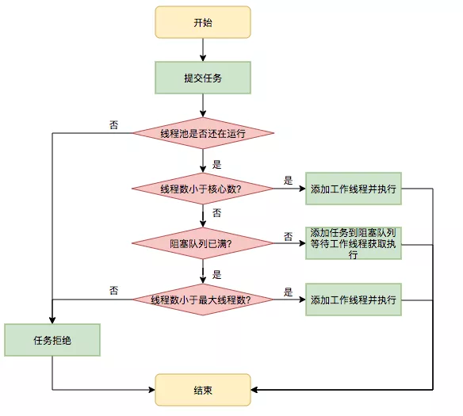
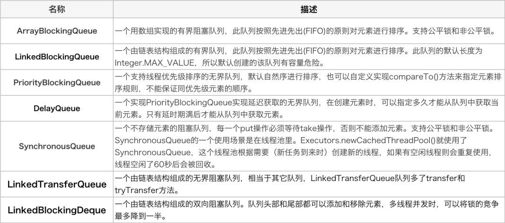
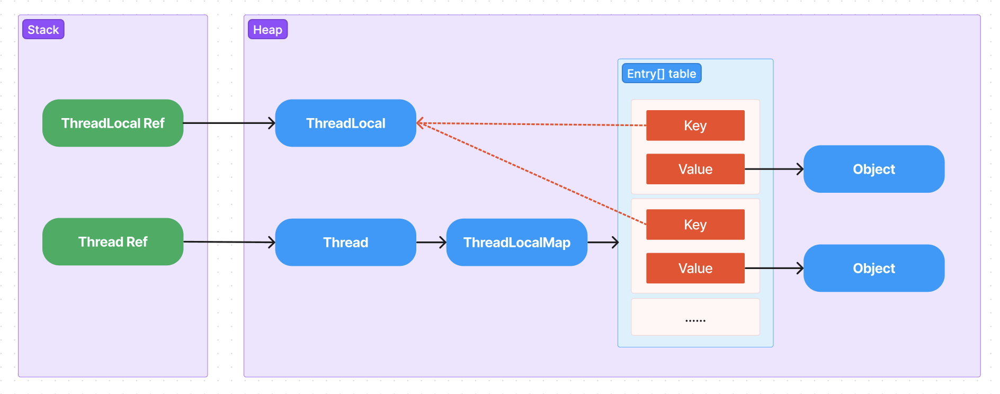

# Thread 线程

## Thread 和 Runnable

`Thread`是类，`Runnable`是接口，实现`Runnable`接口的类可以不用是`Thread`的子类，通过实例化`Runnable`实例并将自身作为目标传入`Thread`即可运行。

大多数情况下，如果只想重写`run()`方法，而不重写`Thread`的方法，就应该使用`Runnable`接口，除非开发者想要修改或增强`Thread`的基本行为。

## Runnable 和 Callable

`Callable`接口是 Java 5 新增的接口，与`Runnable`接口非常相似，不同的是`Runnable`接口需要实现`void run()`方法，而`Callable`需要实现`V call()`方法，并且支持返回值。

```java
@FunctionalInterface
public interface Runnable {
    /**
     * When an object implementing interface <code>Runnable</code> is used
     * to create a thread, starting the thread causes the object's
     * <code>run</code> method to be called in that separately executing
     * thread.
     * <p>
     * The general contract of the method <code>run</code> is that it may
     * take any action whatsoever.
     *
     * @see     java.lang.Thread#run()
     */
    public abstract void run();
}
```

```java
@FunctionalInterface
public interface Callable<V> {
    /**
     * Computes a result, or throws an exception if unable to do so.
     *
     * @return computed result
     * @throws Exception if unable to compute a result
     */
    V call() throws Exception;
}
```

## 线程池

通常我们使用`Executors`工厂模式创建各种线程池，虽然返回的都是`ExecutorService`，但其背后实现逻辑大相径庭。

- Executors.newFixedThreadPool()
- Executors.newSingleThreadExecutor()
- Executors.newSingleThreadScheduledExecutor()
- Executors.newWorkStealingPool()

### ThreadPoolExecutor

`ThreadPoolExecutor`主要有以下几个属性：

- `corePoolSize`：核心线程数，线程池需要保持的线程数量，不管它们创建以后是不是空闲的，除非设置了`allowCoreThreadTimeOut`
- `maximumPoolSize`：最大线程数，线程池中最多允许创建线程数量
- `keepAliveTime`：存活时间，超过核心线程数的线程，超过存货时间后还没有接受到新的任务，则销毁线程
- `unit`：时间单位，`keepAliveTime`的时间单位
- `workQueue`：存放待执行任务的队列，当提交的任务数超过核心线程数大小后，再提交的任务就存放在这里。它仅用来存放提交的任务，所以这里就不要翻译为工作队列了好吗？不要给自己挖坑。

```java
public ThreadPoolExecutor(int corePoolSize,
                          int maximumPoolSize,
                          long keepAliveTime,
                          TimeUnit unit,
                          BlockingQueue<Runnable> workQueue) {
    this(corePoolSize, maximumPoolSize, keepAliveTime, unit, workQueue,
         Executors.defaultThreadFactory(), defaultHandler);
}
```

因为创建线程的开销比较大，所以只有满足以下所有条件时，才会创建额外的线程：

1. 正在运行的线程数量超过核心线程数
2. 阻塞队列已满
3. 正在运行的线程数量小于最大线程数



常用线程安全的队列：



### ScheduledThreadPoolExecutor

`ScheduledThreadPoolExecutor`继承自`ThreadPoolExecutor`类，实现`ScheduledExecutorService`接口。
内部存在一个实现`BlockingQueue`接口的`DelayedWorkQueue`类，其原理基于小顶堆（与`DelayQueue`和`PriorityQueue`类似），每次从延迟队列中获取距离现在最近的一个任务。

### ForkJoinPool

`ForkJoinPool`是 Java 7 新加入的线程池，其基本原理是将一个大任务拆分成多个小任务，并行执行，再结合工作窃取模式提高整体的执行效率，充分利用 CPU 资源。

#### Fork/Join

`Fork/Join`并行方式是获取良好的并行计算性能的一种最简单同时也是最有效的设计技术。
`Fork/Join`并行算法是我们所熟悉的分治算法的并行版本，如同其他分治算法一样，总是会递归的、反复的划分子任务，直到这些子任务可以用足够简单的、短小的顺序方法来执行，典型的用法如下：

```c
Result solve(Problem problem) {
    if (problem is small) {
        directly solve problem
    } else {
        split problem into independent parts
        fork new subtasks to solve each part
        join all subtasks
        compose result from subresults
    }
}
```

`fork`操作将会启动一个新的并行子任务。

`join`操作会一直等待直到所有的子任务都结束。

#### work-stealing

`Fork/Join`框架的核心在于轻量级调度机制，采用了`work-stealing`的基本调度策略：

- 每个工作线程维护一个任务队列
- 队列以双端队列`Deque`的形式被维护，不仅支持后进先出`LIFO`（`push`、`pop`），还支持先进先出`FIFO`（`take`）
- 父任务`fork`操作产生的子任务会被追加到运行该父任务的工作线程对应的双端队列中
- 工作线程以后进先出`LIFO`的顺序处理队列中的任务（优先处理最新的任务）
- 当一个工作线程的本地队列没有任务时，会通过先进先出`FIFO`的规则尝试从其他的工作线程中窃取任务
- 当一个工作线程遇到`join`操作时，它会处理其他任务（如果有的话），直到目标任务已经完成，否则所有任务将在不阻塞的情况下运行至完成
- 当一个工作线程没有可执行的任务，且无法窃取任务时，它就会“退出”（通过`yield`、`sleep`或调整优先级），经过一段时间之后再度尝试，直到所有的工作线程都被处于空闲的状态

使用后进先出`LIFO`来处理每个工作线程自己的任务，而使用先进先出`FIFO`获取别的任务，这是一种被广泛使用的进行递归`Fork/Join`设计的一种调优手段。
让窃取任务的线程从队列拥有者相反的方向进行操作可以减少线程竞争，同样体现了递归分治算法的大任务优先策略。
因此，更早期被窃取的任务有可能会提供一个更大的单元任务，从而使得窃取线程能够在将来进行递归分解。

## ThreadLocal

`ThreadLocal`提供了线程内的局部变量，这种变量在线程的生命周期内起作用，减少同一个线程内多个方法或者组件之间一些公共变量的传递的复杂度。但是如果滥用`ThreadLocal`，就可能会导致内存泄漏

```
public class Thread implements Runnable {
    /* ThreadLocal values pertaining to this thread. This map is maintained
     * by the ThreadLocal class. */
    ThreadLocal.ThreadLocalMap threadLocals = null;

    /*
     * InheritableThreadLocal values pertaining to this thread. This map is
     * maintained by the InheritableThreadLocal class.
     */
    ThreadLocal.ThreadLocalMap inheritableThreadLocals = null;
}
```

```java
public class ThreadLocal<T> {
   static class ThreadLocalMap {
        private static final int INITIAL_CAPACITY = 16;
        private Entry[] table;
        private int size = 0;
        private int threshold;
        
        static class Entry extends WeakReference<ThreadLocal<?>> {
            Object value;

            Entry(ThreadLocal<?> k, Object v) {
                super(k);
                value = v;
            }
        }
   }
}
```

`Thread`类内部维护了两个`ThreadLocal.ThreadLocalMap`类的映射表，分别为`threadLocals`和`inheritableThreadLocals`。

`ThreadLocal.ThreadLocalMap`基于`hashtable`原理实现，其`Entry`继承自`WeakReference`类，`key`为`ThreadLocal`对象本身，`value`是真正存储的数据对象。

也就是说`ThreadLocal`本身并不存储值，只是作为一个`key`来从线程的`ThreadLocal.ThreadLocalMap`中获取`value`。



### 引用

### 内存泄漏

由于`ThreadLocal.ThreadLocalMap`的`Entry`是继承自用`WeakReference`类，即通过弱引用将`ThreadLocal`作为作为`key`，
所以如果某个`ThreadLocal`没有外部强引用来引用它，系统`GC`时会回收该`ThreadLocal`对象，但是如此一来`ThreadLocal.ThreadLocalMap`中就会出现`key`为`null`的`Entry`，
并且我们没有办法访问到这些`Entry`的`value`，如果该线程对象一直不被回收的话，这些`Entry`的`value`就会一直存在于系统中无法被回收，造成内存泄漏。

因此，`ThreadLocal`内存泄漏的根源是：由于`ThreadLocal.ThreadLocalMap`的生命周期跟`Thread`一样，如果没有手动删除数据就会导致内存泄漏，而不是因为弱引用。

### 最佳实践

综合上面的分析，我们可以理解`ThreadLocal`内存泄漏的原因，那么怎么避免内存泄漏呢？

每次使用`ThreadLocal`的`set(T value)`方法后，需要在一个合适的时机调用的`remove()`方法清除数据。

在使用线程池的情况下，没有及时清理`ThreadLocal`对应的数据，不仅是内存泄漏的问题，更严重的是可能导致业务逻辑出现问题。所以，使用`ThreadLocal`要像锁用完立即解锁一样，使用完需要及时清理。

## InheritableThreadLocal

由于`ThreadLocal`设计之初就是为了绑定当前线程，如果希望当前线程的`ThreadLocal`能够被子线程使用，实现方式就会相当困难（需要用户自己在代码中传递）。在此背景下，`InheritableThreadLocal`应运而生。

上手我们提到`Thread`类中定义了`threadLocals`和`inheritableThreadLocals`两个变量，其中`inheritableThreadLocals`即主要存储可自动向子线程中传递的`ThreadLocal.ThreadLocalMap`。

```java
public class ThreadLocal<T> {
    T childValue(T parentValue) {
        throw new UnsupportedOperationException();
    }
    
    ThreadLocalMap getMap(Thread t) {
        return t.threadLocals;
    }
    
    void createMap(Thread t, T firstValue) {
        t.threadLocals = new ThreadLocalMap(this, firstValue);
    }
}

public class InheritableThreadLocal<T> extends ThreadLocal<T> {
    protected T childValue(T parentValue) {
        return parentValue;
    }

    ThreadLocalMap getMap(Thread t) {
       return t.inheritableThreadLocals;
    }

    void createMap(Thread t, T firstValue) {
        t.inheritableThreadLocals = new ThreadLocalMap(this, firstValue);
    }
}
```

`InheritableThreadLocal`类继承了`ThreadLocal`类，并重写了的三个方法。

- childValue：创建子线程时，复制父线程的`InheritableThreadLocal`至子线程时需要用到本方法
- getMap：操作`InheritableThreadLocal`时，需要读取或修改`Thread`类中的`inheritableThreadLocals`变量，而不是`threadLocals`，所以需要重写
- createMap：同上

```java
private void init(ThreadGroup g, Runnable target, String name,
                  long stackSize, AccessControlContext acc,
                  boolean inheritThreadLocals) {
    // ignored

    if (inheritThreadLocals && parent.inheritableThreadLocals != null)
        this.inheritableThreadLocals =
            ThreadLocal.createInheritedMap(parent.inheritableThreadLocals);

    // ignored
}
```

从`Thread`类的源码中我们可以看到，采用默认方式产生子线程，若`inheritThreadLocals`为`true`，且父线程`inheritableThreadLocals`不为空时，则复制一份父线程`inheritableThreadLocals`到子线程。

### 应用

调用链追踪：在调用链系统设计中，为了优化系统运行速度，会使用多线程编程，为了保证调用链`traceId`和`spanId`能够自然的在多线程间传递，需要考虑传递问题。
灰度路由：在各个服务之间传递灰度标识，尤其是针对通过异步调用的服务。
用户会话：将用户`Session`储存到`ThreadLocal`中，方便开发者可以跨方法跨线程获取全局`Session`。

## wait 和 sleep

### wait和sleep的相同点和不同点

| wait                                                  | sleep      |
|:------------------------------------------------------|:-----------|
| 必须在`synchronized`中调用，同理`notify`和`notifyAll`方法         | 可以在任何地方调用  |
| 可以暂停线程                                                | 可以暂停线程     |
| 可以指定超时时间                                              | 可以指定休眠时间   |
| 未指定超时时间时不会自动苏醒，需要其他线程调用同一个对象上的`notify`或者`notifyAll`方法 | 根据超时时间自动苏醒 |
| 会释放锁                                                  | 不会释放锁      |
| 通常用于线程间交互和通信                                          | 通常用于暂停执行   |

#### 两个线程交替打印奇偶数

```java
private static volatile int count = 0;
private static final Object lock = new Object();

static class Turning implements Runnable {
    @Override
    public void run() {
        synchronized (lock) {
            while (count < 100) {
                System.out.println(Thread.currentThread().getName() + ":" + (++count));
                lock.notify();
                if (count < 100) {
                    try {
                        lock.wait();
                    } catch (Exception e) {
                        e.printStackTrace();
                    }
                }
            }
        }
    }
}

public static void main(String[] args) {
    new Thread(new Turning(), "奇数").start();
    new Thread(new Turning(), "偶数").start();
}
```