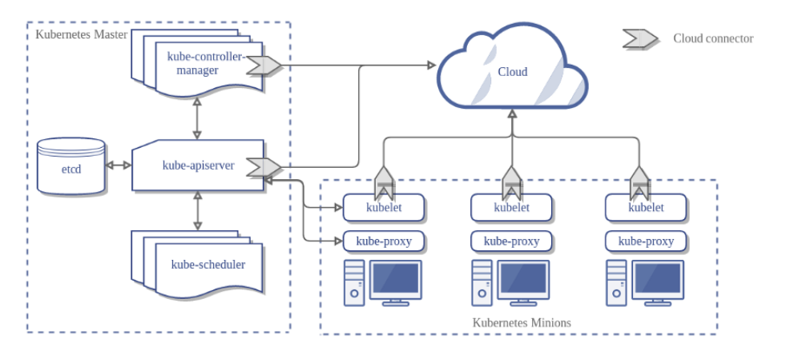
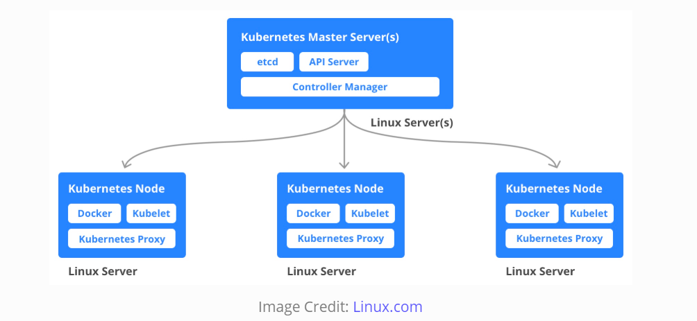

# Kubernetes

## 核心组件

一个 Kubernetes 集群通常由多个 Master 节点和 Worker 节点组成。

### Master Node

一个 Kubernetes 集群包含一个或多个运行 Control Plane 的 Master 节点。Master 节点主要负责管理群集，储存集群成员的信息，监控 Worker 节点，当一个节点发生故障时，将故障节点的工作负载转移到另一个工作节点。
Control Plane 由不同的进程组成，例如，API Server（提供 HTTP API 服务），Scheduler（选择节点以运行容器），Controller Manager（运行控制器）和 etcd（全局可用的配置存储）。

### Worker Node

Worker 节点是安装了 Kubernetes 的物理机或虚拟机。Worker 节点是 Kubernetes 将在其中启动 Pod 内的容器的地方。
Kubernetes 集群是一组组合在一起的 Worker 节点，即使一个节点发生故障，应用程序仍然可以从其他节点访问。此外，拥有多个节点也有助于分担计算负载。

这些节点可以是裸机服务器，也可以是本地虚拟机，或是云虚拟机。每个节点都包含一个容器运行环境（例如 Docker 引擎）、Kubelet（负责根据来自 Control Plane 的请求启动、停止和管理各个容器）和 kube-proxy（负责网络和负载平衡）。

### Pod

Pod 是 Kubernetes 可以管理的最小可部署单元。Pod 是一个由一个或多个容器组成的逻辑组，它们共享相同的 IP 地址和端口空间。Pod 的主要目的是支持同址进程（co-located processes），例如：应用程序服务和它的本地缓存。
所以，Pod 中的容器可以通过 localhost 找到彼此，也可以使用标准的进程间通信相互通信。换句话说，一个 Pod 代表一个“逻辑主机”。

Pod 是不可持久化的，如果运行 Pod 的节点死亡，则该 Pod 将会被删除。可以将其替换为相同的 Pod，甚至具有相同的名称，但具有新的唯一标识符 (UID)。

### Master Node Components

_Scheduler 未在图中展示_

#### API Server

API Server 提供了集群管理的 HTTP API 接口，包括认证授权、数据校验以及集群状态变更等。是组件之间的数据交互和通信的枢纽，其他组件通过 API Server 操作数据（只有 API Server 能直接操作 etcd）。

#### Scheduler

用于监视未分配节点的新创建的 Pod，并选择一个 Worker 节点供它们运行。

调度决策考虑的因素包括个人和集体资源要求、硬件/软件/策略约束、亲和性和反亲和性规范、数据局部性、工作负载间干扰和截止日期。

#### Controller Manager

Controller Manager 由 Kube-Controller-Manager 和 Cloud-Controller-Manager 组成，负责通过 API Server 监控整个集群的状态，并确保集群处于预期的工作状态。

##### Kube-Controller-Manager

从逻辑上讲，每个控制器都是一个单独的进程，但为了降低复杂性，它们都被编译成一个二进制文件并在一个进程中运行。

控制器包括：

- Node Controller：负责在节点宕机时进行通知和响应。
- Replication Controller：负责为系统中的每个复制控制器对象维护正确数量的 Pod。
- Endpoints Controller：填充 Endpoints 对象，即加入 Services 和 Pod。
- Service Account and Token Controllers：为新命名空间创建默认帐户和 API 访问令牌。

##### Cloud-Controller-Manager

Cloud-Controller-Manager 运行与底层云提供商交互的控制器，可以将集群连接到云提供商的接口，并将与该云平台交互的组件同与集群交互的组件分离开来。它是 Kubernetes 1.6 版中引入的 alpha 功能。

控制器包括：

- Node Controller：用于检查云提供商以确定节点停止响应后是否已在云中删除。
- Route Controller：用于在底层云基础设施中设置路由。
- Service Controller：用于创建、更新和删除云提供商负载均衡器。
- Volume Controller：用于创建、附加和挂载卷，并与云提供商交互以编排卷。

#### etcd

etcd 用于存储集群中每个节点可以使用的配置信息。它是一种高可用性键值存储，可以分布在多个节点之间，可供所有人访问。它只能由 API Server 访问，因为它可能包含一些敏感信息。

当集群中有多个节点和多个主节点时，etcd 以分布式方式将所有这些信息存储在集群中的所有节点上。etcd 负责在集群内实现锁，以确保 Master 节点之间没有冲突。

### Worker Node Components

这些组件在每个节点上运行，维护运行的 pods 并提供运行时环境。

#### Container Runtime

容器运行时是用于运行容器的底层软件，容器运行时是负责运行容器的软件。
Kubernetes 支持多种运行时：Docker、containerd、cri-o、rktlet 以及 Kubernetes CRI 的任何实现。

_简单的说就是，帮忙装好了 Docker 运行环境。_

#### Kubelet

Kubelet 是在集群中每个节点上运行的代理，负责确保容器按预期在节点上运行，管理网络规则、端口转发等。

它是每个节点中的一项小型服务，负责在 Control Plane 服务之间传递信息。它与 etcd 存储交互以读取配置详细信息并写入值，与 Master 节点的组件通信以接收命令和工作。

Kubelet 采用一组通过各种机制提供的 PodSpecs，并确保这些 PodSpecs 中描述的容器运行且健康。

_Kubelet 不会管理不是由 Kubernetes 创建的容器。_

#### Kube-Proxy

Kube-Proxy 是在每个节点上运行的代理服务，使服务对外部主机可用。它协助将请求转发到正确的容器，并且能够执行原始负载平衡。
它确保网络环境是可预测和可访问的，同时它也是隔离的。它管理节点上的 pods、volumes、secrets 和新创建的容器的健康检查等。

## 为什么使用 Kubernetes

- 容器编排
- 自动扩缩容
- 滚动发布
- 负载均衡

## 参考链接

- [Components of Kubernetes Architecture](https://gauravguptacloud.medium.com/components-of-kubernetes-architecture-6feea4d5c712)