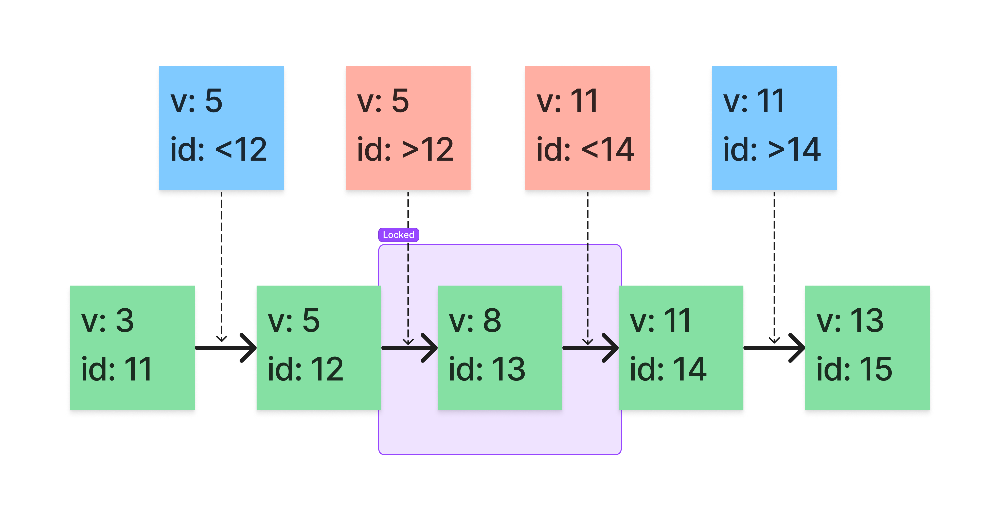

# MySQL

## InnoDB Locking

- 共享/排它锁 （Shared and Exclusive Locks）
- 意向锁 （Intention Locks）
- 记录锁 （Record Locks）
- 间隙锁 （Gap Locks）
- 临键锁 （Next-Key Locks）
- 插入意向锁 （Insert Intention Locks）
- 自增锁 （AUTO-INC Locks）
- 空间索引谓词锁 （Predicate Locks for Spatial Indexes）

### 共享/排它锁

InnoDB实现标准的行级锁定，其中有两种类型的锁：

- 共享锁（S）：允许持有该锁的事务读取一行。
- 排它锁（X）：允许持有该锁的事务更新或删除一行。

如果一个事务`T1`持有行`r`上的一个共享(S)锁，那么来自不同事务T2的请求对行`r`上的一个锁处理如下:

- 可以立即授予`T2`对(S)锁的请求，因此，`T1`和`T2`都对行`r`保持(S)锁定。
- 不能立即授予`T2`对(X)锁的请求。

如果事务`T1`在行`r`上持有排他(X)锁，则无法立即授予来自某个不同事务`T2`对`r`上任一类型的锁的请求。相反，事务`T2`必须等待事务`T1`释放其对行`r`的锁定。

|     |  X   |  S   |
|:---:|:----:|:----:|
|  X  |  冲突  |  冲突  |
|  S  |  冲突  |  兼容  |

### 意向锁

InnoDB 支持多粒度锁，允许行锁和表锁共存。例如：`LOCK TABLES ... WRITE`之类的语句在指定表上采用排他(X)锁。为了使多粒度级别的锁定变得实用，InnoDB 使用意图锁。意向锁是表级锁，它指示事务稍后对表中的行需要哪种类型的锁（共享或独占）。有两种类型的意图锁：

- 意向共享锁（IS）：事务想要获得一张表中某几行的共享锁。
- 意向排它锁（IX）：事务想要获得一张表中某几行的排它锁。

意向锁规则如下：

在事务可以获取表中行的共享(S)锁之前，它必须首先获取表上的(IS)锁或更重的锁。

在事务可以获取表中行的排他(S)锁之前，它必须首先获取表上的(IX)锁。

除了全表请求（例如：`LOCK TABLES ... WRITE`）之外，意图锁不会阻塞任何东西。意图锁的主要目的是表明有人正在锁定一行，或者要锁定表中的一行。

设置(IS)锁：`SELECT ... FOR SHARE`

设置(IX)锁：`SELECT ... FOR UPDATE`

注意，`FOR SHARE`是`LOCK IN SHARE MODE`的替代品，但`LOCK IN SHARE MODE`仍可用于向后兼容。

|     |  X   |  IX  |  S   |  IS  |
|:---:|:----:|:----:|:----:|:----:|
|  X  |  冲突  |  冲突  |  冲突  |  冲突  |
| IX  |  冲突  |  兼容  |  冲突  |  兼容  |
|  S  |  冲突  |  冲突  |  兼容  |  兼容  |
| IS  |  冲突  |  兼容  |  兼容  |  兼容  |

### 记录锁

记录锁是对索引记录的锁。例如：`SELECT c1 FROM t WHERE c1 = 10 FOR UPDATE`，防止任何其他事务插入、更新或删除`t.c1`值为`10`的行。

### 间隙锁

间隙锁是在索引记录之间的间隙上的锁，或在第一条索引记录之前或最后一条索引记录之后的间隙上的锁。例如：`SELECT c1 FROM t WHERE c1 BETWEEN 10 and 20 FOR UPDATE`，防止其他事务将值`15`插入`t.c1`列，无论该列中是否已经存在任何此类值，因为该范围内所有现有值之间的间隙都已锁定。

间隙可能跨越单个索引值、多个索引值，甚至是空的。

InnoDB 中的间隙锁是“纯粹的抑制性”，这意味着它们的唯一目的是防止其他事务插入到间隙中。间隙锁可以共存。一个事务采用的间隙锁不会阻止另一个事务在同一间隙上采用间隙锁。共享和独占间隙锁之间没有区别。它们彼此不冲突，并且执行相同的功能。

间隙锁定可以被显式禁用。如果您将事务隔离级别更改为`READ COMMITTED`，则会发生这种情况。在这种情况下，间隙锁定对搜索和索引扫描禁用，仅用于外键约束检查和重复键检查。

### 临键锁

临键锁是记录锁和间隙锁的组合。

假设存在以下表及数据：

```mysql
create table `test`
(
    `id` int primary key auto_increment,
    `v`  int,
    key `v` (`v`)
) engine = InnoDB;
```

其中`id`列为自增主键，并为`v`列创建了索引。

| id  | v   |
|:----|:----|
| 10  | 1   |
| 11  | 3   | 
| 12  | 5   | 
| 13  | 8   | 
| 14  | 11  | 
| 15  | 13  | 

该索引可能的临键锁涵盖以下区间：

```text
(-∞, 1]
(1, 3]
(3, 5]
(5, 8]
(8, 11]
(11, 13]
(13, +∞)
```

当我们开启事务`T1`执行以下`SQL`时，保持事务不提交，会锁住`(5, 8]`和`(8, 11]`区间。

```mysql
start transaction;
select * from test where v = 8 for update;
```

所以我们可以预测在新的事务`T2`中分别执行以下`SQL`的结果：

```mysql
insert into test(v) values(1);  // 区间外 预测：non-blocking 实际：non-blocking 符合预期
insert into test(v) values(4);  // 区间外 预测：non-blocking 实际：non-blocking 符合预期
insert into test(v) values(5);  // 区间外 预测：non-blocking 实际：blocking     不符合预期
insert into test(v) values(9);  // 区间内 预测：blocking     实际：blocking     符合预期
insert into test(v) values(11); // 区间内 预测：blocking     实际：non-blocking 不符合预期
insert into test(v) values(12); // 区间外 预测：non-blocking 实际：non-blocking 符合预期
```

根据临键锁的区间，我们预测在`T2`事务中分别插入值为`9`和`11`的数据会被`T1`事务阻塞。 但是实际上在插入值为`5`和`9`时才会被阻塞，结果并不符合预期，似乎违背了临键锁的设计，这就要从索引结构（B+tree）说起了。

是由于 InnoDB 的叶子节点都是按顺序的插入的，并且`id`为自增主键，因此我们插入值为`5`的记录时，会将数据追加到原来值为`5`数据的后面，于是就落到了`T1`事务临键锁涵盖的区间内。同理可知插入值为`11`的记录时，实际的叶子节点在区间外。



### 插入意向锁

插入意向锁是由`INSERT`操作设置的一种特殊的间隙锁，而并非是上述提到的意向锁，意向锁是表级锁，而插入意向锁是行级锁。

此锁表示插入的意图，即如果插入到同一索引间隙中的多个事务未插入到间隙内的同一位置，则它们无需相互等待。 假设有值为 4 和 7 的索引记录。分别尝试插入值 5 和 6 的单独事务，在获得插入行的排他锁之前，每个使用插入意图锁锁定 4 和 7 之间的间隙，但不要相互阻塞，因为行是不冲突的。

### 自增锁

自增锁是一种特殊的表级锁，由插入到具有`AUTO_INCREMENT`列的表中的事务使用。 在最简单的情况下，如果一个事务正在向表中插入值，则任何其他事务都必须等待在该表中执行自己的插入操作，以便第一个事务插入的行接收连续的主键值。

### 空间索引谓词锁

_忽略_

## Metadata Locking

元数据锁用来管理对数据库对象的并发访问并确保数据一致性。元数据锁定不仅适用于表，还适用于库、存储程序（过程、函数、触发器、计划事件）、表空间等。

|     | 写锁  | 读锁  |
|:---:|:---:|:---:|
| 写锁  | 冲突  | 冲突  |
| 读锁  | 冲突  | 兼容  |

假设存在以下操作：

|     | Session 1          | Session 2          | Session 3                    | Session 4          | 
|:----|:-------------------|:-------------------|:-----------------------------|:-------------------|
| 1   | begin;             |                    |                              |                    |  
| 2   | select * from foo; |                    |                              |                    | 
| 3   |                    | select * from foo; |                              |                    | 
| 4   |                    |                    | alter table foo add bar int; |                    |
| 5   |                    |                    |                              | select * from foo; | 
| 6   | commit;            |                    |                              |                    | 

1. `Session 1`开启事务。
2. `Session 1`执行查询前获取`MDL`读锁，查询完成后未提交事务。
3. `Session 2`执行查询前获取`MDL`读锁，由于`MDL`读锁不互斥，因此执行成功。
4. `Session 3`对表结构进行修改前，需要获得`MDL`写锁，但是由于`Session 1`持有了`MDL`读锁，因此当前会话被阻塞。
5. `Session 4`执行查询前获取`MDL`读锁，由于获取锁是有先后顺序的，所以当前会话被`Session 3`被阻塞。
6. `Session 1`提交事务，`Session 4`可能会比`Session 3`提前执行完。

第六步中，`Session 4`可能会比`Session 3`提前执行完，其实涉及到`Online DDL`的知识，大致流程如下：

1. 获取`MDL`写锁：创建临时的`frm`和`idb`文件，由于这个过程需要保证安全，因此是排他的，同时这个过程也是快速的。
2. 降级成`MDL`读锁：临时文件创建完成之后，于是不需要排他，就降级为读锁，支持增删改查。
3. 执行DDL：写入数据。
4. 升级成`MDL`写锁：替换数据文件，由于这个过程需要保证安全，因此会尝试升级成`MDL`写锁，这个过程也是快速的。
5. 释放`MDL`锁。

第1步、第2步、第4步和第5步执行时间较短，第3步占了绝大部分时间，而这个期间，表可以进行正常读写，所以被称为`Online DDL`。

由此可得，`Session 3`将`MDL`写锁降级为读锁后，`Session 4`就可以获取`MDL`读锁并完成查询。

## ACID

是指数据库管理系统（DBMS）在写入或更新资料的过程中，为保证事务（Transaction）是正确可靠的，所必须具备的四个特性：

- 原子性（Atomicity）
- 一致性（Consistency）
- 隔离性（Isolation）
- 持久性（Durability）
