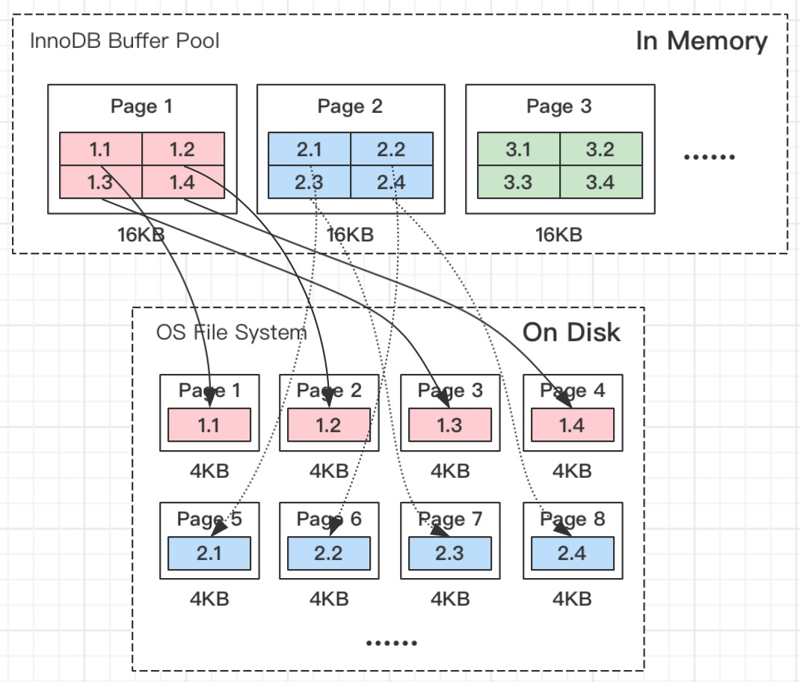
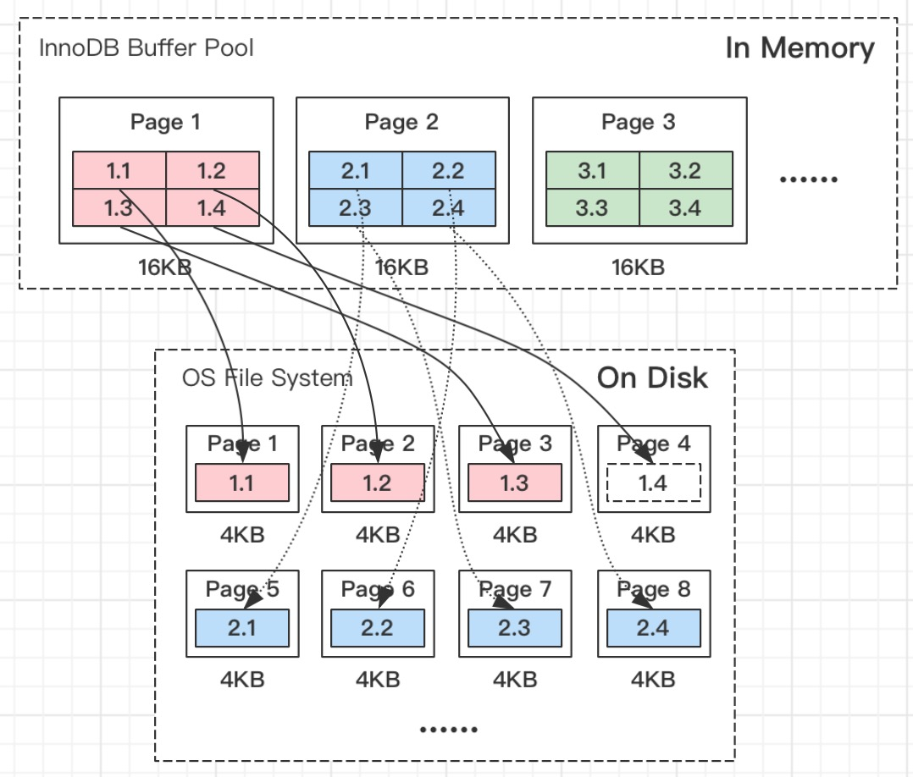
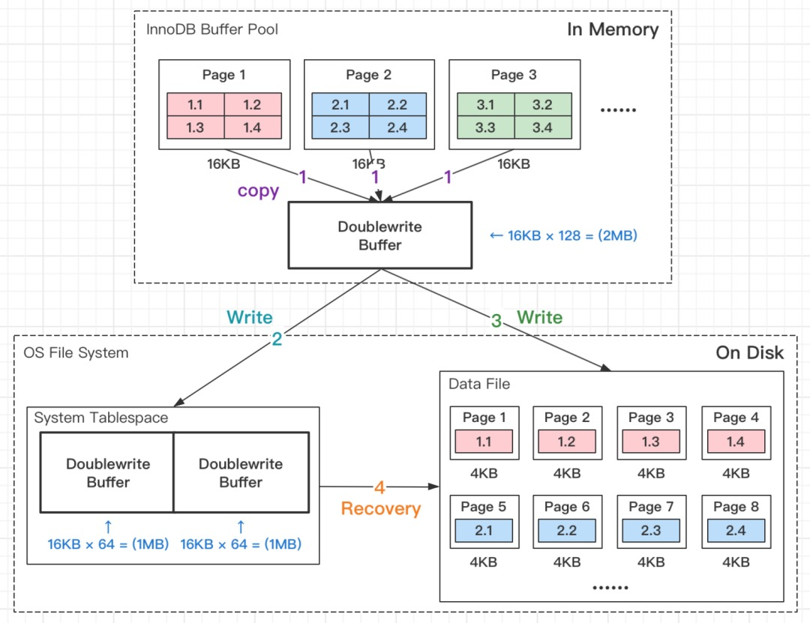
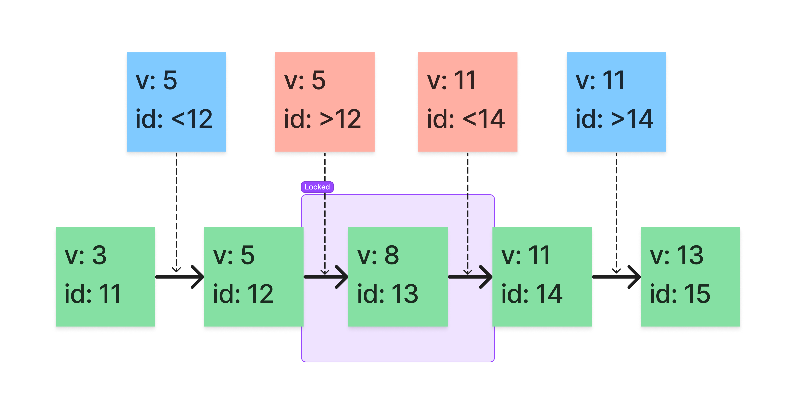

# InnoDB

## 索引 Indexes

### B+Tree

为什么 InnoDB 存储引擎选择`B+Tree`而不是`Hash`或者`B-Tree`的原因：

- `Hash`虽然能够提供`O(1)`的单数据行操作性能，但是对于范围查询和排序却无法很好地支持，最终导致全表扫描。
- `B-Tree`能够在非叶节点中存储数据，但是这也导致在查询连续数据时可能会带来更多的随机 I/O，而`B+Tree`的所有叶节点可以通过指针相互连接，能够减少顺序遍历时产生的额外随机 I/O，同样地，`ORDER BY`排序效率也更高。

### 聚簇索引和非聚簇索引

B-Tree是左小右大的顺序存储结构，节点只包含主键索引列，而叶子节点包含索引列和数据，这种数据和索引在一起存储的索引方式叫做聚簇索引，一张表只能有一个聚簇索引。

假设没有定义主键，InnoDB会选择一个唯一的非空索引代替，如果没有的话则会隐式定义一个主键作为聚簇索引。

非聚簇索引只包含索引对应字段的值和主键的值。

### 覆盖索引和回表

覆盖索引指的是在一次查询中，如果一个索引包含或者说覆盖所有需要查询的字段的值，我们就称之为覆盖索引，而不再需要回表查询。

而要确定一个查询是否是覆盖索引，我们只需要`EXPLAIN`语句看`Extra`的结果是否是`Using index`即可。

## 双写缓冲区 Doublewrite Buffer

Linux 文件系统页（OS Page）的大小是`4KB`。
同样地，MySQL 作为一个程序也是有最小交互单位的，即`InnoDB Buffer Pool`能处理的最小单位，可以通过`SHOW VARIABLES LIKE 'innodb_page_size'`命令可以得到 MySQL 的页（Page）大小默认是`16KB`。

所以可以得出一个结论：MySQL 将`Buffer Pool`中一页数据写入磁盘，需要写`4`个文件系统里的页。



如果正在往磁盘中写入数据时断电，则会出现“页数据损坏”。



如上图所示，MySQL 内 Page 1 的页准备写入数据到磁盘，写到最后一个文件系统的页时断电了，则会出现，重启 MySQL 服务后，Page 1 的页对应磁盘上的 Page 1、Page 2、Page 3 三个页，显然，数据完整性被破坏了。

针对上述出现的情况，很容易想到的方法是，通过一个副本对原来的页进行还原，这个存储副本的地方即为双写缓冲区。与传统的 Buffer 不同，它分为内存和磁盘的两层架构。



当存在页需要写入磁盘时：

- 第1步：通过`memcopy`将数据写入到双写缓冲区的内存中
- 第2步：将双写缓冲区内存中的数据写到双写缓冲区磁盘中
- 第3步：将双写缓冲区内存中的数据写到数据磁盘存储`.ibd`文件中

_写缓冲区内存结构由128个页（Page）构成，所以容量为`16KB × 128 = 2MB`。_

双写缓冲区解决“页数据损坏”的关键

    若第2步操作被中断，磁盘里依然存在 Page 1、Page 2、Page 3、Page 4 的完整数据。
    若第3步操作被中断，写缓冲区的磁盘结构里存储着完整的数据，此时可以重新执行将数据写入磁盘。
    由于分别写了双写缓冲区和数据文件，所以，总会存在完整的数据，所以可以解决“页数据损坏”的问题。

双写缓冲区写两次磁盘的性能问题

    第1步：数据从内存到内存，速度很快。
    第2步：将双写缓冲区内存中的数据写到双写缓冲区磁盘中，通过fsync()写到磁盘，由于是磁盘顺序写，所以速度也比较快。
    第3步，无论是否启双写缓冲区，均需要这一步将数据写入磁盘，不属于额外开销。
    虽然数据被写入两次，但双写缓冲区不需要两倍的 I/O 开销或两倍的 I/O 操作。数据以大顺序块的形式写入双写缓冲区，只需fsync()调用操作系统一次。

## 重做日志 Redo Log

Redo Log 是一种基于磁盘的数据结构，用于在崩溃恢复期间纠正由不完整事务写入的数据。在正常操作期间，Redo Log 对由 SQL 语句或低级 API 调用产生的更改表数据的请求进行编码。
在意外关闭之前未完成更新数据文件的修改会在初始化期间和接受连接之前自动重播。

InnoDB 与其他任何符合 ACID 的数据库引擎一样，在提交事务之前写入事务的 Redo Log。
InnoDB 使用组提交功能将多个写入请求组合在一起，以避免每次提交一次刷新。
对于组提交，InnoDB 向日志文件发出一次写操作，以对几乎同时提交的多个用户事务执行提交操作，从而显著提高吞吐量。

## 撤消日志 Undo Log

单个读写事务关联的 Undo Log 记录的集合称为 Undo Logs。
Undo Log 记录包含有关如何撤消事务对聚簇索引记录的最新更改的信息。
如果另一个事务需要将原始数据视为一致读（快照读）操作的一部分，则从 Undo Log 记录中检索未修改的数据。

驻留在全局临时表空间中的 Undo Log 用于修改用户定义临时表中数据的事务。
Undo Log 不同于 Redo Log，因为它们不需要崩溃恢复。它们仅用于在服务器运行时进行回滚。这种类型的 Undo Log 通过避免 Redo Log 记录 I/O 来提高性能。

InnoDB 存储引擎通过 Undo Log 实现多版本并发控制（multiversion concurrency control, MVCC）。

_MVCC 只在读已提交（READ-COMMITTED）和可重复读（REPEATABLE-READ）两种隔离级别下工作。_

## 锁 Locking

- 共享/排它锁（Shared and Exclusive Locks）
- 意向锁（Intention Locks）
- 记录锁（Record Locks）
- 间隙锁（Gap Locks）
- 临键锁（Next-Key Locks）
- 插入意向锁（Insert Intention Locks）
- 自增锁（AUTO-INC Locks）
- 空间索引谓词锁（Predicate Locks for Spatial Indexes）

### 共享/排它锁 Shared and Exclusive Locks

InnoDB实现标准的行级锁定，其中有两种类型的锁：

- 共享锁（S）：允许持有该锁的事务读取一行。
- 排它锁（X）：允许持有该锁的事务更新或删除一行。

如果一个事务`T1`持有行`r`上的一个共享(S)锁，那么来自不同事务T2的请求对行`r`上的一个锁处理如下:

- 可以立即授予`T2`对(S)锁的请求，因此，`T1`和`T2`都对行`r`保持(S)锁定。
- 不能立即授予`T2`对(X)锁的请求。

如果事务`T1`在行`r`上持有排他(X)锁，则无法立即授予来自某个不同事务`T2`对`r`上任一类型的锁的请求。相反，事务`T2`必须等待事务`T1`释放其对行`r`的锁定。

|     |  X   |  S   |
|:---:|:----:|:----:|
|  X  |  冲突  |  冲突  |
|  S  |  冲突  |  兼容  |

### 意向锁 Intention Locks

InnoDB 支持多粒度锁，允许行锁和表锁共存。例如：`LOCK TABLES ... WRITE`之类的语句在指定表上采用排他(X)锁。为了使多粒度级别的锁定变得实用，InnoDB 使用意图锁。意向锁是表级锁，它指示事务稍后对表中的行需要哪种类型的锁（共享或排他）。有两种类型的意图锁：

- 意向共享锁（IS）：事务想要获得一张表中某几行的共享锁。
- 意向排它锁（IX）：事务想要获得一张表中某几行的排它锁。

意向锁规则如下：

在事务可以获取表中行的共享(S)锁之前，它必须首先获取表上的(IS)锁或更重的锁。

在事务可以获取表中行的排他(S)锁之前，它必须首先获取表上的(IX)锁。

除了全表请求（例如：`LOCK TABLES ... WRITE`）之外，意图锁不会阻塞任何东西。意图锁的主要目的是表明有人正在锁定一行，或者要锁定表中的一行。

设置(IS)锁：`SELECT ... FOR SHARE`

设置(IX)锁：`SELECT ... FOR UPDATE`

注意，`FOR SHARE`是`LOCK IN SHARE MODE`的替代品，但`LOCK IN SHARE MODE`仍可用于向后兼容。

|     |  X   |  IX  |  S   |  IS  |
|:---:|:----:|:----:|:----:|:----:|
|  X  |  冲突  |  冲突  |  冲突  |  冲突  |
| IX  |  冲突  |  兼容  |  冲突  |  兼容  |
|  S  |  冲突  |  冲突  |  兼容  |  兼容  |
| IS  |  冲突  |  兼容  |  兼容  |  兼容  |

### 记录锁 Record Locks

记录锁是对索引记录的锁。例如：`SELECT c1 FROM t WHERE c1 = 10 FOR UPDATE`，防止任何其他事务插入、更新或删除`t.c1`值为`10`的行。

### 间隙锁 Gap Locks

间隙锁是在索引记录之间的间隙上的锁，或在第一条索引记录之前或最后一条索引记录之后的间隙上的锁。例如：`SELECT c1 FROM t WHERE c1 BETWEEN 10 and 20 FOR UPDATE`，防止其他事务将值`15`插入`t.c1`列，无论该列中是否已经存在任何此类值，因为该范围内所有现有值之间的间隙都已锁定。

间隙可能跨越单个索引值、多个索引值，甚至是空的。

InnoDB 中的间隙锁是“纯粹的抑制性”，这意味着它们的唯一目的是防止其他事务插入到间隙中。间隙锁可以共存。一个事务采用的间隙锁不会阻止另一个事务在同一间隙上采用间隙锁。共享和排他间隙锁之间没有区别。它们彼此不冲突，并且执行相同的功能。

间隙锁定可以被显式禁用。如果您将事务隔离级别更改为`READ COMMITTED`，则会发生这种情况。在这种情况下，间隙锁定对搜索和索引扫描禁用，仅用于外键约束检查和重复键检查。

### 临键锁 Next-Key Locks

临键锁是记录锁和间隙锁的组合。

假设存在以下表及数据：

```sql
create table `test`
(
    `id` int primary key auto_increment,
    `v`  int,
    key `v` (`v`)
) engine = InnoDB;
```

其中`id`列为自增主键，并为`v`列创建了索引。

| id  | v   |
|:----|:----|
| 10  | 1   |
| 11  | 3   | 
| 12  | 5   | 
| 13  | 8   | 
| 14  | 11  | 
| 15  | 13  | 

该索引可能的临键锁涵盖以下区间：

```text
(-∞, 1]
(1, 3]
(3, 5]
(5, 8]
(8, 11]
(11, 13]
(13, +∞)
```

当我们开启事务`T1`执行以下`SQL`时，保持事务不提交，会锁住`(5, 8]`和`(8, 11]`区间。

```sql
start transaction;
select * from test where v = 8 for update;
```

所以我们可以预测在新的事务`T2`中分别执行以下`SQL`的结果：

```sql
insert into test(v) values(1);  ## 区间外 预测：non-blocking 实际：non-blocking 符合预期
insert into test(v) values(4);  ## 区间外 预测：non-blocking 实际：non-blocking 符合预期
insert into test(v) values(5);  ## 区间外 预测：non-blocking 实际：blocking     不符合预期
insert into test(v) values(9);  ## 区间内 预测：blocking     实际：blocking     符合预期
insert into test(v) values(11); ## 区间内 预测：blocking     实际：non-blocking 不符合预期
insert into test(v) values(12); ## 区间外 预测：non-blocking 实际：non-blocking 符合预期
```

根据临键锁的区间，我们预测在`T2`事务中分别插入值为`9`和`11`的数据会被`T1`事务阻塞。但是实际上在插入值为`5`和`9`时才会被阻塞，结果并不符合预期，似乎违背了临键锁的设计，这就要从索引结构（B+tree）说起了。

是由于 InnoDB 的叶子节点都是按顺序的插入的，并且`id`为自增主键，因此我们插入值为`5`的记录时，会将数据追加到原来值为`5`数据的后面，于是就落到了`T1`事务临键锁涵盖的区间内。同理可知插入值为`11`的记录时，实际的叶子节点在区间外。

叶子节点向右遍历时且最后⼀个值不满⾜等值条件的时候，临键锁会被优化为间隙锁，所以实际上锁定的区间为`(5, 8]`和`(8, 11)`。



### 插入意向锁 Insert Intention Locks

插入意向锁是由`INSERT`操作设置的一种特殊的间隙锁，而并非是上述提到的意向锁，意向锁是表级锁，而插入意向锁是行级锁。

此锁表示插入的意图，即如果插入到同一索引间隙中的多个事务未插入到间隙内的同一位置，则它们无需相互等待。假设有值为 4 和 7 的索引记录。分别尝试插入值 5 和 6 的单独事务，在获得插入行的排他锁之前，每个使用插入意图锁锁定 4 和 7 之间的间隙，但不要相互阻塞，因为行是不冲突的。

### 自增锁 AUTO-INC Locks

自增锁是一种特殊的表级锁，由插入到具有`AUTO_INCREMENT`列的表中的事务使用。在最简单的情况下，如果一个事务正在向表中插入值，则任何其他事务都必须等待在该表中执行自己的插入操作，以便第一个事务插入的行接收连续的主键值。

### 空间索引谓词锁 Predicate Locks for Spatial Indexes

TODO

### 各种SQL语句设置的锁

https://dev.mysql.com/doc/refman/8.0/en/innodb-locks-set.html

#### SELECT ... FROM

`SELECT ... FROM`是一致读（快照读），读取数据库的快照并且不设置锁，除非事务隔离级别设置为`SERIALIZABLE`。
对于`SERIALIZABLE`级别，搜索在它遇到的索引记录上设置共享的[临键锁](#临键锁-Next-Key-Locks)。但是，对于使用唯一索引锁定行以搜索唯一行的语句，只需要一个索引[记录锁](#记录锁-Record-Locks)。

#### SELECT ... FOR UPDATE and SELECT ... FOR SHARE

`SELECT ... FOR UPDATE`和`SELECT ... FOR SHARE`语句使用唯一索引的扫描的行获取锁，并为不符合包含在结果集中的行释放锁（例如，如果它们不符合`WHERE`子句中给出的标准）。
但是，在某些情况下，可能不会立即解锁行，因为结果行与其原始源之间的关系在查询执行期间丢失。例如，在`UNION`中，可能会将表中已扫描（并锁定）的行插入到临时表中，然后再评估它们是否符合结果集的条件。
在这种情况下，临时表中的行与原始表中的行之间的关系丢失，并且后面的行直到查询执行结束才解锁。

对于`SELECT ... FOR UPDATE`、`SELECT ... FOR SHARE`、`UPDATE`和`DELETE`语句，所采用的锁取决于语句是使用具有唯一搜索条件的唯一索引还是范围类型的搜索条件。

- 对于具有唯一搜索条件的唯一索引，InnoDB 只锁定找到的索引记录，而不锁定它之前的间隙。
- 对于其他搜索条件和非唯一索引，InnoDB 锁定扫描的索引范围，使用间隙锁或临键锁来阻止其他会话插入该范围所覆盖的间隙。

对于搜索遇到的索引记录，`SELECT ... FOR UPDATE`阻止其他会话执行`SELECT ... FOR SHARE`或读取某些事务隔离级别。一致读（快照读）忽略读取视图中存在的记录上设置的任何锁定。

#### UPDATE ... WHERE ...

`UPDATE ... WHERE ...`在搜索遇到的每条记录上设置一个排他的 [临键锁](#临键锁-Next-Key-Locks) 。但是，对于使用唯一索引锁定行以搜索唯一行的语句，只需要一个索引[记录锁](#记录锁-Record-Locks)。

当`UPDATE`操作修改聚簇索引记录时，会在受影响的二级索引记录上采用隐式锁定。
在插入新的二级索引记录之前执行重复检查扫描时，以及在插入新的二级索引记录时，`UPDATE`操作还对受影响的二级索引记录执行共享锁定。

#### DELETE FROM ... WHERE ...

`DELETE FROM ... WHERE ...`在搜索遇到的每条记录上设置一个排他的[临键锁](#临键锁-Next-Key-Locks)。但是，对于使用唯一索引锁定行以搜索唯一行的语句，只需要一个索引[记录锁](#记录锁-Record-Locks)。

#### INSERT

`INSERT`在插入的行上设置排他的[记录锁](#记录锁-Record-Locks)，不会设置[临键锁](#临键锁-Next-Key-Locks)和[间隙锁](#间隙锁-Gap-Locks)，并且不会阻止其他会话在插入行之前插入到间隙中。

在插入之前，会设置一种称为[插入意图锁](#插入意向锁-Insert-Intention-Locks)的间隙锁。此锁表示插入的意图，即如果插入到同一索引间隙中的多个事务未插入到间隙内的同一位置，则它们无需相互等待。
假设有值为`4`和`7`的索引记录。尝试插入值`5`和`6`的单独事务在获得插入行的排他锁之前，每个使用插入意图锁锁定`4`和`7`之间的间隙，但不相互阻塞，因为行是不冲突的。

如果发生重复键错误，则会在重复索引记录上设置共享锁。如果另一个会话已经拥有排他锁，那么如果有多个会话尝试插入同一行，则使用共享锁可能会导致死锁。
如果另一个会话删除了该行，就会发生这种情况。

假设存在 InnoDB 表具有以下结构：

```sql
CREATE TABLE t1 (i INT, PRIMARY KEY (i)) ENGINE = InnoDB;
```

|     |         Session 1          |         Session 2          |         Session 3          |
|:---:|:--------------------------:|:--------------------------:|:--------------------------:|
|  1  | `INSERT INTO t1 VALUES(1)` |                            |                            |
|  2  |                            | `INSERT INTO t1 VALUES(1)` |                            |
|  3  |                            |                            | `INSERT INTO t1 VALUES(1)` |
|  4  |          rollback          |                            |                            |
|  5  |                            |                            |          deadlock          |
|  6  |                            |           commit           |                            |

Session 1 插入成功后未提交事务，此时持有该行的排它锁（X），Session 2 和 Session 3 操作都导致重复键错误，所以它们都会等待请求共享锁（S）检查唯一索引。
当 Session 1 回滚时，它会释放其在行上的排他锁（X），Session 2 和 Session 3 会同时获得共享锁（S），因为此时不存在重复键，所以它们都想升级排它锁（X），
于是双方都在等对方释放共享锁（S）而发生死锁，最后只能 abort 其中一个，而另一个成功升级排它锁（X）之后插入成功。

如果表中已经包含键值为`1`的行，并且三个会话依次执行以下操作，则会出现类似的情况：

|     |          Session 1           |         Session 2          |         Session 3          |
|:---:|:----------------------------:|:--------------------------:|:--------------------------:|
|  1  | `DELETE FROM t1 WHERE i = 1` |                            |                            |
|  2  |                              | `INSERT INTO t1 VALUES(1)` |                            |
|  3  |                              |                            | `INSERT INTO t1 VALUES(1)` |
|  4  |            commit            |                            |                            |
|  5  |                              |                            |          deadlock          |
|  6  |                              |           commit           |                            |

Session 1 删除成功后未提交事务，此时持有该行的排它锁（X），Session 2 和 Session 3 操作都导致重复键错误，所以它们都会等待请求共享锁（S）检查唯一索引。
当 Session 1 提交时，它会释放其在行上的排他锁（X），Session 2 和 Session 3 会同时获得共享锁（S），因为此时不存在重复键，所以它们都想升级排它锁（X），
于是双方都在等对方释放共享锁（S）而发生死锁，最后只能 abort 其中一个，而另一个成功升级排它锁（X）之后插入成功。

#### INSERT ... ON DUPLICATE KEY UPDATE

`INSERT ... ON DUPLICATE KEY UPDATE`与简单`INSERT`不同之处在于，当发生重复键错误时，将在要更新的行上放置排他锁而不是共享锁。
对重复的主键值采用排他索引[记录锁](#记录锁-Record-Locks)。对重复的唯一键值采用排他的[临键锁](#临键锁-Next-Key-Locks)。

#### REPLACE

如果唯一键上没有冲突，则`REPLACE`就像`INSERT`一样进行。否则，将在要替换的行上设置排他的[临键锁](#临键锁-Next-Key-Locks)。

#### INSERT INTO T SELECT ... FROM S WHERE ...

`INSERT INTO T SELECT ... FROM S WHERE ...`在插入到`T`的每一行上设置一个排他索引索引[记录锁](#记录锁-Record-Locks)。
如果事务隔离级别为`READ COMMITTED`，InnoDB 将`S`上的搜索作为一致读（快照读）。否则，InnoDB 在`S`的行上设置共享的[临键锁](#临键锁-Next-Key-Locks)。

`CREATE TABLE ... SELECT ...`使用共享的[临键锁](#临键锁-Next-Key-Locks)或作为一致读（快照读）执行`SELECT`，如：`INSERT ... SELECT`。

#### AUTO_INCREMENT

`innodb_autoinc_lock_mode`用于生成自动增量值的锁定模式。传统模式`traditional`、连续模式`consecutive`和交错模式`interleaved`的值分别对应`0`、`1`和`2`。
从 MySQL 8.0 开始，默认设置为交错（`2`），在此之前为连续（`1`）。

##### 传统模式 traditional

InnoDB 使用一种特殊的表级[自增锁](#自增锁-AUTO-INC-Locks)，在访问自动增量计数器时，获取锁并保持到当前`SQL`语句的末尾（而不是整个事务的末尾）。当[自增锁](#自增锁-AUTO-INC-Locks)被持有时，其他客户端不能插入记录到表中。

##### 连续模式 consecutive

与传统模式有相似的行为，在简单`INSERT`操作时，可以直接确认需要生成的自动增量的数量，连续模式相比传统模式的优点是，[自增锁](#自增锁-AUTO-INC-Locks)不需要一直保持到语句的结束，只要获得了所需要的自动增量后就可以被释放锁。

##### 交错模式 interleaved

则不会使用[自增锁](#自增锁-AUTO-INC-Locks)，但是可能会造成当前`SQL`批量插入的自动增量不是连续的，
所以在主从复制的场景中，想要使用交错模式，需要将 Binary Log 格式设置为基于行的日志记录，否则应该使用连续模式。
详情请看[Binary Log](mysql_binary_log.md)

## 事务 Transaction

### 事务隔离级别 Transaction Isolation Levels

事务隔离是数据库处理的基础之一。隔离级别是在多个事务同时进行更改和执行查询时微调性能和结果的可靠性、一致性和可再现性之间的平衡的设置。

InnoDB 提供`SQL:1992`标准描述的所有四个事务隔离级别：`READ UNCOMMITTED`、`READ COMMITTED`、`REPEATABLE READ`和`SERIALIZABLE`。
默认隔离级别为`REPEATABLE READ`。

#### 读未提交 READ UNCOMMITTED

TODO

#### 读已提交 READ COMMITTED

TODO

#### 可重复读 REPEATABLE READ

This is the default isolation level for InnoDB. Consistent reads within the same transaction read the snapshot established by the first read. This means that if you issue several plain (nonlocking) SELECT statements within the same transaction, these SELECT statements are consistent also with respect to each other. See Section 15.7.2.3, “Consistent Nonlocking Reads”.

For locking reads (SELECT with FOR UPDATE or FOR SHARE), UPDATE, and DELETE statements, locking depends on whether the statement uses a unique index with a unique search condition, or a range-type search condition.

For a unique index with a unique search condition, InnoDB locks only the index record found, not the gap before it.

For other search conditions, InnoDB locks the index range scanned, using gap locks or next-key locks to block insertions by other sessions into the gaps covered by the range. For information about gap locks and next-key locks, see Section 15.7.1, “InnoDB Locking”.

`REPEATABLE READ`是的默认隔离级别。同一事务中一致读（快照读）会获取第一次读取建立的快照。这意味着，如果在同一事务中发出多个普通（非锁定）`SELECT`语句，这些`SELECT`语句也相互一致。

对于锁定读（当前读，带有`FOR UPDATE`或`FOR SHARE`的`SELECT`语句）、`UPDATE`和`DELETE`语句，锁取决于语句是使用具有唯一搜索条件的唯一索引，还是使用范围类型的搜索条件。

- 对于具有唯一搜索条件的唯一索引，InnoDB 只锁定找到的索引记录，而不锁定它之前的间隙。
- 对于其他搜索条件，InnoDB 锁定扫描的索引范围，使用间隙锁或下一个键锁来阻止其他会话插入该范围所覆盖的间隙。

#### 可串行化 SERIALIZABLE

TODO

## ACID

ACID 模型是一组数据库设计原则，强调对业务数据和关键任务应用程序很重要的可靠性方面。
InnoDB 与 ACID 模型密切相关，因此数据不会因软件崩溃和硬件故障等异常情况而损坏，结果也不会失真。

### 原子性 Atomicity

原子性方面主要涉及 InnoDB 的事务，相关功能包括：

- `COMMIT`语句
- `ROLLBACK`语句
- `autocommit`设置

事务中的所有操作，要么全部成功，要么全部不成功，不存在中间状态。如果事务执行过程中发生错误，会将数据回滚到事务开始前的状态。

### 一致性 Consistency

一致性方面主要涉及内部 InnoDB 处理，以保护数据不受崩溃的影响，相关功能包括：

- [双写缓冲区](#双写缓冲区-Doublewrite-Buffer)
- 崩溃恢复

在事务开始之前和事务结束以后，保证数据库的完整性不会被破坏。

### 隔离性 Isolation

隔离性方面主要涉及 InnoDB 事务，特别是适用于每个事务的隔离级别，相关功能包括：

- 事务隔离级别
- `SET TRANSACTION`语句
- [锁](#锁-Locking)

一个事务内部的操作及使用的数据对其它并发事务是隔离的，并发执行的各个事务之间不能互相干扰。

### 持久性 Durability

持久性方面涉及与特定硬件配置交互的 MySQL 软件功能。 由于取决于您的 CPU、网络和存储设备的功能有许多可能性，因此提供具体指导方针是最复杂的。

- [双写缓冲区](#双写缓冲区-Doublewrite-Buffer)
- `innodb_flush_log_at_trx_commit`变量
- `sync_binlog`变量
- `innodb_file_per_table`变量
- 储存设备
- 存储设备中的电池备份缓存
- 运行MySQL的操作系统，特别是对`fsync()`系统调用的支持
- 不间断电源（UPS）
- 备份策略

在事务完成以后，对数据库所作的更改会持久地保存到数据库。
