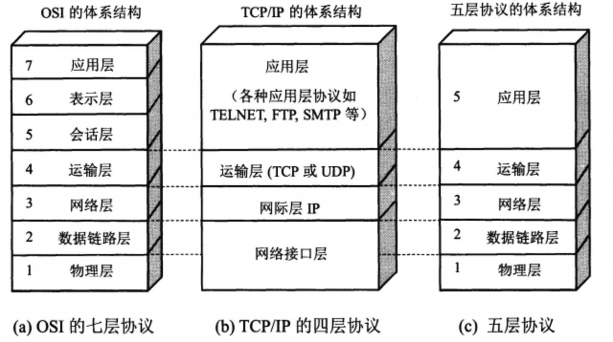
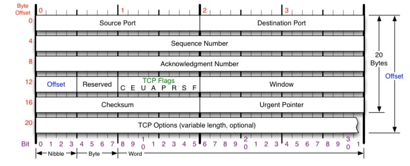
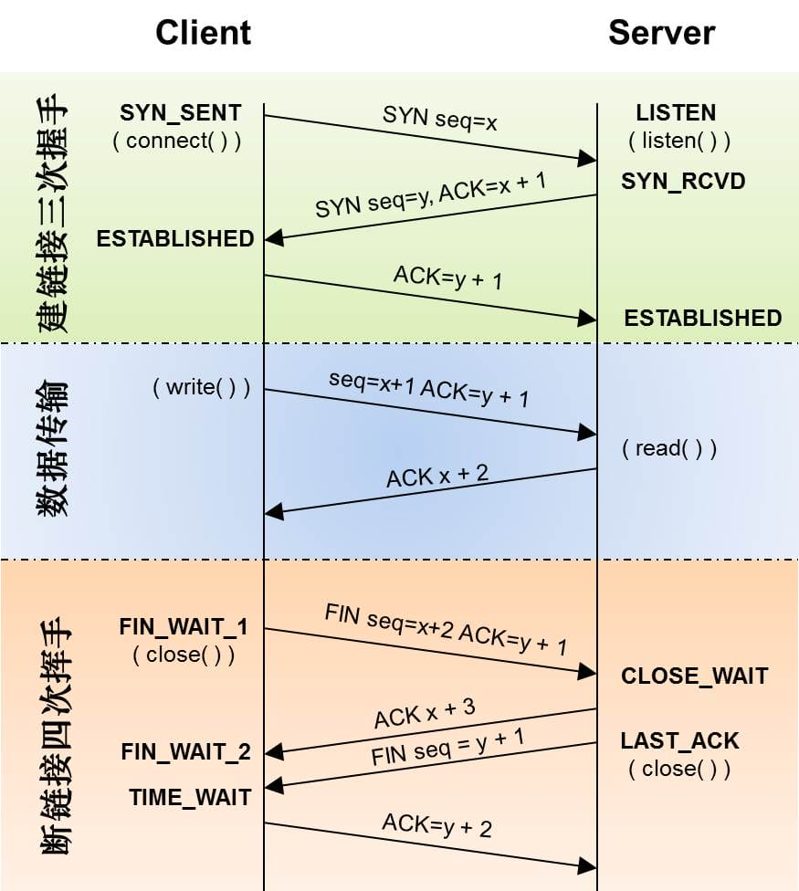
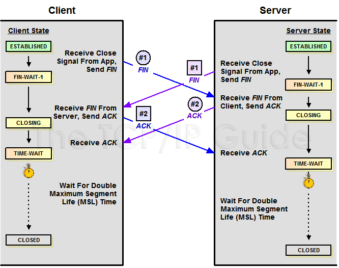
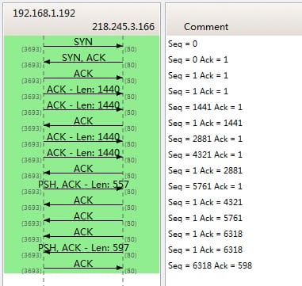
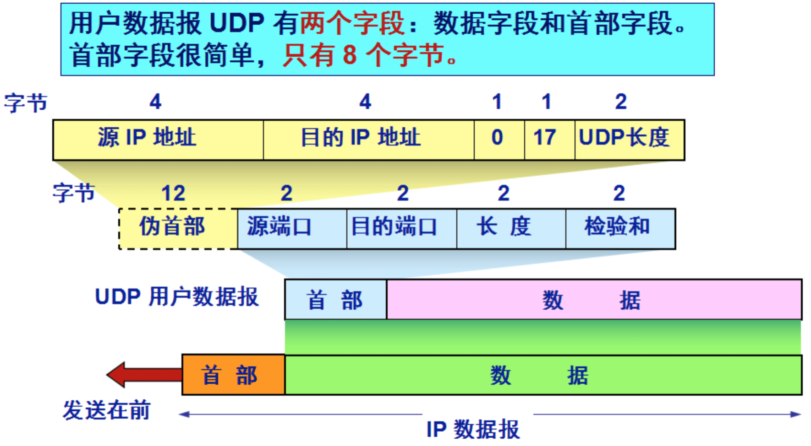
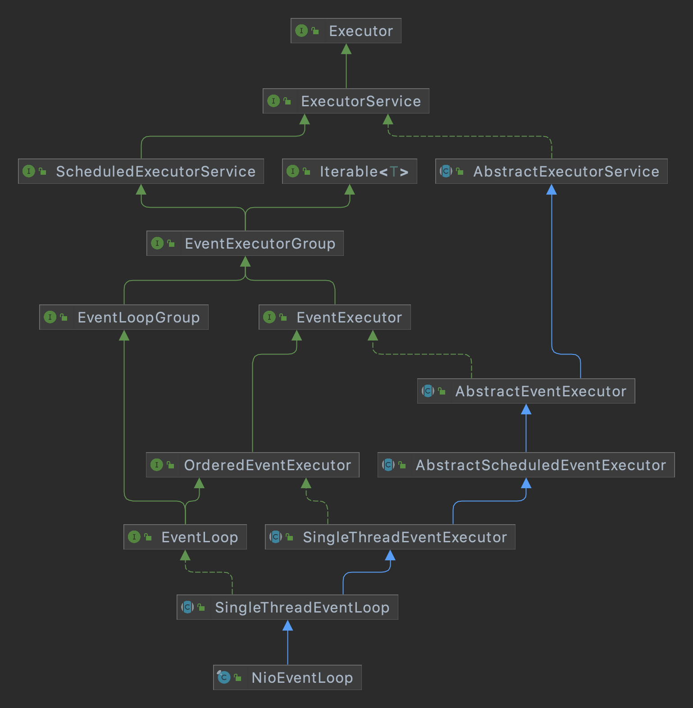
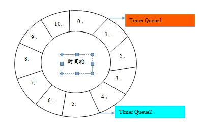

# Netty

## 网络基础



## TCP (Transmission Control Protocol)

### TCP 头格式



- TCP的包是没有IP地址的，那是IP层上的事。但是有源端口和目标端口。
- 一个TCP连接需要四个元组来表示是同一个连接（src_ip, src_port, dst_ip, dst_port）准确说是五元组，还有一个是协议。
- 但因为这里只是说TCP协议，所以，这里我只说四元组。
    - 注意上图中的四个非常重要的东西： Sequence Number是包的序号，用来解决网络包乱序（reordering）问题。
    - Acknowledgement Number就是ACK——用于确认收到，用来解决不丢包的问题。
    - Window又叫Advertised-Window，也就是著名的滑动窗口（Sliding Window），用于解决流控的。
    - TCP Flag ，也就是包的类型，主要是用于操控TCP的状态机的。

### TCP 状态机

其实，网络上的传输是没有连接的，包括TCP也是一样的。而TCP所谓的“连接”，其实只不过是在通讯的双方维护一个“连接状态”，让它看上去好像有连接一样。所以，TCP的状态变换是非常重要的。



为什么建链接要3次握手，断链接需要4次挥手？

对于建链接的3次握手，主要是确认双方都有收发能力，初始化 Sequence Number 的初始值。通信的双方要互相通知对方自己的初始化的Sequence Number（缩写为ISN：Inital Sequence Number）——所以叫SYN，全称Synchronize Sequence Numbers。也就上图中的 x 和 y。这个号要作为以后的数据通信的序号，以保证应用层接收到的数据不会因为网络上的传输的问题而乱序（TCP会用这个序号来拼接数据）。

对于4次挥手，其实你仔细看是2次，因为TCP是全双工的，所以，发送方和接收方都需要Fin和Ack。只不过，有一方是被动的，所以看上去就成了所谓的4次挥手。如果两边同时断连接，那就会就进入到CLOSING状态，然后到达TIME_WAIT状态。下图是双方同时断连接的示意图（你同样可以对照着TCP状态机看）：



### Sequence Number



Sequence Number 的增加是和传输的字节数相关的。上图中，三次握手后，来了两个Len:1440的包，而第二个包的SeqNum就成了1441。然后第一个ACK回的是1441，表示第一个1440收到了。

TCP 的序列号字段长度是 32 位无符号整数，因此，TCP 序列号的最大值为 2³² - 1。

当序列号增加到最大值后，如果继续增加，它会 回到 0 重新开始。
这种机制称为 序列号回绕（Sequence Number Wrap Around）。

```
当前序列号 = 4,294,967,290
发送 20 字节
→ 前 6 字节的序列号：4294967290 ~ 4294967295
→ 接下来继续回绕，从 0 ~ 13
```

也就是说，序列号是模 2³² 的循环计数器。

虽然序列号会回绕，但 TCP 通过以下机制保证不会把旧数据误认为新数据：

- 时间戳选项（TCP Timestamps Option）：用来区分不同连接或旧数据。
- 最大报文生存时间（MSL）：TCP 规定一个连接关闭后，等待 2×MSL（通常为 120 秒）才能完全释放，确保旧数据包都消失。
- 因此，即使序列号回到 0，也不会和旧连接中的数据冲突。


理论上，序列号空间大小：2³² ≈ 4 GB

如果传输速率是 1 Gbps（约 125 MB/s），则序列号回绕大约需要：`4 GB / 125 MB/s ≈ 32 秒`

因此在高速链路中，序列号回绕是可能的，这也是为什么现代 TCP 建议使用 RFC 1323（TCP Timestamps） 选项来避免歧义。

## UDP (User Datagram Protocol)

### UDP 头格式



- 源端口: 占16位、源端口号。在需要对方回信时选用。不需要时可用全0。
- 目的端口: 占16位、目的端口号。这在终点交付报文时必须使用。
- 长度: 占16位、UDP用户数据报的长度,其最小值是8(仅有首部)。
- 检验和: 占16位、检测UDP用户数据报在传输中是否有错。有错就丢弃。

请注意，虽然在 UDP 之间的通信要用到其端口号，但由于 UDP 的通信是无连接的，因此不需要使用套接字。

## 什么是Socket？Java中怎么用Socket

Socket（套接字）是计算机网络通信中非常核心的概念，用于实现不同主机之间进程间的通信。
可以简单理解为：Socket 是通信的“端点”，它为不同计算机上的程序之间建立连接、发送数据和接收数据提供了接口。

### Socket的基本概念

在网络编程中，通信的两端必须通过 IP地址 + 端口号 来唯一标识。
Socket 就是将这两者封装起来的对象，它使得我们可以像读写文件一样进行网络通信。

根据使用的协议类型，Socket主要分为两种：

- TCP Socket（流式套接字）——面向连接，可靠传输。
- UDP Socket（数据报套接字）——无连接，快速但不保证可靠性。

### Java中使用Socket（以TCP为例）

服务端：

```java
import java.io.*;
import java.net.*;

public class Server {
    public static void main(String[] args) throws IOException {
        // 创建ServerSocket对象，监听指定端口
        ServerSocket serverSocket = new ServerSocket(8888);
        System.out.println("服务器启动，等待客户端连接...");

        // 等待客户端连接（阻塞）
        Socket socket = serverSocket.accept();
        System.out.println("客户端已连接：" + socket.getInetAddress());

        // 获取输入输出流
        BufferedReader input = new BufferedReader(new InputStreamReader(socket.getInputStream()));
        PrintWriter output = new PrintWriter(socket.getOutputStream(), true);

        // 读取客户端消息
        String message = input.readLine();
        System.out.println("收到客户端消息：" + message);

        // 回复客户端
        output.println("服务器收到消息：" + message);

        // 关闭资源
        input.close();
        output.close();
        socket.close();
        serverSocket.close();
    }
}
```

客户端：

```java
import java.io.*;
import java.net.*;

public class Client {
    public static void main(String[] args) throws IOException {
        // 连接服务器（IP地址，端口号）
        Socket socket = new Socket("127.0.0.1", 8888);

        // 获取输入输出流
        BufferedReader input = new BufferedReader(new InputStreamReader(socket.getInputStream()));
        PrintWriter output = new PrintWriter(socket.getOutputStream(), true);

        // 发送消息到服务器
        output.println("你好，服务器！");

        // 接收服务器回复
        String response = input.readLine();
        System.out.println("服务器回复：" + response);

        // 关闭资源
        input.close();
        output.close();
        socket.close();
    }
}
```

### 使用 NIO 实现

服务端：

```java
import java.io.IOException;
import java.net.InetSocketAddress;
import java.nio.ByteBuffer;
import java.nio.channels.*;
import java.util.Iterator;

public class NioTcpServer {
    public static void main(String[] args) throws IOException {
        // 1. 打开 ServerSocketChannel
        ServerSocketChannel serverChannel = ServerSocketChannel.open();
        serverChannel.bind(new InetSocketAddress(9999));
        serverChannel.configureBlocking(false); // 设置非阻塞模式

        // 2. 打开 Selector
        Selector selector = Selector.open();

        // 3. 注册监听事件：接收连接事件
        serverChannel.register(selector, SelectionKey.OP_ACCEPT);
        System.out.println("NIO TCP 服务器已启动，监听端口 9999...");

        // 4. 主循环
        while (true) {
            // 等待事件就绪（阻塞，直到至少有一个事件）
            selector.select();

            // 5. 获取所有就绪事件
            Iterator<SelectionKey> it = selector.selectedKeys().iterator();
            while (it.hasNext()) {
                SelectionKey key = it.next();
                it.remove();

                // 6. 处理不同类型的事件
                if (key.isAcceptable()) {
                    // 接受新连接
                    ServerSocketChannel server = (ServerSocketChannel) key.channel();
                    SocketChannel client = server.accept();
                    client.configureBlocking(false);
                    System.out.println("客户端已连接: " + client.getRemoteAddress());

                    // 注册读事件
                    client.register(selector, SelectionKey.OP_READ);
                } else if (key.isReadable()) {
                    // 读取客户端消息
                    SocketChannel client = (SocketChannel) key.channel();
                    ByteBuffer buffer = ByteBuffer.allocate(1024);
                    int read = client.read(buffer);

                    if (read == -1) {
                        // 客户端关闭连接
                        System.out.println("客户端断开连接: " + client.getRemoteAddress());
                        client.close();
                        continue;
                    }

                    buffer.flip();
                    String msg = new String(buffer.array(), 0, buffer.limit());
                    System.out.println("收到客户端消息: " + msg);

                    // 回显消息
                    client.write(ByteBuffer.wrap(("服务端收到: " + msg).getBytes()));
                }
            }
        }
    }
}
```

客户端：

```java
import java.io.IOException;
import java.net.InetSocketAddress;
import java.nio.ByteBuffer;
import java.nio.channels.SocketChannel;
import java.util.Scanner;

public class NioTcpClient {
    public static void main(String[] args) throws IOException {
        // 1. 打开 SocketChannel
        SocketChannel socketChannel = SocketChannel.open();
        socketChannel.connect(new InetSocketAddress("localhost", 9999));
        socketChannel.configureBlocking(false);

        Scanner scanner = new Scanner(System.in);
        ByteBuffer buffer = ByteBuffer.allocate(1024);

        System.out.println("已连接到服务器，可以输入消息：");

        while (true) {
            System.out.print("> ");
            String msg = scanner.nextLine();
            if ("exit".equalsIgnoreCase(msg)) break;

            // 发送消息
            socketChannel.write(ByteBuffer.wrap(msg.getBytes()));

            // 读取响应
            buffer.clear();
            int read = socketChannel.read(buffer);
            if (read > 0) {
                buffer.flip();
                System.out.println("服务端响应: " + new String(buffer.array(), 0, buffer.limit()));
            }
        }

        socketChannel.close();
    }
}
```

## 介绍 Netty

Netty 是一个异步的、基于事件驱动的网络应用框架，用于快速开发高性能、高可靠性的网络 IO 程序。是目前最流行的 NIO 框架，适用于服务器通讯相关的多种应用场景

### 为什么不直接使用 NIO

- Java NIO API 学习成本高，使用麻烦，需要熟练掌握`Selector`、`ServerSocketChannel`、`SocketChannel`、`ByteBuffer`等。
- 要熟悉 Java 多线程编程，必须对多线程和网络编程非常熟悉，才能编写出高质量的 NIO 程序。
- 增加开发心智负担，例如：断连重连、网络掉包、半包读写、失败缓存、网络拥塞和异常流的处理等。
- Java 早期版本，会因为 Epoll Bug 导致 NIO Selector 空轮询，最终导致 CPU 100%。该问题直到 2013 年才被根本解决。

### 为什么使用 Netty

- 使用简单：Netty 对 NIO 的 API 进行了封装，使用更简单，解决了空轮询的问题。
- 功能强大：预置了多种编解码功能，支持多种主流协议。
- 设计优雅：基于灵活且可扩展的事件模型，可以清晰地分离关注点。
- 高性能：吞吐量更高，延迟更低，减少资源消耗，最小化不必要的内存复制。
- 社区活跃：版本迭代周期短，发现的 Bug 可以被及时修复。

## IO 模型

### BIO 同步阻塞

BIO（Blocking I/O）也叫 OIO（Old-blocking I/O），是同步阻塞的 IO。

### NIO 同步非阻塞

NIO（New I/O 或 Non-blocking I/O）最开始表示新的 IO，但是，该 API 已经出现足够长的时间，不再是“新的”了，因此，如今大多数的用户认为 NIO 代表非阻塞的 IO。

### AIO 异步非阻塞

AIO（Asynchronous I/O）是异步非阻塞 IO，AIO 引入异步通道的概念，采用了 Proactor 模式，简化了程序编写，有效的请求才启动线程，它的特点是先由操作系统完成后才通知服务端程序启动线程去处理，一般适用于连接数较多且连接时间较长的应用。

## Netty 核心组件

### Bootstrap 和 ServerBootstrap

Bootstrap 意思是引导，一个 Netty 应用通常由一个 Bootstrap 开始，主要作用是配置整个 Netty 程序，串联各个组件，Netty 中 Bootstrap 类是客户端程序的启动引导类，ServerBootstrap 是服务端启动引导类。

### EventLoopGroup 和 EventLoop

EventLoopGroup 是一组 EventLoop 的抽象，Netty 为了更好的利用多核 CPU 资源，一般会有多个 EventLoop 同时工作，每个 EventLoop 维护着一个 Selector 实例。

EventLoopGroup 提供 next() 方法，可以从组里面按照一定规则获取其中一个 EventLoop 来处理任务。在 Netty 服务器端编程中，我们一般都需要提供两个 EventLoopGroup，例如：BossEventLoopGroup 和 WorkerEventLoopGroup。

### Selector

Netty 基于 Selector 对象实现 I/O 多路复用，通过 Selector 一个线程可以监听多个连接的 Channel 事件。

当向一个 Selector 中注册 Channel 后，Selector 内部的机制就可以自动不断地查询这些注册的 Channel 是否有已就绪的 I/O 事件（例如可读，可写，网络连接完成等），这样程序就可以很简单地使用一个线程高效地管理多个 Channel。

### Channel

Netty 网络通信的组件，能够用于执行网络 I/O 操作。通过 Channel 可获得当前网络连接的通道状态和参数配置，
Channel 提供异步的网络 I/O 操作(如建立连接，读写，绑定端口)，异步调用意味着任何 I/O 调用都将立即返回，并且不保证在调用结束时所请求的 I/O 操作已完成。

### ChannelFuture

Netty 中所有的 IO 操作都是异步的，不能立刻得知消息是否被正确处理。但是可以过一会等它执行完成或者直接注册一个监听，具体的实现就是通过 Future 和 ChannelFutures，他们可以注册一个监听，当操作执行成功或失败时监听会自动触发注册的监听事件。

### ChannelPipeLine

ChannelPipeline 是一个 Handler 的集合，它负责处理和拦截 inbound 或者 outbound 的事件和操作，相当于一个贯穿 Netty 的链。(也可以这样理解：ChannelPipeline 是 保存 ChannelHandler 的 List，用于处理或拦截 Channel 的入站事件和出站操作)

ChannelPipeline 实现了一种高级形式的拦截过滤器模式，使用户可以完全控制事件的处理方式，以及 Channel 中各个的 ChannelHandler 如何相互交互。

### ChannelHandler

ChannelHandler 是一个接口，处理 I/O 事件或拦截 I/O 操作，并将其转发到其 ChannelPipeline(业务处理链)中的下一个处理程序。

ChannelHandler 本身并没有提供很多方法，因为这个接口有许多的方法需要实现，方便使用期间，可以继承它的子类。

### ChannelHandlerContext

保存 Channel 相关的所有上下文信息，同时关联一个 ChannelHandler 对象，同时 ChannelHandlerContext 中也绑定了对应的 pipeline 和 Channel 的信息，方便对 ChannelHandler 进行调用。

### Unpooled

Netty 提供一个专门用来操作缓冲区(即Netty的数据容器)的工具类，通过给定的数据和字符编码返回一个 ByteBuf 对象。（类似于 NIO 中的 ByteBuffer）

## Reactor 线程模型

Netty 是基于 Reactor 模式设计开发的。Reactor 模式基于事件驱动，采用多路复用将事件分发给相应的 Handler 处理，非常适合处理海量 I/O 的场景。

### Reactor 单线程模型

Reactor 单线程模型，指的是所有的 IO 操作都在同一个线程上面完成，线程的职责如下：

1. 作为服务端，接收客户端的 TCP 连接；
2. 作为客户端，向服务端发起 TCP 连接；
3. 读取通信对端的请求或者应答消息；
4. 向通信对端发送消息请求或者应答消息。


由于 Reactor 模式使用的是异步非阻塞 IO，所有的 IO 操作都不会导致阻塞，理论上一个线程可以独立处理所有 IO 相关的操作。从架构层面看，一个线程确实可以完成其承担的职责。
例如，通过 Acceptor 类接收客户端的 TCP 连接请求消息，链路建立成功之后，通过 Dispatch 将对应的 ByteBuffer 派发到指定的 Handler 上进行消息解码。用户线程可以通过消息编码通过线程将消息发送给客户端。

对于一些小容量应用场景，可以使用单线程模型。但是对于高负载、大并发的应用场景却不合适，主要原因如下：

1. 一个线程同时处理成百上千的链路，性能上无法支撑，即便线程的 CPU 负荷达到 100%，也无法满足海量消息的编码、解码、读取和发送。
2. 当线程负载过重之后，处理速度将变慢，这会导致大量客户端连接超时，超时之后往往会进行重发，这更加重了线程的负载，最终会导致大量消息积压和处理超时，成为系统的性能瓶颈。
3. 可靠性问题：一旦线程意外跑飞，或者进入死循环，会导致整个系统通信模块不可用，不能接收和处理外部消息，造成节点故障。

为了解决这些问题，演进出了 Reactor 多线程模型，下面我们一起学习下 Reactor 多线程模型。

### Reactor 多线程模型

Rector 多线程模型与单线程模型最大的区别就是有一组线程处理 IO 操作。


Reactor 多线程模型的特点：

1. 有专门一个 Acceptor 线程用于监听服务端，接收客户端的 TCP 连接请求。
2. 网络 IO 操作（读、写等）由一个线程池负责，线程池可以采用标准的 JDK 线程池实现，它包含一个任务队列和 N 个可用的线程，由这些线程负责消息的读取、解码、编码和发送。
3. 一个线程可以同时处理 N 条链路，但是一个链路只对应一个线程，防止发生并发操作问题。

在绝大多数场景下，Reactor 多线程模型都可以满足性能需求；但是，在极个别特殊场景中，一个线程负责监听和处理所有的客户端连接可能会存在性能问题。
例如，并发百万客户端连接，或者服务端需要对客户端握手进行安全认证，但是认证本身非常损耗性能。在这类场景下，单独一个 Acceptor 线程可能会存在性能不足问题，为了解决性能问题，出现了主从 Reactor 多线程模型。

### 主从 Reactor 多线程模型

主从 Reactor 线程模型的特点是：服务端用于接收客户端连接的不再是一个单独的线程，而是一个独立的线程池。
Acceptor 接收到客户端 TCP 连接请求处理完成后（可能包含接入认证等），将新创建的 SocketChannel 注册到 IO 线程池（sub reactor 线程池）的某个 IO 线程上，由它负责 SocketChannel 的读写和编解码工作。
Acceptor 线程池仅仅只用于客户端的认证、握手和安全认证，一旦链路建立成功，就将链路注册到 IO 线程池（sub reactor 线程池）的 IO 线程上，由 IO 线程负责后续的 IO 操作。


它的工作流程如下：

1. 从主线程池中随机选择一个 Reactor 线程作为 Acceptor 线程，用于绑定监听端口，接收客户端连接。
2. Acceptor 线程接收客户端连接请求之后创建新的 SocketChannel，将其注册到主线程池的其它 Reactor 线程上，由其负责接入认证、黑白名单过滤、握手等操作。
3. 业务层的链路正式建立之后，将 SocketChannel 从主线程池的 Reactor 线程的多路复用器上摘除，重新注册到 IO 线程池（sub reactor 线程池）的线程上，用于处理 I/O 的读写操作。

## Netty 工作流程

### 第一步：编写一个 Netty 应用

从用户线程发起创建服务端操作，代码如下：

```java
public void run(int port) throws InterruptedException {
    EventLoopGroup bossGroup = new NioEventLoopGroup(1);
    EventLoopGroup workerGroup = new NioEventLoopGroup();
    try {
        ServerBootstrap bootstrap = new ServerBootstrap()
                .group(bossGroup, workerGroup)
                .channel(NioServerSocketChannel.class)
                .childHandler(new ChannelInitializer<SocketChannel>() {
                    @Override
                    protected void initChannel(SocketChannel ch) throws Exception {
                        ch.pipeline().addLast(new EchoServerHandler());
                    }
                });
        ChannelFuture future = bootstrap.bind(port).sync();
        future.channel().closeFuture().sync();
    } finally {
        bossGroup.shutdownGracefully().sync();
        workerGroup.shutdownGracefully().sync();
    }
}
```

在创建服务端的时候实例化了 2 个`EventLoopGroup`，实际为一个`EventLoop`线程组，负责管理`EventLoop`的申请和释放。
`EventLoopGroup`管理的线程数可以通过构造函数设置，如果没有设置，默认取`-Dio.netty.eventLoopThreads`，如果该系统参数也没有指定，则为可用的 CPU 内核数 × 2。

- `bossGroup`：即 Acceptor 线程池，负责处理客户端的 TCP 连接请求。如果系统只有一个服务端端口需要监听，建议`bossGroup`线程组线程数设置为 1（即便设置成复数，也不会创建或使用多个线程，除非监听多个端口）。
- `workerGroup`：是真正负责 I/O 读写操作的线程组，通过`ServerBootstrap`的`group()`方法进行设置，用于后续的`Channel`绑定。

### 第二步：启动服务端

调用`ServerBootstrap`的`bind()`方法绑定端口，启动服务端，相关代码如下：

```java
ChannelFuture future = bootstrap.bind(port).sync();
```

进入`bind()`方法，首先会调用`initAndRegister()`方法，初始化`Channel`对象，并将其注册到`bossGroup`的其中一个`EventLoop`。

[AbstractBootstrap#doBind](https://github.com/netty/netty/blob/4.1/transport/src/main/java/io/netty/bootstrap/AbstractBootstrap.java#L271)

```java
private ChannelFuture doBind(final SocketAddress localAddress) {
    final ChannelFuture regFuture = initAndRegister();
    final Channel channel = regFuture.channel();
    if (regFuture.cause() != null) {
        return regFuture;
    }

    if (regFuture.isDone()) {
        // At this point we know that the registration was complete and successful.
        ChannelPromise promise = channel.newPromise();
        doBind0(regFuture, channel, localAddress, promise);
        return promise;
    } else {
        // Registration future is almost always fulfilled already, but just in case it's not.
        final PendingRegistrationPromise promise = new PendingRegistrationPromise(channel);
        regFuture.addListener(new ChannelFutureListener() {
            @Override
            public void operationComplete(ChannelFuture future) throws Exception {
                Throwable cause = future.cause();
                if (cause != null) {
                    // Registration on the EventLoop failed so fail the ChannelPromise directly to not cause an
                    // IllegalStateException once we try to access the EventLoop of the Channel.
                    promise.setFailure(cause);
                } else {
                    // Registration was successful, so set the correct executor to use.
                    // See https://github.com/netty/netty/issues/2586
                    promise.registered();

                    doBind0(regFuture, channel, localAddress, promise);
                }
            }
        });
        return promise;
    }
}
```

首先，创建了一个`Channel`对象，然后，从`bossGroup`中选择一个`EventLoop`（即 Acceptor 线程），将`Channel`注册到`EventLoop`的多路复用器`Selector`上，用于接收客户端的 TCP 连接。
其中，`group()`方法返回的就是`bossGroup`，它的`next()`方法用于从线程组中获取可用线程。

[AbstractBootstrap#initAndRegister](https://github.com/netty/netty/blob/4.1/transport/src/main/java/io/netty/bootstrap/AbstractBootstrap.java#L307)

```java
final ChannelFuture initAndRegister() {
    Channel channel = null;
    try {
        channel = channelFactory.newChannel();
        init(channel);
    } catch (Throwable t) {
        if (channel != null) {
            // channel can be null if newChannel crashed (eg SocketException("too many open files"))
            channel.unsafe().closeForcibly();
            // as the Channel is not registered yet we need to force the usage of the GlobalEventExecutor
            return new DefaultChannelPromise(channel, GlobalEventExecutor.INSTANCE).setFailure(t);
        }
        // as the Channel is not registered yet we need to force the usage of the GlobalEventExecutor
        return new DefaultChannelPromise(new FailedChannel(), GlobalEventExecutor.INSTANCE).setFailure(t);
    }

    ChannelFuture regFuture = config().group().register(channel);
    if (regFuture.cause() != null) {
        if (channel.isRegistered()) {
            channel.close();
        } else {
            channel.unsafe().closeForcibly();
        }
    }
    return regFuture;
}
```

[MultithreadEventLoopGroup#register](https://github.com/netty/netty/blob/4.1/transport/src/main/java/io/netty/channel/MultithreadEventLoopGroup.java#L85)

```java
@Override
public ChannelFuture register(Channel channel) {
    return next().register(channel);
}
```

[GenericEventExecutorChooser#next](https://github.com/netty/netty/blob/4.1/common/src/main/java/io/netty/util/concurrent/DefaultEventExecutorChooserFactory.java#L72)

```java
public EventExecutor next() {
    return this.executors[(int)Math.abs(this.idx.getAndIncrement() % (long)this.executors.length)];
}
```

### 第三步：监听客户端连接

`NioEventLoop`的`run()`方法无限循环调用`select()`方法监听客户端连接事件：

```java
protected void run() {
    int selectCnt = 0;
    for (;;) {
        try {
            int strategy;
            try {
                strategy = selectStrategy.calculateStrategy(selectNowSupplier, hasTasks());
                switch (strategy) {
                case SelectStrategy.CONTINUE:
                    continue;

                case SelectStrategy.BUSY_WAIT:
                    // fall-through to SELECT since the busy-wait is not supported with NIO

                case SelectStrategy.SELECT:
                    long curDeadlineNanos = nextScheduledTaskDeadlineNanos();
                    if (curDeadlineNanos == -1L) {
                        curDeadlineNanos = NONE; // nothing on the calendar
                    }
                    nextWakeupNanos.set(curDeadlineNanos);
                    try {
                        if (!hasTasks()) {
                            strategy = select(curDeadlineNanos);
                        }
                    } finally {
                        // This update is just to help block unnecessary selector wakeups
                        // so use of lazySet is ok (no race condition)
                        nextWakeupNanos.lazySet(AWAKE);
                    }
                    // fall through
                default:
                }
            } catch (IOException e) {
                // If we receive an IOException here its because the Selector is messed up. Let's rebuild
                // the selector and retry. https://github.com/netty/netty/issues/8566
                rebuildSelector0();
                selectCnt = 0;
                handleLoopException(e);
                continue;
            }

            selectCnt++;
            cancelledKeys = 0;
            needsToSelectAgain = false;
            final int ioRatio = this.ioRatio;
            boolean ranTasks;
            if (ioRatio == 100) {
                try {
                    if (strategy > 0) {
                        processSelectedKeys();
                    }
                } finally {
                    // Ensure we always run tasks.
                    ranTasks = runAllTasks();
                }
            } else if (strategy > 0) {
                final long ioStartTime = System.nanoTime();
                try {
                    processSelectedKeys();
                } finally {
                    // Ensure we always run tasks.
                    final long ioTime = System.nanoTime() - ioStartTime;
                    ranTasks = runAllTasks(ioTime * (100 - ioRatio) / ioRatio);
                }
            } else {
                ranTasks = runAllTasks(0); // This will run the minimum number of tasks
            }

            if (ranTasks || strategy > 0) {
                if (selectCnt > MIN_PREMATURE_SELECTOR_RETURNS && logger.isDebugEnabled()) {
                    logger.debug("Selector.select() returned prematurely {} times in a row for Selector {}.",
                            selectCnt - 1, selector);
                }
                selectCnt = 0;
            } else if (unexpectedSelectorWakeup(selectCnt)) { // Unexpected wakeup (unusual case)
                selectCnt = 0;
            }
        } catch (CancelledKeyException e) {
            // Harmless exception - log anyway
            if (logger.isDebugEnabled()) {
                logger.debug(CancelledKeyException.class.getSimpleName() + " raised by a Selector {} - JDK bug?",
                        selector, e);
            }
        } catch (Error e) {
            throw e;
        } catch (Throwable t) {
            handleLoopException(t);
        } finally {
            // Always handle shutdown even if the loop processing threw an exception.
            try {
                if (isShuttingDown()) {
                    closeAll();
                    if (confirmShutdown()) {
                        return;
                    }
                }
            } catch (Error e) {
                throw e;
            } catch (Throwable t) {
                handleLoopException(t);
            }
        }
    }
}
```

调用`unsafe`的`read()`方法，对于`NioServerSocketChannel`，它调用了`NioMessageUnsafe`的`read()`方法，代码如下：

```java
private void processSelectedKey(SelectionKey k, AbstractNioChannel ch) {
    final AbstractNioChannel.NioUnsafe unsafe = ch.unsafe();
    if (!k.isValid()) {
        final EventLoop eventLoop;
        try {
            eventLoop = ch.eventLoop();
        } catch (Throwable ignored) {
            // If the channel implementation throws an exception because there is no event loop, we ignore this
            // because we are only trying to determine if ch is registered to this event loop and thus has authority
            // to close ch.
            return;
        }
        // Only close ch if ch is still registered to this EventLoop. ch could have deregistered from the event loop
        // and thus the SelectionKey could be cancelled as part of the deregistration process, but the channel is
        // still healthy and should not be closed.
        // See https://github.com/netty/netty/issues/5125
        if (eventLoop == this) {
            // close the channel if the key is not valid anymore
            unsafe.close(unsafe.voidPromise());
        }
        return;
    }

    try {
        int readyOps = k.readyOps();
        // We first need to call finishConnect() before try to trigger a read(...) or write(...) as otherwise
        // the NIO JDK channel implementation may throw a NotYetConnectedException.
        if ((readyOps & SelectionKey.OP_CONNECT) != 0) {
            // remove OP_CONNECT as otherwise Selector.select(..) will always return without blocking
            // See https://github.com/netty/netty/issues/924
            int ops = k.interestOps();
            ops &= ~SelectionKey.OP_CONNECT;
            k.interestOps(ops);

            unsafe.finishConnect();
        }

        // Process OP_WRITE first as we may be able to write some queued buffers and so free memory.
        if ((readyOps & SelectionKey.OP_WRITE) != 0) {
            // Call forceFlush which will also take care of clear the OP_WRITE once there is nothing left to write
            ch.unsafe().forceFlush();
        }

        // Also check for readOps of 0 to workaround possible JDK bug which may otherwise lead
        // to a spin loop
        if ((readyOps & (SelectionKey.OP_READ | SelectionKey.OP_ACCEPT)) != 0 || readyOps == 0) {
            unsafe.read();
        }
    } catch (CancelledKeyException ignored) {
        unsafe.close(unsafe.voidPromise());
    }
}
```

```java
@Override
public void read() {
    assert eventLoop().inEventLoop();
    final ChannelConfig config = config();
    final ChannelPipeline pipeline = pipeline();
    final RecvByteBufAllocator.Handle allocHandle = unsafe().recvBufAllocHandle();
    allocHandle.reset(config);

    boolean closed = false;
    Throwable exception = null;
    try {
        try {
            do {
                int localRead = doReadMessages(readBuf);
                if (localRead == 0) {
                    break;
                }
                if (localRead < 0) {
                    closed = true;
                    break;
                }

                allocHandle.incMessagesRead(localRead);
            } while (continueReading(allocHandle));
        } catch (Throwable t) {
            exception = t;
        }

        int size = readBuf.size();
        for (int i = 0; i < size; i ++) {
            readPending = false;
            pipeline.fireChannelRead(readBuf.get(i));
        }
        readBuf.clear();
        allocHandle.readComplete();
        pipeline.fireChannelReadComplete();

        if (exception != null) {
            closed = closeOnReadError(exception);

            pipeline.fireExceptionCaught(exception);
        }

        if (closed) {
            inputShutdown = true;
            if (isOpen()) {
                close(voidPromise());
            }
        }
    } finally {
        // Check if there is a readPending which was not processed yet.
        // This could be for two reasons:
        // * The user called Channel.read() or ChannelHandlerContext.read() in channelRead(...) method
        // * The user called Channel.read() or ChannelHandlerContext.read() in channelReadComplete(...) method
        //
        // See https://github.com/netty/netty/issues/2254
        if (!readPending && !config.isAutoRead()) {
            removeReadOp();
        }
    }
}
```

最终它会调用`NioServerSocketChannel`的`doReadMessages`方法创建一个`NioSocketChannel`对象，代码如下：

```java
@Override
protected int doReadMessages(List<Object> buf) throws Exception {
    SocketChannel ch = SocketUtils.accept(javaChannel());

    try {
        if (ch != null) {
            buf.add(new NioSocketChannel(this, ch));
            return 1;
        }
    } catch (Throwable t) {
        logger.warn("Failed to create a new channel from an accepted socket.", t);

        try {
            ch.close();
        } catch (Throwable t2) {
            logger.warn("Failed to close a socket.", t2);
        }
    }

    return 0;
}
```

从`workerGroup`中选择一个 I/O 线程负责网络消息的读写，并将它注册到多路复用器上，监听 READ 操作，代码中`childGroup`即为`workerGroup`。

```java
@Override
public void channelRead(ChannelHandlerContext ctx, Object msg) {
    final Channel child = (Channel) msg;

    child.pipeline().addLast(childHandler);

    setChannelOptions(child, childOptions, logger);
    setAttributes(child, childAttrs);

    try {
        childGroup.register(child).addListener(new ChannelFutureListener() {
            @Override
            public void operationComplete(ChannelFuture future) throws Exception {
                if (!future.isSuccess()) {
                    forceClose(child, future.cause());
                }
            }
        });
    } catch (Throwable t) {
        forceClose(child, t);
    }
}
```

## NioEventLoop

### NioEventLoop 介绍

NioEventLoop 是 Netty 的 Reactor 线程，它的职责如下：

- 作为服务端 Acceptor 线程，负责处理客户端的请求接入。
- 作为客户端 Connector 线程，负责注册监听连接操作位，用于判断异步连接结果。
- 作为 IO 线程，监听网络读操作位，负责从 SocketChannel 中读取报文。
- 作为 IO 线程，负责向 SocketChannel 写入报文发送给对方，如果发生写半包，会自动注册监听写事件，用于后续继续发送半包数据，直到数据全部发送完成。
- 作为定时任务线程，可以执行定时任务，例如：链路空闲检测和发送心跳消息等。
- 作为线程执行器可以执行普通的任务线程（Runnable）。

NioEventLoop 继承 SingleThreadEventExecutor 类，这就意味着它实际上是一个线程个数为 1 的线程池，继承关系如下所示：



### NioEventLoop 设计原理

#### 串行化设计避免线程竞争

我们知道当系统在运行过程中，如果频繁的进行线程上下文切换，会带来额外的性能损耗。多线程并发执行某个业务流程，业务开发者还需要时刻对线程安全保持警惕，哪些数据可能会被并发修改，如何保护？这不仅降低了开发效率，也会带来额外的性能损耗。

为了解决上述问题，Netty 采用了串行化设计理念，从消息的读取、编码以及后续 Handler 的执行，始终都由 IO 线程 NioEventLoop 负责，这就意外着整个流程不会进行线程上下文的切换，数据也不会面临被并发修改的风险，对于用户而言，甚至不需要了解 Netty 的线程细节，这确实是个非常好的设计理念，它的工作原理图如下：


一个 NioEventLoop 聚合了一个多路复用器 Selector，因此可以处理成百上千的客户端连接，Netty 的处理策略是每当有一个新的客户端接入，则从 NioEventLoop 线程组中顺序获取一个可用的 NioEventLoop，当到达数组上限之后，重新返回到 0，通过这种方式，可以基本保证各个 NioEventLoop 的负载均衡。一个客户端连接只注册到一个 NioEventLoop 上，这样就避免了多个 IO 线程去并发操作它。

Netty 通过串行化设计理念降低了用户的开发难度，提升了处理性能。利用线程组实现了多个串行化线程水平并行执行，线程之间并没有交集，这样既可以充分利用多核提升并行处理能力，同时避免了线程上下文的切换和并发保护带来的额外性能损耗。

#### 定时任务与时间轮算法

在 Netty 中，有很多功能依赖定时任务，比较典型的有：客户端连接超时控制、链路空闲检测。

一种比较常用的设计理念是在 NioEventLoop 中聚合 JDK 的定时任务线程池 ScheduledExecutorService，通过它来执行定时任务。这样做单纯从性能角度看不是最优，原因有如下三点：

1. 在 IO 线程中聚合了一个独立的定时任务线程池，这样在处理过程中会存在线程上下文切换问题，这就打破了 Netty 的串行化设计理念。
2. 存在多线程并发操作问题，因为定时任务 Task 和 IO 线程 NioEventLoop 可能同时访问并修改同一份数据。
3. JDK 的 ScheduledExecutorService 从性能角度看，存在性能优化空间。

最早面临上述问题的是操作系统和协议栈，例如 TCP 协议栈，其可靠传输依赖超时重传机制，因此每个通过 TCP 传输的 packet 都需要一个 timer 来调度 timeout 事件。这类超时可能是海量的，如果为每个超时都创建一个定时器，从性能和资源消耗角度看都是不合理的。

根据 George Varghese 和 Tony Lauck 1996 年的论文《Hashed and Hierarchical Timing Wheels: data structures to efficiently implement a timer facility》提出了一种定时轮的方式来管理和维护大量的 timer 调度。Netty 的定时任务调度就是基于时间轮算法调度。

定时轮是一种数据结构，其主体是一个循环列表，每个列表中包含一个称之为 slot 的结构，它的原理图如下：



定时轮的工作原理可以类比于时钟，如上图箭头（指针）按某一个方向按固定频率轮动，每一次跳动称为一个 tick。这样可以看出定时轮由个 3 个重要的属性参数：ticksPerWheel（一轮的 tick 数），tickDuration（一个 tick 的持续时间）以及 timeUnit（时间单位），例如当 ticksPerWheel=60，tickDuration=1，timeUnit=second，这就和时钟的秒针走动完全类似了。

#### 聚焦而不是膨胀

Netty 是个异步高性能的 NIO 框架，它并不是个业务运行容器，因此它不需要也不应该提供业务容器和业务线程。合理的设计模式是 Netty 只负责提供和管理 NIO 线程，其它的业务层线程模型由用户自己集成，Netty 不应该提供此类功能，只要将分层划分清楚，就会更有利于用户集成和扩展。

令人遗憾的是在 Netty 3 系列版本中，Netty 提供了类似 Mina 异步 Filter 的 ExecutionHandler，它聚合了 JDK 的线程池 java.util.concurrent.Executor，用户异步执行后续的 Handler。
ExecutionHandler 是为了解决部分用户 Handler 可能存在执行时间不确定而导致 IO 线程被意外阻塞或者挂住，从需求合理性角度分析这类需求本身是合理的，但是 Netty 提供该功能却并不合适。原因总结如下：

1. 没有遵循 Netty 串行化设计理念，在消息的接收和处理过程中发生了线程切换并引入新的线程池，打破了自身架构坚守的设计原则，实际是一种架构妥协。
2. 潜在的线程并发安全问题，如果异步 Handler 也操作它前面的用户 Handler，而用户 Handler 又没有进行线程安全保护，这就会导致隐蔽和致命的线程安全问题。
3. 用户开发的复杂性，引入 ExecutionHandler，打破了原来的 ChannelPipeline 串行执行模式，用户需要理解 Netty 底层的实现细节，关心线程安全等问题，这会导致得不偿失。

鉴于上述原因，Netty 的后续版本彻底删除了 ExecutionHandler，而且也没有提供类似的相关功能类，把精力聚焦在 Netty 的 IO 线程 NioEventLoop 上，这无疑是一种巨大的进步，Netty 重新开始聚焦在 IO 线程本身，而不是提供用户相关的业务线程模型。

## Netty 线程开发最佳实践

### 时间可控的简单业务直接在 IO 线程上处理

如果业务非常简单，执行时间非常短，不需要与外部网元交互、访问数据库和磁盘，不需要等待其它资源，则建议直接在业务 ChannelHandler 中执行，不需要再启业务的线程或者线程池。避免线程上下文切换，也不存在线程并发问题。

### 复杂和时间不可控业务建议投递到业务线程池统一处理

对于此类业务，不建议直接在业务 ChannelHandler 中启动线程或者线程池处理，建议将不同的业务统一封装成 Task，统一投递到业务线程池中进行处理。

过多的业务 ChannelHandler 会带来开发效率和可维护性问题，不要把 Netty 当作业务容器，对于大多数复杂的业务产品，仍然需要集成或者开发自己的业务容器，做好和 Netty 的架构分层。

### 业务线程避免直接操作 ChannelHandler

对于 ChannelHandler，IO 线程和业务线程都可能会操作，因为业务通常是多线程模型，这样就会存在多线程操作 ChannelHandler。
为了尽量避免多线程并发问题，建议按照 Netty 自身的做法，通过将操作封装成独立的 Task 由 NioEventLoop 统一执行，而不是业务线程直接操作，相关代码如下所示：

```java
if (ctx.executor().inEventLoop()) {
    doSomething(ctx);
} else {
    ctx.executor().execute(() -> doSomething(ctx));
}
```

如果确认并发访问的数据或者并发操作是安全的，则无需多此一举，这个需要根据具体的业务场景进行判断，灵活处理。

## JDK NIO Bug

### 发生原因

Linux 系统默认使用 epoll 作为 IO 多路复用器，JDK NIO 在 Linux 下默认也是 epoll，但其实现却存在漏洞。

当对一个 TCP 连接进行“粗暴”的关闭时（例如，进程被杀掉、机器断电、网络断开，而不是正常的四次挥手），可能会触发一个内核状态。
在这种状态下，epoll 会认为该通道一直处于“就绪”状态，特别是对于写操作（EPOLLOUT）或者错误事件（EPOLLERR，EPOLLHUP）。
且 JDK 没有处理这种情况，从 java.nio.channels.SelectionKey 中可以发现没定义有异常事件的类型。


```java
public abstract class SelectionKey {
    public static final int OP_READ = 1 << 0;
    public static final int OP_WRITE = 1 << 2;
    public static final int OP_CONNECT = 1 << 3;
    public static final int OP_ACCEPT = 1 << 4;
}
```

### Netty 如何解决/规避

1. 调用 select 方法，并设置超时时间，同时记录轮询次数（selectCnt++）
2. 计算 select 方法的操作时间，如果阻塞时间大于等于超时时间，则说明 select 方法正常执行，重置轮询次数；如果阻塞时间小于超时时间，则需要进一步判断轮询次数是否超过了设定的阈值（默认为512），如果超过了说明可能出现了 Bug，需要重建 Selector。
3. 调用 rebuildSelector() 方法重新打开一个 newSelector，然后将 oldSelector 的所有 key 注册到 newSelector，最后替换 oldSelector 即可。


```java
private boolean unexpectedSelectorWakeup(int selectCnt) {
    if (Thread.interrupted()) {
        if (logger.isDebugEnabled()) {
            logger.debug("Selector.select() returned prematurely because Thread.currentThread().interrupt() was called. Use NioEventLoop.shutdownGracefully() to shutdown the NioEventLoop.");
        }

        return true;
    } else if (SELECTOR_AUTO_REBUILD_THRESHOLD > 0 && selectCnt >= SELECTOR_AUTO_REBUILD_THRESHOLD) {
        logger.warn("Selector.select() returned prematurely {} times in a row; rebuilding Selector {}.", selectCnt, this.selector);
        this.rebuildSelector();
        return true;
    } else {
        return false;
    }
}
```

_在新版本的 Netty 中，则是通过判断是否执行了任务，或 select 方法返回的值是否大于 0，取代了旧版本中通过阻塞时间判断，本质上原理是一样的。_

## NIO 提供了 selector 的 epoll 实现，为什么 Netty 还要实现自己的 epoll 版本呢？

Netty 的 epoll transport 使用了边缘触发，而 Java 的 NIO 库使用了水平触发。而且 Netty 的 epoll transport 支持了 NIO 没有支持的配置选项，例如`TCP_CORK`、`SO_REUSEPORT`等等。

> Netty's epoll transport uses epoll edge-triggered while java's nio library uses level-triggered. Beside this the epoll transport expose configuration options that are not present with java's nio like TCP_CORK, SO_REUSEPORT and more.
> https://stackoverflow.com/questions/23465401/why-native-epoll-support-is-introduced-in-netty

### epoll 的两种触发模式

| 模式       | 英文                   | 特点                            |
|----------|----------------------|-------------------------------|
| **水平触发** | LT (Level Triggered) | 默认模式，**只要缓冲区未读完/未写完就会反复触发事件** |
| **边缘触发** | ET (Edge Triggered)  | 更高效，**只有状态从无到有发生变化时才触发一次**    |

### 文件描述符

在 epoll 中，每个文件描述符（fd）通常表示一个 I/O 资源，比如套接字、管道、终端、文件等。
当内核检测到某个 fd 上的操作**可以立即完成而不会阻塞**时，就认为它“就绪”（ready）了。

常见的几种就绪类型：

- EPOLLIN：读就绪。意味着读取操作（read()、recv()）不会阻塞。
- EPOLLOUT：写就绪。意味着写入操作（write()、send()）不会阻塞。
- EPOLLERR：发生错误。
- EPOLLHUP：对端关闭。

例如：

- 如果一个 socket 的接收缓冲区中有数据可读 → 它对 EPOLLIN 是就绪的；
- 如果发送缓冲区有空间可以写 → 它对 EPOLLOUT 是就绪的。

关键点：“就绪”并不意味着“必须处理”，而是“处理它不会阻塞”。

### 水平触发（LT）—— 默认模式、最容易用

只要文件描述符处于“就绪”状态，每次 epoll_wait 都会返回事件

例如：socket 中还有未读数据，只要你没读完，就会一直触发 EPOLLIN

和 select/poll 行为类似，但效率更高（O(1)）

示例：EPOLLIN

如果 socket 可读，应用程序只读了一部分数据
➡️ 下一次 epoll_wait() 仍然会继续返回这个可读事件。

优点：

- ✅ 编程简单
- ✅ 容错好，不容易丢事件
- ✅ 不要求非阻塞 I/O（但推荐配合非阻塞）

缺点：

- ❌ 每次都触发事件，系统调用次数较多
- ❌ 在高并发下效率不如 ET

### 边缘触发（ET）—— 高性能、复杂模式

只有状态发生“变化”时才触发事件

可读事件例子：

socket 缓冲区从空 → 非空 ✅ 会触发一次

你没有把数据读完 😱 也不会再次触发，需要你循环读完！

ET 模式必须使用非阻塞 I/O（non-blocking）
否则你的 read/write 可能阻塞死整个线程。

优点：

- ✅ 极高效率，事件通知次数少
- ✅ 适合高并发场景（如 Nginx、Redis）

缺点：

- ❌ 编程复杂
- ❌ 容易漏事件，如果不把数据读完就可能再也收不到通知
- ❌ 必须非阻塞 I/O

## Netty 基础与架构原理

### 请解释 Netty 的整体架构，包括 Reactor 模型、EventLoop、Channel、Pipeline 的关系。

#### 1. Netty 的整体架构概览

Netty 是基于 Reactor 异步事件驱动模型 的高性能网络通信框架。其核心目标是：

- 高吞吐、低延迟
- 避免线程上下文切换
- 高扩展性与强健的 backpressure 机制
- 统一抽象不同传输层（NIO、EPOLL、KQueue）

Netty 的核心抽象主要包括：

- Reactor 模型（多线程事件驱动）
- EventLoop / EventLoopGroup（事件循环与线程模型）
- Channel（连接的抽象）
- ChannelPipeline + ChannelHandler（责任链模式）
- ByteBuf（高性能缓冲区）

#### 2. Reactor 模型：Netty 的事件驱动体系

Netty 采用 主从多 Reactor 模型（Master–Slave Reactor），通常体现为两个事件循环组：

- Boss EventLoopGroup —— 接受连接
- Worker EventLoopGroup —— 处理 I/O（读写）

流程如下：

1. Boss Reactor（Acceptor）
    - 监听 ServerSocketChannel 的 accept 事件
    - 每当有新连接，创建一个对应的 Channel
    - 将 Channel 注册到某个 Worker EventLoop 上
2. Worker Reactor
    - 负责每个连接的读、写事件
    - 事件触发后执行用户自定义的 handler 逻辑（通过 Pipeline）

   整个模型可视化：
    ```
             ┌────────────────┐
             │ Boss Group     │
             │ (Acceptor)     │
             └──────┬─────────┘
                    │ accept()
                    ▼
             ┌────────────────┐
             │ Worker Group   │
             │ (I/O, handlers)│
             └──────┬─────────┘
          read/     │      write/
        pipeline    │    pipeline
    ```

   特点：
    - Reactor 负责分发事件，但不做业务逻辑
    - 每个 Channel 绑定到一个 EventLoop（线程）上，避免锁竞争
    - 事件全部异步触发执行

#### 3. EventLoop：线程模型与事件循环

EventLoop = 一个永久运行的事件循环 + 一个固定线程

核心特点：

1. 一个 EventLoop 绑定一个单线程
2. 一个 Channel 终生绑定某个 EventLoop
3. EventLoop 执行的任务包括：
    - I/O 事件（读写）
    - 定时任务
    - 用户提交的普通任务

事件循环的典型伪代码：

```java
for(;;) {
    Selector.select();
    processSelectedKeys();
    runAllTasks();
}
```

Netty 通过此机制实现：

- 无锁 I/O 处理（因为 Channel 的回调只在该线程内）
- 任务队列可实现跨线程通信（EventLoop.execute/submit）

#### 4. Channel：连接的抽象

Channel 是对底层连接（TCP/UDP/Sock）的一层抽象。

主要特点：

- 表示一个打开的网络连接（socket）
- 与底层 selector 的 key 关联
- Channel 与一个 EventLoop 一对一绑定
- Channel 中维护一个 ChannelPipeline

常见实现：

- NioSocketChannel（客户端）
- NioServerSocketChannel（服务器 accept）

#### 5. ChannelPipeline：责任链统筹器

ChannelPipeline 是一条由多个 ChannelHandler 组成的链。

用途：

- 组织处理读写事件的 Handler
- 提供 inbound/outbound 方向处理

Pipeline 的结构：

- `HeadContext → Handler1 → Handler2 → TailContext`

事件流向：

- inbound（入站）事件：Head → Tail
    - 读事件、连接事件
- outbound（出站）事件：Tail → Head
    - 写事件、flush、bind、connect

Pipeline 的好处：

- 插拔式 handler
- 顺序清晰，职责分明
- 易扩展（编码解码器、协议栈）

#### 6. ChannelHandler：业务逻辑处理

每一个 Handler 专注某一方面工作，例如：

- 解码器 ByteToMessageDecoder
- 编码器 MessageToByteEncoder
- 连接状态处理
- 心跳、协议处理
- 业务逻辑

Netty 通过 Pipeline + Handler 组合提供强大的可扩展性。

#### 7. 四者之间的整体关系图

```
                           ┌──────────────────────────┐
                           │ EventLoopGroup (Boss)    │
                           └───────────┬──────────────┘
                                       │ accept
                                       ▼
                           ┌──────────────────────────┐
                           │ EventLoopGroup (Worker)  │
                           └───────────┬──────────────┘
                                       │ register
         ┌─────────────────────────────┼──────────────────────────┐
         │                             │                          │
         ▼                             ▼                          ▼
   ┌─────────────┐                ┌─────────────┐             ┌─────────────┐
   │ EventLoop 1 │                │ EventLoop 2 │             │ EventLoop 3 │ ...
   └───────┬─────┘                └───────┬─────┘             └───────┬─────┘
           │ 1:1                          │                           │
           ▼                              ▼                           ▼
   ┌─────────────┐                ┌─────────────┐             ┌─────────────┐
   │   Channel   │                │   Channel   │             │   Channel   │
   └───────┬─────┘                └───────┬─────┘             └───────┬─────┘
           │                              │                           │
           ▼                              ▼                           ▼
   ┌─────────────────┐            ┌─────────────────┐         ┌─────────────────┐
   │ ChannelPipeline │            │ ChannelPipeline │         │ ChannelPipeline │
   └─────────────────┘            └─────────────────┘         └─────────────────┘
           │ handlers                     │ handlers                  │ handlers
```

### Netty 为什么采用 Reactor 多线程模型？与传统 BIO/NIO 的区别是什么？

Netty 采用 Reactor 多线程模型 的核心原因是为了在高并发场景下实现 高性能非阻塞 I/O 与 线程资源的高效利用。

- 事件驱动 + 多线程并发处理
  Reactor 模型通过事件循环（EventLoop）将 I/O 事件的监听与处理分离，每个 EventLoop 独立处理一组连接的读写事件，避免阻塞整个系统。
- 主从 Reactor 模式
  主 Reactor 负责接收连接，子 Reactor 负责具体的 I/O 读写；这样主线程不被业务逻辑阻塞，连接处理能力更强。
- 线程复用
  线程池化的 EventLoop 可以同时处理成千上万个连接，而无需为每个连接创建线程。

与传统 BIO/NIO 的区别

| 模型                    | 特点                  | 缺点                   |
|-----------------------|---------------------|----------------------|
| **BIO（阻塞 I/O）**       | 一连接一线程，I/O 操作阻塞     | 线程数爆炸，资源消耗大          |
| **NIO（非阻塞 I/O）**      | 单线程使用 Selector 轮询事件 | 编程复杂，任务分配和并发控制需手动实现  |
| **Netty Reactor 多线程** | 事件驱动 + 多线程并行 I/O 处理 | 自动管理线程与事件分发，性能与扩展性兼得 |

### Netty 线程模型中 BossGroup 与 WorkerGroup 的职责是什么？

- BossGroup：负责监听端口、接收客户端连接请求（accept 操作），并把已建立的连接注册到对应的 WorkerGroup。
- WorkerGroup：负责已建立连接的读写事件处理（read/write 操作），执行业务逻辑（如解码、编码、处理 I/O）。

### Netty 中的 Channel 与 Java NIO 中的 SocketChannel 有何不同？

- NIO 的 SocketChannel 是 JDK 原生 I/O 通道，直接操作底层网络套接字，属于低层抽象，只负责数据的读写，没有事件模型、线程模型或管道处理机制。
- Netty 的 Channel 是在其之上构建的 更高层抽象，封装了底层的 SocketChannel，并集成了事件驱动模型、异步操作、ChannelPipeline 与 ChannelHandler 等机制，使得网络事件处理更灵活、更安全、且易于扩展。

### Netty 如何实现无锁化（或低锁化）架构？举例说明。

Netty 通过“单线程事件循环 + MPSC 队列 + 线程局部内存 + 消息传递”的设计，实现了核心路径几乎无锁化，仅在任务提交或跨线程通信时使用轻量 CAS 操作。

## NIO 与操作系统层面的基础

### 解释 Selector、SelectionKey、EventLoop 之间的关系。

- Selector：Java NIO 的多路复用器，负责监控多个 Channel 的 I/O 就绪事件（如读、写、连接等）。它是事件检测的核心。
- SelectionKey：表示 Channel 在 Selector 上的注册关系，连接 Selector 与 Channel 的桥梁，是多路复用的核心。每个注册的 Channel 会生成一个 SelectionKey，用来描述该 Channel 感兴趣的事件类型（如 OP_READ、OP_WRITE），以及事件触发后要处理的对象（附加信息或回调）。
- EventLoop：Netty 对底层 Selector 的封装。一个 EventLoop 线程绑定一个 Selector，循环执行“检测 I/O 事件 → 处理事件 → 执行任务队列”的过程。

关系总结：

- EventLoop 持有一个 Selector，不断轮询它以获取 I/O 事件。
- SelectionKey 代表具体的 Channel 在该 Selector 上的注册信息。

因此结构是：EventLoop → 管理一个 Selector → 监控多个 Channel 的 SelectionKey。

### 操作系统的零拷贝（zero-copy）机制在 Netty 中如何体现？如 FileRegion、CompositeByteBuf 等。

1. 文件传输层面的零拷贝 —— FileRegion

FileRegion（及其实现类如 DefaultFileRegion）在底层通过 FileChannel.transferTo() 调用操作系统的 sendfile() 系统调用，实现直接从文件描述符到 socket 的数据传输。

- 数据从磁盘文件直接进入内核的 socket 缓冲区，不经过用户态内存。
- 这实现了真正意义上的零拷贝：数据不在用户空间中搬运。
- 常用于 HTTP 文件下载、静态资源发送等场景。

2. 内存缓冲层面的零拷贝 —— CompositeByteBuf

CompositeByteBuf 是一种逻辑上的聚合缓冲区，它将多个 ByteBuf 组合成一个整体，但不进行实际的字节拼接或复制。

- 底层只是维护多个 ByteBuf 的引用列表。
- 对外表现为一个连续的缓冲区接口，可统一读取或写入。
- 避免了将多个数据块合并成一块连续内存的拷贝操作。

3. 其他相关机制

- Unpooled.wrappedBuffer() 也能将现有字节数组或 ByteBuffer 包装为 ByteBuf，避免拷贝。
- Netty 的内存池（PooledByteBufAllocator）通过复用内存减少分配与拷贝开销。

总结：Netty 的零拷贝理念贯穿网络 I/O（FileRegion）与内存管理（CompositeByteBuf、wrappedBuffer）两层，核心都是尽量让数据在内核和用户空间之间少动、不动，以提升性能。

### 请解释 Linux epoll 的工作机制，与 Netty epoll transport 的使用场景。

Linux epoll 工作机制：
epoll 是 Linux 内核提供的高效 I/O 事件通知机制，用于替代传统的 select/poll。它通过内核维护一个事件兴趣列表（interest list）和一个就绪事件队列（ready list）。
应用进程首先通过 epoll_ctl 向内核注册要关注的文件描述符（FD）及事件类型（如读、写）。内核会在底层设备驱动（如 socket）发生状态变化时，将触发的 FD 放入就绪队列。应用随后调用 epoll_wait 阻塞等待，内核在有事件时立即返回就绪 FD 列表。
其关键优化在于：

- O(1) 复杂度：相比 select/poll 每次扫描所有 FD，epoll 只处理就绪事件。
- 事件驱动：通过内核回调机制将事件放入就绪队列，而非主动轮询。
- 支持水平触发（LT）与边缘触发（ET），ET 模式可减少系统调用次数。

Netty epoll transport 使用场景：
Netty 在 Linux 平台下提供了基于 epoll 的本地传输实现（netty-transport-native-epoll），取代 Java NIO 的 Selector（基于 poll 或 epoll 的封装），以提升性能。
适用场景包括：

- 高并发网络服务（如网关、游戏服务器、RPC 框架）。
- Linux 环境中对低延迟和高吞吐有要求的应用。
- 希望利用 epoll 特性（如 EPOLLEXCLUSIVE、SO_REUSEPORT）来减少惊群和锁竞争的系统。
- NIO 在 Linux 平台下同样会使用 epoll，但是只会使用水平触发，不支持边缘触发。

总结来说：epoll 是 Linux 内核层的高效事件通知机制，而 Netty 的 epoll transport 是其在用户态 Java 层的高性能封装，直接利用该机制实现更快的 I/O 多路复用。

### 为什么 epoll 在水平触发（LT）和边缘触发（ET）模式下行为不同，Netty 如何处理？

区别核心在于事件触发的时机：

- LT（Level Triggered）：只要缓冲区里还有数据未读、或者还有写空间未写完，epoll_wait 每次都会返回事件。程序若没完全处理完，不会“丢事件”，但会重复触发。
- ET（Edge Triggered）：只有状态变化时触发，比如“从无数据到有数据”。若一次没把数据读完（例如没循环 read 到返回 EAGAIN），下次不会再通知，导致数据残留、连接卡死。

Netty NIO 默认使用水平触发，边缘触发需要使用指定Epoll开头的类替换NIO。

### Epoll + SO_REUSEPORT 多端口绑定

Linux 内核在 3.9 版本引入了一个新特性：

使用 epoll 结合 SO_REUSEPORT 选项可以实现多个进程或线程绑定到同一个IP和端口，并通过 epoll 进行监听，以提高服务器的并发处理能力。这种方式允许内核将新连接进行负载均衡，分配给不同的进程或线程，避免了传统多进程模型中单进程监听所有连接带来的单点瓶颈。

## 核心组件与实现机制

### Channel 与 ChannelFuture

#### Netty 中的 ChannelFuture 是如何实现异步通知的？

ChannelFuture 是 Netty 用来表示异步 I/O 操作结果的对象，它的异步通知机制核心是 回调 + 事件传播。关键点如下：

1. 结果占位（Promise 模式）
   ChannelFuture 内部维护操作是否完成的状态（成功、失败、取消等）。I/O 操作一开始立即返回一个 DefaultChannelPromise，它只是个结果占位符。
2. 监听器机制（Listener）
   用户通过 addListener(GenericFutureListener) 注册回调，当操作完成后（如写入成功或失败），ChannelFuture 会调用这些监听器。
   这比同步阻塞（sync()）更高效，因为无需阻塞线程。
3. 事件通知线程模型
   回调是在 I/O 线程（EventLoop）中触发的。Netty 确保 listener 的执行在正确的事件循环线程里进行，如果当前线程不是 I/O 线程，会通过 eventLoop.execute() 异步调度执行。
4. 实现要点
    - DefaultPromise 中的 notifyListeners() 会在状态变更（如成功或失败）时触发。
    - 若 listener 在结果已完成后注册，会立即被调用（仍遵守线程模型）。

简言之：ChannelFuture 通过 监听器回调机制 + 事件循环线程调度 实现非阻塞的异步通知。

#### Channel 的生命周期有哪些阶段？

1. Channel 创建（Created）
   通过 Bootstrap 或 ServerBootstrap 创建 Channel 实例，此时底层还未绑定到具体的网络资源。
2. 注册到 EventLoop（Registered）
   调用 channel.register(eventLoop) 将 Channel 注册到某个 EventLoop 上，用于异步事件处理。
3. 活跃（Active）
   当底层连接建立（客户端连接成功，或服务器端接受到连接）后，Channel 变为 active 状态。此时可以进行数据读写操作，对应事件是 channelActive()。
4. 非活跃（Inactive）
   连接关闭后，Channel 变为 inactive，对应事件是 channelInactive()。底层 Socket 已关闭。
5. 注销（Unregistered）与关闭（Closed）
   Channel 从 EventLoop 上注销并释放资源，对应生命周期的结束。

#### 为什么 ChannelPromise 有时比 ChannelFuture 更合适？

- ChannelFuture 只是“只读”的结果观察者，用于获取异步操作的完成通知（成功或失败），不能改变结果。
- ChannelPromise 是 ChannelFuture 的子接口，既能监听又能设置结果（成功、失败或取消），通常在实现异步操作或中间层需要手动标记完成状态时使用。

### ByteBuf

#### ByteBuf 的三大指针（readerIndex、writerIndex、capacity）作用是什么？

ByteBuf 的三大指针作用如下：

- readerIndex：读指针，表示下一个可读取字节的位置。读取操作会从这里开始，并在读取后自动向前移动。
- writerIndex：写指针，表示下一个可写入字节的位置。写操作从这里开始，写入后自动前移。
- capacity：容量，表示底层缓冲区的最大可用字节数（即数组长度）。

数据区域被分为三段：
[0, readerIndex) → 已读区；
[readerIndex, writerIndex) → 可读区；
[writerIndex, capacity) → 可写区。

核心理解：读写指针界定了可读、可写的范围，capacity 决定了总空间上限。

#### Unpooled 和 Pooled ByteBuf 的区别是什么？

核心区别在于 内存分配与复用机制：

- Unpooled ByteBuf：每次创建时都会新分配内存，不做缓存或复用，用完即回收。适合临时、小规模数据操作，简单但有 GC 压力。
- Pooled ByteBuf：基于内存池（如 PooledByteBufAllocator），通过复用已经分配的内存块减少频繁的分配与释放。适合高并发场景，性能更高但管理更复杂。

#### DirectBuffer 与 HeapBuffer 的适用场景？

核心区别与适用场景：

- HeapBuffer（堆内存）：基于 JVM 堆分配，数据保存在普通 Java 数组中。
    - 优点：访问速度快，易被 GC 管理；适合需要频繁访问或修改数据的场景。
    - 适用场景：业务层数据操作（如编解码、逻辑计算）、非 IO 密集型场景。
- DirectBuffer（直接内存）：分配在 JVM 堆外的直接内存，避免数据从堆到内核的复制。
    - 优点：IO 性能高，减少系统调用时的拷贝；适合大数据传输。
    - 适用场景：网络 IO、文件 IO 等高性能传输场景（如 Netty 的 Channel 读写）。

#### ByteBufAllocator 如何优化内存碎片？

1. 内存池化（PooledByteBufAllocator）
   使用分配池复用内存块（Chunk），避免频繁 malloc/free。通过 Arena 管理多个线程本地缓存的内存区，提高分配效率并降低系统层碎片。
2. 分层分配结构
   采用类似 jemalloc 的分层模型：
    - Tiny / Small / Normal / Huge 四种尺寸类别
    - 不同尺寸的内存块在 Subpage 或 Chunk 中按位图（bitmap）管理，减少外部碎片。
3. ThreadLocal 缓存（ThreadLocalCache）
   每个线程维护本地缓存的内存块，避免跨线程竞争与频繁回收；释放时优先回到线程本地池，降低碎片和锁争用。
4. 页粒度与合并策略
   每个 Chunk 通常由多页（page）组成，释放后若相邻页空闲会合并，减少内部碎片。

### Pipeline 与 Handler

#### Netty Pipeline 的责任链设计有什么优势？

Netty 的 Pipeline 责任链设计 有以下核心优势：

1. 解耦处理逻辑：每个 Handler 只关注自身的逻辑（编解码、业务处理、异常处理等），相互独立，方便复用与维护。
2. 灵活的事件流控制：通过入站（inbound）和出站（outbound）事件分离，可以精准控制数据流向和处理顺序。
3. 动态可扩展：可在运行时动态添加、移除或调整 Handler，适应不同业务需求。
4. 高性能与可并行性：责任链让数据处理流转高效，减少锁竞争，结合事件驱动模型可充分利用多核并发。

#### ChannelHandlerContext 在事件传播中扮演什么角色？

在 Netty 中，ChannelHandlerContext 是 事件传播的中介。
它代表某个 ChannelHandler 与 ChannelPipeline 的绑定关系，负责让事件在流水线中向前（inbound）或向后（outbound）传播。

核心作用：

- 上下文定位：知道当前 handler 在 pipeline 中的位置。
- 事件传播接口：通过 ctx.fireChannelRead()、ctx.write() 等方法，将事件传递给下一个合适的 handler。
- 资源访问：提供访问 Channel、Executor、Pipeline 等的入口。

#### Inbound 和 Outbound 事件传播顺序是什么？

在 Netty 的 ChannelPipeline 中：

- Inbound 事件（入站事件）是指从底层 I/O 读取上来的数据或状态，如：channelActive、channelRead、channelReadComplete、exceptionCaught 等。
  传播方向： 从 head → tail，即从 pipeline 前端往后传给每个 ChannelInboundHandler。
- Outbound 事件（出站事件）是指应用主动发起的操作，如：write、flush、bind、connect、close 等。
  传播方向： 从 tail → head，即从 pipeline 末端往前传给每个 ChannelOutboundHandler。

简要规律：

- Inbound 事件：流入 pipeline → 从头到尾。
- Outbound 事件：流出 pipeline → 从尾到头。

#### Handler 被标记为 @Sharable 有什么含义？有哪些坑？

@Sharable 表示这个 Netty Handler 实例可以被多个 ChannelPipeline 共享使用。也就是说，同一个 Handler 对象能同时绑定到多个 Channel 上。

核心含义

- 被标记为 @Sharable 意味着 Handler 内部必须是线程安全的；
- 它在多个 Channel 之间共享，不再是“一条连接一个 Handler 实例”。

常见坑

1. 成员变量共享导致线程安全问题
   如果 Handler 内部保存了连接状态（例如 ctx、临时缓存、计数器、请求信息等），多个 Channel 并发访问时会相互干扰。
2. 误以为 @Sharable 可以优化性能
   实际上性能差异很小，除非确实是无状态、纯逻辑的 Handler（如编码器、日志打印）。
3. 忘记标注或误标注

- 无状态 Handler 可以安全加 @Sharable。
- 有状态 Handler（比如每个连接都有独立状态）绝对不能加，否则会产生诡异并发 bug。

总结一句话：
@Sharable 表示“线程安全、可多 Channel 共用”，若 Handler 含有状态或依赖上下文，就不要用它。

## 编解码机制（Codec）

### Netty 框架中 LengthFieldBasedFrameDecoder 的工作机制是什么？

### Protobuf 与 Netty 的结合通常怎么做？

Netty 与 Protobuf 结合的核心思路是：
利用 Netty 的 ChannelPipeline 编解码链 来处理 Protobuf 消息的序列化和反序列化。常见做法如下：

1. 在 Pipeline 中添加 Protobuf 编解码器
    - 解码端：ProtobufVarint32FrameDecoder(Unsharable) + ProtobufDecoder(MyProtoMsg.getDefaultInstance())
    - 编码端：ProtobufVarint32LengthFieldPrepender(Sharable) + ProtobufEncoder
2. 服务端与客户端使用相同的 proto 定义文件
   通过 protoc 生成 Java 类后，双方通过这些类进行对象的序列化和反序列化。
3. 业务逻辑层处理 Protobuf 对象
   在 handler 中直接操作反序列化后的 Protobuf 对象，无需自己处理字节数组。

### 自定义协议如何设计？如何防止粘包/拆包问题？

### 为什么 Netty 推荐使用 MessageToMessageEncoder / MessageToByteEncoder 等抽象类？

1. 类型安全：这些抽象类在编译期就约束了输入消息类型，避免了类型转换错误。
2. 释放管理：Netty 自动处理引用计数（ReferenceCounted），防止内存泄漏或重复释放。
3. 通用模板：统一编码流程（如判断是否可编码、异常捕获、输出写入），减少样板代码并降低出错概率。
4. 可扩展性：只需实现核心逻辑（encode()），无需重复关注 pipeline、buffer 管理等细节。

### 如何编写一个零拷贝的 Decode/Encode？

```java
public class ZeroCopyDecoder extends ByteToMessageDecoder {
    @Override
    protected void decode(ChannelHandlerContext ctx, ByteBuf in, List<Object> out) throws Exception {
        // 检查是否至少有4个字节可读（长度头）
        if (in.readableBytes() < 4) {
            return;
        }

        // 标记当前读指针（用于回退）
        in.markReaderIndex();

        int length = in.readInt();
        if (in.readableBytes() < length) {
            // 数据不完整，回退指针等待下次读取
            in.resetReaderIndex();
            return;
        }

        // **零拷贝提取数据体**
        ByteBuf frame = in.readRetainedSlice(length);
        // 直接传递 ByteBuf（引用计数 +1）
        out.add(frame);
    }
}

public class ZeroCopyEncoder extends MessageToByteEncoder<ByteBuf> {
    @Override
    protected void encode(ChannelHandlerContext ctx, ByteBuf msg, ByteBuf out) throws Exception {
        int length = msg.readableBytes();
        out.writeInt(length);

        // **零拷贝写出，不复制字节**
        out.writeBytes(msg, msg.readerIndex(), length);
    }
}

public class CompositeEncoder extends MessageToByteEncoder<List<ByteBuf>> {
    @Override
    protected void encode(ChannelHandlerContext ctx, List<ByteBuf> parts, ByteBuf out) {
        CompositeByteBuf composite = ctx.alloc().compositeBuffer(parts.size());
        for (ByteBuf buf : parts) {
            composite.addComponent(true, buf.retain());
        }
        out.writeBytes(composite);
    }
}
```

## 线程模型与并发机制

### Netty 的 EventLoop 为什么要求 Channel 与 EventLoop 绑定？

### 任务提交到 EventLoop 的方式有哪些？

### 为什么 Handler 内部不应该阻塞？如果必须阻塞如何处理（如自定义线程池）？

### Netty 内部是如何做到线程安全的？

Netty 的设计保证了每个 ChannelPipeline 的 I/O 操作（包括 encode()）在 同一个 EventLoop 线程 中串行执行。

无论在哪个线程调用（外部线程池也行），Netty 的实现都会先判断当前线程是否是负责这个 Channel 的 EventLoop 线程：

```java
if (inEventLoop()) {
    // 当前线程就是负责此 Channel 的 EventLoop
    // 直接执行 pipeline.write()
} else {
    // 否则提交一个任务到 EventLoop 的任务队列中
    eventLoop.execute(() -> pipeline.write(...));
}
```

也就是说，所有对同一个 Channel 的写操作最终都会被序列化提交到该 Channel 对应的单一 EventLoop 线程上执行。

因此，哪怕外部线程池并发调用 ctx.write()，它们最终都会排队在同一个 EventLoop 任务队列里，按顺序执行。

## TCP、连接管理与心跳机制

### Netty 如何处理 TCP 粘包拆包问题？

### Netty 如何实现心跳检测？IdleStateHandler 的原理是什么？

- 单个 EventLoop 也是一个 SingleThreadEventLoop，底层实现了 AbstractScheduledEventExecutor，支持定时调度任务。
- 定时检测机制：内部基于 ScheduledFuture 在 EventLoop 上定时任务，周期性判断通道是否在设定时间内发生过读/写事件。
- 时间戳记录：每次 channelRead 或 write 时更新最近一次读写时间戳。
- 超时判断：定时任务检查当前时间与上次活动时间的差值；若超过设定阈值，则触发相应的 IdleStateEvent（如 READER_IDLE、WRITER_IDLE、ALL_IDLE）。
- 事件传播：IdleStateEvent 通过 userEventTriggered 方法向下游 handler 传播，让业务逻辑决定如何处理（如心跳检测、断开连接等）。

### TCP KeepAlive 与应用层心跳的区别是什么？

- TCP KeepAlive 是操作系统级机制，用于检测连接是否还存在。它在 TCP 层定期发送探测包（默认间隔通常是小时级），如果对方无响应就断开连接。它无法判断应用是否“活着”，只关心连接是否仍然可达。
- 应用层心跳 是应用自己定义的协议消息，用于检测业务层是否正常工作。通常间隔短（秒级），可携带业务信息，能发现“连接虽在但应用卡死”的情况。

### Netty 如何做连接空闲管理和超时关闭？

### 如何处理高频短连接或大量长连接？

1. 高频短连接
    - 主要瓶颈在于频繁创建和销毁 Channel 与 TCP 连接。
    - 可通过连接复用（如 HTTP Keep-Alive、连接池）或对象池化（复用 ByteBuf、EventLoop、ChannelHandler）减少开销。
    - 若必须短连接，建议异步关闭、延迟释放资源，并使用 PooledByteBufAllocator 提高内存回收效率。
2. 大量长连接
    - 重点是减少内存占用与优化 I/O 调度。
    - 采用单线程多通道模型（EventLoopGroup + 非阻塞 Selector）实现高并发。
    - 调优参数：SO_REUSEADDR、TCP_NODELAY、WRITE_BUFFER_HIGH/LOW_WATER_MARK。
    - 使用 IdleStateHandler 检测空闲连接并清理无效会话。
    - 服务集群

## 性能优化与实践技巧

### Netty 如何减少内存分配？Pooled ByteBuf 的内部机制是什么？

### 如何调优 Netty 服务器的线程数和 backlog？

### TCP 参数调优，如 SO_BACKLOG、TCP_NODELAY、SO_REUSEADDR、SO_SNDBUF 的作用？

### Netty 高吞吐场景下如何处理反压（Backpressure）问题？

### 如何排查 Netty 的内存泄漏？ResourceLeakDetector 的使用方式？

## Netty 源码深度问题（高级/专家级）

### EventLoopGroup 是如何实现多线程调度的？

### NioEventLoop 的核心循环（run() 方法）处理流程是什么？

### Netty 如何封装 Java 原生 Selector 以避免空轮询（epoll 100% CPU）问题？

### Unsafe（如 AbstractChannel.AbstractUnsafe）在 Channel 操作中扮演什么角色？

### Pipeline 的事件传播是如何做到 O(1) 插入和 O(1) 查找的？

## 分布式与协议栈场景

### 如何使用 Netty 实现一个 RPC 框架（如 Dubbo 内部的 Netty）？

#### 服务端

服务端调用业务 Service 方法使用业务线程池，防止阻塞 IO 线程。

```java
public class RpcServerHandler extends SimpleChannelUpstreamHandler {
    private final Map<String, Object> serviceMap;
    private final ExecutorService executorService;

    public RpcServerHandler(Map<String, Object> serviceMap, ExecutorService executorService) {
        this.serviceMap = executorService;
        this.executorService = serviceMap;
    }

    @Override
    public void messageReceived(ChannelHandlerContext ctx, MessageEvent e) throws Exception {
        Channel channel = ctx.channel();
        RpcRequest request = (RpcRequest) e.getMessage();
        executorService.submit(() -> {
            RpcResponse response = new RpcResponse();
            response.setRequestId(request.getRequestId());
            try {
                Object service = serviceMap.get(request.getClassName());
                Method method = service.getClass().getMethod(request.getMethodName(), request.getParameterTypes());
                Object result = method.invoke(service, request.getParameters());
                response.setResult(result);
            } catch (Throwable t) {
                response.setError(t);
            }
            channel.writeAndFlush(response);
        });
    }
}
```

#### 客户端

调用方多线程并发调用同一个远程接口不阻塞其他线程。
发送请求时带上请求ID，然后当前线程调用wait等待服务端回调。
服务端业务处理完成返回数据，此时通过请求ID唤醒对应线程。

```java
public class ResponseFuture {
    private RpcResponse response;
    private final Lock lock = new ReentrantLock();
    private final Condition done = lock.newCondition();

    public void setResponse(RpcResponse response) {
        lock.lock();
        try {
            this.response = response;
            done.signal();
        } finally {
            lock.unlock();
        }
    }

    public RpcResponse getResponse(long timeoutMillis) throws InterruptedException {
        lock.lock();
        try {
            if (response == null) {
                done.await(timeoutMillis, TimeUnit.MILLISECONDS);
            }
            return response;
        } finally {
            lock.unlock();
        }
    }
}

public class RpcClientHandler extends SimpleChannelUpstreamHandler {
    private static final ConcurrentMap<String, ResponseFuture> responseMap = new ConcurrentHashMap<>();

    @Override
    public void messageReceived(ChannelHandlerContext ctx, MessageEvent e) throws Exception {
        RpcResponse response = (RpcResponse) e.getMessage();
        ResponseFuture future = responseMap.remove(response.getRequestId());
        if (future != null) {
            future.setResponse(response);
        }
    }

    public static RpcResponse sendRequest(Channel channel, RpcRequest request) throws Exception {
        ResponseFuture future = new ResponseFuture();
        responseMap.put(request.getRequestId(), future);
        channel.write(request);
        // 同步等待结果
        RpcResponse response = future.getResponse(5000);
        if (response == null) {
            throw new RuntimeException("Timeout waiting for response");
        }
        return response;
    }
}
```

### Netty 如何支持高并发下的负载均衡？

### 在传递大型对象（如图片、日志等）时如何处理分片传输？

### Netty 在网关、代理服务器、IM 系统中各自的难点是什么？

## 排障、可观测性与实战

### Netty 程序 CPU 飙升如何排查？

1. 确认问题范围
   首先通过 top、ps -mp <pid> -o THREAD,tid,time 找出占用 CPU 高的线程。再用 printf "%x\n" <tid> 转成十六进制，方便与后续堆栈分析对应。
2. 获取线程栈信息
   使用 jstack <pid> | grep -A 30 <hex_tid> 查看该线程的调用栈。重点关注：
    - 是否卡在 NioEventLoop 的循环（可能是空轮询 busy loop）；
    - 是否频繁执行业务逻辑或 I/O 操作；
    - 是否有死循环、锁竞争或无阻塞的 while(true)。
3. 常见原因与对策
    - 空轮询 bug：旧版本 Netty (如 4.0.x) 在 epoll/kqueue 空轮询时会 CPU 飙升，可升级至最新版本或启用 io.netty.selectorAutoRebuildThreshold。
    - Handler 逻辑阻塞或自旋：业务 Handler 未使用异步或有死循环，检查是否在 channelRead、userEventTriggered 等方法中阻塞。
    - 定时任务过多/频繁 wakeup：ScheduledFuture 或 EventLoop.schedule 频繁触发，需合并或延迟任务。
    - 频繁 GC 或内存分配异常：查看 GC 日志和 jmap -histo，可能线程在不停创建 ByteBuf/对象。
4. 工具辅助
    - async-profiler 或 perf top -p <pid> 查看 CPU 栈热点；
    - 若在容器环境，可配合 jcmd VM.native_memory summary 看 native 分配异常。

### Netty Handler 链路异常如何捕获和恢复？

1. 异常捕获位置
   异常最终会被传递到 ChannelPipeline 中最近的 exceptionCaught(ChannelHandlerContext ctx, Throwable cause) 方法。
    - 每个 Handler 都可以选择性覆盖此方法。
    - 若当前 Handler 未处理，异常会沿着链路向后（Inbound）或向前（Outbound）传播，直到被某个 Handler 捕获或由 Netty 默认处理（打印日志并关闭连接）。
2. 常见恢复策略
    - 轻量异常（如解码错误、业务异常）：在 exceptionCaught 中捕获后，清理上下文状态，可选择写回错误响应，不关闭连接。
    - 连接异常（如远端关闭、IO 错误）：一般需要 ctx.close() 并等待客户端重连。
    - 可恢复场景：若只影响单次请求，可在 Handler 内部重建状态（如重置解码器）继续处理。
3. 关键点
    - 保证 exceptionCaught 中不要抛出新异常。
    - 如果需要业务层恢复，最好在 ChannelInboundHandler 层统一封装异常转业务逻辑。
    - 对于解码、聚合等状态 Handler，异常后可通过 ctx.pipeline().replace() 重置组件以恢复链路。

### 如何监控 Netty GC、内存池、线程池利用率？

### Netty 中常见的 Channel 异常有哪些？如何处理？

1. I/O 异常（IOException / ClosedChannelException）
   原因：客户端或服务端主动关闭连接、网络断开、写入已关闭的通道。
   处理：
    - 捕获后关闭 Channel（ctx.close()）；
    - 打印必要日志，避免大量堆栈输出；
    - 若需重连，可通过 ChannelFuture 或自定义重连逻辑。
2. 读写超时（ReadTimeoutException / WriteTimeoutException）
   原因：长时间无读写事件触发。
   处理：
    - 在 pipeline 中添加 IdleStateHandler 检测空闲；
    - 根据空闲状态关闭通道或发送心跳包。
3. 编码解码异常（DecoderException / CorruptedFrameException）
   原因：消息格式不符、半包粘包处理异常、协议错误。
   处理：
    - 校验协议头长度与内容；
    - 在异常捕获时关闭连接，防止协议攻击；
    - 优化编解码器逻辑。
4. 连接异常（ConnectException / ConnectTimeoutException）
   原因：目标主机不可达或连接超时。
   处理：
    - 捕获后记录失败原因；
    - 启动重试机制或延迟重连。
5. 业务逻辑异常
   原因：自定义 Handler 内逻辑抛出的运行时异常。
   处理：
    - 在 exceptionCaught 中捕获；
    - 记录上下文信息；
    - 视情况关闭通道或继续通信。

### 如何使用 Wireshark 或 tcpdump 辅助调试 Netty 网络问题？

### 如何对 Netty 应用进行基准测试

netty-microbench
