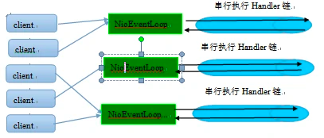

# Netty

## 介绍

Netty 是一个异步的、基于事件驱动的网络应用框架，用于快速开发高性能、高可靠性的网络 IO 程序。是目前最流行的 NIO 框架，适用于服务器通讯相关的多种应用场景

### 为什么不直接使用 NIO

- Java NIO API 学习成本高，使用麻烦，需要熟练掌握`Selector`、`ServerSocketChannel`、`SocketChannel`、`ByteBuffer`等。
- 要熟悉 Java 多线程编程，必须对多线程和网络编程非常熟悉，才能编写出高质量的 NIO 程序。
- 增加开发心智负担，例如：断连重连、网络掉包、半包读写、失败缓存、网络拥塞和异常流的处理等。
- Java 早期版本，会因为 Epoll Bug 导致 NIO Selector 空轮询，最终导致 CPU 100%。该问题直到 2013 年才被根本解决。

### 为什么使用 Netty

- 使用简单：Netty 对 NIO 的 API 进行了封装，使用更简单，解决了空轮询的问题。
- 功能强大：预置了多种编解码功能，支持多种主流协议。
- 设计优雅：基于灵活且可扩展的事件模型，可以清晰地分离关注点。
- 高性能：吞吐量更高，延迟更低，减少资源消耗，最小化不必要的内存复制。
- 社区活跃：版本迭代周期短，发现的 Bug 可以被及时修复。

## IO 模型

### BIO 同步阻塞

BIO（Blocking I/O）也叫 OIO（Old-blocking I/O），是同步阻塞的 IO。

### NIO 同步非阻塞

NIO（New I/O 或 Non-blocking I/O）最开始表示新的 IO，但是，该 API 已经出现足够长的时间，不再是“新的”了，因此，如今大多数的用户认为 NIO 代表非阻塞的 IO。

### AIO 异步非阻塞

AIO（Asynchronous I/O）是异步非阻塞 IO，AIO 引入异步通道的概念，采用了 Proactor 模式，简化了程序编写，有效的请求才启动线程，它的特点是先由操作系统完成后才通知服务端程序启动线程去处理，一般适用于连接数较多且连接时间较长的应用。

## Netty 核心组件

### Bootstrap 和 ServerBootstrap

Bootstrap 意思是引导，一个 Netty 应用通常由一个 Bootstrap 开始，主要作用是配置整个 Netty 程序，串联各个组件，Netty 中 Bootstrap 类是客户端程序的启动引导类，ServerBootstrap 是服务端启动引导类。

### EventLoopGroup 和 EventLoop

EventLoopGroup 是一组 EventLoop 的抽象，Netty 为了更好的利用多核 CPU 资源，一般会有多个 EventLoop 同时工作，每个 EventLoop 维护着一个 Selector 实例。

EventLoopGroup 提供`next()`方法，可以从组里面按照一定规则获取其中一个 EventLoop 来处理任务。在 Netty 服务器端编程中，我们一般都需要提供两个 EventLoopGroup，例如：BossEventLoopGroup 和 WorkerEventLoopGroup。

### Selector

Netty 基于 Selector 对象实现 I/O 多路复用，通过 Selector 一个线程可以监听多个连接的 Channel 事件。

当向一个 Selector 中注册 Channel 后，Selector 内部的机制就可以自动不断地查询这些注册的 Channel 是否有已就绪的 I/O 事件（例如可读，可写，网络连接完成等），这样程序就可以很简单地使用一个线程高效地管理多个 Channel。

### Channel

Netty 网络通信的组件，能够用于执行网络 I/O 操作。通过 Channel 可获得当前网络连接的通道状态和参数配置，
Channel 提供异步的网络 I/O 操作(如建立连接，读写，绑定端口)，异步调用意味着任何 I/O 调用都将立即返回，并且不保证在调用结束时所请求的 I/O 操作已完成。

### ChannelFuture

Netty 中所有的 IO 操作都是异步的，不能立刻得知消息是否被正确处理。但是可以过一会等它执行完成或者直接注册一个监听，具体的实现就是通过 Future 和 ChannelFutures，他们可以注册一个监听，当操作执行成功或失败时监听会自动触发注册的监听事件。

### ChannelPipeLine

ChannelPipeline 是一个 Handler 的集合，它负责处理和拦截 inbound 或者 outbound 的事件和操作，相当于一个贯穿 Netty 的链。(也可以这样理解：ChannelPipeline 是 保存 ChannelHandler 的 List，用于处理或拦截 Channel 的入站事件和出站操作)

ChannelPipeline 实现了一种高级形式的拦截过滤器模式，使用户可以完全控制事件的处理方式，以及 Channel 中各个的 ChannelHandler 如何相互交互。

### ChannelHandler

ChannelHandler 是一个接口，处理 I/O 事件或拦截 I/O 操作，并将其转发到其 ChannelPipeline(业务处理链)中的下一个处理程序。

ChannelHandler 本身并没有提供很多方法，因为这个接口有许多的方法需要实现，方便使用期间，可以继承它的子类。

### ChannelHandlerContext

保存 Channel 相关的所有上下文信息，同时关联一个 ChannelHandler 对象，同时 ChannelHandlerContext 中也绑定了对应的 pipeline 和 Channel 的信息，方便对 ChannelHandler 进行调用。

### Unpooled

Netty 提供一个专门用来操作缓冲区(即Netty的数据容器)的工具类，通过给定的数据和字符编码返回一个 ByteBuf 对象。（类似于 NIO 中的 ByteBuffer）

## Reactor 线程模型

Netty 是基于 Reactor 模式设计开发的。Reactor 模式基于事件驱动，采用多路复用将事件分发给相应的 Handler 处理，非常适合处理海量 I/O 的场景。

### Reactor 单线程模型

Reactor 单线程模型，指的是所有的 IO 操作都在同一个线程上面完成，线程的职责如下：

1. 作为服务端，接收客户端的 TCP 连接；
2. 作为客户端，向服务端发起 TCP 连接；
3. 读取通信对端的请求或者应答消息；
4. 向通信对端发送消息请求或者应答消息。


由于 Reactor 模式使用的是异步非阻塞 IO，所有的 IO 操作都不会导致阻塞，理论上一个线程可以独立处理所有 IO 相关的操作。从架构层面看，一个线程确实可以完成其承担的职责。
例如，通过 Acceptor 类接收客户端的 TCP 连接请求消息，链路建立成功之后，通过 Dispatch 将对应的 ByteBuffer 派发到指定的 Handler 上进行消息解码。用户线程可以通过消息编码通过线程将消息发送给客户端。

对于一些小容量应用场景，可以使用单线程模型。但是对于高负载、大并发的应用场景却不合适，主要原因如下：

1. 一个线程同时处理成百上千的链路，性能上无法支撑，即便线程的 CPU 负荷达到 100%，也无法满足海量消息的编码、解码、读取和发送。
2. 当线程负载过重之后，处理速度将变慢，这会导致大量客户端连接超时，超时之后往往会进行重发，这更加重了线程的负载，最终会导致大量消息积压和处理超时，成为系统的性能瓶颈。
3. 可靠性问题：一旦线程意外跑飞，或者进入死循环，会导致整个系统通信模块不可用，不能接收和处理外部消息，造成节点故障。

为了解决这些问题，演进出了 Reactor 多线程模型，下面我们一起学习下 Reactor 多线程模型。

### Reactor 多线程模型

Rector 多线程模型与单线程模型最大的区别就是有一组线程处理 IO 操作。


Reactor 多线程模型的特点：

1. 有专门一个 Acceptor 线程用于监听服务端，接收客户端的 TCP 连接请求。
2. 网络 IO 操作（读、写等）由一个线程池负责，线程池可以采用标准的 JDK 线程池实现，它包含一个任务队列和 N 个可用的线程，由这些线程负责消息的读取、解码、编码和发送。
3. 一个线程可以同时处理 N 条链路，但是一个链路只对应一个线程，防止发生并发操作问题。

在绝大多数场景下，Reactor 多线程模型都可以满足性能需求；但是，在极个别特殊场景中，一个线程负责监听和处理所有的客户端连接可能会存在性能问题。
例如，并发百万客户端连接，或者服务端需要对客户端握手进行安全认证，但是认证本身非常损耗性能。在这类场景下，单独一个 Acceptor 线程可能会存在性能不足问题，为了解决性能问题，出现了主从 Reactor 多线程模型。

### 主从 Reactor 多线程模型

主从 Reactor 线程模型的特点是：服务端用于接收客户端连接的不再是一个单独的线程，而是一个独立的线程池。
Acceptor 接收到客户端 TCP 连接请求处理完成后（可能包含接入认证等），将新创建的 SocketChannel 注册到 IO 线程池（sub reactor 线程池）的某个 IO 线程上，由它负责 SocketChannel 的读写和编解码工作。
Acceptor 线程池仅仅只用于客户端的认证、握手和安全认证，一旦链路建立成功，就将链路注册到 IO 线程池（sub reactor 线程池）的 IO 线程上，由 IO 线程负责后续的 IO 操作。


它的工作流程如下：

1. 从主线程池中随机选择一个 Reactor 线程作为 Acceptor 线程，用于绑定监听端口，接收客户端连接。
2. Acceptor 线程接收客户端连接请求之后创建新的 SocketChannel，将其注册到主线程池的其它 Reactor 线程上，由其负责接入认证、黑白名单过滤、握手等操作。
3. 业务层的链路正式建立之后，将 SocketChannel 从主线程池的 Reactor 线程的多路复用器上摘除，重新注册到 IO 线程池（sub reactor 线程池）的线程上，用于处理 I/O 的读写操作。

## Netty 工作流程

### 第一步：编写一个 Netty 应用

从用户线程发起创建服务端操作，代码如下：

```java
public void run(int port) throws InterruptedException {
    EventLoopGroup bossGroup = new NioEventLoopGroup(1);
    EventLoopGroup workerGroup = new NioEventLoopGroup();
    try {
        ServerBootstrap bootstrap = new ServerBootstrap()
                .group(bossGroup, workerGroup)
                .channel(NioServerSocketChannel.class)
                .childHandler(new ChannelInitializer<SocketChannel>() {
                    @Override
                    protected void initChannel(SocketChannel ch) throws Exception {
                        ch.pipeline().addLast(new EchoServerHandler());
                    }
                });
        ChannelFuture future = bootstrap.bind(port).sync();
        future.channel().closeFuture().sync();
    } finally {
        bossGroup.shutdownGracefully().sync();
        workerGroup.shutdownGracefully().sync();
    }
}
```

在创建服务端的时候实例化了 2 个 EventLoopGroup，它实际就是一个 EventLoop 线程组，负责管理 EventLoop 的申请和释放。
EventLoopGroup 管理的线程数可以通过构造函数设置，如果没有设置，默认取`-Dio.netty.eventLoopThreads`，如果该系统参数也没有指定，则为可用的 CPU 内核数 × 2。

- `bossGroup`：即 Acceptor 线程池，负责处理客户端的 TCP 连接请求。如果系统只有一个服务端端口需要监听，建议 bossGroup 线程组线程数设置为 1（即便设置成复数，也不会创建或使用多个线程）。
- `workerGroup`：是真正负责 I/O 读写操作的线程组，通过 ServerBootstrap 的 group 方法进行设置，用于后续的 Channel 绑定。

### 第二步：启动服务端

调用`bind()`方法，启动服务端，相关代码如下：

```java
ChannelFuture future = bootstrap.bind(port).sync();
```

首先，创建了一个 Channel 对象，然后，从 bossGroup 中选择一个 EventLoop（即 Acceptor 线程），将 Channel 注册到 EventLoop 的多路复用器 Selector 上，用于接收客户端的 TCP 连接
其中，`group()`方法返回的就是 bossGroup，它的`next()`方法用于从线程组中获取可用线程。

[AbstractBootstrap#initAndRegister](https://github.com/netty/netty/blob/4.1/transport/src/main/java/io/netty/bootstrap/AbstractBootstrap.java#L307)

```java
final ChannelFuture initAndRegister() {
    Channel channel = null;
    try {
        channel = channelFactory.newChannel();
        init(channel);
    } catch (Throwable t) {
        if (channel != null) {
            // channel can be null if newChannel crashed (eg SocketException("too many open files"))
            channel.unsafe().closeForcibly();
            // as the Channel is not registered yet we need to force the usage of the GlobalEventExecutor
            return new DefaultChannelPromise(channel, GlobalEventExecutor.INSTANCE).setFailure(t);
        }
        // as the Channel is not registered yet we need to force the usage of the GlobalEventExecutor
        return new DefaultChannelPromise(new FailedChannel(), GlobalEventExecutor.INSTANCE).setFailure(t);
    }

    ChannelFuture regFuture = config().group().register(channel);
    if (regFuture.cause() != null) {
        if (channel.isRegistered()) {
            channel.close();
        } else {
            channel.unsafe().closeForcibly();
        }
    }
    return regFuture;
}
```

[MultithreadEventLoopGroup#register](https://github.com/netty/netty/blob/4.1/transport/src/main/java/io/netty/channel/MultithreadEventLoopGroup.java#L85)

```java
@Override
public ChannelFuture register(Channel channel) {
    return next().register(channel);
}
```

[GenericEventExecutorChooser#next](https://github.com/netty/netty/blob/4.1/common/src/main/java/io/netty/util/concurrent/DefaultEventExecutorChooserFactory.java#L72)

```java
public EventExecutor next() {
    return this.executors[(int)Math.abs(this.idx.getAndIncrement() % (long)this.executors.length)];
}
```

### 第三步：监听客户端连接

NioEventLoop 的`run()`方法无限循环调用`select()`方法监听客户端连接事件。

```java
protected void run() {
    int selectCnt = 0;
    for (;;) {
        try {
            int strategy;
            try {
                strategy = selectStrategy.calculateStrategy(selectNowSupplier, hasTasks());
                switch (strategy) {
                case SelectStrategy.CONTINUE:
                    continue;

                case SelectStrategy.BUSY_WAIT:
                    // fall-through to SELECT since the busy-wait is not supported with NIO

                case SelectStrategy.SELECT:
                    long curDeadlineNanos = nextScheduledTaskDeadlineNanos();
                    if (curDeadlineNanos == -1L) {
                        curDeadlineNanos = NONE; // nothing on the calendar
                    }
                    nextWakeupNanos.set(curDeadlineNanos);
                    try {
                        if (!hasTasks()) {
                            strategy = select(curDeadlineNanos);
                        }
                    } finally {
                        // This update is just to help block unnecessary selector wakeups
                        // so use of lazySet is ok (no race condition)
                        nextWakeupNanos.lazySet(AWAKE);
                    }
                    // fall through
                default:
                }
            } catch (IOException e) {
                // If we receive an IOException here its because the Selector is messed up. Let's rebuild
                // the selector and retry. https://github.com/netty/netty/issues/8566
                rebuildSelector0();
                selectCnt = 0;
                handleLoopException(e);
                continue;
            }

            selectCnt++;
            cancelledKeys = 0;
            needsToSelectAgain = false;
            final int ioRatio = this.ioRatio;
            boolean ranTasks;
            if (ioRatio == 100) {
                try {
                    if (strategy > 0) {
                        processSelectedKeys();
                    }
                } finally {
                    // Ensure we always run tasks.
                    ranTasks = runAllTasks();
                }
            } else if (strategy > 0) {
                final long ioStartTime = System.nanoTime();
                try {
                    processSelectedKeys();
                } finally {
                    // Ensure we always run tasks.
                    final long ioTime = System.nanoTime() - ioStartTime;
                    ranTasks = runAllTasks(ioTime * (100 - ioRatio) / ioRatio);
                }
            } else {
                ranTasks = runAllTasks(0); // This will run the minimum number of tasks
            }

            if (ranTasks || strategy > 0) {
                if (selectCnt > MIN_PREMATURE_SELECTOR_RETURNS && logger.isDebugEnabled()) {
                    logger.debug("Selector.select() returned prematurely {} times in a row for Selector {}.",
                            selectCnt - 1, selector);
                }
                selectCnt = 0;
            } else if (unexpectedSelectorWakeup(selectCnt)) { // Unexpected wakeup (unusual case)
                selectCnt = 0;
            }
        } catch (CancelledKeyException e) {
            // Harmless exception - log anyway
            if (logger.isDebugEnabled()) {
                logger.debug(CancelledKeyException.class.getSimpleName() + " raised by a Selector {} - JDK bug?",
                        selector, e);
            }
        } catch (Error e) {
            throw e;
        } catch (Throwable t) {
            handleLoopException(t);
        } finally {
            // Always handle shutdown even if the loop processing threw an exception.
            try {
                if (isShuttingDown()) {
                    closeAll();
                    if (confirmShutdown()) {
                        return;
                    }
                }
            } catch (Error e) {
                throw e;
            } catch (Throwable t) {
                handleLoopException(t);
            }
        }
    }
}
```

调用 unsafe 的`read()`方法，对于 NioServerSocketChannel，它调用了 NioMessageUnsafe 的`read()`方法，代码如下：

```java
private void processSelectedKey(SelectionKey k, AbstractNioChannel ch) {
    final AbstractNioChannel.NioUnsafe unsafe = ch.unsafe();
    if (!k.isValid()) {
        final EventLoop eventLoop;
        try {
            eventLoop = ch.eventLoop();
        } catch (Throwable ignored) {
            // If the channel implementation throws an exception because there is no event loop, we ignore this
            // because we are only trying to determine if ch is registered to this event loop and thus has authority
            // to close ch.
            return;
        }
        // Only close ch if ch is still registered to this EventLoop. ch could have deregistered from the event loop
        // and thus the SelectionKey could be cancelled as part of the deregistration process, but the channel is
        // still healthy and should not be closed.
        // See https://github.com/netty/netty/issues/5125
        if (eventLoop == this) {
            // close the channel if the key is not valid anymore
            unsafe.close(unsafe.voidPromise());
        }
        return;
    }

    try {
        int readyOps = k.readyOps();
        // We first need to call finishConnect() before try to trigger a read(...) or write(...) as otherwise
        // the NIO JDK channel implementation may throw a NotYetConnectedException.
        if ((readyOps & SelectionKey.OP_CONNECT) != 0) {
            // remove OP_CONNECT as otherwise Selector.select(..) will always return without blocking
            // See https://github.com/netty/netty/issues/924
            int ops = k.interestOps();
            ops &= ~SelectionKey.OP_CONNECT;
            k.interestOps(ops);

            unsafe.finishConnect();
        }

        // Process OP_WRITE first as we may be able to write some queued buffers and so free memory.
        if ((readyOps & SelectionKey.OP_WRITE) != 0) {
            // Call forceFlush which will also take care of clear the OP_WRITE once there is nothing left to write
            ch.unsafe().forceFlush();
        }

        // Also check for readOps of 0 to workaround possible JDK bug which may otherwise lead
        // to a spin loop
        if ((readyOps & (SelectionKey.OP_READ | SelectionKey.OP_ACCEPT)) != 0 || readyOps == 0) {
            unsafe.read();
        }
    } catch (CancelledKeyException ignored) {
        unsafe.close(unsafe.voidPromise());
    }
}
```

```java
@Override
public void read() {
    assert eventLoop().inEventLoop();
    final ChannelConfig config = config();
    final ChannelPipeline pipeline = pipeline();
    final RecvByteBufAllocator.Handle allocHandle = unsafe().recvBufAllocHandle();
    allocHandle.reset(config);

    boolean closed = false;
    Throwable exception = null;
    try {
        try {
            do {
                int localRead = doReadMessages(readBuf);
                if (localRead == 0) {
                    break;
                }
                if (localRead < 0) {
                    closed = true;
                    break;
                }

                allocHandle.incMessagesRead(localRead);
            } while (continueReading(allocHandle));
        } catch (Throwable t) {
            exception = t;
        }

        int size = readBuf.size();
        for (int i = 0; i < size; i ++) {
            readPending = false;
            pipeline.fireChannelRead(readBuf.get(i));
        }
        readBuf.clear();
        allocHandle.readComplete();
        pipeline.fireChannelReadComplete();

        if (exception != null) {
            closed = closeOnReadError(exception);

            pipeline.fireExceptionCaught(exception);
        }

        if (closed) {
            inputShutdown = true;
            if (isOpen()) {
                close(voidPromise());
            }
        }
    } finally {
        // Check if there is a readPending which was not processed yet.
        // This could be for two reasons:
        // * The user called Channel.read() or ChannelHandlerContext.read() in channelRead(...) method
        // * The user called Channel.read() or ChannelHandlerContext.read() in channelReadComplete(...) method
        //
        // See https://github.com/netty/netty/issues/2254
        if (!readPending && !config.isAutoRead()) {
            removeReadOp();
        }
    }
}
```

最终它会调用 NioServerSocketChannel 的 doReadMessages 方法创建一个 NioSocketChannel 对象，代码如下：

```java
@Override
protected int doReadMessages(List<Object> buf) throws Exception {
    SocketChannel ch = SocketUtils.accept(javaChannel());

    try {
        if (ch != null) {
            buf.add(new NioSocketChannel(this, ch));
            return 1;
        }
    } catch (Throwable t) {
        logger.warn("Failed to create a new channel from an accepted socket.", t);

        try {
            ch.close();
        } catch (Throwable t2) {
            logger.warn("Failed to close a socket.", t2);
        }
    }

    return 0;
}
```

从 workerGroup 中选择一个 I/O 线程负责网络消息的读写，并将它注册到多路复用器上，监听 READ 操作，代码中 childGroup 即为 workerGroup。

```java
@Override
public void channelRead(ChannelHandlerContext ctx, Object msg) {
    final Channel child = (Channel) msg;

    child.pipeline().addLast(childHandler);

    setChannelOptions(child, childOptions, logger);
    setAttributes(child, childAttrs);

    try {
        childGroup.register(child).addListener(new ChannelFutureListener() {
            @Override
            public void operationComplete(ChannelFuture future) throws Exception {
                if (!future.isSuccess()) {
                    forceClose(child, future.cause());
                }
            }
        });
    } catch (Throwable t) {
        forceClose(child, t);
    }
}
```

## NioEventLoop

### NioEventLoop 介绍

NioEventLoop 是 Netty 的 Reactor 线程，它的职责如下：

- 作为服务端 Acceptor 线程，负责处理客户端的请求接入。
- 作为客户端 Connector 线程，负责注册监听连接操作位，用于判断异步连接结果。
- 作为 IO 线程，监听网络读操作位，负责从 SocketChannel 中读取报文。
- 作为 IO 线程，负责向 SocketChannel 写入报文发送给对方，如果发生写半包，会自动注册监听写事件，用于后续继续发送半包数据，直到数据全部发送完成。
- 作为定时任务线程，可以执行定时任务，例如：链路空闲检测和发送心跳消息等。
- 作为线程执行器可以执行普通的任务线程（Runnable）。

NioEventLoop 继承 SingleThreadEventExecutor 类，这就意味着它实际上是一个线程个数为 1 的线程池，继承关系如下所示：


### NioEventLoop 设计原理

#### 串行化设计避免线程竞争

我们知道当系统在运行过程中，如果频繁的进行线程上下文切换，会带来额外的性能损耗。多线程并发执行某个业务流程，业务开发者还需要时刻对线程安全保持警惕，哪些数据可能会被并发修改，如何保护？这不仅降低了开发效率，也会带来额外的性能损耗。

为了解决上述问题，Netty 采用了串行化设计理念，从消息的读取、编码以及后续 Handler 的执行，始终都由 IO 线程 NioEventLoop 负责，这就意外着整个流程不会进行线程上下文的切换，数据也不会面临被并发修改的风险，对于用户而言，甚至不需要了解 Netty 的线程细节，这确实是个非常好的设计理念，它的工作原理图如下：



一个 NioEventLoop 聚合了一个多路复用器 Selector，因此可以处理成百上千的客户端连接，Netty 的处理策略是每当有一个新的客户端接入，则从 NioEventLoop 线程组中顺序获取一个可用的 NioEventLoop，当到达数组上限之后，重新返回到 0，通过这种方式，可以基本保证各个 NioEventLoop 的负载均衡。一个客户端连接只注册到一个 NioEventLoop 上，这样就避免了多个 IO 线程去并发操作它。

Netty 通过串行化设计理念降低了用户的开发难度，提升了处理性能。利用线程组实现了多个串行化线程水平并行执行，线程之间并没有交集，这样既可以充分利用多核提升并行处理能力，同时避免了线程上下文的切换和并发保护带来的额外性能损耗。

#### 定时任务与时间轮算法

在 Netty 中，有很多功能依赖定时任务，比较典型的有：客户端连接超时控制、链路空闲检测。

一种比较常用的设计理念是在 NioEventLoop 中聚合 JDK 的定时任务线程池 ScheduledExecutorService，通过它来执行定时任务。这样做单纯从性能角度看不是最优，原因有如下三点：

1. 在 IO 线程中聚合了一个独立的定时任务线程池，这样在处理过程中会存在线程上下文切换问题，这就打破了 Netty 的串行化设计理念。
2. 存在多线程并发操作问题，因为定时任务 Task 和 IO 线程 NioEventLoop 可能同时访问并修改同一份数据。
3. JDK 的 ScheduledExecutorService 从性能角度看，存在性能优化空间。

最早面临上述问题的是操作系统和协议栈，例如 TCP 协议栈，其可靠传输依赖超时重传机制，因此每个通过 TCP 传输的 packet 都需要一个 timer 来调度 timeout 事件。这类超时可能是海量的，如果为每个超时都创建一个定时器，从性能和资源消耗角度看都是不合理的。

根据 George Varghese 和 Tony Lauck 1996 年的论文《Hashed and Hierarchical Timing Wheels: data structures to efficiently implement a timer facility》提出了一种定时轮的方式来管理和维护大量的 timer 调度。Netty 的定时任务调度就是基于时间轮算法调度。

定时轮是一种数据结构，其主体是一个循环列表，每个列表中包含一个称之为 slot 的结构，它的原理图如下：


定时轮的工作原理可以类比于时钟，如上图箭头（指针）按某一个方向按固定频率轮动，每一次跳动称为一个 tick。这样可以看出定时轮由个 3 个重要的属性参数：ticksPerWheel（一轮的 tick 数），tickDuration（一个 tick 的持续时间）以及 timeUnit（时间单位），例如当 ticksPerWheel=60，tickDuration=1，timeUnit=second，这就和时钟的秒针走动完全类似了。

#### 聚焦而不是膨胀

Netty 是个异步高性能的 NIO 框架，它并不是个业务运行容器，因此它不需要也不应该提供业务容器和业务线程。合理的设计模式是 Netty 只负责提供和管理 NIO 线程，其它的业务层线程模型由用户自己集成，Netty 不应该提供此类功能，只要将分层划分清楚，就会更有利于用户集成和扩展。

令人遗憾的是在 Netty 3 系列版本中，Netty 提供了类似 Mina 异步 Filter 的 ExecutionHandler，它聚合了 JDK 的线程池 java.util.concurrent.Executor，用户异步执行后续的 Handler。
ExecutionHandler 是为了解决部分用户 Handler 可能存在执行时间不确定而导致 IO 线程被意外阻塞或者挂住，从需求合理性角度分析这类需求本身是合理的，但是 Netty 提供该功能却并不合适。原因总结如下：

1. 没有遵循 Netty 串行化设计理念，在消息的接收和处理过程中发生了线程切换并引入新的线程池，打破了自身架构坚守的设计原则，实际是一种架构妥协。
2. 潜在的线程并发安全问题，如果异步 Handler 也操作它前面的用户 Handler，而用户 Handler 又没有进行线程安全保护，这就会导致隐蔽和致命的线程安全问题。
3. 用户开发的复杂性，引入 ExecutionHandler，打破了原来的 ChannelPipeline 串行执行模式，用户需要理解 Netty 底层的实现细节，关心线程安全等问题，这会导致得不偿失。

鉴于上述原因，Netty 的后续版本彻底删除了 ExecutionHandler，而且也没有提供类似的相关功能类，把精力聚焦在 Netty 的 IO 线程 NioEventLoop 上，这无疑是一种巨大的进步，Netty 重新开始聚焦在 IO 线程本身，而不是提供用户相关的业务线程模型。

## Netty 线程开发最佳实践

### 时间可控的简单业务直接在 IO 线程上处理

如果业务非常简单，执行时间非常短，不需要与外部网元交互、访问数据库和磁盘，不需要等待其它资源，则建议直接在业务 ChannelHandler 中执行，不需要再启业务的线程或者线程池。避免线程上下文切换，也不存在线程并发问题。

### 复杂和时间不可控业务建议投递到业务线程池统一处理

对于此类业务，不建议直接在业务 ChannelHandler 中启动线程或者线程池处理，建议将不同的业务统一封装成 Task，统一投递到业务线程池中进行处理。

过多的业务 ChannelHandler 会带来开发效率和可维护性问题，不要把 Netty 当作业务容器，对于大多数复杂的业务产品，仍然需要集成或者开发自己的业务容器，做好和 Netty 的架构分层。

### 业务线程避免直接操作 ChannelHandler

对于 ChannelHandler，IO 线程和业务线程都可能会操作，因为业务通常是多线程模型，这样就会存在多线程操作 ChannelHandler。
为了尽量避免多线程并发问题，建议按照 Netty 自身的做法，通过将操作封装成独立的 Task 由 NioEventLoop 统一执行，而不是业务线程直接操作，相关代码如下所示：

```java
if (ctx.executor().inEventLoop()) {
    doSomething(ctx);
} else {
    ctx.executor().execute(() -> doSomething(ctx));
}
```

如果确认并发访问的数据或者并发操作是安全的，则无需多此一举，这个需要根据具体的业务场景进行判断，灵活处理。

## JDK NIO Bug

### 发生原因

Linux 系统默认使用 epoll 作为 IO 多路复用器，JDK NIO 在 Linux 下默认也是 epoll，但其实现却存在漏洞。

例如：即使是关注的 select 轮询事件返回的数量为 0，也可能使本应该阻塞的 select 方法被唤醒，导致空轮询，最终导致 CPU 满载，复现该 Bug 的场景如下：

```
0. 服务端等待连接
1. 客户端发起连接，并发送消息
2. 服务端接受连接，并注册 OP_READ
3. 服务端读取消息，并从 interest op set 中移除 OP_READ 
4. 客户端关闭连接
5. 服务端发送消息（此时没有读取操作也就没有设置 OP_READ）
6. 服务端 select 方法被无限唤醒，且回事件数量为 0
```

因为 epoll 对于突然中断的连接 socket 会对返回的 eventSet 事件集合置为 POLLHUP 或者 POLLERR，eventSet 事件集合发生了变化时，会唤醒 select 方法，进而导致空轮询。
根本原因在于 JDK 没有处理这种情况，从 java.nio.channels.SelectionKey 中可以发现没定义有异常事件的类型。

```java
public abstract class SelectionKey {
    public static final int OP_READ = 1 << 0;
    public static final int OP_WRITE = 1 << 2;
    public static final int OP_CONNECT = 1 << 3;
    public static final int OP_ACCEPT = 1 << 4;
}
```

### Netty 如何解决/规避

1. 调用 select 方法，并设置超时时间，同时记录轮询次数（selectCnt++）
2. 计算 select 方法的操作时间，如果阻塞时间大于等于超时时间，则说明 select 方法正常执行，重置轮询次数；如果阻塞时间小于超时时间，则需要进一步判断轮询次数是否超过了设定的阈值（默认为512），如果超过了说明可能出现了 Bug，需要重建 Selector。
3. 调用 rebuildSelector() 方法重新打开一个 newSelector，然后将 oldSelector 的所有 key 注册到 newSelector，最后替换 oldSelector 即可。

_在新版本的 Netty 中，则是通过判断是否执行了任务，或 select 方法返回的值是否大于 0，取代了旧版本中通过阻塞时间判断，本质上原理是一样的。_