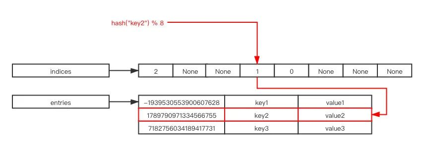

# Python

## Python 的内存管理机制

### 1. 引用计数机制

- 在 Python 中，每个对象都有一个引用计数器，记录有多少个变量或对象引用它。
- 当引用计数为 0 时，对象的内存会立即被回收。
- 常见影响引用计数的操作：
    - 增加计数：变量赋值、作为函数参数传递、存入容器（如 list, dict）。
    - 减少计数：变量被删除（del）、变量赋新值、对象被移出容器。

优点：简单、实时回收（不会长时间占用内存）。
缺点：无法处理循环引用（例如两个对象相互引用）。

### 2. 垃圾回收（GC）

为了解决循环引用问题，Python（CPython 实现）引入了 分代垃圾回收（Generational GC）：

- Python 把对象分成 三代：
    - 第 0 代：新创建的对象。
    - 第 1 代：多次 GC 后仍然存活的对象。
    - 第 2 代：长期存活的对象。
- 回收策略：
    - 第 0 代对象频繁检查。
    - 如果对象多次幸存，则晋升到更高一代，检查频率降低。

这样可以减少 GC 开销，因为大多数对象生命周期很短。

---

是否存在循环引用使用深度优先搜索（DFS）+ 回溯标记

- 用 DFS 遍历所有节点。
- 给每个节点维护一个三态标记：
    - 未访问（white）
    - 访问中（gray）
    - 已完成（black）
    - 在 DFS 时，如果遇到“访问中（gray）”的节点，说明存在一条回到自己祖先的路径，即检测到环。

复杂度：

- 时间复杂度：O(V+E)，V为对象数，E为引用关系数。
- 空间复杂度：O(V)（递归栈+标记数组）。

```python
def dfs_recursive(graph, node, visited=None):
    if visited is None:
        visited = set()
    if node not in visited:
        print(node, end=" ")
        visited.add(node)
        for neighbor in graph[node]:
            dfs_recursive(graph, neighbor, visited)

graph = {
    'A': ['B', 'C'],
    'B': ['D', 'E'],
    'C': ['F'],
    'D': [],
    'E': ['F'],
    'F': []
}
            
dfs_recursive(graph, 'A')
# A B D E F C 
```

BFS

```python
from collections import deque

def bfs(graph, start):
    visited = set()         # 已访问的节点集合
    queue = deque([start])  # 使用队列存储待访问节点
    order = []              # 记录访问顺序

    while queue:
        node = queue.popleft()
        if node not in visited:
            visited.add(node)
            order.append(node)
            # 将未访问的相邻节点加入队列
            for neighbor in graph.get(node, []):
                if neighbor not in visited:
                    queue.append(neighbor)
    return order
```

### 3. 内存池机制（Memory Pool）

- CPython 使用了 内存池机制（pymalloc） 来提高小对象的分配效率。
- 内存分配过程：
    - 大对象（>512字节）直接向操作系统申请内存。
    - 小对象（≤512字节）由 Python 内部的内存池统一管理，减少频繁调用 malloc/free 的开销。
- 内存池被分为：
    - Arena：256 KB 的大块内存。
    - Pool：从 Arena 划分的小块。
    - Block：分配给对象的最小单位。

### 4. 内存管理相关模块

- gc 模块：可以手动调用垃圾回收、调整阈值、调试内存泄漏。
- sys.getrefcount(obj)：查看对象的引用计数。
- obj.__sizeof__()：查看对象的实际大小。

### 5. 优化内存使用的技巧

- 避免不必要的对象引用，及时使用 del 删除无用变量。
- 使用生成器（generator yield）代替列表保存大量数据。
- 大量数值计算时可用 numpy，因为它使用了更高效的内存管理。
- 对于循环引用的对象（如双向链表、树节点），可以使用 weakref 弱引用避免 GC 压力。

## Python 语言核心与原理

### is 与 == 的区别，id() 的作用

#### ==

- 比较的是 值是否相等。
- 即两个对象内容相同，就返回 True，不管它们是不是同一个对象。

#### is

- 比较的是 对象的身份是否相同。
- 即比较两者的 内存地址（id） 是否相同，只有指向同一个对象时才返回 True。

#### id() 的作用

- id(obj) 返回对象的 内存地址标识（唯一标识符）。
- 在 CPython 实现中，id() 的返回值就是对象的内存地址（十进制形式）。
- 可以用来判断两个变量是否引用同一个对象。

### Python 中 不可变对象和可变对象 的区别，以及对性能和多线程的影响。

pass

### Python 中的 作用域规则（LEGB 原则）。

LEGB 代表 Local → Enclosing → Global → Built-in，Python 会依次在这四个作用域中查找变量：

1. L（Local，本地作用域）
    - 指函数内部定义的变量（包括函数参数）。
    - 在函数运行时创建，函数结束后销毁。
2. E（Enclosing，闭包外层作用域）
    - 如果一个函数嵌套在另一个函数中，内层函数引用外层函数的变量，就属于 Enclosing。
    - Python 会向外逐层查找，直到找到该变量或到达 Global 为止。
3. G（Global，全局作用域）
    - 在模块文件的最外层定义的变量。
    - 可以在函数内部通过 global 关键字声明，修改全局变量。
4. B（Built-in，内置作用域）
    - Python 解释器内置的作用域，比如 len、print、sum 等。
    - 如果以上三个作用域都没有找到变量名，就会到内置作用域查找。

### 描述 装饰器（decorator） 的工作原理，并实现一个带参数的装饰器。

在 Python 中，装饰器本质上就是一个函数，它的作用是接收一个函数作为输入，并返回一个新的函数，从而在不修改原函数代码的情况下，给函数“添加”额外的功能。
它常用于：

- 日志记录
- 权限校验
- 性能测试（统计函数执行时间）
- 缓存
- 代码复用与解耦

装饰器的工作原理主要依赖于 函数是“一等公民” 这一特性：

1. 函数可以作为参数传递给另一个函数
2. 函数可以作为返回值返回
3. 函数可以赋值给变量

```python
def decorator(func):
    def wrapper(*args, **kwargs):
        print("在执行函数之前做一些事")
        result = func(*args, **kwargs)  # 调用原函数
        print("在执行函数之后做一些事")
        return result
    return wrapper

@decorator
def say_hello(name):
    print(f"Hello, {name}!")

say_hello("Alice")
```

使用 functools.wraps

如果不做处理，装饰器会导致原函数的元信息（如 __name__, __doc__）丢失。

```python
from functools import wraps

def decorator(func):
    @wraps(func)
    def wrapper(*args, **kwargs):
        return func(*args, **kwargs)
    return wrapper
```

### 一切皆对象：对象头、类型对象、类与元类

在 Python 中，不管是 整数、字符串、函数、类、模块，甚至连 类型本身，都是对象（object）。
对象的本质就是“内存里的一段数据 + 头部元信息”。所以你拿到的任何值，在 CPython 解释器里都是一个 PyObject * 指针。

### Python 的 元类（metaclass） 是什么，有哪些应用场景？

在 Python 中，一切都是对象，包括类本身。类是用来创建对象的“工厂”，而 元类就是用来创建类的工厂。
换句话说：

- 对象（instance） 是由 类（class） 创建的。
- 类（class） 又是由 元类（metaclass） 创建的。

默认情况下，Python 中的类是由内置的元类 type 生成的。

常见应用场景

- 单例模式：确保一个类只有一个实例。
- ORM 框架（比如 Django 的模型类）：在类定义时自动收集字段信息。
- 接口检查：确保子类实现了某些方法。
-

```python
# 定义一个元类
class MyMeta(type):
    def __new__(mcs, name, bases, attrs):
        print(f"正在创建类 {name}")
        attrs['say_hello'] = lambda self: print("Hello from metaclass!")
        return super().__new__(mcs, name, bases, attrs)

# 使用元类创建类
class MyClass(metaclass=MyMeta):
    pass

obj = MyClass()
obj.say_hello()  # 输出: Hello from metaclass! 
```

__new__ 方法会在类创建时被调用。
可以在这里动态修改类的属性和方法。

### Python 中的 描述符（descriptor）协议：__get__、__set__、__delete__。

在 Python 中，描述符（descriptor）协议是一种底层机制，它定义了对象如何控制对其属性的访问（读取、写入、删除）。这套机制让我们可以用类来定制属性行为，本质上是对 __get__、__set__、__delete__ 这三个方法的约定。

```python
class Age:
    def __get__(self, instance, owner):
        return instance.__dict__.get("_age", 0)

    def __set__(self, instance, value):
        if value < 0:
            raise ValueError("年龄不能为负数")
        instance.__dict__["_age"] = value


class Person:
    age = Age()  # 使用描述符

p = Person()
p.age = 25
print(p.age)   # 25
p.age = -5     # ValueError: 年龄不能为负数
```

实际应用场景

1. 属性验证（如上面 Age 示例）
2. 懒加载属性（在访问时才计算或加载）
3. ORM 框架：如 SQLAlchemy，用描述符管理数据库字段与类属性映射。
4. 函数与方法机制：Python 内置的 @property、方法绑定机制就是基于描述符协议实现的。

### __new__ 和 __init__ 的区别与使用场景。

#### __new__

- 作用：负责创建对象，是构造函数。
- 调用时机：在类实例化时，先调用 __new__ 来分配内存并返回实例对象。
- 返回值：必须返回类的实例（通常是 super().__new__(cls)），否则对象不会被创建。
- 常见用途：
    - 控制对象的创建过程（比如实现单例模式）。
    - 当需要返回不同类的实例时（如工厂模式）。
    - 在不可变对象（如 int, str, tuple）的子类中定制行为时。

#### __init__

- 作用：负责初始化对象，是初始化方法。
- 调用时机：__new__ 返回实例对象后，自动调用 __init__ 进行属性初始化。
- 返回值：始终返回 None，不能改变实例的返回值。
- 常见用途：
    - 为对象属性赋值。
    - 执行一些启动逻辑。

实例化 obj = MyClass() 的完整顺序是：

1. MyClass.__new__ 被调用 → 创建对象并返回实例。
2. MyClass.__init__ 被调用 → 对实例做进一步初始化。

如果 __new__ 没有返回实例（比如返回了 None 或其他类型对象），则 __init__ 不会被执行。

总结:

- __new__：负责对象创建，控制返回什么对象。
- __init__：负责对象初始化，填充对象内容。
- 一般情况：只写 __init__ 就足够。
- 特殊情况：需要改变实例化过程时（单例、工厂、不变对象）才会用到 __new__。

### Python 中的 数据模型魔法方法（如 __str__, __repr__, __iter__, __call__）。

#### __str__(self)

- 定义对象被 str() 或 print() 调用时的字符串表现形式。
- 主要用于“对用户友好”的可读性输出。

```python
class Person:
    def __init__(self, name):
        self.name = name
    
    def __str__(self):
        return f"Person(name={self.name})"

p = Person("Alice")
print(p)          # Person(name=Alice)   <-- 调用 __str__
print(str(p))     # Person(name=Alice) 
```

#### __repr__(self)

- 定义对象在 交互式解释器 或 repr() 函数中返回的字符串表现形式。
- 通常要求返回一个 能明确标识对象 的字符串（最好能用于重新创建该对象）。
- 开发者调试时更常用。

```python
class Person:
    def __init__(self, name):
        self.name = name
    
    def __repr__(self):
        return f"Person('{self.name}')"

p = Person("Alice")
print(repr(p))    # Person('Alice') 
```

#### __iter__(self)

- 使对象 可迭代（可用于 for ... in ...、解包、list() 等）。
- 必须返回一个迭代器对象（实现了 __next__ 的对象），通常是 self 或 iter(...)。

```python
class CountDown:
    def __init__(self, start):
        self.start = start
    
    def __iter__(self):
        self.current = self.start
        return self
    
    def __next__(self):
        if self.current <= 0:
            raise StopIteration
        self.current -= 1
        return self.current + 1

for num in CountDown(3):
    print(num)   # 3, 2, 1 
```

#### __call__(self, *args, **kwargs)

- 让对象 像函数一样可调用。
- 常用于回调、工厂模式或“函数对象”。

```python
class Greeter:
    def __init__(self, greeting):
        self.greeting = greeting
    
    def __call__(self, name):
        return f"{self.greeting}, {name}!"

hello = Greeter("Hello")
print(hello("Alice"))  # Hello, Alice!   <-- 调用 __call__ 
```

### GIL（全局解释器锁）：为什么存在，如何影响多线程？

#### GIL 为什么存在

GIL 最初设计的主要原因是 简化 CPython 的内存管理：

- CPython 使用了 引用计数（reference counting） 作为垃圾回收的一部分，每次对象引用数的增加/减少都需要保证线程安全。
- 如果没有全局锁，解释器就必须在所有对象操作中加上细粒度的锁，这会大大增加实现的复杂性和运行开销。
- 因此，GIL 的出现使得 单个线程在任意时刻独占解释器执行字节码，从而避免了并发修改对象引用计数时的数据竞争问题。

简而言之：
👉 GIL 是一个历史遗留的 实现权衡，它让 Python 在多线程情况下更简单、更安全，但牺牲了多核并行的性能潜力。

#### GIL 如何影响多线程

1. CPU 密集型任务
    - 因为 GIL 的存在，同一进程内的多个线程不能同时利用多个 CPU 核心执行 Python 字节码。
    - 即便开了很多线程，实质上在同一时刻也只有一个线程在执行，其他线程被阻塞。
    - 所以在需要大量计算的任务中，多线程并不会加速，甚至可能因为频繁上下文切换而变慢。
2. I/O 密集型任务
    - 当线程执行 I/O 操作（如文件读写、网络请求）时，GIL 会被释放，这样其他线程可以运行。
    - 因此，多线程在 I/O 密集型场景（如爬虫、网络服务）仍然能带来性能提升。
3. 多进程替代方案
    - 对于 CPU 密集型任务，常用的办法是使用 多进程（multiprocessing），每个进程有独立的 Python 解释器和 GIL，可以真正利用多核。
    - 当然，这会带来更高的内存开销和进程间通信成本。

### __slots__ 的作用与限制

#### 作用

1. 节省内存
    - 默认情况下，Python 对象的实例属性存储在一个 __dict__ 中，这个字典会占用额外内存。
    - 使用 __slots__ 声明后，实例不会再使用 __dict__ 存储属性，而是通过更紧凑的结构（类似数组）来存放指定的属性，从而减少内存开销。
    - 对于需要大量创建实例的场景（如数百万对象），效果尤其明显。
2. 提高属性访问速度
    - 因为跳过了字典查找，__slots__ 中的属性访问通常会更快一些。
3. 防止动态添加新属性
    - 使用 __slots__ 限定后，实例只能有定义好的属性，无法随意添加新的属性，减少了错误的可能性。

#### 限制

1. 不能随意添加新属性
    - 除非在 __slots__ 中定义了 "__dict__"，否则无法再为实例动态添加未声明的属性。
2. 不支持默认继承 __dict__ 和 __weakref__
    - 如果类需要支持弱引用，需要在 __slots__ 中显式声明 __weakref__。
    - 否则，实例不能作为 weakref 的目标。
3. 继承的复杂性
    - 子类没有定义 __slots__ 时会重新获得 __dict__，从而失去内存优化效果。
    - 多重继承时，如果父类们都定义了 __slots__，可能会出现兼容性问题。
4. 某些动态特性受限
    - 无法给类随意绑定属性。
    - 不便于某些依赖动态属性操作的库（如某些 ORM）使用。

```python
class Point:
    __slots__ = ("x", "y")

    def __init__(self, x, y):
        self.x = x
        self.y = y

p = Point(1, 2)
print(p.x, p.y)

# p.z = 3   # AttributeError: 'Point' object has no attribute 'z'
```

总结：__slots__ 适合 需要大量实例、注重内存和性能优化 的场景（如数据结构、游戏对象、科学计算中轻量对象），但会牺牲一些灵活性（动态属性和继承特性）。

### 闭包与自由变量

#### 什么是闭包（Closure）

包指的是：一个函数内部定义了另一个函数，并且内部函数引用了外部函数的变量，那么这个内部函数就被称为闭包。

- 闭包的本质是 函数 + 环境 的组合。
- 当外部函数返回了内部函数时，内部函数依然“记住”了外部函数作用域中的变量，即使外部函数已经结束执行。

```python
def outer(x):
    def inner(y):
        return x + y
    return inner

f = outer(10)  # outer 执行后返回 inner
print(f(5))    # 输出 15
```

#### 什么是自由变量（Free Variable）

自由变量是指在函数中使用，但既不是该函数的参数，也不是函数内部定义的局部变量，而是来自外部作用域的变量。

在闭包中，自由变量通常来自外部函数的作用域。

```python
def outer():
    x = 10  # x 就是自由变量
    def inner(y):
        return x + y
    return inner

f = outer()
print(f(5))  # 输出 15
```

#### 闭包与自由变量的关系

- 闭包产生的前提：内部函数引用了外部函数的自由变量。
- 自由变量的存储：Python 会将这些自由变量保存在函数的 __closure__ 属性中。

```python
def outer(a):
    b = 20
    def inner(c):
        return a + b + c
    return inner

f = outer(10)
print(f(5))                  # 输出 35
print(f.__closure__[0].cell_contents)  # 10
print(f.__closure__[1].cell_contents)  # 20 
```

总结：

- 闭包 = 内部函数 + 外部作用域的自由变量。
- 自由变量 = 非局部变量、非参数，但在函数中被使用。
- 闭包常用于数据隐藏、延迟计算、函数工厂、装饰器等场景。

### 异常传播机制与上下文（__context__、__cause__）

#### 异常传播机制

1. 异常抛出
   当 raise 抛出一个异常时，解释器会中断当前代码执行，沿调用栈逐层回溯，直到找到合适的 except 块来处理。
    - 如果找到处理代码 → 执行对应的 except
    - 如果未找到 → 程序终止，并输出 traceback
2. 嵌套异常
   在 except 块中可能再次抛出新的异常，这时候原始异常信息会被“链式”保留下来，用来提示开发者“这个异常是由前一个异常导致的”。

#### 异常上下文属性

Python 为了保留这种“链式”关系，引入了几个特殊属性：

1. __context__
    - 当一个异常在 except 块中处理另一个异常时，如果又抛出了新的异常，新异常对象的 __context__ 会指向前一个异常。
    - 这是“隐式链”，即只要是在异常处理过程中触发了新的异常，就会自动建立。

```python
try:
    1 / 0
except ZeroDivisionError:
    raise ValueError("出现了新的错误")
```

此时：

- 新异常是 ValueError
- ValueError.__context__ → ZeroDivisionError
- traceback 会显示类似：

```python
During handling of the above exception, another exception occurred:
```

2. __cause__
    - 可以通过 raise ... from ... 语法手动指定“直接原因”。
    - 当显式使用 from 时，新的异常对象的 __cause__ 属性会被设置为你指定的异常，而不是默认的 __context__。

```python
try:
    1 / 0
except ZeroDivisionError as e:
    raise ValueError("出现了新的错误") from e
```

- ValueError.__cause__ → ZeroDivisionError
- traceback 会显示类似：

```python
The above exception was the direct cause of the following exception:
```

这样可以让错误链更清晰地表达“因果关系”。

3. __suppress_context__

- 当你用 raise ... from ... 时，Python 会自动将 __suppress_context__ = True，表示不再显示 __context__ 的 traceback，只显示 __cause__。
- 如果你想手动抑制 __context__ 的显示，也可以设置该属性。

### 自定义异常的最佳实践

1. 继承 Exception，避免直接继承 BaseException。
2. 定义项目级别基类异常，分层管理。
3. 在异常中存储上下文信息，便于调试。
4. 写清楚文档字符串，避免模糊异常。
5. 能用内置异常时不要重复造轮子。
6. 结合 logging 输出错误信息。
7. 使用 raise ... from ... 保留上下文。

## 性能与优化

### 如何分析 Python 程序的性能瓶颈？（cProfile, line_profiler 等工具）

1. 先用 cProfile 定位到大致耗时函数。（本地）
2. 再用 line_profiler 分析函数内部逐行耗时。（本地）
3. 如果怀疑 内存或 I/O，用 memory_profiler 或 scalene。（本地）
4. 如果程序运行时间长或难以改代码，直接用 py-spy 火焰图。（生产attach 火焰图 Flame Graph）

### 列举几种 Python 优化性能的手段（如 Cython、NumPy 向量化、缓存、并发）。

- 合理选择数据结构（如 set 查找比 list 快）。
- 减少不必要的对象创建，避免深层嵌套循环。
- 使用生成器（yield）减少内存消耗。
- 大量对象使用__slots__代替__dict__
- 缓存
- 避免不要的循环引用

### deepcopy vs copy 的区别和性能影响。

#### 浅拷贝

作用：创建一个新对象，但只拷贝对象的最外层，内部的可变对象（如 list、dict、set）只复制引用。
结果：修改浅拷贝对象里嵌套的可变数据，会影响原对象。

```python
import copy

a = [1, [2, 3]]
b = copy.copy(a)

b[0] = 99       # 改最外层，不影响 a
b[1][0] = 88    # 改嵌套的 list，会影响 a
print(a)  # [1, [88, 3]]
```

#### 深拷贝

作用：递归地拷贝对象及其所有子对象，直到最底层。
结果：修改任何层级的拷贝对象，都不会影响原对象。

```python
import copy

a = [1, [2, 3]]
b = copy.deepcopy(a)

b[1][0] = 88
print(a)  # [1, [2, 3]]
```

用浅拷贝：如果对象比较浅，或你只需要一个顶层副本。
用深拷贝：当你要完全隔离原对象与副本，避免任何嵌套结构被共享时。
替代方案：对于简单结构（如只含列表/字典），可以考虑用 copy 方法（如 list.copy()、dict.copy()）或切片操作，这些通常比 copy 模块更快。

### Python 中的内存泄漏可能由哪些情况引起？如何定位？

#### Python 内存泄漏的常见原因

1. 循环引用未被回收
   两个或多个对象互相引用，且其中包含 __del__ 析构方法，导致 GC 无法正确回收。

```python
class A:
    def __init__(self):
        self.b = None
    def __del__(self):
        pass

class B:
    def __init__(self):
        self.a = None

a = A()
b = B()
a.b = b
b.a = a
del a, b  # 并不会立即释放
```

2. 全局变量或缓存未释放
   长期保存的全局字典、列表、LRU 缓存等不断增长。
   例如：缓存未设置淘汰策略。
3. C 扩展模块的内存管理错误
   部分第三方库（如某些 C 扩展或 NumPy/Cython 模块）可能存在内存未释放的问题。
   这种情况下 Python 自身 GC 无法感知。
4. 线程、协程或资源未正确关闭
   打开的文件、socket、数据库连接未关闭。
   异步任务或守护线程未退出。
5. 长生命周期容器保存无用对象
   例如：日志队列、消息队列、事件监听器不断追加新元素但没有消费或清理。

#### 内存泄漏的定位方法

使用 tracemalloc（内置库）

### 如何减少 Python 中函数调用的开销？

1. 内联逻辑而不是频繁调用小函数
   Python 没有编译器级的 内联函数优化，每次调用函数都会有栈帧分配、参数绑定等开销。
   如果某个函数非常短小（比如只做一次加法），且在性能热点循环中被频繁调用，可以把逻辑直接写在循环里，减少函数调用层数。


2. 使用内建函数和 C 实现的库
   Python 内建函数和标准库很多是用 C 实现的，执行速度远快于等价的 Python 代码。
   尽量用 math、itertools、functools 等模块里的函数。

```python
   sum(lst)   # 比手写 for 循环累加快很多
```

3. 避免不必要的闭包和动态绑定
   闭包（closure）或使用 lambda 会带来额外的上下文捕获开销。
   例如，把循环内的函数调用提升到循环外做绑定：

```python
# 慢：每次循环都要做属性查找
for x in data:
    total += math.sqrt(x)

# 快：把方法局部绑定，减少查找开销
sqrt = math.sqrt
for x in data:
    total += sqrt(x)
```

4. 使用局部变量代替全局变量
   Python 访问 局部变量比全局变量快，因为局部查找在固定数组里，全局要查字典。
   在性能敏感代码中，把全局方法或常量复制到局部变量会快一些。

5. 减少递归，改用循环
   每次递归调用都要构造新的栈帧，开销较大。
   如果可能，把递归改写为循环，能减少函数调用数量。


6. 用 JIT / 编译优化工具
   使用 PyPy（JIT 编译器）运行 Python 代码，可以显著降低函数调用开销。
   对数值计算可用 Numba 或 Cython 编译，函数调用开销会接近 C 水平。


7. 使用内联缓存（函数对象绑定）
   如果函数是动态解析得到的（例如从对象属性里取出），提前绑定可以减少查找：

```python
f = obj.method
for i in range(n):
    f()
```

### list vs tuple 的性能与使用场景

1. 可变性
   list：可变（mutable），可以增删改元素。
   tuple：不可变（immutable），一旦创建就不能修改内部元素。


2. 性能对比
   tuple 更快：因为不可变，不需要额外维护可变性带来的开销（比如动态扩展容量）。在迭代、访问等操作上，tuple 通常比 list 更快。
   list 更灵活：支持增删改，底层实现为动态数组，能高效扩容，但在纯只读场景中性能略逊于 tuple。一般来说，tuple 的创建与访问速度要快一些。

3. 内存占用
   tuple 更省内存：因为不可变，不需要预留额外的空间。
   list 会多占一点内存：为了支持 append/extend 等操作，list 在内部往往会多分配一些容量。

4. 使用场景

- 适合使用 list 的场景

    - 数据需要频繁修改（增删元素）。
    - 需要排序（tuple 无法直接排序）。
    - 元素数量和内容不固定。

- 适合使用 tuple 的场景

    - 数据是固定的，只需要存储和遍历。
    - 希望作为字典的键或集合的元素（必须可哈希）。
    - 更注重性能和内存（如大规模只读数据）。

5. 实战经验总结
   如果你需要 动态容器 → 用 list。
   如果你需要 只读数据结构/作为不可变标识 → 用 tuple。
   对于小数据量，差别不大；对于大规模数据和频繁访问，tuple 的轻量和速度优势更明显。

### list 扩容原理

Python 的 list 本质是动态数组，扩容时会申请更大的一块内存并搬迁元素。为了避免频繁扩容，CPython 采用了 1.125 倍左右的按比例增长策略，因此 list.append() 平均复杂度是 O(1)。

### set、dict 的哈希实现与优化

Python 中 set 和 dict 的哈希实现与优化。这两个容器在 CPython 中的底层实现几乎是一样的（哈希表/哈希映射），只是用途不同：
dict：键值对映射（key → value）
set：只存储键（实际上就是一个 dict，值统一是一个哨兵对象 Py_None）

Python 使用 开放寻址法 来解决哈希冲突：
元素通过 hash(key) 映射到哈希表的某个槽位（bucket/slot）。
如果槽位已被占用，采用 探测（probing） 来寻找下一个可用槽。

1. 初始位置：通过哈希函数计算得到关键字的初始位置。
2. 冲突处理：如果该位置已经被占用，则根据某种探查规则依次查找下一个位置。
3. 探查成功：找到一个空位置，把关键字存入。
4. 查找和删除：查找时用同样的探查序列；删除时可能需要做特殊标记，以保证后续查找的正确性。

线性探查（Linear Probing）
冲突时依次检查下一个位置：
Hi = (H(key) + i) mod m
缺点是容易造成“聚集”现象（很多元素集中在连续位置）。

Python 3.6+ 引入 key-value 分离和紧凑数组，提高内存和缓存效率。
Python 3.7+ 保证了 插入顺序。
set 是 dict 的子集优化版本。

### collections 模块（deque、Counter、defaultdict、OrderedDict）

### 内存池机制（small object allocator）

Python 内存池机制（pymalloc）的核心是：
• 小对象（<512B） 通过内存池机制（arena → pool → block）管理，减少碎片和系统调用。
• 大对象（>=512B） 直接由系统分配。
• 搭配引用计数和 GC 机制实现自动化内存回收。

CPython 从 2.3 版本开始引入 pymalloc，主要优化了对“小对象”的内存分配。
• 小对象：小于 512 字节的对象。
• 大对象：大于等于 512 字节的对象，直接向系统申请。

pymalloc 使用分层结构来减少碎片和系统调用：

1. arena（竞技场）
   • 大约 256 KB 的内存块，直接从操作系统申请。
   • 一个 arena 会被划分为多个 pool。
2. pool（池）
   • 大小固定为 4 KB。
   • 每个 pool 只存放同一大小类别的对象（如所有 16 字节对象）。
   • 避免不同大小对象混用导致碎片。
3. block（块）
   • pool 内部分配给对象的最小单元。
   • 比如一个 pool 可能被分成 256 个 16 字节的 block。

### sys.intern、字符串驻留

#### 什么是字符串驻留 (String Interning)

- 驻留（interning） 是一种优化技术：
  将内容相同的不可变字符串只保留一份副本，避免重复存储和比较时的开销。
- 在 Python 中，某些字符串会自动驻留：
    - 短字符串（例如标识符风格的变量名、关键字、常见短字面量）。
    - 只包含字母、数字、下划线的字符串（即标识符合法形式）。

```python
a = "hello"
b = "hello"
print(a is b)  # True，Python 自动驻留
```

但不是所有字符串都会驻留，例如：

```python
a = "hello world!"
b = "hello world!"
print(a is b)  # False，默认不驻留
```

#### sys.intern()

sys.intern() 可以手动请求驻留某个字符串。
如果已经存在内容相同的驻留字符串，就返回该对象；否则加入驻留池。

```python
import sys

a = sys.intern("hello world!")
b = sys.intern("hello world!")
print(a is b)  # True
```

- 不要滥用：驻留会让字符串常驻内存，可能导致内存占用增加。
- 适合频繁重复的字符串，尤其是用于字典键、集合元素、或需要大量比较的字符串。
- Python 内部已经自动驻留一部分字符串，不需要手动处理。

### __slots__、生成器（generator）、迭代器的内存特性

#### __slots__ 的内存特性

- 默认情况：Python 的普通类实例会把属性存储在一个 __dict__ 中，__dict__ 是一个字典对象，会占用额外内存。
- 使用 __slots__：
    - 显式声明类中允许存在的属性名称；
        - 不再为实例创建 __dict__（除非显式声明），从而减少内存开销；
    - 每个属性在内部使用类似数组的结构存储，访问速度比字典稍快。
- 适用场景：
    - 大量创建小对象、属性固定时（如树节点、图节点等数据结构）。
    - 节省内存，提升属性访问效率。

👉 内存对比：一个普通对象（带 __dict__）可能消耗上百字节，而使用 __slots__ 可以节省 30~40% 的内存。

#### 生成器（generator）的内存特性

- 生成器的本质：是一种特殊的迭代器，通过 yield 按需生成数据。
- 内存特性：
    - 惰性计算：一次只在内存中保存当前状态（局部变量、指令指针），不会像列表那样一次性存储所有元素。
    - 节省内存：即使要处理百万级数据，生成器本身只占用很小的空间。
- 适用场景：
    - 数据流（如读取大文件、网络数据流）；
    - 大规模计算（如数值序列生成、组合生成）。

👉 对比：

- [i for i in range(10**6)] 会一次性在内存中保存 100 万个整数。
- (i for i in range(10**6)) 生成器几乎不占额外空间，只保存一个生成器对象。

#### 迭代器（iterator）的内存特性

- 迭代器定义：实现了 __iter__() 和 __next__() 的对象。
- 内存特性：
    - 存储的是当前位置状态和生成下一个值的逻辑，而不是完整的数据集合；
    - 通常比存储整个容器对象要轻量。
- 区别于生成器：
    - 迭代器是抽象协议，生成器是迭代器的一种具体实现（更简洁）；
    - 你也可以自定义迭代器类来节省内存，比如从文件流中按需取数据。

### C 扩展与 Cython 提升性能

### 内建函数与列表推导的性能差异

- 需要聚合操作时，优先考虑 内建函数 + 迭代器，性能和内存占用最佳。
- 如果只是做中间数据转换，列表推导式更直观。
- 如果数据量特别大，避免列表推导式生成临时列表，改用 生成器表达式 或 map/filter。

### Python 中 多进程 vs 多线程 vs 协程 的区别和适用场景。

#### 多进程 (multiprocessing)

原理

- 每个进程都有独立的内存空间、全局解释器锁（GIL）各自独立，不会互相干扰。
- 在多核 CPU 上可以真正实现 并行计算。
- Python 提供 multiprocessing 模块来简化进程间的创建和通信。

优点

- 能充分利用多核 CPU，适合 CPU 密集型任务（如大规模计算、图像处理、机器学习训练）。
- 稳定性高，一个进程崩溃不会影响其他进程。

缺点

- 进程切换和通信开销较大（需要序列化数据进行 IPC）。
- 占用内存多。

适用场景

- CPU 密集型任务（例如矩阵运算、视频转码）。
- 需要高容错和隔离性（例如 Web 服务器的 worker 进程模型）。

#### 多线程 (multithreading)

原理

- 多个线程共享同一个进程的内存空间。
- 但由于 GIL（全局解释器锁）的存在，在 CPython 解释器中，同一时刻只允许一个线程执行字节码。
- Python 的 threading 模块提供了线程支持。

优点

- 线程切换比进程开销小。
- 线程共享内存，通信方便。

缺点

- 受 GIL 限制，CPU 密集型任务无法真正并行，只能实现伪并行。
- 线程安全问题复杂，需要锁机制，容易出现死锁。
- 一个线程崩溃可能影响整个进程。

适用场景

- I/O 密集型任务（网络请求、文件读写、爬虫）。
- 任务之间需要共享大量内存或数据。

#### 协程 (asyncio / gevent 等)

原理

- 协程是一种用户态的“轻量级线程”，本质上是单线程下的并发。
- 通过事件循环（event loop）和 async/await 语法来切换任务。
- 切换点在 I/O 等待时，由程序显式交出控制权。

优点

- 不受 GIL 限制（因为本质是单线程），切换开销极小。
- 内存占用少，可同时处理成千上万个 I/O 任务。
- 代码结构清晰，比回调地狱（callback hell）更易读。

缺点

- 不能利用多核 CPU（需要配合多进程）。
- 只适合 I/O 密集型，CPU 密集型不合适。
- 第三方库必须支持异步（否则需要用线程池/进程池封装）。

适用场景

- 高并发 I/O 密集型应用（Web 服务器、爬虫、聊天系统）。
- 网络编程（asyncio、aiohttp）。

### asyncio 的工作机制：事件循环、协程调度。

#### 事件循环 (Event Loop)

事件循环是 asyncio 的核心。它的作用是：

1. 管理任务队列
    - 任务（Task）通常是协程（Coroutine）的封装对象。
    - 事件循环会维护一个“就绪队列”，里面放着等待执行或等待恢复执行的任务。
2. 非阻塞 I/O 调度
    - 事件循环会监听 I/O 事件（比如 socket、文件读写、网络请求）。
    - 当某个 I/O 就绪时，会触发回调或恢复对应协程。
3. 调度与切换
    - 事件循环本身是一个无限循环 (while True)。
    - 它不断从就绪队列中取出任务执行，直到任务主动 await 某个异步操作，或者任务完成。
    - 当任务 await 某个 I/O 时，事件循环会挂起它，等 I/O 完成后再恢复。

🔑 关键点：事件循环是单线程的（默认情况下），但它能并发地管理大量 I/O，因为在等待 I/O 时不阻塞主线程。

#### 协程调度 (Coroutine Scheduling)

协程调度依赖于 await 和 Task：

1. 协程 (Coroutine)
    - 使用 async def 定义的函数返回的是协程对象。
    - 协程本身不会运行，必须交给事件循环调度。
2. 调度原理
    - 当你执行 await some_async_func()：
        - 当前协程会挂起，控制权交还给事件循环。
        - 事件循环会去执行其他就绪的任务。
        - 当 some_async_func 完成时，事件循环会恢复挂起的协程。

3. Task 封装
    - 使用 asyncio.create_task(coro) 可以显式把协程封装成任务。
    - 任务会被事件循环追踪并调度执行，哪怕你不再手动 await 它。

```python
import asyncio

async def foo():
    print("start foo")
    await asyncio.sleep(1)  # 模拟 I/O 操作
    print("end foo")

async def bar():
    print("start bar")
    await asyncio.sleep(2)
    print("end bar")

async def main():
    # 并发运行 foo 和 bar
    task1 = asyncio.create_task(foo())
    task2 = asyncio.create_task(bar())
    await task1
    await task2

asyncio.run(main())
```

#### 总结

- 事件循环：大管家，负责调度、I/O 监听、任务恢复。
- 协程调度：通过 await 挂起与恢复，事件循环决定哪个协程何时执行。
- 并发原理：不是多线程，而是 单线程协作式调度，通过 I/O 多路复用和挂起/恢复实现高并发。

### 如何在 asyncio 中进行任务取消、超时处理？

#### 任务取消 (Task Cancellation)

在 asyncio 中，任务通常是通过 asyncio.create_task() 或 loop.create_task() 创建的。如果需要取消任务，可以调用其 .cancel() 方法：

- 取消本质：调用 .cancel() 会向任务抛出 CancelledError 异常。
- 需要处理：任务中最好捕获 CancelledError，用于清理资源。
- 必须 await：即使取消了任务，也最好 await 一下它，确保异常被正确处理。

```python
import asyncio

async def worker():
    try:
        print("任务开始")
        await asyncio.sleep(5)
        print("任务完成")
    except asyncio.CancelledError:
        print("任务被取消！")
        raise  # 可以选择重新抛出，通知上层任务

async def main():
    task = asyncio.create_task(worker())

    await asyncio.sleep(2)  # 运行一会
    task.cancel()  # 取消任务

    try:
        await task
    except asyncio.CancelledError:
        print("捕获到任务取消异常")

asyncio.run(main())
```

#### 超时处理

asyncio 提供了 asyncio.wait_for() 来给任务设定超时：

```python
import asyncio

async def long_task():
    await asyncio.sleep(10)
    return "完成"

async def main():
    try:
        result = await asyncio.wait_for(long_task(), timeout=3)
        print(result)
    except asyncio.TimeoutError:
        print("任务超时！")

asyncio.run(main())
```

- asyncio.wait_for(coro, timeout) 会在超时后取消 coro 对应的任务。
- 如果你不想取消原始任务，而只是想等到超时就放弃结果，可以用 asyncio.shield() 包裹：

```python
async def main():
    task = asyncio.create_task(long_task())

    try:
        result = await asyncio.wait_for(asyncio.shield(task), timeout=3)
        print(result)
    except asyncio.TimeoutError:
        print("任务超时，但继续运行中...")
        result = await task
        print("最终结果：", result)
```

#### 组合取消与超时

有时需要多个任务一起运行，如果一个任务失败或超时，需要取消其他任务：

```python
async def worker(name, delay):
    try:
        await asyncio.sleep(delay)
        print(f"{name} 完成")
        return 'ok'
    except asyncio.CancelledError:
        print(f"{name} 被取消")
        raise


async def main():
    tasks = [
        asyncio.create_task(worker("任务1", 5)),
        asyncio.create_task(worker("任务2", 10)),
    ]
    done, pending = await asyncio.wait(tasks, timeout=6)

    for p in pending:
        p.cancel()  # 取消未完成任务

    res = await asyncio.gather(*tasks, return_exceptions=True)
    print(res)


asyncio.run(main())

# 任务1 完成
# 任务2 被取消
# ['ok', CancelledError('')]
```

### Python 中实现生产者消费者模型的几种方法。

#### 使用 queue.Queue（推荐）

Python 内置的 queue.Queue 提供了线程安全的 FIFO 队列，天然适合生产者-消费者模型。

```python
import threading
import queue
import time

q = queue.Queue(maxsize=10)

def producer():
    for i in range(20):
        q.put(i)  # 放入队列
        print(f"生产: {i}")
        time.sleep(0.1)

def consumer():
    while True:
        item = q.get()  # 从队列取出
        print(f"消费: {item}")
        q.task_done()   # 标记任务完成
        time.sleep(0.2)

# 启动线程
t1 = threading.Thread(target=producer)
t2 = threading.Thread(target=consumer, daemon=True)  # 守护线程
t1.start(); t2.start()

t1.join()
q.join()  # 等待所有任务完成
```

#### 使用 multiprocessing.Queue

当需要 多进程 并发时，使用 multiprocessing.Queue。

```python
from multiprocessing import Process, Queue
import time

def producer(q):
    for i in range(5):
        q.put(i)
        print(f"生产: {i}")
        time.sleep(0.1)

def consumer(q):
    while True:
        item = q.get()
        print(f"消费: {item}")

if __name__ == '__main__':
    q = Queue()
    p = Process(target=producer, args=(q,))
    c = Process(target=consumer, args=(q,))
    p.start(); c.start()
    p.join(); c.terminate()
```

#### 使用 asyncio.Queue

适用于 异步 I/O 场景（例如网络爬虫）。

```python
import asyncio

async def producer(queue):
    for i in range(5):
        await queue.put(i)
        print(f"生产: {i}")
        await asyncio.sleep(0.1)

async def consumer(queue):
    while True:
        item = await queue.get()
        print(f"消费: {item}")
        await asyncio.sleep(0.2)

async def main():
    queue = asyncio.Queue()
    await asyncio.gather(producer(queue), consumer(queue))

asyncio.run(main())
```

### concurrent.futures 模块的使用。

concurrent.futures 是 Python 标准库中提供的并发执行模块，主要用来简化多线程和多进程的并发编程。它在 Python 3.2 引入，常用的类有：

- ThreadPoolExecutor：基于线程池的并发执行。
- ProcessPoolExecutor：基于进程池的并发执行。

下面我给你一个系统性的说明和示例。

#### 基本概念

concurrent.futures 主要提供两种方式提交任务：

- submit(fn, *args, **kwargs)：提交一个可调用对象，返回一个 Future 对象。
- map(func, *iterables)：类似内置的 map，但会并发地执行。

Future 对象：代表一个异步执行的操作，可以通过 result() 获取返回值，或 done() 判断是否完成。

#### ThreadPoolExecutor 示例（适合 I/O 密集型任务）

```python
from concurrent.futures import ThreadPoolExecutor, as_completed
import time

def task(n):
    print(f"开始任务 {n}")
    time.sleep(2)
    return f"任务 {n} 完成"

# 创建线程池
with ThreadPoolExecutor(max_workers=3) as executor:
    # 提交多个任务
    futures = [executor.submit(task, i) for i in range(5)]
    
    # 等待结果完成
    for future in as_completed(futures):
        print(future.result())
```

#### ProcessPoolExecutor 示例（适合 CPU 密集型任务）

```python
from concurrent.futures import ProcessPoolExecutor
import math

def cpu_task(n):
    print(f"计算 {n} 的阶乘")
    return math.factorial(n)

with ProcessPoolExecutor(max_workers=4) as executor:
    numbers = [100000, 120000, 150000, 200000]
    results = list(executor.map(cpu_task, numbers))

print(results[:2])  # 打印部分结果
```

### GIL 的影响与适用场景（IO 密集 vs CPU 密集）

### 进程间通信：Queue、Pipe、共享内存

#### Queue（队列）

- 本质：multiprocessing.Queue 是一个基于 管道 + 锁 的多生产者、多消费者队列，和 queue.Queue 类似，但适用于多进程环境。
- 优点：支持多个进程安全读写，使用简单。
- 缺点：由于数据需要序列化（pickle）后传输，对大数据对象性能可能较低。

```python
from multiprocessing import Process, Queue

def worker(q):
    q.put("hello from child")

if __name__ == "__main__":
    q = Queue()
    p = Process(target=worker, args=(q,))
    p.start()
    print(q.get())  # 从队列读取数据
    p.join()
```

#### Pipe（管道）

- 本质：multiprocessing.Pipe 提供一个 双端通信通道，返回两个连接对象（conn1、conn2）。
- 特点：
    - Pipe(duplex=True)：双向（默认）。
    - Pipe(duplex=False)：单向。
- 适用场景：点对点通信（两个进程之间）。
- 缺点：只能在两个进程之间使用，多进程扩展性不如 Queue。

```python
from multiprocessing import Process, Pipe

def worker(conn):
    conn.send("hello from child")
    conn.close()

if __name__ == "__main__":
    parent_conn, child_conn = Pipe()
    p = Process(target=worker, args=(child_conn,))
    p.start()
    print(parent_conn.recv())  # 接收数据
    p.join()
```

#### 共享内存（Shared Memory）

进程间默认 不共享内存（每个进程有独立的内存空间），但 multiprocessing 提供了几种共享方式：

略

### 协程与异步编程

#### 什么是协程（Coroutine）

1. 基本概念
    - 协程是比线程更轻量级的一种并发单位。
    - 它的核心特点是：在单线程内通过挂起与恢复，实现多个任务的切换。
    - 协程在 Python 中主要依赖 async/await 关键字实现。

2. 特点
    - 运行在单线程中，不依赖操作系统的线程调度。
    - 使用 事件循环（event loop） 来调度任务。
    - 通过 await 显式挂起，等待某个异步操作完成后再恢复运行。

#### Python 异步编程

1. 同步 vs 异步
    - 同步：一个任务执行时，其它任务必须等待（阻塞 I/O 常见）。
    - 异步：当某个任务等待 I/O 时，可以切换到其他任务，提高效率。

```python
# 同步
def read_file():
    with open("data.txt") as f:
        return f.read()
```

在同步模式下，文件读取完成之前，程序无法去做别的事情。

而异步方式：

```python
import asyncio

async def read_file():
    await asyncio.sleep(1)  # 模拟I/O操作
    return "file content"
```

这里 await asyncio.sleep(1) 表示协程会“让出控制权”，在等待期间事件循环可以去执行其他任务。

2. Python 中的异步支持
    - asyncio 标准库：Python 3.4 引入，3.5+ 用 async/await 语法。
    - 关键组件：
    - 事件循环（Event Loop）：负责调度与执行任务。
    - 协程（Coroutine）：使用 async def 定义的函数。
    - 任务（Task）：由事件循环管理的协程包装对象。
    - Future：表示一个异步操作的结果。

```python
import asyncio

async def task1():
    print("开始任务1")
    await asyncio.sleep(2)
    print("完成任务1")

async def task2():
    print("开始任务2")
    await asyncio.sleep(1)
    print("完成任务2")

async def main():
    # 并发运行两个任务
    await asyncio.gather(task1(), task2())

asyncio.run(main())
```

#### 应用场景

- 网络编程（如：高并发 Web 服务器、爬虫）
- 数据库异步操作（如：aiomysql, asyncpg）
- 高并发 I/O 请求（如：成千上万的 HTTP 请求）

典型应用框架：

- Web 框架：FastAPI、Sanic、aiohttp
- 爬虫框架：Scrapy（部分支持 asyncio）

### 为什么说Python没有真正的多线程

Python 里“没有真正的多线程”指的是在 CPython + CPU 密集型任务 的场景下，多线程无法真正并行。
但对于 I/O 密集型任务，多线程仍然是非常有用的工具。

### asyncio 原理：事件循环、任务调度

#### 事件循环（Event Loop）

核心概念
• 事件循环是 asyncio 的心脏，它不断运行，监听并调度不同的异步任务和 I/O 事件。
• 在 Python 中，通常用 asyncio.run() 启动事件循环，事件循环会一直运行直到所有任务完成或被取消。

工作流程

1. 初始化循环：创建一个 EventLoop 对象。
2. 注册任务：通过 create_task() 或 ensure_future() 将 coroutine（协程对象）包装成 Task 并交给循环。
3. 等待 I/O：循环通过操作系统提供的 I/O 多路复用机制（如 epoll, kqueue, select）监听文件描述符。
4. 任务回调：一旦某个 I/O 就绪，事件循环唤醒相应的协程继续执行。
5. 重复调度：循环不断检查是否有待执行的回调、任务和 I/O 事件，直到没有任务。

#### 任务调度（Task Scheduling）

协程与任务
• 协程（Coroutine）：使用 async def 定义的函数，调用时返回一个协程对象。
• 任务（Task）：事件循环对协程的进一步封装，用于调度和跟踪执行状态。

调度机制

1. 任务挂起：协程执行 await 时会挂起，把控制权交还给事件循环。
2. 事件循环登记：事件循环记录下这个协程当前等待的 I/O 或 Future。
3. I/O 就绪：当 I/O 完成时，事件循环将协程放回 就绪队列。
4. 恢复执行：事件循环重新调度该任务，从挂起的地方继续运行。

时间调度

事件循环除了处理 I/O，还可以管理 定时任务：
• 通过 loop.call_later() 或 asyncio.sleep() 注册。
• 事件循环会维护一个小顶堆，按时间顺序调度这些定时回调。

### await 与 async 的底层机制（协程对象、本质是生成器）

#### 协程对象的本质

在 Python 中，使用 async def 定义的函数不会立即执行，而是会返回一个 协程对象（coroutine object）。

```python
async def foo():
    return 42

coro = foo()
print(coro)  # <coroutine object foo at 0x...>
```

这里的 coro 就是协程对象，它本质上是一个 特殊的生成器对象，实现了协程协议（PEP 492），可以被调度器（如 asyncio 事件循环）驱动执行。

#### 协程与生成器的关系

在 Python 3.5 引入 async / await 之前，协程是通过 生成器 和 yield from 来实现的：

```python
def old_style_coroutine():
    yield from some_generator()
```

从 3.5 开始，async def 定义的函数底层仍然是类似生成器的对象，但有一些区别：

普通生成器函数：执行后返回 generator 对象。

协程函数 (async def)：执行后返回 coroutine 对象。

二者底层在 C 实现里共享了类似的机制（gen_send_ex），但 coroutine 对象多了一些状态字段，用来标记它是否是通过 async def 定义的，以及是否能 await。

#### await 的底层机制

await 并不是“语法糖”，它本质上是调用对象的 __await__ 方法。

流程如下：

当执行 await x 时，Python 会调用 iter(x.__await__())。

__await__ 必须返回一个迭代器（通常是生成器对象）。

调度器（如 asyncio 的 event loop）会不断驱动这个迭代器运行，直到抛出 StopIteration，返回最终值。

```python
class Awaitable:
    def __await__(self):
        yield 42
        return "done"

async def main():
    result = await Awaitable()
    print(result)

# main() -> coroutine, 交给 asyncio.run(main()) 才会真正运行
```

这段代码中：

await Awaitable() 调用的是 Awaitable.__await__。

事件循环通过 send / throw 驱动迭代器。

最终捕获 StopIteration 并取出返回值 "done"。

#### 事件循环与调度

协程对象不会自己运行，它需要一个调度器驱动。
在 asyncio 中，loop.run_until_complete(coro) 会：

创建一个 Task，包装协程对象。

将 Task 放入事件循环中。

事件循环通过 send() 驱动协程对象运行，遇到 await 时挂起，等待子协程/IO 完成，再恢复执行。

#### 总结

async def 定义的函数返回 协程对象，本质类似生成器。

await 调用目标对象的 __await__，返回一个迭代器，由调度器驱动。

底层运行逻辑依赖生成器协议（send / throw / StopIteration）。

asyncio 提供事件循环，负责调度和恢复协程。

### Trio、Curio、gevent 与 asyncio 的对比

总的来说，选择哪一个库取决于你的需求：

如果你更看重代码简洁和直观，且需要易于调试和错误处理，Trio 是一个不错的选择。

如果你追求高效、现代的异步编程，并且想要少量的外部依赖，Curio 会很合适。

如果你有大量的传统阻塞代码，并且希望通过异步化提升性能，gevent 是最合适的。

如果你需要一个社区成熟、支持广泛的异步库，尤其是在与其他异步库兼容时，asyncio 是最普遍的选择。

## 常用数据结构与算法

### Python 内置数据结构（list, dict, set, tuple）的底层实现原理。

### Python 字典在 3.6+ 后的 有序性是如何实现的？

CPython 的 dict 是通过 两个并行数组 来实现的：

索引表（index table）

是一个哈希表，用于快速查找键。

存储的是指向“entry”的索引。

插入顺序数组（entries array）

存储了实际的 (key, value, hash) 元组。

元素顺序就是插入顺序。

当你遍历字典时，实际上是按这个数组的顺序遍历的。

这种设计同时实现了：

查找的哈希表性能；

保留插入顺序的可预测性。


### list 扩容机制与性能特点。

### 如何实现一个 LRU 缓存？（可用 functools.lru_cache 或自定义 OrderedDict）

Python 内置的 functools.lru_cache 就是一个 LRU 缓存实现。
它基于装饰器使用，自动缓存最近调用的函数结果。

```python
from functools import lru_cache

@lru_cache(maxsize=3)  # 最多缓存3个结果
def get_data(n):
    print(f"计算 {n}...")
    return n * n

# 测试
print(get_data(2))  # 计算并缓存
print(get_data(3))  # 计算并缓存
print(get_data(4))  # 计算并缓存
print(get_data(2))  # 直接命中缓存
print(get_data(5))  # 超出容量，会淘汰最久未使用的（3）

```

### 实现一个线程安全的队列（Queue 原理）。

### 基础数据结构

### 栈、队列、堆、哈希表的 Python 实现

### Python 内置排序算法（Timsort）原理

### 高阶数据结构

### B 树、Trie、图的常见实现

### LRU/LFU 缓存（functools.lru_cache 实现）

LRU (Least Recently Used)

LFU (Least Frequently Used)

### 算法与复杂度

### 常见算法复杂度分析（Big-O）

### 动态规划、回溯、贪心的 Python 实现

### 海量数据处理（分治、Bloom Filter、LRU Cache）

## 工程与架构

### Python 项目常见的目录结构与模块组织。

https://packaging.python.org/en/latest/discussions/src-layout-vs-flat-layout/
这篇文章来自 Python Packaging Authority (PyPA) 的官方用户指南，题为 “src layout vs flat layout”，主要讨论 Python 项目中两种不同的源代码组织结构：flat layout（扁平布局）和 src layout（src 子目录布局）。下面我先分点解释其主要内容，再补充优缺点、什么时候选哪一种。

“flat layout”指的是：项目的根目录就是代码所在目录（可 import 的包目录就在根目录下）。例如：

```
.
├── README.md
├── noxfile.py
├── pyproject.toml
├── setup.py
├── awesome_package/
│   ├── __init__.py
│   └── module.py
└── tools/
    ├── generate_awesomeness.py
    └── decrease_world_suck.py
```

“src layout”指的是：在根目录下再创建一个 src/ 子目录，把可 import 的包放在 src/awesome_package/… 中。比如：

```
.
├── README.md
├── noxfile.py
├── pyproject.toml
├── setup.py
├── src/
│    └── awesome_package/
│       ├── __init__.py
│       └── module.py
└── tools/
    ├── generate_awesomeness.py
    └── decrease_world_suck.py
```  

文章指出以下几点区别：

1. 安装前能否直接运行／导入
    - 使用 src 布局的话，**必须先安装项目（或使用 editable 安装）**后，才能让导入正常工作。也就是说在开发目录顶层直接 python 调试代码可能会遇导入问题。 
    - 而 flat 布局中，因为源码就在根目录下，开发期间通常可以直接运行、导入，无需安装。 
2. 防止意外使用正在开发中的代码作为安装包
    - 在 flat 布局下，Python 的 import 路径（sys.path）默认会将当前工作目录放在最前面（即 “.” 在首位）——这意味着如果你在根目录做开发，意外地导入的是你在开发目录里的包，而不是你已安装的版本。这样可能掩盖包装／打包／发布过程中遗漏文件的问题。文章指出：
      “This can lead to subtle mis-configuration … which could result in files not being included in a distribution.” 
    - src 布局通过将可 import 的包放在 root 目录之外（即在 src/ 目录下），使得在开发目录中直接运行不会把包当作已安装版本来导入，从而提高了测试 “安装后环境” 的一致性。 
3. Editable 安装（开发模式）与普通安装的不同行为
    - 在 editable 安装（通常通过 pip install -e .）时，flat 布局会把整个项目根目录加入到 sys.path，因此不仅可 import 的包目录被加入，连根目录下的工具、配置、脚本也可能被意外加入 import 路径。这可能导致“在 editable 模式能导入／运行某些模块，但在正常安装后就不能” 的情况。文章指出：
      “The flat layout would add the other project files … on the import path. This would make certain imports work in editable installations but not regular installations.” 
    - src 布局因为包在 src/ 下，editable 安装则只加这一目录，避免根目录杂项被加入，从而让开发环境更接近于安装后的环境。 
4. 命令行界面 (CLI) 从源代码运行的一些额外考虑
    - 文章还提到：用 src 布局开发 CLI 工具时，如果你希望“直接从源码目录运行”可能不太直观，因为包在 src/ 下不在顶层。文章提供一个 workaround：在 __main__.py 或脚本开头加上类似

```python
if not __package__:
    package_source_path = os.path.dirname(os.path.dirname(__file__))
    sys.path.insert(0, package_source_path)
```

优缺点总结：

- src 布局的优点
    - 更严谨：开发环境导入行为更贴近于“安装后”的环境，降低“只在开发时可用但在安装后失败”的风险。
    - 防止意外从源码目录导入未经安装的包版本，从而更加真实地测试打包、安装流程。
    - 在多人协作、CI/CD、发布流程中，帮助发现缺少包含文件、打包遗漏、路径问题等。
- src 布局的缺点
    - 开发流程稍微麻烦一点：每次在源码目录中运行时可能需要先安装（editable 模式）或额外配置 sys.path。
    - 对于简单项目、个人脚本、快速原型可能显得“多余”／增加学习／设置成本。
    - 新手可能会因 “包不在根目录” 而起初有些疑惑。
- flat 布局的优点
    - 简单直观：包和配置文件都在根目录，开发、运行、调试起来方便。
    - 对于轻量级项目、脚本型项目、实验性项目非常合适。
    - 更少初期结构成本、易上手。
- flat 布局的缺点
    - 容易产生“工作目录下导入的是源码而不是已安装版本” 的问题，从而掩盖打包或安装流程中的问题。
    - Editable 模式与安装后环境可能差别较大，可能导致上线／发布后出现意外的错误。
    - 在复杂项目（多模块、多子包、多人协作、自动打包／发布流程）中可能不够“保险”。

在 src 布局 下，如果你想用源码直接跑测试，一般需要用 editable 安装（也叫开发模式安装）：

```
pip install -e .
```

这样做会把项目的依赖安装好，同时在 site-packages 里建立一个指向你 src/ 下源码目录的链接（而不是复制一份）。

### Python 的 包管理：pip、Poetry、Conda 的区别。

### 如何在大型 Python 项目中做 依赖注入？

### 如何保证代码质量（lint、mypy、pytest、tox 等工具）。

### Python 项目的日志管理最佳实践。

### 单元测试与 Mock 的应用场景。

### CI/CD 中 Python 项目的常见自动化流程。

测试与调试

### unittest、pytest、doctest

### mock 与 patch 技巧

### logging、traceback、pdb

### 代码质量与规范

### PEP8、typing（静态类型检查）

### mypy、pylint、flake8

### 框架与库

### Web 框架（Django、Flask、FastAPI）

### 科学计算（NumPy、Pandas、PyTorch）

### ORM 与数据库（SQLAlchemy、peewee、Django ORM）

### 架构设计

### 设计模式在 Python 中的应用（单例、工厂、观察者）

### 依赖注入与模块解耦

### 高并发架构与微服务中的 Python 角色

### WSGI 和 ASGI 的区别

#### WSGI (Web Server Gateway Interface)

- 是一个 同步的 Python Web 服务器接口标准。
- 由 PEP 3333 定义，广泛应用于 Django、Flask 等传统 Web 框架。
- 只支持 同步调用，基于阻塞 I/O。

#### ASGI (Asynchronous Server Gateway Interface)

- 是 WSGI 的继任者，设计为 异步 + 同步兼容 的接口。
- 由 PEP 4843 定义，主要为支持 异步 I/O、WebSockets、HTTP/2 而生。
- 常用于 FastAPI、Django Channels、Starlette 等现代框架。

## 系统设计与场景题

### 如果让你实现一个 高并发爬虫系统，会怎么设计？

### 如何实现一个支持 百万级并发的 WebSocket 服务？

### Python 在 微服务架构中的角色与优化。

### 如何设计一个 大规模数据处理 pipeline？

### Python 在 消息队列系统（Kafka/RabbitMQ） 中的应用。

### 设计一个高并发爬虫（反爬应对、数据存储、异步请求）

### 设计一个分布式日志采集系统（Kafka + Python 消费）

### 如何实现一个限流器（令牌桶/漏桶）在 Python 中

### 如何优化一个大规模 ETL 任务（Pandas vs PySpark）

## 额外加分题

### C 扩展、Cython、Numba 的使用场景。

### Python 如何与 C/C++ 交互（ctypes、cffi、cython、pybind11）。

### PEP 484 类型注解与 mypy 的关系。

### Python 3.10+ 的新特性（如模式匹配 match）。

### Python 3.14+ 的新特性。

### Python 解释器（CPython、PyPy、Jython）的区别。

### CPython 的内存管理机制（引用计数、垃圾回收、GC Root）

### contextmanager

#### 什么是 contextmanager？

在 Python 中，contextmanager 是一种简化 上下文管理器（Context Manager）的工具。上下文管理器的主要作用就是配合 with 语句使用，用于在代码块执行前后自动执行特定操作（比如打开文件时自动关闭，获取锁时自动释放，数据库连接时自动提交/回滚等）。

通常我们会通过定义类并实现 __enter__ 和 __exit__ 方法来创建上下文管理器，而 contextlib.contextmanager 装饰器提供了一种更简洁的方式，用 生成器函数 来实现相同的功能。

#### 基本用法

```python
from contextlib import contextmanager

@contextmanager
def my_context():
    print("进入上下文")
    yield "这是传递给 with 内部的值"
    print("退出上下文")

# 使用
with my_context() as value:
    print("with 中的内容:", value)
```

```
进入上下文
with 中的内容: 这是传递给 with 内部的值
退出上下文
```

#### 错误处理

如果 with 块中发生异常，yield 后的清理代码依然会执行，你可以在其中进行异常处理。

```python
from contextlib import contextmanager

@contextmanager
def open_file(name):
    f = open(name, "w")
    try:
        yield f
    finally:
        print("关闭文件")
        f.close()

# 使用
with open_file("test.txt") as f:
    f.write("hello world")
    # 如果这里发生异常，文件也会被正确关闭

```

#### 使用场景

- 资源管理：文件、网络连接、数据库连接等。
- 临时修改环境：比如临时修改全局变量、切换工作目录。
- 事务处理：数据库事务的提交与回滚。
- 测试代码：模拟上下文行为。