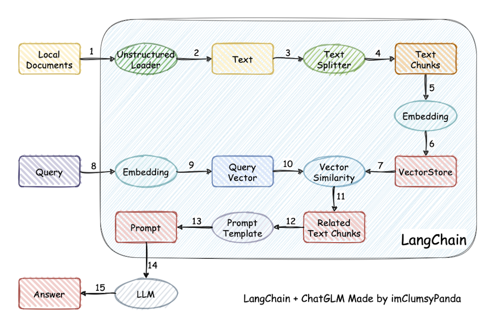

# AI

https://huggingface.co/learn/cookbook/index

## Agents

LLM 本质上是一个概率预测模型，它在处理复杂任务时存在天然的局限。Agent 的出现，主要解决了以下四个核心痛点：

1. 从“纸上谈兵”到“落地执行”（落地行动力）

   问题： LLM 只能输出文本。如果你让它“帮我定一张去上海的机票”，它会给你写一段很完美的定机票攻略，但它无法真的帮你下单。

   Agent 的解决方案： 工具使用（Tool Use / Function Calling）。
   Agent 拥有一套“工具箱”（API、脚本、搜索插件）。当它意识到任务需要执行特定操作时，它不再只是生成文本，而是生成一段符合规范的代码或调用指令。

   例子： Agent 可以调用携程 API 查询航班、调用支付接口下单、调用邮件系统给你发确认函。

2. 突破“知识幻觉”与“时效限制”（实时感知力）

   问题： LLM 的知识停留在训练数据截止的那一天。面对瞬息万变的新闻、股票行情或私有文档，它容易胡编乱造（幻觉）。

   Agent 的解决方案： RAG（检索增强生成）与动态搜索。
   Agent 像是一个拥有“搜索权限”的调查员。在回答问题前，它会先去互联网或企业数据库中“查资料”，把最准确、最新的信息抓回来，再进行总结。

   价值： 极大地降低了幻觉率，让模型具备了处理实时信息的能力。

3. 处理复杂、长链路任务（逻辑规划力）

   问题： LLM 擅长处理单次对话，但面对需要几十步才能完成的复杂项目（比如“帮我写一个完整的小游戏并部署到服务器”），模型往往会“顾头不顾尾”，甚至在中途迷失方向。

   Agent 的解决方案： 规划（Planning）与自省（Reflection）。
   Agent 会利用 ReAct、Chain of Thought (CoT) 等框架，将大目标拆解为子任务：

   拆解： 先写后端逻辑，再写前端 UI，最后写部署脚本。

   自我修正： 运行代码报错了？Agent 会根据报错信息自动修改代码并重试，而不是等着用户来纠错。

4. 弥补“瞬时记忆”的不足（长期记忆力）

   问题： LLM 的上下文窗口（Context Window）是有限的。对话久了，它会忘了你几小时前说过的话，或者在处理超长项目时丢掉关键细节。

   Agent 的解决方案： 外部存储（Memory）。
   Agent 通常配备了向量数据库作为“长期记忆”。它会将重要的对话历史、用户偏好、项目背景存储起来。

   价值： 就像一个老助理，它记得你昨天的进度，也记得你偏好的代码风格，提供持续性的服务。

### 相关工具

- smolagents：https://huggingface.co/learn/agents-course

## RAG（Retrieval-augmented Generation）

在大型语言模型（LLM）的发展过程中，RAG（Retrieval-Augmented Generation，检索增强生成） 的出现主要是为了解决原生大模型在实际应用中的三大“致命伤”。

1. 解决“幻觉”问题 (Hallucination)

   LLM 本质上是基于概率的文字预测机器。当它面对不确定的事实或知识盲区时，往往会表现得非常自信地“一本正经胡说八道”。
    - RAG 的作用： 它要求模型在生成回答之前，先从可靠的外部知识库中提取事实。模型不再仅仅依赖内部权重生成的概率，而是基于检索到的原文内容进行总结和推理。
    - 效果： 极大地降低了虚假信息的产生，使回答有据可依。

2. 解决知识的滞后性 (Outdated Knowledge)

   模型的训练是一个极其昂贵且耗时的过程。GPT-4 或 Claude 等模型都有一个“知识截止日期”（Knowledge Cutoff），它们不知道在那之后发生的新闻、新技术或新政策。
    - RAG 的作用： 你不需要为了让模型知道昨天发生的事而重新训练它。你只需要把最新的文档、新闻或数据放入 RAG 的矢量数据库中。
    - 效果： 赋予了 LLM “即时记忆”，使其能够处理实时信息。

3. 解决私有/行业数据缺失 (Privacy & Domain Knowledge)

   通用大模型虽然博学，但它们没有访问过企业的内部文档、个人笔记或特定行业的机密协议。
    - RAG 的作用： 企业可以将私有的 PDF、Wiki、代码库等转换为向量并存储。当用户提问时，系统先从这些私有数据中检索相关片段，再交给 LLM 处理。
    - 效果： 在不泄露权重、无需昂贵微调的前提下，让模型成为了解你公司业务的“专家”。

这是一个典型的 RAG（Retrieval-Augmented Generation）流程示意图（用 LangChain 术语画的）。可以分成两段：索引阶段（1–7） 和 查询阶段（8–15）。逐步说明如下：

### RAG 的核心流程

#### 索引阶段（离线/预处理）

1. Local Documents
   原始资料来源：PDF、DOCX、网页、Markdown、数据库导出等。
2. Unstructured Loader
   用加载器把各种格式解析成纯文本（也可带元数据，如来源、页码、时间戳）。
3. Text
   已解析的长文本。
4. Text Splitter
   按长度/语义把长文本切成「块」（chunk），常见策略：定长窗口+重叠（防止语义断裂）。
5. Embedding
   对每个文本块计算向量表示（embedding），同一模型后续也会用于查询。
6. VectorStore
   把（向量、原文片段、元数据）写入向量数据库（FAISS、Chroma、Milvus、Pinecone 等）。
7. （承上）
   存储完成，等待检索。

#### 查询阶段（在线）

8. Query
   用户问题输入。
9. Embedding（for Query）
   用同一/兼容的 embedding 模型把问题转为查询向量。
10. Vector Similarity
    在向量库中做相似度检索（kNN、相似度阈值、混合检索等）。
11. Related Text Chunks
    返回与问题最相近的若干文本块（通常还会做去重/重排、基于元数据过滤）。
12. Prompt Template
    把「检索到的文本块」填入预设提示模板（包含指令、格式要求、引用规范等）。
13. Prompt
    生成喂给大模型的最终提示（= 指令 + 上下文片段 + 用户问题）。
14. LLM
    大语言模型依据提示进行生成（回答、推理、代码、摘要等）。
15. Answer
    输出给用户的答案；可附来源、引用片段、置信度等。

### RAG 的优势

- 减少幻觉（hallucination）：模型不必完全“瞎编”，而是可以基于真实资料回答。
- 动态更新知识：只需更新外部知识库，而不必重新训练模型。
- 可解释性强：回答可附带引用出处，让用户知道信息来源。

### 应用场景

- 企业内部知识问答（如客服机器人，接入公司文档）
- 医学、法律咨询（需要精确引用专业资料）
- 学术搜索与辅助写作（基于论文库回答）
- 实时信息获取（如结合数据库、API 提供最新数据）

### 相关工具

- FAISS（Facebook AI Similarity Search）

## MCP

在 AI Agent 的开发生态中，MCP（Model Context Protocol，模型上下文协议） 的出现主要是为了解决 “生态碎片化” 和 “数据孤岛” 这两个核心痛点。

简单来说，在 MCP 出现之前，如果你想让不同的 AI Agent（比如 Claude、GPT-4）接入同一个数据库或工具，你需要为每个 Agent 编写特定的对接代码。MCP 则提供了一个通用的“插头”标准。

1. 告别“一对一”的手工集成
   在没有 MCP 的情况下，开发者如果想让 AI 访问本地文件、GitHub 或 Slack，必须针对不同的模型框架（如 LangChain, AutoGPT, Semantic Kernel）重复编写集成逻辑。

   痛点： 适配成本极高，维护工作量巨大。

   MCP 的方案： 只要工具端实现了一次 MCP 接口，任何支持 MCP 的 Client（如 Claude Desktop, Cursor 等）都能直接调用，实现了一次开发，到处运行。

2. 标准化的上下文传输
   AI Agent 最难的部分不是调用工具，而是如何以模型“听得懂”的方式传递上下文（Context）。

   痛点： 不同的数据源返回的数据格式千差万别，模型容易产生幻觉或无法解析。

   MCP 的方案： 它规范了资源（Resources）、**提示词模板（Prompts）和工具（Tools）**的标准格式。模型可以清晰地知道哪些数据是可读的只读文档，哪些是可执行的操作。

3. 本地数据与云端模型的安全解耦
   以往要让云端大模型访问本地数据，往往需要复杂的权限管理或数据上传。

   痛点： 隐私风险大，实时性差。

   MCP 的方案： MCP Server 可以运行在用户的本地环境或私有网络中。模型（Client）通过协议发出指令，由本地的 MCP Server 执行具体的查询或读写操作。这意味着敏感数据可以留在本地，模型只获取处理后的结果。

## Skills

在 AI Agent（智能体）的架构中，Skills（技能） 本质上是给 AI 看的、可复用的“操作说明书 + 脚本资源”。

1. 优化上下文管理（Context Management）
   - 节省 Token 与提高效率： 相比于将所有指令塞进一个巨大的 AGENTS.md 文件，Skill 机制采用“目录式”加载。Agent 只在需要时“翻阅”对应的技能章节，避免了信息稀释，减少了模型的幻觉，同时也节省了上下文窗口。
   - 渐进式暴露： 仅在特定场景下按需加载相关指令，保证 AI 的专注度。
2. 知识的数字化与标准化（SOP 沉淀）
   - 隐性知识显性化： 将老员工脑子里的经验、开发习惯、特定项目的“坑”和最佳实践，转化成 AI 可读的 SOP（标准作业程序）。
   - 经验复用： 新任务或新成员接入时，通过调用 Skill（如 /skill-xxx），AI 能直接继承这些数字化沉淀的经验。
3. 实现定制化的“领域专家”功能
   - 弥补预训练不足： 大模型虽然博学，但不了解特定公司的私有 API 或细分业务。Skill 作为“胶水层”，能通过详细的操作指南和附属资源，让通用模型快速变成特定领域的专家。
   - 风格与约束控制： 能够精确控制 Agent 的代码风格、安全合规要求或品牌语气，确保输出符合项目规范。
4. 提升开发流程的可组合性与分发效率
   - 模块化与版本化： Skill 可以像软件库一样进行版本管理和跨项目复用。
   - 自动化发现： 现代工具（如 Claude Code, Cursor, Windsurf）可以根据约定好的目录结构（如 .agents/skills/）自动识别并加载技能，无需人工频繁手动输入 Prompt。
5. 作为一种“中间态”的生产力工具
   - 确定性与灵活性的平衡： 它是介于“纯 Prompt”和“硬编码函数”之间的一种形式。作者将其称为“可迭代的半确定函数”，可以通过不断反馈来优化 Skill 文件。
