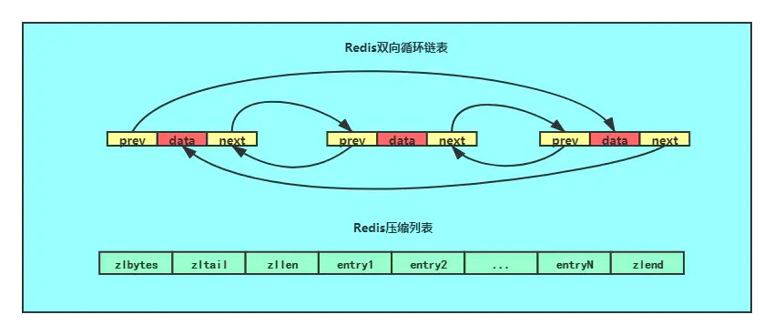
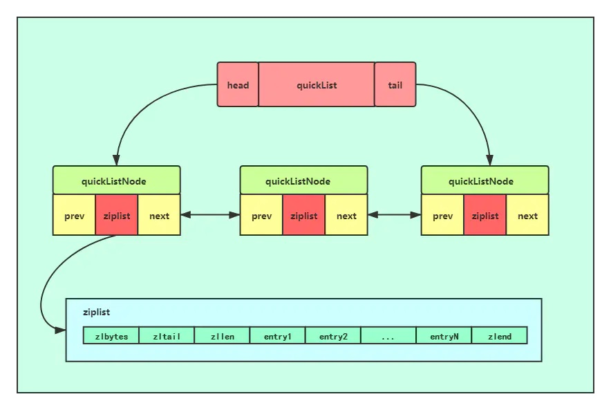
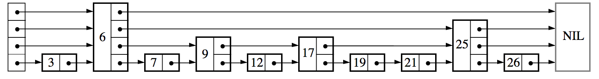
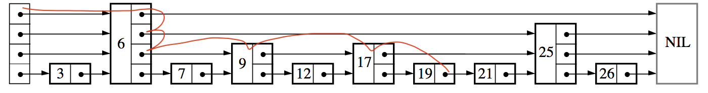
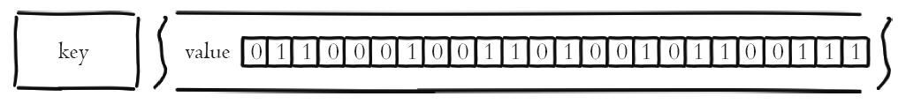
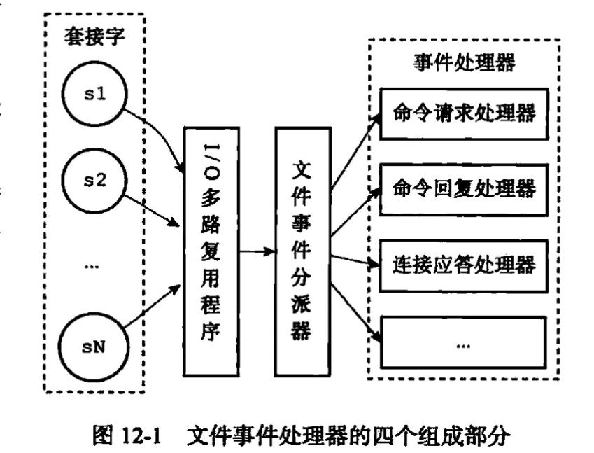
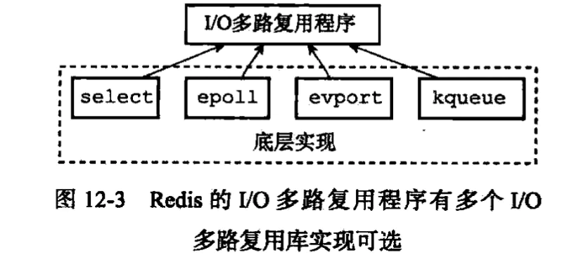
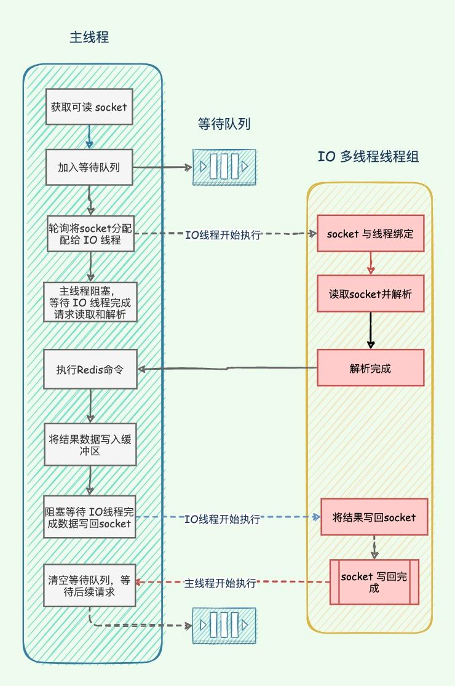

# Redis

## 数据类型

官方文档：[Redis data types](https://redis.io/docs/manual/data-types/)

### redisObject

在 Redis 中存在一个名为 redisObject 的结构体，此结构基本上可以表示所有基本的Redis数据类型，如：strings、lists、sets、sorted sets等。

它有一个`type`字段，表示给定对象的类型，`encodeing`字段表示对象的储存方式，还有一个`refcount`，这样就可以在多个位置引用同一个对象，而无需多次分配它。
最后，`ptr`字段指向对象的实际表示，根据所使用的编码，即使对于相同的类型，也可能有所不同。

[server.h#redisObject](https://github.com/redis/redis/blob/7.0/src/server.h#L845)

```c
typedef struct redisObject {
    unsigned type:4;
    unsigned encoding:4;
    /* LRU time (relative to global lru_clock) or
     * LFU data (least significant 8 bits frequency
     * and most significant 16 bits access time). */
    unsigned lru:LRU_BITS; 
    int refcount;
    void *ptr;
} robj;
```

[server.h#object](https://github.com/redis/redis/blob/7.0/src/server.h#L638)

```c
/* The actual Redis Object */
#define OBJ_STRING 0    /* String object. */
#define OBJ_LIST 1      /* List object. */
#define OBJ_SET 2       /* Set object. */
#define OBJ_ZSET 3      /* Sorted set object. */
#define OBJ_HASH 4      /* Hash object. */
```

[server.h#encoding](https://github.com/redis/redis/blob/7.0/src/server.h#L825)

```c
/* Objects encoding. Some kind of objects like Strings and Hashes can be
 * internally represented in multiple ways. The 'encoding' field of the object
 * is set to one of this fields for this object. */
#define OBJ_ENCODING_RAW 0     /* Raw representation */
#define OBJ_ENCODING_INT 1     /* Encoded as integer */
#define OBJ_ENCODING_HT 2      /* Encoded as hash table */
#define OBJ_ENCODING_ZIPMAP 3  /* No longer used: old hash encoding. */
#define OBJ_ENCODING_LINKEDLIST 4 /* No longer used: old list encoding. */
#define OBJ_ENCODING_ZIPLIST 5 /* No longer used: old list/hash/zset encoding. */
#define OBJ_ENCODING_INTSET 6  /* Encoded as intset */
#define OBJ_ENCODING_SKIPLIST 7  /* Encoded as skiplist */
#define OBJ_ENCODING_EMBSTR 8  /* Embedded sds string encoding */
#define OBJ_ENCODING_QUICKLIST 9 /* Encoded as linked list of listpacks */
#define OBJ_ENCODING_STREAM 10 /* Encoded as a radix tree of listpacks */
#define OBJ_ENCODING_LISTPACK 11 /* Encoded as a listpack */
```

### 字符串 String

String 是最基本的 Redis 数据类型，它是二进制安全的，这意味着它可以包含任何类型的数据，例如：JPEG 图像或序列化的对象。
字符串值的最大长度为`512MB`。

字符串类型的数据结构存储方式有三种：`int`、`embstr`、`raw`。

- `int`:
  若存储数据的类型是整数，例如`123`这样的数据，就会使用`int`的存储方式进行存储，此时 redisObject 的`type`的值为`OBJ_STRING`，
  `encoding`的值为`OBJ_ENCODING_INT`。数据修改后类型不再是整数或者长度超过2^63-1时，会将`int`编码修改为`raw`编码。

- `embstr`:
  若存储数据的类型是字符串，且长度小于等于`44`个字节，就会使用`embstr`的存储方式进行存储，此时 redisObject 的`type`的值为`OBJ_STRING`，
  `encoding`的值为`OBJ_ENCODING_EMBSTR`。

- `raw`:
  若存储数据的类型是字符串，且长度大于`44`个字节，就会使用`raw`的存储方式进行存储，此时 redisObject 的`type`的值为`OBJ_STRING`，
  `encoding`的值为`OBJ_ENCODING_RAW`。

#### SDS (Simple Dynamic Strings) 简单动态字符串

`embstr`和`raw`相同点：

- `embstr`和`raw`都使用 redisObject 和 sdshdr 来表示字符串对象。

`embstr`和`raw`不相同点：

- `embstr`会申请一块连续的内存，使得 redisObject 和 sdshdr 处于同一个连续的空间，所以在释放内存时 redisObject 和 sdshdr 会被同时释放。
- `embstr`字符串是不可修改的，所以修改字符串会重新申请内存。
- `raw`会分别为 redisObject 和 sdshdr 申请内存，所以内存不一定是连续的。
- `raw`字符串是可修改的，当修改后的长度溢出时，会为 sdshdr 重新申请内存。

`SDS`数据结构如下：

```c
struct __attribute__ ((__packed__)) sdshdr64 {
    uint64_t len; /* used */
    uint64_t alloc; /* excluding the header and null terminator */
    unsigned char flags; /* 3 lsb of type, 5 unused bits */
    char buf[];
};
```

`SDS`与C语言的字符串相比有以下几点优势：

| SDS | C语言字符串 |
|:----|:-----------|
| 获取字符串长度读取`len`的值即可，时间复杂度变为`O(1)` | 不记录字符串长度，因此需要每次遍历，时间的复杂度是`O(n)` |
| 提供`空间预分配`和`惰性空间释放`两种策略在为字符串分配空间时，分配的空间比实际多，<br/>这样就能减少连续执行字符串增长带来内存重新分配的次数。<br/>当字符串被缩短的时候，也不会立即回收不适用的空间，等后面使用的时候再释放 | 固定空间 |
| 拼接字符串前会根据`len`的值判断是否满足条件，若是空间不够会先进行扩容操作 | 字符串拼接时若是没有分配足够长度的内存空间会出现缓冲区溢出的情况 |
| 是二进制安全，除了可以储存字符串以外还可以储存二进制文件（如：图片、音频、视频等） | 字符串是以空字符串作为结束符，文件中可能含有结束符，因此不是二进制安全的 |

---

#### 为什么限制以44个字节为临界值？

Redis 为`type`是`embstr`的 redisObject 分配内存时，会申请64个字节，
在 Redis 3.2 之前的版本中，根据源码`sizeof(robj)+sizeof(struct sdshdr)+len+1`可得字符串实际可用长度为`64-16-8-1=39`。

_额外减`1`是因为字符串结束符`\0`占1个字节。_

```c
typedef struct redisObject {
    unsigned type:4;      // 0.5 字节
    unsigned encoding:4;  // 0.5 字节
    unsigned lru:LRU_BITS;// 3 字节
    int refcount;         // 4 字节
    void *ptr;            // 8 字节
} robj;                   // 共 16 字节
```

```c
// Redis < 3.2
struct sdshdr {
    unsigned int len; // 4 字节
    unsigned int free;// 4 字节
    char buf[];       // ? 字节
};                    // 共 8 字节
```

在 Redis 3.2 之后的版本中，对`sdshdr`结构体进行了优化，由原来的`8`字节变成了`3`字节，所以字符串实际可用长度为`64-16-3-1=44`

```c
// Redis >= 3.2
struct sdshdr8 {
    uint8_t len;         // 1 字节
    uint8_t alloc;       // 1 字节
    unsigned char flags; // 1 字节
    char buf[];          // ? 字节
};                       // 共 3 字节
```

_实际源码中直接定义了`embstr`临界值值，而非通过计算获得。_

[object.c#OBJ_ENCODING_EMBSTR_SIZE_LIMIT](https://github.com/redis/redis/blob/7.0/src/object.c#L119)

```c
/* Create a string object with EMBSTR encoding if it is smaller than
 * OBJ_ENCODING_EMBSTR_SIZE_LIMIT, otherwise the RAW encoding is
 * used.
 *
 * The current limit of 44 is chosen so that the biggest string object
 * we allocate as EMBSTR will still fit into the 64 byte arena of jemalloc. */
#define OBJ_ENCODING_EMBSTR_SIZE_LIMIT 44
```

总结：在 Redis 3.2 版本的之前是以`39`为界限，之后的版本是以`44`为界限。

### 列表 List

List 用于存储字符串，按插入顺序排序，可以将新元素添加到列表的头部（左侧）或尾部（右侧）。

在 Redis 3.2 之前的版本的列表是使用`ziplist`和`linkedlist`进行实现的。

- 当列表元素个数比较少并且每个元素占用空间比较小的时候使用`ziplist`。
- 当列表元素个数比较多或者某个元素占用空间比较大的时候使用`linkedlist`。

在 Redis 3.2 之后的版本使用了`quicklist`代替了`ziplist`和`linkedlist`，原因是`linkedlist`的每节点附加空间相对太高，
例如每个节点的`prev`和`next`指针占`16`个字节（64位系统的指针占`8`个字节），且分别为每个节点申请内存，导致内存碎片化，进而影响内存管理效率。

实际上，`quicklist`是以`ziplist`为节点的链表，将链表按段切分，每一段使用内存连续的`ziplist`进行存储，多个`ziplist`通过`prev`和`next`指针组成的双向链表。
它结合了`ziplist`和`linkedlist`的优势，压缩了内存的使用量，进一步提高了性能。

#### linkedlist 链表

源码：[adlist.h](https://github.com/redis/redis/blob/7.0/src/adlist.h#L47)



#### ziplist 压缩列表

源码：[ziplist.c](https://github.com/redis/redis/blob/7.0/src/ziplist.c)


#### quicklist 快速列表

源码：[quicklist.h](https://github.com/redis/redis/blob/7.0/src/quicklist.h#L105)



既然`quicklist`本质上是将`ziplist`连接起来，那么每个`ziplist`存放多少的元素比较合适呢？

- 太少：起不到应有的作用，若每个`ziplist`只储存`1`个元素，就退化成了`linkedlist`。
- 太多：性能差，若当前`quicklist`只存在`1`个`ziplist`，就退化成了`ziplist`。

Redis 默认配置的每个`ziplist`的大小为`8Kb`，超过这个大小时会创建一个新的`ziplist`。
该大小可以通过修改`redis.conf`文件的`list-max-ziplist-size`配置来调整。

[redis.conf#list-max-listpack-size](https://github.com/redis/redis/blob/7.0/redis.conf#L1929)

```bash
# Lists are also encoded in a special way to save a lot of space.
# The number of entries allowed per internal list node can be specified
# as a fixed maximum size or a maximum number of elements.
# For a fixed maximum size, use -5 through -1, meaning:
# -5: max size: 64 Kb  <-- not recommended for normal workloads
# -4: max size: 32 Kb  <-- not recommended
# -3: max size: 16 Kb  <-- probably not recommended
# -2: max size: 8 Kb   <-- good
# -1: max size: 4 Kb   <-- good
# Positive numbers mean store up to _exactly_ that number of elements
# per list node.
# The highest performing option is usually -2 (8 Kb size) or -1 (4 Kb size),
# but if your use case is unique, adjust the settings as necessary.
list-max-listpack-size -2
```

为了进一步节约内存，还可以使用`LZF`压缩算法对`ziplist`进行压缩存储。
若一个`ziplist`被压缩，那么从中读取数据前需要先解压，因此性能会有所下降。

- 压缩深度为`0`时，不会对任何节点进行压缩。
- 压缩深度为`1`时，`quicklist`的`head`和`tail`节点不会被压缩，这样可以有效地提高`push`和`pop`操作的性能。
- 压缩深度为`2`时，`quicklist`的首尾各`2`个节点（共`4`个）不会被压缩。
- 压缩深度为`3`时，`quicklist`的首尾各`3`个节点（共`6`个）不会被压缩。
- 以此类推。

压缩深度可以通过修改`redis.conf`文件的`list-compress-depth`配置来调整。
默认值为`0`，即不启用压缩功能。

[redis.conf#list-compress-depth](https://github.com/redis/redis/blob/7.0/redis.conf#L1945)

```bash
# Lists may also be compressed.
# Compress depth is the number of quicklist ziplist nodes from *each* side of
# the list to *exclude* from compression.  The head and tail of the list
# are always uncompressed for fast push/pop operations.  Settings are:
# 0: disable all list compression
# 1: depth 1 means "don't start compressing until after 1 node into the list,
#    going from either the head or tail"
#    So: [head]->node->node->...->node->[tail]
#    [head], [tail] will always be uncompressed; inner nodes will compress.
# 2: [head]->[next]->node->node->...->node->[prev]->[tail]
#    2 here means: don't compress head or head->next or tail->prev or tail,
#    but compress all nodes between them.
# 3: [head]->[next]->[next]->node->node->...->node->[prev]->[prev]->[tail]
# etc.
list-compress-depth 0
```

#### LZF 压缩算法

_TODO_

### 集合 Set

Set 与 List 类似，都可以用于存储字符串。不同的是，List 可以存储相同的字符串，是有序的；而 Set 不允许存储重复的字符串，是无序的。

Set 底层实现是基于`hash table`和`intset`实现的，分别对应`encoding`为`OBJ_ENCODING_HT`和`OBJ_ENCODING_INTSET`。

#### 整数集合 intset

`intset`用于保存整数类型的数据结构，源码如下：

```c
/* Note that these encodings are ordered, so:
 * INTSET_ENC_INT16 < INTSET_ENC_INT32 < INTSET_ENC_INT64. */
#define INTSET_ENC_INT16 (sizeof(int16_t))
#define INTSET_ENC_INT32 (sizeof(int32_t))
#define INTSET_ENC_INT64 (sizeof(int64_t))

typedef struct intset {
    uint32_t encoding;
    uint32_t length;
    int8_t contents[];
} intset;
```

结构体中，定义了三个属性：

- `encoding`：编码方式，支持`int16_t`、`int32_t`和`int64_t`整数类型
- `length`：集合长度
- `contents`：储存元素的数组

因为`intset`是有序的，所以通过对比`contents`中首尾两个数（即最小值和最大值）便可以初步判断元素否存在。然后通过二分法在数组中可以快速定位元素的位置。

应用场景：去重、抽奖、点赞、关注

#### hash table

跳转至[哈希 Hash](#哈希-Hash)

### 有序集合 Sorted Set

Sorted Set 与 Set 类似，都不允许存储重复的字符串。不同的是，Sorted Set 是有序的。

Sorted Set 底层实现是基于`skiplist`和`ziplist`实现的，对应`encoding`为`OBJ_ENCODING_SKIPLIST`和`OBJ_ENCODING_ZIPLIST`。

#### skiplist

`skiplist`是一种有序的数据结构，它通过每一个节点维持多个指向其他节点的指针，从而达到快速访问的目的。

相比一般的链表，有更高的查找效率，链表并不能像数组随机访问，只能从头一个个遍历。跳表为节点设置了快速访问的指针，可以跨越节点进行访问，这也是跳表的名字的含义。
跳表的性能可比拟二叉查找树，平均期望的查找、插入、删除时间复杂度都是`O(logn)`，许多知名的开源软件（库）中的数据结构均采用了跳表这种数据结构。

数据结构如下：



当插入一个数据时，随机生成这个节点的高度，每新增一层的概率为`p`，为了防止极端情况高度过高，会设定一个最大高度。

```java
int randomLevel() {
    int level = 1;
    while (rand() >= p)
        level++;
    return level > MAX_LEVEL ? MAX_LEVEL : level;
}
```



搜索时从最高的层级的节点开始查找，通过节点进行跳跃，而不是一个个的遍历。

#### 作者用 SkipList 而不用 Red–black tree 或 AVL tree 或 B-tree 的原因

1. `SkipList`不是很占用内存。这基本上取决于你。更改有关节点具有给定数量级别的概率的参数将使内存密集度低于`B-tree`。
2. `Sorted Set`往往是很多`ZRANGE`或`ZREVRANGE`操作的目标，即把`SkipList`作为链表遍历，此操作的缓存局部性至少与其他类型的平衡树一样好。
3. `SkipList`更易于实现、调试。例如，由于跳过列表的简单性，我们收到了一个补丁，实现了复杂度为`O(logn)`的`ZRANK`的扩展，只需要对代码进行少量更改。

我们的经验表明，Redis 主要受 I/O 限制。假设您的操作速度如此之快以至于可以使单个核心饱和，可以运行多个 Redis 实例，并使用 Redis Cluster 解决方案。

应用场景：排行榜、滑动窗口限流

### 哈希 Hash

Hash 底层实现是基于`hash table`和`ziplist`，`hash table`的实现原理类似于`HashMap`的底层原理。

### 位图 Bitmap

Bitmap 是用一个比特位来映射某个元素的状态。由于一个比特位只能表示 0 和 1 两种状态，所以 Bitmap 能映射的状态有限，但是使用比特位的优势是能大量的节省内存空间。
在 Redis 中，可以把 Bitmap 想象成一个以比特位为单位的数组，数组的每个单元只能存储0和1，数组的下标在 Bitmap 中叫做偏移量。



应用场景：用户签到、统计数量、用户在线状态、实现布隆过滤器

### HyperLogLog

HyperLogLog 是用来做基数统计的算法，HyperLogLog 的优点是，在输入元素的数量或者体积非常非常大时，计算基数所需的空间总是固定的、并且是很小的。

在 Redis 里面，每个 HyperLogLog 键只需要花费 12 KB 内存，就可以计算接近 2^64 个不同元素的基数。这和计算基数时，元素越多耗费内存就越多的集合形成鲜明对比。
但是，因为 HyperLogLog 只会根据输入元素来计算基数，而不会储存输入元素本身，所以 HyperLogLog 不能像集合那样，返回输入的各个元素。

### Stream

Stream 是 Redis 5.0 版本新增加的数据结构。

Stream 主要用于消息队列（MQ，Message Queue），Redis 本身是有一个 Redis 发布订阅 (pub/sub) 来实现消息队列的功能，但它有个缺点就是消息无法持久化，如果出现网络断开、Redis 宕机等，消息就会被丢弃。简单来说发布订阅 (pub/sub) 可以分发消息，但无法记录历史消息。

而 Stream 提供了消息的持久化和主备复制功能，可以让任何客户端访问任何时刻的数据，并且能记住每一个客户端的访问位置，还能保证消息不丢失。

### Geospatial indexes

GEO 是 Redis 3.2 版本新增加的数据结构。

GEO 主要用于存储地理位置信息，并对存储的信息进行操作。

## 命令

### 键命令 Key Commands

- `DEL key`：该命令用于在 key 存在时删除 key
- `DUMP key`：序列化给定 key ，并返回被序列化的值
- `EXISTS key`：检查给定 key 是否存在
- `EXPIRE key seconds`：为给定 key 设置过期时间，以秒计
- `EXPIREAT key timestamp`：EXPIREAT 的作用和 EXPIRE 类似，都用于为 key 设置过期时间。 不同在于 EXPIREAT 命令接受的时间参数是 UNIX 时间戳(unix timestamp)
- `PEXPIRE key milliseconds`：设置 key 的过期时间以毫秒计
- `PEXPIREAT key milliseconds-timestamp`：设置 key 过期时间的时间戳(unix timestamp) 以毫秒计
- `KEYS pattern`：查找所有符合给定模式( pattern)的 key
- `MOVE key db`：将当前数据库的 key 移动到给定的数据库 db 当中
- `PERSIST key`：移除 key 的过期时间，key 将持久保持
- `PTTL key`：以毫秒为单位返回 key 的剩余的过期时间
- `TTL key`：以秒为单位，返回给定 key 的剩余生存时间(TTL, time to live)
- `RANDOMKEY`：从当前数据库中随机返回一个 key
- `RENAME key newkey`：修改 key 的名称
- `RENAMENX key newkey`：仅当 newkey 不存在时，将 key 改名为 newkey
- `SCAN cursor [MATCH pattern] [COUNT count]`：迭代数据库中的数据库键
- `TYPE key`：返回 key 所储存的值的类型

### 字符串命令 String Commands

- `SET key value`：设置指定 key 的值
- `GET key`：获取指定 key 的值
- `GETRANGE key start end`：返回 key 中字符串值的子字符
- `GETSET key value`：将给定 key 的值设为 value ，并返回 key 的旧值(old value)
- `GETBIT key offset`：对 key 所储存的字符串值，获取指定偏移量上的位(bit)
- `MGET key1 [key2..]`：获取所有(一个或多个)给定 key 的值
- `SETBIT key offset value`：对 key 所储存的字符串值，设置或清除指定偏移量上的位(bit)
- `SETEX key seconds value`：将值 value 关联到 key ，并将 key 的过期时间设为 seconds (以秒为单位)
- `SETNX key value`：只有在 key 不存在时设置 key 的值
- `SETRANGE key offset value`：用 value 参数覆写给定 key 所储存的字符串值，从偏移量 offset 开始
- `STRLEN key`：返回 key 所储存的字符串值的长度
- `MSET key value [key value ...]`：同时设置一个或多个 key-value 对
- `MSETNX key value [key value ...]`：同时设置一个或多个 key-value 对，当且仅当所有给定 key 都不存在
- `PSETEX key milliseconds value`：这个命令和 SETEX 命令相似，但它以毫秒为单位设置 key 的生存时间，而不是像 SETEX 命令那样，以秒为单位
- `INCR key`：将 key 中储存的数字值增一
- `INCRBY key increment`：将 key 所储存的值加上给定的增量值（increment）
- `INCRBYFLOAT key increment`：将 key 所储存的值加上给定的浮点增量值（increment）
- `DECR key`：将 key 中储存的数字值减一
- `DECRBY key decrement`：key 所储存的值减去给定的减量值（decrement）
- `APPEND key value`：如果 key 已经存在并且是一个字符串， APPEND 命令将指定的 value 追加到该 key 原来值（value）的末尾。

### 列表命令 List Commands

- `BLPOP key1 [key2 ] timeout`：移出并获取列表的第一个元素， 如果列表没有元素会阻塞列表直到等待超时或发现可弹出元素为止
- `BRPOP key1 [key2 ] timeout`：移出并获取列表的最后一个元素， 如果列表没有元素会阻塞列表直到等待超时或发现可弹出元素为止
- `BRPOPLPUSH source destination timeout`：从列表中弹出一个值，将弹出的元素插入到另外一个列表中并返回它； 如果列表没有元素会阻塞列表直到等待超时或发现可弹出元素为止
- `LINDEX key index`：通过索引获取列表中的元素
- `LINSERT key BEFORE|AFTER pivot value`：在列表的元素前或者后插入元素
- `LLEN key`：获取列表长度
- `LPOP key`：移出并获取列表的第一个元素
- `LPUSH key value1 [value2]`：将一个或多个值插入到列表头部
- `LPUSHX key value`：将一个值插入到已存在的列表头部
- `LRANGE key start stop`：获取列表指定范围内的元素
- `LREM key count value`：移除列表元素
- `LSET key index value`：通过索引设置列表元素的值
- `LTRIM key start stop`：对一个列表进行修剪(trim)，就是说，让列表只保留指定区间内的元素，不在指定区间之内的元素都将被删除
- `RPOP key`：移除列表的最后一个元素，返回值为移除的元素
- `RPOPLPUSH source destination`：移除列表的最后一个元素，并将该元素添加到另一个列表并返回
- `RPUSH key value1 [value2]`：在列表中添加一个或多个值
- `RPUSHX key value`：为已存在的列表添加值

### 集合命令 Set Commands

- `SADD key member1 [member2]`：向集合添加一个或多个成员
- `SCARD key`：获取集合的成员数
- `SDIFF key1 [key2]`：返回第一个集合与其他集合之间的差异
- `SDIFFSTORE destination key1 [key2]`：返回给定所有集合的差集并存储在 destination 中
- `SINTER key1 [key2]`：返回给定所有集合的交集
- `SINTERSTORE destination key1 [key2]`：返回给定所有集合的交集并存储在 destination 中
- `SISMEMBER key member`：判断 member 元素是否是集合 key 的成员
- `SMEMBERS key`：返回集合中的所有成员
- `SMOVE source destination member`：将 member 元素从 source 集合移动到 destination 集合
- `SPOP key`：移除并返回集合中的一个随机元素
- `SRANDMEMBER key [count]`：返回集合中一个或多个随机数
- `SREM key member1 [member2]`：移除集合中一个或多个成员
- `SUNION key1 [key2]`：返回所有给定集合的并集
- `SUNIONSTORE destination key1 [key2]`：所有给定集合的并集存储在 destination 集合中
- `SSCAN key cursor [MATCH pattern] [COUNT count]`：迭代集合中的元素

### 有序集合命令 Sorted Set Commands

- `ZADD key score1 member1 [score2 member2]`：向有序集合添加一个或多个成员，或者更新已存在成员的分数
- `ZCARD key`：获取有序集合的成员数
- `ZCOUNT key min max`：计算在有序集合中指定区间分数的成员数
- `ZINCRBY key increment member`：有序集合中对指定成员的分数加上增量 increment
- `ZINTERSTORE destination numkeys key [key ...]`：计算给定的一个或多个有序集的交集并将结果集存储在新的有序集合 destination 中
- `ZLEXCOUNT key min max`：在有序集合中计算指定字典区间内成员数量
- `ZRANGE key start stop [WITHSCORES]`：通过索引区间返回有序集合指定区间内的成员
- `ZRANGEBYLEX key min max [LIMIT offset count]`：通过字典区间返回有序集合的成员
- `ZRANGEBYSCORE key min max [WITHSCORES] [LIMIT]`：通过分数返回有序集合指定区间内的成员
- `ZRANK key member`：返回有序集合中指定成员的索引
- `ZREM key member [member ...]`：移除有序集合中的一个或多个成员
- `ZREMRANGEBYLEX key min max`：移除有序集合中给定的字典区间的所有成员
- `ZREMRANGEBYRANK key start stop`：移除有序集合中给定的排名区间的所有成员
- `ZREMRANGEBYSCORE key min max`：移除有序集合中给定的分数区间的所有成员
- `ZREVRANGE key start stop [WITHSCORES]`：返回有序集中指定区间内的成员，通过索引，分数从高到低
- `ZREVRANGEBYSCORE key max min [WITHSCORES]`：返回有序集中指定分数区间内的成员，分数从高到低排序
- `ZREVRANK key member`：返回有序集合中指定成员的排名，有序集成员按分数值递减(从大到小)排序
- `ZSCORE key member`：返回有序集中，成员的分数值
- `ZUNIONSTORE destination numkeys key [key ...]`：计算给定的一个或多个有序集的并集，并存储在新的 key 中
- `ZSCAN key cursor [MATCH pattern] [COUNT count]`：迭代有序集合中的元素（包括元素成员和元素分值）

### 哈希命令 Hash Commands

- `HDEL key field1 [field2]`：删除一个或多个哈希表字段
- `HEXISTS key field`：查看哈希表 key 中，指定的字段是否存在
- `HGET key field`：获取存储在哈希表中指定字段的值
- `HGETALL key`：获取在哈希表中指定 key 的所有字段和值
- `HINCRBY key field increment`：为哈希表 key 中的指定字段的整数值加上增量 increment
- `HINCRBYFLOAT key field increment`：为哈希表 key 中的指定字段的浮点数值加上增量 increment
- `HKEYS key`：获取所有哈希表中的字段
- `HLEN key`：获取哈希表中字段的数量
- `HMGET key field1 [field2]`：获取所有给定字段的值
- `HMSET key field1 value1 [field2 value2 ]`：同时将多个 field-value (域-值)对设置到哈希表 key 中
- `HSET key field value`：将哈希表 key 中的字段 field 的值设为 value
- `HSETNX key field value`：只有在字段 field 不存在时，设置哈希表字段的值
- `HVALS key`：获取哈希表中所有值
- `HSCAN key cursor [MATCH pattern] [COUNT count]`：迭代哈希表中的键值对

### 位图命令 Bitmap Commands

- `SETBIT key offset value`：设置 value
- `GETBIT key offset`：获取 value
- `BITCOUNT key [start] [end]`：获取指定范围内值为 1 的个数
- `BITOP [operations] [result] [key ...]`：运算操作
- `BITPOS key value`：获取第一次出现 value 的位置

### HyperLogLog Commands

- `PFADD key element [element ...]`：添加指定元素到 HyperLogLog 中。
- `PFCOUNT key [key ...]`：返回给定 HyperLogLog 的基数估算值。
- `PFMERGE destkey sourcekey [sourcekey ...]`：将多个 HyperLogLog 合并为一个 HyperLogLog

## 过期策略

Redis 的过期策略采用定期删除和惰性删除结合的方式。

### 定期删除

默认情况下，Redis 每秒进行 10 次过期扫描，随机抽取一些设置过期时间的 key ，删除其中已经过期的 key ，如果过期的比例超过`25%`，则重复随机抽取操作。
同时，为了保证过期扫描不会出现循环过度，导致线程卡死现象，还增加了扫描时间的上限，默认不会超过 25ms。

### 惰性删除

客户端操作某个指定的 key 时，判断该 key 是否已过期，过期则清除。该策略可以最大化地节省 CPU 资源，却对内存非常不友好。

## 内存淘汰策略

Redis 默认内存淘汰策略配置为`noeviction`，表示在内存不足以新写入数据时，会返回错误给客户端。

```text
# 最大内存，单位为 bytes
maxmemory <bytes>
# 内存淘汰策略，默认为 noeviction
maxmemory-policy noeviction
```

Redis 提供了多种内存淘汰策略选项，用户可以根据需求选择其中一个：

- `volatile-lru`：使用 LRU 算法移除被设置了超时时间的 keys
- `allkeys-lru`：使用 LRU 算法移除任意 keys
- `volatile-lfu`：使用 LFU 算法移除被设置了超时时间的 keys
- `allkeys-lfu`：使用 LFU 算法移除任意 keys
- `volatile-random`：随机移除被设置了超时时间的 keys
- `allkeys-random`：随机移除任意 keys
- `volatile-ttl`：根据过期时间先后顺序进行移除，即优先移除存活时间最短的 keys
- `noeviction`：不移除任何 keys，写入操作时返回错误

### LRU LFU

- LRU（Least Recently Used）：最近最少使用，如果数据最近被访问过，那么将来被访问的几率也更高。
- LFU（Least Frequently Used）：最不经常使用，如果一个数据在最近一段时间内使用次数很少，那么在将来一段时间内被使用的可能性也很小。

## 持久化

### RDB Redis Database

以指定的时间间隔将内存中的数据集以快照形式写入磁盘。

默认情况下，Redis 将数据集的快照保存在磁盘上的一个名为`dump.rdb`的二进制文件中。

Redis提供了`SAVE`或`BGSAVE`命令来创建 RDB 文件

- `SAVE`：会阻塞Redis服务器进程，直到 RDB 文件创建完毕为止，在服务器进程阻塞期间，服务器不能处理任何命令请求。
- `BGSAVE`（默认）：会派生出一个子进程，然后由子进程负责创建RDB文件，服务器进程（父进程）继续处理命令请求。

我们可以通过 Redis 服务器配置文件 的`save`选项设置多个保存条件，只要其中任意一个条件被满足，服务器就会执行`BGSAVE`命令，默认设置如下：

```text
# 在 900 秒内，至少进行了1次修改
save 900 1
# 在 300 秒内，至少进行了10次修改
save 300 10
# 在 60 秒内，至少进行了10000次修改
save 60 10000
```

在新版本中已经将`save`选项改为了一行配置：

```text
# 在 3600 秒内，至少进行了1次修改
# 在 300 秒内，至少进行了100次修改
# 在 60 秒内，至少进行了10000次修改
save 3600 1 300 100 60 10000
```

#### 优点

RDB 是 Redis 数据的一个非常紧凑的单文件。

RDB 文件非常适合备份。例如，每小时归档一次 RDB 文件，并在 30 天内每天保存一个 RDB 快照。这使得可以在发生灾难时轻松恢复不同版本的数据集。

RDB 最大限度地提高了 Redis 的性能，因为 Redis 父进程为了持久化而需要做的唯一工作就是派生一个将完成所有其余工作的子进程。父进程永远不会执行磁盘 I/O 或类似操作。

#### 缺点

如果您需要在 Redis 由于任何原因在没有正确关闭的情况下停止工作时（例如断电后）将数据丢失的可能性降到最低，那么 RDB 并不适合。
可以配置生成 RDB 的不同保存点。例如，在对数据集至少 5 分钟和 100 次写入之后。

RDB 需要经常`fork()`以便使用子进程在磁盘上持久化。如果数据集很大，`fork()`可能会很耗时，并且如果数据集很大并且 CPU 性能不是很好，可能会导致 Redis 停止为客户端服务几毫秒甚至一秒钟。

### AOF Append Only File

以日志的形式记录服务器收到的每个写入操作，将在服务器启动时再次播放，重建原始数据集。

Redis 服务器会根据配置文件中`appendfsync`选项来决定何时将 AOF 缓冲区中的内容写入文件中：

- `always`：每次将新命令附加到 AOF 时调用 fsync。效率最差，安全性最好。
- `everysec`（默认）：每秒调用 fsync。性能较好，如果发生故障，最多会丢失 1 秒的数据。
- `no`：永远不调用 fsync，只是把数据交给操作系统，通常，Linux 将使用此配置每 30 秒刷新一次数据。性能最佳，但是安全性最差。

#### 优点

使用 AOF Redis 更加持久：可以有不同的 fsync 策略：不使用 fsync、每秒 fsync、每次查询时 fsync。使用每秒 fsync 的默认策略，写入性能仍然很棒。
fsync 是使用后台线程执行的，当没有 fsync 正在进行时，主线程将执行写入，因此最差的情况会丢失一秒钟的数据。

AOF 日志是一个仅附加日志，因此不会出现寻道问题，也不会在断电时出现损坏问题。即使由于某种原因（磁盘已满或其他原因）日志以写一半的命令结束，redis-check-aof 工具也能够轻松修复它。

当 AOF 变得太大时，Redis 能够在后台自动重写 AOF。重写是完全安全的，因为当 Redis 继续附加到旧文件时，会使用创建当前数据集所需的最少操作集生成一个全新的文件，一旦第二个文件准备就绪，Redis 就会切换两者并开始附加到新的那一个。

AOF 以易于理解和解析的格式依次包含所有操作的日志。甚至可以轻松导出 AOF 文件。

#### 缺点

对于相同数量的数据集而言，AOF 文件通常要大于 RDB 文件。RDB 在恢复大数据集时的速度比 AOF 的恢复速度要快。

根据同步策略的不同，AOF 在运行效率上往往会慢于 RDB。

## 高可用

### Redis Master-Slave 主从模式

Redis Master-Slave 主要用于实现一主多从，读写分离的架构，主数据库（master）支持读写（read/write），从数据库（slave）支持只读（readonly）.
这种模式下，客户端直接连 master 或某个 slave，服务端崩溃故障，需要⼿动切换客户端连接。

Redis 主从复制分为全量同步和增量同步，首次同步为全量同步。

1. slave 连接至 master 后，发送`SYNC`命令
2. master 接收到`SYNC`命令后，开始执行`BGSAVE`命令生成 RDB 快照文件并使用缓冲区记录此后执行的所有写命令
3. master 执行`BGSAVE`命令完成后，向所有 slave 发送快照文件，并在发送期间继续记录被执行的写命令
4. slave 收到快照文件后丢弃所有旧数据，载入收到的快照
5. master 快照发送完毕后开始向 slave 发送缓冲区中的写命令
6. slave 完成对快照的载入，开始接收命令请求，并执行来自 master 缓冲区的写命令
7. slave 之后的同步会先发送自己`slave_repl_offset`位置，只同步增量数据

### Redis Sentinel 哨兵模式

Redis Master-Slave 模式下，一旦主节点由于故障不能提供服务，需要人工将从节点晋升为主节点，同时还要通知应用方更新主节点地址，对于很多应用场景这种故障处理的方法是无法接受的。
Redis 2.8 版本开始正式提供了哨兵模式来解决这个问题。

Redis Sentinel 是一个分布式架构，包含了三种角色：主节点（master）、从节点（slave）、哨兵节点（sentinel），哨兵节点为高可用集群管理者，它的功能主要是：监控、通知、故障转移。
每个哨兵节点会对数据节点和其余哨兵节点进行监控，当发现某个节点不可达时，会对标记节点为下线。
如果主节点不可达时，它还会和其他哨兵节点进行“协商”，当大多数哨兵节点都认为主节点不可达时，它们会选举出一个哨兵节点来完成自动故障转移的工作，同时会将这个变化通知给客户端。
整个过程完全是自动的，不需要人工来介入，所以这套方案很有效地解决了高可用问题。

#### 故障转移

1. 每个`哨兵节点`会定时向`主节点`发送`ping`命令进行心跳检测（也会向`从节点`和其他`哨兵节点`发送，这里不讨论），当`主节点`超过指定时间没有进行有效回复，该`哨兵节点`就会判定`主节点`为“主观下线”，同时会向其他`哨兵节点`询问对`主节点`的判断。
2. 如果超过“法定个数”（quorum）的`哨兵节点`都认定`主节点`为“主观下线”，`哨兵节点`就会判定该`主节点`为“客观下线”。
3. 多个`哨兵节点`会选举出一个`领导者`，由它负责进行故障转移。选择一个最优的`从节点`晋升为`新主节点`。如果，之后`原主节点`被重新激活，它将被降级为`从节点`。

领导者选举流程：

1. 每个在线的`哨兵节点`都有资格成为`领导者`，当它确认`主节点`“主观下线”时候，会向其他`哨兵节点`发送`sentinel is-master-down-by-addr`命令，询问对`主节点`的判断，并要求将自己设置为`领导者`。
2. 收到命令的`哨兵节点`，如果也判定`主节点`为“主观下线”，且没有同意过其他`哨兵节点`的命令，则同意该请求，否则拒绝。
3. 如果该`哨兵节点`发现自己的票数已经大于等于`max(quorum, num(sentinels)/2+1)`，那么它将成为`领导者`。
4. 如果此过程没有选举出`领导者`，将进入下一次选举。

法定个数（quorum）：一般设置为`哨兵节点`数量一半以上`(n/2+1)`的值比较合理。如果`哨兵节点`个数总数为`5`，则最好配置`quorum`为`3`。

#### 脑裂

在[故障转移](#故障转移)流程中，我们知道了当`主节点`被多个`哨兵节点`判断为“客观下线”时，会将一个`从节点`晋升为`新主节点`。
如果，在切换过程中，客户端仍然可以和`原主节点`保持通信，则说明`主节点`并没有真的发生故障（可能是`主节点`和`哨兵节点`之间网络不稳定），此时就会存在两个`主节点`，这样的情况被称为“脑裂”。

主从切换后，`从节点`一旦升级为`新主节点`，`哨兵节点`就会让`原主节点`执行`SLAVEOF`命令，全量同步`新主节点`的数据到`原主节点`。
在全量同步的最后阶段，`原主节点`需要清空本地的数据，加载`新主节点`发送的 RDB 文件，这样一来，`原主节点`在主从切换期间保存的数据就丢失了。

为了避免脑裂导致的数据丢失问题，可以通过配置`min-slaves-to-write`和`min-slaves-max-lag`参数降低数据丢失的概率。

如果，`主节点`连接的`从节点`数量小于`min-slaves-to-write`，且所有`从节点`数据复制时的`ACK`消息延迟均超过`min-slaves-max-lag`秒，`主节点`就会拒绝客户端的写请求，
发生脑裂时，`原主节点`拒绝客户端的写入请求，就可以减少数据同步之后的数据丢失。

```text
min-slaves-to-write 1
min-slaves-max-lag 10
```

新版本的`redis.conf`配置文件中的参数名改变：

```text
min-replicas-to-write 1
min-replicas-max-lag 10
```

### Redis Cluster 集群模式（推荐）

Redis Cluster 是由多个主从节点群组成的分布式服务器群，其特点如下：

- 多主多从去中心化：至少需要6个节点（即3主3从），从节点只作备份和故障转移用，不分担读请求的任务，当有请求读向从节点时，会被重定向对应的主节点来处理
- 节点之间相互通信：主节点之间相互“监督”，保证及时故障转移
- 支持动态扩容缩容：在对集群进行扩容和缩容时，需要对槽及槽中数据进行迁移
- 多 key 操作限制：由于数据分散在多个节点，因此多 key 操作只有在同一个 slot 时才能被执行
- 只支持一个数据库：只支持使用一个数据库（database 0），所以 select 命令不能用

Redis Cluster 将所有数据划分为 16384 个 slots（槽位），每个节点负责其中一部分槽位。槽位的信息存储于每个节点中。
当客户端来连接集群时，它也会得到一份集群的槽位配置信息并将其缓存在客户端本地。这样当客户端要查找某个 key 时，可以直接定位到目标节点。
同时因为槽位的信息可能会存在客户端与服务器不一致的情况，还需要纠正机制来实现槽位信息的校验调整。

#### 槽位定位算法

Redis Cluster 默认会对 key 值使用 CRC16 算法进行 hash 得到一个整数值，然后用这个整数值对 16384 进行取模来得到具体槽位。

公式：`HASH_SLOT = CRC16(key) % 16384`

#### 跳转重定位

当客户端向一个错误的节点发出了指令，该节点会发现指令的 key 所在的槽位并不归自己管理，这时它会向客户端发送一个特殊的跳转指令携带目标操作的节点地址，告诉客户端去连这个节点去获取数据。
客户端收到指令后除了跳转到正确的节点上去操作，还会同步更新纠正本地的槽位映射表缓存，后续所有 key 将使用新的槽位映射表。

#### 集群节点间的通信机制

Redis Cluster 节点间采取 Gossip 协议进行通信，主要职责就是信息交换，协议包含多种消息：

- `ping`：集群内每个节点每秒向多个其他节点发送`ping`消息，⽤于检测节点是否在线和交换彼此状态信息。`ping`消息中封装了⾃⾝节点和部分其他节点的状态数据
- `pong`：当接收到`ping`和`meet`消息时，作为响应消息回复给发送⽅确认消息正常通信。`pong`消息内部封装了⾃⾝状态数据。节点也可以向集群内⼴播⾃⾝的`pong`消息来通知整个集群对⾃⾝状态进⾏更新
- `meet`：消息发送者通知接收者加⼊到当前集群，`meet`消息通信正常完成后，接收节点会加⼊到集群中并进⾏周期性的`ping`、`pong`消息交换
- `fail`：当节点判定集群内另⼀个节点下线时，会向集群内⼴播⼀个`fail`消息，其他节点接收到`fail`消息之后把对应节点更新为下线状态

每个节点都有一个专门用于节点间 Gossip 通信的端口，通信端⼝号为服务端⼝上加`10000`，比如：当前 Redis 服务端口号为`6379`，则 Gossip 通信的端口号为`16379`。

## 数据库与缓存双写一致性

### 删除缓存和更新缓存的区别

这取决于缓存的使用场景：

- 如果数据库的某个数据需要频繁地修改，而缓存的数据访问频率比较低，甚至需要通过复杂的算法计算出来，则适合删除缓存
- 如果数据库的某个数据不需要频繁地修改，而是会被频繁地读，则适合更新缓存

### 先删除缓存，后更新数据库（不推荐）

在并发场景下，可能会导致缓存中的值为旧数据。

#### 缓存已存在

|     | 线程 1        | 线程 2        |
|:----|:------------|:------------|
| 1   | 删除缓存，删除成功   |             |
| 2   |             | 读取缓存，不存在    |
| 3   |             | 读取数据库，值为`A` |
| 4   | 更新数据库，值为`B` |             |
| 5   |             | 更新缓存，值为`A`  |

#### 缓存不存在

|     | 线程 1        | 线程 2        |
|:----|:------------|:------------|
| 1   |             | 读取缓存，不存在    |
| 2   | 删除缓存        |             |
| 3   |             | 读取数据库，值为`A` |
| 4   | 更新数据库，值为`B` |             |
| 5   |             | 更新缓存，值为`A`  |

### 先更新数据库，后删除缓存（推荐）

先更新数据库，后删除缓存的方案，也被称为 [Cache-Aside pattern](https://docs.microsoft.com/en-us/azure/architecture/patterns/cache-aside)，
此方案被各大互联网厂商采用，其中包括知名社交网站 Facebook，他们在论文 [《Scaling Memcache at Facebook》](https://www.usenix.org/system/files/conference/nsdi13/nsdi13-final170_update.pdf)
中提到了该方案。

Cache-Aside pattern 基本原理：

- 失效：应用程序先从缓存取数据，没有得到，则从数据库中取数据，成功后，放到缓存中。
- 命中：应用程序从缓存中取数据，取到后返回。
- 更新：先把数据存到数据库中，成功后，再让缓存失效。

但是在并发场景下，可能会出现缓存中的值为旧数据的问题：

|     | 线程 1        | 线程 2        |
|:----|:------------|:------------|
| 1   | 读取缓存，不存在    |             |
| 2   | 读取数据库，值为`A` |             |
| 3   |             | 更新数据库，值为`B` |
| 4   |             | 删除缓存        |
| 5   | 更新缓存，值为`A`  |             |

然而，发生这种情况的概率非常低，发生上述情况有一个先天性条件，就是步骤（3）写数据库操作比步骤（2）读数据库操作耗时更短，才有可能使得步骤（4）先于步骤（5）。
实际上，数据库的读操作的速度远快于写操作的，因此步骤（3）耗时比步骤（2）更短这一情形很难出现。

如果出现上述并发问题，可以给缓存设置有效时间，待缓存失效后就可以获取最新的数据。如果该补救方案也无法被接受，可以采用[延时双删](#延时双删)方案。

### 延时双删（推荐）

延时双删伪代码如下：

```java
public void update(String key, Object data) {
    // 1. 先删除缓存
    cache.delete(key);
    // 2. 再更新数据库
    db.update(data);
    // 3. 线程休眠 1 秒
    sleep(1000);
    // 4. 删除 1 秒内可能存在的脏数据缓存
    cache.delete(key);
}
```

从代码中我们可以发现，由于休眠的存在，会导致接口吞吐量大幅降低，所以结合 Cache-Aside pattern 方案，我们可以得到一个比较优的方案：

```java
public void update(String key, Object data) {
    // 1. 先更新数据库
    db.update(data);
    // 2. 再删除缓存
    cache.delete(key);
    // 3. 获取延迟时间
    long delay = config.getDelay();
    // 4. 异步延迟执行（或延迟队列）
    sched.schedule(() -> {
        // 5. 第二次删除缓存
        cache.delete(key);
    }, delay, TimeUnit.MILLISECONDS);
}
```

延迟双删用比较简洁的方式实现数据库和缓存最终一致性，而不是强一致，因为等待第二次删除缓存期间依旧可能会出现并发问题，而且还要考虑删除缓存失败的场景。

### 订阅 binlog

Redis 服务通过订阅 MySQL binlog 同步所有数据到缓存中。该方案的优点是，所有读请求都可以直接读缓存，不需要再查数据库，性能非常高。
但缺点也很明显，缓存利用率低，不经常访问的数据，会一直留在缓存中。

## 分布式锁

### 基本方案（不推荐）

```java
private void tryLock() {
    // 通过 SETNX 命令尝试获取锁
    boolean locked = redis.setnx("lock", "1");
    // 判断是否锁获取成功
    if (!locked) {
        // 获取锁失败，等待后重试，或返回错误
        return;
    }
    try {
        // 获取锁成功，处理业务
        // ...
    } finally {
        // 通过 DEL 命令释放锁
        redis.del("lock");
    }
}
```

该方案存在一个问题：如果业务正在处理中时，服务器发生崩溃或被强制重启，会导致锁永远无法被自动释放，此时，需要手动解锁。

### 设置超时时间方案（不推荐）

```java
private void tryLock(long timeout) {
    // 通过 SET key value PX milliseconds NX 命令尝试获取锁，并设置超时时间
    boolean locked = redis.setnx("lock", "1", timeout);
    // 判断是否锁获取成功
    if (!locked) {
        // 获取锁失败，等待后重试，或返回错误
        return;
    }
    try {
        // 获取锁成功，处理业务
        // ...
    } finally {
        // 通过 DEL 命令释放锁
        redis.del("lock");
    }
}
```

该方案存在一个问题：如何设置一个合适的超时时间，

- 如果超时时间过短，如果处理业务所需要的时间超出了锁的时间，相当于提前释放了锁，可能会导致严重的业务事故。由于锁已经被提前释放，但是业务处理完成后，依然会去释放锁，此时释放的可能是另一个事务持有的锁。
- 如果超时时间过长，如果业务正在处理中时，服务器发生崩溃或被强制重启，会导致锁长时间无法被自动释放，此时，需要手动解锁。

### 看门狗（推荐）

所以，我们期望分布式锁同时具有以下功能：

1. 可以设置超时时间
2. 服务器崩溃故障时，能在短时间内自动解锁
3. 只释放自己设置的锁

```java
public void tryLock(long timeout) {
    // 锁key
    String lockKey = "lock";
    // 锁签名
    String lockSign = UUID.randomUUID().toString();
    // 锁超时时间
    long lockTimeout = 10 * 1000;
    // 通过 SET key value PX milliseconds NX 命令尝试获取锁，并设置超时时间
    boolean locked = redis.set(lockKey, lockSign, lockTimeout);
    // 判断是否锁获取成功
    if (!locked) {
        // 获取锁失败，等待后重试，或返回错误
        return;
    }
    Watchdog watchdog = null;
    try {
        // 续期间隔（必须小于锁超时时间）
        long period = lockTimeout / 2;
        // 累计持续时间，如果业务超时时间，则停止续期
        long duration = 0;
        // 启动看门狗，定时对锁续期
        watchdog = schedule(period, () -> {
            if ((duration += period) < timeout) {
                redis.expire(lockKey, lockTimeout);
            }
        });
        // 处理业务
        // ...
    } finally {
        // 停止看门狗
        if (watchdog != null) {
            watchdog.cancel();
        }
        // 通过 Lua 脚本原子性操作的特性释放锁
        // 先获取锁签名，如果相等则释放锁
        String script = """
                if redis.call("get",KEYS[1]) == ARGV[1] then
                    return redis.call("del",KEYS[1]) > 0
                else
                    return false
                end""";
        String[] keys = {lockKey};
        String[] args = {lockSign};
        redis.lua(script, keys, args);
    }
}
```

该方案在获取锁的同时，生成了一个签名，并设置了一个较短的超时时间，通过看门狗给锁续期，可以防止业务还未处理完，锁被提前释放的情况发生。
如果业务正在处理中时，服务器发生崩溃或被强制重启，由于超时时间较短，锁会被快速地自动释放，所以不会影响后续业务。
如果业务处理完成，会先获取锁的签名，如果签名一致，说明该锁被当前事务持有，再进行释放锁；如果不一致，说明当前业务可能已经超时，锁正在被其他事务持有，此时，不可以释放锁。

### Redisson（推荐）

Redisson 基于 Redis 的 Hash 实现了可重入锁，其中`key`为锁的名字，`filed`为客户端ID，`value`为线程重入次数。

客户端ID用于区分每个加锁的线程的，由`UUID`和`threadId`两部分组成。其中`UUID`是在实例化 Redisson 对象时生成的, 所以对于每一个 Redisson 对象，在其生命周期中该`UUID`都是相同的。
由于客户端ID包含了`threadId`，因此在不同线程中使用同一个 Redisson 对象得到的客户端ID不同，所以锁是互斥的。而同一线程中客户端ID相同，所以锁可以重入。
同理，不同服务实例中的 Redisson 对象的`UUID`不同，则锁一定是互斥的。

#### 获取锁

Redisson 是通过 Lua 脚本获取锁的，从[RedissonLock](https://github.com/redisson/redisson/blob/master/redisson/src/main/java/org/redisson/RedissonLock.java#L197)源码中我们可以了解加锁的过程：

```lua
if (redis.call('exists', KEYS[1]) == 0) then 
    redis.call('hincrby', KEYS[1], ARGV[2], 1); 
    redis.call('pexpire', KEYS[1], ARGV[1]); 
    return nil; 
end; 
if (redis.call('hexists', KEYS[1], ARGV[2]) == 1) then 
    redis.call('hincrby', KEYS[1], ARGV[2], 1); 
    redis.call('pexpire', KEYS[1], ARGV[1]); 
    return nil; 
end; 
return redis.call('pttl', KEYS[1]);
```

- KEYS[1]：锁名称
- ARGV[1]：锁超时时间
- ARGV[2]：客户端ID（`${UUID}:${threadId}`）

_Lua 索引从`1`开始_

1. 通过`exists`判断锁是否存在，不存在时，通过`hincrby`设置重入次数为`1`，通过`pexpire`设置锁超时时间，然后结束。如果锁存在，则进入第二步。
2. 如果锁存在，通过`hexists`判断客户端ID是否存在，如果存在，则说明是锁重入，通过`hincrby`对重入次数加`1`，通过`pexpire`对锁超时时间续期。
3. 如果锁存在，且客户端ID不存在（或者说不相等），则无法获得锁，通过`pttl`返回锁剩余过期时间。

#### 释放锁

Redisson 是通过 Lua 脚本释放锁的，从[RedissonLock](https://github.com/redisson/redisson/blob/master/redisson/src/main/java/org/redisson/RedissonLock.java#L344)源码中我们可以了解解锁的过程：

```lua
if (redis.call('hexists', KEYS[1], ARGV[3]) == 0) then 
    return nil;
end; 
local counter = redis.call('hincrby', KEYS[1], ARGV[3], -1); 
if (counter > 0) then 
    redis.call('pexpire', KEYS[1], ARGV[2]); 
    return 0; 
else 
    redis.call('del', KEYS[1]); 
    redis.call('publish', KEYS[2], ARGV[1]); 
    return 1; 
end; 
return nil;
```

- KEYS[1]：锁名称
- ARGV[1]：解锁消息频道
- ARGV[2]：锁超时时间
- ARGV[3]：客户端ID（`${UUID}:${threadId}`）

1. 通过`exists`判断锁是否存在，不存在时，说明没有锁，直接返回。
2. 如果锁存在，通过`hincrby`对重入次数减`1`。
3. 如果当前可重入次数大于`0`，则说明锁还要继续，通过`pexpire`对锁超时时间续期。
4. 如果当前可重入次数等于`0`，则说明锁需要被释放，通过`del`删除锁，并通过`publish`发布解锁消息。

#### 看门狗

在锁持有的期间，Redisson 会通过看门狗对锁续期，这里不在进行赘述。

### Redlock（官方推荐）

[The Redlock Algorithm](https://redis.io/docs/reference/patterns/distributed-locks/#the-redlock-algorithm)

实现 Redlock 需要要在不同机器上部署多个 Redis 实例，官方案例中为 5 个。
一个客户端要获取锁有 5 个步骤：

1. 客户端获取当前毫秒级的时间戳`T1`
2. 使用相同的`key`和`value`顺序尝试从 N 个 Redis 实例上获取锁。
   每个请求都设置一个超时时间（毫秒级别），该超时时间要远小于锁的有效时间，这样便于快速尝试与下一个实例发送请求。
   比如锁的自动释放时间 10 秒，则请求的超时时间可以设置 5~50 毫秒内，这样可以防止客户端长时间阻塞。
3. 客户端获取当前时间`T2`并减去`T1`来计算出获取锁所用的时间`T3 = T2 -T1`。当且仅当客户端在大多数实例（`N / 2 + 1`）获取成功，且获取锁所用的总时间`T3`小于锁的有效时间，才认为加锁成功，否则加锁失败。
4. 如果加锁成功，则执行业务逻辑操作共享资源，`key`的真正有效时间等于有效时间减去获取锁所使用的时间。
5. 如果因为某些原因，获取锁失败（没有在至少`N / 2 + 1`个Redis实例取到锁或者取锁时间已经超过了有效时间），客户端应该在所有的 Redis 实例上进行解锁（即便某些 Redis 实例根本就没有加锁成功）。

部署实例的数量要求是奇数，为了能很好的满足过半原则，如果有 6 个实例，则需要从 4 个实例成功取锁才能认为成功，所以奇数更合理。

最后释放锁的时候，作者在算法描述中特别强调，客户端应该向所有实例发起释放锁的操作。也就是说，即使当时向某个实例获取锁没有成功，在释放锁的时候也不应该漏掉这个实例。
这是为什么呢？设想这样一种情况，客户端向某个实例申请获取锁，而且这个实例也成功执行了`SET`操作，但是它返回给客户端的响应包却丢失了。
这在客户端看来，获取锁的请求由于超时而失败了，但在 Redis 这边看来，加锁已经成功了。因此，释放锁的时候，客户端也应该对当时获取锁失败的那些实例同样发起请求。
实际上，这种情况在异步通信模型中是有可能发生的，客户端向服务器通信是正常的，但反方向却是有问题的。

## 线程模型

Redis 使用文件事件处理器（file event handler）处理文件事件，文件事件处理器是基于 Reactor 模式实现的网络通信程序，其主要包含四个部分：套接字、I/O 多路复用程序、文件事件分派器、事件处理器。



I/O 多路复用技术的底层实现主要通过包装常见的`select`、`epoll`、`evport`和`kqueue`等 I/O 多路复用函数库来实现。
程序会在编译时自动选择系统中性能最高的 I/O 多路复用函数库作为底层实现。



### Redis 6.0 之前的版本 单线程模型

Redis 6.0 之前的版本是单线程模型，是指处理套接字、解析、执行等过程都由一个顺序串行的主线程处理，但是对于持久化，主动同步，大 key 处理，数据过期等功能都是其他线程完成。

其中执行命令阶段，由于 Redis 是单线程来处理命令的，所有每一条到达服务端的命令不会立刻执行，所有的命令都会进入一个 Socket 队列中，当 Socket 可读则交给单线程事件分发器逐个被执行。

### Redis 6.0 之后的版本 引入多线程

Redis 将所有数据放在内存中，内存的响应时长大约为100纳秒，对于小数据包，Redis 服务器可以处理 80,000 到 100,000 QPS，这也是 Redis 处理的极限了，对于大部分公司来说，单线程的Redis已经足够使用了。

但随着越来越复杂的业务场景，有些公司动不动就上亿的交易量，因此需要更大的并发量。常见的解决方案是在分布式架构中对数据进行分区并采用多个服务器，但该方案有非常大的缺点，
例如要管理的 Redis 服务器太多，维护代价大；某些适用于单个 Redis 服务器的命令不适用于数据分区；数据分区无法解决热点读写问题；数据偏斜，重新分配和放大缩小变得更加复杂等等。

从 Redis 自身角度来说，因为读写网络的read/write系统调用占用了执行期间大部分 CPU 时间，瓶颈主要在于网络的 IO 消耗, 优化主要有两个方向:

- 提高网络 IO 性能
- 使用多线程充分利用多核

#### 并发问题



从上面的实现机制可以看出，Redis的多线程部分只是用来处理网络数据的读写和协议解析，执行命令仍然是单线程顺序执行，所以没有并发安全问题。

#### 启用 IO 多线程

默认情况下，IO 多线程是禁用的，需要修改`redis.conf`配置文件的`io-threads-do-reads`选项为`yes`。

```text
# Setting io-threads to 1 will just use the main thread as usual.
# When I/O threads are enabled, we only use threads for writes, that is
# to thread the write(2) syscall and transfer the client buffers to the
# socket. However it is also possible to enable threading of reads and
# protocol parsing using the following configuration directive, by setting
# it to yes:
io-threads-do-reads yes
```

除了启用 IO 多线程，还需要设置 IO 线程数。
如果 CPU 是 4 核的，建议设置为 2 或 3 个线程。
如果 CPU 是 8 核的，建议设置为 6 个线程。
总之，线程数应该要小于 CPU 核心数。

```text
# So for instance if you have a four cores boxes, try to use 2 or 3 I/O
# threads, if you have a 8 cores, try to use 6 threads. In order to
# enable I/O threads use the following configuration directive:
io-threads 4
```

## 问题排查

### Big Keys

Big Keys 顾名思义是`value`占用的内存空间比较大的`key`。在实际业务中，Big Keys 的判定仍然需要根据 Redis 的实际使用场景、业务场景来进行综合判断。

#### 影响

1. 性能影响：因为 Redis 单线程的工作机制，主线程处理所有`key`的增删改查。对 Big Keys 的操作耗时增加将阻塞主线程处理其他业务请求，进而影响整体吞吐量。
2. 带宽影响：例如：单个`key`为`10MB`，如果每秒`100`次查询，则会占用`1000MB`的带宽，即便现在大部分是万兆网卡，业务请求量再大一些，网卡也有被打满的风险。
3. 数据倾斜：对于 Redis 集群来说，Big Keys 会导致单个分片数据量远大于其他节点，整体不均衡。如果一个分片空间容量满了，对系统造成不可访问，而且也不能随意扩容，因为不拆分`key`的情况下扩容，单个分片还是存在数据倾斜。
4. 主从同步影响：TODO。

#### 排查

`redis-cli`提供了`--bigkeys`命令来查找 Big Keys，例如：

```text
$ redis-cli --bigkeys

# Scanning the entire keyspace to find biggest keys as well as
# average sizes per key type.  You can use -i 0.01 to sleep 0.01 sec
# per SCAN command (not usually needed).

[00.00%] Biggest string found so far 'key-419' with 3 bytes
[05.14%] Biggest list   found so far 'mylist' with 100004 items
[35.77%] Biggest string found so far 'counter:__rand_int__' with 6 bytes
[73.91%] Biggest hash   found so far 'myobject' with 3 fields

-------- summary -------

Sampled 506 keys in the keyspace!
Total key length in bytes is 3452 (avg len 6.82)

Biggest string found 'counter:__rand_int__' has 6 bytes
Biggest   list found 'mylist' has 100004 items
Biggest   hash found 'myobject' has 3 fields

504 strings with 1403 bytes (99.60% of keys, avg size 2.78)
1 lists with 100004 items (00.20% of keys, avg size 100004.00)
0 sets with 0 members (00.00% of keys, avg size 0.00)
1 hashs with 3 fields (00.20% of keys, avg size 3.00)
0 zsets with 0 members (00.00% of keys, avg size 0.00)
```

执行命令后，会返回每种数据类型的最占空间的`key`，同时给出了每种数据类型的键值个数以及平均大小。

`--bigkeys`命令排查问题非常方便，但是在使用它时候也有几点需要注意:

- 最好在从节点执行，因为`--bigkeys`是通过`scan`完成的。
- 最好在节点本机执行，这样可以减少网络开销。
- 如果没有从节点，可以使用`--i`参数，例如：`--i 0.1`，代表100毫秒执行一次
- `--bigkeys`命令只能计算每种数据结构的最占空间的`key`，如果有些数据结构非常多的 Big Keys，则无法一次性排查。

#### 解决

- 字符串：字符串类型的`key`，通常要在业务层面将`value`的大小控制在`10KB`左右，如果超过该值可以将字符串切分成多个`key`，或者压缩`value`。
- 集合：将一个大的集合类型的key拆分成若干小集合。

_Redis 4.0 新添加了`UNLINK`命令用于执行 Big Keys 异步删除。_

### Hot Keys

Hot Keys 是指访问次数显著较高的`key`。在实际业务中，例如：

- 某实例的每秒总访问量为`10000`，而其中一个`key`的每秒访问量达到了`5000`，访问次数显著高于其他`key`
- 对一个拥有上千个成员的`HASH`每秒发送大量的`HGETALL`命令，带宽占用显著高于其他`key`
- 对一个拥有数万个成员的`ZSET`每秒发送大量的`ZRANGE`命令，CPU 时间占用显著高于其他`key`

#### 影响

- Hot Keys 占用大量的 CPU 时间使其性能变差并影响其他请求
- Hot Keys 请求压力数量超出 Redis 的承受能力造成缓存击穿
- Redis Cluster 中各节点流量不均衡造成分布式优势无法被充分利用

#### 排查

Redis 的每一次访问都来自业务层，因此我们可以通过在业务层增加相应的代码对 Redis 的访问进行记录并异步汇总分析。
该方案的优势为能够准确并及时的分析出 Hot Keys 的存在，缺点为业务代码复杂度的增加，同时可能会降低一些性能。

#### 解决

可以将 Hot Keys 复制到所有节点，访问时可以将流量均匀的分布到各个实例。例如：存在`3`个节点，将`key`为`foo`复制为3个内容相同的`key`，命名为`foo_0`、`foo_1`、`foo_2`，然后将这三个`key`分别放到三个节点中。

该方案的缺点是需要修改代码，同时，带来了数据一致性挑战。在很多时候，该方案仅建议用来临时解决当前的棘手问题。
