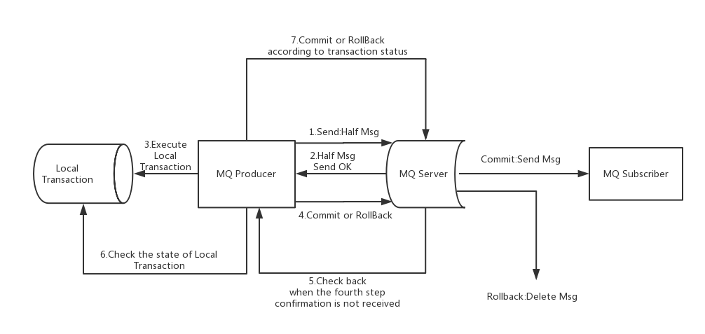

# RocketMQ

RocketMQ 是一个基于 Java 开发的，分布式队列模型的，开源的消息中间件，具有高可用、高可靠、高实时、低延迟的特点。

## 主要角色

### NameServer

NameServer 是基于 Netty 实现的路由管理、服务注册、服务发现的注册中心。与 ZooKeeper 不同的是，NameServer 集群实际上是伪集群，每个结点之间相互独立，彼此之间不会进行信息通信。
NameServer 被设计为无状态的，运行时在内存中维护了 Broker、Producer、Consumer、Topic、Group 等信息，但不会持久化这些数据。

NameServer 的主要功能：

- 为 Broker 提供服务注册发现
- 提供 Topic 路由信息
- 可以作为控制台的操作入口

Broker 在启动时会向 NameServer 注册，保持长连接并定时进行心跳连接，定时同步 Topic 信息到 NameServer。
Producer 在发送消息时从 NameServer 中获取 Topic 的路由信息，然后将消息发送到对应的 Broker。
Consumer 也会定时从 NameServer 获取 Topic 的路由信息。

### Broker

Broker 主要负责消息存储、消息分发和消息投递，其内部维护了一个或多个 Message Queue，用于存储消息的索引，通过 CommitLog 日志文件储存消息。
每个 Broker 会与所有 Nameserver 保持长连接，定时同步 Topic 信息到 NameServer。

- 消息接收：Broker 接收到 Producer 的消息后，通过`SendMessageProcessor`类将消息写入到 CommitLog 日志文件。
- 消息分发：Broker 会通过`ReputMessageService`类启动一个线程，将 CommitLog 日志文件中的消息分到对应的 ConsumeQueue 文件以及 IndexFile 文件中。
- 消息投递：Broker 接收到 Consumer 发起获取消息的请求后，调用`PullMessageProcessor`类将 ConsumeQueue 文件中的消息返回给 Consumer。

### Producer

Producer 是消息生产者，启动服务时，会选择一个 NameServer 节点保持长连接（无心跳），定时获取 Topic 路由信息。如果当前 NameServer 不可用时，Producer 会自动尝试连接下一个 NameServer，直到有可用连接为止。
默认情况下，Producer 每隔 30 秒从 NameServer 获取所有 Topic 路由信息，这意味着，如果某个 Broker 如果崩溃故障，Producer 最多要 30 秒才能感知。
在此期间，发往该 Broker 的消息发送失败。该时间由`DefaultMQProducer`的`pollNameServerInterval`参数决定，可通过配置修改。

Producer 会通过 Topic 路由信息，与所有关联的 Broker 建立长连接（由于 RocketMQ 设计只有主节点才可以接收消息，所以只会与主节点建立长连接）。
默认情况下，Producer 每隔 30 秒向已连接的 Broker 发送心跳，该时间由`DefaultMQProducer`的`heartbeatBrokerInterval`参数决定，可通过配置修改。
Broker 每隔 10 秒钟（此时间无法更改）扫描已连接的 Producer，若某个连接超过 2 分钟（此时间无法更改）没有发送心跳数据，则主动关闭连接。

#### 负载均衡

Producer 发送消息时，默认会轮询目标 Topic 下的所有 Message Queue，并采用递增取模的方式往不同的 Message Queue 上发送消息，以达到让消息平均落在不同的队列的目的。
由于 Message Queue 是分布在不同的 Broker 上的，所以消息也会发送到不同的 Broker 上。

#### 发送策略

Producer 发送消息有三种策略：

- 同步：发出消息后，必须等待接收方发回响应，才能执行下一个发送消息操作。一般用于重要的消息通知，如重要的通知邮件或者营销短信等。
- 异步：发出消息后，通过异步回调接收方发回响应，不阻塞下一个发送消息操作。一般用于可能链路耗时较长而对响应时间比较敏感的场景，如视频上传后通知启动转码服务。
- 单向：只负责发送消息，而不等待接收方发送响应，且没有异步回调。适合那些耗时比较短且对可靠性要求不高的场景，例如日志收集。

### Consumer

Consumer 是消息消费者，启动服务时，会选择一个 NameServer 节点保持长连接（无心跳），定时获取 Topic 路由信息。如果当前 NameServer 不可用时，Consumer 会自动尝试连接下一个 NameServer，直到有可用连接为止。
默认情况下，Consumer 每隔 30 秒从 NameServer 获取所有 Topic 路由信息，这意味着，如果某个 Broker 如果崩溃故障，Consumer 最多要 30 秒才能感知。
在此期间，发往该 Broker 的消息发送失败。该时间由`DefaultMQPushConsumer`的`pollNameServerInterval`参数决定，可通过配置修改。

Consumer 会通过 Topic 路由信息，与所有关联的 Broker 建立长连接（与主节点和从节点都会建立连接）。
默认情况下，Consumer 每隔 30 秒向已连接的 Broker 发送心跳，该时间由`DefaultMQPushConsumer`的`heartbeatBrokerInterval`参数决定，可通过配置修改。
Broker 每隔 10 秒钟（此时间无法更改）扫描已连接的 Consumer，若某个连接超过 2 分钟（此时间无法更改）没有发送心跳数据，则主动关闭连接。
并向该 Consumer Group 的所有 Consumer 发出通知，重新分配队列继续消费。

#### 消费获取方式

- PULL：主动从 Broker 中拉取消息进行消费，该方式需要用户自己实现，通过 Topic 获取 Message Queue 集合，然后遍历集合批量获取消息进行消费，最后记录该队列的 offset。
- PUSH：实现 MessageListener 监听器，并将监听器注册到 Broker，当消息达到 Broker 时，会触发监听器，消费者再去拉取消息进行消费。

#### 消费模式

- 集群消费：一条消息会发送给订阅某个 Topic 的每个 Consumer Group 中的一个消费者实例进行消费。如果某消费者实例不可用时，分组中的其他消费者会接替它进行消费。
- 广播消费：一条消息会发送给订阅某个 Topic 的每个 Consumer Group 中的所有消费者实例进行消费。

默认是集群消费模式。

#### 负载均衡

集群消费模式下，消费者集群多个实例共同消费一个 Topic 的多个队列，一个队列只会被分配给一个消费者实例进行消费。如果某个消费者实例不可用时，分组中的其他消费者会接替它进行消费。
每当有新的消费者加入到分组中时，会重新分配消息队列给各个消费者。

## 核心组件

### Message

Message 是消息载体，发送或者消费消息的时候必须指定 Topic，也可以指定一个可选的 Tag 用于过滤消息，还可以添加额外的键值对。

### Topic

Topic 是消息的主题，表示一类消息的集合，是 RocketMQ 进行消息订阅的基本单位。
例如，订单消息、交易消息、物流消息等。

### Tag

Topic 是消息的标签，用于同一主题下区分不同类型的消息。来自同一业务单元的消息，可以根据不同业务目的在同一主题下设置不同标签。
标签能够有效地保持代码的清晰度和连贯性，并优化 RocketMQ 提供的查询系统。消费者可以根据Tag实现对不同子主题的不同消费逻辑，实现更好的扩展性。
例如，订单创建消息、订单取消消息、交易成功消息、交易失败消息、物理已发货消息等、物流已送达消息。

### Producer Group

表示同一类 Producer 的集合，这类 Producer 发送同一类消息且发送逻辑一致。如果发送的是事务消息且原始生产者在发送之后崩溃，则 Broker 服务器会联系同一生产者组的其他生产者实例以提交或回溯消费。

### Consumer Group

表示同一类 Consumer 的集合，这类 Consumer 通常消费同一类消息且消费逻辑一致。消费者组使得在消息消费方面，实现负载均衡和容错的目标变得非常容易。
要注意的是，消费者组的消费者实例必须订阅完全相同的 Topic。

### Message Queue

一个 Topic 可以划分成多个消息队列。Topic 只是个逻辑上的概念，消息队列是消息的物理管理单位，当发送消息的时候，Broker 会轮询包含该 Topic 的所有消息队列，然后将消息发出去。
通过消息队列，可以使得消息的存储可以分布式集群化，具有了水平的扩展能力。

## 高可用

### 多主模式

由多个主节点组成集群，单个主节点宕机或者重启对应用没有影响。

优点：所有模式中性能最高。在多主的架构体系下，一个 Topic 的分布在不同的主节点的，方便进行横向拓展。

缺点：单个主节点宕机期间，未被消费的消息在节点恢复之前不可用，消息的实时性就受到影响。

### 多主多从同步复制模式

由多个主节点组成集群，且每个主节点都有至少一个从节点。消费者可以通过从节点消费消息，但是不能接收生产者发送的消息。此外，还可以用于数据备份。

对数据要求较高的场景，主从同步复制方式，保存数据热备份，通过异步刷盘方式，保证 RocketMQ 高吞吐量。

优点：主从同步复制模式能保证数据不丢失。

缺点：发送单个消息响应时间会略长，性能相比异步复制低 10% 左右。

### 多主多从异步复制模式

类似于多主多从同步复制模式，性能略有提升，但是可能会发生消息丢失。

优点：主从异步复制模式性能和多主模式接近。

缺点：使用异步复制的同步方式有可能会有消息丢失的问题。

### DLedger 模式

RocketMQ 4.5 版本引入 DLedger，增加了一种全新的复制方式。在写入消息的时候，要求至少消息复制到半数以上的节点之后，才给客户端返回写入成功，并且支持通过选举来动态切换主节点的。

假如存在 1 个主节点和 2 个从节点，共 3 个节点，当主节点不可用时，2 个从节点会通过投票选出一个新的主节点来继续提供服务，相比主从的复制模式，解决了可用性的问题。
由于消息要至少复制到 2 个节点上才会返回写入成功，所以即使主节点宕机了，也至少有一个节点上的消息是和主节点一样的。
在选举时，总会把数据和主节点一样的从节点选为新的主节点，这样就保证了数据的一致性，既不会丢消息，还可以保证严格顺序。

优点：支持动态切换主节点，保证消息不会丢失。

缺点：最少需要 3 个节点才能保证数据一致性，由于至少要复制到半数以上的节点才返回写入成功，所以性能上不如多主多从复制模式。如果主节点崩溃故障，选举过程中不能提供服务。

## 事务消息

RocketMQ 4.3 版支持事务消息（Transactional Message），采用了两阶段提交的思想来实现了提交事务消息，同时增加一个补偿机制来处理二阶段超时或者失败的消息，如下图所示：



事务消息的发送及提交流程如下：

1. Producer 向 Broker 发送半消息。
2. Broker 将消息持久化之后，返回响应结果给 Producer。
3. 如果半消息发送成功，Producer 执行本地事务逻辑。
4. Producer 根据本地事务执行结果，向 Broker 提交二次确认。
    - 如果执行成功，发送 Commit 命令，Broker 将半事务消息标记为可投递，订阅方最终将收到该消息。
    - 如果执行失败，发送 Rollback 命令，Broker 删除半事务消息，订阅方将不会接收该消息。

在网络不稳定或者是应用重启的情况下，可能导致 Producer 发送的二次确认消息未能到达 Broker，此时会通过事务消息的补偿机制处理这种情况，流程如下：

5. 如果 Broker 长时间没有收到 Commit 或 Rollback 命令，会发送一条“回查”消息给 Producer。
6. Producer 收到“回查”消息，检查本地事务执行的最终结果。
7. Producer 再次向 Broker 提交二次确认给 Broker。

> 半消息是一种特殊的消息类型，该状态的消息暂时不能被 Consumer 消费。
> 当一条事务消息被成功投递到 Broker 上，且没有接收到 Producer 发出的二次确认时，该事务消息就处于"暂时不可被消费"状态，该状态的事务消息被称为半消息。

## 消息重复消费

消息队列无法保证消息不被重复消费，需要通过业务代码实现幂等。

## 消息可靠投递

### 从 Broker 端考虑

1. 消息只要持久化到 CommitLog 日志文件中，即使 Broker 宕机，未消费的消息也能重新恢复再消费。
2. 采用同步刷盘策略，可以保证消息持久化到磁盘之后，再返回响应给生产者。
3. 采用多主多从同步复制或 DLedger 部署方案。

### 从 Producer 端考虑

1. 采用同步发送方式，发送一条消息并等待返回响应结果，如果返回结果为失败，则可以重试或抛出业务异常。
    - 发送成功，说明消息已经投递
    - 发送失败，可以重试或抛出异常
    - 发送超时，可以通过通过查询日志判断是否已经投递
2. 采用事务消息的投递方式。

### 从 Consumer 端考虑

1. Consumer 维护可持久化的 offset，用于标记已经完成消费的消息为止。
2. 保证业务处理完成后再返回 ACK，如果消费者在处理过程中发生崩溃故障，RocketMQ 会将消息分配给别的消费者去处理。

## 消息顺序消费

普通顺序消费模式下，消费者通过同一个消息队列（即一个 Topic 分区）收到的消息是有顺序的，不同消息队列收到的消息则可能是无顺序的。
所以只要生产者将消息确保投递到同一个消息队列中即可。假设，存在一个场景需要保证订单消息能被顺序消费，示例如下：

首先，实现`MessageQueueSelector`接口的`select`方法，通过传入订单`id`通过取模，返回对应的消息队列。

```java
class OrderedMessageQueueSelector implements MessageQueueSelector {
    @Override
    public MessageQueue select(List<MessageQueue> list, Message message, Object o) {
        long id = (long) o;
        return list.get((int) (id % list.size()));
    }
}
```

然后，在发送消息时候，指定该选择器，并传入订单`id`值。

```java
producer.send(msg, selector, id);
```

如此一来，同一个订单`id`，就会被放到同一个消息队列中，然后消费者通过实现`MessageListenerOrderly`接口进行消费即可。

```java
consumer.registerMessageListener(new MessageListenerOrderly() {
    @Override
    public ConsumeOrderlyStatus consumeMessage(List<MessageExt> list, ConsumeOrderlyContext context) {
       context.setAutoCommit(true);
       for (MessageExt msg : list) {
            // 通过日志可以发现每个消息队列都有唯一一个消费者线程
            log.debug("Thread: {}, Queue: {}, Message: {}", Thread.currentThread().getName(), msg.getQueueId(), msg.getBody());
       }
       return ConsumeOrderlyStatus.SUCCESS;
    }
});
```

## 延迟队列

通过源码可以发现 RocketMQ 默认只支持 18 个延迟级别：

```java
public class MessageStoreConfig {
    private String messageDelayLevel = "1s 5s 10s 30s 1m 2m 3m 4m 5m 6m 7m 8m 9m 10m 20m 30m 1h 2h";
}
```

> 可以通过配置文件修改`messageDelayLevel`延迟级别，修改完成后重启 RocketMQ 即可。

这样做的原因：RocketMQ 会把消息按照延迟时间段发送到指定的队列中，然后定时对这些队列进行轮询。如果发现消息到期，就把该消息发送到指定 Topic 的队列中。
因为同一延迟队列中消息的延迟时间是一致的，且消息是按照消息到期时间升序排序的，所以可以保证消息消费的有序性。

在 Broker 启动的时候，默认情况下，会根据 18 个延迟级别分别创建 18 个 DeliverDelayedMessageTimerTask 定时任务，在任务执行的时候，调度任务会计算距离下一次的延迟时间，然后创建一个新的定时任务。

由于 Timer 是单线程的，在延迟级别数量多的情况下可能会出现一系列问题，所以在 RocketMQ 4.9.2 之后的版本，使用了 ScheduledExecutorService 代替 Timer 执行定时任务，~~通过 scheduleWithFixedDelay 方法代替创建创建大量非必要对象，降低 GC 压力~~。

## 消息积压

消息积压一般是由于消费者的消费速度远小于生产者发送消息的速度，导致消息队列中存在大量消息。

1. 消费者代码实现存在缺陷。解决方案：修改代码。
2. 受限于数据库的性能瓶颈。解决方案：优化数据库操作。
3. 受限于其他服务的性能瓶颈。解决方案：待上游服务解决。
4. 突发场景，如：优惠活动导致订单暴增，热点事件。解决方案：消费者临时扩容。

## 整体架构与核心组件

### RocketMQ 的总体架构由哪些组件构成？各自职责是什么？

Apache RocketMQ 的总体架构主要由以下几个核心组件构成，每个组件在消息的生产、传输和消费过程中都承担特定的职责：

1. Producer（消息生产者）
    - 职责：负责将业务系统中产生的消息发送到 RocketMQ 中。
    - 特点：
        - 可以同步、异步或单向发送消息。
        - 支持消息重试、超时控制、事务消息等机制。
        - 与 NameServer 通信以获取 Broker 的路由信息，然后直接将消息发送到对应的 Broker。
2. NameServer（命名服务）
    - 职责：充当轻量级的注册中心，负责管理 Broker 的路由信息。
    - 工作机制：
        - Broker 启动后会定期向 NameServer 注册自己的信息（如 IP、端口、主题等）。
        - Producer 和 Consumer 启动时从 NameServer 获取最新的路由信息。
    - 特点：
        - NameServer 是无状态的，可以集群部署。
        - 各节点间相互独立，无需数据同步。
3. Broker（消息存储服务器）
    - 职责：负责接收、存储、转发消息，是 RocketMQ 的核心。
    - 功能模块：
        - 消息存储模块：将消息持久化到磁盘中（CommitLog、ConsumeQueue）。
        - 消息转发模块：为消费者提供消息拉取服务。
        - 消息过滤与查询：支持按 tag、key 等条件查询消息。
    - 特点：
        - 支持主从架构（Master/Slave）实现高可用。
        - 提供异步复制、刷盘机制等保证可靠性。
4. Consumer（消息消费者）
    - 职责：从 Broker 拉取或被推送消息，并进行消费处理。
    - 类型：
        - Push 模式：Broker 主动将消息推送给消费者。
        - Pull 模式：消费者主动轮询 Broker 拉取消息。
    - 消费模式：
        - 集群消费（Cluster）：消息在多个消费者之间负载均衡。
        - 广播消费（Broadcast）：每个消费者都能收到完整的消息集。
    - 支持顺序消费与消息重试机制。
5. Topic 与 Message Queue（逻辑与物理分区）
    - Topic：逻辑上的消息分类，用于区分不同类型的消息。
    - Message Queue（队列）：
        - 每个 Topic 下包含多个 Message Queue。
        - Producer 会根据路由信息将消息发送到某个队列；
        - Consumer 根据负载均衡策略消费这些队列。
6. Optional：Controller（主控节点）
   从 RocketMQ 5.x 开始引入的新组件（选配）
    - 职责：协调 Broker 的主从切换，实现自动故障转移。
    - 特点：类似 ZooKeeper 的协调功能，但更轻量、与 RocketMQ 紧密集成。

架构工作流程简述：

1. Broker 启动 → 向 NameServer 注册。
2. Producer 启动 → 从 NameServer 获取 Broker 路由信息。
3. Producer 发送消息 → 将消息写入 Broker 的 CommitLog。
4. Consumer 启动 → 从 NameServer 获取路由信息，向 Broker 拉取消息。
5. 消息消费完成 → 提交消费进度，供后续恢复或重平衡使用。

如果你需要，我可以帮你画一张 RocketMQ 架构图（包含 Producer、NameServer、Broker、Consumer 之间的交互流程）。是否需要？

### NameServer 的路由信息是怎么维护和更新的？Broker 如何向 NameServer 报活？

### Producer、Consumer、Broker、NameServer 之间的交互流程分别是什么？

### RocketMQ 如何保证高可用架构？哪些组件是无状态的？哪些是有状态的？

### Describe the internal networking model（Netty remoting）以及它的线程模型设计。

## 消息存储机制（Store / CommitLog）

### RocketMQ 为何选择顺序写 CommitLog？文件结构是怎样的？

1. 顺序写的磁盘特性优势
    - 磁盘顺序写性能极高：
      传统机械硬盘（HDD）的顺序写性能可以达到上百 MB/s，而随机写往往只有几 MB/s。
    - 操作系统页缓存（PageCache）优化：
      RocketMQ 利用操作系统 PageCache，将写入先落入内存，之后由 OS 异步刷盘（fsync 或 flush）。
      因此实际写入路径是“顺序写入内存 + 异步顺序刷盘”，性能接近内存操作。
2. 简化并发控制，提高吞吐
    - 所有 Topic、Queue 的消息统一写入同一个 CommitLog 文件序列（而不是为每个队列单独建文件）。
    - 这样可以避免复杂的锁竞争和文件定位问题，仅需维护一个全局写指针。
    - 写入路径极为简单：`append → OS PageCache → 异步刷盘（flushDiskService）`
3. 保证消息顺序与一致性
    - 顺序写天然保证消息物理顺序与写入顺序一致。
      在 CommitLog 中，消息按照时间顺序排列。
    - 即使系统崩溃，重新启动后也能通过文件偏移恢复写入点（reputFromOffset），
      确保消息不丢不乱。

### CommitLog / ConsumeQueue / IndexFile 的存储结构和职责分别是什么？

#### 一、CommitLog（消息主体存储）

##### 职责

- 存储所有消息的原始数据（Body + Properties + Topic + QueueId 等）；
- 是 RocketMQ 的唯一消息写入入口；
- 提供 顺序写入，保证写性能；
- 为 ConsumeQueue 和 IndexFile 提供数据源。

##### 存储结构

- 单一文件序列（多个 commitlog 文件顺序组成，文件名为偏移量起点，默认每个文件 1GB）；
- 消息写入采用 追加写 模式；
- 每条消息格式大致如下：

```mathematica
| TotalSize | MagicCode | BodyCRC | QueueId | Flag | QueueOffset |
| PhysicalOffset | SysFlag | BornTimestamp | BornHost | StoreTimestamp |
| StoreHost | ReconsumeTimes | PreparedTransactionOffset |
| BodyLength | BodyData | TopicLength | Topic | PropertiesLength | Properties |
```

##### 特点

- 顺序写，写入效率高；
- 内存映射（mmap）+ PageCache 提升 IO 性能；
- 消息通过偏移量定位。

#### 二、ConsumeQueue（消息逻辑队列）

##### 职责

- 是 CommitLog 的逻辑索引文件；
- 记录每个 Topic 下每个 MessageQueue 的消息逻辑顺序；
- 消费者从 ConsumeQueue 读取消息（而非直接读 CommitLog）；
- 提供快速定位到 CommitLog 的消息位置。

##### 存储结构

- 每个 Topic 的每个 Queue 对应一个 ConsumeQueue 文件目录；
- 文件名按逻辑偏移量命名；
- 每条记录固定长度 20 字节：

```python
| 8 bytes: CommitLog offset | 4 bytes: Message size | 8 bytes: Tag hashCode |
```

##### 特点

- 定长结构，随机访问效率高；
- 按逻辑顺序存储，消费端按偏移量顺序读取；
- 依赖 CommitLog 的物理偏移量实现消息定位。

#### 三、IndexFile（消息索引文件）

##### 职责

- 提供 按 Key 或时间范围 查询消息的能力；
- 辅助功能（非消费路径必须），主要用于消息追踪或查询。

##### 存储结构

- 固定大小（默认 400MB）的索引文件；
- 包含三个主要部分：
    - Header（索引元信息）；
    - Hash Slot Table（默认 500w 个槽）；
    - Index Linked List（索引条目链表）。

每个索引条目结构：

```
| KeyHash | CommitLogOffset | TimestampDiff | NextIndexOffset |
```

##### 特点

- 采用 Hash 索引（支持 hash 冲突链表）；
- 能通过 Key 快速定位消息在 CommitLog 中的物理位置；
- 支持时间区间查询。

#### 四、三者关系

```
                ┌───────────────────────────┐
                │        Producer 写入       │
                └────────────┬──────────────┘
                             │
                             ▼
                     ┌───────────────┐
                     │   CommitLog   │  ←  顺序写入消息体
                     └───────────────┘
                             │
        ┌────────────────────┼────────────────────┐
        ▼                                         ▼
┌───────────────┐                         ┌─────────────────┐
│ ConsumeQueue  │  ←  逻辑索引 (QueueOffset→CommitLogOffset) │ IndexFile │ ← Key/时间 索引
└───────────────┘                         └─────────────────┘
        │
        ▼
消费者按队列顺序读取消息
```

#### 总结对比表

| 文件类型         | 存储内容                       | 作用           | 写入模式   | 查询方式   | 是否必须  |
|--------------|----------------------------|--------------|--------|--------|-------|
| CommitLog    | 消息全量数据                     | 持久化消息主体      | 顺序写    | 物理偏移   | ✅     |
| ConsumeQueue | CommitLog 偏移、消息大小、tag hash | 消费队列索引       | 顺序写    | 逻辑偏移   | ✅     |
| IndexFile    | Key → CommitLog 偏移         | 按 Key / 时间查询 | Hash 写 | Hash 查 | ❌（辅助） |

CommitLog（主文件） ←→ ConsumeQueue（二级索引） ←→ IndexFile（辅助索引）

### 消息刷盘（Flush）机制：同步刷盘、异步刷盘具体是怎么实现的？

### 磁盘顺序写为什么在机械硬盘上高效？如果是SSD会怎么样

#### 一、机械硬盘（HDD）上的顺序写为何高效

1. 机械特性决定性能瓶颈
   机械硬盘的读写依赖磁头在盘片上移动定位。一个完整的随机写操作需要：
    - 寻道（seek）：磁头移动到目标磁道（几毫秒级）；
    - 旋转等待（rotation latency）：等待盘片转到目标扇区；
    - 写入数据。
      👉 这两个前置步骤（寻道 + 旋转）是机械延迟的主要来源，耗时远大于实际写数据的时间。
2. 顺序写消除了机械延迟
   Kafka 的日志是**追加写（append-only）**模式，新的消息不断写入文件末尾。这样：
    - 磁头几乎不需要移动；
    - 数据块连续写入；
    - 操作系统能用写缓冲、页缓存、甚至 DMA（直接内存访问）做批量写入。
      💡 结果：磁盘的写吞吐率接近其理论极限带宽（例如 150 MB/s），而非随机写下的几十 KB/s。
3. 操作系统缓存与磁盘预读写
   因为是顺序访问，OS 可以启用写回缓存（write-back cache）和预读（readahead），进一步减少 I/O 调用次数，提高吞吐。

#### 二、如果换成 SSD（固态硬盘）

1. SSD 没有寻道延迟
   SSD 读写依靠电子电路，不存在机械运动，所以随机 I/O 延迟极小（通常 <0.1 ms）。
   因此 SSD 在随机写时的性能下降远小于 HDD。
2. 顺序写仍然更高效
   虽然 SSD 不怕随机写，但顺序写依然有优势：
    - 写放大（write amplification）更低：顺序写能减少内部擦写次数；
    - 控制器优化：许多 SSD 控制器在顺序访问时能触发大页写入模式；
    - GC（垃圾回收）压力更小。
      所以在 SSD 上，Kafka 的顺序写依然能更好地利用 SSD 带宽，减少写放大，提高寿命。
3. 性能差距变小
   不同的是：在 SSD 上，随机写和顺序写性能差距缩小，Kafka 的 I/O 模型不会像在 HDD 那样获得数量级的性能提升，但依然受益于批量 I/O 与零拷贝机制。

### PageCache 在 RocketMQ 中的作用？mmap + PageCache 为什么大幅提高吞吐？

### CommitLog 的文件切分策略是什么？单文件大小为什么是 1GB？

### 消息存储时采用的序列化格式是什么？字段布局是怎样的？

### 主从复制机制（Replicas）：SYNC_MASTER / ASYNC_MASTER 的区别、复制流程和一致性保证。

### 长期运行后 CommitLog 文件会积累大量垃圾吗？RocketMQ 如何做文件清理（删除策略）？

### ConsumeQueue 是如何做到快速定位消息的？如何处理 ConsumeQueue 损坏或丢失？

### IndexFile 的内部结构、构建流程、hash 冲突如何解决？

## 事务消息（Transactional Message）

### RocketMQ 事务消息整体流程（半消息、事务回查、状态提交）是如何运作的？

### 事务消息的本地事务执行与 Broker 回查机制如何实现？

### 哪些场景会触发事务回查？如何避免频繁回查？

### 事务消息在集群下如何处理 Broker 故障？

### 与普通 MQ 的最终一致性方案相比，RocketMQ 事务消息的优势与限制是什么？

## 消息发送机制

### Producer 的负载均衡策略有哪些？

### 顺序消息在 RocketMQ 中是如何实现的？

RocketMQ 顺序消息分局部顺序和全局顺序：

1. 局部顺序：同一个业务 Key（如订单ID）的消息顺序得到保证，不同 Key 之间可以并发执行。
2. 全局顺序：所有消息进入同一个队列，消费者单线程消费。（不推荐）

#### 生产者端：按 Key 将消息路由到固定队列

```java
SendResult sendResult = producer.send(msg, new MessageQueueSelector() {
    @Override
    public MessageQueue select(List<MessageQueue> mqs, Message msg, Object arg) {
        Long orderId = (Long) arg;
        int index = (int) (orderId % mqs.size());  // 同一订单ID永远进入同一个队列
        return mqs.get(index);
    }
}, orderId);
```

- RocketMQ 一个 Topic 下有多个 Queue
- MessageQueueSelector 确保 同一 orderId 进入同一个 queue
- 同一 queue 的消息顺序一定被保留

#### 消费者端：开启顺序消费模式

使用 MessageListenerOrderly（不是 MessageListenerConcurrently）：

```java
consumer.registerMessageListener(new MessageListenerOrderly() {
    @Override
    public ConsumeOrderlyStatus consumeMessage(List<MessageExt> msgs, ConsumeOrderlyContext context) {
        for (MessageExt msg : msgs) {
            System.out.println("顺序消费消息：" + new String(msg.getBody()));
        }
        return ConsumeOrderlyStatus.SUCCESS;
    }
});
```

- 每个队列由消费者端的 一个消费线程 顺序处理
- 同一队列不会被并发消费
- 多个队列之间仍可以并发

RocketMQ 内部通过 锁队列（Rebalance Lock） 来保证不会多个消费者并发消费同一队列。

MessageQueue 扩容后，原有 hash 规则会失效，顺序无法保证。

虽然不能直接扩容，但可以采用“迁移式扩容”的方式。

1. 暂停发消息
2. 等待现有队列消费完
3. 删除 Topic，重新创建（新的 queueSize）
4. 重新开始发消息

顺序不会破坏，但需要停机窗口。

### 为什么尽量不要使用全局顺序消息？

性能差

### 重试消息（retry topic）是如何运作的？为什么要创建 %RETRY% 主题？

### 发送消息时如何保证幂等性？

### 一个消息从 Producer 到 Broker，通信协议是怎样的？关键报文字段有哪些？

## 消息消费机制

### PushConsumer 与 PullConsumer 的底层机制区别是什么？

### 为什么 RocketMQ 的 PushConsumer 本质是长轮询（long polling）？具体流程是什么？

### 消息消费位点（offset）如何管理？广播模式与集群模式的 offset 存储有什么区别？

### Rebalance 的具体流程是什么？哪些情况下会触发 Rebalance？

### 消费幂等性如何保证（消费端 OR 业务端）？

### 消费失败重试机制怎么实现？延迟级别是什么？为什么不是任意时间？

### 延时消息（ScheduleMessage）是如何实现的？底层如何用 Timing wheel 替代？（5.x 提升）

## Broker 运行机制与线程模型

### Broker 的重要线程池有哪些？各自职责是什么？

### 磁盘读写路径（零拷贝、mmap、刷盘）如何对应到线程模型？

### Broker 如何处理高并发写入时的堆外内存 & fileChannel？

### Broker 如何处理消息过期？

### Broker 选举机制（如 DLedger）原理是什么？如何实现强一致性？

## 集群部署与高可用

### 多 Master 多 Slave 模式对吞吐提升和可用性的影响是什么？

### 主从切换期间，未复制完成的数据如何处理？

### 同步复制中 master 崩溃可能导致什么问题？

### 一致性与可用性在 RocketMQ 中是如何取舍的？

## 调优与性能

### 怎么排查 RocketMQ 中的高 sendRT、storeRT、dispatchRT？

### Broker 参数中哪些对吞吐影响最大（transientStorePoolEnable、flushDiskType 等）？

### 如何优化 PageCache 命中率？

### JVM 参数如何影响 RocketMQ？是否建议使用 G1？

### 大量堆外内存（DirectBuffer）如何排查泄漏？

### 延时消息堆积会导致什么问题？如何优化？

## 运维与故障排查

### 如何排查消息丢失？包括写入丢失、消费丢失、offset 回退等情况。

### 如何排查消息堆积？通常的指标有哪些？

### Broker 崩溃常见原因？如何分析 core dump？

### 如何查看 commitlog 文件中的消息内容？

### 消费延迟监控指标有哪些？如何用命令和 Dashboard 定位问题？

### NameServer 不一致会产生哪些问题？如何检测？

## 源码分析（面试加分）

### 解释 RocketMQ remoting 的请求处理流程（Netty + Future + Callback）。

### 讲出 CommitLog.putMessage 的核心逻辑（文件定位、append、CRC、sync flush）。

### RebalanceImpl：Rebalance 的具体算法是什么？

### PullRequest 挂起逻辑（长轮询触发）在源码中的实现点在哪里？

### DLedger 主从复制核心代码逻辑。

### ScheduleMessageService 的延时消息处理内部流程。

## 生产最佳实践（开放式问题）

### 如何设计一个高吞吐、高可用的消息系统架构？RocketMQ 在其中如何部署？

### 什么情况下应该使用事务消息？什么情况下不推荐？

### 如何设计幂等性机制（基于消息 ID？业务主键？状态机？）。

### 如何评估 RocketMQ 的吞吐、延迟、消息堆积能力？

#### 一、核心性能指标定义

| 指标                         | 含义                                  | 典型关注点       |
|----------------------------|-------------------------------------|-------------|
| **吞吐量（Throughput）**        | 每秒成功处理的消息数（TPS 或 MB/s）              | 评估系统峰值处理能力  |
| **延迟（Latency）**            | 从消息发送到消费完成的时间（端到端延迟）                | 是否满足业务实时性要求 |
| **堆积能力（Backlog Capacity）** | 在高峰期 Producer 速度高于 Consumer 时的积压承受力 | 消息丢失风险、恢复速度 |

#### 二、测试环境与准备

1. 硬件环境
    - Broker 部署：建议使用至少 3 台机器形成集群（异步复制或同步双写）。
    - 网络：保证低延迟、千兆以上带宽。
    - 磁盘：推荐 NVMe SSD，禁用交换分区，确保 I/O 稳定。
2. 软件环境
    - RocketMQ 版本 ≥ 5.x
    - Java 版本 11 或更高。
    - 开启 sendLatencyEnable=true、flushDiskType=ASYNC_FLUSH（可调）。
3. 工具选择
    - 官方性能测试工具：org.apache.rocketmq.example.benchmark.Producer 和 Consumer。
    - 也可以用自定义 Java Producer/Consumer 或 mqadmin 命令。

#### 三、吞吐量测试方法

1. Producer 吞吐测试

```
sh bin/tools.sh org.apache.rocketmq.example.benchmark.Producer -t testTopic -a 32 -s 1000 -c 1000000
```

参数说明：

- -a：并发线程数
- -s：消息大小（字节）
- -c：消息总数
  观察指标：
- TPS（每秒发送消息数）
- SendRT（发送平均耗时）
- Broker CPU / I/O 使用率

2. Consumer 吞吐测试

```
sh bin/tools.sh org.apache.rocketmq.example.benchmark.Consumer -t testTopic -g testGroup
```

观察指标：

- 消费速率（consumeTPS）
- Rebalance 时间
- 消费延迟（通过 RocketMQ Console 查看）

#### 四、延迟测试方法

1. 在 Producer 发送消息时打上时间戳（消息体或属性中）。
2. Consumer 处理时计算 System.currentTimeMillis() - sendTimestamp。
3. 可通过以下指标统计：
    - 平均延迟（Avg Latency）
    - 95/99 分位延迟（P95/P99）
    - 最坏延迟（Max Latency）
      使用示例：

```
long latency = System.currentTimeMillis() - msg.getBornTimestamp();
```

#### 五、消息堆积能力测试

1. 压测步骤：
    - 降低 Consumer 消费速率（例如限制线程或模拟慢消费）。
    - Producer 持续高并发发送。
    - 观察 mqadmin statsAll 输出中的 DiffTotal（堆积数量）。
2. 重点关注指标：
    - 最大可堆积消息量（磁盘空间限制）。
    - Broker 落盘速率（MB/s）。
    - 消费恢复速度（当 Consumer 恢复时 TPS 上升情况）。
3. 典型现象分析：
    - 消息堆积过多时，ConsumeQueue 和 CommitLog 文件变大。
    - 观察 store.log 是否出现刷盘慢、page cache 命中率低等。

### 如何在分布式微服务中利用 MQ 解决一致性与削峰？

### 多 Region / 多 IDC 部署时如何解决延迟与一致性问题？

## Kafka vs RocketMQ

### Kafka 更适合的场景

| 场景                                  | 说明                                         |
|-------------------------------------|--------------------------------------------|
| **大规模日志采集 / 数据管道（Data Pipeline）**   | Kafka 的吞吐量极高（百万级 / 秒），特别适合日志、埋点、指标等连续流式数据。 |
| **大数据生态（Hadoop / Spark / Flink）集成** | Kafka 在大数据组件中拥有天然支持，是事实上的数据输入标准。           |
| **高吞吐、弱事务依赖的消息系统**                  | 如果业务不要求严格的消息顺序、可靠事务，Kafka 性能最优。            |
| **流计算系统的数据输入**                      | Kafka + Flink/Storm 是业界经典组合。               |

### RocketMQ 更适合的场景

| 场景                            | 说明                          |
|-------------------------------|-----------------------------|
| **业务系统中的可靠消息（如订单、支付、库存）**     | RocketMQ 提供强一致性、严格顺序消息、低延迟。 |
| **需要消息事务（分布式事务）**             | RocketMQ 原生支持事务消息，是业界最成熟实现。 |
| **需要丰富的消息特性（消息轨迹、定时消息、延时消息）** | RocketMQ 对业务友好的特性更多。        |
| **云原生、轻量化部署**                 | RocketMQ 本身更易部署、运维成本低。      |

### 核心差异总结

| 对比项             | Kafka                | RocketMQ             |
|-----------------|----------------------|----------------------|
| **性能**          | 超高吞吐，GB/s 级别         | 吞吐高，但略低于 Kafka       |
| **消息模型**        | Pub/Sub              | Pub/Sub（支持 Tag 精确过滤） |
| **消息顺序性**       | Partition 层级顺序，可控性一般 | 原生支持严格顺序             |
| **消息事务**        | 支持但复杂度高、使用少          | 原生事务消息实现成熟           |
| **延时消息 / 定时消息** | 无（需外部实现）             | 原生支持多级延时             |
| **消息堆积能力**      | 强                    | 强                    |
| **存储机制**        | 文件系统顺序写 + PageCache  | 类似，但更灵活、延迟更低         |
| **大数据生态**       | 完美融入                 | 较弱                   |
| **部署复杂度**       | 较高（Zookeeper）        | 较低                   |
| **典型使用**        | 日志、流计算               | 业务事件、金融系统            |

### 实际项目案例

1. 电商系统（订单、支付）更适合 RocketMQ
2. 大型互联网 APP 行为埋点，更适合 Kafka
3. 跨服务的延迟触发任务（短信、订单超时）更适合 RocketMQ
4. 公司内部的用户行为流 + 离线分析，更适合 Kafka
5. 银行/金融行业微服务事件驱动，更适合 RocketMQ

总结一句话：

- Kafka：追求吞吐、数据流、大数据处理
- RocketMQ：追求可靠、顺序、事务、延迟消息的业务场景