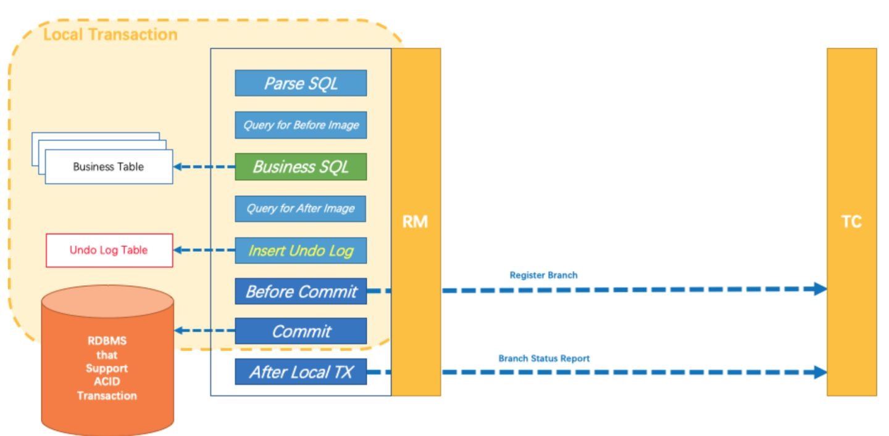
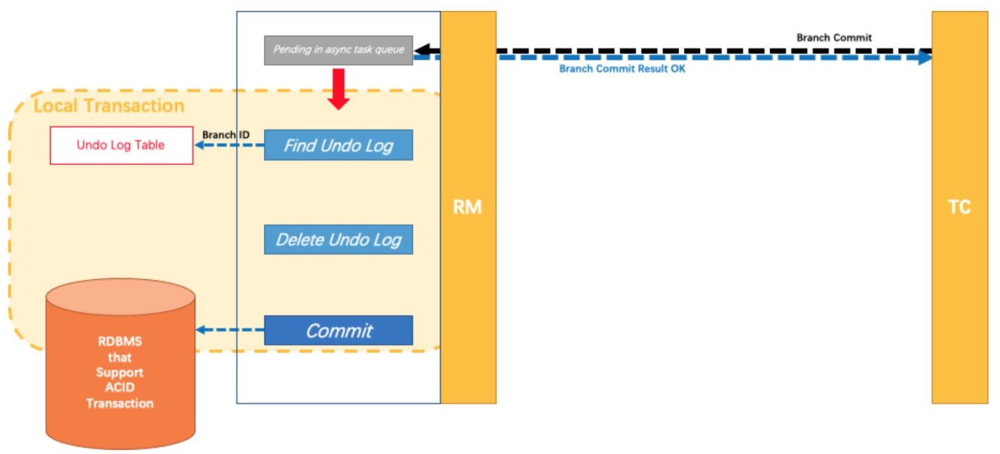
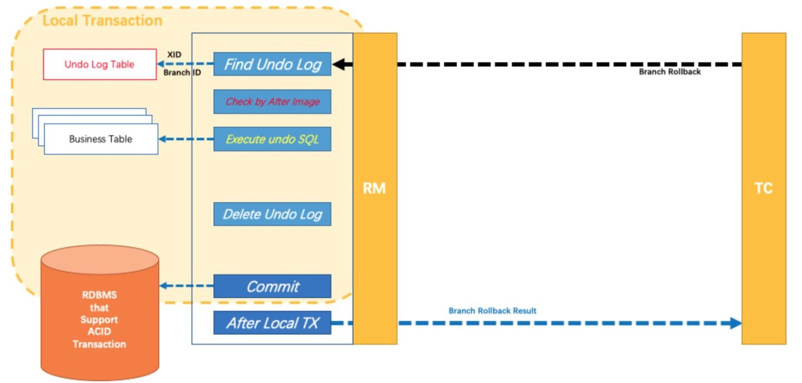
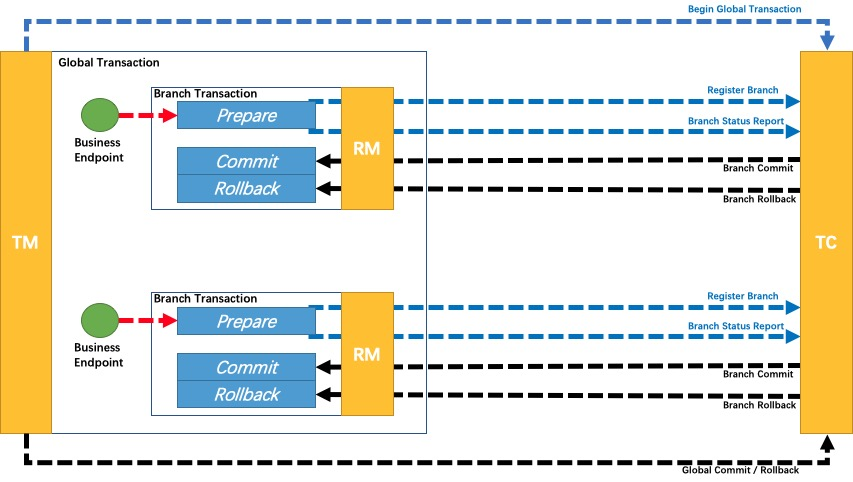
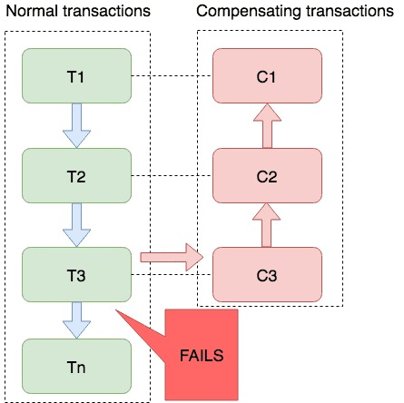
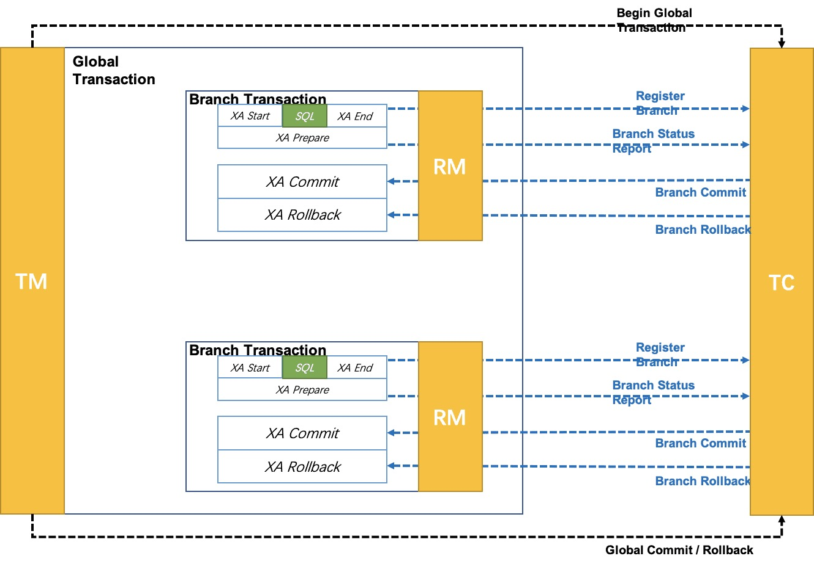

# Seata

Seata 是一款开源的分布式事务解决方案，致力于提供高性能和简单易用的分布式事务服务。Seata 将为用户提供了 AT、TCC、SAGA 和 XA 事务模式，为用户打造一站式的分布式解决方案。 image

## 术语

### TC (Transaction Coordinator) - 事务协调者

维护全局和分支事务的状态，驱动全局事务提交或回滚。

### TM (Transaction Manager) - 事务管理器

定义全局事务的范围：开始全局事务、提交或回滚全局事务。

### RM (Resource Manager) - 资源管理器

管理分支事务处理的资源，与TC交谈以注册分支事务和报告分支事务的状态，并驱动分支事务提交或回滚。

## AT 模式

Seata AT 模式是一种无侵入的分布式事务解决方案。在 AT 模式下，用户只需关注自己的“业务 SQL”，用户的 “业务 SQL” 就是全局事务一阶段，Seata 会自动生成事务的二阶段提交和回滚操作。

### 前提

- AT 模式基于支持本地 ACID 事务的关系型数据库。
- Java 应用，通过 JDBC 访问数据库。

### 整体机制

两阶段提交协议的演变：

- 一阶段：业务数据和回滚日志记录在同一个本地事务中提交，释放本地锁和连接资源。
- 二阶段：提交异步化，非常快速地完成。回滚通过一阶段的回滚日志进行反向补偿。

#### 一阶段

Seata 的 JDBC 数据源代理通过对业务 SQL 的解析，把业务数据在更新前后的数据镜像保存成回滚日志，利用本地事务的 ACID 特性，将业务数据的更新和回滚日志的写入在同一个本地事务中提交。
这样，可以保证任何提交的业务数据的更新一定有相应的回滚日志存在。

然后，本地事务在提交之前, 还需要通过 RM 向 TC 注册本地分支，这个注册过程中会根据刚才执行的 SQL 拿到所有涉及到的数据主键，以 resourceId + tableName + rowPK 作为锁的 key，向 TC 申请所有涉及数据的写锁，
当获得所有相关数据的写锁后，再执行本地事务的 commit 过程。如果有任何一行数据的写锁没有拿到的话，TC 会以 fast-fail 的方式回复该 RM，RM 会以重试 + 超时机制重复该过程，直到超时。

完成本地事务后，RM 会向 TC 汇报本地事务的执行情况，并完成业务 RPC 的调用过程。



#### 二阶段

如果 TM 决议是全局提交，此时分支事务实际上已经完成提交，TC 立刻释放该全局事务的所有锁，然后异步调用 RM 清理回滚日志，二阶段可以非常快速地完成。



如果决议是全局回滚，RM 收到协调器发来的回滚请求，通过 XID 和 Branch ID 找到相应的回滚日志记录，通过回滚记录生成反向的更新 SQL 并执行，以完成分支的回滚。当分支回滚顺利结束时，通知 TC 回滚完成，这时候 TC 才释放该分支事务相关的所有锁。



### 回滚日志表

使用 Seata 前需要创建回滚日志表，不同数据库在类型上会略有差别，以 MySQL 为例：

```sql
CREATE TABLE `undo_log`
(
    `id`            bigint(20) NOT NULL AUTO_INCREMENT,
    `branch_id`     bigint(20) NOT NULL,
    `xid`           varchar(100) NOT NULL,
    `context`       varchar(128) NOT NULL,
    `rollback_info` longblob     NOT NULL,
    `log_status`    int(11) NOT NULL,
    `log_created`   datetime     NOT NULL,
    `log_modified`  datetime     NOT NULL,
    PRIMARY KEY (`id`),
    UNIQUE KEY `ux_undo_log` (`xid`,`branch_id`)
) ENGINE=InnoDB AUTO_INCREMENT=1 DEFAULT CHARSET=utf8;
```

## TCC 模块

TCC 模式需要用户根据自己的业务场景实现 Try、Confirm 和 Cancel 三个操作。
事务发起方先在 TC 中注册全局事务，然后在一阶段执行 Try 方法，在二阶段提交的话 TC 会去执行各个 RM 的 Confirm 方法，二阶段回滚则 TC 会去执行各个 RM 的 Cancel 方法。



在微服务架构下，很有可能出现网络超时、重发，机器宕机等一系列的异常场景。一旦遇到这些情况，就会导致我们的分布式事务执行过程出现异常。最常见的主要是这三种异常，分别是空回滚、幂等、悬挂。因此，TCC 模式还需要解决这三类异常。

实际上，这三类问题可以在 Seata 框架里完成，只不过现在的 Seata 框架还不具备，之后这些异常 Case 的处理会被移植到 Seata 框架里，业务就无需关注这些异常情况，专注于业务逻辑即可。

### 空回滚

空回滚是对于一个分布式事务，在没有调用 TCC 资源 Try 方法的情况下（如机器宕机、网络异常），调用了二阶段的 Cancel 方法，Cancel 方法需要识别出这是一个空回滚，然后直接返回成功。

触发场景：注册分支事务是在调用 RPC 时，Seata 框架的切面会拦截到该次调用请求，先向 TC 注册一个分支事务，然后才去执行 RPC 调用逻辑。如果 RPC 调用逻辑有问题，比如调用方机器宕机、网络异常，都会造成 RPC 调用失败，即未执行 Try 方法。但是分布式事务已经开启了，需要推进到终态，因此，TC 会回调参与者二阶段 Cancel 接口，从而形成空回滚。

解决方案：创建一张额外的事务控制表，包含分布式事务 ID 和分支事务 ID，第一阶段 Try 方法里会插入一条记录，表示一阶段执行了。Cancel 接口里读取该记录，如果该记录存在，则正常回滚；如果该记录不存在，则是空回滚。

### 幂等

幂等是对于同一个分布式事务的同一个分支事务，重复去调用该分支事务的第二阶段接口，因此，要求 TCC 的二阶段 Confirm 和 Cancel 接口保证幂等，不会重复使用或者释放资源。如果幂等控制没有做好，很有可能导致资损等严重问题。

触发场景：提交或回滚是一次 TC 到参与者的网络调用。因此，网络故障、参与者宕机等都有可能造成参与者 TCC 资源实际执行了二阶段防范，但是 TC 没有收到返回结果的情况，这时，TC 就会重复调用，直至调用成功，整个分布式事务结束。

解决方案：记录每个分支事务的执行状态。在执行前状态，如果已执行，那就不再执行；否则，正常执行。前面在讲空回滚的时候，已经有一张事务控制表了，事务控制表的每条记录关联一个分支事务，那我们完全可以在这张事务控制表上加一个状态字段，用来记录每个分支事务的执行状态。

### 悬挂

悬挂是对于一个分布式事务，其二阶段 Cancel 接口比 Try 接口先执行。因为允许空回滚的原因，Cancel 接口认为 Try 接口没执行，空回滚直接返回成功，对于 Seata 来说，认为分布式事务的二阶段接口已经执行成功，整个分布式事务就结束了。
也就是说，当出现这种情况时，该分布式事务第一阶段预留的业务资源就再也没有人能够处理了，对于这种情况，我们就称为悬挂，即业务资源预留后没有被继续处理。

触发场景：在 RPC 调用时，先注册分支事务，再执行 RPC 调用，如果此时 RPC 调用的网络发生拥堵，通常 RPC 调用是有超时时间的，RPC 超时以后，发起方就会通知 TC 回滚该分布式事务，可能回滚完成后，RPC 请求才到达参与者，真正执行，从而造成悬挂。

解决方案：二阶段执行时插入一条事务控制记录，状态为已回滚，这样当一阶段执行时，先读取该记录，如果记录存在，就认为二阶段已经执行；否则二阶段没执行。

## Saga 模式

Saga 模式是 Seata 提供的长事务解决方案，在 Saga 模式中，业务流程中每个参与者都提交本地事务，当出现某一个参与者失败则补偿前面已经成功的参与者，一阶段正向服务和二阶段补偿服务都由业务开发实现。

有点像是 TCC 模式将 Try 过程和 Confirm 过程合并，所有参与者直接执行 Try + Confirm，如果有人失败了，就反向依次 Cancel。

该模式主要适用业务流程长、业务流程多的场景，参与者包含其他公司或遗留系统服务，无法提供 TCC 模式要求的三个接口。

主要优势：

- 一阶段提交本地事务，无锁，高性能
- 事件驱动架构，参与者可异步执行，高吞吐
- 补偿服务易于实现

缺点：

- 一阶段已经提交本地数据库事务，且没有进行“预留”动作，所以不能保证隔离性。



## XA 模式

XA 模式是 Seata 一种无侵入的分布式事务解决方案，任何实现了 XA 协议的数据库都可以作为资源参与到分布式事务中，目前主流数据库，例如：MySQL、Oracle、DB2、Oceanbase 等均支持 XA 协议。



## 总结

纵观 Seata 提供的所有分支事务模式, 除了 AT 模式和 XA 模式可以运行在读已提交的隔离级别下, 其他模式都是运行在读未提交的级别下。
在有必要时，应用需要通过业务逻辑的巧妙设定，来解决分布式事务隔离级别带来的问题，就像 TCC 模式中介绍的例子。

