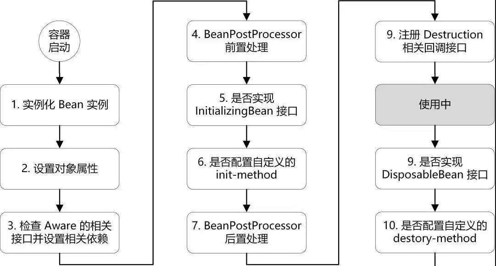

# Spring

## IoC Inversion of Control

控制反转把传统上由程序代码直接操控的对象的调用权交给容器，通过容器来实现对象组件的装配和管理。
所谓的“控制反转”概念就是对组件对象控制权的转移，从程序代码本身转移到了外部容器。Spring IoC 容器负责管理对象生命周期，通过依赖注入（DI）实现。

## AOP Aspect Oriented Programming

OOP（Object Oriented Programming）面向对象编程，允许开发者定义纵向的关系，但并不适用于定义横向的关系，可能会导致大量代码的重复，而不利于各个模块的重用。

AOP（Aspect-Oriented Programming）面向切面编程，作为面向对象的一种补充，用于将那些与业务无关，但却对多个对象产生影响的公共行为和逻辑，
抽取并封装为一个可重用的模块，这个模块被命名为“切面”（Aspect），减少系统中的重复代码，降低了模块间的耦合度，同时提高了系统的可维护性。可用于权限认证、日志、事务处理等。

### 代理模式

AOP 实现的关键在于代理模式，AOP 代理主要分为静态代理和动态代理，静态代理与动态代理区别在于生成代理对象的时机不同，通常来说静态代理具有更好的性能。

#### 静态代理

所谓静态代理，就是 AOP 框架会在编译阶段生成 AOP 代理类，因此也称为编译时增强，他会在编译阶段将切面织入到 Java 字节码中，运行的时候就是增强之后的代理对象。

静态代理的代表为 AspectJ，但是 AspectJ 需要特定的编译器进行处理。

#### Spring AOP 动态代理

所谓的动态代理，就是 AOP 框架不会去修改字节码，而是每次运行时在内存中临时为方法生成一个 AOP 对象，这个 AOP 对象包含了目标对象的全部方法，并且在特定的切点做了增强处理，并回调原对象的方法。
通常动态代理主要有两种方式，JDK 动态代理和 CGLIB 动态代理：

- JDK 动态代理只提供接口的代理，不支持类的代理。核心`InvocationHandler`接口和`Proxy`类，`InvocationHandler`接口通过`invoke()`方法反射来调用目标类中的代码，动态地将横切逻辑和业务编织在一起。`Proxy`类利用`InvocationHandler`动态创建一个符合某一接口的的实例, 生成目标类的代理对象。
- CGLIB 是一个代码生成的类库，可以在运行时动态的生成指定类的一个子类对象，并覆盖其中特定方法并添加增强代码。CGLIB 是通过继承的方式做的动态代理，因此如果某个类被标记为`final`，那么它是无法使用 CGLIB 做动态代理的。

_主要注意的是，Spring AOP 使用的 CGLIB 是内置的库，位于`spring-core`的`org.springframework.cglib`包下。_

### 为什么 Spring AOP 使用动态代理而不是静态代理

通常来说静态代理比静态代理具有更好的性能，因为静态代理是通过在编译器编译阶段将切面织入到 Java 字节码中，而动态代理则是在运行时创建一个代理对象，通过反射实现。

既然静态代理性能更好，为什么 Spring AOP 反而选择了动态代理呢？

由于静态代理是编译时增强，所以通常需要特定的编译器，使用 AspectJ 则需要先安装相应的环境，如果 Spring AOP 也通过这种方式，则会给开发者带来极大的不便，实际上 Spring AOP 仅使用了 AspectJ 部分 API 实现动态代理。

另外，Spring AOP 支持`@EnableLoadTimeWeaving`注解，通过字节码编辑技术在类加载期将切面织入目标类中，
在目标类的`class`文件被 JVM 加载前，通过自定义类加载器或者类文件转换器将横切逻辑织入到目标类的`class`文件中，然后将修改后`class`文件交给 JVM 加载，这种织入方式可以简称为`LoadTimeWeaving`。

### Spring AOP 分别在什么时候使用 JDK 动态代理和 CGLIB 动态代理

Spring 会根据被代理的类自动选择 JDK 动态代理还是 CGLIB 动态代理。
如果类实现了接口，则默认使用 JDK 动态代理，如果类没有实现接口，且没有被`final`关键字修饰，则使用 CGLIB 动态代理。

但是在 Spring Boot 2.x 之后的版本中，而是默认使用 CGLIB 动态代理。

[Use @EnableTransactionManagement(proxyTargetClass = true) #5423](https://github.com/spring-projects/spring-boot/issues/5423)

> We should use `@EnableTransactionManagement(proxyTargetClass = true)` to prevent nasty proxy issues when people aren't using interfaces.

有开发者提出：在使用接口时，应该使用`@EnableTransactionManagement(proxyTargetClass = true)`防止出现讨厌的代理问题，即全部使用 CGLIB 动态代理而不是使用 JDK 动态代理。

假设有一个`FooService`接口和`FooServiceImpl`实现类，我们通常会通过以下方式注入：

```java
@Autowired
FooService fooService;
```

在这种情况下，无论是使用 JDK 动态代理，还是 CGLIB 都不会出现问题。

但是如果使用 JDK 动态代理，选择直接注入`FooServiceImpl`实现类:

```java
@Autowired
FooServiceImpl fooService;
```

启动 Spring Boot 时会报错：

```
***************************
APPLICATION FAILED TO START
***************************

Description:

The bean 'fooService' could not be injected because it is a JDK dynamic proxy

The bean is of type 'jdk.proxy2.$Proxy169' and implements:
	com.test.service.FooService
	org.springframework.aop.SpringProxy
	org.springframework.aop.framework.Advised
	org.springframework.core.DecoratingProxy

Expected a bean of type 'com.test.service.impl.FooServiceImpl' which implements:
	com.test.service.FooService


Action:

Consider injecting the bean as one of its interfaces or forcing the use of CGLib-based proxies by setting proxyTargetClass=true on @EnableAsync and/or @EnableCaching.
```

因为 JDK 动态代理是基于接口的，代理对象只能赋值给接口变量。而 CGLIB 就不存在这个问题，因为 CGLIB 是通过继承生成子类来实现的，代理对象无论是赋值给接口还是实现类这两者都是代理对象的父类。

Spring Boot 正是出于这种考虑，于是在 2.x 版本中，将 AOP 默认实现改为了 CGLIB 动态代理。

总结：

- Spring 5.x 中 AOP 默认依旧使用 JDK 动态代理。
- Spring Boot 2.x 开始，为了解决使用 JDK 动态代理可能导致的类型转化异常而默认使用 CGLIB。

如果需要默认使用 JDK 动态代理可以通过启动参数`spring.aop.proxy-target-class=false`来进行修改。

关于 Spring Boot 2.x 开始，`@EnableTransactionManagement(proxyTargetClass = false)`注解不生效的问题，也有开发者表示无法理解，具体可以在 Github Issues 了解：

[Default CGLib proxy setting default cannot be overridden by using core framework annotations (@EnableTransactionManagement, @EnableAspectJAutoProxy) #12194](https://github.com/spring-projects/spring-boot/issues/12194)

> 据我所知，这是我第一次遇到 Spring Boot 不尊重标准用户配置的情况，这打破了“Spring Boot 填补了配置空白并尊重您明确配置的内容”的描述。

## Bean

### 生命周期

Spring 中通过`BeanDefinition`类描述 Bean 的信息。Spring 容器启动的时候，会扫描 XML、注解和配置中需要被 Spring 创建的 Bean 信息，然后将这些信息封装成`BeanDefinition`对象形式保存在`beanDefinitionMap`中，接着会遍它进行创建对象操作

Bean 的生命周期大致分为四个阶段：

1. 实例化
2. 注入属性
3. 初始化
    1. 如果 Bean 实现了`Aware`相关接口，则进行对应的逻辑处理，例如：`BeanNameAware`接口的`setBeanName`方法、`ApplicationContextAware`接口的`setApplicationContext`方法。
    2. 如果容器中存在实现了`BeanPostProcessor`接口的对象，则调用`postProcessBeforeInitialization`方法。
    3. 如果 Bean 中存在`@PostConstruct`注解修饰的方法，则调用该方法。（支持多个）
    4. 如果 Bean 实现了`InitializingBean`接口，则调用`afterPropertiesSet`方法。
    5. 如果声明了`init-method`方法，则调用该方法。（通过 XML 声明）
    6. 如果容器中存在实现了`BeanPostProcessor`接口的对象，则调用`postProcessAfterInitialization`方法。
4. 销毁
    1. 如果 Bean 实现了`DisposableBean`接口，则调用`destroy`方法。
    2. 如果声明了`destroy-method`方法，则调用该方法。（通过 XML 声明）



### 三级缓存

Spring 中使用了三级缓存解决了单例循环依赖和代理的问题。

```
public class DefaultSingletonBeanRegistry extends SimpleAliasRegistry implements SingletonBeanRegistry {
    private final Map<String, Object> singletonObjects = new ConcurrentHashMap(256);
    private final Map<String, Object> earlySingletonObjects = new ConcurrentHashMap(16);
    private final Map<String, ObjectFactory<?>> singletonFactories = new HashMap(16);
}
```

| 名称                      | 级别    | 说明                            |
|:------------------------|:------|:------------------------------|
| `singletonObjects`      | 第一级缓存 | 保存已初始化的完整单例对象                 |
| `earlySingletonObjects` | 第二级缓存 | 保存未初始化的半成品单例对象                |
| `singletonFactories`    | 第三级缓存 | 存放完成品单例对象，用与生成半成品单例对象并放入到二级缓存 |

#### 二级缓存能否解决循环引用？

如果存在`对象A`和`对象B`互相依赖，通过二级缓存解决循环引用：

|     | 对象A                                        | 对象B                            |
|:----|:-------------------------------------------|:-------------------------------|
| 1   | 实例化`对象A`                                   |                                |
| 2   | 将`对象B`注入到`对象A`中，发现`对象B`不存在，先将`对象A`放入半成品缓存中 |                                |
| 3   |                                            | 实例化`对象B`                       |
| 4   |                                            | 将`对象A`注入到`对象B`中，从半成品缓存中获取`对象A` |
| 5   |                                            | 初始化完成，将`对象B`放入完成品缓存中           |
| 6   | 重试将`对象B`注入到`对象A`中，从完成品缓存中获取`对象B`           |                                |
| 7   | 初始化完成，将`对象A`从半成品缓存中移动至完成品缓存中               |                                |

如果`对象A`和`对象B`需要动态代理，可以在实例化时立即创建代理，并将代理对象放入缓存中。

为了验证上述流程，我们对`AbstractAutowireCapableBeanFactory`类的源码进行略微改造：

```java
protected Object doCreateBean(String beanName, RootBeanDefinition mbd, @Nullable Object[] args)
        throws BeanCreationException {
    // ...

    boolean earlySingletonExposure = (mbd.isSingleton() && this.allowCircularReferences &&
            isSingletonCurrentlyInCreation(beanName));
    if (earlySingletonExposure) {
        if (logger.isTraceEnabled()) {
            logger.trace("Eagerly caching bean '" + beanName +
                    "' to allow for resolving potential circular references");
        }
        addSingletonFactory(beanName, () -> getEarlyBeanReference(beanName, mbd, bean));

        // 新增一行代码，立即从三级缓存取出对象放入二级缓存（从三级缓存中取出的对象，可能是新创建的代理对象）
        getSingleton(beanName, true);
    }

    // ...
}
```

将实例化的对象在放入三级缓存之后，立刻将对象移动至二级缓存，如此以来，三级缓存的作用就被跳过了，就相当于只有二级缓存。
经过测试，结果是可行的，并且从源码上分析可以得出两种方式性能是一样的。二级缓存就可以解决循环引用的问题，为什么 Spring 选择使用三级缓存方式？

#### 为什么 Spring 使用三级缓存？

第三级缓存的作用就是：产生了一个工厂对象，但是并没有真实的利用这个工厂立即创建代理对象，也就是代理对象的创建是延迟的。

通常来讲，代理对象是在对象初始化之后返回的，如果要使用二级缓存解决循环依赖，意味着对象在实例化完后就创建代理对象，动态代理流程就被提前到了初始化之前，导致生命周期不明确，这样违背了 Spring 设计原则。

Spring 将 AOP 和 Bean 的生命周期结合，是在 Bean 创建完全之后通过`AnnotationAwareAspectJAutoProxyCreator`后置处理器来完成的，在后置处理器的`postProcessAfterInitialization`方法中对初始化后的 Bean 进行动态代理。
如果出现了循环依赖，才会让这个代理对象被提前创建。从设计模式的角度说，动态代理是一种设计模式，动态代理的主要工作是增强，而不是构造。

#### 三级缓存循环引用的代理单例示例

如果存在`对象A`和`对象B`互相依赖，且都需要代理的话，创建流程如下：

|     | 对象A                                   | 对象B                                                                                        |
|:----|:--------------------------------------|:-------------------------------------------------------------------------------------------|
| 1   | 实例化`对象A`                              |                                                                                            |
| 2   | 将`对象A`封装为`ObjectFactory`放入第三级缓存中      |                                                                                            |
| 3   | 准备将`对象B`注入到`对象A`中，发现`对象B`不存在，先处理`对象B` |                                                                                            |
| 4   |                                       | 实例化`对象B`                                                                                   |
| 5   |                                       | 将`对象B`封装为`ObjectFactory`放入第三级缓存中                                                           |
| 6   |                                       | 从第三级缓存中获取`对象A`的`ObjectFactory`，并创建`对象A代理`，将`对象A`的`ObjectFactory`从第三级缓存中移除，将`对象A代理`放入第二级缓存中 |
| 7   |                                       | 将`对象A代理`注入到`对象B`中                                                                          |
| 8   |                                       | 完成`对象B`初始化                                                                                 |
| 9   |                                       | 创建`对象B代理`，将`对象B`的`ObjectFactory`从第三级缓存中移除，将`对象B代理`放入第一级缓存中                                 |
| 10  | 从第一级缓存中获取`对象B代理`                      |                                                                                            |
| 11  | 将`对象B代理`注入到`对象A`中                     |                                                                                            |
| 12  | 完成`对象A`初始化                            |                                                                                            |
| 13  | 将`对象A代理`从第二级缓存中移除，将`对象A代理`放入第一级缓存中    |                                                                                            |

## Transactional

在 Spring 中可以使用`@Transactional`注解启用事务。

### 事务传播 Propagation

1. REQUIRED（默认）：如果当前存在事务，则加入该事务，如果当前不存在事务，则创建一个新的事务。
2. SUPPORTS：如果当前存在事务，则加入该事务；如果当前不存在事务，则以非事务的方式继续运行。
3. MANDATORY：如果当前存在事务，则加入该事务；如果当前不存在事务，则抛出异常。
4. REQUIRES_NEW：重新创建一个新的事务，如果当前存在事务，挂起当前的事务。
5. NOT_SUPPORTED：以非事务的方式运行，如果当前存在事务，挂起当前的事务。
6. NEVER：以非事务的方式运行，如果当前存在事务，则抛出异常。
7. NESTED：如果没有，就新建一个事务；如果有，就在当前事务中嵌套其他事务。

这里特别介绍一下 REQUIRED 和 NESTED 的区别。

首先定义两个方法均为 REQUIRED 传播方式：`insert()`和`update()`

```java
@Transactional(propagation = Propagation.REQUIRED)
public void insert() {
    Foo foo = new Foo(1L, "foo");
    dao.insert(foo);
    try {
        // 这里必须通过代理对象调用
        proxy.update();
    } catch (Exception e) {
        logger.error("", e);
    }
}

@Transactional(propagation = Propagation.REQUIRED)
public void update(Foo foo) {
    foo.setName("bar");
    dao.update(foo);
    throw new RuntimeException();
}
```

运行结果：`update()`方法抛出异常事务回滚，由于`insert()`方法是同一个事务，因此两者都会回滚，所以数据库中无数据插入。

然后将`update()`方法传播方式改为 NESTED，如下：

```
@Transactional(propagation = Propagation.NESTED)
public void update(Foo foo) {
    foo.setName("bar");
    dao.update(foo);
    throw new RuntimeException();
}
```

运行结果：`update()`方法抛出异常事务回滚，`insert()`方法执行成功，所以数据库中有数据插入，且`name`值为`"foo"`。

这就是 NESTED 传播方式的特性，能让事务部分回滚。NESTED 会创建一个嵌套事务，它是已经存在事务的一个真正的子事务。
嵌套事务开始执行时，它将取得一个`savepoint`。嵌套事务失败时，将回滚到`savepoint`。嵌套事务是外部事务的一部分, 随着外部事务一起提交，如果外部事务回滚，嵌套事务也会跟着回滚。
