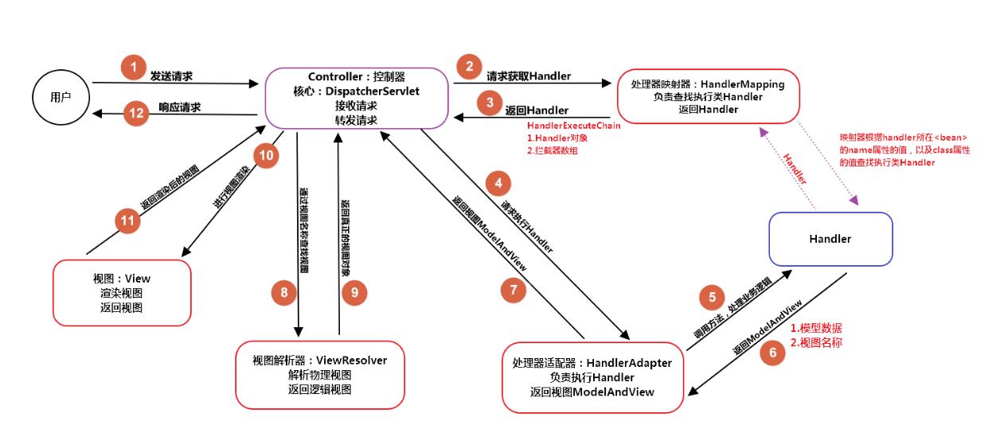

# Spring MVC

Spring MVC 是 Spring 框架的子项目，遵循 Model-View-Controller (MVC) 设计模式，用于开发 Web 应用程序。底层的实现基于 Servlet API。

## 核心组件

- DispatcherServlet：前端控制器，基于 HttpServlet 实现，用于接收请求和响应结果，能够减少了其它组件之间的耦合度。
- HandlerMapping：处理器映射器，用于映射请求和 Handler 对象的接口，返回 HandlerExecutionChain 对象，包含 Handler 对象和若干 HandlerInterceptor 对象。
- HandlerAdapter：处理器适配器，用于执行 HandlerMapping 返回的 Handler。
- Handler：处理器，即需要开发者实现具体的代码。
- ViewResolver：视图解析器，用于解析逻辑上的视图名称，返回 View 对象。
- View：视图接口，用于渲染各种类型的视图，如：JSON、XML、PDF、freemarker等。

## 主要流程



1. DispatchServlet 接收客户端的请求。
2. DispatchServlet 调用 HandlerMapping 的 getHandler() 方法获取 Handler，返回 HandlerExecutionChain 对象，包含 Handler 对象和若干 HandlerInterceptor 对象。
3. DispatchServlet 调用 HandlerAdapter 的 handle() 方法处理 Handler 和拦截器，返回 ModelAndView 对象，包含 Model 对象、 View 对象和 HTTP 状态码。
4. DispatchServlet 调用 ViewResolver 的 resolveViewName() 方法解析视图，返回已经解析完成的 View 对象。
5. DispatchServlet 返回响应给客户端。

## 常用注解

- `@Controller`：带该注解的类表示是一个控制器，Spring 容器会创建一个单例对象。
- `@RestController`：等同于`@Controller`加`@ResponseBody`。
- `@RequestMapping`：用于处理请求映射的的注解，既可用于类上，也可用于方法上。当作用于类上时，表示当前类中的所有请求方法都会生效。
- `@GetMapping`：等同于`@RequestMapping(method = RequestMethod.GET)`。
- `@PostMapping`：等同于`@RequestMapping(method = RequestMethod.POST)`。
- `@PutMapping`：等同于`@RequestMapping(method = RequestMethod.PUT)`。
- `@PatchMapping`：等同于`@RequestMapping(method = RequestMethod.PATCH)`。
- `@DeleteMapping`：等同于`@RequestMapping(method = RequestMethod.DELETE)`。
- `@ResponseBody`：不会将返回结果解析为跳转路径，通常返回`JSON`、`XML`或`PLAIN TEXT`等类型的数据给客户端。
- `@ResponseStatus`：指定返回给客户端的 HTTP 状态码。
- `@RequestHeader`：用于接收客户端以`Headers`形式传入的参数。
- `@RequestBody`：用于接收客户端以`Body`形式传入的参数。（注意，浏览器通常不支持以`GET`方法传`Body`）
- `@RequestParam`：用于接收客户端以`QueryString`形式传入的参数。
- `@PathVariable`：用于接收客户端以`URI`模板变量形式传入的参数。
- `@ControllerAdvice`：用于增强`@Controller`和`@RestController`，将定义在该类中的行为，应用到所有控制器。
- `@RestControllerAdvice`：等同于`@ControllerAdvice`加`@ResponseBody`。
- `@ExceptionHandler`：用于处理控制器中抛出的各种异常，通常配合`@ControllerAdvice`和`@RestControllerAdvice`实现全局异常处理功能。
- `@InitBinder`：用于注册自定义参数解析，通常配合`@ControllerAdvice`和`@RestControllerAdvice`实现全局参数解析功能。

## 拦截器

Spring MVC 支持实现自定义拦截器，对指定的请求进行拦截。拦截器`HandlerInterceptor`接口包含三个方法：

- `preHandle`：执行 Handler 前会调用该方法。返回`true`时，继续执行下一个拦截器或执行 Handler 本身；返回`false`时，中断请求，直接返回响应。
- `postHandle`：执行 Handler 后会调用该方法。
- `afterCompletion`：渲染完视图之后会调用该方法，主要用于清理资源。

```java
public interface HandlerInterceptor {
    default boolean preHandle(HttpServletRequest request, HttpServletResponse response, Object handler) throws Exception {
        return true;
    }

    default void postHandle(HttpServletRequest request, HttpServletResponse response, Object handler, @Nullable ModelAndView modelAndView) throws Exception {
    }

    default void afterCompletion(HttpServletRequest request, HttpServletResponse response, Object handler, @Nullable Exception ex) throws Exception {
    }
}
```

拦截器通常用于：接口安全认证、接口权限校验等。

示例：

新建一个类，实现`HandlerInterceptor`接口：

```java
public class FooHandlerInterceptor implements HandlerInterceptor {
    public boolean preHandle(HttpServletRequest request, HttpServletResponse response, Object handler) throws Exception {
        // TODO
        return true;
    }

    public void postHandle(HttpServletRequest request, HttpServletResponse response, Object handler, ModelAndView modelAndView) throws Exception {
        // TODO
    }

    public void afterCompletion(HttpServletRequest request, HttpServletResponse response, Object handler, Exception ex) throws Exception {
        // TODO
    }
}
```

新建一个配置类，实现`WebMvcConfigurer`接口，重写`addInterceptors`方法，将拦截器注册到 Spring MVC 容器中：

```
@Configuration
public class FooConfiguration implements WebMvcConfigurer {
    @Override
    public void addInterceptors(InterceptorRegistry registry) {
        registry.addInterceptor(new FooHandlerInterceptor()).addPathPatterns("/**");
    }
}
```

## 异常处理

示例：

```java
@RestControllerAdvice
public class ExceptionControllerAdvice {

    @ResponseStatus(HttpStatus.BAD_REQUEST)
    @ExceptionHandler
    public Object handleMethodArgumentNotValidException(MethodArgumentNotValidException e) {
        // 处理参数校验未通过异常
    }

    @ResponseStatus(HttpStatus.BAD_REQUEST)
    @ExceptionHandler
    public Object handleBindException(BindException e) {
        // 处理参数数据绑定异常
    }

    @ResponseStatus(HttpStatus.BAD_REQUEST)
    @ExceptionHandler
    public Object handleMissingServletRequestParameterException(MissingServletRequestParameterException e) {
        // 处理参数不存在异常
    }

    @ExceptionHandler
    public Object handleBizException(BizException e) {
        // 处理自定义业务异常
    }

    @ExceptionHandler
    public Object handleException(Exception e) {
        // 处理任意异常
    }
}
```